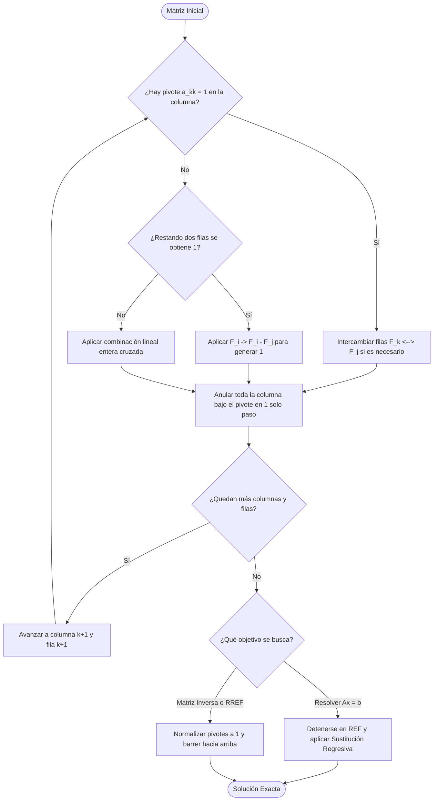

# Matrices

> [!NOTE]
> Una **matriz de orden $m \times n$** es un arreglo rectangular de números en $m$ filas y $n$ columnas, y constituye la herramienta central para representar y resolver sistemas de ecuaciones lineales y transformaciones lineales.

---

## ⚡ Ficha de Consulta Rápida — Propiedades de Matrices y Determinantes

> [!tip] Resumen de Consulta Rápida (Cátedra USS — Carol Asencio G.)
> Esta tabla condensa todas las identidades y teoremas de examen para consulta inmediata durante talleres y evaluaciones.

| Categoría | Propiedades y Fórmulas Clave |
|:---|:---|
| **I. Suma y Escalar** | • $A + B = B + A$ (conmutativa)<br>• $A + (B + C) = (A + B) + C$ (asociativa)<br>• $\alpha(A + B) = \alpha A + \alpha B$ y $(\alpha + \beta)A = \alpha A + \beta A$<br>• $\alpha(\beta A) = (\alpha\beta)A$<br>• $A + \mathbf{0} = A$ y $A + (-A) = \mathbf{0}$ |
| **II. Multiplicación** | • $A(B + C) = AB + AC$ y $(A + B)C = AC + BC$<br>• $A(BC) = (AB)C$<br>• $\alpha(AB) = (\alpha A)B = A(\alpha B)$<br>• $A\mathbf{0} = \mathbf{0}A = \mathbf{0}$ y $BI = IB = B$<br>• ⚠️ **$AB \neq BA$ en general** (no conmutativa)<br>• ⚠️ **$AB = \mathbf{0} \not\implies A = \mathbf{0} \lor B = \mathbf{0}$** (existen divisores de cero)<br>• ⚠️ **$AB = AC \not\implies B = C$** (no cancelable salvo si $A$ es invertible) |
| **III. Transpuesta** | • $(A^T)^T = A$<br>• $(A + B)^T = A^T + B^T$<br>• $(AB)^T = B^T A^T$ (**invierte el orden**) |
| **IV. Matriz Inversa** | • $A^{-1}$ es **única**<br>• $(A^{-1})^{-1} = A$<br>• $(AB)^{-1} = B^{-1} A^{-1}$ (**invierte el orden**)<br>• $(\alpha A)^{-1} = \dfrac{1}{\alpha} A^{-1} \quad (\alpha \neq 0)$<br>• $(A^T)^{-1} = (A^{-1})^T$<br>• $A^{-1} = \dfrac{1}{\det(A)} \operatorname{Adj}(A) \quad (\det A \neq 0)$ |
| **V. Determinantes** | • $\det(A) = \det(A^T)$<br>• $\det(\alpha A) = \alpha^n \det(A)$ con $n = \text{orden de } A$<br>• $\det(AB) = \det(A)\det(B)$<br>• $\det(I) = 1$ y $\det(A^k) = [\det(A)]^k$<br>• $\det(A^{-1}) = \dfrac{1}{\det(A)}$<br>• Fila/columna nula, igual o proporcional $\implies \det(A) = 0$<br>• Intercambiar 2 filas/columnas $\implies$ cambia de signo ($-\det$)<br>• Sumar múltiplo de una fila a otra $\implies$ **no varía** el $\det$<br>• Triangular / Diagonal $\implies \det(A) = \prod_{i=1}^n a_{ii}$<br>• $A$ es singular $\iff \det(A) = 0$; $A$ no singular (invertible) $\iff \det(A) \neq 0$ |
| **VI. Matriz Ortogonal** | • $A^T = A^{-1} \iff A A^T = A^T A = I$<br>• Consecuencia: $\det(A) = \pm 1$ |
| **VII. Simétricas y Antisimétricas** | • **Simétrica:** $A^T = A \iff a_{ij} = a_{ji}$<br>• **Antisimétrica:** $A^T = -A \iff a_{ij} = -a_{ji}$ (diagonal principal $a_{ii} = 0$) |
| **VIII. Idempotentes y Nilpotentes** | • **Idempotente:** $A^2 = A$ (autovalores $\lambda \in \{0, 1\}$)<br>• **Nilpotente:** $\exists\, k \in \mathbb{Z}^+$ tal que $A^k = \mathbf{0}$<br>• **Índice de Nilpotencia:** el menor entero positivo $k$ tal que $A^k = \mathbf{0}$ |

---

## 1. Definición y Tipos de Matrices

### 1.1 Definición y Notación

Una **matriz de orden $m \times n$** con coeficientes en un cuerpo $\mathbb{K}$ (usualmente $\mathbb{K} = \mathbb{R}$ o $\mathbb{K} = \mathbb{C}$) es un arreglo rectangular de $m$ filas y $n$ columnas:

$$
A = (a_{ij}) = \begin{pmatrix}
a_{11} & a_{12} & \dots & a_{1n} \\
a_{21} & a_{22} & \dots & a_{2n} \\
\vdots & \vdots & \ddots & \vdots \\
a_{m1} & a_{m2} & \dots & a_{mn}
\end{pmatrix} \in \mathcal{M}_{m\times n}(\mathbb{K})
$$

donde $a_{ij}$ es el elemento ubicado en la **fila $i$** y la **columna $j$**, con $1 \le i \le m$ y $1 \le j \le n$.

- **Orden:** $m \times n$ (filas × columnas). Si $m = n$ se dice **cuadrada de orden $n$**.
- **Conjunto:** $A \in \mathcal{M}_{m\times n}(\mathbb{K})$ (y $\mathcal{M}_n(\mathbb{K})$ para matrices cuadradas).
- **Igualdad de matrices:** dos matrices $A$ y $B$ son iguales ($A = B$) **si y solo si** tienen el mismo orden y $a_{ij} = b_{ij}$ para todos los pares $(i,j)$, es decir, coinciden coeficiente a coeficiente en todas las posiciones.

> [!example]
> $A = \begin{pmatrix} 4 & -2 & 1 & 0 \\ 1 & 3 & -5 & 9 \end{pmatrix}$ es de orden $2\times4$. Aquí $a_{11}=4$, $a_{23}=-5$; $a_{32}$ **no existe** (solo hay 2 filas). La matriz $B = \begin{pmatrix} 4 & -2 \\ 1 & 3 \end{pmatrix}$ **no es igual** a $A$: tiene distinto orden.

### 1.2 Tipos de Matrices

| Tipo | Orden | Característica | Ejemplo |
|:---|:---:|:---|:---|
| **Nula** $\mathbf{0}$ | cualquiera | todos sus elementos son 0 | $\begin{pmatrix} 0 & 0 \\ 0 & 0 \end{pmatrix}$ |
| **Cuadrada** | $n\times n$ | $m = n$ | $\begin{pmatrix} 1 & 2 \\ 3 & 4 \end{pmatrix}$ |
| **Diagonal** | $n\times n$ | $a_{ij} = 0$ si $i \neq j$ | $\begin{pmatrix} 1 & 0 & 0 \\ 0 & 3 & 0 \\ 0 & 0 & -1 \end{pmatrix}$ |
| **Identidad** $I_n$ | $n\times n$ | diagonal con $a_{ii} = 1$ | $\begin{pmatrix} 1 & 0 \\ 0 & 1 \end{pmatrix}$ |
| **Triangular superior** | $n\times n$ | $a_{ij} = 0$ si $i > j$ | $\begin{pmatrix} 4 & 2 & 1 \\ 0 & 0 & 3 \\ 0 & 0 & 1 \end{pmatrix}$ |
| **Triangular inferior** | $n\times n$ | $a_{ij} = 0$ si $i < j$ | $\begin{pmatrix} 4 & 0 & 0 \\ 2 & 1 & 0 \\ 1 & 2 & 3 \end{pmatrix}$ |
| **Simétrica** | $n\times n$ | $A = A^t$ | $\begin{pmatrix} -1 & 2 \\ 2 & 0 \end{pmatrix}$ |
| **Antisimétrica** | $n\times n$ | $A = -A^t$ (diagonal nula) | $\begin{pmatrix} 0 & 1 \\ -1 & 0 \end{pmatrix}$ |
| **Ortogonal** | $n\times n$ | $A^t = A^{-1}$ (o $AA^t = A^tA = I_n$) | $\begin{pmatrix} \cos\theta & -\sin\theta \\ \sin\theta & \cos\theta \end{pmatrix}$ |
| **Idempotente** | $n\times n$ | $A^2 = A$ | $\begin{pmatrix} 1 & 0 \\ 0 & 0 \end{pmatrix}$ |
| **Nilpotente** (de índice $k$) | $n\times n$ | $\exists\, k \in \mathbb{Z}^+$: $A^k = \mathbf{0}$ | $\begin{pmatrix} 0 & 1 \\ 0 & 0 \end{pmatrix}$ (índice 2) |

**Diagonal principal:** los elementos $a_{ii}$ con $i = j$.

**Traza:** suma de los elementos de la diagonal principal:

$$
\operatorname{tr}(A) = \sum_{i=1}^{n} a_{ii}
$$

Propiedades: $\operatorname{tr}(A+B) = \operatorname{tr}(A) + \operatorname{tr}(B)$, $\operatorname{tr}(\alpha A) = \alpha\,\operatorname{tr}(A)$, $\operatorname{tr}(A^t) = \operatorname{tr}(A)$, $\operatorname{tr}(AB) = \operatorname{tr}(BA)$.

> [!abstract] Matriz Ortogonal 🎓 [Cátedra USS / Diapositivas Docente]
> Una **matriz ortogonal** es una matriz cuadrada real $A \in \mathcal{M}_n(\mathbb{R})$ que cumple:
>
> $$
> A^T = A^{-1} \quad \Longleftrightarrow \quad A A^T = A^T A = I_n
> $$
>
> **Interpretación geométrica:** sus columnas (y filas) forman una **base ortonormal** de $\mathbb{R}^n$; multiplicar por $A$ preserva normas y productos internos (una rotación o reflexión).
>
> **Demostración de que $\det(A) = \pm 1$:** tomando determinantes en $A A^T = I_n$,
>
> $$
> \det(A A^T) = \det(I_n) \implies \det(A)\,\det(A^T) = 1 \implies [\det(A)]^2 = 1 \implies \det(A) = \pm 1
> $$
>
> donde se usó $\det(A^T) = \det(A)$. **Cuidado:** el recíproco es falso ($\det(A) = \pm 1$ no basta para que $A$ sea ortogonal).

> [!abstract] Matriz Idempotente 🎓 [Cátedra USS / Diapositivas Docente]
> Una **matriz idempotente** es una matriz cuadrada $A \in \mathcal{M}_n(\mathbb{K})$ que cumple:
>
> $$
> A^2 = A
> $$
>
> **Ejemplo canónico:** la matriz proyección
>
> $$
> P = \begin{pmatrix} 1 & 0 \\ 0 & 0 \end{pmatrix}, \qquad P^2 = \begin{pmatrix} 1 & 0 \\ 0 & 0 \end{pmatrix}\begin{pmatrix} 1 & 0 \\ 0 & 0 \end{pmatrix} = P
> $$
>
> **Propiedades:**
> - Si $A$ es idempotente e **invertible**, entonces $A = I_n$: de $A^2 = A$ se premultiplica por $A^{-1}$ y se obtiene $A^{-1}A^2 = A^{-1}A \implies A = I_n$.
> - Los únicos autovalores posibles de $A$ son $\lambda \in \{0, 1\}$: si $A\mathbf{v} = \lambda\mathbf{v}$ con $\mathbf{v} \neq \mathbf{0}$, entonces $A^2\mathbf{v} = A\mathbf{v} \implies \lambda^2\mathbf{v} = \lambda\mathbf{v} \implies \lambda(\lambda - 1) = 0$.
> - $\operatorname{tr}(A)$ coincide con el número de autovalores iguales a $1$ (igual al rango para matrices simétricas de proyección).

> [!abstract] Matriz Nilpotente e Índice de Nilpotencia 🎓 [Cátedra USS / Diapositivas Docente]
> Una **matriz nilpotente** es una matriz cuadrada $A \in \mathcal{M}_n(\mathbb{K})$ para la cual existe un entero positivo $k \in \mathbb{Z}^+$ tal que:
>
> $$
> A^k = \mathbf{0}
> $$
>
> El **índice de nilpotencia** es el **menor** entero positivo $k$ que satisface $A^k = \mathbf{0}$.
>
> **Ejemplo de índice 2:**
>
> $$
> N = \begin{pmatrix} 0 & 1 \\ 0 & 0 \end{pmatrix}, \qquad N^2 = \begin{pmatrix} 0 & 1 \\ 0 & 0 \end{pmatrix}\begin{pmatrix} 0 & 1 \\ 0 & 0 \end{pmatrix} = \begin{pmatrix} 0 & 0 \\ 0 & 0 \end{pmatrix} = \mathbf{0}
> $$
>
> **Propiedades:**
> - Todo autovalor de una matriz nilpotente es $0$ (si $A\mathbf{v} = \lambda\mathbf{v}$, entonces $A^k\mathbf{v} = \lambda^k \mathbf{v} = \mathbf{0} \implies \lambda = 0$).
> - $\det(N) = 0$ y $\operatorname{tr}(N) = 0$ (consecuencia de que todos los autovalores son nulos).
> - Para una matriz nilpotente de orden $n$, el índice satisface $1 \le k \le n$.

### 1.3 Matrices Triangulares y Diagonales (Detalle)

> [!abstract] Definición Formal
> Sea $A = (a_{ij}) \in \mathcal{M}_n(\mathbb{K})$ una matriz cuadrada de orden $n$. Se dice que:
>
> - $A$ es **triangular superior** si $a_{ij} = 0 \ \forall\, i > j$ (todo elemento *bajo* la diagonal principal es nulo).
> - $A$ es **triangular inferior** si $a_{ij} = 0 \ \forall\, i < j$ (todo elemento *sobre* la diagonal principal es nulo).
> - $A$ es **diagonal** si $a_{ij} = 0 \ \forall\, i \neq j$ (solo su diagonal principal puede ser no nula).

> [!example]
> $A = \begin{pmatrix} 4 & 2 & 1 \\ 0 & -1 & 3 \\ 0 & 0 & 5 \end{pmatrix}$ es triangular superior; $B = \begin{pmatrix} 2 & 0 & 0 \\ 7 & 1 & 0 \\ 0 & 3 & 6 \end{pmatrix}$ es triangular inferior; $D = \begin{pmatrix} 1 & 0 & 0 \\ 0 & 3 & 0 \\ 0 & 0 & -1 \end{pmatrix}$ es diagonal. Observe que **toda matriz diagonal es simultáneamente triangular superior e inferior**, y que la identidad $I_n$ y la matriz nula son casos particulares.

**Propiedades algebraicas:**

1. **Cerradura:** si $A$ y $B$ son triangulares superiores (resp. inferiores), entonces $A + B$ y $AB$ son triangulares superiores (resp. inferiores). La suma conserva la forma de ceros trivialmente, y el producto también: todo sumando $a_{ik}b_{kj}$ que escape del triángulo de ceros es necesariamente nulo.
2. **Diagonales del producto:** los elementos de la diagonal de $AB$ son los productos de las diagonales de $A$ y $B$: $(AB)_{ii} = a_{ii}\, b_{ii}$ (el resto de los sumandos $a_{ik}b_{ki}$ con $k \neq i$ son nulos por la estructura triangular).
3. **Criterio de invertibilidad:** una matriz triangular es invertible **si y solo si** todos los elementos de su diagonal son no nulos; en ese caso $A^{-1}$ también es triangular del mismo tipo. En particular:
   $$
   \det(A) = \prod_{i=1}^{n} a_{ii} \neq 0 \iff A \text{ invertible}
   $$
4. **Diagonal de la inversa:** la diagonal de $A^{-1}$ contiene los inversos de la diagonal de $A$, es decir, $(A^{-1})_{ii} = 1/a_{ii}$.
5. **Autovalores:** los valores propios de una matriz triangular son exactamente los elementos de su diagonal (el polinomio característico $\det(A - \lambda I)$ es un producto de factores lineales $(a_{ii} - \lambda)$ por la propiedad anterior).
6. **Transpuesta:** $A^t$ de una triangular superior es triangular inferior, y viceversa. Por tanto, $A$ triangular $\implies A^t$ triangular.

> [!example] Verificación Numérica
> $A = \begin{pmatrix} 3 & 1 & 4 \\ 0 & -1 & 2 \\ 0 & 0 & 5 \end{pmatrix}$, $B = \begin{pmatrix} 6 & 2 & 1 \\ 0 & 3 & 5 \\ 0 & 0 & 9 \end{pmatrix}$:
>
> $$
> AB = \begin{pmatrix} 18 & 9 & 44 \\ 0 & -3 & 13 \\ 0 & 0 & 45 \end{pmatrix}, \qquad \det(A) = 3\cdot(-1)\cdot 5 = -15, \qquad (AB)_{33} = 5 \cdot 9 = 45
> $$

Aplicación clave: la **descomposición LU** factoriza cualquier matriz invertible como $A = LU$ con $L$ triangular inferior (unitaria) y $U$ triangular superior, y el algoritmo de eliminación de Gauss trabaja exactamente sobre el "triángulo de ceros" que estas matrices imponen (ver Sección 5.4). Esta es la base de `scipy.linalg.lu` y `sympy.Matrix.LUdecomposition`.

---

## 2. Álgebra de Matrices (Operaciones)

### 2.1 Suma y Resta

Dos matrices **del mismo orden** se suman (restan) componente a componente: el resultado conserva el orden y

$$
(A \pm B)_{ij} = a_{ij} \pm b_{ij}, \qquad A, B \in \mathcal{M}_{m\times n}(\mathbb{K})
$$

> [!example]
> $\begin{pmatrix} 1 & 2 \\ 3 & 4 \end{pmatrix} + \begin{pmatrix} 5 & 6 \\ 7 & 8 \end{pmatrix} = \begin{pmatrix} 6 & 8 \\ 10 & 12 \end{pmatrix}$. La suma $\begin{pmatrix} 1 & 2 \\ 3 & 4 \end{pmatrix} + \begin{pmatrix} 1 \\ 2 \end{pmatrix}$ **no está definida** (órdenes distintos).

### 2.2 Ponderación por Escalar

Multiplicar una matriz por un número real o complejo $\alpha \in \mathbb{K}$ multiplica **cada entrada** por $\alpha$:

$$
(\alpha A)_{ij} = \alpha\, a_{ij}
$$

> [!example]
> $3\begin{pmatrix} 1 & -2 \\ 0 & 4 \end{pmatrix} = \begin{pmatrix} 3 & -6 \\ 0 & 12 \end{pmatrix}$.

### 2.3 Multiplicación de Matrices

El producto $A \cdot B$ está definido **si y solo si** el número de **columnas de $A$** es igual al número de **filas de $B$**:

$$
A_{m\times n} \cdot B_{n\times p} = C_{m\times p}
$$

El elemento $c_{ij}$ se obtiene combinando la **fila $i$** de $A$ con la **columna $j$** de $B$ mediante la sumatoria:

$$
c_{ij} = \sum_{k=1}^{n} a_{ik}\, b_{kj} = a_{i1}b_{1j} + a_{i2}b_{2j} + \cdots + a_{in}b_{nj}
$$

![[Multiplicacion_matrices_fila_columna.png]]

> [!example]
> $$
> A = \begin{pmatrix} 2 & 1 & 0 \\ 1 & 0 & -1 \end{pmatrix},\qquad
> B = \begin{pmatrix} -1 & 3 \\ 0 & 1 \\ 1 & 0 \end{pmatrix}
> $$
>
> $c_{11} = 2\cdot(-1) + 1\cdot 0 + 0\cdot 1 = -2$;  $c_{12} = 2\cdot3 + 1\cdot1 + 0\cdot0 = 7$;
>
> $c_{21} = 1\cdot(-1) + 0\cdot0 + (-1)\cdot1 = -2$;  $c_{22} = 1\cdot3 + 0\cdot1 + (-1)\cdot0 = 3$.
>
> $$
> AB = \begin{pmatrix} -2 & 7 \\ -2 & 3 \end{pmatrix}
> $$

> [!warning]
> **El producto de matrices NO es conmutativo.** En general $AB \neq BA$ (aun cuando ambos productos estén definidos). Además, puede ocurrir que $AB = \mathbf{0}$ con $A \neq \mathbf{0}$ y $B \neq \mathbf{0}$: $\begin{pmatrix} 1 & 0 \\ 0 & 0 \end{pmatrix}\begin{pmatrix} 0 & 0 \\ 3 & 5 \end{pmatrix} = \begin{pmatrix} 0 & 0 \\ 0 & 0 \end{pmatrix}$.

> [!important] Divisores de Cero y Falta de Cancelabilidad 🎓 [Cátedra USS / Diapositivas Docente]
> **1. Divisores de cero.** Existen matrices no nulas cuyo producto es la matriz nula. Por ejemplo:
>
> $$
> A = \begin{pmatrix} 1 & 0 \\ 0 & 0 \end{pmatrix}, \qquad B = \begin{pmatrix} 0 & 0 \\ 0 & 1 \end{pmatrix} \implies AB = \begin{pmatrix} 0 & 0 \\ 0 & 0 \end{pmatrix} \quad \text{con } A \neq \mathbf{0} \text{ y } B \neq \mathbf{0}
> $$
>
> Por tanto, **$AB = \mathbf{0} \not\implies (A = \mathbf{0} \text{ o } B = \mathbf{0})$**. Esto rompe la analogía con el producto de números reales: $\mathcal{M}_n(\mathbb{K})$ tiene divisores de cero.
>
> **2. Falta de ley de cancelación.** De $AB = AC$ **no** se puede deducir $B = C$. La cancelación solo es válida si $A$ es **invertible**, premultiplicando por $A^{-1}$:
>
> $$
> AB = AC \implies A^{-1}AB = A^{-1}AC \implies IB = IC \implies B = C
> $$
>
> > [!example] Contraejemplo
> > $A = \begin{pmatrix} 1 & 0 \\ 0 & 0 \end{pmatrix}$, $B = \begin{pmatrix} 0 & 0 \\ 3 & 5 \end{pmatrix}$, $C = \begin{pmatrix} 0 & 0 \\ 7 & -2 \end{pmatrix}$: se cumple $AB = AC = \mathbf{0}$ pero $B \neq C$. Aquí $A$ es singular ($\det(A) = 0$), por lo que no existe $A^{-1}$.

### 2.4 Potencias de una Matriz

Para **matrices cuadradas** (solo así $A^2 = A \cdot A$ está definido) se define la potencia por **recurrencia**:

$$
A^0 = I_n, \qquad A^{k+1} = A^k \cdot A \quad (k \in \mathbb{N}_0)
$$

> [!example] Ejemplo Resuelto
> Sea $A = \begin{pmatrix} 1 & 2 \\ 0 & -1 \end{pmatrix}$. Calcular $A^0, A^1, A^2$ y $A^3$:
>
> - $A^0 = I_2 = \begin{pmatrix} 1 & 0 \\ 0 & 1 \end{pmatrix}$
> - $A^1 = A = \begin{pmatrix} 1 & 2 \\ 0 & -1 \end{pmatrix}$
> - $A^2 = A \cdot A = \begin{pmatrix} 1 & 2 \\ 0 & -1 \end{pmatrix}\begin{pmatrix} 1 & 2 \\ 0 & -1 \end{pmatrix} = \begin{pmatrix} 1\cdot1+2\cdot0 & 1\cdot2+2\cdot(-1) \\ 0\cdot1+(-1)\cdot0 & 0\cdot2+(-1)\cdot(-1) \end{pmatrix} = \begin{pmatrix} 1 & 0 \\ 0 & 1 \end{pmatrix} = I_2$
> - $A^3 = A^2 \cdot A = I_2 \cdot A = A = \begin{pmatrix} 1 & 2 \\ 0 & -1 \end{pmatrix}$
>
> Se observa la periodicidad $A^{2k} = I_2$ y $A^{2k+1} = A$ para $k \in \mathbb{N}_0$.

> [!question] Ejercicio Propuesto
> Para $A = \begin{pmatrix} 1 & 2 \\ -1 & -1 \end{pmatrix}$, determina $A^0, A^1, A^2, A^3$ y $A^4$ mostrando el paso a paso algebraico.
>
> **Guía de resolución:**
>
> - $A^0 = I_2 = \begin{pmatrix} 1 & 0 \\ 0 & 1 \end{pmatrix}$;  $A^1 = A = \begin{pmatrix} 1 & 2 \\ -1 & -1 \end{pmatrix}$
> - $A^2 = A \cdot A = \begin{pmatrix} 1\cdot1 + 2\cdot(-1) & 1\cdot2 + 2\cdot(-1) \\ (-1)\cdot1 + (-1)\cdot(-1) & (-1)\cdot2 + (-1)\cdot(-1) \end{pmatrix} = \begin{pmatrix} -1 & 0 \\ 0 & -1 \end{pmatrix} = -I_2$
> - $A^3 = A^2 \cdot A = (-I_2)\, A = -A = \begin{pmatrix} -1 & -2 \\ 1 & 1 \end{pmatrix}$
> - $A^4 = A^3 \cdot A = (-A)\,A = -(A^2) = -(-I_2) = I_2$
>
> Verificación: $A^2 = -I_2$, $A^3 = -A$ y $A^4 = I_2$, de modo que las potencias son periódicas con período 4.

### 2.5 Propiedades del Álgebra Matricial

| Propiedad | Fórmula |
|:---|:---|
| Asociatividad de la suma | $(A+B)+C = A+(B+C)$ |
| Conmutatividad de la suma | $A+B = B+A$ |
| Asociatividad del producto | $(AB)C = A(BC)$ |
| Distributividad por izquierda | $A(B+C) = AB + AC$ |
| Distributividad por derecha | $(B+C)A = BA + CA$ |
| Neutro aditivo | $A + \mathbf{0} = A$ |
| Inverso aditivo | $A + (-A) = \mathbf{0}$ |
| Neutro multiplicativo | $A I_n = I_n A = A$ |

**Propiedades de la transpuesta** ($A^t$ cumple $(A^t)_{ij} = a_{ji}$):

| Propiedad | Fórmula |
|:---|:---|
| Doble transpuesta | $(A^t)^t = A$ |
| Suma | $(A+B)^t = A^t + B^t$ |
| Escalar | $(kA)^t = k\,A^t$ |
| Producto | $(AB)^t = B^t A^t$ (**invierte el orden**) |

> [!example]
> $A = \begin{pmatrix} 1 & 3 & 5 \\ 2 & 4 & 6 \end{pmatrix} \Rightarrow A^t = \begin{pmatrix} 1 & 2 \\ 3 & 4 \\ 5 & 6 \end{pmatrix}$: las columnas de $A^t$ son las filas de $A$.

---

## 3. Determinantes

### 3.1 Definición y Cálculo

El **determinante** es una función $\det: \mathcal{M}_n(\mathbb{K}) \to \mathbb{K}$ definida inductivamente:

- **Orden 1:** $\det\begin{pmatrix} a_{11} \end{pmatrix} = a_{11}$
- **Orden 2:**

$$
\det\begin{pmatrix} a & b \\ c & d \end{pmatrix} = ad - bc
$$

- **Orden 3 (regla de Sarrus):**

$$
\det\begin{pmatrix} a & b & c \\ d & e & f \\ g & h & i \end{pmatrix} = aei + bfg + cdh - ceg - afh - bdi
$$

### 3.2 Menor y Cofactor

- **Menor $M_{ij}$:** determinante de la submatriz de orden $n-1$ que se obtiene **suprimiendo la fila $i$ y la columna $j$** de $A$.
- **Cofactor $C_{ij}$:** menor con signo alternado según la posición:

$$
C_{ij} = (-1)^{i+j}\, M_{ij}
$$

> [!example]
> Para $A = \begin{pmatrix} 2 & 5 & 0 \\ 1 & 1 & 7 \\ 4 & 1 & -3 \end{pmatrix}$: $M_{11} = \begin{vmatrix} 1 & 7 \\ 1 & -3 \end{vmatrix} = 1(-3) - 7(1) = -10$ y $C_{11} = (-1)^{1+1} M_{11} = -10$.

### 3.3 Desarrollo de Laplace y Sarrus

**Desarrollo de Laplace:** el determinante puede calcularse expandiendo por **cualquier fila o columna** (idealmente la de más ceros):

$$
\det(A) = \sum_{j=1}^{n} a_{ij}\, C_{ij} \quad \text{(desarrollo por la fila } i\text{)} \qquad\text{o}\qquad
\det(A) = \sum_{i=1}^{n} a_{ij}\, C_{ij} \quad \text{(desarrollo por la columna } j\text{)}
$$

> [!example]
> $A = \begin{pmatrix} 2 & 5 & 0 \\ 1 & 1 & 7 \\ 4 & 1 & -3 \end{pmatrix}$, desarrollando por la **primera fila** (con un cero que ahorra trabajo):
>
> $$
> \det(A) = 2\begin{vmatrix} 1 & 7 \\ 1 & -3 \end{vmatrix} - 5\begin{vmatrix} 1 & 7 \\ 4 & -3 \end{vmatrix} + 0\begin{vmatrix} 1 & 1 \\ 4 & 1 \end{vmatrix} = 2(-10) - 5(-31) + 0 = \mathbf{135}
> $$

**Regla de Sarrus:** método visual **exclusivo para matrices $3\times3$** (repetir las dos primeras columnas a la derecha y sumar las tres diagonales descendentes restando las ascendentes):

$$
\begin{vmatrix} a & b & c \\ d & e & f \\ g & h & i \end{vmatrix} = aei + bfg + cdh - ceg - afh - bdi
$$

### 3.4 Propiedades de los Determinantes

| Propiedad | Fórmula |
|:---|:---|
| Identidad | $\det(I_n) = 1$ |
| Producto | $\det(AB) = \det(A)\,\det(B)$ |
| Escalar | $\det(\alpha A) = \alpha^n \det(A)$ |
| Potencia | $\det(A^k) = [\det(A)]^k$ |
| Traspuesta | $\det(A^t) = \det(A)$ |
| Inversa | $\det(A^{-1}) = \dfrac{1}{\det(A)}$ |
| Diagonal o triangular | $\det =$ producto de la diagonal |
| Fila o columna de ceros | $\det = 0$ |
| Dos filas o columnas iguales | $\det = 0$ |
| Dos filas o columnas proporcionales | $\det = 0$ |
| Intercambiar dos filas o columnas | el determinante **cambia de signo** |
| Sumar múltiplo de una fila a otra | el determinante **no cambia** |
| **Invertibilidad** | $A$ invertible $\iff \det(A) \neq 0$ |

> [!warning] Error común de examen 🎓 [Cátedra USS / Diapositivas Docente]
> **Escalamiento:** $\det(\alpha A) = \alpha^n \det(A)$, donde $n$ es el **orden** de $A$ (filas × columnas). El error clásico es olvidar elevar $\alpha$ a la $n$ y escribir $\det(\alpha A) = \alpha\,\det(A)$. Por ejemplo, para $A \in \mathcal{M}_3$:
>
> $$
> \det(2A) = 2^3 \det(A) = 8\det(A), \qquad \text{¡no } 2\det(A)!
> $$
>
> **Potencia:** $\det(A^k) = [\det(A)]^k$ para todo $k \in \mathbb{N}$. En particular $\det(A^{-1}) = \dfrac{1}{\det(A)}$ es el caso $k = -1$ (cuando $A$ es invertible).

> [!tip]
> La última propiedad es el criterio global de invertibilidad: si $\det(A) = 0$ la matriz es **singular** y el sistema $A\mathbf{x} = \mathbf{b}$ nunca tiene solución única.

---

## 4. Matriz Inversa y Operaciones Elementales

### 4.1 Definición

Una matriz cuadrada $A \in \mathcal{M}_n(\mathbb{K})$ es **invertible** si existe $B \in \mathcal{M}_n(\mathbb{K})$ tal que:

$$
AB = BA = I_n
$$

La inversa es **única** y se denota $A^{-1}$. Si no existe, $A$ es **singular** (no invertible).

> [!example]
> $A = \begin{pmatrix} 1 & 2 \\ 0 & 1 \end{pmatrix}$ tiene inversa $A^{-1} = \begin{pmatrix} 1 & -2 \\ 0 & 1 \end{pmatrix}$, pues $AA^{-1} = A^{-1}A = I_2$.

### 4.2 Fórmula Rápida para Matrices $2 \times 2$

$$
A = \begin{pmatrix} a & b \\ c & d \end{pmatrix} \implies A^{-1} = \frac{1}{ad-bc} \begin{pmatrix} d & -b \\ -c & a \end{pmatrix} \quad (\text{si } ad-bc \neq 0)
$$

> [!example]
> $A = \begin{pmatrix} 2 & 1 \\ 1 & -1 \end{pmatrix}$: $ad-bc = 2(-1) - 1(1) = -3$, luego $A^{-1} = -\dfrac{1}{3}\begin{pmatrix} -1 & -1 \\ -1 & 2 \end{pmatrix} = \begin{pmatrix} 1/3 & 1/3 \\ 1/3 & -2/3 \end{pmatrix}$.

### 4.2.1 Método de la Matriz Adjunta (Cofactores) 🎓 [Cátedra USS / Diapositivas Docente]

Dada $A \in \mathcal{M}_n(\mathbb{K})$ con sus cofactores $C_{ij} = (-1)^{i+j}M_{ij}$ (Sección 3.2), se define la **matriz de cofactores** y la **adjunta** (transpuesta de la matriz de cofactores):

$$
\operatorname{Cof}(A) = (C_{ij}), \qquad \operatorname{Adj}(A) = [\operatorname{Cof}(A)]^T = (C_{ji})
$$

Entonces, si $\det(A) \neq 0$, la inversa es:

$$
\boxed{\,A^{-1} = \frac{1}{\det(A)} \operatorname{Adj}(A) = \frac{1}{\det(A)} [\operatorname{Cof}(A)]^T\,}
$$

> [!example] Verificación con $2\times 2$
> Para $A = \begin{pmatrix} a & b \\ c & d \end{pmatrix}$: $C_{11} = d$, $C_{12} = -c$, $C_{21} = -b$, $C_{22} = a$, luego
> $\operatorname{Adj}(A) = \begin{pmatrix} d & -b \\ -c & a \end{pmatrix}$ y se recupera la fórmula rápida de la Sección 4.2.

> [!example] Ejemplo $3\times 3$ completo
> $A = \begin{pmatrix} 3 & 1 & 0 \\ 0 & 2 & 1 \\ 1 & 0 & 1 \end{pmatrix}$. Cofactores:
>
> $$
> C_{11} = \begin{vmatrix} 2 & 1 \\ 0 & 1 \end{vmatrix} = 2, \quad C_{12} = -\begin{vmatrix} 0 & 1 \\ 1 & 1 \end{vmatrix} = 1, \quad C_{13} = \begin{vmatrix} 0 & 2 \\ 1 & 0 \end{vmatrix} = -2
> $$
> $$
> C_{21} = -\begin{vmatrix} 1 & 0 \\ 0 & 1 \end{vmatrix} = -1, \quad C_{22} = \begin{vmatrix} 3 & 0 \\ 1 & 1 \end{vmatrix} = 3, \quad C_{23} = -\begin{vmatrix} 3 & 1 \\ 1 & 0 \end{vmatrix} = 1
> $$
> $$
> C_{31} = \begin{vmatrix} 1 & 0 \\ 2 & 1 \end{vmatrix} = 1, \quad C_{32} = -\begin{vmatrix} 3 & 0 \\ 0 & 1 \end{vmatrix} = -3, \quad C_{33} = \begin{vmatrix} 3 & 1 \\ 0 & 2 \end{vmatrix} = 6
> $$
>
> $$
> \operatorname{Adj}(A) = \begin{pmatrix} 2 & -1 & 1 \\ 1 & 3 & -3 \\ -2 & 1 & 6 \end{pmatrix}, \qquad \det(A) = 3\cdot 2 + 1\cdot 1 + 0\cdot(-2) = 7
> $$
>
> $$
> A^{-1} = \frac{1}{7} \begin{pmatrix} 2 & -1 & 1 \\ 1 & 3 & -3 \\ -2 & 1 & 6 \end{pmatrix}
> $$

> [!warning] ¿Adjunta o Gauss-Jordan?
> La fórmula de la adjunta es elegante y se usa para $n$ pequeño o para demostraciones; pero exige $n^2$ cofactores (cada uno un determinante de orden $n-1$), por lo que para $n \geq 4$ el método **Gauss-Jordan** $(A \mid I_n) \rightsquigarrow (I_n \mid A^{-1})$ (Sección 4.6) es computacionalmente más eficiente y menos propenso a errores de signo.

### 4.3 Operaciones Elementales por Filas (OEF)

Las tres operaciones elementales por filas (y su notación del curso):

1. **Intercambio de filas:** $F_i \longleftrightarrow F_j$ — equivale a multiplicar por la izquierda por la **matriz de permutación** $P_{ij}$.
2. **Escalamiento:** $F_i \to c F_i$ con $c \neq 0$ — equivale a multiplicar por la izquierda por la **matriz elemental** $E_{ii}(c)$.
3. **Combinación lineal:** $F_i \to F_i + k F_j$ — equivale a multiplicar por la izquierda por la **matriz elemental** $E_{ij}(k)$.

> [!important]
> Las OEF **preservan el conjunto de soluciones** del sistema: las matrices ampliadas $A|\mathbf{b}$ y $A'|\mathbf{b}'$ son **equivalentes por filas** y representan sistemas con las mismas soluciones.

### 4.4 Matrices Elementales (Extendida)

Una **matriz elemental** es la matriz que se obtiene aplicando **una sola OEF** a la identidad $I_n$. Toda matriz elemental es invertible.

**Estructura general de $E_{ij}(a)$:** es la identidad salvo por el valor $a$ posicionado en la entrada $(i, j)$ con $i \neq j$, por ejemplo para $n = 3$:

$$
E_{13}(a) = \begin{pmatrix} 1 & 0 & a \\ 0 & 1 & 0 \\ 0 & 0 & 1 \end{pmatrix}, \qquad
E_{ii}(c) = \begin{pmatrix} 1 & & & \\ & \ddots & & \\ & & c & \\ & & & \ddots \\ & & & & 1 \end{pmatrix}
$$

> [!theorem] Teorema de Inversas
> Toda matriz elemental es invertible y su inversa es **del mismo tipo**:
>
> $$
> (E_{ij}(a))^{-1} = E_{ij}(-a), \qquad (E_{ii}(a))^{-1} = E_{ii}(1/a), \qquad (P_{ij})^{-1} = P_{ij}
> $$

> [!theorem] Teoremas Fundamentales
> 1. **Toda matriz invertible se puede expresar como producto finito de matrices elementales.**
> 2. Una matriz cuadrada $A$ es **invertible** $\iff$ $A$ es **equivalente por filas** a $I_n$ (es decir, $A \rightsquigarrow I_n$ mediante OEF).

### 4.5 Algoritmo de Eliminación Gaussiana y Estrategia de Mínimos Pasos

La **Eliminación Gaussiana** (o método de reducción por filas) es el algoritmo algebraico fundamental para transformar cualquier matriz en una forma triangular o escalonada mediante Operaciones Elementales por Filas (OEF), permitiendo resolver sistemas lineales, calcular rangos, evaluar determinantes e invertir matrices.

#### 4.5.1 Definición Rigurosa: REF vs RREF

| Criterio | Forma Escalonada por Filas (**REF / FEF**) | Forma Escalonada Reducida por Filas (**RREF / FERF**) |
|:---|:---|:---|
| **Filas nulas** | Se ubican todas en la parte inferior de la matriz | Se ubican todas en la parte inferior de la matriz |
| **Pivotes (primer elemento no nulo)** | Cada pivote está estrictamente a la derecha del pivote de la fila superior | Cada pivote está estrictamente a la derecha del pivote superior |
| **Bajo el pivote** | Todos los elementos debajo del pivote son **ceros** | Todos los elementos debajo del pivote son **ceros** |
| **Valor del pivote** | Puede ser cualquier número no nulo ($c \neq 0$) | **Debe ser exactamente igual a 1** |
| **Sobre el pivote** | Pueden existir números arbitrarios | **Todos los elementos sobre el pivote deben ser ceros** |
| **Unicidad** | No es única (depende de las OEF aplicadas) | **Es estrictamente única** (canónica para cada matriz) |
| **Objetivo típico** | Eliminación de Gauss + Sustitución regresiva | Método de Gauss-Jordan / Matriz Inversa $(A \mid I_n)$ |

> [!example] Comparación Visual
> $$
> \text{REF:} \quad \begin{pmatrix} \mathbf{2} & -1 & 3 & 5 \\ 0 & \mathbf{3} & 1 & -2 \\ 0 & 0 & \mathbf{-7} & 4 \end{pmatrix}
> \qquad\qquad
> \text{RREF:} \quad \begin{pmatrix} \mathbf{1} & 0 & 0 & 1/2 \\ 0 & \mathbf{1} & 0 & -4/3 \\ 0 & 0 & \mathbf{1} & -4/7 \end{pmatrix}
> $$

---

#### 4.5.2 Heurísticas de Optimización: Cómo Escalonar en los Menores Pasos Posibles

En evaluaciones presenciales y cálculos a mano, el objetivo es **minimizar la cantidad de operaciones elementales**, **evitar la aparición prematura de fracciones** (fuente del 90% de errores de signo) y **reducir el número de matrices escritas**.



##### 🎯 1. Regla de Oro del Pivoteo Inteligente (Priorizar $\pm 1$)
- Antes de multiplicar o dividir una fila, **inspecciona toda la columna activa**. Si en alguna fila inferior existe un elemento $1$ o $-1$, aplica de inmediato un intercambio de filas ($F_1 \leftrightarrow F_k$).
- Si no hay $1$ ni $-1$, comprueba si restando dos filas obtienes $1$ (por ejemplo, si tienes un $5$ y un $4$, $F_1 \to F_1 - F_2$ produce un $1$ sin introducir denominadores).

##### 🎯 2. Combinación Lineal Entera Cruzada (Aritmética Libre de Fracciones)
- Si no es posible generar un $1$ sin dividir, **no dividas la fila por el pivote**.
- En su lugar, utiliza la combinación lineal cruzada:
  $$
  F_i \to a_{kk} F_i - a_{ik} F_k
  $$
  donde $a_{kk}$ es el pivote y $a_{ik}$ es el elemento a anular. Esto preserva coeficientes enteros en toda la eliminación hacia adelante.

##### 🎯 3. Anulación en Bloque por Columna (Transición Matricial Única)
- En lugar de dibujar una nueva matriz por cada fila que anulas, calcula y anota todas las OEF de la columna activa bajo la misma flecha de transformación:
  $$
  \xrightarrow{\substack{F_2 \to F_2 - 2F_1 \\ F_3 \to F_3 + 3F_1 \\ F_4 \to F_4 - F_1}}
  $$
  Esto reduce el tiempo de resolución a menos de la mitad y mantiene la visión global del sistema.

##### 🎯 4. Criterio de Decisión: ¿Gauss o Gauss-Jordan?
- **Para resolver sistemas de ecuaciones $A\mathbf{x} = \mathbf{b}$:**
  Detenerse en la **Forma Escalonada (REF)** y aplicar **Sustitución Regresiva** requiere $\sim \dfrac{n^3}{3}$ operaciones aritméticas. Realizar Gauss-Jordan completo requiere $\sim \dfrac{n^3}{2}$ operaciones (**un 50% más de trabajo algebraico innecesario**).
- **Para matriz inversa $(A \mid I_n)$ o base del espacio nulo:**
  La **Forma Escalonada Reducida (RREF)** es obligatoria. Se realiza la fase de Jordan barriendo **hacia arriba** desde el último pivote hacia el primero una vez terminada la fase descendente.

---

#### 4.5.3 Ejemplo Comparativo: Camino Ingenuo vs Camino Estratégico

Dado el sistema:
$$
\begin{cases}
2x + 3y + z = 7 \\
3x + 5y + 2z = 11 \\
4x + y - 2z = 4
\end{cases}
\qquad\implies\qquad
[A \mid \mathbf{b}] = \left[\begin{array}{ccc|c}
2 & 3 & 1 & 7 \\
3 & 5 & 2 & 11 \\
4 & 1 & -2 & 4
\end{array}\right]
$$

##### ❌ Camino Ingenuo (Fracciones tempranas y alta probabilidad de error)
1. Dividir $F_1 \to \frac{1}{2}F_1 \implies [1 \quad 3/2 \quad 1/2 \mid 7/2]$.
2. $F_2 \to F_2 - 3F_1 \implies [0 \quad 1/2 \quad 1/2 \mid 1/2]$.
3. $F_3 \to F_3 - 4F_1 \implies [0 \quad -5 \quad -4 \mid -10]$.
*Resultado:* Operaciones lentas con fracciones, riesgo de error al sumar denominadores.

##### ✅ Camino Estratégico (Pivoteo por resta, 100% números enteros)
**Paso 1 (Generar pivote 1 sin fracciones):** $F_1 \to F_2 - F_1$ (operación $3-2=1$):
$$
\left[\begin{array}{ccc|c}
\mathbf{1} & 2 & 1 & 4 \\
3 & 5 & 2 & 11 \\
4 & 1 & -2 & 4
\end{array}\right]
$$

**Paso 2 (Anulación en bloque de la Columna 1):** $F_2 \to F_2 - 3F_1$, $F_3 \to F_3 - 4F_1$:
$$
\xrightarrow{\substack{F_2 \to F_2 - 3F_1 \\ F_3 \to F_3 - 4F_1}}
\left[\begin{array}{ccc|c}
1 & 2 & 1 & 4 \\
0 & \mathbf{-1} & -1 & -1 \\
0 & -7 & -6 & -12
\end{array}\right]
$$

**Paso 3 (Anulación en Columna 2 con pivote $-1$):** $F_3 \to F_3 - 7F_2$:
$$
\xrightarrow{F_3 \to F_3 - 7F_2}
\left[\begin{array}{ccc|c}
1 & 2 & 1 & 4 \\
0 & -1 & -1 & -1 \\
0 & 0 & \mathbf{1} & -5
\end{array}\right]
$$

**Paso 4 (Sustitución Regresiva inmediata desde REF):**
1. De $F_3$: $z = -5$.
2. De $F_2$: $-y - z = -1 \implies -y - (-5) = -1 \implies -y = -6 \implies y = 6$.
3. De $F_1$: $x + 2y + z = 4 \implies x + 2(6) + (-5) = 4 \implies x + 7 = 4 \implies x = -3$.

> [!important] Resultado Exacto en 3 matrices intermedias y cero fracciones
> $$(x, y, z) = (-3, 6, -5)$$

---

### 4.6 Cálculo de Inversa mediante Gauss-Jordan $[A \mid I_n]$

Para encontrar la inversa de una matriz cuadrada $A \in \mathcal{M}_n(\mathbb{K})$, se aplica la eliminación de Gauss-Jordan sobre la **matriz ampliada con la identidad**:

$$
(A \mid I_n) \xrightarrow{\text{OEF hacia RREF}} (I_n \mid A^{-1})
$$

Si durante el proceso aparece una fila de ceros en el bloque izquierdo, la matriz no tiene rango completo ($\operatorname{rg}(A) < n$) y **no es invertible** (singular).

> [!example]
> $A = \begin{pmatrix} 3 & -2 & 0 \\ 1 & -1 & 1 \\ 4 & 0 & 5 \end{pmatrix}$
>
> $$
> \left(\begin{array}{ccc|ccc} 3 & -2 & 0 & 1 & 0 & 0 \\ 1 & -1 & 1 & 0 & 1 & 0 \\ 4 & 0 & 5 & 0 & 0 & 1 \end{array}\right)
> \xrightarrow{F_1 \leftrightarrow F_2}
> \left(\begin{array}{ccc|ccc} \mathbf{1} & -1 & 1 & 0 & 1 & 0 \\ 3 & -2 & 0 & 1 & 0 & 0 \\ 4 & 0 & 5 & 0 & 0 & 1 \end{array}\right)
> $$
>
> Tras anular columna 1 ($F_2 \to F_2 - 3F_1$, $F_3 \to F_3 - 4F_1$) y luego columna 2 ($F_3 \to F_3 - 4F_2$):
>
> $$
> \left(\begin{array}{ccc|ccc} 1 & -1 & 1 & 0 & 1 & 0 \\ 0 & 1 & -3 & 1 & -3 & 0 \\ 0 & 0 & 13 & -4 & 8 & 1 \end{array}\right)
> \xrightarrow{F_3 \to \frac{1}{13}F_3}
> \left(\begin{array}{ccc|ccc} 1 & -1 & 1 & 0 & 1 & 0 \\ 0 & 1 & -3 & 1 & -3 & 0 \\ 0 & 0 & 1 & -4/13 & 8/13 & 1/13 \end{array}\right)
> $$
>
> Fase ascendente de Jordan ($F_2 \to F_2 + 3F_3$, $F_1 \to F_1 - F_3$ y luego $F_1 \to F_1 + F_2$):
>
> $$
> \left(\begin{array}{ccc|ccc} 1 & 0 & 0 & 5/13 & -10/13 & 2/13 \\ 0 & 1 & 0 & 1/13 & -15/13 & 3/13 \\ 0 & 0 & 1 & -4/13 & 8/13 & 1/13 \end{array}\right)
> \ \implies\ 
> A^{-1} = \frac{1}{13}\begin{pmatrix} 5 & -10 & 2 \\ 1 & -15 & 3 \\ -4 & 8 & 1 \end{pmatrix}
> $$

**Propiedades de la inversa:** $(A^{-1})^{-1} = A$;  $(AB)^{-1} = B^{-1}A^{-1}$ (invierte el orden);  $(cA)^{-1} = \frac{1}{c}A^{-1}$;  $(A^t)^{-1} = (A^{-1})^t$;  $(A^k)^{-1} = (A^{-1})^k$. Si $A$ es invertible, el sistema $A\mathbf{x} = \mathbf{b}$ tiene solución única $\mathbf{x} = A^{-1}\mathbf{b}$.

---

## 5. Sistemas de Ecuaciones Lineales

### 5.1 Representación Matricial

Un sistema de $m$ ecuaciones y $n$ incógnitas se escribe en **forma matricial** como $A\,\mathbf{x} = \mathbf{b}$:

$$
\begin{cases}
a_{11}x_1 + a_{12}x_2 + \cdots + a_{1n}x_n = b_1 \\
a_{21}x_1 + a_{22}x_2 + \cdots + a_{2n}x_n = b_2 \\
\ \ \vdots \\
a_{m1}x_1 + a_{m2}x_2 + \cdots + a_{mn}x_n = b_m
\end{cases}
\qquad\Longleftrightarrow\qquad
A = \begin{pmatrix} a_{11} & \dots & a_{1n} \\ \vdots & \ddots & \vdots \\ a_{m1} & \dots & a_{mn} \end{pmatrix},\quad
\mathbf{x} = \begin{pmatrix} x_1 \\ \vdots \\ x_n \end{pmatrix},\quad
\mathbf{b} = \begin{pmatrix} b_1 \\ \vdots \\ b_m \end{pmatrix}
$$

La **matriz ampliada (aumentada)** del sistema es:

$$
(A|\mathbf{b}) = \begin{pmatrix}
a_{11} & a_{12} & \dots & a_{1n} & b_1 \\
a_{21} & a_{22} & \dots & a_{2n} & b_2 \\
\vdots & \vdots & \ddots & \vdots & \vdots \\
a_{m1} & a_{m2} & \dots & a_{mn} & b_m
\end{pmatrix}
$$

El sistema es **homogéneo** si $\mathbf{b} = \mathbf{0}$; en ese caso siempre tiene al menos la solución trivial $\mathbf{x} = \mathbf{0}$.

> [!example]
> Sistema: $\begin{cases} x + y + z = 6 \\ x - 2y + 2z = 1 \\ x - z = 2 \end{cases}$ con
> $$
> A = \begin{pmatrix} 1 & 1 & 1 \\ 1 & -2 & 2 \\ 1 & 0 & -1 \end{pmatrix},\quad
> (A|\mathbf{b}) = \left(\begin{array}{ccc|c} 1 & 1 & 1 & 6 \\ 1 & -2 & 2 & 1 \\ 1 & 0 & -1 & 2 \end{array}\right)
> $$

### 5.2 Principio de Superposición en Sistemas Homogéneos

> [!theorem]
> Si $\mathbf{u}$ y $\mathbf{v}$ son soluciones del sistema **homogéneo** $A\mathbf{x} = \mathbf{0}$, entonces $\alpha \mathbf{u} + \beta \mathbf{v}$ también es solución, para **cualesquiera** escalares $\alpha, \beta \in \mathbb{K}$.
>
> **Demostración:** por linealidad del producto matricial,
>
> $$
> A(\alpha \mathbf{u} + \beta \mathbf{v}) = \alpha\, A\mathbf{u} + \beta\, A\mathbf{v} = \alpha \cdot \mathbf{0} + \beta \cdot \mathbf{0} = \mathbf{0}
> $$
>
> En consecuencia, el conjunto de soluciones $S_0 = \{\mathbf{x} : A\mathbf{x} = \mathbf{0}\}$ es un **subespacio vectorial** de $\mathbb{K}^n$ (el espacio nulo de $A$).

### 5.3 Clasificación de Sistemas (Teorema de Rouché-Frobenius)

**Tipología formal de los sistemas lineales.** Dado $A\mathbf{x} = \mathbf{b}$ con $A \in \mathcal{M}_{m\times n}(\mathbb{K})$, se clasifica por su conjunto de soluciones $S$:

- **Compatible (C):** tiene **al menos una solución**, $S \neq \varnothing$. Equivale a $\mathbf{b} \in \operatorname{Col}(A)$, es decir, $\mathbf{b}$ es combinación lineal de las columnas de $A$.
  - **Compatible Determinado (SCD):** **solución única**; $\operatorname{rg}(A) = \operatorname{rg}(A \mid \mathbf{b}) = n$.
  - **Compatible Indeterminado (SCI):** **infinitas soluciones**; $\operatorname{rg}(A) = \operatorname{rg}(A \mid \mathbf{b}) < n$ (hay $n - \operatorname{rg}(A)$ variables libres o parámetros).
- **Incompatible (SI):** **no tiene solución**, $S = \varnothing$; $\operatorname{rg}(A) < \operatorname{rg}(A \mid \mathbf{b})$ (la columna $\mathbf{b}$ es independiente de las columnas de $A$).

Tabla resumen (Teorema de Rouché–Frobenius):

| Caso | Condición de rangos | Soluciones |
|:---|:---|:---|
| **Compatible determinado (SCD)** | $\operatorname{rg}(A) = \operatorname{rg}(A \mid \mathbf{b}) = n$ | Solución **única** |
| **Compatible indeterminado (SCI)** | $\operatorname{rg}(A) = \operatorname{rg}(A \mid \mathbf{b}) < n$ | **Infinitas** soluciones ($n - \operatorname{rg}$ variables libres / parámetros) |
| **Incompatible (SI)** | $\operatorname{rg}(A) < \operatorname{rg}(A \mid \mathbf{b})$ | **Sin** solución |

> [!important]
> Nótese que el rango **no puede** ser mayor para $A$ que para la ampliada: $\operatorname{rg}(A) \le \operatorname{rg}(A\mid \mathbf{b})$, pues $(A\mid\mathbf{b})$ contiene todas las columnas de $A$. Por eso las tres condiciones son exhaustivas y mutuamente excluyentes.

### 5.4 Análisis del "Triángulo de Ceros" tras Eliminación Gaussiana

Tras llevar $(A \mid \mathbf{b})$ a forma escalonada, el **patrón de ceros** decide la naturaleza del sistema (con $n$ variables):

- **Triángulo de ceros simétrico** (pivotes en todas las columnas, sin filas nulas ni espacios adicionales) $\implies$ todas las variables son pivote: **solución única**.
- **Triángulo no simétrico** o con **filas extras de ceros** (alguna columna sin pivote) $\implies$ existen **variables libres** que se parametrizan con variables auxiliares: **infinitas soluciones**.
- **Fila de la forma $(0 \ \dots \ 0 \mid b_m)$ con $b_m \neq 0$** $\implies$ la ecuación $0 = b_m$ es una **contradicción**: sistema **incompatible**.

> [!example]
> Escalonada con triángulo simétrico (solución única):
> $\left(\begin{array}{ccc|c} 1 & 1 & 1 & 6 \\ 0 & 1 & 2 & 4 \\ 0 & 0 & 1 & 1 \end{array}\right) \Rightarrow z=1,\ y=2,\ x=3$.
>
> Escalonada con fila de ceros y variable libre (infinitas soluciones):
> $\left(\begin{array}{ccc|c} 1 & 1 & 1 & 2 \\ 0 & 0 & 1 & 1 \\ 0 & 0 & 0 & 0 \end{array}\right) \Rightarrow x + y = 1$, con $y = t$ libre: $(x,y,z) = (1-t,\ t,\ 1)$.
>
> Fila contradictoria (incompatible):
> $\left(\begin{array}{ccc|c} 1 & 1 & 1 & 6 \\ 0 & 1 & 2 & 4 \\ 0 & 0 & 0 & 7 \end{array}\right) \Rightarrow 0 = 7$: **no hay solución**.

### 5.5 Estructura de la Solución General

Si $\mathbf{x}_p$ es una solución particular de $A\mathbf{x} = \mathbf{b}$ y $S_0$ es el espacio de soluciones del **homogéneo** asociado $A\mathbf{x} = \mathbf{0}$, entonces el conjunto solución completo es:

$$
S = \{\mathbf{x}_p + \mathbf{v} : \mathbf{v} \in S_0\}
$$

> [!example]
> Sistema compatible indeterminado con solución $x = 2t - 1$, $y = -3t + 2$, $z = t$:
>
> $$
> S = \{(-1, 2, 0) + t\,(2, -3, 1) : t \in \mathbb{R}\}
> $$
>
> Aquí $(-1,2,0)$ es una **solución particular** y $t(2,-3,1)$ recorre el subespacio $S_0$ (solución del homogéneo).

### 5.6 Geometría en $\mathbb{R}^3$ (Planos en el espacio)

Cada ecuación $a_1x + b_1y + c_1z = d_1$ representa un **plano** $\pi_1$ en $\mathbb{R}^3$, cuyo **vector normal** es $\mathbf{n}_1 = (a_1, b_1, c_1)$. Dado un sistema de 3 ecuaciones con 3 incógnitas $A\mathbf{x} = \mathbf{b}$, cada fila es la ecuación de un plano ($\pi_1, \pi_2, \pi_3$), y cada solución del sistema corresponde a un punto de **intersección común de los tres planos**.

**Configuraciones relativas de tres planos:**

| # | Configuración geométrica | Caso algebraico | Condición de rangos |
|:--:|:---|:---|:---|
| 1 | **Intersección en un punto:** los 3 planos se cortan en un único punto común | SCD (solución única) | $\operatorname{rg}(A) = \operatorname{rg}(A\mid\mathbf{b}) = 3$ |
| 2 | **Intersección en una recta:** los 3 planos comparten exactamente una recta común | SCI con **1 parámetro libre** | $n - \operatorname{rg}(A) = 1$, i.e. $\operatorname{rg}(A) = 2 = \operatorname{rg}(A\mid\mathbf{b})$ |
| 3 | **Planos coincidentes:** los 3 planos son idénticos (mismo plano, reescrito tres veces) | SCI con **2 parámetros libres** | $\operatorname{rg}(A) = \operatorname{rg}(A\mid\mathbf{b}) = 1$ |
| 4 | **Sin intersección común:** no hay punto común a los tres planos | SI (sin solución) | $\operatorname{rg}(A) < \operatorname{rg}(A\mid\mathbf{b})$ |

Para el caso 4 (sistema incompatible), las posibilidades geométricas son:

- **(a) Tres planos paralelos disjuntos:** $\pi_1 \parallel \pi_2 \parallel \pi_3$ con distancias entre sí no nulas (normales colineales, términos independientes distintos).
- **(b) Dos planos paralelos cortados por un tercero:** $\pi_1 \parallel \pi_2$ pero $\pi_3$ los corta a ambos en dos rectas paralelas distintas.
- **(c) Prisma triangular hueco:** los tres planos se cortan **dos a dos** en tres rectas paralelas distintas (sin punto triple), formando un prisma triangular abierto; cada par tiene su intersección, pero no existe punto común a los tres.

> [!tip] Vectores normales
> El **paralelismo** entre planos equivale a mostrar que sus normales son proporcionales: $\mathbf{n}_i \parallel \mathbf{n}_j \iff \mathbf{n}_i = \lambda\,\mathbf{n}_j$. La **intersección en un punto** requiere que las tres normales sean **linealmente independientes** (escalonadas del sistema con pivote en cada columna, $\det(A) \neq 0$). Si $\det(A) = 0$, el sistema no puede ser SCD; la geometría cae en los casos 2, 3 o 4.

> [!tip]
> En $\mathbb{R}^2$ (2 ecuaciones, 2 incógnitas) la lectura es con **rectas**: solución única = se cortan en un punto; infinitas = coinciden; ninguna = rectas paralelas. La generalización a $n$ incógnitas son **hiperplanos** en $\mathbb{R}^n$.

### 5.7 Rango de una Matriz

- **Rango por pivotes:** $\operatorname{rg}(A)$ = número de pivotes (filas no nulas) de su forma escalonada. El rango **no cambia** bajo OEF (es un invariante por equivalencia por filas).
- **Rango por menores:** el rango también puede calcularse como el **mayor orden de una submatriz cuadrada con determinante no nulo**. Si $\operatorname{rg}(A) = r$:
  - Existe al menos un menor de orden $r$ con $\det \neq 0$.
  - Todos los menores de orden $> r$ son nulos.

> [!example]
> $A = \begin{pmatrix} 1 & 2 & 3 \\ 4 & 5 & 6 \\ 7 & 8 & 9 \end{pmatrix}$: $\det(A) = 0$, pero el menor $\begin{vmatrix} 1 & 2 \\ 4 & 5 \end{vmatrix} = 5 - 8 = -3 \neq 0$, luego $\operatorname{rg}(A) = 2$.

---

## 6. Regla de Cramer

Resuelve sistemas **cuadrados con solución única** ($n$ ecuaciones, $n$ incógnitas, $\det(A) \neq 0$). La incógnita $x_i$ se obtiene como:

$$
x_i = \frac{\det(A_i)}{\det(A)}
$$

donde $A_i$ es la matriz $A$ con la **columna $i$ reemplazada por el vector de términos constantes** $\mathbf{b}$.

> [!example]
> Sistema: $\begin{cases} 2x + y = 5 \\ x - y = 1 \end{cases}$, con $A = \begin{pmatrix} 2 & 1 \\ 1 & -1 \end{pmatrix}$, $\det(A) = 2(-1) - 1(1) = -3 \neq 0$.
>
> $$
> A_1 = \begin{pmatrix} 5 & 1 \\ 1 & -1 \end{pmatrix},\quad \det(A_1) = -6;\qquad
> A_2 = \begin{pmatrix} 2 & 5 \\ 1 & 1 \end{pmatrix},\quad \det(A_2) = -3
> $$
>
> $$
> x = \frac{\det(A_1)}{\det(A)} = \frac{-6}{-3} = 2,\qquad
> y = \frac{\det(A_2)}{\det(A)} = \frac{-3}{-3} = 1
> $$
>
> Solución: $\mathbf{(2, 1)}$.

> [!warning]
> **Limitaciones:** la Regla de Cramer solo aplica a **sistemas cuadrados con $\det(A) \neq 0$** (compatibles determinados). Si $\det(A) = 0$ el sistema es incompatible o compatible indeterminado, y se debe usar **eliminación gaussiana** (o el estudio de rangos). Además, exige calcular **$n+1$ determinantes**: para $n$ grande su costo computacional crece factorialmente y en la práctica se prefiere la eliminación de Gauss.

---

## 7. Cálculo y Álgebra Lineal con Python (NumPy & SymPy)

> [!abstract] Motivación Computacional
> Las herramientas computacionales permiten verificar soluciones, manipular matrices de gran dimensión y realizar cálculos algebraicos exactos o numéricos. En el ecosistema científico de Python destacan dos librerías principales: **NumPy** (cálculo numérico optimizado en coma flotante) y **SymPy** (álgebra simbólica exacta con fracciones y variables). El material de referencia clásico en español es el libro *Álgebra lineal con Python* de **Ernesto Aranda** (Universidad de Málaga), que acompaña cada concepto algebraico con su implementación en código; SymPy es la base de su enfoque por su precisión simbólica.

### 7.1 Definición de Matrices y Operaciones Básicas

En **NumPy**, las matrices se representan mediante arreglos bidimensionales (`np.array`) o matrices (`np.matrix`):

```python
import numpy as np

# Definición de matrices
A = np.array([[1.0, 2.0], [3.0, 4.0]])
B = np.array([[3.0, 2.0], [1.0, 4.0]])

# Operaciones básicas
suma = A + B                    # Suma elemento a elemento
escalar = 3 * A                 # Producto por escalar
producto = A @ B                # Producto matricial (o np.dot(A, B))
potencia = np.linalg.matrix_power(A, 2)  # A^2 = A @ A
traspuesta = A.T                # Matriz traspuesta
```

En **SymPy**, las matrices conservan valores racionales y simbólicos exactos:

```python
import sympy as sp

# Matriz simbólica con fracciones exactas
A_sym = sp.Matrix([[1, 2], [3, 4]])
B_sym = sp.Matrix([[3, 2], [1, 4]])

# Operaciones exactas
prod_sym = A_sym * B_sym        # Producto exacto
pot_sym = A_sym**2              # Potencia exacta
inv_sym = A_sym.inv()           # Inversa exacta con fracciones: Matrix([[-2, 1], [3/2, -1/2]])
```

### 7.2 Cálculo de Determinantes e Inversas

```python
# Determinante numérico con NumPy
det_num = np.linalg.det(A)      # -2.0000000000000004 en coma flotante (error de redondeo)

# Determinante simbólico exacto con SymPy
det_exact = A_sym.det()         # -2 (entero exacto)

# Inversa numérica con NumPy
A_inv_num = np.linalg.inv(A)    # [[-2., 1.], [1.5, -0.5]]

# Verificación numérica: A @ A_inv ≈ I
identidad = A @ A_inv_num
```

> [!note]
> Compare $-2.0000000000000004$ (NumPy) con el valor exacto $-2$ (SymPy): el cómputo en coma flotante (IEEE 754) introduce errores de redondeo que la aritmética simbólica evita. Por eso, cuando el resultado se usará como "verdad teórica" (demostraciones, fracciones), conviene SymPy; para operar con millones de entradas, NumPy es el estándar.

### 7.3 Forma Escalonada Reducida por Filas y Rango (`rref`)

SymPy proporciona el método `.rref()`, que realiza la eliminación de Gauss-Jordan exacta y devuelve una tupla con la **forma escalonada reducida** y los **índices de las columnas pivote**:

```python
import sympy as sp

# Matriz ampliada del sistema
M = sp.Matrix([
    [1,  1,  1, 6],
    [1, -2,  2, 1],
    [1,  0, -1, 2]
])

# Obtener forma escalonada reducida y pivotes
M_rref, pivotes = M.rref()

print("Forma Escalonada Reducida:\n", M_rref)
print("Índices de columnas pivote:", pivotes)  # (0, 1, 2)
print("Rango de la matriz:", len(pivotes))    # Rango = 3
```

> [!tip]
> Con la matriz ampliada $(A \mid \mathbf{b})$ el rango de $A$ es el número de pivotes en las $n$ primeras columnas, y el sistema es incompatible si aparece un pivote en la **última** columna (columna constantes). Este es exactamente el criterio de Rouché–Frobenius de la Sección 5.3 codificado en una línea.

### 7.4 Resolución Exacta de Sistemas Lineales ($A\mathbf{x} = \mathbf{b}$)

```python
import sympy as sp

A = sp.Matrix([[1, 1, 1], [1, -2, 2], [1, 0, -1]])
b = sp.Matrix([6, 1, 2])

# Resolución simbólica directa mediante Gauss-Jordan / LU
x = A.LUsolve(b)
print("Vector solución x:\n", x)  # Matrix([[3], [2], [1]])
```

> [!tip]
> La alternativa con NumPy para el mismo sistema es `np.linalg.solve(A_num, b_num)`, que resuelve por descomposición LU numérica. Para sistemas **rectangulares** o **singulares** (SCI/SI de la Sección 5.3) se usan `np.linalg.lstsq` (mínimos cuadrados) o el estudio `rref()` de SymPy sobre la ampliada.

---

## 8. Diagrama Conceptual

```mermaid
mindmap
  root((Matrices))
    Definición y tipos
      Orden m x n y notación aij
      Cuadrada / Nula / Identidad
      Diagonal / Triangular / Simétrica / Antisimétrica
      Ortogonal A^T = A^-1, det = ±1
      Idempotente A^2 = A
      Nilpotente A^k = 0 e índice de nilpotencia
      Matrices Triangulares y Diagonales
        Cerradura de suma y producto
        Det = producto de la diagonal
        Invertibles si diagonal no nula
        Autovalores en la diagonal
      Traza
    Álgebra matricial
      Suma, resta y escalar
      Producto no conmutativo
      Potencias A^k por recurrencia
      Propiedades y traspuesta
    Determinantes
      Orden 1, 2 y Sarrus 3x3
      Menores y cofactores
      Laplace
      Propiedades e invertibilidad
    Eliminación Gaussiana y OEF
      Formas Escalonadas REF vs RREF
      Heurísticas de Mínimos Pasos
        Pivoteo inteligente con +/-1
        Operaciones enteras cruzadas
        Anulación en bloque
      Gauss vs Gauss-Jordan
      Inversión de matrices (A | I)
    Sistemas lineales
      A·x = b y matriz ampliada
      Superposición en homogéneos
      Rouché–Frobenius
      Tipología formal SCD / SCI / SI
      Triángulo de ceros
      General = particular + homogénea
      Geometría 3D de Planos
        Punto / recta / coincidentes
        Paralelos y prisma hueco
      Rango por pivotes y menores
    Regla de Cramer
      x_i = det(A_i) / det(A)
      Solo si det(A) ≠ 0
    Python NumPy vs SymPy
      Operaciones y potencias
      Determinantes e inversas
      rref y rango exactos
      Resolución de A·x = b
```

---

## 9. Resumen Ejecutivo de Resultados Clave

| Concepto | Resultado Clave |
|:---|:---|
| Condición para $A_{m\times n} B_{n\times p}$ | columnas de $A$ = filas de $B$; $c_{ij} = \sum_k a_{ik}b_{kj}$ |
| Potencias | $A^0 = I_n$, $A^{k+1} = A^k A$ (solo cuadradas) |
| OEF | Preservan el conjunto de soluciones |
| Matriz elemental | Una OEF aplicada a $I_n$; inversa del mismo tipo |
| **REF vs RREF** | **REF:** pivotes a la derecha y ceros debajo; **RREF:** pivotes $=1$ y ceros arriba y abajo |
| **Heurística de mínimos pasos** | Priorizar pivotes $\pm 1$, operar con combinaciones enteras $F_i \to a_{kk}F_i - a_{ik}F_k$ y anular en bloque |
| **Complejidad de Gauss** | Gauss + Sustitución regresiva: $\sim \frac{n^3}{3}$; Gauss-Jordan completo: $\sim \frac{n^3}{2}$ |
| $A$ invertible | $\iff \det(A) \neq 0 \iff \operatorname{rg}(A) = n \iff A \rightsquigarrow I_n$ |
| Inversa $2\times2$ | $\frac{1}{ad-bc}\begin{pmatrix} d & -b \\ -c & a \end{pmatrix}$ |
| $A\mathbf{x}=\mathbf{b}$ con $A$ invertible | $\mathbf{x} = A^{-1}\mathbf{b}$, solución única |
| Superposición | $A(\alpha\mathbf{u}+\beta\mathbf{v}) = \mathbf{0}$ si $A\mathbf{u}=A\mathbf{v}=\mathbf{0}$ |
| Rouché–Frobenius | $\operatorname{rg}(A) = \operatorname{rg}(A\mid\mathbf{b})$: $= n$ única; $< n$ infinitas; si difieren, ninguna |
| Regla de Cramer | $x_i = \det(A_i)/\det(A)$, solo si $\det(A) \neq 0$ y cuadrada |

---

## 10. Preguntas de Autoevaluación

1. ¿Cuándo está definido el producto $AB$ y qué orden tiene el resultado? ¿Es conmutativo?
2. Calcula $A^2$, $A^3$ y $A^4$ para $A = \begin{pmatrix} 1 & 2 \\ -1 & -1 \end{pmatrix}$ y verifica que $A^4 = I_2$.
3. Aplica el método de Gauss-Jordan para resolver $\begin{cases} x + 2y + z = 3 \\ 2x + 3y + z = 5 \\ x - y - z = 1 \end{cases}$.
4. Determina los valores de $a, b$ para los que el sistema $x + y + z = 1$, $-2x - y + (b-2)z = a - 2$, $-2x - ay - 2z = -a^2 + 3a - 4$ tiene única solución, infinitas soluciones o ninguna.
5. Calcula $\det\begin{pmatrix} 0 & 2 & 1 \\ 3 & -1 & 2 \\ 4 & -4 & 1 \end{pmatrix}$ por cofactores y verifica si la matriz es invertible.
6. Explica por qué $(AB)^{-1} = B^{-1}A^{-1}$ y no $A^{-1}B^{-1}$.
7. Resuelve $\begin{cases} 3x - y = 7 \\ 2x + 3y = 1 \end{cases}$ mediante la **Regla de Cramer**.
8. Interpreta geométricamente (en planos) un sistema de 3 ecuaciones con 3 incógnitas que es incompatible.

---

## 🔗 Enlaces Relacionados

- [[20_University/USS/Ramos_Actuales/Algebra_Lineal/algebra_lineal_dashboard|Dashboard Álgebra Lineal]]
- [[20_University/USS/Ramos_Actuales/Algebra_Lineal/Setup_Prompt|Setup Prompt — Álgebra Lineal]]
- [[20_University/USS/Ramos_Actuales/II_Semestre_Dashboard|Dashboard II° Semestre]]
- [[20_University/Universidad_Dashboard|Panel General de Universidad]]

---
🔗 [[Home]]
