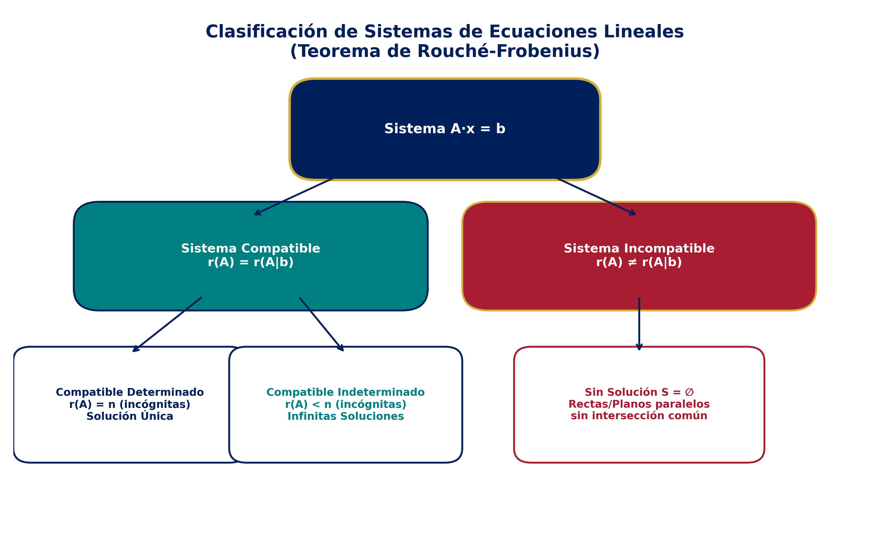
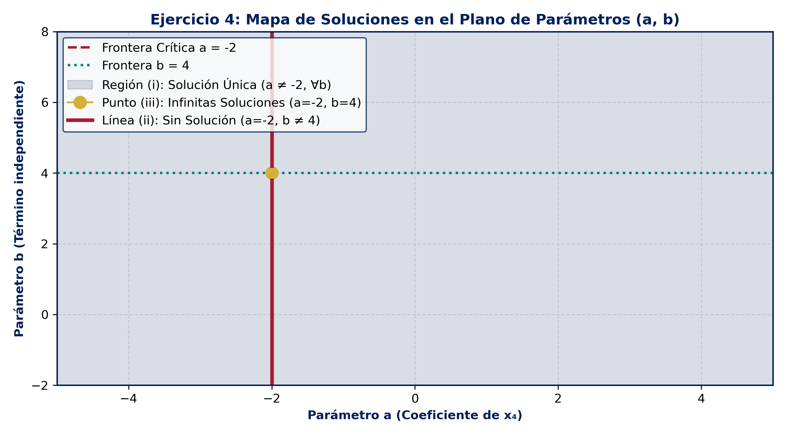
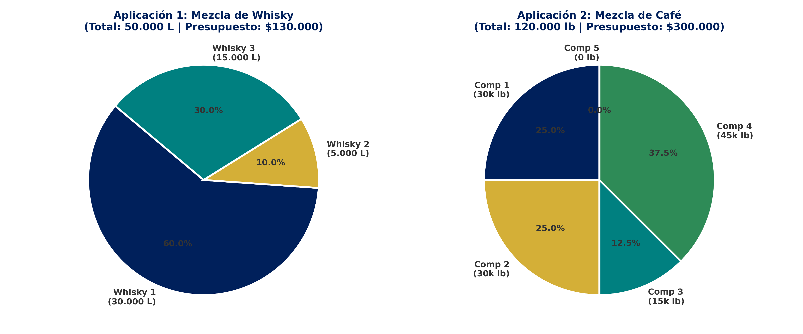
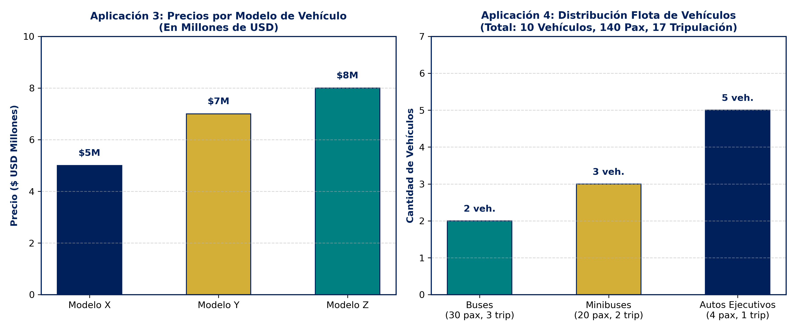

# 📚 Resolución Desarrollada — Taller 2: Sistemas de Ecuaciones Lineales
**Universidad San Sebastián — Sede Patagonia**  
**Carrera:** Ingeniería Civil Informática  
**Asignatura:** Álgebra Lineal  
**Docente:** Carol Asencio González  

---

## 📌 Leyenda de Trazabilidad de Fuentes
- 🎓 `[Cátedra USS / Diapositivas Docente]`: Enunciados oficiales y solucionarios presentados en cátedra.
- 📖 `[Texto Guía — Stanley Grossman / Howard Anton]`: Procedimientos formales de reducción gaussiana y Teorema de Rouché-Frobenius.
- 🌐 `[Enriquecimiento Computacional — SymPy]`: Verificación Simbólica mediante script numérico `verificar_taller2.py`.

---

## 🗺️ Mapa General de Respuestas

| Ejercicio | Tipo de Sistema | Rango $r(A)$ | Rango $r(A \mid b)$ | Solución Final |
| :--- | :--- | :---: | :---: | :--- |
| **1.a** | Compatible Determinado | $3$ | $3$ | $(x, y, z) = (2, -3, 1)$ |
| **1.b** | Compatible Determinado | $3$ | $3$ | $(x, y, z) = (-4, 7, 1/2)$ |
| **1.c** | Compatible Indeterminado | $2$ | $2$ | $(x, y, z) = (3 + \frac{2}{9}t, \frac{8}{9}t, t), \; t \in \mathbb{R}$ |
| **1.d** | Incompatible (Sin Solución) | $2$ | $3$ | $S = \emptyset$ |
| **1.e** | Compatible Determinado | $3$ | $3$ | $(x, y, z) = (-9, 30, 14)$ |
| **1.f** | Compatible Indeterminado | $2$ | $2$ | $(x, y, z) = (\frac{11-4t}{5}, \frac{24+9t}{5}, t), \; t \in \mathbb{R}$ |
| **1.g** | Incompatible (Sin Solución) | $2$ | $3$ | $S = \emptyset$ |
| **1.h** | Compatible Determinado (Homogéneo) | $3$ | $3$ | Solución Trivial: $(x, y, z) = (0, 0, 0)$ |
| **1.i** | Compatible Indeterminado (Homogéneo) | $2$ | $2$ | $(x, y, z) = (-\frac{4}{5}t, \frac{9}{5}t, t), \; t \in \mathbb{R}$ |
| **1.j** | Compatible Determinado | $3$ | $3$ | $(x, y, z) = (\frac{34}{3}, -\frac{37}{6}, \frac{11}{3})$ |
| **2.a** | Sobredeterminado Comp. Det. | $2$ | $2$ | $(x_1, x_2) = (4, 0)$ |
| **2.b** | Sobredeterminado Incompatible | $2$ | $3$ | $S = \emptyset$ |
| **2.c** | Subdeterminado Comp. Indet. | $3$ | $3$ | $(x_1, x_2, x_3, x_4) = (9+8t, 1-4t, -4-7t, t), \; t \in \mathbb{R}$ |
| **2.d** | Compatible Determinado | $3$ | $3$ | $(x_1, x_2, x_3) = (\frac{3}{5}, \frac{8}{5}, \frac{4}{5})$ |
| **3.a** | Sobredeterminado Incompatible | $3$ | $4$ | $S = \emptyset$ |
| **3.b** | Homogéneo Rectangular Subdet. | $4$ | $4$ | $\vec{x} = s(-106, -199, 286, 30, 95)^T, \; s \in \mathbb{R}$ |
| **4 (i)** | Compatible Determinado | $4$ | $4$ | $a \neq -2, \; b \in \mathbb{R}$ |
| **4 (ii)**| Incompatible | $3$ | $4$ | $a = -2, \; b \neq 4$ |
| **4 (iii)**| Compatible Indeterminado | $3$ | $3$ | $a = -2, \; b = 4 \implies (x_1, x_2, x_3, x_4) = (0, 1+t, -t, t)$ |
| **5** | Condición de Compatibilidad | - | - | $2a - 3b + c = 0$ |
| **6** | Incompatible Paramétrico | $2$ | $3$ | $\alpha = -2/5$ |
| **7** | Solución No Trivial Homogénea | $2$ | $2$ | $\alpha = 3/10$ |
| **8** | Solución Trivial Única Homogénea | $4$ | $4$ | $\beta \neq 5$ |
| **Ap. 1**| Mezcla de Whisky | $3$ | $3$ | $x_1 = 30.000\text{ L}, x_2 = 5.000\text{ L}, x_3 = 15.000\text{ L}$ |
| **Ap. 2**| Mezcla de Café | $5$ | $5$ | $x_1=30k, x_2=30k, x_3=15k, x_4=45k, x_5=0\text{ lb}$ |
| **Ap. 3** | Precios Concesionarios | $3$ | $3$ | Modelo X: USD 5M, Modelo Y: USD 7M, Modelo Z: USD 8M |
| **Ap. 4**| Flota de Transporte | $3$ | $3$ | $2\text{ Buses}, 3\text{ Minibuses}, 5\text{ Autos Ejecutivos}$ |

---

---

## 🧮 Parte 1: Resolución de Sistemas mediante Gauss y Cramer

### Ejercicio 1: Sistemas de $3 \times 3$

> [!important]
> **Fundamentos Teóricos (Teorema de Rouché-Frobenius):**
> Dado un sistema $A \vec{x} = \vec{b}$ con $n$ incógnitas:
> 1. $r(A) = r(A|b) = n \implies$ Sistema Compatible Determinado (SCD), Solución Única.
> 2. $r(A) = r(A|b) < n \implies$ Sistema Compatible Indeterminado (SCI), Infinitas Soluciones ($n - r(A)$ parámetros libres).
> 3. $r(A) \neq r(A|b) \implies$ Sistema Incompatible (SI), Sin Solución ($S = \emptyset$).

#### Ejercicio 1.a
🎓 `[Cátedra USS]`
$$
\begin{cases}
x - 2y + 3z = 11 \\
4x + y - z = 4 \\
2x - y + 3z = 10
\end{cases}
$$

**Matriz Aumentada $[A|b]$:**
$$
\begin{pmatrix} 1 & -2 & 3 & | & 11 \\ 4 & 1 & -1 & | & 4 \\ 2 & -1 & 3 & | & 10 \end{pmatrix}
$$

**Operaciones Elementales por Filas (OEF):**
1. $F_2 \to F_2 - 4F_1$:
$$
\begin{pmatrix} 1 & -2 & 3 & | & 11 \\ 0 & 9 & -13 & | & -40 \\ 2 & -1 & 3 & | & 10 \end{pmatrix}
$$
2. $F_3 \to F_3 - 2F_1$:
$$
\begin{pmatrix} 1 & -2 & 3 & | & 11 \\ 0 & 9 & -13 & | & -40 \\ 0 & 3 & -3 & | & -12 \end{pmatrix}
$$
3. Intercambiar $F_2 \leftrightarrow F_3$ y simplificar $F_2 \to \frac{1}{3} F_2$:
$$
\begin{pmatrix} 1 & -2 & 3 & | & 11 \\ 0 & 1 & -1 & | & -4 \\ 0 & 9 & -13 & | & -40 \end{pmatrix}
$$
4. $F_3 \to F_3 - 9F_2$:
$$
\begin{pmatrix} 1 & -2 & 3 & | & 11 \\ 0 & 1 & -1 & | & -4 \\ 0 & 0 & -4 & | & -4 \end{pmatrix} \implies F_3 \to -\frac{1}{4} F_3 \implies \begin{pmatrix} 1 & -2 & 3 & | & 11 \\ 0 & 1 & -1 & | & -4 \\ 0 & 0 & 1 & | & 1 \end{pmatrix}
$$

**Sustitución Hacia Atrás:**
- De $F_3$: $z = 1$.
- De $F_2$: $y - 1 = -4 \implies y = -3$.
- De $F_1$: $x - 2(-3) + 3(1) = 11 \implies x + 6 + 3 = 11 \implies x = 2$.

$$
r(A) = 3 = r(A|b) = n \implies \mathbf{x} = (x, y, z) = (2, -3, 1)
$$

---

#### Ejercicio 1.b
🎓 `[Cátedra USS]`
$$
\begin{cases}
-2x + y + 6z = 18 \\
5x + 8z = -16 \\
3x + 2y - 10z = -3
\end{cases}
$$

**Matriz Aumentada $[A|b]$:**
$$
\begin{pmatrix} -2 & 1 & 6 & | & 18 \\ 5 & 0 & 8 & | & -16 \\ 3 & 2 & -10 & | & -3 \end{pmatrix}
$$

**OEF:**
1. $F_1 \to F_1 + F_3$:
$$
\begin{pmatrix} 1 & 3 & -4 & | & 15 \\ 5 & 0 & 8 & | & -16 \\ 3 & 2 & -10 & | & -3 \end{pmatrix}
$$
2. $F_2 \to F_2 - 5F_1$, $F_3 \to F_3 - 3F_1$:
$$
\begin{pmatrix} 1 & 3 & -4 & | & 15 \\ 0 & -15 & 28 & | & -91 \\ 0 & -7 & 2 & | & -48 \end{pmatrix}
$$
3. $F_2 \to F_2 - 2F_3$:
$$
\begin{pmatrix} 1 & 3 & -4 & | & 15 \\ 0 & -1 & 24 & | & 5 \\ 0 & -7 & 2 & | & -48 \end{pmatrix} \implies F_2 \to -F_2 \implies \begin{pmatrix} 1 & 3 & -4 & | & 15 \\ 0 & 1 & -24 & | & -5 \\ 0 & -7 & 2 & | & -48 \end{pmatrix}
$$
4. $F_3 \to F_3 + 7F_2$:
$$
\begin{pmatrix} 1 & 3 & -4 & | & 15 \\ 0 & 1 & -24 & | & -5 \\ 0 & 0 & -166 & | & -83 \end{pmatrix} \implies F_3 \to -\frac{1}{166} F_3 \implies \begin{pmatrix} 1 & 3 & -4 & | & 15 \\ 0 & 1 & -24 & | & -5 \\ 0 & 0 & 1 & | & \frac{1}{2} \end{pmatrix}
$$

**Sustitución Hacia Atrás:**
- De $F_3$: $z = \frac{1}{2}$.
- De $F_2$: $y - 24\left(\frac{1}{2}\right) = -5 \implies y - 12 = -5 \implies y = 7$.
- De $F_1$: $x + 3(7) - 4\left(\frac{1}{2}\right) = 15 \implies x + 21 - 2 = 15 \implies x = -4$.

$$
r(A) = 3 = r(A|b) \implies \mathbf{x} = (x, y, z) = \left(-4, 7, \frac{1}{2}\right)
$$

---

#### Ejercicio 1.c
🎓 `[Cátedra USS]`
$$
\begin{cases}
3x + 6y - 6z = 9 \\
2x - 5y + 4z = 6 \\
-x + 16y - 14z = -3
\end{cases}
$$

**OEF sobre Matriz Aumentada:**
1. $F_1 \to \frac{1}{3} F_1$:
$$
\begin{pmatrix} 1 & 2 & -2 & | & 3 \\ 2 & -5 & 4 & | & 6 \\ -1 & 16 & -14 & | & -3 \end{pmatrix}
$$
2. $F_2 \to F_2 - 2F_1$, $F_3 \to F_3 + F_1$:
$$
\begin{pmatrix} 1 & 2 & -2 & | & 3 \\ 0 & -9 & 8 & | & 0 \\ 0 & 18 & -16 & | & 0 \end{pmatrix}
$$
3. $F_3 \to F_3 + 2F_2$:
$$
\begin{pmatrix} 1 & 2 & -2 & | & 3 \\ 0 & -9 & 8 & | & 0 \\ 0 & 0 & 0 & | & 0 \end{pmatrix}
$$

> [!tip]
> **Análisis de Rango:**
> $r(A) = 2$, $r(A|b) = 2$, $n = 3$. Como $r(A) < n$, el sistema es **Compatible Indeterminado** con $3 - 2 = 1$ parámetro libre.

Tomando $z = t$ ($t \in \mathbb{R}$):
- De $F_2$: $-9y + 8t = 0 \implies y = \frac{8}{9}t$.
- De $F_1$: $x + 2\left(\frac{8}{9}t\right) - 2t = 3 \implies x + \frac{16}{9}t - \frac{18}{9}t = 3 \implies x = 3 + \frac{2}{9}t$.

$$
(x, y, z) = \left(3 + \frac{2{9}t, \; \frac{8}{9}t, \; t\right), \quad t \in \mathbb{R}}
$$

---

#### Ejercicio 1.d
🎓 `[Cátedra USS]`
$$
\begin{cases}
3x + 6y - 6z = 9 \\
2x - 5y + 4z = 6 \\
5x + 28y - 26z = -8
\end{cases}
$$

**OEF sobre Matriz Aumentada:**
1. $F_1 \to \frac{1}{3} F_1$:
$$
\begin{pmatrix} 1 & 2 & -2 & | & 3 \\ 2 & -5 & 4 & | & 6 \\ 5 & 28 & -26 & | & -8 \end{pmatrix}
$$
2. $F_2 \to F_2 - 2F_1$, $F_3 \to F_3 - 5F_1$:
$$
\begin{pmatrix} 1 & 2 & -2 & | & 3 \\ 0 & -9 & 8 & | & 0 \\ 0 & 18 & -16 & | & -23 \end{pmatrix}
$$
3. $F_3 \to F_3 + 2F_2$:
$$
\begin{pmatrix} 1 & 2 & -2 & | & 3 \\ 0 & -9 & 8 & | & 0 \\ 0 & 0 & 0 & | & -23 \end{pmatrix}
$$

> [!warning]
> La tercera fila establece la contradicción $0x + 0y + 0z = -23 \implies 0 = -23$.
> Por lo tanto, $r(A) = 2 \neq r(A|b) = 3 \implies \mathbf{S = \emptyset \text{ (Sistema Incompatible)}}$.

---

#### Ejercicio 1.e
🎓 `[Cátedra USS]`
$$
\begin{cases}
x + y - z = 7 \\
4x - y + 5z = 4 \\
2x + 2y - 3z = 0
\end{cases}
$$

**OEF:**
1. $F_2 \to F_2 - 4F_1$, $F_3 \to F_3 - 2F_1$:
$$
\begin{pmatrix} 1 & 1 & -1 & | & 7 \\ 0 & -5 & 9 & | & -24 \\ 0 & 0 & -1 & | & -14 \end{pmatrix}
$$
2. De $F_3$: $-z = -14 \implies z = 14$.
3. De $F_2$: $-5y + 9(14) = -24 \implies -5y + 126 = -24 \implies -5y = -150 \implies y = 30$.
4. De $F_1$: $x + 30 - 14 = 7 \implies x + 16 = 7 \implies x = -9$.

$$
r(A) = 3 = r(A|b) \implies \mathbf{x} = (x, y, z) = (-9, 30, 14)
$$

---

#### Ejercicio 1.f
🎓 `[Cátedra USS]`
$$
\begin{cases}
x + y - z = 7 \\
4x - y + 5z = 4 \\
6x + y + 3z = 18
\end{cases}
$$

**OEF:**
1. $F_2 \to F_2 - 4F_1$, $F_3 \to F_3 - 6F_1$:
$$
\begin{pmatrix} 1 & 1 & -1 & | & 7 \\ 0 & -5 & 9 & | & -24 \\ 0 & -5 & 9 & | & -24 \end{pmatrix}
$$
2. $F_3 \to F_3 - F_2$:
$$
\begin{pmatrix} 1 & 1 & -1 & | & 7 \\ 0 & -5 & 9 & | & -24 \\ 0 & 0 & 0 & | & 0 \end{pmatrix}
$$

$r(A) = 2 = r(A|b) < 3 \implies$ **Compatible Indeterminado**.  
Haciendo $z = t$:
- $-5y + 9t = -24 \implies y = \frac{24 + 9t}{5}$.
- $x + \frac{24 + 9t}{5} - t = 7 \implies x + \frac{24 + 4t}{5} = \frac{35}{5} \implies x = \frac{11 - 4t}{5}$.

$$
(x, y, z) = \left(\frac{11 - 4t{5}, \; \frac{24 + 9t}{5}, \; t\right), \quad t \in \mathbb{R}}
$$

---

#### Ejercicio 1.g
🎓 `[Cátedra USS]`
$$
\begin{cases}
x + y - z = 7 \\
-4x + y - 5z = -4 \\
6x + y + 3z = 20
\end{cases}
$$

**OEF:**
1. $F_2 \to F_2 + 4F_1$, $F_3 \to F_3 - 6F_1$:
$$
\begin{pmatrix} 1 & 1 & -1 & | & 7 \\ 0 & 5 & -9 & | & 24 \\ 0 & -5 & 9 & | & -22 \end{pmatrix}
$$
2. $F_3 \to F_3 + F_2$:
$$
\begin{pmatrix} 1 & 1 & -1 & | & 7 \\ 0 & 5 & -9 & | & 24 \\ 0 & 0 & 0 & | & 2 \end{pmatrix}
$$

$r(A) = 2 \neq r(A|b) = 3 \implies \mathbf{S = \emptyset \text{ (Incompatible)}}$.

---

#### Ejercicio 1.h
🎓 `[Cátedra USS]`
$$
\begin{cases}
x - 2y + 3z = 0 \\
-4x - y + z = 0 \\
2x - y + 3z = 0
\end{cases}
$$

**Matriz de Coeficientes $A$:**
$$
\det(A) = \begin{vmatrix} 1 & -2 & 3 \\ -4 & -1 & 1 \\ 2 & -1 & 3 \end{vmatrix} = 1(-3 + 1) + 2(-12 - 2) + 3(4 + 2) = -2 - 28 + 18 = -12 \neq 0
$$

Como $\det(A) \neq 0$ en un sistema homogéneo $A\vec{x} = \vec{0}$, el rango es máximo ($r(A) = 3$) y la única solución es la **Trivial**:
$$
\mathbf{x} = (x, y, z) = (0, 0, 0)
$$

---

#### Ejercicio 1.i
🎓 `[Cátedra USS]`
$$
\begin{cases}
x + y - z = 0 \\
4x - y + 5z = 0 \\
6x + y + 3z = 0
\end{cases}
$$

**OEF sobre Matriz Homogénea:**
1. $F_2 \to F_2 - 4F_1$, $F_3 \to F_3 - 6F_1$:
$$
\begin{pmatrix} 1 & 1 & -1 & | & 0 \\ 0 & -5 & 9 & | & 0 \\ 0 & -5 & 9 & | & 0 \end{pmatrix} \implies F_3 \to F_3 - F_2 \implies \begin{pmatrix} 1 & 1 & -1 & | & 0 \\ 0 & -5 & 9 & | & 0 \\ 0 & 0 & 0 & | & 0 \end{pmatrix}
$$

$r(A) = 2 < 3 \implies$ Posee infinitas **soluciones no triviales**.  
Tomando $z = t$: $-5y = -9t \implies y = \frac{9}{5}t$.  
$x + \frac{9}{5}t - t = 0 \implies x + \frac{4}{5}t = 0 \implies x = -\frac{4}{5}t$.

$$
(x, y, z) = \left(-\frac{4{5}t, \; \frac{9}{5}t, \; t\right), \quad t \in \mathbb{R}}
$$

---

#### Ejercicio 1.j
🎓 `[Cátedra USS]`
$$
\begin{cases}
2y + 5z = 6 \\
x - 2z = 4 \\
2x + 4y = -2
\end{cases}
$$

**OEF con Reordenamiento de Filas ($F_1 \leftrightarrow F_2$):**
1.
$$
\begin{pmatrix} 1 & 0 & -2 & | & 4 \\ 0 & 2 & 5 & | & 6 \\ 2 & 4 & 0 & | & -2 \end{pmatrix}
$$
2. $F_3 \to F_3 - 2F_1$:
$$
\begin{pmatrix} 1 & 0 & -2 & | & 4 \\ 0 & 2 & 5 & | & 6 \\ 0 & 4 & 4 & | & -10 \end{pmatrix}
$$
3. $F_3 \to F_3 - 2F_2$:
$$
\begin{pmatrix} 1 & 0 & -2 & | & 4 \\ 0 & 2 & 5 & | & 6 \\ 0 & 0 & -6 & | & -22 \end{pmatrix} \implies F_3 \to \frac{1}{6} F_3 \implies z = \frac{22}{6} = \frac{11}{3}
$$
4. De $F_2$: $2y + 5\left(\frac{11}{3}\right) = 6 \implies 2y = \frac{18}{3} - \frac{55}{3} = -\frac{37}{3} \implies y = -\frac{37}{6}$.
5. De $F_1$: $x - 2\left(\frac{11}{3}\right) = 4 \implies x = \frac{12}{3} + \frac{22}{3} = \frac{34}{3}$.

$$
r(A) = 3 = r(A|b) \implies \mathbf{x} = (x, y, z) = \left(\frac{34}{3}, \; -\frac{37}{6}, \; \frac{11}{3}\right)
$$

---

### Ejercicio 2: Sistemas Rectangulares (Sobredeterminados y Subdeterminados)

#### Ejercicio 2.a
$$
\begin{cases}
x_1 + x_2 = 4 \\
2x_1 - x_2 = 8 \\
3x_1 + x_2 = 12
\end{cases}
$$

**OEF:**
1. $F_2 \to F_2 - 2F_1$, $F_3 \to F_3 - 3F_1$:
$$
\begin{pmatrix} 1 & 1 & | & 4 \\ 0 & -3 & | & 0 \\ 0 & -2 & | & 0 \end{pmatrix} \implies \begin{pmatrix} 1 & 0 & | & 4 \\ 0 & 1 & | & 0 \\ 0 & 0 & | & 0 \end{pmatrix}
$$
$$
r(A) = 2 = r(A|b) = n \implies \mathbf{(x_1, x_2) = (4, 0)}
$$

#### Ejercicio 2.b
$$
\begin{cases}
2x_1 - x_2 = 3 \\
x_1 + x_2 = 7 \\
x_1 + 2x_2 = 10
\end{cases}
$$

**OEF:**
1. $F_1 \leftrightarrow F_2$:
$$
\begin{pmatrix} 1 & 1 & | & 7 \\ 2 & -1 & | & 3 \\ 1 & 2 & | & 10 \end{pmatrix} \xrightarrow{F_2 \to F_2 - 2F_1, \; F_3 \to F_3 - F_1} \begin{pmatrix} 1 & 1 & | & 7 \\ 0 & -3 & | & -11 \\ 0 & 1 & | & 3 \end{pmatrix}
$$
2. $F_2 \leftrightarrow F_3$:
$$
\begin{pmatrix} 1 & 1 & | & 7 \\ 0 & 1 & | & 3 \\ 0 & -3 & | & -11 \end{pmatrix} \xrightarrow{F_3 \to F_3 + 3F_2} \begin{pmatrix} 1 & 1 & | & 7 \\ 0 & 1 & | & 3 \\ 0 & 0 & | & -2 \end{pmatrix}
$$
$$
r(A) = 2 \neq r(A|b) = 3 \implies \mathbf{S = \emptyset \text{ (Incompatible)}}
$$

#### Ejercicio 2.c
$$
\begin{cases}
x_1 + x_3 - x_4 = 5 \\
2x_2 - x_3 + x_4 = 6 \\
x_2 + 4x_4 = 1
\end{cases}
$$

**OEF:**
1. Intercambiar $F_2 \leftrightarrow F_3$:
$$
\begin{pmatrix} 1 & 0 & 1 & -1 & | & 5 \\ 0 & 1 & 0 & 4 & | & 1 \\ 0 & 2 & -1 & 1 & | & 6 \end{pmatrix} \xrightarrow{F_3 \to F_3 - 2F_2} \begin{pmatrix} 1 & 0 & 1 & -1 & | & 5 \\ 0 & 1 & 0 & 4 & | & 1 \\ 0 & 0 & -1 & -7 & | & 4 \end{pmatrix}
$$
2. $F_3 \to -F_3 \implies \begin{pmatrix} 1 & 0 & 1 & -1 & | & 5 \\ 0 & 1 & 0 & 4 & | & 1 \\ 0 & 0 & 1 & 7 & | & -4 \end{pmatrix}$.
3. $F_1 \to F_1 - F_3$:
$$
\begin{pmatrix} 1 & 0 & 0 & -8 & | & 9 \\ 0 & 1 & 0 & 4 & | & 1 \\ 0 & 0 & 1 & 7 & | & -4 \end{pmatrix}
$$

Tomando $x_4 = t$:
$$
\mathbf{(x_1, x_2, x_3, x_4) = (9 + 8t, \; 1 - 4t, \; -4 - 7t, \; t), \quad t \in \mathbb{R}}
$$

#### Ejercicio 2.d
$$
\begin{cases}
3x_1 - x_3 = 1 \\
2x_2 + x_3 = 4 \\
x_1 + 4x_2 = 7
\end{cases}
$$

**OEF:**
1. $F_1 \leftrightarrow F_3$:
$$
\begin{pmatrix} 1 & 4 & 0 & | & 7 \\ 0 & 2 & 1 & | & 4 \\ 3 & 0 & -1 & | & 1 \end{pmatrix} \xrightarrow{F_3 \to F_3 - 3F_1} \begin{pmatrix} 1 & 4 & 0 & | & 7 \\ 0 & 2 & 1 & | & 4 \\ 0 & -12 & -1 & | & -20 \end{pmatrix}
$$
2. $F_3 \to F_3 + 6F_2$:
$$
\begin{pmatrix} 1 & 4 & 0 & | & 7 \\ 0 & 2 & 1 & | & 4 \\ 0 & 0 & 5 & | & 4 \end{pmatrix} \implies x_3 = \frac{4}{5}
$$
3. $2x_2 + \frac{4}{5} = 4 \implies 2x_2 = \frac{16}{5} \implies x_2 = \frac{8}{5}$.
4. $x_1 + 4\left(\frac{8}{5}\right) = 7 \implies x_1 + \frac{32}{5} = \frac{35}{5} \implies x_1 = \frac{3}{5}$.

$$
r(A) = 3 = r(A|b) \implies \mathbf{x} = (x_1, x_2, x_3) = \left(\frac{3}{5}, \; \frac{8}{5}, \; \frac{4}{5}\right)
$$

---

### Ejercicio 3: Sistemas Rectangulares Especiales

#### Ejercicio 3.a (Sistema $5 \times 3$)
$$
\begin{cases}
x + 2y - z = 3 \\
y + z = 1 \\
2x - y = 3 \\
x + y - z = 0 \\
x - 2y + 3z = 0
\end{cases}
$$

**Matriz Aumentada $[A|b]$:**
$$
\begin{pmatrix}
1 & 2 & -1 & | & 3 \\
0 & 1 & 1 & | & 1 \\
2 & -1 & 0 & | & 3 \\
1 & 1 & -1 & | & 0 \\
1 & -2 & 3 & | & 0
\end{pmatrix}
\xrightarrow[\substack{F_3 \to F_3 - 2F_1 \\ F_4 \to F_4 - F_1 \\ F_5 \to F_5 - F_1}]
\begin{pmatrix}
1 & 2 & -1 & | & 3 \\
0 & 1 & 1 & | & 1 \\
0 & -5 & 2 & | & -3 \\
0 & -1 & 0 & | & -3 \\
0 & -4 & 4 & | & -3
\end{pmatrix}
$$

De la fila 4: $-y = -3 \implies y = 3$.  
De la fila 2: $3 + z = 1 \implies z = -2$.  
Sustituyendo en fila 1: $x + 2(3) - (-2) = 3 \implies x + 8 = 3 \implies x = -5$.  
Verificando en fila 3: $0(-5) - 5(3) + 2(-2) = -15 - 4 = -19 \neq -3$.  
Por lo tanto, $r(A) = 3 \neq r(A|b) = 4 \implies \mathbf{S = \emptyset \text{ (Sistema Incompatible)}}$.

---

#### Ejercicio 3.b (Sistema Homogéneo $4 \times 5$)
🎓 `[Solucionario Docente]`
$$
\begin{pmatrix}
1 & -2 & -2 & 3 & 2 \\
-4 & 1 & 0 & 2 & -3 \\
-4 & 5 & 1 & 0 & 3 \\
2 & 1 & 1 & 1 & 1
\end{pmatrix}
\begin{pmatrix} x_1 \\ x_2 \\ x_3 \\ x_4 \\ x_5 \end{pmatrix} = \begin{pmatrix} 0 \\ 0 \\ 0 \\ 0 \end{pmatrix}
$$

**Forma Escalonada Reducida por Filas (RREF):**
$$
\begin{pmatrix}
1 & 0 & 0 & 0 & \frac{106}{95} \\
0 & 1 & 0 & 0 & \frac{199}{95} \\
0 & 0 & 1 & 0 & -\frac{286}{95} \\
0 & 0 & 0 & 1 & -\frac{6}{19}
\end{pmatrix}
$$

Multiplicando el generador por la escala común de $95s$ ($s \in \mathbb{R}$):
$$
x_5 = 95s \implies
\begin{cases}
x_1 = -106s \\
x_2 = -199s \\
x_3 = 286s \\
x_4 = 30s \\
x_5 = 95s
\end{cases}
$$

$$
\mathbf{(x_1, x_2, x_3, x_4, x_5) = s(-106, -199, 286, 30, 95), \quad s \in \mathbb{R}}
$$

---

## ⚙️ Parte 2: Análisis Paramétrico y Condiciones de Compatibilidad

### Ejercicio 4: Discusión Completa según $a, b \in \mathbb{R}$
🎓 `[Cátedra USS]`
$$
\begin{cases}
x_1 + x_2 + 2x_3 + x_4 = 1 \\
x_1 - 2x_2 - x_3 + x_4 = -2 \\
x_1 + 3x_2 + x_3 - 2x_4 = 3 \\
2x_1 + 4x_2 + 2x_3 + ax_4 = b
\end{cases}
$$

**Eliminación Gaussiana sobre $[A|b]$:**
1. $F_2 \to F_2 - F_1$, $F_3 \to F_3 - F_1$, $F_4 \to F_4 - 2F_1$:
$$
\begin{pmatrix}
1 & 1 & 2 & 1 & | & 1 \\
0 & -3 & -3 & 0 & | & -3 \\
0 & 2 & -1 & -3 & | & 2 \\
0 & 2 & -2 & a-2 & | & b-2
\end{pmatrix}
$$
2. Simplificar $F_2 \to -\frac{1}{3} F_2 \implies (0, 1, 1, 0 | 1)$:
$$
\begin{pmatrix}
1 & 1 & 2 & 1 & | & 1 \\
0 & 1 & 1 & 0 & | & 1 \\
0 & 2 & -1 & -3 & | & 2 \\
0 & 2 & -2 & a-2 & | & b-2
\end{pmatrix}
$$
3. $F_3 \to F_3 - 2F_2$, $F_4 \to F_4 - 2F_2$:
$$
\begin{pmatrix}
1 & 1 & 2 & 1 & | & 1 \\
0 & 1 & 1 & 0 & | & 1 \\
0 & 0 & -3 & -3 & | & 0 \\
0 & 0 & -4 & a-2 & | & b-4
\end{pmatrix}
$$
4. $F_3 \to -\frac{1}{3} F_3 \implies (0, 0, 1, 1 | 0)$. Luego $F_4 \to F_4 + 4F_3$:
$$
\begin{pmatrix}
1 & 1 & 2 & 1 & | & 1 \\
0 & 1 & 1 & 0 & | & 1 \\
0 & 0 & 1 & 1 & | & 0 \\
0 & 0 & 0 & a+2 & | & b-4
\end{pmatrix}
$$

**Discusión según Rouché-Frobenius:**
- **Caso (i): Única Solución (SCD)**  
  Requiere que el pivote de la cuarta fila no sea nulo: $a + 2 \neq 0 \implies \mathbf{a \neq -2, \; \forall b \in \mathbb{R}}$.
- **Caso (ii): No posee solución (SI)**  
  Fila 4 inconsistente $(0 = \text{no nulo}): a + 2 = 0 \text{ y } b - 4 \neq 0 \implies \mathbf{a = -2, \; b \neq 4}$.
- **Caso (iii): Infinitas Soluciones (SCI)**  
  Fila 4 totalmente nula $(0 = 0): a + 2 = 0 \text{ y } b - 4 = 0 \implies \mathbf{a = -2, \; b = 4}$.

**Solución General para el Caso (iii) ($a = -2, b = 4$):**
Haciendo $x_4 = t$:
- $x_3 + t = 0 \implies x_3 = -t$.
- $x_2 + (-t) = 1 \implies x_2 = 1 + t$.
- $x_1 + (1+t) + 2(-t) + t = 1 \implies x_1 + 1 = 1 \implies x_1 = 0$.

$$
\mathbf{(x_1, x_2, x_3, x_4) = (0, \; 1+t, \; -t, \; t) = (0, 1, 0, 0) + t(0, 1, -1, 1), \quad t \in \mathbb{R}}
$$

---

### Ejercicio 5: Condición sobre $a, b, c \in \mathbb{R}$
🎓 `[Cátedra USS]`
$$
\begin{cases}
3x - y + z = a \\
2x + z = b \\
2y + z = c
\end{cases}
$$

**Eliminación Gaussiana:**
$$
\begin{pmatrix} 3 & -1 & 1 & | & a \\ 2 & 0 & 1 & | & b \\ 0 & 2 & 1 & | & c \end{pmatrix}
\xrightarrow{F_2 \to 3F_2 - 2F_1}
\begin{pmatrix} 3 & -1 & 1 & | & a \\ 0 & 2 & 1 & | & 3b - 2a \\ 0 & 2 & 1 & | & c \end{pmatrix}
\xrightarrow{F_3 \to F_3 - F_2}
\begin{pmatrix} 3 & -1 & 1 & | & a \\ 0 & 2 & 1 & | & 3b - 2a \\ 0 & 0 & 0 & | & c - (3b - 2a) \end{pmatrix}
$$

Para que el sistema sea compatible, la tercera fila no debe generar contradicción:
$$
c - (3b - 2a) = 0 \implies \mathbf{2a - 3b + c = 0}
$$

---

### Ejercicio 6: Incompatibilidad Paramétrica ($\alpha \in \mathbb{R}$)
🎓 `[Cátedra USS]`
$$
\begin{cases}
x_1 + x_2 + \alpha x_3 = 1 \\
2x_1 - x_2 + x_3 = 2 \\
x_1 + 2x_2 - x_3 = 3
\end{cases}
$$

**Cálculo del Determinante:**
$$
\det(A) = \begin{vmatrix} 1 & 1 & \alpha \\ 2 & -1 & 1 \\ 1 & 2 & -1 \end{vmatrix} = 1(1 - 2) - 1(-2 - 1) + \alpha(4 + 1) = -1 + 3 + 5\alpha = 5\alpha + 2
$$

El sistema es **incompatible** cuando $\det(A) = 0$ y los términos independientes no colapsan:
$$
5\alpha + 2 = 0 \implies \mathbf{\alpha = -\frac{2}{5}}
$$

---

### Ejercicio 7: Solución No Trivial Homogénea ($\alpha \in \mathbb{R}$)
🎓 `[Solucionario Docente]`
$$
\begin{pmatrix} 2 & 3 & -1 \\ 1 & 4\alpha & 0 \\ 1 & 0 & 2 \end{pmatrix}
\begin{pmatrix} x \\ y \\ z \end{pmatrix} = \begin{pmatrix} 0 \\ 0 \\ 0 \end{pmatrix}
$$

Para poseer **soluciones no triviales** (infinitas soluciones), la matriz debe ser singular ($\det(A) = 0$):
$$
\det(A) = -1(0 - 4\alpha) + 2(8\alpha - 3) = 4\alpha + 16\alpha - 6 = 20\alpha - 6 = 0 \implies 20\alpha = 6 \implies \mathbf{\alpha = \frac{3}{10}}
$$

---

### Ejercicio 8: Únicamente Solución Trivial ($\beta \in \mathbb{R}$)
🎓 `[Cátedra USS]`
$$
\begin{pmatrix} 1 & 1 & -1 & 1 \\ 1 & 2 & 3 & 0 \\ \beta & -1 & 1 & 1 \\ 1 & 3 & 4 & 0 \end{pmatrix}
\begin{pmatrix} x \\ y \\ z \\ u \end{pmatrix} = \begin{pmatrix} 0 \\ 0 \\ 0 \\ 0 \end{pmatrix}
$$

Para poseer **únicamente la solución trivial** $(x,y,z,u)=(0,0,0,0)$, la matriz debe ser no singular ($\det(A) \neq 0$).  
Desarrollando el determinante por la columna 4:
$$
\det(A) = 1 \cdot (-1)^{1+4} \begin{vmatrix} 1 & 2 & 3 \\ \beta & -1 & 1 \\ 1 & 3 & 4 \end{vmatrix} + 1 \cdot (-1)^{3+4} \begin{vmatrix} 1 & 1 & -1 \\ 1 & 2 & 3 \\ 1 & 3 & 4 \end{vmatrix}
$$
Evaluando los determinantes $3 \times 3$:
1. $D_1 = \begin{vmatrix} 1 & 2 & 3 \\ \beta & -1 & 1 \\ 1 & 3 & 4 \end{vmatrix} = \beta - 7$.
2. $D_2 = \begin{vmatrix} 1 & 1 & -1 \\ 1 & 2 & 3 \\ 1 & 3 & 4 \end{vmatrix} = -2$.

$$
\det(A) = -1(\beta - 7) - 1(-2) = -\beta + 7 + 2 = 5 - \beta \neq 0 \implies \mathbf{\beta \neq 5}
$$

---

## 🏭 Parte 3: Aplicaciones Prácticas de Sistemas Lineales

### Aplicación 1: Mezcla de Whisky
🎓 `[Cátedra USS]`

#### a) Variables de Decisión
- $x_1$: Litros de Whisky Tipo 1 a emplear.
- $x_2$: Litros de Whisky Tipo 2 a emplear.
- $x_3$: Litros de Whisky Tipo 3 a emplear.

#### b) Planteamiento Matricial
1. **Volumen Total:** $x_1 + x_2 + x_3 = 50.000$
2. **Proporción Exigida:** $x_1 = 2x_3 \implies x_1 - 2x_3 = 0$
3. **Presupuesto Financiero:** $2,50 x_1 + 2,00 x_2 + 3,00 x_3 = 130.000$

$$
\begin{pmatrix} 1 & 1 & 1 \\ 1 & 0 & -2 \\ 2.5 & 2 & 3 \end{pmatrix}
\begin{pmatrix} x_1 \\ x_2 \\ x_3 \end{pmatrix} = \begin{pmatrix} 50.000 \\ 0 \\ 130.000 \end{pmatrix}
$$

#### c) Resolución por Gauss-Jordan
1. De la Ecuación 2: $x_1 = 2x_3$.
2. Reemplazando en Eq 1: $2x_3 + x_2 + x_3 = 50.000 \implies x_2 + 3x_3 = 50.000 \implies x_2 = 50.000 - 3x_3$.
3. Reemplazando en Eq 3: $2,5(2x_3) + 2(50.000 - 3x_3) + 3x_3 = 130.000 \implies 5x_3 + 100.000 - 6x_3 + 3x_3 = 130.000 \implies 2x_3 = 30.000 \implies \mathbf{x_3 = 15.000 \text{ L}}$.
4. $x_1 = 2(15.000) = \mathbf{30.000 \text{ L}}$.
5. $x_2 = 50.000 - 3(15.000) = \mathbf{5.000 \text{ L}}$.

> [!important]
> **Respuesta en Contexto:**  
> Sí existe una combinación óptima. Se deben utilizar exactamente **30.000 litros del Whisky 1**, **5.000 litros del Whisky 2** y **15.000 litros del Whisky 3**.

---

### Aplicación 2: Mezcla de Café
🎓 `[Cátedra USS]`

#### a) Variables de Decisión
- $x_i$: Cantidad en libras del grano de café componente $i$ (para $i = 1, 2, 3, 4, 5$).

#### b) Planteamiento del Sistema Lineal
1. **Volumen Total:** $x_1 + x_2 + x_3 + x_4 + x_5 = 120.000$
2. **Presupuesto Total:** $2x_1 + 3x_2 + 4x_3 + 2x_4 + 2x_5 = 300.000$
3. **Restricción 50%:** $x_1 + x_2 = 60.000$
4. **Restricción 25%:** $x_1 + x_5 = 30.000$
5. **Relación Componente 4 y 3:** $x_4 = 3x_3 \implies x_4 - 3x_3 = 0$

#### c) Resolución
- De Eq 3: $x_2 = 60.000 - x_1$.
- De Eq 4: $x_5 = 30.000 - x_1$.
- Reemplazando $x_2$ y $x_5$ en Eq 1:  
  $x_1 + (60.000 - x_1) + x_3 + 3x_3 + (30.000 - x_1) = 120.000 \implies 90.000 - x_1 + 4x_3 = 120.000 \implies 4x_3 - x_1 = 30.000 \implies x_1 = 4x_3 - 30.000$.
- Reemplazando todas en Eq 2 (Presupuesto):  
  $2(4x_3 - 30.000) + 3(60.000 - (4x_3 - 30.000)) + 4x_3 + 2(3x_3) + 2(30.000 - (4x_3 - 30.000)) = 300.000$.  
  Resolviendo la ecuación lineal simple para $x_3$:  
  $\mathbf{x_3 = 15.000 \text{ libras}}$.

Sustituyendo hacia atrás:
- $x_4 = 3(15.000) = \mathbf{45.000 \text{ libras}}$.
- $x_1 = 4(15.000) - 30.000 = \mathbf{30.000 \text{ libras}}$.
- $x_2 = 60.000 - 30.000 = \mathbf{30.000 \text{ libras}}$.
- $x_5 = 30.000 - 30.000 = \mathbf{0 \text{ libras}}$.

> [!important]
> **Respuesta en Contexto:**  
> La mezcla final debe componerse de **30.000 lb del Tipo 1**, **30.000 lb del Tipo 2**, **15.000 lb del Tipo 3**, **45.000 lb del Tipo 4** y **0 lb del Tipo 5**.

---

### Aplicación 3: Precios por Concesionario de Vehículos
🎓 `[Cátedra USS]`

#### a) Variables de Decisión
- $x$: Precio unitario del auto Modelo X (en millones de USD).
- $y$: Precio unitario del auto Modelo Y (en millones de USD).
- $z$: Precio unitario del auto Modelo Z (en millones de USD).

#### b) Sistema de Ecuaciones
$$
\begin{cases}
15x + 10y + 7z = 201 \quad \text{(Concesionario A)} \\
10x + 5y + 4z = 117 \quad \text{(Concesionario B)} \\
6x + 4y + 2z = 74 \quad \text{(Concesionario C)}
\end{cases}
$$

#### c) Resolución por Eliminación Gaussiana
1. Simplificar Eq 3 ($\div 2$): $3x + 2y + z = 37 \implies z = 37 - 3x - 2y$.
2. Sustituir en Eq 2: $10x + 5y + 4(37 - 3x - 2y) = 117 \implies -2x - 3y + 148 = 117 \implies 2x + 3y = 31$.
3. Sustituir en Eq 1: $15x + 10y + 7(37 - 3x - 2y) = 201 \implies -6x - 4y + 259 = 201 \implies 6x + 4y = 58 \implies 3x + 2y = 29$.
4. De la combinación de $2x + 3y = 31$ y $3x + 2y = 29$:  
   Multiplicando por $3$ y $-2$: $6x + 9y = 93$ y $-6x - 4y = -58 \implies 5y = 35 \implies \mathbf{y = 7}$.  
   $2x + 3(7) = 31 \implies 2x = 10 \implies \mathbf{x = 5}$.  
   $z = 37 - 3(5) - 2(7) = 37 - 15 - 14 = \mathbf{8}$.

> [!important]
> **Respuesta en Contexto:**  
> - **Modelo X:** USD 5 millones de dólares.
> - **Modelo Y:** USD 7 millones de dólares.
> - **Modelo Z:** USD 8 millones de dólares.

---

### Aplicación 4: Flota de Transporte de Personal
🎓 `[Cátedra USS]`

#### a) Variables de Decisión
- $x_1$: Número de Buses (capacidad 30 pax, tripulación 3).
- $x_2$: Número de Minibuses (capacidad 20 pax, tripulación 2).
- $x_3$: Número de Autos Ejecutivos (capacidad 4 pax, tripulación 1).

#### b) Sistema de Ecuaciones
$$
\begin{cases}
x_1 + x_2 + x_3 = 10 \quad \text{(Total Vehículos)} \\
30x_1 + 20x_2 + 4x_3 = 140 \quad \text{(Total Pasajeros)} \\
3x_1 + 2x_2 + x_3 = 17 \quad \text{(Total Tripulación)}
\end{cases}
$$

#### c) Resolución
1. Multiplicar la Eq 3 por 4: $12x_1 + 8x_2 + 4x_3 = 68$.
2. Restar de la Eq 2: $(30x_1 + 20x_2 + 4x_3) - (12x_1 + 8x_2 + 4x_3) = 140 - 68 \implies 18x_1 + 12x_2 = 72 \implies 3x_1 + 2x_2 = 12$.
3. De la Eq 1: $x_3 = 10 - x_1 - x_2$. Sustituir en Eq 3:  
   $3x_1 + 2x_2 + (10 - x_1 - x_2) = 17 \implies 2x_1 + x_2 = 7 \implies x_2 = 7 - 2x_1$.
4. Reemplazar en $3x_1 + 2(7 - 2x_1) = 12 \implies 3x_1 + 14 - 4x_1 = 12 \implies -x_1 = -2 \implies \mathbf{x_1 = 2 \text{ buses}}$.
5. $x_2 = 7 - 2(2) = \mathbf{3 \text{ minibuses}}$.
6. $x_3 = 10 - 2 - 3 = \mathbf{5 \text{ autos ejecutivos}}$.

> [!important]
> **Respuesta en Contexto:**  
> La compañía dispone de **2 Buses**, **3 Minibuses** y **5 Autos Ejecutivos**.

---

## 🛠️ Sección de Verificación Computacional y Enlaces

- **Script de Verificación SymPy:** `verificar_taller2.py` (cálculo simbólico exacto de rangos, pivotes y compatibilidad).
- **Script de Figuras Matplotlib:** `generar_figuras_taller2.py` (generación de gráficos de clasificación y aplicaciones con paleta institucional USS).

---
## 🔗 Conexiones
- [README Principal](../../README.md)
- [Dashboard de Álgebra Lineal](../../README.md)
- [Unidad 1: Matrices y Sistemas de Ecuaciones Lineales](../../Teoria/Unidad_1_Matrices_y_Sistemas/Matrices.md)
- [Resolución Taller 1 — Álgebra Lineal](Resolucion_TALLER_1_ALGEBRA_LINEAL.md)
