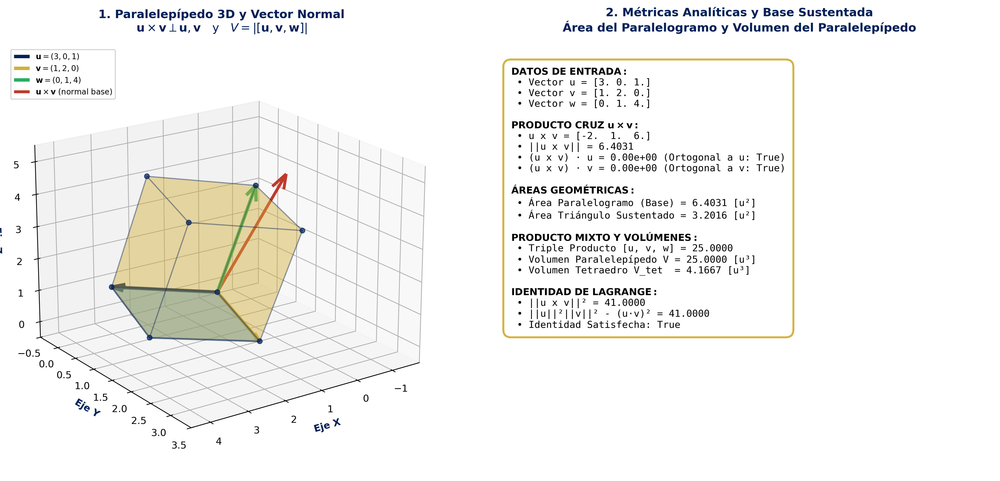
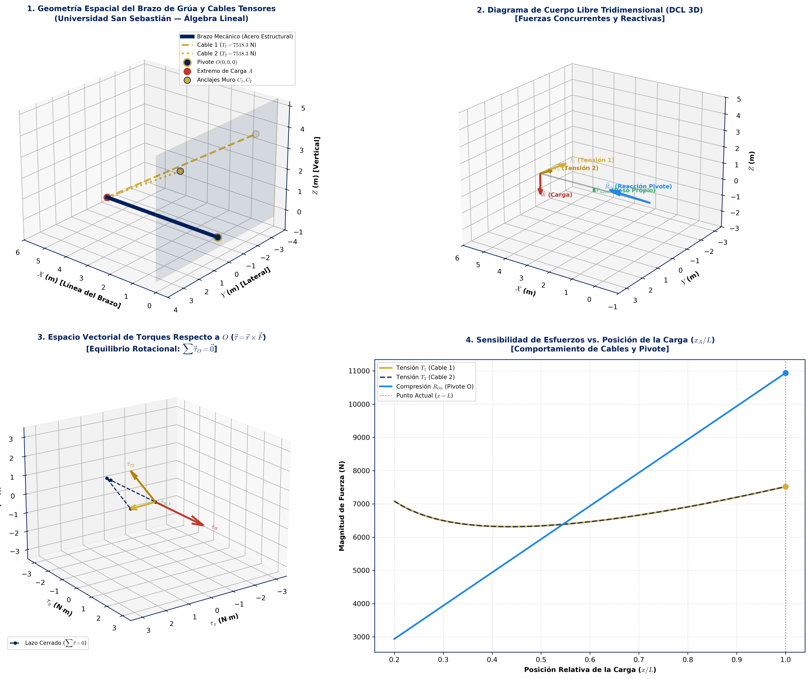
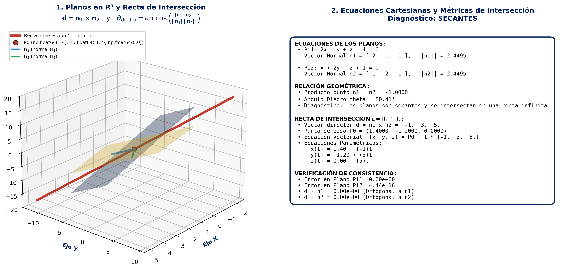

<div align="center">

# 📐 Álgebra Lineal — Repositorio de Código, Simulaciones y Solucionarios


<br/>


</div>

---

## 📌 Descripción General

Este repositorio reúne algoritmos computacionales, simulaciones geométricas 2D/3D, cuadernos interactivos y solucionarios formales desarrollados por **Moisés Amundarain Romero** (Ingeniería Civil Informática) para el estudio y aplicación del **Álgebra Lineal**.

El proyecto integra:
1. **Suite de Simuladores 3D y Cuadernos Interactivos (`Códigos/`):** 8 simuladores modulares en Python y Jupyter Notebooks con `ipywidgets` y renderizado 3D en la paleta institucional USS (`#00205B` / `#D4AF37`).
2. **Algoritmos y Verificación Simbólica:** Modelado exacto con SymPy y numérico con NumPy/SciPy para Operaciones Elementales por Filas (OEF), determinantes, rangos y sistemas estáticos $6 \times 6$.
3. **Notas Maestras de Teoría en Markdown:** Síntesis rigurosas de *Álgebra Lineal* (Stanley I. Grossman, 7ª ed.) y *Linear Algebra Done Right* (Sheldon Axler, 4ª ed.), junto con los apuntes oficiales de la Unidad 1.
4. **Solucionarios Propios:** Resoluciones completas de talleres universitarios sin inclusión de material protegido.

---

## 🏛️ Diferenciación Histórica: UdeC vs. USS

Para mantener la trazabilidad académica y contextualizar la evolución del código, el contenido se organiza en dos periodos principales:

| Periodo | Institución | Enfoque Principal | Contenido Destacado |
| :--- | :--- | :--- | :--- |
| **2025-1** | **Universidad de Concepción (UdeC)** | Algoritmos iniciales en Python para Sistemas Lineales y reducción Gauss-Jordan con muestra de pasos elementales. | `01_Sistemas_Lineales/solucion_sistemas_lineales.py`<br/>`01_Sistemas_Lineales/solucion_sistemas_pasos.py` |
| **2026-2** | **Universidad San Sebastián (USS — Patagonia)** | Suite completa de 8 simuladores 3D (`Códigos/`), cuadernos con `ipywidgets`, verificación simbólica avanzada (SymPy), diagramas vectoriales de libros (Grossman / Axler) y paleta institucional USS (`#00205B` / `#D4AF37`). | `Códigos/`<br/>`05_Simulaciones_y_Visualizaciones/`<br/>`Listados_y_Solucionarios_Propios/2026-2_USS/` |

---

## 🚀 Suite de Simuladores 3D y Cuadernos Interactivos (Unidades 1, 2 y Física)

La carpeta [`Códigos/`](Códigos/README.md) contiene una suite modular de **8 simuladores** disponibles en formato dual:
* **Scripts CLI independientes (`.py`):** Ejecución directa desde consola, compatibles con entornos locales y servidores headless (detección automática de display y renderizado PNG).
* **Cuadernos interactivos (`.ipynb`):** Entornos de exploración visual potenciados por **Jupyter** e **`ipywidgets`**, con deslizadores de coeficientes en tiempo real, rotación dinámica de cámaras 3D y cálculo simbólico instantáneo.

### 📊 Tabla Comparativa de Simuladores

| # | Módulo | Concepto Central | Script CLI (`.py`) | Cuaderno Interactivo (`.ipynb`) | Modelado Matemático Clave | Salida Visual |
| :-: | :--- | :--- | :--- | :--- | :--- | :--- |
| **01** | **Gauss-Jordan & Rouché-Frobenius 3D** | Rango matricial, OEF y consistencia geométrica | [`01_...3d.py`](Códigos/01_Sistemas_Lineales_y_Matrices/01_gauss_jordan_y_rouche_frobenius_3d.py) | [`01_...3d.ipynb`](Códigos/01_Sistemas_Lineales_y_Matrices/01_gauss_jordan_y_rouche_frobenius_3d.ipynb) | $\operatorname{rg}(A)$ vs $\operatorname{rg}(A\|B)$<br/>SCD, SCI, SI | 3 planos en $\mathbb{R}^3$, punto de corte, haz de planos o prisma triangular. |
| **02** | **Sistemas Parametrizados $k$** | Discusión de determinantes y singularidades | [`02_...k.py`](Códigos/01_Sistemas_Lineales_y_Matrices/02_sistemas_parametrizados_k.py) | [`02_...k.ipynb`](Códigos/01_Sistemas_Lineales_y_Matrices/02_sistemas_parametrizados_k.ipynb) | $\det(A(k)) = 0$<br/>Raíces críticas $k_i$ | Gráfico $\det(A(k))$ vs $k$ y configuración espacial 3D instantánea. |
| **03** | **Cofactores e Inversa Matricial** | Expansión de Laplace e inversión analítica | [`03_...inversa.py`](Códigos/01_Sistemas_Lineales_y_Matrices/03_matrices_cofactores_e_inversa.py) | [`03_...inversa.ipynb`](Códigos/01_Sistemas_Lineales_y_Matrices/03_matrices_cofactores_e_inversa.ipynb) | $A^{-1} = \frac{1}{\det(A)} \operatorname{Adj}(A)$<br/>$A \cdot A^{-1} = I_n$ | Mapas de calor matriciales anotados numéricamente con la paleta USS. |
| **04** | **Vectores & Proyecciones $\mathbb{R}^2/\mathbb{R}^3$** | Cosenos directores y descomposición ortogonal | [`04_...proyecciones.py`](Códigos/02_Geometria_Vectorial_R2_R3/04_vectores_fundamentos_y_proyecciones.py) | [`04_...proyecciones.ipynb`](Códigos/02_Geometria_Vectorial_R2_R3/04_vectores_fundamentos_y_proyecciones.ipynb) | $\mathbf{u} = \operatorname{proy}_{\mathbf{v}}(\mathbf{u}) + \mathbf{u}_\perp$<br/>Cauchy-Schwarz | Triángulo vectorial 2D/3D con ángulo $\theta$ y cosenos directores. |
| **05** | **Producto Cruz & Paralelepípedos 3D** | Ortogonalidad vectorial y volúmenes poliédricos | [`05_...3d.py`](Códigos/02_Geometria_Vectorial_R2_R3/05_producto_cruz_y_paralelepipedos_3d.py) | [`05_...3d.ipynb`](Códigos/02_Geometria_Vectorial_R2_R3/05_producto_cruz_y_paralelepipedos_3d.ipynb) | $V = \|\mathbf{u} \cdot (\mathbf{v} \times \mathbf{w})\|$<br/>Identidad de Lagrange | Paralelepípedo sólido 3D con 6 caras poligonales semitransparentes. |
| **06** | **Rectas en $\mathbb{R}^3$ & Alabeadas** | Posiciones relativas y mínima separación | [`06_...alabeadas.py`](Códigos/02_Geometria_Vectorial_R2_R3/06_rectas_en_r3_y_rectas_alabeadas.py) | [`06_...alabeadas.ipynb`](Códigos/02_Geometria_Vectorial_R2_R3/06_rectas_en_r3_y_rectas_alabeadas.ipynb) | $d = \frac{\|(\mathbf{P}_2 - \mathbf{P}_1) \cdot (\mathbf{d}_1 \times \mathbf{d}_2)\|}{\|\mathbf{d}_1 \times \mathbf{d}_2\|}$ | Trayectorias de rectas espaciales y segmento ortogonal de mínima distancia. |
| **07** | **Planos en $\mathbb{R}^3$ & Ángulo Diedro** | Ecuaciones generales e intersecciones | [`07_...intersecciones.py`](Códigos/02_Geometria_Vectorial_R2_R3/07_planos_en_r3_e_intersecciones.py) | [`07_...intersecciones.ipynb`](Códigos/02_Geometria_Vectorial_R2_R3/07_planos_en_r3_e_intersecciones.ipynb) | $\mathbf{d} = \mathbf{n}_1 \times \mathbf{n}_2$<br/>$\cos\theta = \frac{\|\mathbf{n}_1 \cdot \mathbf{n}_2\|}{\|\mathbf{n}_1\|\|\mathbf{n}_2\|}$ | Superficies de planos secantes y recta de intersección dorada. |
| **08** | **Torque 3D & Equilibrio Estático** | Estática de cuerpo rígido y tensores espaciales | [`08_...3d.py`](Códigos/03_Aplicaciones_Fisicas_y_Simulaciones/08_simulacion_torque_y_equilibrio_3d.py) | [`08_...3d.ipynb`](Códigos/03_Aplicaciones_Fisicas_y_Simulaciones/08_simulacion_torque_y_equilibrio_3d.ipynb) | Sistema lineal $6 \times 6$:<br/>$\sum \mathbf{F} = \mathbf{0}$, $\sum \boldsymbol{\tau}_O = \mathbf{0}$ | Brazo mecánico tridimensional, cables tensores, cargas y vector de torque. |

---

## 🗂️ Arquitectura del Repositorio

```text
Linear-Algebra/
├── README.md                                               # Presentación principal y guía del repositorio
├── LICENSE                                                 # Licencia MIT (Open Source)
├── requirements.txt                                        # Dependencias requeridas (numpy, sympy, matplotlib, ipywidgets, etc.)
├── lineal.jpg                                              # Portada del repositorio
│
├── Códigos/                                                # SUITE DE SIMULADORES 3D Y CUADERNOS INTERACTIVOS (USS)
│   ├── README.md                                           # Presentación técnica detallada de los 8 simuladores
│   ├── 01_Sistemas_Lineales_y_Matrices/                    # Unidad 1: Sistemas Lineales, Rouché-Frobenius e Inversas
│   │   ├── 01_gauss_jordan_y_rouche_frobenius_3d.py
│   │   ├── 01_gauss_jordan_y_rouche_frobenius_3d.ipynb
│   │   ├── 02_sistemas_parametrizados_k.py
│   │   ├── 02_sistemas_parametrizados_k.ipynb
│   │   ├── 03_matrices_cofactores_e_inversa.py
│   │   └── 03_matrices_cofactores_e_inversa.ipynb
│   ├── 02_Geometria_Vectorial_R2_R3/                       # Unidad 2: Proyecciones, Producto Cruz, Rectas y Planos 3D
│   │   ├── 04_vectores_fundamentos_y_proyecciones.py
│   │   ├── 04_vectores_fundamentos_y_proyecciones.ipynb
│   │   ├── 05_producto_cruz_y_paralelepipedos_3d.py
│   │   ├── 05_producto_cruz_y_paralelepipedos_3d.ipynb
│   │   ├── 06_rectas_en_r3_y_rectas_alabeadas.py
│   │   ├── 06_rectas_en_r3_y_rectas_alabeadas.ipynb
│   │   ├── 07_planos_en_r3_e_intersecciones.py
│   │   └── 07_planos_en_r3_e_intersecciones.ipynb
│   └── 03_Aplicaciones_Fisicas_y_Simulaciones/             # Aplicaciones Físicas: Equilibrio Estático y Torque Vectorial
│       ├── 08_simulacion_torque_y_equilibrio_3d.py
│       └── 08_simulacion_torque_y_equilibrio_3d.ipynb
│
├── 01_Sistemas_Lineales/                                   # OEF, Gauss-Jordan y Solución Paso a Paso
│   ├── solucion_sistemas_lineales.py                       # Análisis de inconsistencia, SCD y SCI
│   ├── solucion_sistemas_pasos.py                          # Desglose paso a paso de matriz aumentada a RREF
│   ├── verificar_taller1.py                                # Script de verificación simbólica (SymPy)
│   ├── grossman_capitulo_1_figura.py                       # Geometría de sistemas lineales (Cap. 1 Grossman)
│   └── grossman_capitulo_3_figura.py                       # Determinantes y cofactores (Cap. 3 Grossman)
│
├── 02_Espacios_Vectoriales/                                # Generado, Independencia Lineal, Bases y Dimensión
│   ├── axler_chapter_1_figura.py                           # Espacios Vectoriales (Axler Ch. 1)
│   ├── axler_chapter_2_figura.py                           # Dimensión e Independencia Lineal (Axler Ch. 2)
│   ├── axler_chapter_4_figura.py                           # Polinomios y Subespacios (Axler Ch. 4)
│   ├── axler_chapter_6_figura.py                           # Espacios con Producto Interno (Axler Ch. 6)
│   └── grossman_capitulo_5_figura.py                       # Subespacios y combinación lineal (Cap. 5 Grossman)
│
├── 03_Transformaciones_Lineales/                          # Núcleo, Imagen, Matriz de Cambio de Base
│   ├── axler_chapter_3_figura.py                           # Mapas Lineales (Axler Ch. 3)
│   ├── axler_chapter_9_figura.py                           # Operadores en Espacios Reales (Axler Ch. 9)
│   └── grossman_capitulo_6_figura.py                       # Transformaciones 2D/3D (Cap. 6 Grossman)
│
├── 04_Valores_y_Vectores_Propios/                           # Autovalores, Diagonalización y SVD
│   ├── axler_chapter_5_figura.py                           # Autovalores y Autovectores (Axler Ch. 5)
│   ├── axler_chapter_7_figura.py                           # Operadores en Dimensión Finita (Axler Ch. 7)
│   ├── axler_chapter_8_figura.py                           # Formas Canónicas (Axler Ch. 8)
│   ├── axler_chapter_10_figura.py                          # Teorema Espectral y SVD (Axler Ch. 10)
│   └── grossman_capitulo_7_figura.py                       # Diagonalización (Cap. 7 Grossman)
│
├── 05_Simulaciones_y_Visualizaciones/                      # Gráficos y figuras exportadas
│   ├── generar_figuras_taller1.py                         # Generación de gráficos con paleta USS
│   ├── Figura1_producto_matrices.png                      # Multiplicación de matrices
│   ├── Figura2_sarrus_cofactores.png                      # Regla de Sarrus y cofactores
│   └── Figura3_valores_propios.png                        # Transformación de autovectores
│
├── Teoria/                                                 # Apuntes de teoría y notas de libros en Markdown
│   ├── Unidad_1_Matrices_y_Sistemas/                       # Apunte completo de Matrices y Sistemas
│   ├── Libros/Grossman/                                    # Nota maestra 8 capítulos (Grossman 7ª ed.)
│   └── Libros/Axler/                                       # Nota maestra 10 capítulos (Axler 4ª ed.)
│
└── Listados_y_Solucionarios_Propios/                       # Solucionarios desarrollados en Markdown
    ├── 2025-1_UdeC/                                        # Ejercicios UdeC
    └── 2026-2_USS/                                         # Solucionarios formales USS (Taller 1, etc.)
```

---

## 💻 Requisitos e Instalación

Para ejecutar tanto los scripts clásicos como la nueva suite de simuladores y cuadernos interactivos:

```bash
# 1. Clonar el repositorio
git clone git@github.com:moises-inc/Linear-Algebra.git
cd Linear-Algebra

# 2. Crear y activar entorno virtual
python3 -m venv .venv
source .venv/bin/activate  # En Linux/macOS
# .venv\Scripts\activate   # En Windows

# 3. Instalar dependencias completas
pip install -r requirements.txt
```

---

## ⚡ Guía de Uso e Interactividad

### 1. Ejecución de la Suite de Simuladores (CLI)
Cada script de la carpeta `Códigos/` es ejecutable directamente desde terminal:

```bash
# Simulación 3D de Sistemas Lineales y Rouché-Frobenius
python3 Códigos/01_Sistemas_Lineales_y_Matrices/01_gauss_jordan_y_rouche_frobenius_3d.py

# Discusión analítica con parámetro k
python3 Códigos/01_Sistemas_Lineales_y_Matrices/02_sistemas_parametrizados_k.py

# Simulación de paralelepípedos y producto mixto 3D
python3 Códigos/02_Geometria_Vectorial_R2_R3/05_producto_cruz_y_paralelepipedos_3d.py

# Simulación de torque y equilibrio estático de cuerpo rígido
python3 Códigos/03_Aplicaciones_Fisicas_y_Simulaciones/08_simulacion_torque_y_equilibrio_3d.py
```

### 2. Uso de Cuadernos Interactivos con `ipywidgets`
Los cuadernos interactivos (`.ipynb`) permiten explorar los conceptos visualmente:
- Deslizadores en tiempo real para modificar coordenadas vectoriales y coeficientes matriciales.
- Menús desplegables para alternar casos de consistencia (SCD, SCI, SI) o tipos de posiciones relativas.
- Control de perspectiva tridimensional (`elev`, `azim`) con actualización dinámica.

Para iniciarlos:
```bash
jupyter lab
# o
jupyter notebook
```
También puedes abrirlos directamente en **Visual Studio Code** o **Cursor** seleccionando el intérprete de `.venv`.

---

## 🖼️ Muestra de Visualizaciones de la Suite

<div align="center">

| Rouché-Frobenius 3D (SCD) | Paralelepípedo 3D (`Poly3DCollection`) | Torque y Equilibrio Estático 3D |
| :---: | :---: | :---: |
|  |  |  |

| Rectas Alabeadas y Distancia Mínima | Inversión Matricial y Cofactores | Geometría de Planos e Intersecciones |
| :---: | :---: | :---: |
|  |  |  |

</div>

---

## 🔒 Política de Propiedad Intelectual y Transparencia

> [!IMPORTANT]
> **Compromiso Institucional y Cero Material Copiado:**
> Este repositorio contiene **exclusivamente código informático, simulaciones y solucionarios de autoría original** desarrollados por Moisés Amundarain Romero.
> 
> No se suben ni distribuyen guías oficiales en PDF, enunciados impresos ni diapositivas docentes de las universidades (UdeC / USS) para respetar estrictamente los derechos de autor institucionales.

---

## 📜 Licencia

Este proyecto está distribuido bajo la **Licencia MIT**. Consulta el archivo [LICENSE](LICENSE) para obtener más detalles.

---

<div align="center">
Desarrollado con rigor matemático y computacional por <b>Moisés Amundarain Romero</b><br/>
Universidad San Sebastián — Sede De la Patagonia
</div>
