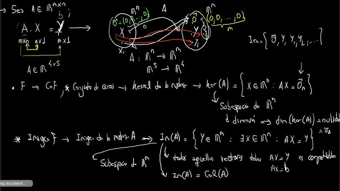
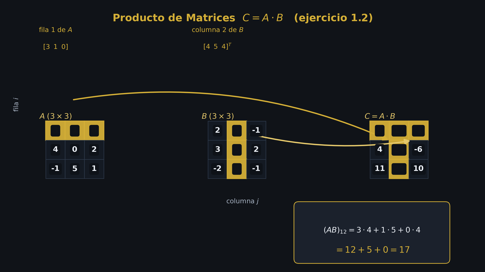
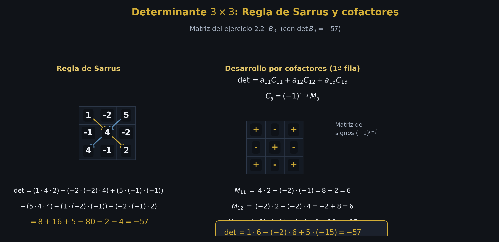
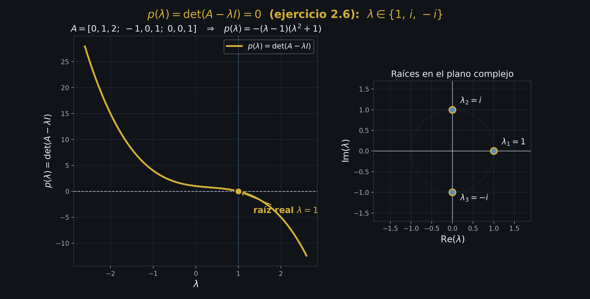

<div align="center">

# 📐 Álgebra Lineal — Repositorio de Código, Simulaciones y Solucionarios


<br/>



</div>

---

## 📌 Descripción General

Este repositorio reúne algoritmos computacionales, simulaciones geométricas 2D/3D y solucionarios formales desarrollados por **Moisés Amundarain Romero** (Ingeniería Civil Informática) para el estudio y aplicación del **Álgebra Lineal**.

El proyecto abarca desde la resolución simbólica de sistemas de ecuaciones lineales mediante Operaciones Elementales por Filas (OEF), pasando por espacios vectoriales y transformaciones lineales, hasta la diagonalización, autovalores y descomposición en valores singulares (SVD).

Incluye además **notas maestras de teoría en Markdown** — síntesis completas de *Álgebra Lineal* (Stanley I. Grossman, 7ª ed.) y *Linear Algebra Done Right* (Sheldon Axler, 4ª ed.) — junto con el apunte de la Unidad 1 (matrices y sistemas), todas con diagramas vectoriales reproducibles en la paleta USS.

---

## 🏛️ Diferenciación Histórica: UdeC vs. USS

Para mantener la trazabilidad académica y contextualizar la evolución del código, el contenido se organiza en dos periodos principales:

| Periodo | Institución | Enfoque Principal | Contenido Destacado |
| :--- | :--- | :--- | :--- |
| **2025-1** | **Universidad de Concepción (UdeC)** | Algoritmos iniciales en Python para Sistemas Lineales y reducción Gauss-Jordan con muestra de pasos elementales. | `01_Sistemas_Lineales/solucion_sistemas_lineales.py`<br/>`01_Sistemas_Lineales/solucion_sistemas_pasos.py` |
| **2026-2** | **Universidad San Sebastián (USS — Patagonia)** | Verificación simbólica avanzada (SymPy), generación de figuras de talleres y diagramas geométricos de libros (Grossman / Axler) con la paleta de colores institucional USS (`#00205B` / `#D4AF37`). | `05_Simulaciones_y_Visualizaciones/`<br/>`Listados_y_Solucionarios_Propios/2026-2_USS/` |

---

## 🗂️ Arquitectura del Repositorio

```text
Linear-Algebra/
├── README.md                                    # Presentación principal y guía del repositorio
├── LICENSE                                      # Licencia MIT (Open Source)
├── requirements.txt                             # Dependencias de Python requeridas
├── lineal.jpg                                   # Portada del repositorio
│
├── 01_Sistemas_Lineales/                        # OEF, Gauss-Jordan y Teorema de Rouché-Frobenius
│   ├── solucion_sistemas_lineales.py            # Análisis de inconsistencia, solución única e infinitas soluciones
│   ├── solucion_sistemas_pasos.py               # Desglose paso a paso de matriz aumentada a RREF
│   ├── verificar_taller1.py                     # Script de verificación simbólica (SymPy)
│   ├── grossman_capitulo_1_figura.py            # Visualización geométrica de sistemas lineales (Cap. 1 Grossman)
│   └── grossman_capitulo_3_figura.py            # Visualización de determinantes y cofactores (Cap. 3 Grossman)
│
├── 02_Espacios_Vectoriales/                     # Generado, Independencia Lineal, Bases y Dimensión
│   ├── axler_chapter_1_figura.py                # Espacios Vectoriales (Axler Ch. 1)
│   ├── axler_chapter_2_figura.py                # Dimensión y Independencia Lineal (Axler Ch. 2)
│   ├── axler_chapter_4_figura.py                # Polinomios y Subespacios (Axler Ch. 4)
│   ├── axler_chapter_6_figura.py                # Espacios con Producto Interno (Axler Ch. 6)
│   └── grossman_capitulo_5_figura.py            # Subespacios y combinación lineal (Cap. 5 Grossman)
│
├── 03_Transformaciones_Lineales/               # Núcleo, Imagen, Matriz de Cambio de Base
│   ├── axler_chapter_3_figura.py                # Mapas Lineales / Transformaciones (Axler Ch. 3)
│   ├── axler_chapter_9_figura.py                # Operadores en Espacios Vectoriales Reales (Axler Ch. 9)
│   └── grossman_capitulo_6_figura.py            # Transformaciones Lineales 2D/3D (Cap. 6 Grossman)
│
├── 04_Valores_y_Vectores_Propios/                # Autovalores, Diagonalización, Forma Canónica y SVD
│   ├── axler_chapter_5_figura.py                # Autovalores y Autovectores (Axler Ch. 5)
│   ├── axler_chapter_7_figura.py                # Operadores en Espacios de Dimensión Finita (Axler Ch. 7)
│   ├── axler_chapter_8_figura.py                # Operadores Complejos y Formas Canónicas (Axler Ch. 8)
│   ├── axler_chapter_10_figura.py               # Teorema Espectral y SVD (Axler Ch. 10)
│   └── grossman_capitulo_7_figura.py            # Diagonalización y Formas Cuadráticas (Cap. 7 Grossman)
│
├── 05_Simulaciones_y_Visualizaciones/           # Gráficos y figuras exportadas (Matplotlib / Manim)
│   ├── generar_figuras_taller1.py              # Script de generación de gráficos con paleta USS
│   ├── Figura1_producto_matrices.png           # Diagrama visual de multiplicación de matrices
│   ├── Figura2_sarrus_cofactores.png           # Diagrama de Regla de Sarrus y Expansión por Cofactores
│   └── Figura3_valores_propios.png             # Transformación de autovectores bajo matriz A
│
├── Teoria/                                      # Apuntes de teoría y notas de libros en Markdown
│   ├── Unidad_1_Matrices_y_Sistemas/            # Matrices, determinantes y sistemas lineales
│   │   ├── Matrices.md                          # Apunte completo de la Unidad 1
│   │   └── figuras/                             # Figuras del apunte
│   ├── Unidad_2_Espacios_Vectoriales/           # (contenido en preparación)
│   ├── Unidad_3_Transformaciones_Lineales/      # (contenido en preparación)
│   ├── Unidad_4_Valores_y_Vectores_Propios/     # (contenido en preparación)
│   └── Libros/
│       ├── Grossman/
│       │   ├── Grossman_Algebra_Lineal.md       # Nota maestra — 8 capítulos (Stanley I. Grossman, 7ª ed.)
│       │   └── figuras/                         # Diagramas geométricos por capítulo
│       └── Axler/
│           ├── Axler_Linear_Algebra_Done_Right.md  # Nota maestra — 10 capítulos (Sheldon Axler, 4ª ed.)
│           └── figuras/                         # Diagramas vectoriales por capítulo
│
└── Listados_y_Solucionarios_Propios/            # Solucionarios y notas conceptuales propias
    ├── 2025-1_UdeC/                             # Registro de ejercicios UdeC
    └── 2026-2_USS/                              # Solucionarios desarrollados en Markdown (Taller 1, etc.)
        ├── Resolucion_TALLER_1_ALGEBRA_LINEAL.md
        └── Notas_Teoricas_Matrices.md
```

---

## 💻 Requisitos e Instalación

Para ejecutar los scripts de Python y generar las simulaciones visuales en tu entorno local:

```bash
# 1. Clonar el repositorio
git clone git@github.com:moises-inc/Linear-Algebra.git
cd Linear-Algebra

# 2. (Opcional) Crear entorno virtual
python3 -m venv .venv
source .venv/bin/activate

# 3. Instalar dependencias
pip install -r requirements.txt
```

---

## ⚡ Ejemplos de Uso

### 1. Solución de Sistemas Lineales con Muestra de Pasos (OEF)
```bash
python3 01_Sistemas_Lineales/solucion_sistemas_pasos.py
```

### 2. Verificación de Taller mediante SymPy
```bash
python3 01_Sistemas_Lineales/verificar_taller1.py
```

### 3. Generación de Diagramas Vectoriales (Paleta USS)
```bash
python3 05_Simulaciones_y_Visualizaciones/generar_figuras_taller1.py
```

---

## 🖼️ Muestra de Visualizaciones

<div align="center">

| Producto de Matrices | Cofactores y Sarrus | Autovalores y Autovectores |
| :---: | :---: | :---: |
|  |  |  |

</div>

---

## 🔒 Política de Propiedad Intelectual y Transparencia

> [!IMPORTANT]
> **Compromiso Institucional y Cero Material Copiado:**
> Este repositorio contiene **exclusivamente código informático, scripts de verificación y solucionarios de autoría original** desarrollados por Moisés Amundarain Romero.
> 
> No se suben ni distribuyen guías oficiales en PDF, enunciados impresos ni diapositivas docentes de las universidades (UdeC / USS) para respetar estrictamente los derechos de autor institucionales.

---

## 📜 Licencia

Este proyecto está distribuido bajo la **Licencia MIT**. Consulta el archivo [LICENSE](LICENSE) para obtener más detalles.

---

<div align="center">
Desarrollado por <b>Moisés Amundarain Romero</b> — Universidad San Sebastián
</div>
