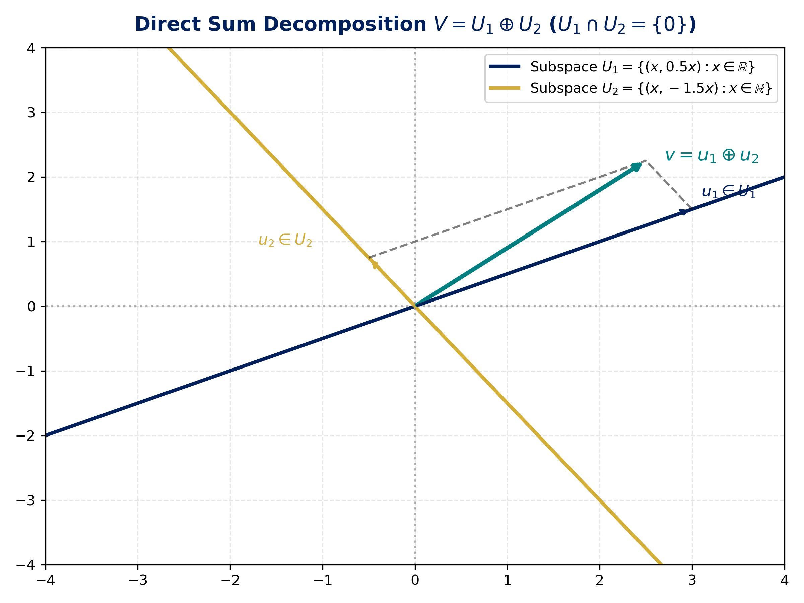
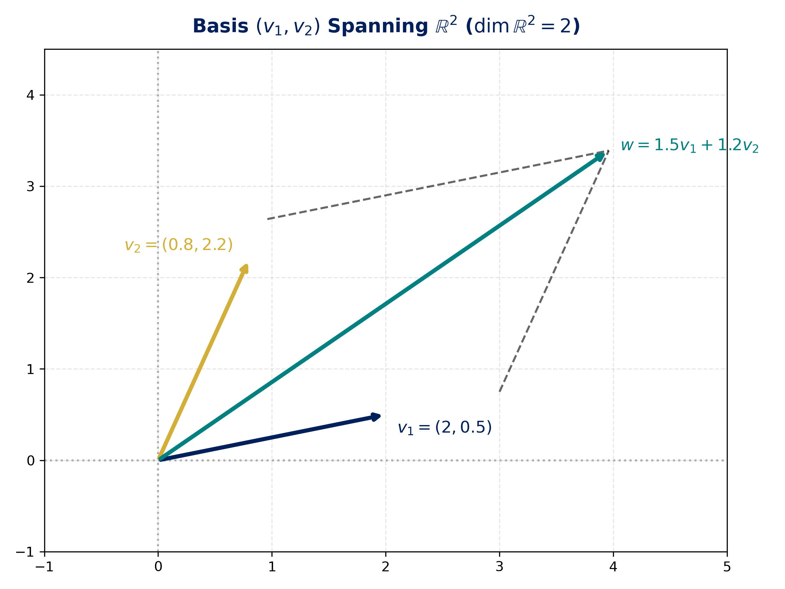
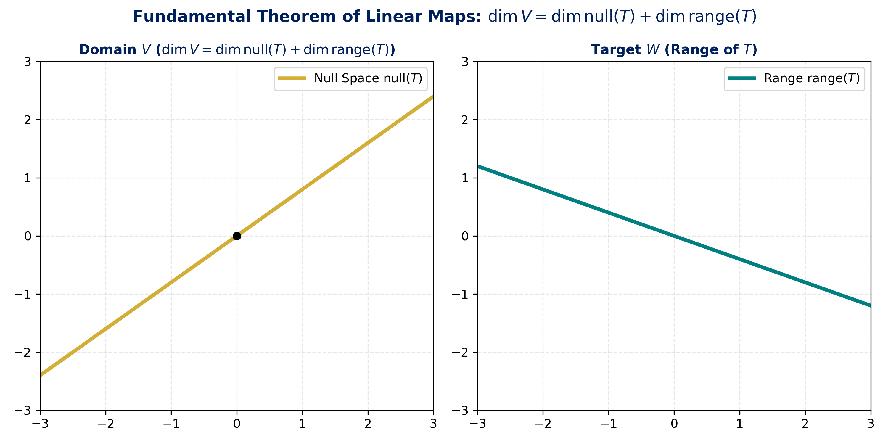
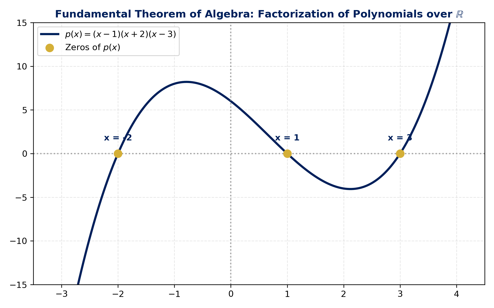
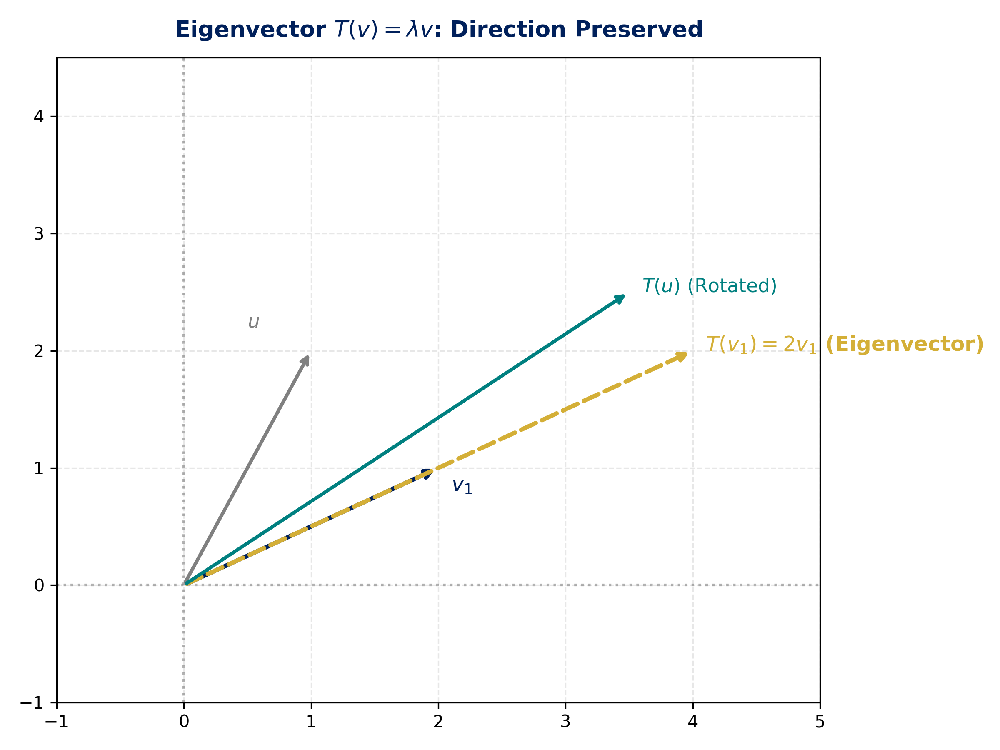
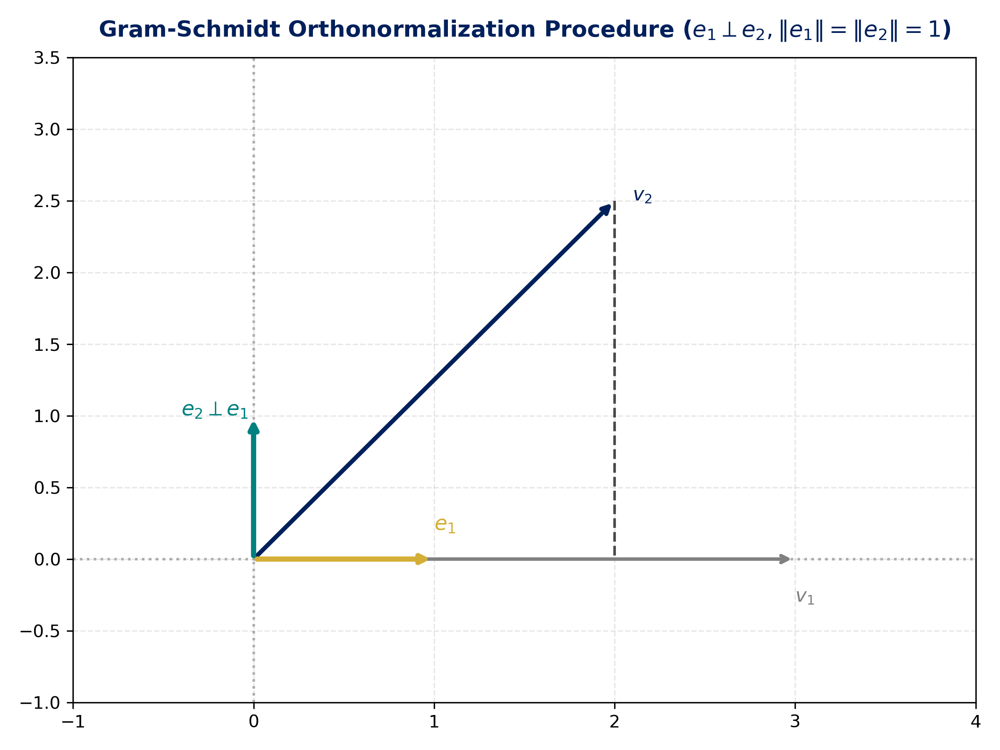
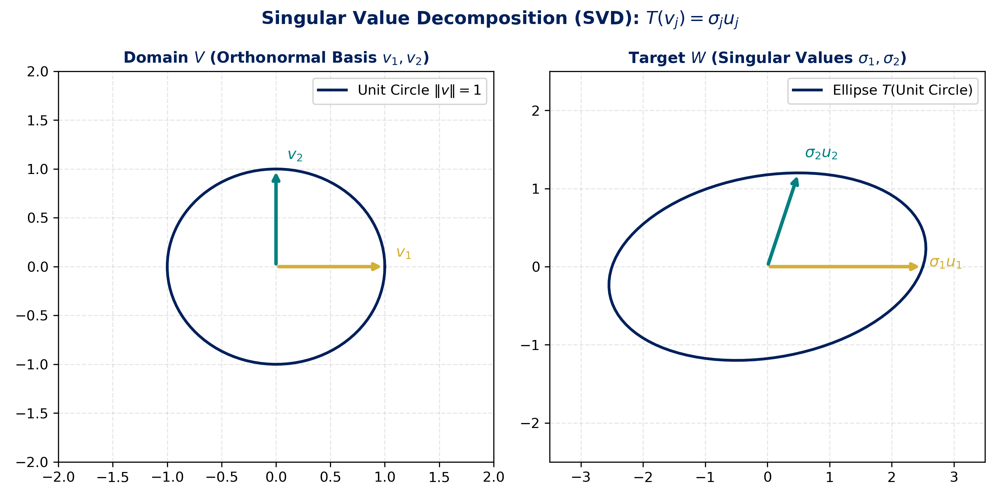
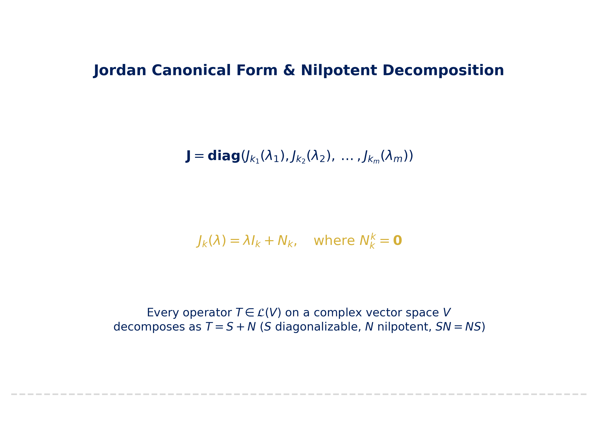
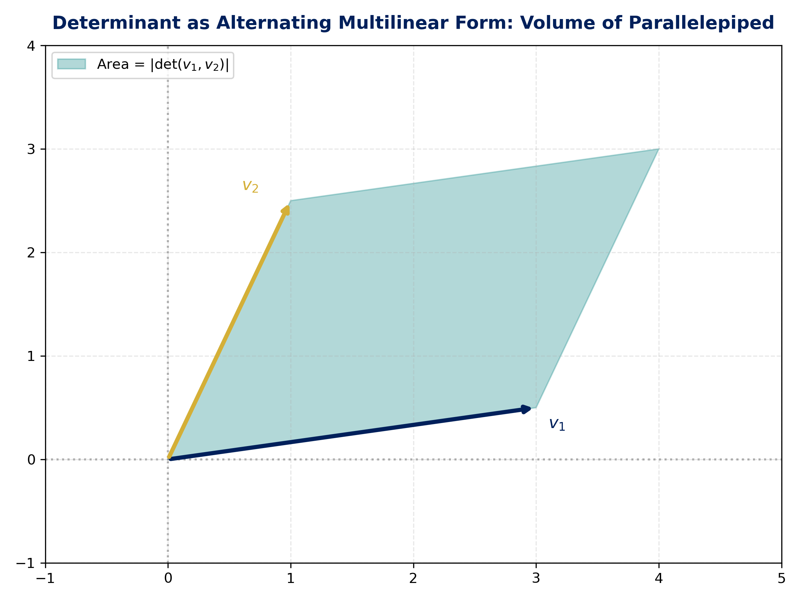
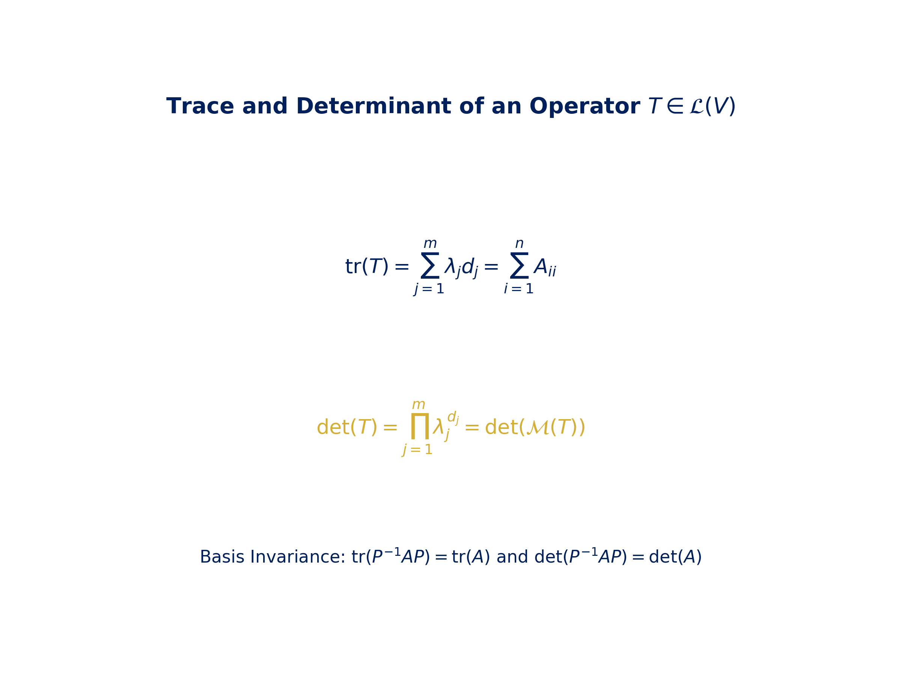

# 📗 Linear Algebra Done Right — Nota Maestra del Libro (Sheldon Axler, 4th Edition)

> [!NOTE]
> Esta es la **Nota Maestra Unificada** que consolida el contenido completo de los 10 capítulos del aclamado texto de **Sheldon Axler** (*Linear Algebra Done Right*, Springer, 528 páginas). Desarrolla la teoría abstracta de espacios vectoriales y operadores lineales sin depender de determinantes tempranos, e incluye teoremas demostrados, ejemplos resueltos, código Python (`sympy`/`numpy`) e ilustraciones vectoriales.

---

## 🗂️ Índice General del Libro

- [Capítulo 1: Espacios Vectoriales](#capítulo-1-espacios-vectoriales)
- [Capítulo 2: Espacios Vectoriales de Dimensión Finita](#capítulo-2-espacios-vectoriales-de-dimensión-finita)
- [Capítulo 3: Aplicaciones Lineales](#capítulo-3-aplicaciones-lineales)
- [Capítulo 4: Polinomios](#capítulo-4-polinomios)
- [Capítulo 5: Valores Propios y Vectores Propios](#capítulo-5-valores-propios-y-vectores-propios)
- [Capítulo 6: Espacios con Producto Interno](#capítulo-6-espacios-con-producto-interno)
- [Capítulo 7: Operadores en Espacios con Producto Interno](#capítulo-7-operadores-en-espacios-con-producto-interno)
- [Capítulo 8: Operadores en Espacios Vectoriales Complejos](#capítulo-8-operadores-en-espacios-vectoriales-complejos)
- [Capítulo 9: Álgebra Multilineal y Determinantes](#capítulo-9-álgebra-multilineal-y-determinantes)
- [Capítulo 10: Traza y Determinante](#capítulo-10-traza-y-determinante)

---


---

# Capítulo 1: Espacios Vectoriales

> [!NOTE]
> En este primer capítulo de *Linear Algebra Done Right* (4ª edición), Sheldon Axler sienta las bases axiomáticas del álgebra lineal trabajando sobre cuerpos arbitrarios $\mathbb{F}$ (donde $\mathbb{F} = \mathbb{R}$ o $\mathbb{F} = \mathbb{C}$). Se definen formalmente los espacios vectoriales, subespacios, sumas de subespacios y la noción fundamental de **suma directa** ($\oplus$).

---

## 1A. $\mathbb{R}^n$ y $\mathbb{C}^n$

### 1.1 Números Complejos ($\mathbb{C}$)
Un **número complejo** es un par ordenado $(a, b) \in \mathbb{R}^2$, escrito como $z = a + bi$, donde $i = \sqrt{-1}$ satisface $i^2 = -1$.
- **Suma:** $(a + bi) + (c + di) = (a+c) + (b+d)i$.
- **Producto:** $(a + bi)(c + di) = (ac - bd) + (ad + bc)i$.
- **Inverso multiplicativo:** Si $z \neq 0$, $z^{-1} = \frac{a - bi}{a^2 + b^2}$.

### 1.2 Cuerpos ($\mathbb{F}$)
Un **cuerpo** (o *field*) $\mathbb{F}$ es un conjunto provisto de dos operaciones (suma y multiplicación) que satisfacen las propiedades conmutativa, asociativa, distributiva, y la existencia de elementos neutros ($0$ y $1$) e inversos. En todo este texto, $\mathbb{F}$ denota indistintamente a $\mathbb{R}$ o $\mathbb{C}$.

### 1.3 Listas y el Espacio $\mathbb{F}^n$
Para $n \in \mathbb{Z}^+$, una **lista** de longitud $n$ es una secuencia ordenada de $n$ elementos $(x_1, x_2, \dots, x_n)$. El conjunto de todas las listas de longitud $n$ con entradas en $\mathbb{F}$ se denota $\mathbb{F}^n$:

$$
\mathbb{F}^n = \{(x_1, x_2, \dots, x_n) : x_j \in \mathbb{F} \text{ para } j = 1, \dots, n\}
$$

- **Suma en $\mathbb{F}^n$:** $(x_1, \dots, x_n) + (y_1, \dots, y_n) = (x_1+y_1, \dots, x_n+y_n)$.
- **Multiplicación por escalar:** $\lambda(x_1, \dots, x_n) = (\lambda x_1, \dots, \lambda x_n)$.

---

## 1B. Definición de Espacio Vectorial

### 1.4 Definición de Espacio Vectorial 📖 [Axler 4ª Ed. §1B]
Un **espacio vectorial** sobre $\mathbb{F}$ es un conjunto $V$ junto con una operación de suma $V \times V \to V$ y una multiplicación por escalar $\mathbb{F} \times V \to V$ que satisfacen los siguientes 8 axiomas $\forall \, u, v, w \in V$ y $\forall \, \alpha, \beta \in \mathbb{F}$:

1. **Conmutatividad de la suma:** $u + v = v + u$.
2. **Asociatividad de la suma:** $(u + v) + w = u + (v + w)$.
3. **Elemento neutro aditivo:** Existe un elemento $0 \in V$ tal que $v + 0 = v$.
4. **Inverso aditivo:** Para cada $v \in V$, existe $-v \in V$ tal que $v + (-v) = 0$.
5. **Elemento neutro multiplicativo:** $1 \cdot v = v$.
6. **Distributividad por escalar:** $(\alpha + \beta)v = \alpha v + \beta v$.
7. **Distributividad por vector:** $\alpha(u + v) = \alpha u + \alpha v$.
8. **Asociatividad multiplicativa:** $(\alpha \beta)v = \alpha(\beta v)$.

> [!important] Teoremas de Propiedades Básicas
> - El neutro aditivo $0 \in V$ es **único**.
> - El inverso aditivo $-v$ es **único** para cada $v \in V$.
> - $0 \cdot v = 0$ para todo $v \in V$.
> - $\alpha \cdot 0 = 0$ para todo $\alpha \in \mathbb{F}$.
> - $(-1)v = -v$ para todo $v \in V$.

---

## 1C. Subespacios y Sumas Directas

### 1.5 Subespacios Vectoriales (§1C)
Un subconjunto $U \subseteq V$ es un **subespacio** de $V$ si $U$ es en sí mismo un espacio vectorial bajo las mismas operaciones de $V$.

> [!theorem] Criterio de Subespacio (3 Condiciones)
> Un subconjunto $U \subseteq V$ es un subespacio de $V$ $\iff$ cumple:
> 1. **Contiene al cero:** $0 \in U$.
> 2. **Cerrado bajo la suma:** $u, w \in U \implies u + w \in U$.
> 3. **Cerrado bajo multiplicación escalar:** $u \in U, \alpha \in \mathbb{F} \implies \alpha u \in U$.

### 1.6 Suma de Subespacios
Si $U_1, \dots, U_m$ son subespacios de $V$, la **suma** $U_1 + \dots + U_m$ es el conjunto de todas las sumas de elementos de los subespacios:

$$
U_1 + \dots + U_m = \{u_1 + \dots + u_m : u_j \in U_j \text{ para } j = 1, \dots, m\}
$$

> [!tip]
> La suma $U_1 + \dots + U_m$ es el **subespacio más pequeño** de $V$ que contiene a todos los $U_j$.

### 1.7 Sumas Directas ($\oplus$) 📖 [Axler 4ª Ed. §1C]
La suma $U_1 + \dots + U_m$ se llama **suma directa**, denotada $U_1 \oplus \dots \oplus U_m$, si cada elemento de la suma se puede escribir de **una sola forma** como $u_1 + \dots + u_m$ con $u_j \in U_j$.

```mermaid
mindmap
 root((Direct Sums))
 Representación Única
 v = u1 + u2 incondicionalmente único
 Intersección Nula (para 2 subespacios)
 U1 ∩ U2 = {0}
 Representación del Cero
 0 = u1 + u2 ⇒ u1 = 0 y u2 = 0
```

> [!theorem] Criterio de Suma Directa para 2 Subespacios
> Supóngase que $U_1, U_2$ son subespacios de $V$. Entonces $U_1 + U_2$ es una suma directa $U_1 \oplus U_2$ $\iff$
>
> $$
> U_1 \cap U_2 = \{0\}
> $$

```text
Figura Visualización de Suma Directa:

```

---

## 🛠️ Verificación Computacional en Python (SymPy)

```python
import sympy as sp

# Definición de vectores en F^3
v1 = sp.Matrix([1, 2, 0])
v2 = sp.Matrix([0, 1, 1])

# Comprobar si u = (2, 5, 1) está en la suma U1 + U2
u = sp.Matrix([2, 5, 1])
A = sp.Matrix.hstack(v1, v2)
sol, params = A.gauss_jordan_solve(u)
print("Solución para la descomposición u = c1*v1 + c2*v2:")
print(sol)
```

---


---

# Capítulo 2: Espacios Vectoriales de Dimensión Finita

> [!NOTE]
> En este capítulo, Sheldon Axler explora el núcleo de los espacios de dimensión finita: las combinaciones lineales, el espacio generado (*span*), la independencia lineal, la construcción de bases y el concepto único de **dimensión**.

---

## 2A. Espacio Generado e Independencia Lineal

### 2.1 Combinaciones Lineales y Espacio Generado (*Span*) 📖 [Axler 4ª Ed. §2A]
Una **combinación lineal** de una lista de vectores $(v_1, \dots, v_m)$ en $V$ es un vector de la forma:

$$
a_1 v_1 + a_2 v_2 + \dots + a_m v_m
$$

donde $a_1, \dots, a_m \in \mathbb{F}$. El conjunto de todas las combinaciones lineales de $(v_1, \dots, v_m)$ se llama el **espacio generado** (*span*), denotado $\operatorname{span}(v_1, \dots, v_m)$:

$$
\operatorname{span}(v_1, \dots, v_m) = \{a_1 v_1 + \dots + a_m v_m : a_1, \dots, a_m \in \mathbb{F}\}
$$

- El espacio generado $\operatorname{span}(v_1, \dots, v_m)$ es siempre un **subespacio** de $V$.
- Si $\operatorname{span}(v_1, \dots, v_m) = V$, decimos que $(v_1, \dots, v_m)$ **genera** a $V$.
- Un espacio vectorial $V$ se dice de **dimensión finita** si está generado por alguna lista finita de vectores.

### 2.2 Independencia Lineal 📖 [Axler 4ª Ed. §2A]
Una lista de vectores $(v_1, \dots, v_m)$ en $V$ es **linealmente independiente** si la única elección de escalares $a_1, \dots, a_m \in \mathbb{F}$ que satisface:

$$
a_1 v_1 + a_2 v_2 + \dots + a_m v_m = 0
$$

es $a_1 = a_2 = \dots = a_m = 0$.
- Si existen escalares no todos nulos que producen la combinación nula, la lista es **linealmente dependiente**.

> [!theorem] Lemma de Dependencia Lineal
> Supóngase que $(v_1, \dots, v_m)$ es una lista linealmente dependiente en $V$. Entonces existe un $j \in \{1, \dots, m\}$ tal que:
> 1. $v_j \in \operatorname{span}(v_1, \dots, v_{j-1})$.
> 2. Si se remueve $v_j$ de la lista, el conjunto restante sigue teniendo el mismo espacio generado:
> $$\operatorname{span}(v_1, \dots, \hat{v}_j, \dots, v_m) = \operatorname{span}(v_1, \dots, v_m)$$

> [!theorem] Teorema Fundamental (Longitud de Listas Independientes vs Generadoras)
> En un espacio de dimensión finita, **la longitud de cualquier lista linealmente independiente es menor o igual que la longitud de cualquier lista generadora**.
> Si $(u_1, \dots, u_u)$ es independiente y $(w_1, \dots, w_w)$ genera a $V$, entonces:
>
> $$
> u \le w
> $$

---

## 2B. Bases

### 2.3 Definición de Base 📖 [Axler 4ª Ed. §2B]
Una **base** de $V$ es una lista de vectores en $V$ que es **linealmente independiente y genera a $V$**.

> [!theorem] Caracterización Única de la Base
> Una lista $(v_1, \dots, v_n)$ es una base de $V$ $\iff$ todo vector $v \in V$ se puede escribir de **una sola forma** como:
>
> $$
> v = a_1 v_1 + a_2 v_2 + \dots + a_n v_n
> $$
>
> para escalares $a_1, \dots, a_n \in \mathbb{F}$.

### 2.4 Extensión y Reducción a una Base
- **Reducción:** Toda lista generadora de $V$ puede reducirse a una base de $V$.
- **Extensión:** Toda lista linealmente independiente en $V$ puede extenderse a una base de $V$.

---

## 2C. Dimensión

### 2.5 Invariancia del Tamaño de la Base (§2C)
> [!theorem]
> Dos bases cualesquiera de un espacio vectorial de dimensión finita $V$ tienen la **misma longitud**.

### 2.6 Definición de Dimensión
La **dimensión** de un espacio vectorial de dimensión finita $V$, denotada $\dim V$, es la longitud de cualquiera de sus bases.

```text
Figura Representación Visual de Base y Dimensión:

```

### 2.7 Propiedades de la Dimensión
- Si $U$ es un subespacio de $V$, entonces $\dim U \le \dim V$.
- Si $U$ es subespacio de $V$ con $\dim U = \dim V$, entonces $U = V$.
- **Fórmula de la Dimensión para la Suma de Subespacios:**

$$
\dim(U_1 + U_2) = \dim U_1 + \dim U_2 - \dim(U_1 \cap U_2)
$$

---

## 🛠️ Verificación Computacional en Python (SymPy)

```python
import sympy as sp

# Definir una lista de vectores en R^4
v1 = sp.Matrix([1, 0, 2, -1])
v2 = sp.Matrix([0, 1, 1, 3])
v3 = sp.Matrix([2, 1, 5, 1]) # v3 = 2*v1 + v2 (dependiente)

# Matriz con vectores como columnas
A = sp.Matrix.hstack(v1, v2, v3)
A_rref, pivotes = A.rref()

print("Pivotes (índices de la base del espacio columna):", pivotes)
print("Dimensión del espacio generado (rango):", len(pivotes))
```

---


---

# Capítulo 3: Aplicaciones Lineales

> [!NOTE]
> En este extenso capítulo de 6 secciones (3A–3F), Axler desarrolla la teoría de **aplicaciones o transformaciones lineales** $T: V \to W$, el **Teorema Fundamental de las Aplicaciones Lineales**, la relación intrínseca entre transformaciones y matrices, espacios cociente y la estructura de la **dualidad** ($V'$).

---

## 3A. Espacio Vectorial de Aplicaciones Lineales

### 3.1 Definición de Aplicación Lineal 📖 [Axler 4ª Ed. §3A]
Una **aplicación lineal** (o mapa lineal) de $V$ en $W$ es una función $T: V \to W$ que satisface:
- **Aditividad:** $T(u + v) = T(u) + T(v)$ para todo $u, v \in V$.
- **Homogeneidad:** $T(\lambda v) = \lambda T(v)$ para todo $\lambda \in \mathbb{F}$ y $v \in V$.

El conjunto de todas las aplicaciones lineales de $V$ en $W$ se denota $\mathcal{L}(V, W)$. Si $V = W$, se denota $\mathcal{L}(V)$ y sus elementos se llaman **operadores lineales**.

### 3.2 Operaciones en $\mathcal{L}(V, W)$
$\mathcal{L}(V, W)$ es en sí mismo un **espacio vectorial** bajo las operaciones habituales de suma de funciones $(S + T)(v) = S(v) + T(v)$ y multiplicación por escalar $(\lambda T)(v) = \lambda T(v)$. Además, existe la **composición** $ST \in \mathcal{L}(U, W)$ para $T \in \mathcal{L}(U, V)$ y $S \in \mathcal{L}(V, W)$.

---

## 3B. Espacios Nulos e Imagen (Rango)

### 3.3 Espacio Nulo e Inyectividad 📖 [Axler 4ª Ed. §3B]
Para $T \in \mathcal{L}(V, W)$, el **espacio nulo** (o núcleo) de $T$, denotado $\operatorname{null}(T)$, es el conjunto de vectores de $V$ que $T$ envía al cero:

$$
\operatorname{null}(T) = \{v \in V : T(v) = 0\}
$$

- $\operatorname{null}(T)$ es siempre un **subespacio** de $V$.
- **Criterio de Inyectividad:** $T$ es **inyectiva** $\iff \operatorname{null}(T) = \{0\}$.

### 3.4 Imagen (Rango) y Sobreyectividad
El **rango** (o imagen) de $T$, denotado $\operatorname{range}(T)$, es el subconjunto de $W$ formado por las imágenes de todos los vectores de $V$:

$$
\operatorname{range}(T) = \{T(v) : v \in V\}
$$

- $\operatorname{range}(T)$ es un **subespacio** de $W$.
- $T$ es **sobreyectiva** $\iff \operatorname{range}(T) = W$.

### 3.5 Teorema Fundamental de las Aplicaciones Lineales 📖 [Axler 4ª Ed. §3B]
> [!theorem] Teorema Fundamental de las Aplicaciones Lineales (Teorema Rango-Nulidad)
> Sea $V$ un espacio vectorial de dimensión finita y $T \in \mathcal{L}(V, W)$. Entonces $\operatorname{range}(T)$ es de dimensión finita y:
>
> $$
> \dim V = \dim \operatorname{null}(T) + \dim \operatorname{range}(T)
> $$

```text
Figura Teorema Fundamental de las Aplicaciones Lineales:

```

---

## 3C. Matrices

### 3.6 Matriz de una Aplicación Lineal (§3C)
Dadas las bases $(v_1, \dots, v_n)$ de $V$ y $(w_1, \dots, w_m)$ de $W$, la **matriz de $T$**, denotada $\mathcal{M}(T)$, es la matriz de orden $m \times n$ cuyas columnas son las coordenadas de $T(v_j)$ respecto a la base de $W$:

$$
T(v_j) = A_{1j} w_1 + A_{2j} w_2 + \dots + A_{mj} w_m
$$

### 3.7 Rango de una Matriz (§3C)
El **rango de una matriz** $A \in \mathcal{M}_{m\times n}(\mathbb{F})$ es el número de pivotes no nulos en su forma escalonada. Coincide con la dimensión del espacio generado por sus columnas (y por sus filas).

---

## 3D. Invertibilidad e Isomorfismos

### 3.8 Espacios Vectoriales Isomorfos (§3D)
Una aplicación lineal $T \in \mathcal{L}(V, W)$ es **invertible** si existe $S \in \mathcal{L}(W, V)$ tal que $ST = I_V$ y $TS = I_W$. Dos espacios vectoriales son **isomorfos** ($V \cong W$) si existe una aplicación lineal biyectiva (un **isomorfismo**) entre ellos.

> [!theorem]
> Dos espacios de dimensión finita sobre $\mathbb{F}$ son isomorfos $\iff \dim V = \dim W$.

---

## 3E. Productos y Espacios Cociente

### 3.9 Espacio Cociente $V/U$ (§3E)
Dado un subespacio $U \subseteq V$, para $v \in V$ se define la **clase de equivalencia (o affine subset)** $v + U = \{v + u : u \in U\}$. El **espacio cociente** $V/U$ es el conjunto de todas las clases de equivalencia:

$$
V/U = \{v + U : v \in V\}
$$

- **Dimensión del Cociente:** $\dim(V/U) = \dim V - \dim U$.

---

## 3F. Dualidad

### 3.10 Dual Space $V'$ and Dual Map $T'$ (§3F)
- Un **funcional lineal** en $V$ es una aplicación lineal $\varphi: V \to \mathbb{F}$.
- El **espacio dual** $V'$ es el espacio vectorial de todos los funcionales lineales: $V' = \mathcal{L}(V, \mathbb{F})$.
- Para $T \in \mathcal{L}(V, W)$, el **mapa dual** $T' \in \mathcal{L}(W', V')$ se define por $T'(\varphi) = \varphi \circ T$.

---

## 🛠️ Verificación Computacional en Python (SymPy)

```python
import sympy as sp

# Definir una transformación lineal T: R^3 -> R^2 representada por A
A = sp.Matrix([[1, 2, -1], [2, 4, 0]])

# Calcular espacio nulo (nullity) y rango (rank)
null_space = A.nullspace()
range_space = A.columnspace()

print("Bases del Espacio Nulo (null T):", null_space)
print("Dimensión del Espacio Nulo:", len(null_space))
print("Bases de la Imagen (range T):", range_space)
print("Dimensión de la Imagen:", len(range_space))

# Comprobar Teorema Fundamental: dim V = nullity + rank
dim_V = A.cols
print(f"Teorema Fundamental: {dim_V} = {len(null_space)} + {len(range_space)} ->", dim_V == len(null_space) + len(range_space))
```

---


---

# Capítulo 4: Polinomios

> [!NOTE]
> En este capítulo, Axler presenta los resultados esenciales sobre polinomios con coeficientes en $\mathbb{F}$ necesarios para el estudio avanzado de operadores lineales (polinomio mínimo y polinomios característicos sin depender de determinantes tempranos).

---

## 4.1 Raíces y Algoritmo de la División

### 4.1 Notación de Polinomios 📖 [Axler 4ª Ed. Cap. 4]
Un **polinomio** con coeficientes en $\mathbb{F}$ es una función $p: \mathbb{F} \to \mathbb{F}$ de la forma:

$$
p(z) = a_0 + a_1 z + a_2 z^2 + \dots + a_m z^m
$$

donde $a_0, \dots, a_m \in \mathbb{F}$. El mayor $m$ con $a_m \neq 0$ se denomina el **grado** de $p$, denotado $\deg p$. El espacio de todos los polinomios con coeficientes en $\mathbb{F}$ se denota $\mathcal{P}(\mathbb{F})$.

### 4.2 Algoritmo de la División para Polinomios
> [!theorem] Algoritmo de la División
> Dados $p, s \in \mathcal{P}(\mathbb{F})$ con $s \neq 0$, existen polinomios **únicos** $q, r \in \mathcal{P}(\mathbb{F})$ tales que:
>
> $$
> p = s \cdot q + r
> $$
>
> con $\deg r < \deg s$.

### 4.3 Raíces de Polinomios
Un número $\lambda \in \mathbb{F}$ es un **cero** (o raíz) de $p \in \mathcal{P}(\mathbb{F})$ si $p(\lambda) = 0$.

> [!theorem] Factorización por Raíz
> $\lambda \in \mathbb{F}$ es cero de $p \iff$ existe un polinomio $q \in \mathcal{P}(\mathbb{F})$ tal que:
>
> $$
> p(z) = (z - \lambda) q(z)
> $$

- Todo polinomio $p \in \mathcal{P}(\mathbb{F})$ de grado $m \ge 1$ tiene a lo sumo $m$ ceros distintos en $\mathbb{F}$.

---

## 4.2 Factorización sobre $\mathbb{C}$ y $\mathbb{R}$

### 4.4 Teorema Fundamental del Álgebra 📖 [Axler 4ª Ed. Cap. 4]
> [!theorem] Teorema Fundamental del Álgebra
> Todo polinomio no constante con coeficientes en $\mathbb{C}$ tiene al menos un cero en $\mathbb{C}$.

### 4.5 Factorización sobre $\mathbb{C}$
Como consecuencia directa del Teorema Fundamental del Álgebra, todo polinomio $p \in \mathcal{P}(\mathbb{C})$ de grado $m \ge 1$ se factoriza **únicamente** (salvo orden) como producto de factores lineales:

$$
p(z) = c(z - \lambda_1)(z - \lambda_2) \dots (z - \lambda_m)
$$

donde $c \in \mathbb{C}$ es el coeficiente principal y $\lambda_1, \dots, \lambda_m \in \mathbb{C}$ son las raíces complejas (con multiplicidad).

### 4.6 Factorización sobre $\mathbb{R}$
Todo polinomio no constante con coeficientes reales se factoriza de manera única como producto de factores lineales $(x - \lambda)$ y factores cuadráticos irreducibles $(x^2 + bx + c)$ con $b^2 - 4c < 0$:

$$
p(x) = c(x - \lambda_1) \dots (x - \lambda_m)(x^2 + b_1 x + c_1) \dots (x^2 + b_M x + c_M)
$$

```text
Figura Raíces de Polinomios:

```

---

## 🛠️ Verificación Computacional en Python (SymPy)

```python
import sympy as sp

x = sp.Symbol('x')

# Polinomio p(x) = x^3 - 2*x^2 - 5*x + 6
p = x**3 - 2*x**2 - 5*x + 6

# Factorización sobre R
factores = sp.factor(p)
raices = sp.solve(p, x)

print("Polinomio:", p)
print("Factorización exacta:", factores)
print("Raíces complejas/reales:", raices)
```

---


---

# Capítulo 5: Valores Propios y Vectores Propios

> [!NOTE]
> Este capítulo constituye el corazón del enfoque distintivo de Sheldon Axler (*"Linear Algebra Done Right"*): la teoría de autovalores, autovectores, subespacios invariantes y diagonalización **desarrollada íntegramente a través de operadores lineales y el polinomio mínimo, sin recurrir a determinantes tempranos**.

---

## 5A. Subespacios Invariantes y Valores Propios

### 5.1 Subespacios Invariantes 📖 [Axler 4ª Ed. §5A]
Dado un operador $T \in \mathcal{L}(V)$, un subespacio $U \subseteq V$ se llama **invariante bajo $T$** si:

$$
u \in U \implies T(u) \in U
$$

- Los subespacios triviales $\{0\}$ y $V$ son siempre invariantes bajo cualquier $T \in \mathcal{L}(V)$.
- El espacio nulo $\operatorname{null}(T)$ y la imagen $\operatorname{range}(T)$ son invariantes bajo $T$.

### 5.2 Valores Propios y Vectores Propios 📖 [Axler 4ª Ed. §5A]
Un escalar $\lambda \in \mathbb{F}$ es un **valor propio** (autovalor) de $T \in \mathcal{L}(V)$ si existe un vector **no nulo** $v \in V$ tal que:

$$
T(v) = \lambda v
$$

El vector $v \neq 0$ se llama **vector propio** (autovector) de $T$ correspondiente a $\lambda$.

```text
Figura Representación de Autovectores:

```

> [!theorem] Independencia Lineal de Autovectores
> Sea $T \in \mathcal{L}(V)$. Si $v_1, \dots, v_m$ son autovectores de $T$ correspondientes a autovalores **distintos** $\lambda_1, \dots, \lambda_m$, entonces $(v_1, \dots, v_m)$ es **linealmente independiente**.

---

## 5B. Polinomio Mínimo

### 5.3 Existencia de Valores Propios sobre Espacios Complejos 📖 [Axler 4ª Ed. §5B]
> [!theorem] Existencia Global de Autovalores sobre $\mathbb{C}$
> Todo operador lineal $T \in \mathcal{L}(V)$ sobre un espacio vectorial de dimensión finita **complejo y no nulo** ($V \neq \{0\}$ sobre $\mathbb{C}$) tiene al menos un valor propio.

### 5.4 El Polinomio Mínimo (§5B)
Para $T \in \mathcal{L}(V)$, el **polinomio mínimo** de $T$, denotado $p_{T}$, es el **único polinomio mónico de menor grado** tal que:

$$
p_{T}(T) = 0
$$

> [!theorem] Caracterización de Autovalores vía el Polinomio Mínimo
> Los ceros en $\mathbb{F}$ del polinomio mínimo $p_{T}$ son exactamente los **valores propios** de $T$.

---

## 5C. Matrices Triangulares Superiores

### 5.5 Matriz de un Operador respecto a una Base (§5C)
Para $T \in \mathcal{L}(V)$ y una base $(v_1, \dots, v_n)$, la matriz $\mathcal{M}(T)$ es triangular superior $\iff T(v_j) \in \operatorname{span}(v_1, \dots, v_j)$ para cada $j = 1, \dots, n$.

> [!theorem] Existencia de Base Triangular Superior sobre $\mathbb{C}$
> Supóngase que $V$ es un espacio vectorial complejo de dimensión finita y $T \in \mathcal{L}(V)$. Entonces existe una base de $V$ respecto a la cual la matriz de $T$ es **triangular superior**.

---

## 5D. Operadores Diagonalizables

### 5.6 Matriz Diagonal y Diagonalizabilidad (§5D)
Un operador $T \in \mathcal{L}(V)$ es **diagonalizable** si existe una base de $V$ formada por autovectores de $T$. En dicha base, $\mathcal{M}(T)$ es una **matriz diagonal**:

$$
\mathcal{M}(T) = \begin{pmatrix} \lambda_1 & & 0 \\ & \ddots & \\ 0 & & \lambda_n \end{pmatrix}
$$

> [!theorem] Criterio Equivalente de Diagonalizabilidad
> $T \in \mathcal{L}(V)$ es diagonalizable $\iff V$ es la suma directa de los subespacios propios:
>
> $$
> V = E(\lambda_1, T) \oplus E(\lambda_2, T) \oplus \dots \oplus E(\lambda_m, T)
> $$

---

## 🛠️ Verificación Computacional en Python (SymPy)

```python
import sympy as sp

# Matriz del operador T
A = sp.Matrix([[1, 2], [0, 3]])

# Autovalores y autovectores
eigen_info = A.eigenvects()
print("Autovalores y autovectores:")
for val, mult, vecs in eigen_info:
 print(f"Autovalor lambda = {val} (mult. {mult}): {vecs}")

# Polinomio mínimo
poly_min = A.minpoly()
print("Polinomio mínimo p_T(x):", poly_min)

# Diagonalización P^-1 A P = D
P, D = A.diagonalize()
print("Matriz Diagonal D:\n", D)
```

---


---

# Capítulo 6: Espacios con Producto Interno

> [!NOTE]
> En este capítulo, Axler introduce la geometría métrica en espacios vectoriales a través del **producto interno** $\langle u, v \rangle$, la **norma** $\|v\|$, el proceso de ortogonalización de **Gram-Schmidt**, proyecciones ortogonales y la **pseudoinversa**.

---

## 6A. Productos Internos y Normas

### 6.1 Definición de Producto Interno 📖 [Axler 4ª Ed. §6A]
Un **producto interno** en $V$ es una función $\langle \cdot, \cdot \rangle: V \times V \to \mathbb{F}$ que asigna a cada par de vectores $u, v \in V$ un escalar $\langle u, v \rangle \in \mathbb{F}$ satisfaciendo:

1. **Positividad:** $\langle v, v \rangle \ge 0$ para todo $v \in V$.
2. **Definitud:** $\langle v, v \rangle = 0 \iff v = 0$.
3. **Aditividad en la primera entrada:** $\langle u + v, w \rangle = \langle u, w \rangle + \langle v, w \rangle$.
4. **Homogeneidad en la primera entrada:** $\langle \lambda u, v \rangle = \lambda \langle u, v \rangle$.
5. **Simetría conjugada:** $\langle u, v \rangle = \overline{\langle v, u \rangle}$.

### 6.2 Norma y Distancia
La **norma** de un vector $v \in V$ se define por $\|v\| = \sqrt{\langle v, v \rangle}$.

> [!theorem] Desigualdad de Cauchy-Schwarz 📖 [Axler 4th Ed. §6A]
> Para todos los vectores $u, v \in V$:
>
> $$
> |\langle u, v \rangle| \le \|u\| \, \|v\|
> $$
>
> La igualdad se cumple $\iff u$ y $v$ son linealmente dependientes.

> [!theorem] Desigualdad Triangular
> Para todos los vectores $u, v \in V$:
>
> $$
> \|u + v\| \le \|u\| + \|v\|
> $$

---

## 6B. Bases Ortonormales

### 6.3 Listas Ortonormales y Gram-Schmidt 📖 [Axler 4ª Ed. §6B]
- Una lista de vectores $(e_1, \dots, e_m)$ es **ortogonal** si $\langle e_j, e_k \rangle = 0$ para todo $j \neq k$.
- Es **ortonormal** si además $\|e_j\| = 1$ para todo $j$.

```text
Figura Proceso de Ortogonalización de Gram-Schmidt:

```

> [!theorem] Procedimiento de Gram-Schmidt
> Si $(v_1, \dots, v_m)$ es linealmente independiente en $V$, se construyen vectores ortonormales $(e_1, \dots, e_m)$ mediante:
>
> $$
> e_1 = \frac{v_1}{\|v_1\|}, \qquad e_j = \frac{v_j - \sum_{k=1}^{j-1} \langle v_j, e_k \rangle e_k}{\left\|v_j - \sum_{k=1}^{j-1} \langle v_j, e_k \rangle e_k\right\|} \quad (j = 2, \dots, m)
> $$
>
> de modo que $\operatorname{span}(e_1, \dots, e_j) = \operatorname{span}(v_1, \dots, v_j)$ para todo $j$.

---

## 6C. Complementos Ortogonales y Minimización

### 6.4 Complemento Ortogonal $U^\perp$ (§6C)
Si $U$ es un subespacio de $V$, el **complemento ortogonal** de $U$, denotado $U^\perp$, es:

$$
U^\perp = \{v \in V : \langle v, u \rangle = 0 \ \forall u \in U\}
$$

> [!theorem] Descomposición Ortogonal
> Si $U$ es un subespacio de dimensión finita de $V$, entonces:
>
> $$
> V = U \oplus U^\perp
> $$

### 6.5 Pseudoinversa (§6C)
Para $T \in \mathcal{L}(V, W)$, la **pseudoinversa** (o inversa de Moore-Penrose) $T^\dagger \in \mathcal{L}(W, V)$ asigna a cada $w \in W$ el vector de norma mínima en $V$ que minimiza $\|T(v) - w\|$.

---

## 🛠️ Verificación Computacional en Python (SymPy)

```python
import sympy as sp

# Definir vectores v1 y v2
v1 = sp.Matrix([3, 0, 0])
v2 = sp.Matrix([2, 2.5, 0])

# Gram-Schmidt en SymPy
L = [v1, v2]
ortho_basis = sp.GramSchmidt(L, orthonormal=True)

print("Base Orthonormal (Gram-Schmidt):")
for e in ortho_basis:
 print(e)
 print("Norma:", e.norm())
```

---


---

# Capítulo 7: Operadores en Espacios con Producto Interno

> [!NOTE]
> Este capítulo culminante aborda los operadores sobre espacios con producto interno: el **operador adjunto** $T^*$, **operadores autoadjuntos y normales**, el célebre **Teorema Espectral**, factorizaciones **QR** y **Cholesky**, y la **Descomposición en Valores Singulares (SVD)**.

---

## 7A. Operadores Autoadjuntos y Normales

### 7.1 Adjunto de un Operador 📖 [Axler 4ª Ed. §7A]
Dado $T \in \mathcal{L}(V, W)$, el **operador adjunto** $T^* \in \mathcal{L}(W, V)$ es el único operador que satisface:

$$
\langle T(v), w \rangle = \langle v, T^*(w) \rangle \quad \forall v \in V, w \in W
$$

- La matriz del adjunto $\mathcal{M}(T^*)$ es la **traspuesta conjugada** de la matriz de $T$: $\mathcal{M}(T^*) = (\mathcal{M}(T))^*$.

### 7.2 Operadores Autoadjuntos
Un operador $T \in \mathcal{L}(V)$ es **autoadjunto** (o Hermítico) si $T^* = T$.
- En el caso real ($\mathbb{F} = \mathbb{R}$), $T$ es autoadjunto $\iff \mathcal{M}(T)$ es una **matriz simétrica** ($A^T = A$).
- **Propiedad clave:** Todos los autovalores de un operador autoadjunto son **reales** ($\lambda \in \mathbb{R}$).

### 7.3 Operadores Normales
Un operador $T \in \mathcal{L}(V)$ es **normal** si conmuta con su adjunto:

$$
T T^* = T^* T
$$

- Todo operador autoadjunto es normal, pero existen operadores normales no autoadjuntos (como las rotaciones).

---

## 7B. Teorema Espectral

### 7.4 Teorema Espectral Complejo 📖 [Axler 4ª Ed. §7B]
> [!theorem] Teorema Espectral Complejo
> Supóngase que $\mathbb{F} = \mathbb{C}$ y $V$ es un espacio con producto interno de dimensión finita. Un operador $T \in \mathcal{L}(V)$ es **normal** $\iff V$ tiene una **base ortonormal de autovectores** de $T$.

### 7.5 Teorema Espectral Real 📖 [Axler 4ª Ed. §7B]
> [!theorem] Teorema Espectral Real
> Supóngase que $\mathbb{F} = \mathbb{R}$ y $V$ es un espacio con producto interno de dimensión finita. Un operador $T \in \mathcal{L}(V)$ es **autoadjunto** $\iff V$ tiene una **base ortonormal de autovectores** de $T$.

---

## 7D. Isometrías, Operadores Unitarios y Factorizaciones

### 7.6 Isometrías y Operadores Unitarios (§7D)
Un operador $S \in \mathcal{L}(V)$ es una **isometría** si preserva la norma: $\|S(v)\| = \|v\|$ para todo $v \in V$.
- $S$ es una isometría $\iff S^* S = I \iff S S^* = I \iff S^* = S^{-1}$ (operador unitario o matriz ortogonal).

### 7.7 Factorizaciones QR y Cholesky (§7D)
- **Factorización QR:** Toda matriz $A \in \mathcal{M}_{m\times n}(\mathbb{F})$ se factoriza como $A = QR$, donde $Q$ tiene columnas ortonormales y $R$ es triangular superior.
- **Factorización de Cholesky:** Toda matriz definida positiva $A$ se factoriza como $A = R^* R$ con $R$ triangular superior con diagonal positiva.

---

## 7E. Descomposición en Valores Singulares (SVD)

### 7.8 Valores Singulares y Teorema SVD 📖 [Axler 4ª Ed. §7E]
Los **valores singulares** de $T \in \mathcal{L}(V, W)$ son las raíces cuadradas de los autovalores del operador autoadjunto y positivo $T^* T$:

$$
\sigma_j = \sqrt{\lambda_j(T^* T)}
$$

```text
Figura Descomposición en Valores Singulares (SVD):

```

> [!theorem] Teorema SVD para Aplicaciones Lineales y Matrices
> Supóngase que $T \in \mathcal{L}(V, W)$ tiene valores singulares $\sigma_1, \dots, \sigma_r > 0$. Entonces existen bases ortonormales $(v_1, \dots, v_n)$ de $V$ y $(u_1, \dots, u_m)$ de $W$ tales que:
>
> $$
> T(v_j) = \begin{cases} \sigma_j u_j & \text{si } 1 \le j \le r \\ 0 & \text{si } j > r \end{cases}
> $$
>
> Matricialmente: $A = U \Sigma V^*$.

---

## 🛠️ Verificación Computacional en Python (SymPy / NumPy)

```python
import numpy as np

# Matriz A de ejemplo
A = np.array([[3.0, 1.0], [1.0, 3.0]])

# Teorema Espectral (Autovalores y autovectores de matriz simétrica)
vals, vecs = np.linalg.eigh(A)
print("Autovalores reales:", vals)
print("Base ortonormal de autovectores (U^T U = I):\n", vecs)

# Descomposición en Valores Singulares (SVD)
U, S, Vt = np.linalg.svd(A)
print("Valores singulares sigma_j:", S)
```

---


---

# Capítulo 8: Operadores en Espacios Vectoriales Complejos

> [!NOTE]
> En este capítulo avanzado, Sheldon Axler extiende el análisis de operadores cuando la diagonalización completa no es posible, introduciendo los **autovectores generalizados**, los **operadores nilpotentes** y la **Forma Canónica de Jordan**.

---

## 8A. Autovectores Generalizados

### 8.1 Definición de Autovector Generalizado 📖 [Axler 4ª Ed. §8A]
Dado $T \in \mathcal{L}(V)$ y un valor propio $\lambda \in \mathbb{F}$, un vector $v \in V$ se llama **autovector generalizado** de $T$ correspondiente a $\lambda$ si:

$$
(T - \lambda I)^k v = 0
$$

para algún entero positivo $k \in \mathbb{Z}^+$.

- El conjunto de todos los autovectores generalizados correspondientes a $\lambda$ (junto con el vector cero) forma el **subespacio propio generalizado**, denotado $G(\lambda, T)$:

$$
G(\lambda, T) = \operatorname{null}((T - \lambda I)^{\dim V})
$$

### 8.2 Descomposición en Subespacios Propios Generalizados
> [!theorem] Descomposición en Subespacios Propios Generalizados
> Supóngase que $\mathbb{F} = \mathbb{C}$ y $V$ es un espacio complejo de dimensión finita. Si $\lambda_1, \dots, \lambda_m$ son los autovalores distintos de $T \in \mathcal{L}(V)$, entonces $V$ se descompone en **suma directa**:
>
> $$
> V = G(\lambda_1, T) \oplus G(\lambda_2, T) \oplus \dots \oplus G(\lambda_m, T)
> $$

---

## 8B. Operadores Nilpotentes

### 8.3 Definición de Operador Nilpotente 📖 [Axler 4ª Ed. §8B]
Un operador $N \in \mathcal{L}(V)$ se llama **nilpotente** si existe un entero $k \in \mathbb{Z}^+$ tal que:

$$
N^k = 0
$$

- El menor entero positivo $k$ se denomina el **índice de nilpotencia** de $N$.
- Si $\operatorname{dim} V = n$, entonces $N^n = 0$ para todo operador nilpotente.

```text
Figura Forma Canónica de Jordan y Descomposición Nilpotente:

```

---

## 8D. Forma Canónica de Jordan

### 8.4 Bloques de Jordan y Base de Jordan 📖 [Axler 4ª Ed. §8D]
Un **bloque de Jordan** de orden $k$ correspondiente al escalar $\lambda$, denotado $J_k(\lambda)$, es una matriz cuadrada $k \times k$ de la forma:

$$
J_k(\lambda) = \begin{pmatrix}
\lambda & 1 & 0 & \dots & 0 \\
0 & \lambda & 1 & \dots & 0 \\
\vdots & \vdots & \ddots & \ddots & \vdots \\
0 & 0 & \dots & \lambda & 1 \\
0 & 0 & \dots & 0 & \lambda
\end{pmatrix}
$$

> [!theorem] Teorema de la Forma Canónica de Jordan
> Supóngase que $\mathbb{F} = \mathbb{C}$ y $V$ es un espacio complejo de dimensión finita. Para todo operador $T \in \mathcal{L}(V)$, existe una base de $V$ respecto a la cual la matriz de $T$ es una matriz por bloques de Jordan:
>
> $$
> \mathcal{M}(T) = \begin{pmatrix}
> J_{k_1}(\lambda_1) & & 0 \\
> & \ddots & \\
> 0 & & J_{k_m}(\lambda_m)
> \end{pmatrix}
> $$
>
> Esta representación es **única** salvo el orden de los bloques.

---

## 🛠️ Verificación Computacional en Python (SymPy)

```python
import sympy as sp

# Matriz A no diagonalizable de ejemplo (Bloque de Jordan 3x3)
A = sp.Matrix([[2, 1, 0], [0, 2, 1], [0, 0, 2]])

# Forma Canónica de Jordan en SymPy
P, J = A.jordan_form()

print("Matriz de Transformación P:\n", P)
print("Forma Canónica de Jordan J:\n", J)
```

---


---

# Capítulo 9: Álgebra Multilineal y Determinantes

> [!NOTE]
> En este capítulo avanzado (nuevo en la 4ª edición), Axler introduce el **álgebra multilineal**, las **formas bilineales y alternadas** y construye el **determinante** a partir de la única forma $n$-lineal alternada que vale $1$ en la base canónica.

---

## 9A. Formas Bilineales

### 9.1 Definición de Forma Bilineal 📖 [Axler 4ª Ed. §9A]
Una **forma bilineal** en $V$ es una función $\beta: V \times V \to \mathbb{F}$ que es lineal en cada entrada individualmente:
- $\beta(u_1 + u_2, v) = \beta(u_1, v) + \beta(u_2, v)$
- $\beta(\lambda u, v) = \lambda \beta(u, v)$
- $\beta(u, v_1 + v_2) = \beta(u, v_1) + \beta(u, v_2)$
- $\beta(u, \lambda v) = \lambda \beta(u, v)$

### 9.2 Formas Bilineales Simétricas y Alternadas
- $\beta$ es **simétrica** si $\beta(u, v) = \beta(v, u)$ para todo $u, v \in V$.
- $\beta$ es **alternada** si $\beta(v, v) = 0$ para todo $v \in V$ (lo que implica $\beta(u, v) = -\beta(v, u)$).

---

## 9B. Formas Multilineales y Formas Alternadas

### 9.3 Definición de Forma Multilineal 📖 [Axler 4ª Ed. §9B]
Para $n \in \mathbb{Z}^+$, una **forma $n$-lineal** en $V$ es una función $f: V^n \to \mathbb{F}$ que es lineal en cada una de sus $n$ entradas.

### 9.4 Formas $n$-lineales Alternadas
Una forma $n$-lineal $f$ es **alternada** si $f(v_1, \dots, v_n) = 0$ siempre que dos de los vectores $v_j$ sean iguales ($v_j = v_k$ con $j \neq k$).

> [!theorem] Dimensión del Espacio de Formas Alternadas de Grado $n$
> Si $\dim V = n$, el espacio vectorial de todas las formas $n$-lineales alternadas en $V$ tiene **dimensión 1**.

---

## 9C. Determinantes mediante Formas Multilineales

### 9.5 Construcción del Determinante 📖 [Axler 4ª Ed. §9C]
Sea $A \in \mathcal{M}_n(\mathbb{F})$ una matriz cuadrada cuyas columnas son $c_1, \dots, c_n \in \mathbb{F}^n$. El **determinante** de $A$, denotado $\det A$, es el único escalar obtenido al evaluar la única forma $n$-lineal alternada en $\mathbb{F}^n$ que asigna el valor $1$ a la matriz identidad $I_n$:

$$
\det(c_1, \dots, c_n) = \sum_{\sigma \in S_n} \operatorname{sign}(\sigma) A_{\sigma(1), 1} A_{\sigma(2), 2} \dots A_{\sigma(n), n}
$$

```text
Figura Determinante como Forma Multilineal Alternada (Área/Volumen):

```

> [!theorem] Propiedades Geométricas y Algebraicas
> - $\det(AB) = \det(A) \det(B)$.
> - Intercambiar dos columnas (o filas) cambia el signo del determinante.
> - $\det A \neq 0 \iff A$ es invertible.

---

## 🛠️ Verificación Computacional en Python (SymPy)

```python
import sympy as sp

# Definir matriz A de orden 3
A = sp.Matrix([[1, 2, 3], [0, 4, 5], [1, 0, 6]])

# Determinante exacto por la fórmula multilineal / Leibniz
det_A = A.det()

print("Matriz A:\n", A)
print("Determinante det(A):", det_A)
print("¿Es A invertible?:", det_A != 0)
```

---


---

# Capítulo 10: Traza y Determinante

> [!NOTE]
> En este capítulo final de *Linear Algebra Done Right*, Axler define la **traza** y el **determinante** de un operador $T \in \mathcal{L}(V)$ de manera intrínseca utilizando la suma y el producto de sus valores propios (con multiplicidades algebraicas), demostrando la **invariancia respecto al cambio de base**.

---

## 10A. Traza de un Operador

### 10.1 Definición de Traza 📖 [Axler 4ª Ed. §10A]
Supóngase que $\mathbb{F} = \mathbb{C}$ y $V$ es un espacio complejo de dimensión finita. Para $T \in \mathcal{L}(V)$ con valores propios distintos $\lambda_1, \dots, \lambda_m$ y multiplicidades algebraicas $d_1, \dots, d_m$ (dimensiones de los subespacios propios generalizados $G(\lambda_j, T)$), la **traza** de $T$, denotada $\operatorname{tr}(T)$, se define por:

$$
\operatorname{tr}(T) = \sum_{j=1}^{m} d_j \lambda_j
$$

- En cualquier base de $V$, $\operatorname{tr}(T)$ es la **suma de los elementos diagonales** de la matriz $\mathcal{M}(T)$:

$$
\operatorname{tr}(T) = \sum_{i=1}^{n} A_{ii}
$$

### 10.2 Invariancia de la Traza
> [!theorem] Invariancia de la Traza bajo Cambio de Base
> Para matrices semejantes $A, B \in \mathcal{M}_n(\mathbb{F})$ (donde $B = P^{-1} A P$):
>
> $$
> \operatorname{tr}(B) = \operatorname{tr}(P^{-1} A P) = \operatorname{tr}(A)
> $$

---

## 10B. Determinante de un Operador

### 10.3 Definición de Determinante 📖 [Axler 4ª Ed. §10B]
Supóngase que $\mathbb{F} = \mathbb{C}$ y $V$ es de dimensión finita. Para $T \in \mathcal{L}(V)$ con autovalores $\lambda_1, \dots, \lambda_m$ y multiplicidades algebraicas $d_1, \dots, d_m$, el **determinante** de $T$, denotado $\det(T)$, se define por:

$$
\det(T) = \prod_{j=1}^{m} \lambda_j^{d_j}
$$

```text
Figura Traza y Determinante de un Operador Lineal:

```

> [!theorem] Caracterizaciones Equivalentes del Determinante
> - $\det(T) = \det(\mathcal{M}(T))$ para cualquier matriz representación de $T$.
> - $T$ es **invertible** $\iff \det(T) \neq 0$.
> - $\det(ST) = \det(S) \det(T)$ para $S, T \in \mathcal{L}(V)$.
> - En el espacio vectorial real $\mathbb{R}^n$, $|\det(T)|$ representa el **factor de escala de volumen** de la transformación $T$.

---

## 🛠️ Verificación Computacional en Python (SymPy)

```python
import sympy as sp

# Definir matriz de operador T
A = sp.Matrix([[4, 1, -1], [2, 5, -2], [1, 1, 2]])

# Calcular autovalores con multiplicidades
autovalores = A.eigenvals()
print("Autovalores y multiplicidades:", autovalores)

# Traza y determinante intrínsecos y por matriz
tr_A = A.trace()
det_A = A.det()

print("Traza tr(A):", tr_A)
print("Determinante det(A):", det_A)
```

---


---

## ⚡ Enfoque Distintivo de Sheldon Axler (*"Done Right"*)

> [!important] Principios Filosóficos de Axler
> 1. **Evitación de Determinantes Tempranos:** A diferencia de los enfoques tradicionales, Axler introduce valores propios y subespacios invariantes usando el **polinomio mínimo** y vectores, demostrando que los autovalores existen sobre $\mathbb{C}$ sin recurrir a polinomios característicos pesados.
> 2. **Enfoque de Operadores Lineales:** Prioriza la geometría y estructura algebraica de los operadores $T \in \mathcal{L}(V)$ sobre las matrices numéricas $A$.
> 3. **Geometría de Producto Interno y SVD:** El Teorema Espectral y la SVD son la piedra angular para comprender la estructura isométrica y de normas de las transformaciones lineales.

---

## 🔗 Enlaces Relacionados
- [Nota Maestra — Stanley I. Grossman](../Grossman/Grossman_Algebra_Lineal.md)
- [Nota Maestra — Matrices y Sistemas](../../Unidad_1_Matrices_y_Sistemas/Matrices.md)

---
