# Álgebra Lineal — Nota Maestra del Libro (Stanley I. Grossman, 7ª Edición)

> [!NOTE]
> Esta es la **Nota Maestra Unificada** que consolida el contenido completo de los 8 capítulos del texto clásico de **Stanley I. Grossman y José Job Flores Godoy** (*Álgebra Lineal*, 7ª Edición, McGraw-Hill, 764 páginas). Incluye desarrollo teórico riguroso, teoremas demostrados, ejemplos resueltos paso a paso, código Python de verificación (`sympy`/`numpy`) e ilustraciones vectoriales.

---

## Índice General del Libro

- [Capítulo 1: Sistemas de Ecuaciones Lineales](#capítulo-1-sistemas-de-ecuaciones-lineales)
- [Capítulo 2: Vectores y Matrices](#capítulo-2-vectores-y-matrices)
- [Capítulo 3: Determinantes](#capítulo-3-determinantes)
- [Capítulo 4: Vectores en $\mathbb{R}^2$ y $\mathbb{R}^3$](#capítulo-4-vectores-en-mathbbr2-y-mathbbr3)
- [Capítulo 5: Espacios Vectoriales](#capítulo-5-espacios-vectoriales)
- [Capítulo 6: Espacios con Producto Interno](#capítulo-6-espacios-con-producto-interno)
- [Capítulo 7: Transformaciones Lineales](#capítulo-7-transformaciones-lineales)
- [Capítulo 8: Valores Propios, Vectores Propios y Formas Canónicas](#capítulo-8-valores-propios-vectores-propios-y-formas-canónicas)

---


---

# Capítulo 1: Sistemas de ecuaciones lineales


> [!info] Leyenda de trazabilidad
> - **[Grossman 7ª Ed.]**: síntesis de las secciones 1.1–1.4 del PDF de Stanley I. Grossman, 7ª edición, pp. 1–44. Se conserva la organización conceptual y la numeración de los teoremas, pero la redacción y los ejemplos de comprobación son propios.
> - **[Enriquecimiento Web / Referencias Externas]**: documentación oficial de SymPy, NumPy y Matplotlib para traducir el flujo de MATLAB a Python y distinguir cálculo exacto de cálculo numérico.
> - **Verificación computacional propia**: el bloque Python combina SymPy para RREF exacta y NumPy para la comprobación numérica; el script de la figura usa backend `Agg`.

**Fuente primaria:** PDF de Grossman, 7ª edición.

## Idea central

Un sistema lineal transforma varias condiciones simultáneas en una pregunta geométrica y algebraica: encontrar los vectores que satisfacen todas las ecuaciones. La cadena del capítulo es

$$
\text{sistema de ecuaciones}
\longrightarrow
\text{matriz aumentada}
\longrightarrow
\text{operaciones por renglones}
\longrightarrow
\operatorname{RREF}
\longrightarrow
\text{clasificación de las soluciones}.
$$

Para un sistema de $m$ ecuaciones y $n$ incógnitas se escribe

$$
A\mathbf{x}=\mathbf{b},
\qquad
A\in\mathbb{R}^{m\times n},
\quad
\mathbf{x}\in\mathbb{R}^{n},
\quad
\mathbf{b}\in\mathbb{R}^{m}.
$$

La matriz de coeficientes es $A$ y la matriz aumentada es $[A\mid\mathbf{b}]$. La forma de la matriz reducida permite decidir si el sistema es **consistente** —tiene al menos una solución— o **inconsistente** —no tiene soluciones—.

## Mapa conceptual

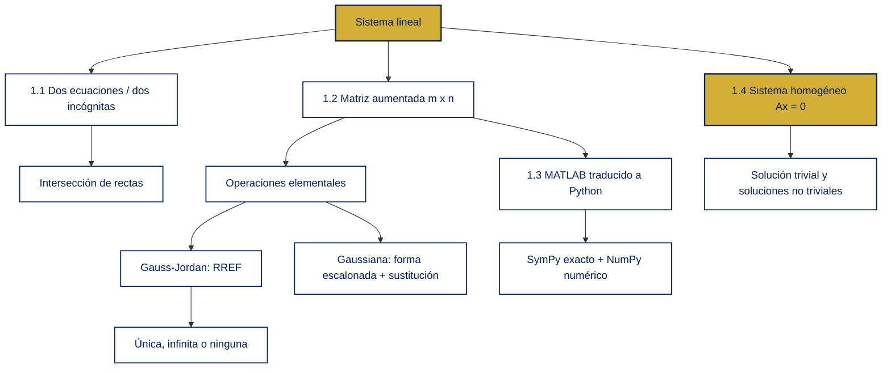

### Figura de síntesis

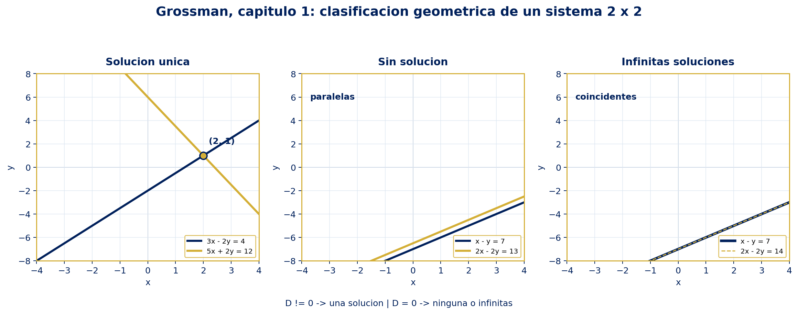

La figura visualiza los tres resultados geométricos de un sistema $2\times2$: una intersección única, rectas paralelas sin intersección y rectas coincidentes. Se genera con `01_Sistemas_Lineales/grossman_capitulo_1_figura.py` usando `USSBlue = #00205B`

---

## 1.1 Dos ecuaciones lineales con dos incógnitas · [Grossman 7ª Ed.]

### Modelo y lectura geométrica

El sistema general de dos ecuaciones lineales con incógnitas $x$ e $y$ es

$$
\begin{cases}
a_{11}x+a_{12}y=b_1,\\
a_{21}x+a_{22}y=b_2.
\end{cases}
$$

Cada ecuación representa una recta, salvo los casos degenerados en que todos los coeficientes de las incógnitas son cero. Una solución es un par ordenado $(x,y)$ que satisface ambas ecuaciones; geométricamente, es un punto común a las dos rectas.

Cuando $b\neq 0$, una recta $ax+by=c$ puede escribirse como

$$
y=-\frac{a}{b}x+\frac{c}{b},
$$

por lo que su pendiente es $m=-a/b$. Así, dos rectas no paralelas se cortan en un punto; dos rectas paralelas distintas no se cortan; y dos rectas coincidentes tienen infinitos puntos comunes.

### Clasificación

El determinante de los coeficientes es

$$
D=\begin{vmatrix}a_{11}&a_{12}\\a_{21}&a_{22}\end{vmatrix}
=a_{11}a_{22}-a_{12}a_{21}.
$$

#### Teorema 1.1.1 — Teorema de resumen

El sistema $2\times2$ tiene exactamente una de las siguientes posibilidades: ninguna solución, una solución única o infinitas soluciones. Además,

$$
D\neq 0
\iff
\text{existe una solución única},
$$

y

$$
D=0
\iff
\text{el sistema es inconsistente o tiene infinitas soluciones}.
$$

Si $D\neq 0$, las soluciones se pueden escribir directamente como

$$
x=\frac{a_{22}b_1-a_{12}b_2}{D},
\qquad
y=\frac{a_{11}b_2-a_{21}b_1}{D}.
$$

Estas fórmulas son el caso $2\times2$ de la regla de Cramer, que Grossman retomará más adelante.

### Demostración 1 — criterio del determinante

Multiplicamos la primera ecuación por $a_{22}$ y la segunda por $a_{12}$:

$$
\begin{aligned}
a_{11}a_{22}x+a_{12}a_{22}y&=a_{22}b_1,\\
a_{12}a_{21}x+a_{12}a_{22}y&=a_{12}b_2.
\end{aligned}
$$

Al restar la segunda igualdad de la primera se elimina $y$:

$$
(a_{11}a_{22}-a_{12}a_{21})x=a_{22}b_1-a_{12}b_2,
$$

es decir, $Dx=a_{22}b_1-a_{12}b_2$. Si $D\neq 0$, se despeja $x$ y, sustituyendo en cualquiera de las ecuaciones originales, se obtiene un único valor de $y$. El mismo procedimiento eliminando $x$ produce $Dy=a_{11}b_2-a_{21}b_1$.

Si $D=0$, las filas de la matriz de coeficientes son dependientes. El lado izquierdo de una ecuación es entonces un múltiplo del lado izquierdo de la otra: si los términos independientes conservan ese mismo múltiplo, las rectas coinciden y hay infinitas soluciones; si no lo conservan, aparece una contradicción y no hay soluciones. En ningún caso puede haber una única solución.

### Ejemplo 1 — solución única paso a paso

Resolver

$$
\begin{cases}
3x-2y=4,\\
5x+2y=12.
\end{cases}
$$

**Paso 1.** Sumamos las ecuaciones para cancelar $y$:

$$
(3x-2y)+(5x+2y)=4+12
\quad\Longrightarrow\quad
8x=16.
$$

**Paso 2.** Despejamos $x$:

$$
x=2.
$$

**Paso 3.** Sustituimos en la segunda ecuación:

$$
5(2)+2y=12
\quad\Longrightarrow\quad
2y=2
\quad\Longrightarrow\quad
y=1.
$$

**Paso 4.** Verificamos en ambas ecuaciones: $3(2)-2(1)=4$ y $5(2)+2(1)=12$. Por tanto,

$$
\boxed{(x,y)=(2,1)},
\qquad
D=3(2)-(-2)(5)=16\neq 0.
$$

### Ejemplo 2 — infinitas soluciones paso a paso

Resolver

$$
\begin{cases}
x-y=7,\\
2x-2y=14.
\end{cases}
$$

**Paso 1.** La segunda ecuación es $2$ veces la primera, por lo que no agrega una condición nueva.

**Paso 2.** Elegimos la variable libre $y=t$, con $t\in\mathbb{R}$.

**Paso 3.** Despejamos $x$:

$$
x-t=7
\quad\Longrightarrow\quad
x=t+7.
$$

**Paso 4.** La solución completa es

$$
\boxed{(x,y)=(t+7,t),\quad t\in\mathbb{R}}.
$$

Aquí $D=1(-2)-(-1)(2)=0$ y las rectas coinciden.

### Ejemplo 3 — sistema inconsistente paso a paso

Resolver

$$
\begin{cases}
x-y=7,\\
2x-2y=13.
\end{cases}
$$

**Paso 1.** Multiplicamos la primera ecuación por $2$:

$$
2x-2y=14.
$$

**Paso 2.** La segunda ecuación exige simultáneamente $2x-2y=13$.

**Paso 3.** Restar ambas igualdades produce $0=1$, una contradicción. Por tanto, el sistema es inconsistente y no tiene solución. Geométricamente, las rectas tienen la misma pendiente, pero son distintas.

### Idea operativa de 1.1

Antes de hacer cálculos largos, conviene revisar si las ecuaciones son múltiplos. El valor $D$ detecta si las direcciones de las rectas son distintas; cuando $D=0$, todavía hay que comparar los términos independientes para decidir entre infinitas soluciones y ninguna.

---

## 1.2 $m$ ecuaciones con $n$ incógnitas: Gauss-Jordan y gaussiana · [Grossman 7ª Ed.]

### Sistema general y matriz aumentada

El sistema general es

$$
\begin{aligned}
a_{11}x_1+a_{12}x_2+\cdots+a_{1n}x_n&=b_1,\\
a_{21}x_1+a_{22}x_2+\cdots+a_{2n}x_n&=b_2,\\
&\ \vdots\\
a_{m1}x_1+a_{m2}x_2+\cdots+a_{mn}x_n&=b_m.
\end{aligned}
$$

Su matriz de coeficientes y su matriz aumentada son, respectivamente,

$$
A=\begin{bmatrix}
a_{11}&a_{12}&\cdots&a_{1n}\\
a_{21}&a_{22}&\cdots&a_{2n}\\
\vdots&\vdots&\ddots&\vdots\\
a_{m1}&a_{m2}&\cdots&a_{mn}
\end{bmatrix},
\qquad
[A\mid\mathbf b]=\left[\begin{array}{cccc|c}
a_{11}&a_{12}&\cdots&a_{1n}&b_1\\
a_{21}&a_{22}&\cdots&a_{2n}&b_2\\
\vdots&\vdots&\ddots&\vdots&\vdots\\
a_{m1}&a_{m2}&\cdots&a_{mn}&b_m
\end{array}\right].
$$

La barra separa los coeficientes de los términos independientes; no es una columna adicional de incógnitas.

### Operaciones elementales por renglones

Las tres operaciones permitidas son

$$
\begin{aligned}
\text{1. Multiplicar:}&\quad R_i\longleftarrow cR_i, &&c\neq 0,\\
\text{2. Reemplazar:}&\quad R_j\longleftarrow R_j+cR_i,\\
\text{3. Intercambiar:}&\quad R_i\longleftrightarrow R_j.
\end{aligned}
$$

Su notación compacta registra el algoritmo y permite reproducir cada paso. Nunca se debe multiplicar un renglón por cero, porque se perdería la ecuación original.

### Demostración 2 — por qué las operaciones conservan las soluciones

Sea $S$ el conjunto de soluciones del sistema original.

**Multiplicación.** Si una ecuación es $L=0$ y $c\neq 0$, entonces $L=0$ es equivalente a $cL=0$: se puede multiplicar o dividir por $c$ sin cambiar los valores que satisfacen la igualdad.

**Reemplazo.** Sustituir $L_j$ por $L_j+cL_i$ conserva las soluciones. Si un vector satisface $L_i=0$ y $L_j=0$, también satisface $L_j+cL_i=0$. En sentido inverso, si satisface $L_i=0$ y $L_j+cL_i=0$, entonces

$$
L_j=(L_j+cL_i)-cL_i=0.
$$

**Intercambio.** Cambiar el orden de las ecuaciones no cambia la condición de satisfacerlas todas. Por consiguiente, cada matriz obtenida mediante estas operaciones representa un sistema equivalente, con exactamente el mismo conjunto $S$.

### Forma escalonada y forma escalonada reducida

Una matriz está en **forma escalonada por renglones** (REF) si:

1. Los renglones nulos están debajo de los renglones no nulos.
2. El primer elemento no nulo de cada renglón no nulo es $1$.
3. Cada pivote queda estrictamente a la derecha del pivote del renglón anterior.

La **forma escalonada reducida por renglones** (RREF) cumple además:

4. Cada columna pivote tiene ceros arriba y abajo de su pivote.

El primer $1$ no nulo de un renglón se llama **pivote**. Las columnas sin pivote corresponden a variables libres.

### Gauss-Jordan frente a eliminación gaussiana

| Método | Meta de la reducción | Último paso | Uso típico |
|---|---|---|---|
| Gauss-Jordan | RREF: pivotes con ceros arriba y abajo | Leer las variables directamente | Obtener la estructura completa, pivotes y variables libres |
| Gaussiana | REF: ceros bajo cada pivote | Sustitución hacia atrás | Resolver eficientemente sistemas cuadrados en cómputo |

Para una matriz aumentada, Gauss-Jordan continúa anulando por encima de cada pivote; el método gaussiano se detiene antes. En sistemas grandes ambos tienen costo cúbico en el caso denso, pero Gauss-Jordan suele realizar más operaciones.

### Criterio de clasificación mediante RREF

Después de reducir $[A\mid\mathbf b]$:

| Patrón en la RREF | Interpretación |
|---|---|
| $[0\ \cdots\ 0\mid c]$ con $c\neq 0$ | Contradicción $0=c$: sistema inconsistente |
| Sin contradicción y pivote en cada variable | Solución única |
| Sin contradicción y al menos una variable libre | Infinitas soluciones |

Si $r=\operatorname{rank}(A)$, la regla puede resumirse como

$$
\begin{cases}
r<\operatorname{rank}([A\mid\mathbf b]) &\Longrightarrow \text{inconsistente},\\
r=\operatorname{rank}([A\mid\mathbf b])=n &\Longrightarrow \text{solución única},\\
r=\operatorname{rank}([A\mid\mathbf b])<n &\Longrightarrow \text{infinitas soluciones}.
\end{cases}
$$

### Algoritmo táctico de reducción

1. Busca la primera columna activa con un elemento no nulo.
2. Intercambia renglones si es necesario para colocar un pivote no nulo.
3. Divide el renglón pivote por su pivote para obtener un $1$.
4. Anula la columna pivote debajo —Gaussiana— o arriba y debajo —Gauss-Jordan—.
5. Avanza a la submatriz inferior derecha y repite.
6. Lee las variables libres como parámetros y verifica la solución en el sistema original.

### Ejemplo 4 — Gauss-Jordan paso a paso

Resolver

$$
\begin{cases}
2x_1+4x_2+6x_3=18,\\
4x_1+5x_2+6x_3=24,\\
3x_1+x_2-2x_3=4.
\end{cases}
$$

**Paso 1.** Matriz aumentada y normalización del primer pivote:

$$
\left[\begin{array}{ccc|c}
2&4&6&18\\4&5&6&24\\3&1&-2&4
\end{array}\right]
\xrightarrow{R_1\leftarrow \frac12R_1}
\left[\begin{array}{ccc|c}
1&2&3&9\\4&5&6&24\\3&1&-2&4
\end{array}\right].
$$

**Paso 2.** Eliminamos $x_1$ debajo del pivote:

$$
\xrightarrow{\substack{R_2\leftarrow R_2-4R_1\\R_3\leftarrow R_3-3R_1}}
\left[\begin{array}{ccc|c}
1&2&3&9\\0&-3&-6&-12\\0&-5&-11&-23
\end{array}\right].
$$

**Paso 3.** Normalizamos el segundo pivote y anulamos su columna:

$$
\xrightarrow{R_2\leftarrow -\frac13R_2}
\left[\begin{array}{ccc|c}
1&2&3&9\\0&1&2&4\\0&-5&-11&-23
\end{array}\right]
\xrightarrow{\substack{R_1\leftarrow R_1-2R_2\\R_3\leftarrow R_3+5R_2}}
\left[\begin{array}{ccc|c}
1&0&-1&1\\0&1&2&4\\0&0&-1&-3
\end{array}\right].
$$

**Paso 4.** Normalizamos el tercer pivote y anulamos hacia arriba:

$$
\xrightarrow{R_3\leftarrow -R_3}
\left[\begin{array}{ccc|c}
1&0&-1&1\\0&1&2&4\\0&0&1&3
\end{array}\right]
\xrightarrow{\substack{R_1\leftarrow R_1+R_3\\R_2\leftarrow R_2-2R_3}}
\left[\begin{array}{ccc|c}
1&0&0&4\\0&1&0&-2\\0&0&1&3
\end{array}\right].
$$

**Conclusión.** Hay pivote en cada columna de variables:

$$
\boxed{x_1=4,\qquad x_2=-2,\qquad x_3=3}.
$$

La eliminación gaussiana habría terminado en la matriz triangular de la primera matriz del paso 4 y habría obtenido la misma respuesta por sustitución hacia atrás.

### Ejemplo 5 — sistema rectangular con infinitas soluciones

Resolver

$$
\begin{cases}
x_1+3x_2-5x_3+x_4=4,\\
2x_1+5x_2-2x_3+4x_4=6.
\end{cases}
$$

La reducción de la matriz aumentada es

$$
\left[\begin{array}{rrrr|r}
1&3&-5&1&4\\2&5&-2&4&6
\end{array}\right]
\xrightarrow{R_2\leftarrow R_2-2R_1}
\left[\begin{array}{rrrr|r}
1&3&-5&1&4\\0&-1&8&2&-2
\end{array}\right]
\xrightarrow{R_2\leftarrow -R_2}
\left[\begin{array}{rrrr|r}
1&3&-5&1&4\\0&1&-8&-2&2
\end{array}\right]
\xrightarrow{R_1\leftarrow R_1-3R_2}
\left[\begin{array}{rrrr|r}
1&0&19&7&-2\\0&1&-8&-2&2
\end{array}\right].
$$

No hay contradicción y las columnas 3 y 4 no tienen pivote. Elegimos $x_3=s$ y $x_4=t$:

$$
\boxed{
(x_1,x_2,x_3,x_4)=(-2-19s-7t,\,2+8s+2t,\,s,\,t),
\quad s,t\in\mathbb R.
}
$$

Este ejemplo muestra por qué un sistema puede tener infinitas soluciones aunque tenga menos ecuaciones que incógnitas: quedan grados de libertad.

### Sistemas con aplicación

Los sistemas lineales modelan balances de recursos. Si $x_i$ representa la producción o población de la especie $i$, cada fila puede expresar un consumo total. La condición algebraica sigue siendo la misma: construir $A$, construir $\mathbf b$ y estudiar $[A\mid\mathbf b]$. La interpretación aplicada puede imponer además restricciones como $x_i\geq 0$ o que los valores sean enteros; esas restricciones pueden reducir un conjunto algebraicamente infinito a un conjunto finito de soluciones admisibles.

---

## 1.3 Introducción a MATLAB traducida a Python · [Grossman 7ª Ed.]

Grossman introduce MATLAB como una calculadora matricial interactiva. En Python se conserva la idea, pero se separan dos herramientas:

- **SymPy:** aritmética simbólica exacta, fracciones, RREF, `LUsolve` y espacio nulo.
- **NumPy:** arreglos numéricos, operaciones rápidas y soluciones en coma flotante.

Python usa índices desde cero; MATLAB usa índices desde uno. Esa diferencia es la fuente más común de errores al traducir comandos.

### Tabla MATLAB → Python

| Propósito | MATLAB | Python equivalente |
|---|---|---|
| Matriz por filas | `A = [1 2 3; 4 5 6]` | `np.array([[1, 2, 3], [4, 5, 6]])` |
| Matriz exacta | `A = [1 2; 3 4]` | `sp.Matrix([[1, 2], [3, 4]])` |
| Entrada fila 2, columna 3 | `A(2,3)` | `A[1, 2]` |
| Fila 3 | `A(3,:)` | `A[2, :]` |
| Columna 3 | `A(:,3)` | `A[:, 2]` |
| Matriz aumentada | `[A b]` | `A.row_join(b)` o `np.column_stack((A, b))` |
| RREF | `rref(A)` | `rref, pivots = A.rref()` |
| Solución exacta de $A\mathbf{x}=\mathbf b$ | `A\b` | `x = A.LUsolve(b)` |
| Solución numérica cuadrada | `A\b` | `x = np.linalg.solve(A, b)` |
| Multiplicar fila por escalar | `A(2,:) = 3*A(2,:)` | `A[1, :] = 3*A[1, :]` |
| Intercambiar filas | `A([2 3],:) = A([3 2],:)` | `A[[1, 2], :] = A[[2, 1], :]` en NumPy |
| Matriz aleatoria | `rand(2,3)` | `rng.random((2, 3))` |
| Comentario | `% comentario` | `# comentario` |
| Ayuda | `help rref`, `doc rref` | `help(sp.Matrix.rref)` |
| Más cifras | `format long` | `np.set_printoptions(precision=12)` |
| Vandermonde | `vander(x)` | `np.vander(x)` |
| Evaluar polinomio | `polyval(c, x)` | `np.polyval(c, x)` |

En la tabla, `A` representa un `numpy.ndarray` en las operaciones numéricas y una `sp.Matrix` en las operaciones exactas. No conviene mezclar ambos tipos sin convertir conscientemente.

### Equivalencia de las operaciones por renglones

Para una matriz NumPy mutable:

```python
import numpy as np

A = np.array([[1.0, 2.0], [3.0, 4.0]])
A[1, :] = 3 * A[1, :] # R2 <- 3 R2
A[[0, 1], :] = A[[1, 0], :] # intercambio R1 <-> R2
```

Para aritmética exacta con SymPy:

```python
import sympy as sp

A = sp.Matrix([[1, 2], [3, 4]])
B = A.elementary_row_op("n->kn", row=1, k=3)
rref_A, pivots = A.rref()
```

En una reducción pedagógica suele ser más transparente escribir matrices nuevas y conservar la matriz original. En NumPy, una operación con `float` puede transformar un cero exacto en un número muy pequeño; en SymPy, las fracciones se mantienen exactas.

### Código ejecutable de verificación

El siguiente bloque reproduce el Ejemplo 4, contrasta la RREF exacta con la solución de NumPy y comprueba que un sistema homogéneo rectangular tiene un vector no nulo en su espacio nulo.

```python
import numpy as np
import sympy as sp

# Sistema del ejemplo 1.2: A x = b.
A = sp.Matrix([
 [2, 4, 6],
 [4, 5, 6],
 [3, 1, -2],
])
b = sp.Matrix([18, 24, 4])

augmented = A.row_join(b)
rref_augmented, pivots = augmented.rref()
expected_rref = sp.Matrix([
 [1, 0, 0, 4],
 [0, 1, 0, -2],
 [0, 0, 1, 3],
])
assert rref_augmented == expected_rref
assert pivots == (0, 1, 2)

x_exact = A.LUsolve(b)
assert tuple(x_exact) == (4, -2, 3)
assert A * x_exact == b

# Traduccion numerica: NumPy necesita una matriz cuadrada de rango completo.
A_numpy = np.asarray(A.tolist(), dtype=float)
b_numpy = np.asarray(b.tolist(), dtype=float).reshape(-1)
x_numeric = np.linalg.solve(A_numpy, b_numpy)
assert np.linalg.matrix_rank(A_numpy) == 3
assert np.allclose(A_numpy @ x_numeric, b_numpy)

# Sistema homogeneo 2 x 3: debe tener una variable libre.
H = sp.Matrix([
 [1, 1, -1],
 [4, -2, 7],
])
rref_h, pivots_h = H.rref()
null_basis = H.nullspace()
assert len(pivots_h) == 2
assert len(null_basis) == 1
assert H * null_basis[0] == sp.zeros(H.rows, 1)

print("RREF exacta:")
print(rref_augmented)
print("Solucion exacta:", tuple(x_exact))
print("Solucion NumPy:", x_numeric)
print("Base del espacio nulo de H:", null_basis)
```

> [!warning] Precisión numérica
> `np.linalg.solve(A, b)` presupone que `A` es cuadrada y de rango completo. Si `A` es singular o no cuadrada, NumPy puede lanzar `LinAlgError` o se necesita otro planteamiento, como `np.linalg.lstsq`. Para demostraciones y clasificación exacta, SymPy es la opción adecuada; para datos medidos, hay que controlar tolerancias y redondeo.

---

## 1.4 Sistemas homogéneos de ecuaciones · [Grossman 7ª Ed.]

### Definición

Un sistema homogéneo es un sistema de la forma

$$
A\mathbf{x}=\mathbf{0},
$$

es decir,

$$
\begin{aligned}
a_{11}x_1+a_{12}x_2+\cdots+a_{1n}x_n&=0,\\
a_{21}x_1+a_{22}x_2+\cdots+a_{2n}x_n&=0,\\
&\ \vdots\\
a_{m1}x_1+a_{m2}x_2+\cdots+a_{mn}x_n&=0.
\end{aligned}
$$

La solución

$$
\mathbf{x}=\mathbf{0}
\quad\Longleftrightarrow\quad
x_1=x_2=\cdots=x_n=0
$$

siempre existe y se denomina **solución trivial** o solución cero. Toda otra solución es **no trivial**.

Como un sistema homogéneo nunca puede producir una fila contradictoria $[0\ \cdots\ 0\mid c]$ con $c\neq 0$, sólo hay dos posibilidades: la solución trivial es la única, o existen infinitas soluciones además de ella.

### Teorema 1.4.1 — condición suficiente para infinitas soluciones

Si un sistema homogéneo tiene $m$ ecuaciones y $n$ incógnitas, entonces

$$
n>m
\quad\Longrightarrow\quad
\text{el sistema tiene infinitas soluciones}.
$$

Una forma más completa de expresarlo es

$$
\operatorname{rank}(A)<n
\quad\Longleftrightarrow\quad
\text{existe al menos una variable libre}
\quad\Longrightarrow\quad
\text{existen soluciones no triviales e infinitas}.
$$

Si $m\geq n$, todavía puede haber infinitas soluciones; la desigualdad $n>m$ es una condición suficiente, no una condición necesaria.

### Demostración 3 — por qué $n>m$ fuerza soluciones no triviales

Sea $r=\operatorname{rank}(A)$. El número de pivotes no puede superar el número de renglones, de modo que

$$
r\leq m<n.
$$

Por tanto, la cantidad de variables libres es

$$
n-r\geq n-m>0.
$$

Al menos una variable se puede elegir como parámetro. Como el sistema es homogéneo, las variables pivote quedan expresadas linealmente en función de los parámetros y no aparece ninguna contradicción. Asignar dos valores distintos a un parámetro produce dos soluciones distintas; al variar ese parámetro sobre $\mathbb R$ se obtienen infinitas soluciones. Elegir todos los parámetros iguales a cero produce la solución trivial; elegir uno no nulo produce una solución no trivial.

### Ejemplo 6 — homogéneo con solución trivial única

Consideremos

$$
\begin{cases}
2x_1+4x_2+6x_3=0,\\
4x_1+5x_2+6x_3=0,\\
3x_1+x_2-2x_3=0.
\end{cases}
$$

La reducción de la matriz aumentada produce

$$
\left[\begin{array}{ccc|c}
2&4&6&0\\4&5&6&0\\3&1&-2&0
\end{array}\right]
\longrightarrow
\left[\begin{array}{ccc|c}
1&0&0&0\\0&1&0&0\\0&0&1&0
\end{array}\right].
$$

Hay pivote en las tres columnas de variables. Por ello,

$$
x_1=x_2=x_3=0,
\qquad
\boxed{\mathbf{x}=\mathbf{0}}.
$$

### Ejemplo 7 — homogéneo con infinitas soluciones paso a paso

Resolver

$$
\begin{cases}
x_1+x_2-x_3=0,\\
4x_1-2x_2+7x_3=0.
\end{cases}
$$

**Paso 1.** Reducimos la matriz de coeficientes:

$$
\begin{bmatrix}1&1&-1\\4&-2&7\end{bmatrix}
\xrightarrow{R_2\leftarrow R_2-4R_1}
\begin{bmatrix}1&1&-1\\0&-6&11\end{bmatrix}
\xrightarrow{R_2\leftarrow -\frac16R_2}
\begin{bmatrix}1&1&-1\\0&1&-\frac{11}{6}\end{bmatrix}.
$$

**Paso 2.** Anulamos el término sobre el segundo pivote:

$$
\xrightarrow{R_1\leftarrow R_1-R_2}
\begin{bmatrix}1&0&\frac56\\0&1&-\frac{11}{6}\end{bmatrix}.
$$

**Paso 3.** La tercera variable es libre. Sea $x_3=t$:

$$
x_1+\frac56t=0,
\qquad
x_2-\frac{11}{6}t=0.
$$

Por lo tanto,

$$
\boxed{
(x_1,x_2,x_3)=\left(-\frac56t,\frac{11}{6}t,t\right)
=s(-5,11,6),
\quad s\in\mathbb R.
}
$$

Para $s=0$ se obtiene la solución trivial; para $s=1$ se obtiene la solución no trivial $(-5,11,6)$.

### Caso cuadrado y espacio nulo

En un sistema homogéneo cuadrado $n\times n$:

$$
\begin{aligned}
\operatorname{rank}(A)=n&\Longrightarrow\text{solución trivial única},\\
\operatorname{rank}(A)<n&\Longrightarrow\text{infinitas soluciones}.
\end{aligned}
$$

El conjunto de todas las soluciones se llama espacio nulo o núcleo de $A$:

$$
\mathcal N(A)=\{\mathbf{x}\in\mathbb R^n:A\mathbf{x}=\mathbf{0}\}.
$$

Si se conocen vectores base $\mathbf v_1,\ldots,\mathbf v_k$ del espacio nulo, cualquier solución se expresa como

$$
\mathbf{x}=c_1\mathbf v_1+\cdots+c_k\mathbf v_k,
\qquad c_i\in\mathbb R.
$$

Esta lectura anticipa el estudio posterior de espacios vectoriales, combinación lineal y dimensión.

---

## [Enriquecimiento Web / Referencias Externas]

La traducción computacional de este capítulo no es una sustitución mecánica de nombres de comandos; también exige distinguir exactitud simbólica, indexación y redondeo.

1. **SymPy, matrices:** la documentación oficial muestra la construcción de `Matrix`, el acceso por índices desde cero, `rref`, `LUsolve` y `nullspace`. Es la referencia para reproducir la reducción de Grossman con fracciones exactas: [SymPy — Matrices (linear algebra)](https://docs.sympy.org/latest/modules/matrices/matrices.html).
2. **NumPy, resolución:** `numpy.linalg.solve` calcula la solución de $A\mathbf{x}=\mathbf b$ cuando la matriz es cuadrada y de rango completo; si es singular o no cuadrada, se debe usar otro procedimiento, como `lstsq`: [NumPy — `numpy.linalg.solve`](https://numpy.org/doc/stable/reference/generated/numpy.linalg.solve.html).
3. **NumPy, rango:** `numpy.linalg.matrix_rank` usa valores singulares y una tolerancia numérica. Esto explica por qué una dependencia lineal exacta de SymPy puede aparecer como una dependencia aproximada en datos de coma flotante: [NumPy — `numpy.linalg.matrix_rank`](https://numpy.org/doc/stable/reference/generated/numpy.linalg.matrix_rank.html).
4. **Matplotlib, salida reproducible:** `savefig` permite guardar la figura en un archivo; junto con el backend no interactivo `Agg` hace posible generar el PNG desde terminal o desde un entorno sin pantalla: [Matplotlib — `pyplot.savefig`](https://matplotlib.org/stable/api/_as_gen/matplotlib.pyplot.savefig.html).

La consecuencia práctica es clara: usar SymPy para demostrar, parametrizar y verificar exactamente; usar NumPy para evaluar sistemas numéricos bien condicionados; y comprobar siempre el residuo $\lVert A\mathbf{x}-\mathbf b\rVert$ cuando los datos son aproximados.

## Resumen de bolsillo

| Pregunta | Herramienta o criterio |
|---|---|
| ¿Dos rectas se cruzan una vez? | $D\neq 0$ |
| ¿Qué operaciones mantienen las soluciones? | Escalar por $c\neq0$, sumar un múltiplo y permutar renglones |
| ¿Cómo se detecta una contradicción? | Fila $[0\ \cdots\ 0\mid c]$, $c\neq0$ |
| ¿Cuándo aparecen infinitas soluciones? | Sistema consistente con variables libres |
| ¿Qué diferencia Gauss-Jordan de la gaussiana? | RREF completa frente a REF y sustitución hacia atrás |
| ¿Qué solución siempre existe en $A\mathbf{x}=0$? | $\mathbf{x}=\mathbf{0}$ |
| ¿Qué garantiza $n>m$ en un homogéneo? | Infinitas soluciones y al menos una no trivial |
| ¿Qué biblioteca conserva fracciones? | SymPy |
| ¿Qué biblioteca trabaja con arreglos numéricos? | NumPy |

## Fuentes

- **[Grossman 7ª Ed.]**: Stanley I. Grossman y José Job Flores Godoy, *Álgebra lineal*, séptima edición, McGraw-Hill/Interamericana, capítulo 1, pp. 1–44. .
- **[Enriquecimiento Web / Referencias Externas]**: documentación oficial de SymPy, NumPy y Matplotlib enlazada en la sección anterior.

---


---

# Capítulo 2: Vectores y matrices

> [!info] Leyenda de trazabilidad
> - [Grossman 7ª Ed.]: síntesis de las secciones 2.1–2.8 del PDF fuente, pp. 46–174. Las definiciones, hipótesis, teoremas y ejemplos del libro se reformulan; no se transcriben.
> - [Enriquecimiento Web / Referencias Externas]: documentación oficial de SymPy, NumPy y NetworkX, más una referencia institucional sobre Wassily Leontief.
> - [Verificación computacional propia]: los cálculos de los ejemplos y del bloque de código se pueden reproducir con SymPy y NumPy.

**Fuente primaria:** Álgebra Lineal (7ª Edición), capítulo 2. Se conserva la numeración original de Grossman para facilitar la consulta cruzada.

## Idea central

Un vector organiza cantidades en un orden; una matriz organiza muchos vectores y permite representar transformaciones, sistemas de ecuaciones, redes y procesos iterativos. El capítulo desarrolla una cadena conceptual:

$$
\text{componentes} \longrightarrow \text{operaciones} \longrightarrow Ax=b \longrightarrow A^{-1},\,A^{\mathsf T},\,LU \longrightarrow \text{redes dirigidas}.
$$

La convención del capítulo es trabajar sobre \(\mathbb R\), salvo que se indique lo contrario. Las mismas definiciones se extienden a \(\mathbb C\), teniendo presente que en un producto interno complejo aparece conjugación, asunto que Grossman desarrolla posteriormente.

## Mapa conceptual

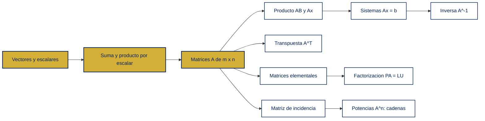

## Inventario de teoremas del capítulo

| Sección | Resultados que conviene dominar |
|---|---|
| 2.1 | Teorema 2.1.1: leyes de suma y producto por escalares. |
| 2.2 | Teoremas 2.2.1–2.2.4: producto escalar, asociatividad, distributividad y sumatorias. |
| 2.3 | Teorema 2.3.1 y corolario: diferencia de soluciones y estructura particular + homogénea. |
| 2.4 | Teoremas 2.4.1–2.4.8: identidad, inversas, resolución, criterio de 2 × 2, equivalencias y inversa unilateral. |
| 2.5 | Teorema 2.5.1: leyes de la transpuesta y de la inversa transpuesta. |
| 2.6 | Teoremas 2.6.1–2.6.5: operaciones elementales, productos elementales y forma triangular. |
| 2.7 | Teoremas 2.7.1–2.7.5: productos triangulares, LU, LUP, resumen de invertibilidad y caso rectangular. |
| 2.8 | Teoremas 2.8.1–2.8.2: potencias de la matriz de incidencia y caminos mínimos. |

---

## 2.1 Definiciones generales · [Grossman 7ª Ed.]

### Vectores y escalares

Un **vector renglón** de \(n\) componentes es una lista ordenada

$$
\mathbf x=(x_1,x_2,\ldots,x_n),
$$

mientras que un **vector columna** es

$$
\mathbf x=\begin{bmatrix}x_1\\x_2\\\vdots\\x_n\end{bmatrix}.
$$

La palabra *ordenada* es esencial: \((1,2)\neq(2,1)\). El vector cero \(\mathbf 0\) tiene todas sus componentes iguales a cero. Los escalares son los números que multiplican vectores; en el alcance principal del capítulo son reales.

Los conjuntos de referencia son

$$
\mathbb R^n=\left\{\begin{bmatrix}x_1\\\vdots\\x_n\end{bmatrix}:x_i\in\mathbb R\right\},
\qquad
\mathbb C^n=\left\{\begin{bmatrix}z_1\\\vdots\\z_n\end{bmatrix}:z_i\in\mathbb C\right\}.
$$

Un vector columna de \(n\) componentes es una matriz \(n\times1\), y un vector renglón es una matriz \(1\times n\). Esta observación permite tratar vectores y matrices con un mismo lenguaje.

### Matrices y entradas

Una matriz \(A\) de tamaño \(m\times n\) es un arreglo rectangular con \(m\) renglones y \(n\) columnas:

$$
A=(a_{ij})_{m\times n}=\begin{bmatrix}
a_{11}&a_{12}&\cdots&a_{1n}\\
a_{21}&a_{22}&\cdots&a_{2n}\\
\vdots&\vdots&\ddots&\vdots\\
a_{m1}&a_{m2}&\cdots&a_{mn}
\end{bmatrix}.
$$

La entrada \(a_{ij}\) está en el renglón \(i\) y la columna \(j\). La fila \(i\) es \((a_{i1},\ldots,a_{in})\) y la columna \(j\) es \((a_{1j},\ldots,a_{mj})^{\mathsf T}\). Si \(m=n\), la matriz es cuadrada. Si todas las entradas son cero, es una matriz cero.

Dos matrices son iguales si y solo si tienen el mismo tamaño y sus entradas correspondientes coinciden:

$$
A=B\iff\bigl(A\text{ y }B\text{ tienen el mismo tamaño}\bigr)\ \land\ \bigl(a_{ij}=b_{ij}\text{ para todo }i,j\bigr).
$$

### Suma y producto por escalar

La suma solo está definida para matrices del mismo tamaño. Si \(A,B\in\mathbb R^{m\times n}\), entonces

$$
A+B=(a_{ij}+b_{ij})_{m\times n}.
$$

Para un escalar \(\alpha\),

$$
\alpha A=(\alpha a_{ij})_{m\times n}.
$$

La resta se entiende como suma del opuesto: \(A-B=A+(-1)B\). No se pueden sumar matrices incompatibles, aunque contengan el mismo número total de entradas.

> [!example] Ejemplo 1: operaciones componente a componente
> Sean
> $$
> A=\begin{bmatrix}2&-1&0\\3&4&1\end{bmatrix},\qquad
> B=\begin{bmatrix}1&2&-3\\-2&0&5\end{bmatrix}.
> $$
> **Paso 1.** Ambas matrices son \(2\times3\), por lo que la suma está definida:
> $$
> A+B=\begin{bmatrix}2+1&-1+2&0-3\\3-2&4+0&1+5\end{bmatrix}
> =\begin{bmatrix}3&1&-3\\1&4&6\end{bmatrix}.
> $$
> **Paso 2.** Multiplicar por \(-2\) no cambia el tamaño:
> $$
> -2A=\begin{bmatrix}-4&2&0\\-6&-8&-2\end{bmatrix}.
> $$
> **Paso 3.** La diferencia es
> $$
> A-B=\begin{bmatrix}1&-3&3\\5&4&-4\end{bmatrix}.
> $$
> Una matriz \(2\times3\) no puede sumarse con una \(3\times2\): la igualdad de tamaños es una condición, no una preferencia de notación.

### Teorema 2.1.1: leyes de las operaciones matriciales

Si \(A,B,C\in\mathbb R^{m\times n}\) y \(\alpha,\beta\in\mathbb R\), entonces

$$
\begin{aligned}
A+0&=A, & 0A&=0,\\
A+B&=B+A, & (A+B)+C&=A+(B+C),\\
\alpha(A+B)&=\alpha A+\alpha B, & 1A&=A,\\
(\alpha+\beta)A&=\alpha A+\beta A.
\end{aligned}
$$

El cero de \(0A=0\) a la izquierda es un escalar y el de la derecha es la matriz cero.

**Demostración central.** Para la ley conmutativa, la entrada \((i,j)\) de cada lado es

$$
(A+B)_{ij}=a_{ij}+b_{ij}=b_{ij}+a_{ij}=(B+A)_{ij},
$$

porque la suma de escalares es conmutativa. Como la igualdad matricial es igualdad entrada a entrada, \(A+B=B+A\). Las demás leyes se prueban de la misma forma: se fija \((i,j)\) y se aplica la ley correspondiente de los escalares. Por ejemplo,

$$
\bigl[\alpha(A+B)\bigr]_{ij}=\alpha(a_{ij}+b_{ij})=\alpha a_{ij}+\alpha b_{ij}=\bigl[\alpha A+\alpha B\bigr]_{ij}.
$$

---

## 2.2 Productos vectorial y matricial · [Grossman 7ª Ed.]

### Producto escalar

Para \(\mathbf a,\mathbf b\in\mathbb R^n\), el producto escalar o producto punto es

$$
\mathbf a\cdot\mathbf b=\sum_{k=1}^{n}a_kb_k=a_1b_1+\cdots+a_nb_n.
$$

El resultado es un escalar, no un vector. Si se escribe \(\mathbf a^{\mathsf T}\) como renglón y \(\mathbf b\) como columna, entonces

$$
\mathbf a\cdot\mathbf b=\mathbf a^{\mathsf T}\mathbf b.
$$

Para que exista, ambos vectores deben tener el mismo número de componentes.

### Teorema 2.2.1: leyes del producto escalar

Para \(\mathbf a,\mathbf b,\mathbf c\in\mathbb R^n\) y \(\alpha\in\mathbb R\),

$$
\mathbf a\cdot\mathbf 0=0,\qquad
\mathbf a\cdot\mathbf b=\mathbf b\cdot\mathbf a,
$$

$$
\mathbf a\cdot(\mathbf b+\mathbf c)=\mathbf a\cdot\mathbf b+\mathbf a\cdot\mathbf c,
\qquad
(\alpha\mathbf a)\cdot\mathbf b=\alpha(\mathbf a\cdot\mathbf b).
$$

**Demostración de la conmutatividad.**

$$
\mathbf a\cdot\mathbf b=\sum_{k=1}^{n}a_kb_k=\sum_{k=1}^{n}b_ka_k=\mathbf b\cdot\mathbf a.
$$

No hay una ley asociativa del tipo \((\mathbf a\cdot\mathbf b)\cdot\mathbf c\): el primer producto ya es un escalar, y el producto escalar entre un escalar y un vector no está definido.

### Producto de matrices y compatibilidad

Sean \(A\in\mathbb R^{m\times n}\) y \(B\in\mathbb R^{n\times p}\). El producto \(AB\) está definido y tiene tamaño \(m\times p\). Su entrada \((i,j)\) es el producto punto de la fila \(i\) de \(A\) con la columna \(j\) de \(B\):

$$
(AB)_{ij}=c_{ij}=\sum_{k=1}^{n}a_{ik}b_{kj}.
$$

La regla de tamaños es

$$
(m\times n)(n\times p)=m\times p.
$$

$$
\boxed{\text{columnas de la primera} = \text{renglones de la segunda}}.
$$

En general, \(AB\neq BA\); incluso puede ocurrir que \(AB\) exista y \(BA\) no.

> [!example] Ejemplo 2: producto y orden de los factores
> Sean
> $$
> A=\begin{bmatrix}1&3\\-2&4\end{bmatrix},\qquad
> B=\begin{bmatrix}3&-2\\5&6\end{bmatrix}.
> $$
> **Paso 1.** Ambos productos están definidos porque las matrices son \(2\times2\).
> $$
> AB=\begin{bmatrix}
> (1)(3)+(3)(5)&(1)(-2)+(3)(6)\\
> (-2)(3)+(4)(5)&(-2)(-2)+(4)(6)
> \end{bmatrix}
> =\begin{bmatrix}18&16\\14&28\end{bmatrix}.
> $$
> **Paso 2.** Invertir el orden cambia las filas que se combinan:
> $$
> BA=\begin{bmatrix}
> (3)(1)+(-2)(-2)&(3)(3)+(-2)(4)\\
> (5)(1)+(6)(-2)&(5)(3)+(6)(4)
> \end{bmatrix}
> =\begin{bmatrix}7&1\\-7&39\end{bmatrix}.
> $$
> Como \(AB\neq BA\), la multiplicación matricial no es conmutativa.

### Multiplicación por bloques y combinación lineal de columnas

Si \(A=[\mathbf c_1\ \cdots\ \mathbf c_n]\) y \(\mathbf x=(x_1,\ldots,x_n)^{\mathsf T}\), entonces

$$
A\mathbf x=x_1\mathbf c_1+x_2\mathbf c_2+\cdots+x_n\mathbf c_n.
$$

Por lo tanto, resolver \(A\mathbf x=\mathbf b\) equivale a preguntar si \(\mathbf b\) puede expresarse como combinación lineal de las columnas de \(A\). Si \(B\) tiene varias columnas, cada columna de \(AB\) es una combinación lineal de las columnas de \(A\), usando como coeficientes la columna correspondiente de \(B\).

Cuando una matriz se particiona en bloques conformantes,

$$
\begin{bmatrix}C&D\\E&F\end{bmatrix}
\begin{bmatrix}G&H\\J&K\end{bmatrix}
=
\begin{bmatrix}CG+DJ&CH+DK\\EG+FJ&EH+FK\end{bmatrix},
$$

si cada producto y suma de bloques está definido. La partición no altera la multiplicación; solo agrupa cálculos compatibles.

### Teorema 2.2.2: asociatividad

Si \(A\in\mathbb R^{n\times m}\), \(B\in\mathbb R^{m\times p}\) y \(C\in\mathbb R^{p\times q}\), entonces

$$
A(BC)=(AB)C,
$$

y ambos lados tienen tamaño \(n\times q\). Se puede escribir \(ABC\) sin paréntesis, pero no se puede cambiar el orden de los factores.

**Demostración por sumatorias.** La entrada \((i,j)\) de \((AB)C\) es

$$
\begin{aligned}
[(AB)C]_{ij}
&=\sum_{\ell=1}^{p}(AB)_{i\ell}c_{\ell j}\\
&=\sum_{\ell=1}^{p}\left(\sum_{k=1}^{m}a_{ik}b_{k\ell}\right)c_{\ell j}\\
&=\sum_{k=1}^{m}\sum_{\ell=1}^{p}a_{ik}b_{k\ell}c_{\ell j}.
\end{aligned}
$$

La entrada de \(A(BC)\) es

$$
\begin{aligned}
[A(BC)]_{ij}
&=\sum_{k=1}^{m}a_{ik}(BC)_{kj}\\
&=\sum_{k=1}^{m}a_{ik}\left(\sum_{\ell=1}^{p}b_{k\ell}c_{\ell j}\right)\\
&=\sum_{k=1}^{m}\sum_{\ell=1}^{p}a_{ik}b_{k\ell}c_{\ell j}.
\end{aligned}
$$

Las entradas correspondientes son iguales.

### Teorema 2.2.3: distributividad

Siempre que los tamaños permitan las operaciones,

$$
A(B+C)=AB+AC,
\qquad
(A+B)C=AC+BC.
$$

Por ejemplo, la entrada \((i,j)\) de la primera igualdad es

$$
\sum_k a_{ik}(b_{kj}+c_{kj})=\sum_k a_{ik}b_{kj}+\sum_k a_{ik}c_{kj}.
$$

### Teorema 2.2.4: propiedades de la sumatoria

Para sucesiones \((a_k)\), \((b_k)\), un escalar \(c\) y \(M\leq N\),

$$
\sum_{k=M}^{N}ca_k=c\sum_{k=M}^{N}a_k,
$$

$$
\sum_{k=M}^{N}(a_k+b_k)=\sum_{k=M}^{N}a_k+\sum_{k=M}^{N}b_k,
\qquad
\sum_{k=M}^{N}(a_k-b_k)=\sum_{k=M}^{N}a_k-\sum_{k=M}^{N}b_k.
$$

Si \(M<r<N\), se puede partir la suma:

$$
\sum_{k=M}^{N}a_k=\sum_{k=M}^{r}a_k+\sum_{k=r+1}^{N}a_k.
$$

Estas reglas son el mecanismo algebraico que sostiene las demostraciones de asociatividad y distributividad.

### Aplicación: cadenas de Markov

Un estado \(\mathbf x_k\) puede representar cantidades o proporciones en varias categorías. Una matriz de transición \(P\) actualiza el estado mediante

$$
\mathbf x_{k+1}=P\mathbf x_k.
$$

Con la convención columnar del capítulo, las entradas de cada columna de \(P\) suman uno. Después de \(r\) pasos,

$$
\mathbf x_{k+r}=P^r\mathbf x_k.
$$

La multiplicación matricial acumula todas las rutas de transición posibles, de modo análogo al conteo de cadenas en la sección 2.8.

---

## 2.3 Matrices y sistemas de ecuaciones lineales · [Grossman 7ª Ed.]

### Forma matricial

El sistema de \(m\) ecuaciones lineales con \(n\) incógnitas

$$
\begin{aligned}
a_{11}x_1+\cdots+a_{1n}x_n&=b_1,\\
&\ \vdots\\
a_{m1}x_1+\cdots+a_{mn}x_n&=b_m
\end{aligned}
$$

se organiza como

$$
A\mathbf x=\mathbf b,
$$

donde \(A=(a_{ij})\in\mathbb R^{m\times n}\), \(\mathbf x\in\mathbb R^n\) es el vector de incógnitas y \(\mathbf b\in\mathbb R^m\) el vector de términos independientes. La matriz aumentada es \([A\mid\mathbf b]\).

El sistema es:

- **Homogéneo** si \(\mathbf b=\mathbf0\): \(A\mathbf x=\mathbf0\). Siempre tiene la solución trivial \(\mathbf x=\mathbf0\).
- **No homogéneo** si \(\mathbf b\neq\mathbf0\). Puede no tener solución, tener una solución o tener infinitas soluciones.

El sistema homogéneo asociado a \(A\mathbf x=\mathbf b\) es \(A\mathbf x=\mathbf0\). Una solución cualquiera del sistema no homogéneo se denomina solución particular.

### Teorema 2.3.1 y corolario

Si \(\mathbf x_1\) y \(\mathbf x_2\) son soluciones de \(A\mathbf x=\mathbf b\), entonces \(\mathbf x_1-\mathbf x_2\) es solución del homogéneo asociado:

$$
A(\mathbf x_1-\mathbf x_2)=A\mathbf x_1-A\mathbf x_2=\mathbf b-\mathbf b=\mathbf0.
$$

**Corolario.** Si \(\mathbf x_p\) es una solución particular y \(\mathbf x_h\) recorre todas las soluciones de \(A\mathbf x=\mathbf0\), entonces todas las soluciones no homogéneas son

$$
\boxed{\mathbf x=\mathbf x_p+\mathbf x_h.}
$$

En efecto, si \(\mathbf y\) es otra solución, se toma \(\mathbf x_h=\mathbf y-\mathbf x_p\). El teorema asegura que \(A\mathbf x_h=\mathbf0\), y entonces \(\mathbf y=\mathbf x_p+\mathbf x_h\). Recíprocamente, \(A(\mathbf x_p+\mathbf x_h)=\mathbf b+\mathbf0=\mathbf b\).

> [!example] Ejemplo 3: solución particular más solución homogénea
> Considérese
> $$
> \begin{aligned}
> x_1+2x_2-x_3&=2,\\
> 2x_1+3x_2+5x_3&=5,\\
> x_1+x_2+6x_3&=3.
> \end{aligned}
> $$
> **Paso 1.** La matriz aumentada se reduce con operaciones por renglones:
> $$
> \left[\begin{array}{ccc|c}
> 1&2&-1&2\\2&3&5&5\\1&1&6&3
> \end{array}\right]
> \xrightarrow{R_2-2R_1,\ R_3-R_1}
> \left[\begin{array}{ccc|c}
> 1&2&-1&2\\0&-1&7&1\\0&-1&7&1
> \end{array}\right]
> \xrightarrow{R_3-R_2}
> \left[\begin{array}{ccc|c}
> 1&2&-1&2\\0&-1&7&1\\0&0&0&0
> \end{array}\right].
> $$
> **Paso 2.** Multiplicando el segundo renglón por \(-1\) y anulando la entrada sobre el pivote:
> $$
> x_2-7x_3=-1,\qquad x_1+13x_3=4.
> $$
> **Paso 3.** Tomando \(x_3=t\in\mathbb R\):
> $$
> \mathbf x=\begin{bmatrix}4-13t\\-1+7t\\t\end{bmatrix}
> =\underbrace{\begin{bmatrix}4\\-1\\0\end{bmatrix}}_{\mathbf x_p}
> +t\underbrace{\begin{bmatrix}-13\\7\\1\end{bmatrix}}_{\mathbf x_h}.
> $$
> El primer vector satisface el sistema original y el vector \((-13,7,1)^{\mathsf T}\) satisface el sistema homogéneo. Por ejemplo, \(t=0\) produce \((4,-1,0)^{\mathsf T}\), mientras que \(t=1\) produce \((-9,6,1)^{\mathsf T}\).

### Lectura geométrica y algebraica

La ecuación \(A\mathbf x=\mathbf b\) puede leerse de dos maneras equivalentes:

1. Cada renglón de \(A\) impone una ecuación sobre \(\mathbf x\).
2. \(\mathbf b\) es una combinación lineal de las columnas de \(A\), con coeficientes dados por \(\mathbf x\).

La segunda lectura es especialmente útil para distinguir existencia de solución de unicidad: si hay columnas dependientes, un mismo \(\mathbf b\) puede obtenerse con distintos vectores de coeficientes.

---

## 2.4 Inversa de una matriz cuadrada · [Grossman 7ª Ed.]

### Identidad e inversa

La identidad \(I_n\) es la matriz cuadrada con unos en la diagonal principal y ceros fuera de ella:

$$
(I_n)_{ij}=\begin{cases}1,&i=j,\\0,&i\neq j.\end{cases}
$$

### Teorema 2.4.1: identidad

Para toda matriz cuadrada \(A\in\mathbb R^{n\times n}\),

$$
AI_n=I_nA=A.
$$

**Razón.** En \((AI_n)_{ij}=\sum_k a_{ik}(I_n)_{kj}\), todos los términos son cero salvo el término \(k=j\), que vale \(a_{ij}\). El argumento para \(I_nA\) es análogo.

Una matriz cuadrada \(A\) es **invertible** si existe una matriz \(B\) del mismo tamaño tal que

$$
AB=BA=I_n.
$$

En tal caso, \(B=A^{-1}\). Si no es invertible, se llama singular; si es invertible, no singular.

### Unicidad y producto de inversas

**Teorema 2.4.2.** La inversa, si existe, es única. Si \(B\) y \(C\) son inversas de \(A\),

$$
B=B I=B(AC)=(BA)C=IC=C.
$$

**Teorema 2.4.3.** Si \(A\) y \(B\) son invertibles, entonces \(AB\) es invertible y

$$
(AB)^{-1}=B^{-1}A^{-1}.
$$

La inversión invierte el orden porque

$$
(B^{-1}A^{-1})(AB)=B^{-1}(A^{-1}A)B=I,
$$

$$
(AB)(B^{-1}A^{-1})=A(BB^{-1})A^{-1}=I.
$$

### Teorema 2.4.4: resolver con la inversa

Si \(A\) es invertible, el sistema \(A\mathbf x=\mathbf b\) tiene una única solución:

$$
A^{-1}A\mathbf x=A^{-1}\mathbf b
\quad\Longrightarrow\quad
\mathbf x=A^{-1}\mathbf b.
$$

La verificación de existencia es directa: \(A(A^{-1}\mathbf b)=\mathbf b\). La unicidad sigue porque cualquier solución \(\mathbf y\) también tendría que ser \(\mathbf y=A^{-1}\mathbf b\).

### Cálculo por Gauss–Jordan

Para calcular \(A^{-1}\), se forma la matriz aumentada

$$
[A\mid I_n]
$$

y se aplican operaciones elementales por renglones hasta obtener la identidad a la izquierda:

$$
[A\mid I_n]\longrightarrow[I_n\mid A^{-1}].
$$

Si la reducción produce un renglón nulo en la parte de \(A\), entonces no se puede llegar a \(I_n\) y \(A\) es singular.

> [!example] Ejemplo 4: inversa de una matriz 2 × 2
> Sea
> $$
> A=\begin{bmatrix}2&-4\\1&3\end{bmatrix}.
> $$
> **Paso 1.** El determinante de orden dos es
> $$
> \det(A)=2\cdot3-(-4)\cdot1=10\neq0.
> $$
> **Paso 2.** La fórmula del teorema 2.4.5 da
> $$
> A^{-1}=\frac1{10}\begin{bmatrix}3&4\\-1&2\end{bmatrix}
> =\begin{bmatrix}\frac3{10}&\frac25\\-\frac1{10}&\frac15\end{bmatrix}.
> $$
> **Paso 3.** Se verifica por ambos lados:
> $$
> AA^{-1}=A^{-1}A=\frac1{10}\begin{bmatrix}10&0\\0&10\end{bmatrix}=I_2.
> $$

### Teorema 2.4.5: caso 2 × 2

Para

$$
A=\begin{bmatrix}a&b\\c&d\end{bmatrix},
\qquad
\det(A)=ad-bc,
$$

se tiene

$$
A\text{ es invertible}\iff ad-bc\neq0,
$$

y, cuando el determinante no es cero,

$$
A^{-1}=\frac1{ad-bc}\begin{bmatrix}d&-b\\-c&a\end{bmatrix}.
$$

**Demostración.** Definamos

$$
B=\frac1{ad-bc}\begin{bmatrix}d&-b\\-c&a\end{bmatrix}.
$$

Entonces

$$
BA=AB=\frac1{ad-bc}\begin{bmatrix}ad-bc&0\\0&ad-bc\end{bmatrix}=I_2.
$$

Así, \(B=A^{-1}\) cuando \(ad-bc\neq0\). La implicación inversa se obtiene del criterio de solución única de un sistema de dos ecuaciones: si \(A\) fuera invertible, \(A\mathbf x=\mathbf b\) tendría solución única para todo \(\mathbf b\), lo que exige \(ad-bc\neq0\).

### Teorema 2.4.6: equivalencia por renglones y criterios de invertibilidad

Dos matrices son equivalentes por renglones si una se obtiene de la otra mediante una sucesión finita de operaciones elementales. El teorema 2.4.6 afirma, para \(A\in\mathbb R^{n\times n}\), que las siguientes afirmaciones son equivalentes:

1. \(A\) es invertible.
2. \(A\) es equivalente por renglones a \(I_n\), es decir, \(\operatorname{rref}(A)=I_n\).
3. \(A\mathbf x=\mathbf b\) tiene una solución única para cada \(\mathbf b\in\mathbb R^n\).
4. La forma escalonada por renglones de \(A\) tiene \(n\) pivotes.

El mismo resultado ofrece el procedimiento práctico: reducir \([A\mid I_n]\), no calcular una fórmula simbólica entrada por entrada.

### Teorema 2.4.7: teorema de resumen, punto de vista 2

Para una matriz cuadrada \(A\), son equivalentes:

1. \(A\) es invertible.
2. El homogéneo \(A\mathbf x=\mathbf0\) solo tiene la solución trivial.
3. \(A\mathbf x=\mathbf b\) tiene una única solución para cada \(\mathbf b\in\mathbb R^n\).
4. \(A\) es equivalente por renglones a \(I_n\).
5. La forma escalonada de \(A\) tiene \(n\) pivotes.
6. \(\det(A)\neq0\), cuando el determinante de orden \(n\) ya está definido.

En el capítulo 2, la fórmula del determinante se ha definido explícitamente para \(2\times2\); la teoría general de determinantes y la prueba completa para todo \(n\) se desarrollan en el capítulo 3.

**Demostración de la cadena principal.** Si \(A\) es invertible y \(A\mathbf x=\mathbf0\), entonces \(\mathbf x=A^{-1}\mathbf0=\mathbf0\). Si el homogéneo solo tiene la solución trivial, la reducción por renglones no puede dejar una columna libre; por tanto hay \(n\) pivotes y la forma reducida es \(I_n\). Si la forma reducida es \(I_n\), Gauss–Jordan sobre \([A\mid I_n]\) exhibe \(A^{-1}\). Finalmente, una inversa da la solución única \(A^{-1}\mathbf b\) para todo término independiente. El inciso del determinante se enlaza con el capítulo 3.

### Teorema 2.4.8: basta una inversa por un lado

Si \(A,B\in\mathbb R^{n\times n}\) y se cumple cualquiera de

$$
BA=I_n\qquad\text{o}\qquad AB=I_n,
$$

entonces \(A\) es invertible y \(B=A^{-1}\). Por ejemplo, si \(BA=I_n\) y \(A\mathbf x=\mathbf0\), entonces \(\mathbf x=I_n\mathbf x=BA\mathbf x=B\mathbf0=\mathbf0\). El teorema 2.4.7 da la invertibilidad; la unicidad de la inversa concluye que \(B=A^{-1}\).

### Aplicación: modelo de Leontief

Si \(A\) representa demandas internas entre sectores y \(\mathbf e\) la demanda externa, el modelo de insumo–producto es

$$
A\mathbf x+\mathbf e=\mathbf x.
$$

Reordenando,

$$
(I-A)\mathbf x=\mathbf e,
\qquad
\mathbf x=(I-A)^{-1}\mathbf e,
$$

si \(I-A\) es invertible. La inversa incorpora las rondas indirectas de producción: una demanda en un sector provoca demandas en otros, que a su vez vuelven a requerir insumos.

---

## 2.5 Transpuesta de una matriz · [Grossman 7ª Ed.]

### Definición

Si \(A=(a_{ij})\in\mathbb R^{m\times n}\), su transpuesta \(A^{\mathsf T}\) es la matriz \(n\times m\) definida por

$$
(A^{\mathsf T})_{ij}=a_{ji}.
$$

La fila \(i\) de \(A\) pasa a ser la columna \(i\) de \(A^{\mathsf T}\). La transpuesta está definida también para matrices no cuadradas.

> [!example] Ejemplo 5: transponer y reconocer simetría
> Sea
> $$
> A=\begin{bmatrix}1&2&3\\0&-1&4\end{bmatrix}.
> $$
> **Paso 1.** \(A\) es \(2\times3\), así que \(A^{\mathsf T}\) debe ser \(3\times2\):
> $$
> A^{\mathsf T}=\begin{bmatrix}1&0\\2&-1\\3&4\end{bmatrix}.
> $$
> **Paso 2.** Para una matriz cuadrada, la simetría exige \(A^{\mathsf T}=A\). Por ejemplo,
> $$
> S=\begin{bmatrix}2&-1&3\\-1&0&4\\3&4&5\end{bmatrix}
> $$
> es simétrica porque cada entrada fuera de la diagonal coincide con su reflejo: \(s_{ij}=s_{ji}\).

### Teorema 2.5.1: propiedades de la transpuesta

Si las dimensiones permiten las operaciones y \(A\) es invertible, entonces

$$
\begin{aligned}
(A^{\mathsf T})^{\mathsf T}&=A,\\
(AB)^{\mathsf T}&=B^{\mathsf T}A^{\mathsf T},\\
(A+B)^{\mathsf T}&=A^{\mathsf T}+B^{\mathsf T},\\
(A^{-1})^{\mathsf T}&=(A^{\mathsf T})^{-1}.
\end{aligned}
$$

La inversión del orden en \((AB)^{\mathsf T}\) es la versión matricial de reflejar una composición.

**Demostración de la regla del producto.** La entrada \((i,j)\) de \((AB)^{\mathsf T}\) es la entrada \((j,i)\) de \(AB\):

$$
[(AB)^{\mathsf T}]_{ij}=(AB)_{ji}=\sum_k a_{jk}b_{ki}.
$$

Por otro lado,

$$
[B^{\mathsf T}A^{\mathsf T}]_{ij}=\sum_k(B^{\mathsf T})_{ik}(A^{\mathsf T})_{kj}=\sum_k b_{ki}a_{jk},
$$

que coincide porque los escalares conmutan. Para la última identidad, si \(AA^{-1}=A^{-1}A=I\), se transpone y se usa la regla del producto:

$$
(A^{-1})^{\mathsf T}A^{\mathsf T}=I,
\qquad
A^{\mathsf T}(A^{-1})^{\mathsf T}=I.
$$

Por unicidad, \((A^{-1})^{\mathsf T}=(A^{\mathsf T})^{-1}\).

Una matriz cuadrada es **simétrica** si \(A^{\mathsf T}=A\). Si \(\mathbf a,\mathbf b\) son columnas,

$$
\mathbf a\cdot\mathbf b=\mathbf a^{\mathsf T}\mathbf b.
$$

Esto conecta el producto escalar de la sección 2.2 con el producto matricial.

---

## 2.6 Matrices elementales y matrices inversas · [Grossman 7ª Ed.]

### Operaciones elementales como productos por la izquierda

Las tres operaciones elementales por renglón son:

1. Multiplicar un renglón por \(c\neq0\): \(R_i\leftarrow cR_i\).
2. Sumar \(c\) veces un renglón a otro: \(R_j\leftarrow R_j+cR_i\).
3. Intercambiar dos renglones: \(R_i\leftrightarrow R_j\).

Una **matriz elemental** se obtiene aplicando exactamente una de esas operaciones a \(I_n\). Si \(E\) es la matriz correspondiente, la operación sobre una matriz \(A\) es

$$
EA.
$$

La matriz elemental tiene tamaño \(m\times m\) cuando multiplica por la izquierda a una matriz \(A\) de tamaño \(m\times n\).

Ejemplos de los tres tipos:

$$
E_{\mathrm{esc}}=\begin{bmatrix}1&0&0\\0&c&0\\0&0&1\end{bmatrix},\quad
E_{\mathrm{suma}}=\begin{bmatrix}1&0&0\\0&1&0\\c&0&1\end{bmatrix},\quad
P_{23}=\begin{bmatrix}1&0&0\\0&0&1\\0&1&0\end{bmatrix}.
$$

Sus efectos son, respectivamente, \(R_2\leftarrow cR_2\), \(R_3\leftarrow R_3+cR_1\) y \(R_2\leftrightarrow R_3\).

> [!example] Ejemplo 6: una operación elemental sobre una matriz
> Sea
> $$
> A=\begin{bmatrix}1&2\\3&4\\5&6\end{bmatrix}.
> $$
> Para efectuar \(R_3\leftarrow R_3-3R_1\), se toma
> $$
> E=\begin{bmatrix}1&0&0\\0&1&0\\-3&0&1\end{bmatrix}.
> $$
> Entonces
> $$
> EA=\begin{bmatrix}1&2\\3&4\\2&0\end{bmatrix},
> $$
> y la única fila modificada es la tercera. La multiplicación por la izquierda codifica operaciones sobre filas; multiplicar por la derecha tiene otro significado y no debe confundirse con este procedimiento.

### Teorema 2.6.1

Toda operación elemental por renglón sobre \(A\) se realiza multiplicando \(A\) por la izquierda por la matriz elemental correspondiente:

$$
A\xrightarrow{\text{una OEF}}EA.
$$

La afirmación se verifica observando que las filas de \(EA\) son combinaciones lineales de las filas de \(A\) exactamente con los coeficientes de la fila correspondiente de \(E\).

### Teorema 2.6.2: inversa de una matriz elemental

Toda matriz elemental es invertible y su inversa es del mismo tipo:

$$
(cR_i)^{-1}=\frac1cR_i,\qquad
(R_j+cR_i)^{-1}=R_j-cR_i,\qquad
P_{ij}^{-1}=P_{ij}.
$$

La razón es que cada operación se deshace con una sola operación del mismo tipo. Un intercambio aplicado dos veces devuelve la matriz original.

### Teorema 2.6.3: caracterización por productos elementales

Una matriz cuadrada \(A\) es invertible si y solo si puede escribirse como producto de matrices elementales:

$$
A\text{ invertible}\iff A=E_1E_2\cdots E_r.
$$

**Demostración.** Si \(A=E_1\cdots E_r\), cada factor es invertible y por el teorema 2.4.3 el producto es invertible. En sentido inverso, si \(A\) es invertible, se reduce a \(I\) mediante OEF; por el teorema 2.6.1 existen \(E_1,\ldots,E_r\) tales que

$$
E_r\cdots E_2E_1A=I.
$$

Por tanto, \(A^{-1}=E_r\cdots E_1\), y al invertir el producto se obtiene \(A=E_1^{-1}\cdots E_r^{-1}\), que sigue siendo un producto de matrices elementales.

### Teorema 2.6.4: teorema de resumen, punto de vista 3

Para \(A\in\mathbb R^{n\times n}\), son equivalentes las siete condiciones:

1. \(A\) es invertible.
2. \(A\mathbf x=\mathbf0\) solo tiene la solución trivial.
3. \(A\mathbf x=\mathbf b\) tiene solución única para todo \(\mathbf b\in\mathbb R^n\).
4. \(A\) es equivalente por renglones a \(I_n\).
5. \(A\) es producto de matrices elementales.
6. La forma escalonada de \(A\) tiene \(n\) pivotes.
7. \(\det(A)\neq0\), una vez disponible la teoría general del determinante.

Este teorema unifica el punto de vista algebraico, geométrico, algorítmico y matricial de la invertibilidad.

### Teorema 2.6.5: producto elemental y triangular superior

Toda matriz cuadrada \(A\) puede escribirse como

$$
A=E_1E_2\cdots E_rU,
$$

donde cada \(E_i\) es elemental y \(U\) es triangular superior. La eliminación gaussiana produce \(U\); al despejar las operaciones, sus inversas quedan a la izquierda.

Una matriz triangular superior satisface \(a_{ij}=0\) cuando \(i>j\). Una triangular inferior satisface \(a_{ij}=0\) cuando \(i<j\).

---

## 2.7 Factorizaciones LU de una matriz · [Grossman 7ª Ed.]

### Idea de la factorización

En una eliminación sin intercambios de filas, cada multiplicador que anula una entrada debajo del pivote se almacena en una matriz triangular inferior \(L\). La matriz restante es triangular superior \(U\):

$$
A=LU,
$$

con

$$
L=\begin{bmatrix}
1&0&\cdots&0\\
\ell_{21}&1&\cdots&0\\
\vdots&\vdots&\ddots&\vdots\\
\ell_{n1}&\ell_{n2}&\cdots&1
\end{bmatrix},
\qquad
U=\begin{bmatrix}
u_{11}&u_{12}&\cdots&u_{1n}\\
0&u_{22}&\cdots&u_{2n}\\
\vdots&\vdots&\ddots&\vdots\\
0&0&\cdots&u_{nn}
\end{bmatrix}.
$$

La diagonal de \(L\) es uno; los pivotes aparecen en la diagonal de \(U\). No se normalizan los pivotes durante la eliminación LU.

### Teorema 2.7.1: productos triangulares

El producto de dos matrices triangulares inferiores con unos en la diagonal vuelve a ser triangular inferior con unos en la diagonal. El producto de dos matrices triangulares superiores es triangular superior.

**Demostración breve.** Si \(B=LM\), para \(j>i\) cada sumando de \(b_{ij}=\sum_k\ell_{ik}m_{kj}\) es cero por la posición triangular; para \(i=j\), solo sobrevive el producto de las diagonales, igual a uno. La demostración superior es análoga, usando \(i>j\).

> [!example] Ejemplo 7: LU y resolución por sustitución
> Sea
> $$
> A=\begin{bmatrix}2&1&1\\4&3&3\\8&7&9\end{bmatrix},\qquad
> \mathbf b=\begin{bmatrix}4\\8\\18\end{bmatrix}.
> $$
> **Paso 1.** Eliminación sin normalizar pivotes:
> $$
> R_2\leftarrow R_2-2R_1,\qquad R_3\leftarrow R_3-4R_1,
> $$
> produce
> $$
> \begin{bmatrix}2&1&1\\0&1&1\\0&3&5\end{bmatrix}.
> $$
> Luego,
> $$
> R_3\leftarrow R_3-3R_2
> \quad\Longrightarrow\quad
> U=\begin{bmatrix}2&1&1\\0&1&1\\0&0&2\end{bmatrix}.
> $$
> Los multiplicadores fueron \(2,4,3\), por lo que
> $$
> L=\begin{bmatrix}1&0&0\\2&1&0\\4&3&1\end{bmatrix}.
> $$
> **Paso 2.** Se verifica la factorización:
> $$
> LU=\begin{bmatrix}2&1&1\\4&3&3\\8&7&9\end{bmatrix}=A.
> $$
> **Paso 3.** Resolver \(L\mathbf y=\mathbf b\) por sustitución hacia adelante:
> $$
> y_1=4,\qquad 2y_1+y_2=8\Rightarrow y_2=0,
> \qquad 4y_1+3y_2+y_3=18\Rightarrow y_3=2.
> $$
> **Paso 4.** Resolver \(U\mathbf x=\mathbf y\) hacia atrás:
> $$
> 2x_3=2\Rightarrow x_3=1,
> \quad x_2+x_3=0\Rightarrow x_2=-1,
> \quad 2x_1+x_2+x_3=4\Rightarrow x_1=2.
> $$
> Por tanto, \(\mathbf x=(2,-1,1)^{\mathsf T}\), y se comprueba que \(A\mathbf x=\mathbf b\).

### Teorema 2.7.2: factorización LU

Si una matriz cuadrada \(A\) puede reducirse a una matriz triangular superior \(U\) sin intercambiar renglones, existe una matriz triangular inferior invertible \(L\), con unos en la diagonal, tal que

$$
A=LU.
$$

Si además \(U\) tiene \(n\) pivotes, la factorización es única dentro de esta normalización de la diagonal de \(L\).

**Demostración de la unicidad.** Supóngase \(A=L_1U_1=L_2U_2\), con ambos \(L_i\) inferiores unitarias y ambos \(U_i\) superiores invertibles. Entonces

$$
U_1U_2^{-1}=L_1^{-1}L_2.
$$

El lado izquierdo es superior y el derecho inferior unitario. La única matriz simultáneamente superior e inferior con diagonal unitaria es \(I\). Luego \(U_1=U_2\) y \(L_1=L_2\).

### Resolver con LU

Si \(A=LU\), se transforma

$$
A\mathbf x=\mathbf b
\quad\Longleftrightarrow\quad
L(U\mathbf x)=\mathbf b.
$$

Se introduce \(\mathbf y=U\mathbf x\), se resuelve \(L\mathbf y=\mathbf b\) hacia adelante y luego \(U\mathbf x=\mathbf y\) hacia atrás. La misma factorización sirve para muchos vectores \(\mathbf b\): solo cambian las dos sustituciones.

### Pivoteo y factorización LUP

Si la eliminación encuentra un pivote cero o conviene intercambiar renglones para mejorar estabilidad numérica, se usa una matriz de permutación \(P\). El resultado es

$$
PA=LU.
$$

La matriz \(P\) reordena los renglones de \(A\). Para resolver \(A\mathbf x=\mathbf b\), se calcula primero \(P\mathbf b\):

$$
PA\mathbf x=P\mathbf b
\quad\Longrightarrow\quad
LU\mathbf x=P\mathbf b.
$$

### Teorema 2.7.3: factorización LUP

Para toda matriz invertible \(A\in\mathbb R^{n\times n}\), existe una matriz de permutación \(P\) tal que

$$
PA=LU,
$$

donde \(L\) es triangular inferior con unos en la diagonal y \(U\) es triangular superior. Fijada una matriz \(P\), las matrices \(L\) y \(U\) son únicas bajo esa normalización.

La factorización LUP también se denomina LU con pivoteo parcial. En computación, la elección de \(P\) suele privilegiar pivotes de mayor valor absoluto dentro de la columna activa para reducir errores de redondeo.

### Teorema 2.7.4: teorema de resumen, punto de vista 4

Para \(A\in\mathbb R^{n\times n}\), son equivalentes las ocho afirmaciones siguientes:

1. \(A\) es invertible.
2. \(A\mathbf x=\mathbf0\) solo tiene la solución trivial.
3. \(A\mathbf x=\mathbf b\) tiene una solución única para cada \(\mathbf b\).
4. \(A\) es equivalente por renglones a \(I_n\).
5. \(A\) es producto de matrices elementales.
6. La forma escalonada tiene \(n\) pivotes.
7. \(\det(A)\neq0\), cuando el determinante general está disponible.
8. Existen \(P,L,U\), con \(P\) de permutación, \(L\) inferior unitaria y \(U\) superior invertible, tales que \(PA=LU\).

Este es el resumen más amplio del capítulo: la misma propiedad puede reconocerse por ecuaciones, reducción, productos elementales, determinantes o factorización.

### Teorema 2.7.5: caso no cuadrado

Si \(A\in\mathbb R^{m\times n}\) puede reducirse a forma escalonada sin permutaciones, existen una matriz triangular inferior \(L\in\mathbb R^{m\times m}\), con diagonal unitaria, y una matriz \(U\in\mathbb R^{m\times n}\), con \(u_{ij}=0\) cuando \(i>j\), tales que

$$
A=LU.
$$

En matrices singulares o rectangulares, la factorización puede no ser única.

---

## 2.8 Teoría de gráficas: una aplicación de matrices · [Grossman 7ª Ed.]

### Gráficas dirigidas y matriz de incidencia

Una gráfica dirigida consta de vértices \(V_1,\ldots,V_n\) y aristas orientadas. La matriz de incidencia o de adyacencia dirigida \(A=(a_{ij})\) registra la conexión desde el vértice \(i\) hacia el vértice \(j\):

$$
a_{ij}=\text{número de aristas dirigidas }V_i\longrightarrow V_j.
$$

En los ejemplos principales de Grossman no se permiten lazos \(V_i\to V_i\) ni aristas paralelas; en una representación general pueden incluirse mediante entradas diagonales o enteros mayores que uno.

> [!warning] Convención de orientación
> En esta nota, la fila \(i\) es el origen y la columna \(j\) el destino. NetworkX documenta la misma convención para digrafos al convertirlos a arreglos NumPy: la entrada \((i,j)\) corresponde a una arista de \(i\) a \(j\). Si una fuente usa la convención transpuesta, todas las potencias deben transponerse de forma coherente.

> [!example] Ejemplo 8: potencias y caminos dirigidos
> Consideremos los arcos
> $$
> 1\to2,\qquad1\to3,\qquad2\to3,\qquad3\to4.
> $$
> **Paso 1.** La matriz de incidencia es
> $$
> A=\begin{bmatrix}
> 0&1&1&0\\
> 0&0&1&0\\
> 0&0&0&1\\
> 0&0&0&0
> \end{bmatrix}.
> $$
> **Paso 2.** Al multiplicar \(A^2=A\,A\), la entrada \((1,3)\) vale uno porque existe la cadena \(1\to2\to3\), y la entrada \((1,4)\) vale uno porque existe \(1\to3\to4\):
> $$
> A^2=\begin{bmatrix}
> 0&0&1&1\\
> 0&0&0&1\\
> 0&0&0&0\\
> 0&0&0&0
> \end{bmatrix}.
> $$
> **Paso 3.** La única cadena de longitud tres desde 1 hasta 4 es \(1\to2\to3\to4\), de modo que
> $$
> A^3=\begin{bmatrix}
> 0&0&0&1\\
> 0&0&0&0\\
> 0&0&0&0\\
> 0&0&0&0
> \end{bmatrix}.
> $$
> Como \(a_{14}^{(1)}=a_{14}^{(2)}=0\) y \(a_{14}^{(3)}=1\), la trayectoria más corta de 1 a 4 tiene tres aristas.

### Teorema 2.8.1: cadenas de longitud dos

Si \(A\) es la matriz de incidencia de una gráfica dirigida, la entrada \((i,j)\) de \(A^2\) es el número de cadenas de dos aristas desde \(V_i\) hasta \(V_j\):

$$
(A^2)_{ij}=\sum_{k=1}^{n}a_{ik}a_{kj}.
$$

Cada término vale uno exactamente cuando existe la primera arista \(V_i\to V_k\) y la segunda \(V_k\to V_j\). Si hay varios intermediarios, la suma los cuenta.

### Teorema 2.8.2: cadenas de longitud \(n\) y camino mínimo

Sea \(a_{ij}^{(r)}\) la entrada \((i,j)\) de \(A^r\). Entonces:

1. Si \(a_{ij}^{(r)}=k\), existen exactamente \(k\) cadenas de \(r\) aristas desde \(V_i\) hasta \(V_j\).
2. Si \(a_{ij}^{(s)}=0\) para todo \(s<r\) y \(a_{ij}^{(r)}\neq0\), una cadena más corta entre esos vértices tiene longitud \(r\).

**Demostración por inducción.** El caso \(r=1\) es la definición de \(A\). Supóngase que \((A^r)_{ik}\) cuenta las cadenas de longitud \(r\) de \(i\) a \(k\). Entonces

$$
(A^{r+1})_{ij}=\sum_{k=1}^{n}(A^r)_{ik}a_{kj}
$$

agrupa cada cadena de longitud \(r+1\) según su último vértice intermedio \(k\): primero se recorre una cadena de longitud \(r\) desde \(i\) a \(k\), y después una arista de \(k\) a \(j\). Así se cuentan todas y solo una vez. El inciso del camino mínimo es inmediato al buscar la primera potencia no nula.

Las potencias también describen dominio indirecto: una arista codifica dominio directo, una entrada no nula de \(A^2\) dominio de segundo orden y así sucesivamente. Para redes grandes, las matrices permiten automatizar preguntas que serían difíciles de inspeccionar en un dibujo.

---

## Verificación computacional reproducible · [Verificación computacional propia]

El siguiente bloque usa aritmética exacta con SymPy y aritmética numérica con NumPy. Valida producto, transpuesta, inversa, LU, solución de \(A\mathbf x=\mathbf b\), y conteo de cadenas. SymPy documenta `Matrix`, `rref`, `T`, `inv` y `LUdecomposition`; NumPy documenta `@`/`matmul` y `numpy.linalg.solve` para matrices cuadradas de rango completo.

```python
import numpy as np
import sympy as sp

# Matriz del ejemplo LU, elegida sin intercambios de filas.
A = sp.Matrix([[2, 1, 1], [4, 3, 3], [8, 7, 9]])

L, U, permutation = A.LUdecomposition()
x_exact = A.LUsolve(b)

assert permutation == []
assert L * U == A
assert A * x_exact == b
assert A.T.T == A
assert A.inv() * A == sp.eye(3)

print("L =")
print(L)
print("U =")
print(U)
print("x exacto =", list(x_exact))

# Producto de matrices y matriz de incidencia del ejemplo 2.8.
M = sp.Matrix([
 [0, 1, 1, 0],
 [0, 0, 1, 0],
 [0, 0, 0, 1],
 [0, 0, 0, 0],
])
assert M**2 == sp.Matrix([
 [0, 0, 1, 1],
 [0, 0, 0, 1],
 [0, 0, 0, 0],
 [0, 0, 0, 0],
])

# La version NumPy valida el mismo sistema en aritmetica de punto flotante.
A_np = np.array(A.tolist(), dtype=float)
assert np.allclose(A_np @ x_np, b_np)
assert np.allclose(np.linalg.inv(A_np) @ A_np, np.eye(3))
print("x NumPy =", x_np)
```

La salida esperada para el vector solución es \(\mathbf x=(2,-1,1)^{\mathsf T}\). En problemas simbólicos, la igualdad exacta es preferible; en problemas numéricos, `np.allclose` evita exigir igualdad bit a bit.

## Recurso visual

El script `/grossman_capitulo_2_figura.py` fue creado para esta nota y produce el PNG conceptual con `matplotlib` en backend `Agg`:

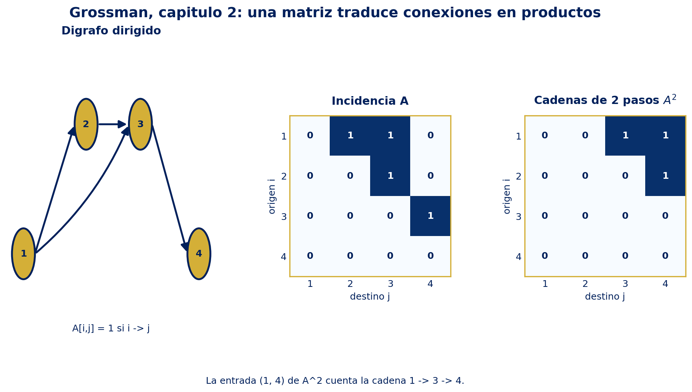

La figura hace visible la idea de la sección 2.8: una arista se almacena en \(A\), mientras que una multiplicación \(A^2\) cuenta composiciones de dos aristas.

## [Enriquecimiento Web / Referencias Externas]

### Conexiones conceptuales y aplicaciones

- **Álgebra computacional exacta.** La [documentación oficial de SymPy sobre matrices](https://docs.sympy.org/latest/tutorials/intro-tutorial/matrices.html) confirma la construcción por filas, el uso de `Matrix`, la transpuesta `.T`, la inversa, `rref`, el espacio nulo y `LUdecomposition`. Esto complementa el procedimiento manual de Grossman sin sustituir la justificación matemática.
- **Cálculo numérico.** [NumPy `matmul`](https://numpy.org/doc/stable/reference/generated/numpy.matmul.html) formaliza el producto con firma de formas \((n,k)(k,m)\to(n,m)\) y el operador `@`. [NumPy `linalg.solve`](https://numpy.org/doc/stable/reference/generated/numpy.linalg.solve.html) resuelve \(A\mathbf x=\mathbf b\) cuando \(A\) es cuadrada y de rango completo, y reporta error si es singular o no cuadrada. Es la traducción computacional de las condiciones de compatibilidad e invertibilidad.
- **Redes dirigidas.** NetworkX define [`DiGraph`](https://networkx.org/documentation/stable/reference/classes/digraph.html) para aristas orientadas y [`to_numpy_array`](https://networkx.org/documentation/stable/reference/generated/networkx.convert_matrix.to_numpy_array.html) para obtener la matriz de adyacencia. La documentación precisa que, en un digrafo, la entrada \((i,j)\) representa una arista de \(i\) a \(j\), y que el orden de nodos debe fijarse si se requiere reproducibilidad. Esto refuerza la advertencia de orientación de la sección 2.8.
- **Economía aplicada.** La biografía institucional de [Wassily Leontief en NobelPrize.org](https://www.nobelprize.org/prizes/economic-sciences/1973/leontief/biographical/) registra su formulación de tablas input–output de la economía estadounidense y el desarrollo de aplicaciones de esa teoría. En términos del capítulo, \((I-A)\mathbf x=\mathbf e\) convierte interdependencias sectoriales en un sistema lineal resoluble.

### Precisión terminológica

1. *Producto escalar* es un escalar; *producto matricial* puede producir una matriz, un vector o un escalar según los tamaños.
2. La expresión \(A^{-1}\) solo tiene sentido para una matriz cuadrada invertible; una matriz cuadrada no es automáticamente invertible.
3. \((AB)^{\mathsf T}=B^{\mathsf T}A^{\mathsf T}\) y \((AB)^{-1}=B^{-1}A^{-1}\) invierten el orden por razones diferentes: la primera refleja filas y columnas; la segunda deshace una composición.
4. En LU, la ausencia de permutaciones es una hipótesis del teorema 2.7.2. Cuando el pivoteo es necesario, la forma correcta es \(PA=LU\), no forzar \(A=LU\).
5. En la matriz de incidencia de Grossman, \((A^r)_{ij}\) cuenta cadenas de longitud exacta \(r\), no necesariamente caminos mínimos ni rutas sin vértices repetidos. El camino mínimo se identifica buscando la primera potencia no nula.

### Referencias

- Grossman, Stanley I. *Álgebra Lineal*, 7ª ed., capítulo 2, pp. 46–174. PDF local indicado en el frontmatter.
- SymPy Development Team. “Matrices”, documentación SymPy 1.14.0. https://docs.sympy.org/latest/tutorials/intro-tutorial/matrices.html
- NumPy Developers. “numpy.matmul” y “numpy.linalg.solve”, documentación NumPy 2.5. https://numpy.org/doc/stable/reference/generated/numpy.matmul.html ; https://numpy.org/doc/stable/reference/generated/numpy.linalg.solve.html
- NetworkX Developers. “DiGraph” y “to_numpy_array”, documentación NetworkX 3.6.1. https://networkx.org/documentation/stable/reference/classes/digraph.html ; https://networkx.org/documentation/stable/reference/generated/networkx.convert_matrix.to_numpy_array.html
- Nobel Prize Outreach. “Wassily Leontief – Biographical”, NobelPrize.org, 1973/2026. https://www.nobelprize.org/prizes/economic-sciences/1973/leontief/biographical/

## Checklist de dominio

- [ ] Verificar dimensiones antes de sumar o multiplicar.
- [ ] Expresar un sistema como \(A\mathbf x=\mathbf b\) y distinguir el homogéneo asociado.
- [ ] Describir todas las soluciones como \(\mathbf x_p+\mathbf x_h\) cuando hay infinitas soluciones.
- [ ] Decidir invertibilidad con pivotes o Gauss–Jordan, no por apariencia.
- [ ] Calcular y comprobar una inversa verificando ambos productos cuando sea posible.
- [ ] Aplicar las reglas de transpuesta sin olvidar invertir el orden del producto.
- [ ] Representar una OEF mediante una matriz elemental por la izquierda.
- [ ] Construir \(L\) con los multiplicadores y resolver \(LU\mathbf x=\mathbf b\) en dos sustituciones.
- [ ] Usar \(PA=LU\) cuando hay intercambio de renglones.
- [ ] Interpretar \((A^r)_{ij}\) como conteo de cadenas dirigidas de longitud \(r\).

---


---

# Capítulo 3: Determinantes


> [!info] Leyenda de trazabilidad
> - [Grossman 7ª Ed.]: síntesis rigurosa de las secciones 3.1–3.5 del PDF fuente, pp. 175–228. Las definiciones, propiedades, teoremas y ejemplos se reformulan; no se transcribe el texto.
> - [Enriquecimiento Web / Referencias Externas]: precisiones históricas, formulación axiomatizada y documentación actual de SymPy/NumPy, separadas en su sección correspondiente.
> - [Verificación computacional propia]: los ejemplos exactos se comprueban con SymPy y los cálculos numéricos con NumPy.

**Fuente primaria:** Álgebra Lineal (7ª Edición), capítulo 3. La figura local se genera con `01_Sistemas_Lineales/grossman_capitulo_3_figura.py` y se guarda como `figuras/grossman_capitulo_3_figura.png`.

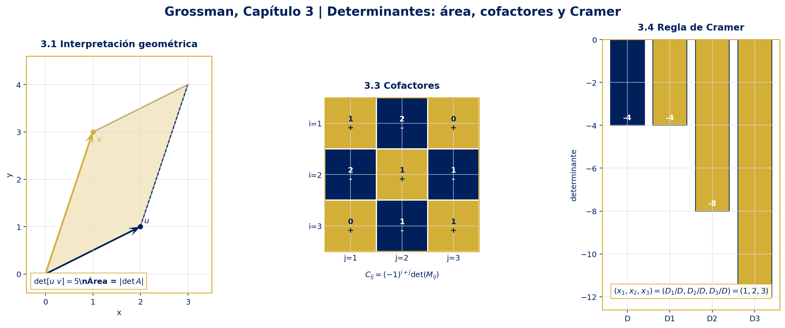

## Idea central

El determinante es un escalar asociado a una matriz cuadrada. Resume, en un solo valor, información algebraica, geométrica y computacional:

$$
\text{determinante} \longrightarrow \text{área/volumen y orientación} \longrightarrow \text{invertibilidad} \longrightarrow \text{sistemas lineales}.
$$

Para una matriz $A\in\mathbb{F}^{n\times n}$, con $\mathbb{F}$ un cuerpo conmutativo —por ejemplo $\mathbb{R}$ o $\mathbb{C}$—:

- $\det A=0$ indica que las columnas son linealmente dependientes y que la transformación asociada aplasta alguna dirección.
- $\det A\neq 0$ equivale a que $A$ es invertible y a que $Ax=b$ tiene una solución única para cada $b$.
- $|\det A|$ mide el factor de escala de áreas en dimensión $2$ y de volúmenes en dimensión $3$; el signo registra orientación.

## Mapa conceptual

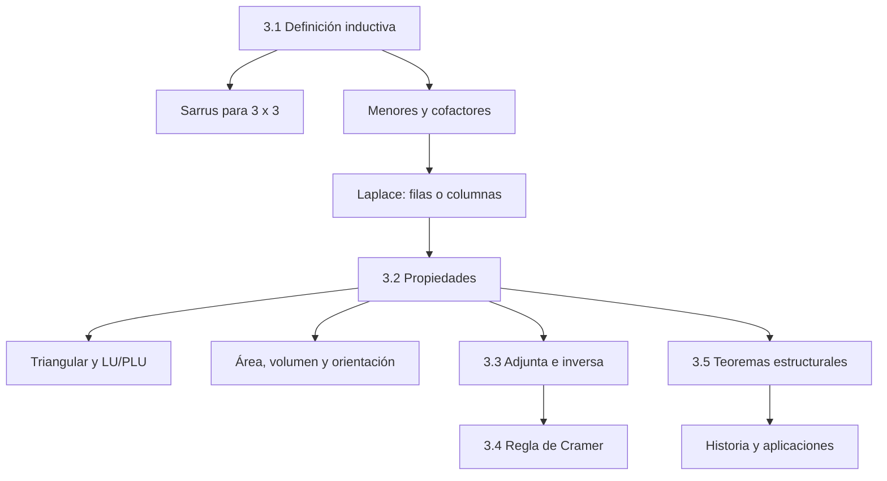

## Inventario de resultados

| Sección | Competencia que debe quedar dominada |
|---|---|
| 3.1 | Definir $\det A$ inductivamente, aplicar Sarrus sólo a $3\times3$, identificar menores/cofactores y usar la interpretación geométrica. |
| 3.2 | Transformar un determinante mediante operaciones elementales, usar transposición, triangularización, LU y PLU. |
| 3.3 | Relacionar $\det A$ con $A^{-1}$, construir la matriz de cofactores y la adjunta, y desarrollar por Laplace. |
| 3.4 | Resolver $Ax=b$ por Cramer cuando $\det A\neq0$, entendiendo su costo y sus límites. |
| 3.5 | Justificar la expansión por cualquier fila/columna, $A$ invertible $\Leftrightarrow\det A\neq0$ y $\det(AB)=\det A\det B$. |

---

## 3.1 Definiciones y cálculo básico · [Grossman 7ª Ed.]

### 3.1.1 Qué es un determinante

El determinante no es una matriz nueva ni un valor absoluto matricial: es una función que asigna un escalar a cada matriz cuadrada. Para una matriz $1\times1$:

$$
\det\begin{bmatrix}a_{11}\end{bmatrix}=a_{11}.
$$

Para $A\in\mathbb{F}^{2\times2}$:

$$
A=\begin{bmatrix}a_{11}&a_{12}\\a_{21}&a_{22}\end{bmatrix},
\qquad
\det A=a_{11}a_{22}-a_{12}a_{21}.
$$

La notación $|A|$ también representa $\det A$ cuando $A$ es cuadrada. En cambio, $|x|$ para un escalar representa su valor absoluto. Por ello, el área geométrica usa $|\det A|$, no $\det A$ sin signo.

### 3.1.2 Determinante de una matriz $3\times3$

Sea

$$
A=\begin{bmatrix}
a_{11}&a_{12}&a_{13}\\
a_{21}&a_{22}&a_{23}\\
a_{31}&a_{32}&a_{33}
\end{bmatrix}.
$$

La definición mediante la primera fila es

$$
\det A
=a_{11}\begin{vmatrix}a_{22}&a_{23}\\a_{32}&a_{33}\end{vmatrix}
-a_{12}\begin{vmatrix}a_{21}&a_{23}\\a_{31}&a_{33}\end{vmatrix}
+a_{13}\begin{vmatrix}a_{21}&a_{22}\\a_{31}&a_{32}\end{vmatrix}.
$$

Al evaluar los determinantes $2\times2$ se obtiene

$$
\det A
=a_{11}a_{22}a_{33}+a_{12}a_{23}a_{31}+a_{13}a_{21}a_{32}
-a_{13}a_{22}a_{31}-a_{12}a_{21}a_{33}-a_{11}a_{23}a_{32}.
$$

Esta identidad es la **regla de Sarrus**. Se puede recordar copiando las dos primeras columnas a la derecha: se suman los tres productos de diagonales descendentes y se restan los tres productos de diagonales ascendentes.

> [!warning] Alcance de Sarrus
> Sarrus es una regla específica para matrices $3\times3$. No existe una extensión válida por simple repetición de columnas para matrices $4\times4$ o de orden mayor. En dimensión general se usa expansión por cofactores, reducción por filas o factorización LU/PLU.

### Ejemplo 1: Sarrus paso a paso

Calcular el determinante de

$$
A=\begin{bmatrix}
2&1&3\\
0&-1&4\\
5&2&1
\end{bmatrix}.
$$

**Paso 1. Productos descendentes.**

$$
2(-1)(1)+1(4)(5)+3(0)(2)=-2+20+0=18.
$$

**Paso 2. Productos ascendentes.**

$$
3(-1)(5)+1(0)(1)+2(4)(2)=-15+0+16=1.
$$

**Paso 3. Restar las sumas según Sarrus.**

$$
\boxed{\det A=18-1=17}.
$$

La expansión por la primera fila confirma el resultado:

$$
\det A=2((-1)(1)-4(2))-1(0(1)-4(5))+3(0(2)-(-1)(5))=17.
$$

### 3.1.3 Menores y cofactores

Para $A\in\mathbb{F}^{n\times n}$, el **menor $M_{ij}$** es la matriz $(n-1)\times(n-1)$ obtenida al eliminar la fila $i$ y la columna $j$ de $A$. El **cofactor** asociado a la entrada $a_{ij}$ es el escalar

$$
C_{ij}=(-1)^{i+j}\det(M_{ij}).
$$

Los signos siguen el patrón ajedrezado

$$
\begin{bmatrix}
+1&-1&+1&\cdots\\
-&+&-&\cdots\\
+1&-1&+1&\cdots\\
\vdots&\vdots&\vdots&\ddots
\end{bmatrix}.
$$

Grossman denota el cofactor por $A_{ij}$; aquí se usa $C_{ij}$ para no confundirlo con la entrada de la matriz $A$.

La definición inductiva del determinante para $n\geq2$ es la expansión por cofactores en la primera fila:

$$
\det A=\sum_{j=1}^{n}a_{1j}C_{1j}.
$$

La afirmación más fuerte de que se puede expandir en cualquier fila o columna se demuestra en la sección 3.5.

### 3.1.4 Matrices triangulares

Una matriz cuadrada es triangular superior si $a_{ij}=0$ cuando $i>j$; es triangular inferior si $a_{ij}=0$ cuando $i<j$. Si sólo hay entradas potencialmente no nulas en la diagonal, es diagonal.

> [!important] Determinante triangular
> Si $T$ es triangular superior, triangular inferior o diagonal, entonces
>
> $$
> \det T=\prod_{i=1}^{n}t_{ii}=t_{11}t_{22}\cdots t_{nn}.
> $$
>
> En particular, $T$ es invertible exactamente cuando todos sus elementos diagonales son distintos de cero.

La razón inductiva es que, en una triangular superior, la primera columna contiene $a_{11}$ seguido de ceros. Al expandir por esa columna sólo sobrevive $a_{11}$ multiplicado por el determinante triangular de orden $n-1$.

### 3.1.5 Interpretación geométrica en $\mathbb{R}^{2}$

Sean $u=(a,c)$ y $v=(b,d)$ las columnas de

$$
A=\begin{bmatrix}a&b\\c&d\end{bmatrix}.
$$

El paralelogramo generado por $u$ y $v$ tiene área

$$
\operatorname{Área}(u,v)=|ad-bc|=|\det A|.
$$

El valor absoluto elimina el signo porque un área es no negativa. El signo de $\det A$ conserva información de orientación: si se intercambian las columnas, el paralelogramo geométrico es el mismo, pero su recorrido cambia de orientación y el determinante cambia de signo.

### Ejemplo 2: área y orientación paso a paso

Sean

$$
u=\begin{bmatrix}2\\1\end{bmatrix},
\qquad
v=\begin{bmatrix}1\\3\end{bmatrix},
\qquad
A=[u\ v]=\begin{bmatrix}2&1\\1&3\end{bmatrix}.
$$

**Paso 1. Calcular el determinante.**

$$
\det A=2(3)-1(1)=5.
$$

**Paso 2. Interpretar el valor absoluto.**

$$
\operatorname{Área}=|\det A|=5.
$$

**Paso 3. Interpretar el signo.** Como $\det A>0$, la base ordenada $(u,v)$ conserva la orientación positiva del plano. Si se toma $A'=[v\ u]$, entonces

$$
\det A'=-5,
$$

por lo que el área sigue siendo $5$, pero la orientación se invierte.

En $\mathbb{R}^{3}$, el análogo es el volumen orientado del paralelepípedo generado por las tres columnas; su volumen geométrico es $|\det A|$.

---

## 3.2 Propiedades de los determinantes · [Grossman 7ª Ed.]

La expansión recursiva es conceptualmente suficiente, pero su costo crece demasiado rápido. Una expansión ingenua de una matriz $n\times n$ exige, en esencia, explorar muchos órdenes de $n!$ términos. Las propiedades siguientes permiten triangularizar y calcular de forma eficiente.

### 3.2.1 Propiedades fundamentales

Para $A,B\in\mathbb{F}^{n\times n}$ y $c\in\mathbb{F}$:

| Operación o situación | Efecto sobre el determinante |
|---|---|
| Una fila o columna es cero | $\det A=0$. |
| Multiplicar una fila o columna por $c$ | El determinante se multiplica por $c$. |
| Sumar a una fila/columna un múltiplo de otra | El determinante no cambia. |
| Intercambiar dos filas o dos columnas | El determinante cambia de signo. |
| Dos filas o columnas son iguales | $\det A=0$. |
| Una fila o columna es múltiplo de otra | $\det A=0$. |
| Transponer | $\det(A^{\mathsf T})=\det A$. |
| Producto | $\det(AB)=\det A\,\det B$. |

La linealidad en cada fila o columna debe entenderse con las demás filas fijas. Por ejemplo, si sólo cambia la fila $i$:

$$
\det\begin{bmatrix}
\text{filas fijas}\\
u_i+v_i\\
\text{filas fijas}
\end{bmatrix}
=
\det\begin{bmatrix}
\text{filas fijas}\\
u_i\\
\text{filas fijas}
\end{bmatrix}
+
\det\begin{bmatrix}
\text{filas fijas}\\
v_i\\
\text{filas fijas}
\end{bmatrix}.
$$

De aquí se deduce

$$
\det(cA)=c^{n}\det A,
$$

porque multiplicar toda la matriz por $c$ equivale a multiplicar sus $n$ filas, una por una.

### 3.2.2 Por qué las operaciones elementales producen esos efectos

**Fila o columna cero.** Al expandir por esa fila o columna, todos los términos contienen un factor cero.

**Escalamiento.** Si la fila $i$ se multiplica por $c$, cada término de la expansión por esa fila contiene exactamente un factor $c$:

$$
\det B=\sum_{j=1}^{n}(ca_{ij})C_{ij}=c\sum_{j=1}^{n}a_{ij}C_{ij}=c\det A.
$$

**Intercambio.** Intercambiar dos filas cambia el signo de cada término de la suma alternante. Si las dos filas eran iguales, el intercambio no cambia la matriz y simultáneamente obliga a $\det A=-\det A$; por tanto, $\det A=0$.

**Suma de filas.** Si $R_j$ se reemplaza por $R_j+cR_i$, la linealidad da

$$
\det(\ldots,R_j+cR_i,\ldots)=\det(\ldots,R_j,\ldots)+c\det(\ldots,R_i,\ldots).
$$

El segundo determinante tiene dos filas iguales, de modo que vale cero. Por consiguiente, la operación no cambia el determinante.

> [!warning] Determinante de una suma
> En general no se cumple $\det(A+B)=\det A+\det B$. La linealidad se aplica a una fila o columna cada vez, manteniendo las demás fijas; no es lineal simultáneamente en todas las entradas.

### Ejemplo 3: triangularización mediante operaciones de fila

Calcular $\det A$ para

$$
A=\begin{bmatrix}
2&1&0\\
4&3&1\\
2&0&1
\end{bmatrix}.
$$

**Paso 1. Anular la entrada bajo el primer pivote.**

$$
R_2\leftarrow R_2-2R_1,
\qquad
R_3\leftarrow R_3-R_1,
$$

lo que produce

$$
\begin{bmatrix}
2&1&0\\
0&1&1\\
0&-1&1
\end{bmatrix}.
$$

Ambas operaciones son sumas de múltiplos de filas, así que no alteran el determinante.

**Paso 2. Anular la entrada bajo el segundo pivote.**

$$
R_3\leftarrow R_3+R_2
\quad\Longrightarrow\quad
U=\begin{bmatrix}
2&1&0\\
0&1&1\\
0&0&2
\end{bmatrix}.
$$

**Paso 3. Usar la diagonal de $U$.**

$$
\boxed{\det A=\det U=2\cdot1\cdot2=4}.
$$

Si en el proceso se intercambia una pareja de filas, hay que multiplicar el resultado final por $-1$. Si se escala una fila por $c$, hay que registrar el factor $c$ o deshacerlo al final.

### 3.2.3 Factorizaciones $LU$ y $PLU$

Si la eliminación no requiere intercambios de filas y produce $A=LU$, donde $L$ es triangular inferior con diagonal unitaria y $U$ triangular superior, entonces

$$
\det A=\det L\,\det U=1\cdot\prod_{i=1}^{n}u_{ii}=\det U.
$$

Para una matriz general se usa una matriz de permutación $P$:

$$
PA=LU,
\qquad
\det P=\pm1,
$$

y por tanto

$$
\det P\,\det A=\det L\,\det U=\det U,
\qquad
\boxed{\det A=\frac{\det U}{\det P}=\pm\det U}.
$$

El signo depende de la paridad del número de intercambios de filas. Este es el puente entre el álgebra de determinantes y los algoritmos de eliminación.

### Ejemplo 4: una suma de matrices no es una suma de determinantes

Sean

$$
A=\begin{bmatrix}1&2\\3&4\end{bmatrix},
\qquad
B=\begin{bmatrix}1&0\\0&1\end{bmatrix}.
$$

**Paso 1.**

$$
\det A=1(4)-2(3)=-2,
\qquad
\det B=1.
$$

**Paso 2.**

$$
A+B=\begin{bmatrix}2&2\\3&5\end{bmatrix},
\qquad
\det(A+B)=2(5)-2(3)=4.
$$

**Paso 3. Comparar.**

$$
\det A+\det B=-2+1=-1\neq4=\det(A+B).
$$

La propiedad correcta es la linealidad en una sola fila o columna, no la aditividad matricial global.

---

## 3.3 Determinantes, cofactores e inversas · [Grossman 7ª Ed.]

### 3.3.1 Determinante de la inversa

Si $A$ es invertible, entonces $AA^{-1}=I$. Usando la propiedad multiplicativa —demostrada analíticamente en la sección 3.5—:

$$
1=\det I=\det(AA^{-1})=\det A\,\det(A^{-1}).
$$

Por tanto,

$$
\boxed{\det(A^{-1})=\frac{1}{\det A}},
\qquad
\det A\neq0.
$$

### 3.3.2 Matriz de cofactores y adjunta

La **matriz de cofactores** de $A$ es

$$
C(A)=\begin{bmatrix}
C_{11}&C_{12}&\cdots&C_{1n}\\
C_{21}&C_{22}&\cdots&C_{2n}\\
\vdots&\vdots&\ddots&\vdots\\
C_{n1}&C_{n2}&\cdots&C_{nn}
\end{bmatrix}.
$$

La **adjunta clásica** —también llamada adjugada en algunos textos— es la transpuesta de la matriz de cofactores:

$$
\operatorname{adj}(A)=C(A)^{\mathsf T}.
$$

La transposición es indispensable. El elemento $(i,j)$ de $\operatorname{adj}(A)$ es $C_{ji}$, no $C_{ij}$.

### 3.3.3 Desarrollo de Laplace

El desarrollo de Laplace es la expansión de un determinante por una fila o columna. Para una fila $i$:

$$
\det A=\sum_{j=1}^{n}a_{ij}C_{ij}.
$$

Para una columna $j$:

$$
\det A=\sum_{i=1}^{n}a_{ij}C_{ij}.
$$

En la práctica se elige la fila o columna con más ceros, porque los términos correspondientes desaparecen. Laplace es especialmente útil para matrices simbólicas o pequeñas; para matrices numéricas grandes, la eliminación/LU suele ser mucho más eficiente.

### 3.3.4 Identidad fundamental de la adjunta

La identidad clave es

$$
A\,\operatorname{adj}(A)=(\det A)I.
$$

Para la entrada $(i,j)$ del producto:

$$
\bigl(A\,\operatorname{adj}(A)\bigr)_{ij}=\sum_{k=1}^{n}a_{ik}C_{jk}.
$$

Si $i=j$, esta suma es la expansión de $\det A$ por la fila $i$. Si $i\neq j$, se puede construir una matriz que coincide con $A$ salvo que su fila $j$ se reemplaza por la fila $i$; esa matriz tiene dos filas iguales y su determinante es cero. En consecuencia,

$$
\sum_{k=1}^{n}a_{ik}C_{jk}
=\begin{cases}
\det A,&i=j,\\
0,&i\neq j,
\end{cases}
$$

que es exactamente $(\det A)I$.

Si $\det A\neq0$, se divide la identidad por $\det A$ y se obtiene

$$
\boxed{A^{-1}=\frac{1}{\det A}\operatorname{adj}(A)}.
$$

### Ejemplo 5: cofactores, adjunta e inversa paso a paso

Sea

$$
A=\begin{bmatrix}
1&2&0\\
2&1&1\\
0&1&1
\end{bmatrix}.
$$

**Paso 1. Calcular los cofactores de la primera fila.**

$$
C_{11}=\det\begin{bmatrix}1&1\\1&1\end{bmatrix}=0,
$$

$$
C_{12}=-\det\begin{bmatrix}2&1\\0&1\end{bmatrix}=-2,
\qquad
C_{13}=\det\begin{bmatrix}2&1\\0&1\end{bmatrix}=2.
$$

Se calculan de igual modo las filas restantes:

$$
C(A)=\begin{bmatrix}
0&-2&2\\
-2&1&-1\\
2&-1&-3
\end{bmatrix}.
$$

**Paso 2. Expandir por la primera fila.**

$$
\det A=1(0)+2(-2)+0(2)=-4.
$$

Como $\det A=-4\neq0$, la matriz es invertible.

**Paso 3. Transponer la matriz de cofactores.** En este ejemplo es simétrica, por lo que $\operatorname{adj}(A)=C(A)^{\mathsf T}=C(A)$.

**Paso 4. Aplicar la fórmula de la inversa.**

$$
A^{-1}=-\frac14
\begin{bmatrix}
0&-2&2\\
-2&1&-1\\
2&-1&-3
\end{bmatrix}
=\begin{bmatrix}
0&\frac12&-\frac12\\
\frac12&-\frac14&\frac14\\
-\frac12&\frac14&\frac34
\end{bmatrix}.
$$

**Paso 5. Verificación estructural.**

$$
A\,\operatorname{adj}(A)=-4I,
\qquad
A A^{-1}=I.
$$

Para una matriz $2\times2$ se recupera la fórmula conocida:

$$
\begin{bmatrix}a&b\\c&d\end{bmatrix}^{-1}
=\frac{1}{ad-bc}
\begin{bmatrix}d&-b\\-c&a\end{bmatrix},
\qquad ad-bc\neq0.
$$

### 3.3.5 Teorema de resumen: siete equivalencias

Para $A\in\mathbb{F}^{n\times n}$ son equivalentes las afirmaciones siguientes:

1. $A$ es invertible.
2. $Ax=0$ sólo tiene la solución $x=0$.
3. $Ax=b$ tiene una solución única para todo $b\in\mathbb{F}^{n}$.
4. $A$ es equivalente por filas a $I_n$.
5. $A$ es producto de matrices elementales.
6. La forma escalonada de $A$ tiene $n$ pivotes.
7. $\det A\neq0$.

El determinante agrega el séptimo criterio a la cadena de equivalencias entre inversa, sistemas, pivotes y operaciones elementales.

> [!warning] Adjunta frente a eliminación
> La fórmula con cofactores es fundamental para la teoría y para matrices simbólicas pequeñas, pero calcular $n^2$ cofactores puede ser costoso. Para una matriz numérica grande no se debe calcular la inversa mediante la adjunta sólo porque exista la fórmula; normalmente se resuelve $Ax=b$ mediante LU, QR u otro método numéricamente adecuado.

---

## 3.4 Regla de Cramer · [Grossman 7ª Ed.]

Consideremos un sistema cuadrado

$$
Ax=b,
\qquad
A\in\mathbb{F}^{n\times n},
\quad
x,b\in\mathbb{F}^{n}.
$$

Sea

$$
D=\det A.
$$

Para cada $j$, se define $A_j$ reemplazando la columna $j$ de $A$ por $b$, y

$$
D_j=\det A_j.
$$

### Teorema 3.4.1: regla de Cramer

Si $D\neq0$, el sistema tiene solución única y

$$
\boxed{x_j=\frac{D_j}{D}},
\qquad j=1,2,\ldots,n.
$$

### Demostración analítica

Como $D\neq0$, la matriz es invertible y

$$
x=A^{-1}b=\frac{1}{D}\operatorname{adj}(A)b.
$$

La componente $j$ de $\operatorname{adj}(A)b$ es

$$
\bigl(\operatorname{adj}(A)b\bigr)_j
=C_{1j}b_1+C_{2j}b_2+\cdots+C_{nj}b_n.
$$

Al expandir $\det A_j$ por su columna $j$, los cofactores de los elementos $b_i$ son precisamente $C_{ij}$ de la matriz original $A$, porque al eliminar la columna reemplazada queda el mismo menor $M_{ij}$. Por tanto,

$$
D_j=\bigl(\operatorname{adj}(A)b\bigr)_j.
$$

La igualdad $x=\frac1D\operatorname{adj}(A)b$ entrega $x_j=D_j/D$ para cada componente.

### Ejemplo 6: Cramer paso a paso

Resolver

$$
\begin{aligned}
x_1+2x_2&=5,\\
2x_1+x_2+x_3&=7,\\
x_2+x_3&=5.
\end{aligned}
$$

En forma matricial:

$$
A=\begin{bmatrix}1&2&0\\2&1&1\\0&1&1\end{bmatrix},
\qquad
b=\begin{bmatrix}5\\7\\5\end{bmatrix}.
$$

**Paso 1. Determinante común.** Ya se obtuvo $D=\det A=-4\neq0$, de modo que hay solución única.

**Paso 2. Reemplazar la primera columna.**

$$
A_1=\begin{bmatrix}5&2&0\\7&1&1\\5&1&1\end{bmatrix},
\qquad
D_1=5(1-1)-2(7-5)=-4.
$$

Así,

$$
x_1=\frac{D_1}{D}=\frac{-4}{-4}=1.
$$

**Paso 3. Reemplazar la segunda columna.**

$$
A_2=\begin{bmatrix}1&5&0\\2&7&1\\0&5&1\end{bmatrix},
\qquad
D_2=1(7-5)-5(2-0)=-8,
$$

por lo que

$$
x_2=\frac{D_2}{D}=\frac{-8}{-4}=2.
$$

**Paso 4. Reemplazar la tercera columna.**

$$
A_3=\begin{bmatrix}1&2&5\\2&1&7\\0&1&5\end{bmatrix},
$$

$$
D_3=1(5-7)-2(10-0)+5(2-0)=-12,
$$

por lo que

$$
x_3=\frac{D_3}{D}=\frac{-12}{-4}=3.
$$

**Paso 5. Verificación por sustitución.**

$$
A\begin{bmatrix}1\\2\\3\end{bmatrix}
=\begin{bmatrix}5\\7\\5\end{bmatrix}=b.
$$

### Alcance y costo

Cramer no se puede aplicar cuando $\det A=0$, porque dividir por $D$ no está definido. En ese caso, el sistema puede ser incompatible o tener infinitas soluciones; el determinante por sí solo no decide cuál de las dos situaciones ocurre.

Aunque es una fórmula cerrada elegante, para un sistema $n\times n$ requiere calcular $D$ y hasta $n$ determinantes adicionales. Por ello es principalmente una herramienta teórica, simbólica o didáctica para matrices pequeñas. En cálculo numérico se prefiere resolver directamente $Ax=b$ con eliminación/LU, evitando formar $A^{-1}$ y evitando la amplificación de errores propia de dividir por un determinante muy pequeño.

---

## 3.5 Demostración de tres teoremas importantes · [Grossman 7ª Ed.]

Esta sección fija tres hechos estructurales que explican por qué la teoría funciona: expansión por cualquier fila o columna, equivalencia entre invertibilidad y determinante no nulo, y multiplicatividad.

### Teorema 3.5.1: expansión por cualquier fila o columna

Para $A=(a_{ij})\in\mathbb{F}^{n\times n}$, para toda fila $i$ y toda columna $j$:

$$
\det A=\sum_{k=1}^{n}a_{ik}C_{ik}
=\sum_{k=1}^{n}a_{kj}C_{kj}.
$$

#### Demostración

La definición inductiva da la expansión por la primera fila. Para hacer explícita la estructura de signos, usemos la forma analítica equivalente

$$
\det A=\sum_{\sigma\in S_n}\operatorname{sgn}(\sigma)\prod_{r=1}^{n}a_{r,\sigma(r)},
$$

donde $S_n$ es el conjunto de permutaciones de $\{1,\ldots,n\}$.

Fijemos una fila $i$. Agrupemos los términos según el valor $k=\sigma(i)$ de la columna elegida por la permutación. En el grupo que contiene $a_{ik}$, el resto de la permutación selecciona exactamente una entrada de cada fila distinta de $i$ y de cada columna distinta de $k$. Esas elecciones son los términos del determinante del menor $M_{ik}$. Al reordenar filas y columnas para eliminar la fila $i$ y la columna $k$, aparece el signo $(-1)^{i+k}$. Por tanto, la suma del grupo completo es

$$
a_{ik}(-1)^{i+k}\det(M_{ik})=a_{ik}C_{ik}.
$$

Los grupos son disjuntos y cubren todas las permutaciones, así que

$$
\det A=\sum_{k=1}^{n}a_{ik}C_{ik}.
$$

El argumento para una columna fija es el mismo: ahora se agrupan las permutaciones según la fila $k$ elegida en esa columna. El signo de eliminar la fila $k$ y la columna $j$ vuelve a ser $(-1)^{k+j}$, por lo que

$$
\det A=\sum_{k=1}^{n}a_{kj}C_{kj}.
$$

Así, la expansión inicialmente definida en la primera fila vale en realidad para toda fila y columna.

### Teorema 3.5.2: $A$ es invertible si y sólo si $\det A\neq0$

#### Demostración

Consideremos una reducción por filas de $A$ a una matriz escalonada $U$. Cada operación elemental tiene un efecto no nulo y conocido:

1. Un intercambio multiplica el determinante por $-1$.
2. Multiplicar una fila por $c\neq0$ multiplica el determinante por $c$.
3. Sumar un múltiplo de una fila a otra conserva el determinante.

Como las operaciones usadas son reversibles, se cumple

$$
\det A=0\quad\Longleftrightarrow\quad\det U=0.
$$

La matriz $U$ es triangular superior, por lo que

$$
\det U=\prod_{i=1}^{n}u_{ii}.
$$

Por tanto, $\det U\neq0$ si y sólo si $U$ tiene $n$ pivotes. Esto equivale a que $U$ se reduzca a $I_n$, y como las operaciones de fila son invertibles, equivale a que $A$ sea equivalente por filas a $I_n$. Finalmente, $A$ es equivalente por filas a $I_n$ si y sólo si $A$ es invertible. Se concluye

$$
\boxed{A\text{ invertible}\iff\det A\neq0}.
$$

La prueba también muestra por qué una fila nula, un pivote ausente o una dependencia lineal de filas fuerza el determinante a cero.

### Teorema 3.5.3: multiplicatividad

Para cualesquiera $A,B\in\mathbb{F}^{n\times n}$:

$$
\boxed{\det(AB)=\det A\,\det B}.
$$

#### Demostración

Primero observemos el caso de una matriz elemental $E$ actuando a la izquierda sobre $B$. La matriz $EB$ realiza una operación elemental sobre las filas de $B$:

$$
\det(EB)=\det E\,\det B,
$$

porque, respectivamente, $\det E=-1$ para un intercambio, $\det E=1$ para una suma de filas y $\det E=c$ para un escalamiento por $c$.

**Caso 1: al menos una de las matrices es singular.** Supongamos $\det A=0$. Por el teorema 3.5.2 existe $y\neq0$ tal que $Ay=0$. Si $B$ es invertible, tomamos $x=B^{-1}y\neq0$ y obtenemos

$$
(AB)x=A(Bx)=Ay=0.
$$

Si $B$ también es singular, existe directamente $x\neq0$ con $Bx=0$, y entonces $(AB)x=0$. En ambos subcasos, $AB$ es singular. Por el teorema 3.5.2,

$$
\det(AB)=0=\det A\,\det B.
$$

El caso $\det B=0$ es análogo.

**Caso 2: $A$ y $B$ son invertibles.** Al reducir $A$ a $I_n$, las operaciones elementales son reversibles; por ello $A$ puede escribirse como producto de matrices elementales:

$$
A=E_1E_2\cdots E_m.
$$

Aplicando repetidamente el caso elemental:

$$
\begin{aligned}
\det(AB)
&=\det(E_1E_2\cdots E_mB)\\
&=\det E_1\det E_2\cdots\det E_m\det B\\
&=\det(E_1E_2\cdots E_m)\det B\\
&=\det A\,\det B.
\end{aligned}
$$

Los dos casos cubren todas las posibilidades y prueban la identidad.

### 3.5.4 Historia breve y contexto · [Enriquecimiento Web / Referencias Externas]

La historia de los determinantes precede a la teoría moderna de matrices y nació de problemas de sistemas lineales:

- Los métodos chinos de *Los nueve capítulos sobre el arte matemático*, entre los siglos II y I a. C., ya organizaban coeficientes en tablas y aplicaban una eliminación equivalente a la eliminación gaussiana.
- Seki Kowa trabajó con determinantes en Japón en 1683. Gottfried Wilhelm Leibniz describió en 1693 una condición determinantal para sistemas lineales; la evidencia histórica no permite reducir el origen a un solo autor.
- Colin Maclaurin desarrolló resultados sobre sistemas en la década de 1730; Gabriel Cramer publicó en 1750 la regla general que hoy lleva su nombre.
- Pierre-Simon Laplace utilizó en 1772 la expansión que hoy se denomina desarrollo de Laplace. Joseph-Louis Lagrange dio en 1773 una interpretación geométrica relacionada con volumen.
- Carl Friedrich Gauss introdujo el término “determinante” en 1801, aunque con un significado todavía ligado a formas cuadráticas. Augustin-Louis Cauchy empleó el concepto en su sentido moderno y probó en 1812 el teorema de multiplicación.
- Carl Gustav Jacobi sistematizó métodos algorítmicos y el estudio de menores. James Joseph Sylvester introdujo en 1850 el término “matriz”, entendida originalmente como la “madre” de los determinantes.

La formulación moderna permite ver una unidad que no siempre fue histórica: el determinante es simultáneamente una función alternante y multilineal normalizada, una escala orientada de volumen y un criterio de invertibilidad.

> [!note] Aplicación contemporánea
> En geometría computacional, robótica y gráficos, $|\det A|$ cuantifica la escala local de área o volumen y el signo detecta inversión de orientación. En modelamiento lineal, $\det A\neq0$ certifica que una configuración tiene solución única. En sistemas de comunicaciones MIMO, el determinante aparece al estudiar matrices de canal y la posibilidad de separar señales transmitidas simultáneamente.

---

## Verificación computacional · [Verificación computacional propia]

El siguiente bloque usa aritmética exacta para evitar redondeos en la teoría y NumPy para contrastar el flujo numérico. Se verifican Sarrus, propiedades, cofactores, adjunta, inversa, Cramer y la solución directa del sistema.

```python
import sympy as sp
import numpy as np


def sarrus_3x3(matrix):
 """Evaluate Sarrus exactly for a 3 x 3 SymPy matrix."""
 return (
 matrix[0, 0] * matrix[1, 1] * matrix[2, 2]
 + matrix[0, 1] * matrix[1, 2] * matrix[2, 0]
 + matrix[0, 2] * matrix[1, 0] * matrix[2, 1]
 - matrix[0, 2] * matrix[1, 1] * matrix[2, 0]
 - matrix[0, 1] * matrix[1, 0] * matrix[2, 2]
 - matrix[0, 0] * matrix[1, 2] * matrix[2, 1]
 )


def replace_column(matrix, vector, column):
 return sp.Matrix(
 [
 [vector[row] if col == column else matrix[row, col] for col in range(matrix.cols)]
 for row in range(matrix.rows)
 ]
 )


A3 = sp.Matrix([[2, 1, 3], [0, -1, 4], [5, 2, 1]])
assert sarrus_3x3(A3) == A3.det() == 17

A = sp.Matrix([[1, 2, 0], [2, 1, 1], [0, 1, 1]])
b = sp.Matrix([5, 7, 5])
D = A.det()
C = A.cofactor_matrix()
adjugate = A.adjugate()
inverse = A.inv()

assert D == -4
assert A * C.T == D * sp.eye(3)
assert A * adjugate == D * sp.eye(3)
assert inverse == adjugate / D

cramer_determinants = [replace_column(A, b, column).det() for column in range(A.cols)]
cramer_solution = sp.Matrix([value / D for value in cramer_determinants])
assert cramer_determinants == [-4, -8, -12]
assert cramer_solution == sp.Matrix([1, 2, 3])
assert A * cramer_solution == b

P = sp.Matrix([[1, 2], [3, 4]])
Q = sp.Matrix([[2, 0], [1, 3]])
assert (P * Q).det() == P.det() * Q.det()
assert P.det() == P.T.det()

A_np = np.array(A.tolist(), dtype=float)
b_np = np.array(b.tolist(), dtype=float).reshape(-1)
x_np = np.linalg.solve(A_np, b_np)
assert np.allclose(np.linalg.det(A_np), float(D))
assert np.allclose(x_np, np.array([1.0, 2.0, 3.0]))
assert np.allclose(A_np @ x_np, b_np)

print("PASS: determinantes, adjunta, inversa, Cramer y NumPy verificados")
```

### Recomendación numérica

SymPy conserva fracciones y símbolos, por lo que es apropiado para demostraciones y verificación exacta. NumPy documenta que `numpy.linalg.det` calcula el determinante mediante factorización LU y LAPACK, no mediante expansión de cofactores. Para resolver $Ax=b$, `numpy.linalg.solve` exige una matriz cuadrada de rango completo y usa una rutina LAPACK especializada; si la matriz es singular, eleva `LinAlgError`. Esto explica la diferencia entre la fórmula histórica de Cramer y el método recomendado para cómputo científico.

## Errores frecuentes

| Error | Corrección |
|---|---|
| Aplicar Sarrus a una matriz $4\times4$ | Usar Laplace, operaciones elementales o LU/PLU. |
| Olvidar el signo $(-1)^{i+j}$ | Escribir el tablero de signos antes de calcular cofactores. |
| Llamar adjunta a la matriz de cofactores sin transponer | $\operatorname{adj}(A)=C(A)^{\mathsf T}$. |
| Cambiar de fila y conservar el determinante | Un intercambio introduce un factor $-1$. |
| Escalar una fila y no registrar el factor | El determinante cambia por el mismo escalar. |
| Suponer $\det(A+B)=\det A+\det B$ | La linealidad es fila a fila o columna a columna. |
| Dividir por un determinante pequeño en Cramer | Verificar $\det A\neq0$ y preferir LU para cálculo numérico. |
| Interpretar $\det A=0$ como “todas las entradas son cero” | Sólo indica dependencia lineal, pérdida de volumen o singularidad. |

## Referencias

### [Grossman 7ª Ed.]

- Grossman, Stanley I. *Álgebra Lineal*, 7ª edición, capítulo 3, pp. 175–230. Fuente local: PDF de la asignatura.

### [Enriquecimiento Web / Referencias Externas]

- J. J. O'Connor y E. F. Robertson, “Matrices and determinants”, [MacTutor History of Mathematics, University of St Andrews](https://mathshistory.st-andrews.ac.uk/HistTopics/Matrices_and_determinants/). Revisión histórica de métodos chinos, Seki, Leibniz, Cramer, Laplace, Gauss, Cauchy, Jacobi y Sylvester.
- D. A. Suprunenko, “Determinant”, [Encyclopedia of Mathematics](https://encyclopediaofmath.org/wiki/Determinant). Formulación por multilinealidad, alternancia, expansión por cofactores, Binet–Cauchy e invertibilidad.
- SymPy Development Team, [Matrices (linear algebra), SymPy 1.14.0 documentation](https://docs.sympy.org/latest/modules/matrices/matrices.html). Documentación de `det`, `adjugate`, `inv`, `LUdecomposition`
- NumPy Developers, [`numpy.linalg.det`, NumPy 2.5 Manual](https://numpy.org/doc/stable/reference/generated/numpy.linalg.det.html). Cálculo numérico del determinante mediante LU/LAPACK.
- NumPy Developers, [`numpy.linalg.solve`, NumPy 2.5 Manual](https://numpy.org/doc/stable/reference/generated/numpy.linalg.solve.html). Resolución de sistemas cuadrados de rango completo y tratamiento de matrices singulares.

---

**Síntesis final:** el determinante no es un procedimiento aislado para obtener un número. Es el invariante que conecta la geometría de una transformación, las operaciones elementales, la existencia de la inversa, la solución de sistemas y la eficiencia de los algoritmos de álgebra lineal.

---

# Capítulo 4: Vectores en R2 y R3

> [!abstract] Propósito
> Este capítulo traduce la intuición geométrica de las flechas a operaciones algebraicas en $\mathbb{R}^2$ y $\mathbb{R}^3$. La secuencia central es: representar, medir, proyectar, construir normales y describir rectas y planos.


## Leyenda de Trazabilidad

- **[Grossman 7ª Ed.]**: definiciones, teoremas, ejemplos y organización conceptual sintetizados desde el capítulo 4 del PDF de Grossman, pp. 232–290. La redacción y los ejemplos de comprobación son propios; no se reproduce el texto fuente.
- **[Enriquecimiento Web / Referencias Externas]**: conexiones académicas y documentación técnica consultadas después de la síntesis, separadas en su sección correspondiente.
- **Código**: las identidades se verifican con aritmética exacta de SymPy y operaciones numéricas de NumPy. La figura local se genera con `/grossman_capitulo_4_figura.py`.

## Mapa conceptual

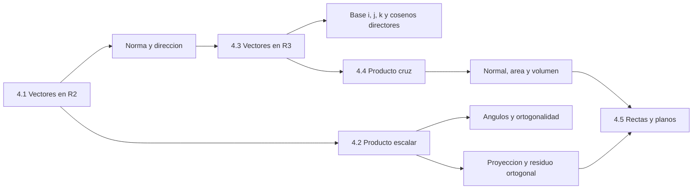

### Figura de síntesis

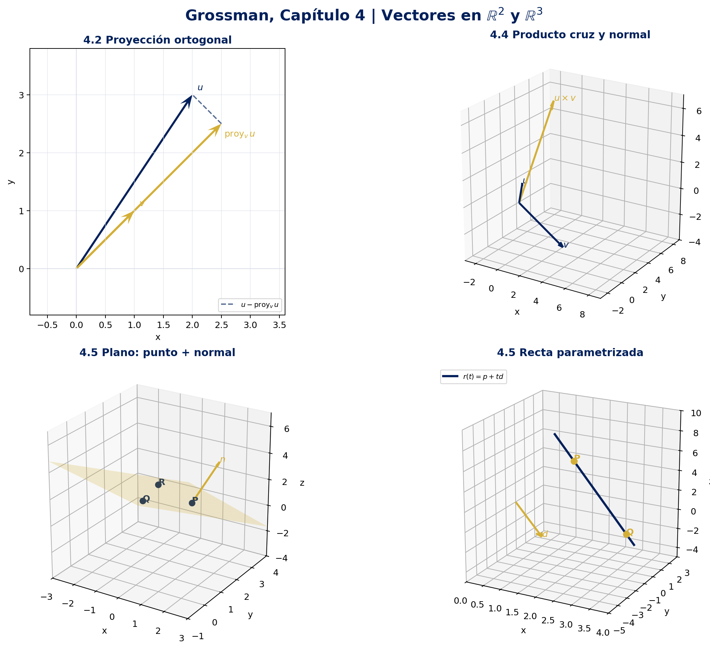

La figura reúne una proyección en $\mathbb{R}^2$, un producto cruz, un plano construido mediante tres puntos y una recta parametrizada. Sus colores institucionales son `USSBlue = #00205B`

---

## 4.1 Vectores en el plano

**Fuente:** [Grossman 7ª Ed.] (pp. 232–246; síntesis propia).

### 4.1.1 Dos lecturas del mismo vector

Un segmento dirigido $\overrightarrow{PQ}$ tiene punto inicial $P$ y punto terminal $Q$. Dos segmentos dirigidos son equivalentes cuando tienen la misma longitud y la misma dirección, aunque estén ubicados en posiciones distintas. Un vector geométrico es la clase de todos los segmentos dirigidos equivalentes.

La representación algebraica fija el punto inicial en el origen. Si $P=(x_P,y_P)$ y $Q=(x_Q,y_Q)$, entonces

$$
\overrightarrow{PQ}=Q-P=(x_Q-x_P,\,y_Q-y_P).
$$

Por tanto, en $\mathbb{R}^2$ un vector puede escribirse como

$$
\mathbf{v}=(a,b)=a\mathbf{i}+b\mathbf{j},
\qquad
\mathbf{i}=(1,0),\quad \mathbf{j}=(0,1).
$$

El vector cero es $\mathbf{0}=(0,0)$; su magnitud es cero y no tiene una dirección geométrica determinada.

### 4.1.2 Magnitud y dirección

Por el teorema de Pitágoras, la magnitud o norma de $\mathbf{v}=(a,b)$ es

$$
\lVert\mathbf{v}\rVert=\sqrt{a^2+b^2}.
$$

Si $\mathbf{v}\neq\mathbf{0}$, su dirección es el ángulo $\theta\in[0,2\pi)$ medido desde el semieje positivo $x$. La forma robusta de calcularlo es

$$
\theta=\operatorname{atan2}(b,a)\pmod{2\pi}.
$$

La fórmula $\tan\theta=b/a$ necesita identificar además el cuadrante y no sirve directamente cuando $a=0$. Para un vector unitario, la representación polar es

$$
\mathbf{u}=(\cos\theta,\sin\theta)=\cos\theta\,\mathbf{i}+\sin\theta\,\mathbf{j}.
$$

### 4.1.3 Operaciones y geometría

Para $\mathbf{u}=(u_1,u_2)$, $\mathbf{v}=(v_1,v_2)$ y $\lambda\in\mathbb{R}$:

$$
\mathbf{u}+\mathbf{v}=(u_1+v_1,u_2+v_2),
\qquad
\mathbf{u}-\mathbf{v}=(u_1-v_1,u_2-v_2),
$$

$$
\lambda\mathbf{v}=(\lambda v_1,\lambda v_2),
\qquad
\lVert\lambda\mathbf{v}\rVert=|\lambda|\,\lVert\mathbf{v}\rVert.
$$

Multiplicar por un escalar positivo conserva la dirección; un escalar negativo invierte la dirección y $\lambda=0$ produce el vector cero. La suma se interpreta mediante la regla del triángulo o del paralelogramo.

> [!important] Desigualdad del triángulo
> Para cualesquiera $\mathbf{u},\mathbf{v}\in\mathbb{R}^2$,
>
> $$
> \lVert\mathbf{u}+\mathbf{v}\rVert\leq\lVert\mathbf{u}\rVert+\lVert\mathbf{v}\rVert.
> $$
>
> La igualdad ocurre cuando los vectores son colineales y apuntan en la misma dirección, incluyendo el caso en que uno sea cero.

Los vectores $\mathbf{i}$ y $\mathbf{j}$ forman una base de $\mathbb{R}^2$: toda flecha plana tiene una única combinación lineal $a\mathbf{i}+b\mathbf{j}$. Si $\mathbf{u}$ y $\mathbf{v}$ no son paralelos, también pueden generar todo el plano y cualquier $\mathbf{w}$ se expresa como $\mathbf{w}=\alpha\mathbf{u}+\beta\mathbf{v}$.

### 4.1.4 Normalización

Un vector unitario tiene norma $1$. Para cualquier $\mathbf{v}\neq\mathbf{0}$, el vector unitario con su misma dirección es

$$
\widehat{\mathbf{v}}=\frac{\mathbf{v}}{\lVert\mathbf{v}\rVert}.
$$

La normalización separa dirección y escala: $\mathbf{v}=\lVert\mathbf{v}\rVert\widehat{\mathbf{v}}$.

### Ejemplo 1 — De dos puntos a un vector unitario

Sean $P=(2,-1)$ y $Q=(-1,3)$. Calcular $\overrightarrow{PQ}$, su magnitud, dirección y un vector unitario paralelo.

1. **Componentes:**

 $$
 \overrightarrow{PQ}=(-1-2,\,3-(-1))=(-3,4).
 $$

2. **Magnitud:**

 $$
 \lVert\overrightarrow{PQ}\rVert=\sqrt{(-3)^2+4^2}=\sqrt{25}=5.
 $$

3. **Dirección:** el vector está en el segundo cuadrante, por lo que

 $$
 \theta=\operatorname{atan2}(4,-3)=\pi-\arctan\left(\frac{4}{3}\right)\approx 2.2143\ \text{rad}.
 $$

4. **Normalización:**

 $$
 \widehat{\mathbf{v}}=\frac{1}{5}(-3,4)=\left(-\frac35,\frac45\right).
 $$

### Ejemplo 2 — Combinación lineal en la base $\{\mathbf{u},\mathbf{v}\}$

Sean $\mathbf{u}=(2,1)$, $\mathbf{v}=(1,-1)$ y $\mathbf{w}=(5,1)$. Buscar $\alpha$ y $\beta$ tales que $\mathbf{w}=\alpha\mathbf{u}+\beta\mathbf{v}$.

1. Igualar componentes:

 $$
 (5,1)=\alpha(2,1)+\beta(1,-1)=(2\alpha+\beta,\,\alpha-\beta).
 $$

2. Resolver el sistema:

 $$
 2\alpha+\beta=5,
 \qquad
 \alpha-\beta=1.
 $$

3. Sumando las ecuaciones, $3\alpha=6$, de donde $\alpha=2$ y $\beta=1$.

4. Verificación:

 $$
 2(2,1)+(1,-1)=(4,2)+(1,-1)=(5,1)=\mathbf{w}.
 $$

La independencia de $\mathbf{u}$ y $\mathbf{v}$ garantiza que los coeficientes son únicos.

---

## 4.2 Producto escalar y proyecciones en $\mathbb{R}^2$

**Fuente:** [Grossman 7ª Ed.] (pp. 247–257; síntesis propia).

### 4.2.1 Producto escalar

Para $\mathbf{u}=(a_1,b_1)$ y $\mathbf{v}=(a_2,b_2)$, el producto escalar es el número real

$$
\mathbf{u}\cdot\mathbf{v}=a_1a_2+b_1b_2.
$$

Sus propiedades fundamentales son

$$
\mathbf{u}\cdot\mathbf{v}=\mathbf{v}\cdot\mathbf{u},
\qquad
\mathbf{u}\cdot(\mathbf{v}+\mathbf{w})
=\mathbf{u}\cdot\mathbf{v}+\mathbf{u}\cdot\mathbf{w},
$$

$$
\lambda(\mathbf{u}\cdot\mathbf{v})
=(\lambda\mathbf{u})\cdot\mathbf{v}
=\mathbf{u}\cdot(\lambda\mathbf{v}),
\qquad
\mathbf{v}\cdot\mathbf{v}=\lVert\mathbf{v}\rVert^2.
$$

El producto escalar convierte dos vectores en un escalar. Su signo indica si el ángulo menor entre ellos es agudo, recto u obtuso.

### 4.2.2 Ángulo, paralelismo y ortogonalidad

Si $\mathbf{u},\mathbf{v}\neq\mathbf{0}$ y $\varphi\in[0,\pi]$ es el ángulo menor entre ellos, entonces

$$
\cos\varphi=\frac{\mathbf{u}\cdot\mathbf{v}}{\lVert\mathbf{u}\rVert\,\lVert\mathbf{v}\rVert}.
$$

De aquí se obtienen criterios prácticos:

- $\mathbf{u}$ y $\mathbf{v}$ son **ortogonales** si y solo si $\mathbf{u}\cdot\mathbf{v}=0$.
- Son **paralelos** si y solo si uno es múltiplo escalar del otro, siempre que no se use el vector cero como dirección.
- $\mathbf{u}\cdot\mathbf{v}>0$ indica una componente de $\mathbf{u}$ en la dirección de $\mathbf{v}$ con el mismo sentido; si es negativo, el sentido es opuesto.

La desigualdad de Cauchy–Schwarz resume el límite del producto escalar:

$$
|\mathbf{u}\cdot\mathbf{v}|
\leq \lVert\mathbf{u}\rVert\,\lVert\mathbf{v}\rVert,
$$

con igualdad exactamente cuando los vectores son paralelos.

### 4.2.3 Proyección sobre un vector

La proyección vectorial de $\mathbf{u}$ sobre $\mathbf{v}\neq\mathbf{0}$ es

$$
\operatorname{proy}_{\mathbf{v}}\mathbf{u}
=\frac{\mathbf{u}\cdot\mathbf{v}}{\lVert\mathbf{v}\rVert^2}\,\mathbf{v}.
$$

La componente escalar de $\mathbf{u}$ en la dirección de $\mathbf{v}$ es

$$
\operatorname{comp}_{\mathbf{v}}\mathbf{u}
=\frac{\mathbf{u}\cdot\mathbf{v}}{\lVert\mathbf{v}\rVert}.
$$

La proyección es paralela a $\mathbf{v}$ y el residuo es ortogonal:

$$
\mathbf{u}=\operatorname{proy}_{\mathbf{v}}\mathbf{u}
+\left(\mathbf{u}-\operatorname{proy}_{\mathbf{v}}\mathbf{u}\right),
\qquad
\left(\mathbf{u}-\operatorname{proy}_{\mathbf{v}}\mathbf{u}\right)\cdot\mathbf{v}=0.
$$

### Demostración central — Fórmula de la proyección

Buscamos el único vector paralelo a $\mathbf{v}$ que deje un residuo perpendicular. Todo vector paralelo a $\mathbf{v}$ tiene la forma $\mathbf{p}=\alpha\mathbf{v}$. Imponemos la condición de ortogonalidad:

$$
(\mathbf{u}-\alpha\mathbf{v})\cdot\mathbf{v}=0.
$$

Por distributividad,

$$
\mathbf{u}\cdot\mathbf{v}-\alpha(\mathbf{v}\cdot\mathbf{v})=0.
$$

Como $\mathbf{v}\neq\mathbf{0}$, $\mathbf{v}\cdot\mathbf{v}=\lVert\mathbf{v}\rVert^2>0$, así que

$$
\alpha=\frac{\mathbf{u}\cdot\mathbf{v}}{\lVert\mathbf{v}\rVert^2}
\quad\Longrightarrow\quad
\mathbf{p}=\frac{\mathbf{u}\cdot\mathbf{v}}{\lVert\mathbf{v}\rVert^2}\mathbf{v}.
$$

La misma ecuación demuestra la unicidad: no puede existir otro $\alpha$ que satisfaga la condición.

### Ejemplo 3 — Proyección y descomposición ortogonal

Sean $\mathbf{u}=(2,3)$ y $\mathbf{v}=(1,1)$. Calcular la proyección de $\mathbf{u}$ sobre $\mathbf{v}$ y comprobar el residuo.

1. Producto y norma del vector de referencia:

 $$
 \mathbf{u}\cdot\mathbf{v}=2(1)+3(1)=5,
 \qquad
 \lVert\mathbf{v}\rVert^2=1^2+1^2=2.
 $$

2. Proyección:

 $$
 \operatorname{proy}_{\mathbf{v}}\mathbf{u}
 =\frac{5}{2}(1,1)=\left(\frac52,\frac52\right).
 $$

3. Residuo:

 $$
 \mathbf{r}=\mathbf{u}-\operatorname{proy}_{\mathbf{v}}\mathbf{u}
 =\left(2,3\right)-\left(\frac52,\frac52\right)
 =\left(-\frac12,\frac12\right).
 $$

4. Verificación de perpendicularidad:

 $$
 \mathbf{r}\cdot\mathbf{v}
 =\left(-\frac12\right)(1)+\left(\frac12\right)(1)=0.
 $$

La flecha azul $\mathbf{u}$, la dirección dorada $\mathbf{v}$ y su proyección aparecen en la figura generada.

### Ejemplo 4 — Ángulo obtuso

Sean $\mathbf{u}=(2,3)$ y $\mathbf{v}=(-7,1)$.

1. $\mathbf{u}\cdot\mathbf{v}=2(-7)+3(1)=-11$.
2. $\lVert\mathbf{u}\rVert=\sqrt{13}$ y $\lVert\mathbf{v}\rVert=\sqrt{50}$.
3. Por tanto,

 $$
 \varphi=\arccos\left(\frac{-11}{\sqrt{13}\sqrt{50}}\right)
 \approx 2.0169\ \text{rad}\approx115.6^\circ.
 $$

El producto negativo confirma antes del cálculo angular que el ángulo es obtuso.

---

## 4.3 Vectores en el espacio

**Fuente:** [Grossman 7ª Ed.] (pp. 258–268; síntesis propia).

### 4.3.1 Sistema cartesiano derecho

El espacio $\mathbb{R}^3$ se describe mediante ternas $(x,y,z)$ y tres ejes mutuamente perpendiculares. Se adopta el sistema derecho: al curvar los dedos de la mano derecha desde $+x$ hacia $+y$, el pulgar apunta hacia $+z$.

Los planos coordenados son

$$
xy:\ z=0,
\qquad
xz:\ y=0,
\qquad
yz:\ x=0.
$$

Estos planos dividen el espacio en ocho octantes. La base canónica es

$$
\mathbf{i}=(1,0,0),
\qquad
\mathbf{j}=(0,1,0),
\qquad
\mathbf{k}=(0,0,1).
$$

### 4.3.2 Operaciones, distancia y norma

Para $\mathbf{u}=(x_1,y_1,z_1)$, $\mathbf{v}=(x_2,y_2,z_2)$ y $\lambda\in\mathbb{R}$:

$$
\mathbf{u}+\mathbf{v}=(x_1+x_2,y_1+y_2,z_1+z_2),
\qquad
\lambda\mathbf{u}=(\lambda x_1,\lambda y_1,\lambda z_1).
$$

La norma y la distancia entre puntos son

$$
\lVert\mathbf{v}\rVert=\sqrt{x^2+y^2+z^2},
$$

$$
\operatorname{dist}(P,Q)
=\sqrt{(x_2-x_1)^2+(y_2-y_1)^2+(z_2-z_1)^2}.
$$

### Demostración — Distancia en $\mathbb{R}^3$

Sean $P=(x_1,y_1,z_1)$ y $Q=(x_2,y_2,z_2)$. Construir el punto auxiliar $R=(x_2,y_2,z_1)$.

1. En el plano horizontal, el primer teorema de Pitágoras da

 $$
 PR^2=(x_2-x_1)^2+(y_2-y_1)^2.
 $$

2. El segmento $RQ$ es perpendicular al plano horizontal y mide $|z_2-z_1|$. Aplicando Pitágoras una segunda vez:

 $$
 PQ^2=PR^2+RQ^2
 =(x_2-x_1)^2+(y_2-y_1)^2+(z_2-z_1)^2.
 $$

3. Como una distancia es no negativa, se toma la raíz positiva y se obtiene la fórmula.

### 4.3.3 Dirección y cosenos directores

En $\mathbb{R}^3$ no basta un único ángulo con el eje $x$ para determinar una dirección. Para $\mathbf{v}=(a,b,c)\neq\mathbf{0}$ se usa el vector unitario

$$
\widehat{\mathbf{v}}=\frac{\mathbf{v}}{\lVert\mathbf{v}\rVert}.
$$

Si $\alpha$, $\beta$ y $\gamma$ son los ángulos con los ejes positivos $x$, $y$ y $z$, respectivamente, sus cosenos directores son

$$
\cos\alpha=\frac{a}{\lVert\mathbf{v}\rVert},
\qquad
\cos\beta=\frac{b}{\lVert\mathbf{v}\rVert},
\qquad
\cos\gamma=\frac{c}{\lVert\mathbf{v}\rVert}.
$$

Necesariamente satisfacen

$$
\cos^2\alpha+\cos^2\beta+\cos^2\gamma=1.
$$

El producto escalar se extiende componente a componente:

$$
\mathbf{u}\cdot\mathbf{v}=x_1x_2+y_1y_2+z_1z_2,
\qquad
\cos\varphi=\frac{\mathbf{u}\cdot\mathbf{v}}{\lVert\mathbf{u}\rVert\,\lVert\mathbf{v}\rVert}.
$$

La fórmula de proyección de la sección anterior es idéntica en $\mathbb{R}^3$.

### Ejemplo 5 — Distancia, norma y dirección en $\mathbb{R}^3$

Sean $P=(3,-1,6)$ y $Q=(-2,3,5)$.

1. Vector desplazamiento:

 $$
 \overrightarrow{PQ}=Q-P=(-5,4,-1).
 $$

2. Distancia:

 $$
 \operatorname{dist}(P,Q)=\sqrt{(-5)^2+4^2+(-1)^2}=\sqrt{42}.
 $$

3. Un vector unitario en la dirección de $\overrightarrow{PQ}$ es

 $$
 \widehat{\mathbf{d}}=\frac{1}{\sqrt{42}}(-5,4,-1).
 $$

4. Sus cosenos directores son $-5/\sqrt{42}$, $4/\sqrt{42}$ y $-1/\sqrt{42}$; sus cuadrados suman $1$.

---

## 4.4 Producto cruz de dos vectores

**Fuente:** [Grossman 7ª Ed.] (pp. 269–278; síntesis propia).

### 4.4.1 Definición y cálculo

Para $\mathbf{u}=(a_1,b_1,c_1)$ y $\mathbf{v}=(a_2,b_2,c_2)$, el producto cruz $\mathbf{u}\times\mathbf{v}$ es

$$
\mathbf{u}\times\mathbf{v}
=\left(b_1c_2-c_1b_2,\ c_1a_2-a_1c_2,\ a_1b_2-b_1a_2\right).
$$

Se recuerda con el arreglo simbólico

$$
\mathbf{u}\times\mathbf{v}
=\begin{vmatrix}
\mathbf{i} & \mathbf{j} & \mathbf{k}\\
a_1 & b_1 & c_1\\
a_2 & b_2 & c_2
\end{vmatrix},
$$

pero esto es una **regla mnemotécnica**, no un determinante ordinario: $\mathbf{i},\mathbf{j},\mathbf{k}$ son vectores.

El producto cruz solo está definido en $\mathbb{R}^3$ y produce un vector. Su orientación se fija mediante la regla de la mano derecha: desde $\mathbf{u}$ hacia $\mathbf{v}$, el pulgar indica $\mathbf{u}\times\mathbf{v}$.

### Ejemplo 6 — Producto cruz y ortogonalidad

Sean $\mathbf{u}=(1,-1,2)$ y $\mathbf{v}=(2,3,-4)$.

1. Componentes:

 $$
 \begin{aligned}
 \mathbf{u}\times\mathbf{v}
 &=\left((-1)(-4)-2(3),\ 2(2)-1(-4),\ 1(3)-(-1)(2)\right)\\
 &=(-2,8,5).
 \end{aligned}
 $$

2. Comprobar que es normal a $\mathbf{u}$:

 $$
 \mathbf{u}\cdot(\mathbf{u}\times\mathbf{v})=1(-2)+(-1)(8)+2(5)=0.
 $$

3. Comprobar que es normal a $\mathbf{v}$:

 $$
 \mathbf{v}\cdot(\mathbf{u}\times\mathbf{v})=2(-2)+3(8)+(-4)(5)=0.
 $$

### Demostración central — El producto cruz es un vector normal

Sea $\mathbf{n}=\mathbf{u}\times\mathbf{v}$. Al desarrollar el producto escalar con $\mathbf{u}$,

$$
\begin{aligned}
\mathbf{u}\cdot\mathbf{n}
&=a_1(b_1c_2-c_1b_2)
 +b_1(c_1a_2-a_1c_2)
 +c_1(a_1b_2-b_1a_2)\\
&=a_1b_1c_2-a_1c_1b_2+b_1c_1a_2-b_1a_1c_2+c_1a_1b_2-c_1b_1a_2\\
&=0,
\end{aligned}
$$

porque los términos se cancelan por pares. Análogamente,

$$
\mathbf{v}\cdot\mathbf{n}=0.
$$

Por lo tanto, si $\mathbf{u}$ y $\mathbf{v}$ no son paralelos, $\mathbf{u}\times\mathbf{v}$ es un vector normal al plano generado por ambos. Los dos sentidos normales posibles son $\mathbf{n}$ y $-\mathbf{n}$.

### 4.4.2 Propiedades esenciales

Para $\mathbf{u},\mathbf{v},\mathbf{w}\in\mathbb{R}^3$ y $\lambda\in\mathbb{R}$:

$$
\mathbf{u}\times\mathbf{0}=\mathbf{0},
\qquad
\mathbf{u}\times\mathbf{v}=-(\mathbf{v}\times\mathbf{u}),
$$

$$
\mathbf{u}\times(\mathbf{v}+\mathbf{w})
=(\mathbf{u}\times\mathbf{v})+(\mathbf{u}\times\mathbf{w}),
\qquad
(\lambda\mathbf{u})\times\mathbf{v}=\lambda(\mathbf{u}\times\mathbf{v}),
$$

$$
\mathbf{u}\cdot(\mathbf{u}\times\mathbf{v})
=\mathbf{v}\cdot(\mathbf{u}\times\mathbf{v})=0.
$$

Para vectores no nulos,

$$
\mathbf{u}\parallel\mathbf{v}
\quad\Longleftrightarrow\quad
\mathbf{u}\times\mathbf{v}=\mathbf{0}.
$$

No debe confundirse la anticonmutatividad con el producto escalar: $\mathbf{u}\cdot\mathbf{v}=\mathbf{v}\cdot\mathbf{u}$, pero $\mathbf{u}\times\mathbf{v}$ cambia de signo al invertir el orden.

### 4.4.3 Magnitud, áreas y volumen

Si $\varphi$ es el ángulo entre $\mathbf{u}$ y $\mathbf{v}$,

$$
\lVert\mathbf{u}\times\mathbf{v}\rVert
=\lVert\mathbf{u}\rVert\,\lVert\mathbf{v}\rVert\sin\varphi.
$$

De inmediato:

$$
\text{Área del paralelogramo}=\lVert\mathbf{u}\times\mathbf{v}\rVert,
\qquad
\text{Área del triángulo}=\frac12\lVert\mathbf{u}\times\mathbf{v}\rVert.
$$

El producto triple escalar es

$$
\mathbf{u}\cdot(\mathbf{v}\times\mathbf{w})
=\begin{vmatrix}
u_1 & u_2 & u_3\\
v_1 & v_2 & v_3\\
w_1 & w_2 & w_3
\end{vmatrix}.
$$

El volumen del paralelepípedo formado por tres vectores es

$$
V=\left|\mathbf{u}\cdot(\mathbf{v}\times\mathbf{w})\right|.
$$

Los tres vectores son coplanares si y solo si este producto triple es cero.

### Demostración — Fórmula del área

Los vectores forman un paralelogramo con base $\lVert\mathbf{u}\rVert$. La altura relativa a esa base es $\lVert\mathbf{v}\rVert\sin\varphi$. Por geometría,

$$
\text{Área}=\lVert\mathbf{u}\rVert\left(\lVert\mathbf{v}\rVert\sin\varphi\right)
=\lVert\mathbf{u}\rVert\,\lVert\mathbf{v}\rVert\sin\varphi
=\lVert\mathbf{u}\times\mathbf{v}\rVert.
$$

Una verificación algebraica equivalente usa la identidad de Lagrange:

$$
\lVert\mathbf{u}\times\mathbf{v}\rVert^2
=\lVert\mathbf{u}\rVert^2\lVert\mathbf{v}\rVert^2
-(\mathbf{u}\cdot\mathbf{v})^2
=\lVert\mathbf{u}\rVert^2\lVert\mathbf{v}\rVert^2(1-\cos^2\varphi).
$$

Como $0\leq\varphi\leq\pi$, $\sin\varphi\geq0$ y se toma la raíz positiva.

### Ejemplo 7 — Área de un paralelogramo a partir de tres puntos

Sean $P=(1,3,-2)$, $Q=(2,1,4)$ y $R=(-3,1,6)$ vértices consecutivos.

1. Lados adyacentes:

 $$
 \overrightarrow{PQ}=(1,-2,6),
 \qquad
 \overrightarrow{QR}=(-5,0,2).
 $$

2. Normal y área:

 $$
 \overrightarrow{PQ}\times\overrightarrow{QR}=(-4,-32,-10),
 $$

 $$
 A=\sqrt{(-4)^2+(-32)^2+(-10)^2}
 =\sqrt{1140}=2\sqrt{285}\approx33.76.
 $$

3. El mismo vector normal permite describir el plano que contiene a los dos lados.

---

## 4.5 Rectas y planos en $\mathbb{R}^3$

**Fuente:** [Grossman 7ª Ed.] (pp. 279–290; síntesis propia).

### 4.5.1 Recta determinada por un punto y una dirección

Sean $P=(x_0,y_0,z_0)$ un punto de la recta y $\mathbf{d}=(a,b,c)\neq\mathbf{0}$ un vector paralelo a ella. La ecuación vectorial es

$$
\mathbf{r}(t)=\mathbf{p}+t\mathbf{d},
\qquad t\in\mathbb{R}.
$$

En componentes:

$$
x=x_0+at,
\qquad
y=y_0+bt,
\qquad
z=z_0+ct.
$$

Si $a$, $b$ y $c$ son todos no nulos, se puede eliminar el parámetro:

$$
\frac{x-x_0}{a}=\frac{y-y_0}{b}=\frac{z-z_0}{c}.
$$

**Advertencia:** si algún número director es cero, no se divide por él. Por ejemplo, $b=0$ produce la ecuación adicional $y=y_0$.

### Ejemplo 8 — Las tres formas de una recta

Encontrar las ecuaciones de la recta que pasa por $P=(2,-1,6)$ y $Q=(3,1,-2)$.

1. Vector director:

 $$
 \mathbf{d}=Q-P=(1,2,-8).
 $$

2. Forma vectorial:

 $$
 (x,y,z)=(2,-1,6)+t(1,2,-8).
 $$

3. Forma paramétrica:

 $$
 x=2+t,
 \qquad
 y=-1+2t,
 \qquad
 z=6-8t.
 $$

4. Forma simétrica:

 $$
 \frac{x-2}{1}=\frac{y+1}{2}=\frac{z-6}{-8}.
 $$

Para $t=0$ aparece $P$ y para $t=1$ aparece $Q$; esto valida la parametrización.

### 4.5.2 Plano determinado por un punto y una normal

Sea $P=(x_0,y_0,z_0)$ un punto fijo y sea $\mathbf{n}=(a,b,c)\neq\mathbf{0}$ un vector normal. Un punto arbitrario $X=(x,y,z)$ está en el plano si y solo si $\overrightarrow{PX}$ es ortogonal a $\mathbf{n}$:

$$
\mathbf{n}\cdot(X-P)=0.
$$

Al desarrollar se obtiene

$$
a(x-x_0)+b(y-y_0)+c(z-z_0)=0,
$$

o, equivalentemente,

$$
ax+by+cz=d,
\qquad
d=ax_0+by_0+cz_0.
$$

El vector $(a,b,c)$ es normal al plano; cualquier múltiplo no nulo define el mismo conjunto geométrico.

### Demostración central — Ecuación del plano

Por definición, $X$ pertenece al plano si el desplazamiento desde $P$ no tiene componente en la dirección normal. La ortogonalidad se expresa como

$$
\overrightarrow{PX}=(x-x_0,y-y_0,z-z_0),
\qquad
\overrightarrow{PX}\cdot\mathbf{n}=0.
$$

Sustituyendo $\mathbf{n}=(a,b,c)$:

$$
a(x-x_0)+b(y-y_0)+c(z-z_0)=0.
$$

Reordenar términos produce $ax+by+cz=ax_0+by_0+cz_0$. Así, la ecuación no es una regla aislada: es exactamente la condición de que cada desplazamiento dentro del plano sea perpendicular a su normal.

### Ejemplo 9 — Plano con punto y normal

Encontrar el plano que pasa por $P=(2,5,1)$ y tiene normal $\mathbf{n}=(1,-2,3)$.

1. Ecuación punto-normal:

 $$
 (x-2)-2(y-5)+3(z-1)=0.
 $$

2. Forma cartesiana:

 $$
 x-2y+3z=-5.
 $$

3. Comprobación en el punto dado: $2-2(5)+3(1)=-5$.

### Ejemplo 10 — Plano que pasa por tres puntos

Sean $P=(1,2,1)$, $Q=(-2,3,-1)$ y $R=(1,0,4)$.

1. Dos vectores contenidos en el plano:

 $$
 \overrightarrow{PQ}=(-3,1,-2),
 \qquad
 \overrightarrow{PR}=(0,-2,3).
 $$

2. Una normal se obtiene con el producto cruz:

 $$
 \mathbf{n}=\overrightarrow{PQ}\times\overrightarrow{PR}=(-1,9,6).
 $$

3. Aplicar la ecuación punto-normal en $P$:

 $$
 -(x-1)+9(y-2)+6(z-1)=0.
 $$

4. Ecuación final:

 $$
 -x+9y+6z=23.
 $$

 La sustitución de $P$, $Q$ y $R$ entrega $23$ en los tres casos. El signo opuesto, $\mathbf{-n}$, daría una ecuación equivalente.

### 4.5.3 Relaciones y distancias

- Dos planos son paralelos cuando sus normales son paralelas, es decir, $\mathbf{n}_1\times\mathbf{n}_2=\mathbf{0}$. Pueden ser distintos o coincidentes.
- Dos planos no paralelos se intersecan en una recta.
- El ángulo agudo entre dos planos se obtiene con

 $$
 \cos\theta=\frac{|\mathbf{n}_1\cdot\mathbf{n}_2|}{\lVert\mathbf{n}_1\rVert\,\lVert\mathbf{n}_2\rVert}.
 $$

- Si $L$ pasa por $P$ y tiene dirección $\mathbf{d}$, la distancia de un punto $M$ a $L$ es

 $$
 \operatorname{dist}(M,L)
 =\frac{\lVert\overrightarrow{PM}\times\mathbf{d}\rVert}{\lVert\mathbf{d}\rVert}.
 $$

- Si el plano $\pi$ es $ax+by+cz=d$ y $X=(x_0,y_0,z_0)$, entonces

 $$
 \operatorname{dist}(X,\pi)
 =\frac{|ax_0+by_0+cz_0-d|}{\sqrt{a^2+b^2+c^2}}.
 $$

### Demostración central — Distancia de un punto a un plano

Sea $Q$ un punto del plano $\pi$ y sea $\mathbf{n}$ una normal. El segmento perpendicular desde $X$ al plano es la componente de $\overrightarrow{QX}$ en la dirección de $\mathbf{n}$. Por la fórmula de proyección,

$$
\operatorname{proy}_{\mathbf{n}}\overrightarrow{QX}
=\frac{\overrightarrow{QX}\cdot\mathbf{n}}{\lVert\mathbf{n}\rVert^2}\mathbf{n}.
$$

Su norma es

$$
\begin{aligned}
\left\lVert\operatorname{proy}_{\mathbf{n}}\overrightarrow{QX}\right\rVert
&=\frac{|\overrightarrow{QX}\cdot\mathbf{n}|}{\lVert\mathbf{n}\rVert^2}\lVert\mathbf{n}\rVert\\
&=\frac{|\overrightarrow{QX}\cdot\mathbf{n}|}{\lVert\mathbf{n}\rVert}.
\end{aligned}
$$

Si $\mathbf{n}=(a,b,c)$ y $\pi$ es $ax+by+cz=d$, el término independiente se incorpora al evaluar el producto y queda la fórmula cartesiana anterior.

### Ejemplo 11 — Distancia de un punto a un plano

Calcular la distancia de $X=(3,1,2)$ al plano $x-2y+z=5$.

1. Normal: $\mathbf{n}=(1,-2,1)$.
2. Evaluar la expresión:

 $$
 |1(3)-2(1)+1(2)-5|=|-2|=2.
 $$

3. Normal de la normal:

 $$
 \lVert\mathbf{n}\rVert=\sqrt{1^2+(-2)^2+1^2}=\sqrt{6}.
 $$

4. Distancia:

 $$
 \operatorname{dist}(X,\pi)=\frac{2}{\sqrt{6}}\approx0.8165.
 $$

### Lectura geométrica final

La ecuación de una recta necesita **un punto y una dirección**. La ecuación de un plano necesita **un punto y una normal**. El producto escalar detecta perpendicularidad y calcula componentes; el producto cruz construye una normal a partir de dos direcciones contenidas en el plano. Por eso las secciones 4.2, 4.4 y 4.5 forman una cadena de herramientas, no una colección de fórmulas aisladas.

---

## Verificación computacional — NumPy y SymPy

El siguiente bloque es ejecutable con Python 3 y valida magnitudes, proyecciones, producto cruz, normales, parametrización y distancias. NumPy se usa para las operaciones numéricas; SymPy conserva las igualdades exactas.

```python
import numpy as np
import sympy as sp


def projection(u: np.ndarray, v: np.ndarray) -> np.ndarray:
 """Return the projection of u onto a nonzero vector v."""
 return np.dot(u, v) / np.dot(v, v) * v


# R2: projection and orthogonal residual.
u2 = np.array([2.0, 3.0])
v2 = np.array([1.0, 1.0])
p2 = projection(u2, v2)
r2 = u2 - p2
assert np.allclose(p2, [2.5, 2.5])
assert np.isclose(np.dot(r2, v2), 0.0)

# R3: cross product, normality and parallelogram area.
u3 = np.array([1.0, -1.0, 2.0])
v3 = np.array([2.0, 3.0, -4.0])
n3 = np.cross(u3, v3)
assert np.allclose(n3, [-2.0, 8.0, 5.0])
assert np.isclose(np.dot(u3, n3), 0.0)
assert np.isclose(np.dot(v3, n3), 0.0)
area = np.linalg.norm(n3)

# Exact normal of the plane through three points.
P = sp.Matrix([1, 2, 1])
Q = sp.Matrix([-2, 3, -1])
R = sp.Matrix([1, 0, 4])
normal = (Q - P).cross(R - P)
assert normal == sp.Matrix([-1, 9, 6])
assert normal.dot(Q - P) == 0
assert normal.dot(R - P) == 0

# Parametric line through P_line and Q_line.
P_line = sp.Matrix([2, -1, 6])
Q_line = sp.Matrix([3, 1, -2])
t = sp.symbols("t", real=True)
line = P_line + t * (Q_line - P_line)
assert line.subs(t, 0) == P_line
assert line.subs(t, 1) == Q_line

# Point-to-plane distance: x - 2y + z = 5.
X = sp.Matrix([3, 1, 2])
Q_plane = sp.Matrix([5, 0, 0])
n_plane = sp.Matrix([1, -2, 1])
distance_plane = sp.Abs((X - Q_plane).dot(n_plane)) / sp.sqrt(n_plane.dot(n_plane))
assert sp.simplify(distance_plane - 2 / sp.sqrt(6)) == 0

# Point-to-line distance from Grossman's vector formula.
M = np.array([1.0, 1.0, 3.0])
P0 = np.array([3.0, -1.0, 3.0])
d = np.array([4.0, 2.0, 1.0])
distance_line = np.linalg.norm(np.cross(M - P0, d)) / np.linalg.norm(d)
assert np.isclose(distance_line, 2 * np.sqrt(38 / 21))

print("projection R2 =", p2)
print("cross R3 =", n3, "area =", area)
print("plane normal =", tuple(normal))
print("plane distance =", distance_plane)
print("line distance =", distance_line)
print("PASS: Chapter 4 identities verified")
```

---

## [Enriquecimiento Web / Referencias Externas]

Estas referencias complementan la exposición de Grossman; no sustituyen la fuente primaria del capítulo.

1. **Fuente académica abierta:** Gilbert Strang y Edwin “Jed” Herman, *Calculus Volume 3*, OpenStax, capítulo 2, secciones 2.1–2.5. El tratamiento coincide en la progresión vectores planos → vectores espaciales → producto punto → producto cruz → rectas y planos: [OpenStax, introducción del capítulo 2](https://openstax.org/books/calculus-volume-3/pages/2-introduction), [producto punto](https://openstax.org/books/calculus-volume-3/pages/2-3-the-dot-product), [producto cruz](https://openstax.org/books/calculus-volume-3/pages/2-4-the-cross-product), [rectas y planos](https://openstax.org/books/calculus-volume-3/pages/2-5-equations-of-lines-and-planes-in-space).
2. **NumPy — producto punto:** la documentación de [`numpy.dot`](https://numpy.org/doc/stable/reference/generated/numpy.dot.html) especifica que dos arreglos unidimensionales producen el producto interno. Es la implementación usada para proyecciones y ángulos en el bloque de verificación.
3. **NumPy — producto cruz y norma:** [`numpy.cross`](https://numpy.org/doc/stable/reference/generated/numpy.cross.html) devuelve un vector perpendicular a dos vectores de $\mathbb{R}^3$; [`numpy.linalg.norm`](https://numpy.org/doc/stable/reference/generated/numpy.linalg.norm.html) calcula la norma vectorial. La documentación advierte que `cross` requiere tres componentes, coherente con la restricción de Grossman.
4. **Matplotlib — visualización 3D:** el ejemplo oficial [3D quiver plot](https://matplotlib.org/stable/gallery/mplot3d/quiver3d.html) muestra `projection="3d"` y `Axes3D.quiver` para flechas espaciales. El script local adapta esa técnica al backend no interactivo `Agg` para generar un PNG reproducible dentro de Obsidian.

### Nota histórica y aplicada

Grossman sitúa el producto cruz en la tradición de Hamilton y Gibbs. En aplicaciones actuales, la misma operación construye normales de superficies, áreas orientadas, volúmenes y momentos de fuerza. La regla de la mano derecha no es decorativa: fija la orientación que distingue $\mathbf{u}\times\mathbf{v}$ de $\mathbf{v}\times\mathbf{u}$.

---

## Formulario de bolsillo

| Objeto | Fórmula | Uso geométrico |
|:---|:---|:---|
| Vector entre puntos | $\overrightarrow{PQ}=Q-P$ | Desplazamiento y dirección |
| Norma en $\mathbb{R}^2$ | $\sqrt{a^2+b^2}$ | Longitud |
| Norma en $\mathbb{R}^3$ | $\sqrt{a^2+b^2+c^2}$ | Longitud y distancia al origen |
| Producto escalar | $\mathbf{u}\cdot\mathbf{v}=\sum u_iv_i$ | Ángulo, trabajo, ortogonalidad |
| Ángulo | $\cos\varphi=\dfrac{\mathbf{u}\cdot\mathbf{v}}{\lVert\mathbf{u}\rVert\lVert\mathbf{v}\rVert}$ | Clasificar agudo/recto/obtuso |
| Proyección | $\operatorname{proy}_{\mathbf{v}}\mathbf{u}=\dfrac{\mathbf{u}\cdot\mathbf{v}}{\lVert\mathbf{v}\rVert^2}\mathbf{v}$ | Componente paralela |
| Producto cruz | $\mathbf{u}\times\mathbf{v}$ | Vector normal y área |
| Área de paralelogramo | $\lVert\mathbf{u}\times\mathbf{v}\rVert$ | Área |
| Volumen | $\left\lvert\mathbf{u}\cdot(\mathbf{v}\times\mathbf{w})\right\rvert$ | Paralelepípedo y coplanaridad |
| Recta | $\mathbf{r}=\mathbf{p}+t\mathbf{d}$ | Punto más dirección |
| Plano | $\mathbf{n}\cdot(\mathbf{x}-\mathbf{p})=0$ | Punto más normal |
| Distancia punto-plano | $\dfrac{\left\lvert ax_0+by_0+cz_0-d\right\rvert}{\sqrt{a^2+b^2+c^2}}$ | Separación perpendicular |

> [!warning] Errores frecuentes
> 1. Dividir por un número director cero al escribir ecuaciones simétricas.
> 2. Usar $\arctan(b/a)$ sin corregir el cuadrante; preferir `atan2`.
> 3. Confundir $\mathbf{u}\cdot\mathbf{v}$, que es escalar, con $\mathbf{u}\times\mathbf{v}$, que es vector.
> 4. Olvidar que invertir el producto cruz cambia el signo.
> 5. Normalizar el vector cero: $\mathbf{0}/\lVert\mathbf{0}\rVert$ no está definido.

**Cierre de trazabilidad:** [Grossman 7ª Ed.] · [Enriquecimiento Web / Referencias Externas] · ·

---

# Capítulo 5: Espacios vectoriales

> [!abstract] Leyenda de trazabilidad
> **[Grossman 7ª Ed.]**: definiciones, ejemplos, teoremas y demostraciones sintetizados desde el capítulo 5 del PDF de la 7ª edición, pp. 295–414.
> **[Enriquecimiento Web / Referencias Externas]**: precisiones terminológicas, interpretación geométrica y documentación computacional complementaria. Estas aportaciones aparecen marcadas en bloques o en la sección de referencias.


Fuente primaria: PDF de Grossman, 7ª edición. El capítulo impreso comienza en la p. 295 y termina en la p. 416; la sección 5.8 es opcional en el texto.

## Mapa conceptual

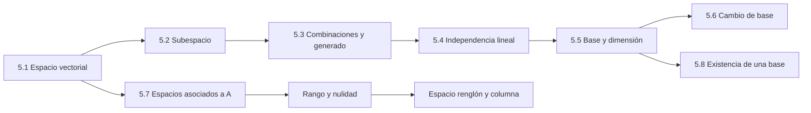

## Notación transversal

Salvo indicación contraria, los escalares pertenecen a $\mathbb{R}$. La misma teoría funciona sobre $\mathbb{C}$ o, más generalmente, sobre un campo $\mathbb{F}$.

- $\mathbb{R}^n$: vectores columna de $n$ componentes reales.
- $P_n$: polinomios reales de grado menor o igual que $n$; $\operatorname{dim} P_n=n+1$.
- $M_{m\times n}$: matrices reales de tamaño $m\times n$.
- $\operatorname{gen}\{v_1,\dots,v_k}$: conjunto de todas las combinaciones lineales de los vectores dados. También se escribe $\operatorname{span}\}{v_1,\dots,v_k}$.
- $[x]_B$: vector columna de coordenadas de $x$ respecto de la base ordenada $B$.

La idea organizadora es pasar de objetos concretos, como vectores de $\mathbb{R}^n$, polinomios, funciones o matrices, a propiedades comunes que después pueden reutilizarse sin repetir una prueba para cada espacio.

## 5.1 Definición y propiedades básicas

> [!note] [Grossman 7ª Ed.]
> Esta sección corresponde a las pp. 296–303. El espacio vectorial abstrae las reglas que ya cumplen $\mathbb{R}^2$ y $\mathbb{R}^3$.

### Definición 5.1.1: espacio vectorial real

Un **espacio vectorial real** es un conjunto no vacío $V$ de objetos llamados vectores, equipado con:

1. una suma $V\times V\to V$, denotada $x+y$;
2. una multiplicación por escalares $\mathbb{R}\times V\to V$, denotada $ax$;

que satisfacen, para $x,y,z\in V$ y $a,b\in\mathbb{R}$, los diez axiomas:

1. **Cerradura aditiva:** $x+y\in V$.
2. **Asociatividad aditiva:** $(x+y)+z=x+(y+z)$.
3. **Vector cero:** existe $0\in V$ tal que $x+0=0+x=x$.
4. **Inverso aditivo:** para cada $x\in V$ existe $-x\in V$ tal que $x+(-x)=0$.
5. **Conmutatividad aditiva:** $x+y=y+x$.
6. **Cerradura escalar:** $ax\in V$.
7. **Distributividad sobre la suma vectorial:** $a(x+y)=ax+ay$.
8. **Distributividad sobre la suma escalar:** $(a+b)x=ax+bx$.
9. **Asociatividad de escalares:** $a(bx)=(ab)x$.
10. **Identidad escalar:** $1x=x$.

Los cinco primeros axiomas hacen de $(V,+)$ un grupo abeliano. Los escalares forman un campo; por eso se puede dividir por un escalar no nulo durante las demostraciones.

### Ejemplos y contraejemplos

| Conjunto y operaciones usuales | ¿Espacio vectorial? | Observación |
|---|---:|---|
| $\mathbb{R}^n$ | Sí | El cero es la columna de ceros y las operaciones son componente a componente. |
| $\{0\}$ | Sí | Es el espacio vectorial trivial; su dimensión es $0$. |
| $P_n$ | Sí | La suma y los múltiplos no aumentan el grado por encima de $n$. |
| $C([a,b])$ | Sí | La suma y el múltiplo de funciones continuas siguen siendo continuos. |
| $M_{m\times n}$ | Sí | El cero es la matriz nula. |
| $\mathbb{C}^n$ sobre $\mathbb{C}$ | Sí | Cambia el campo de escalares, no la estructura formal. |
| $\{(x,y):y=2x+1\}$ | No | No contiene a $(0,0)$ y falla la cerradura aditiva. |
| Matrices invertibles con suma usual | No | La matriz cero no es invertible; por tanto, no hay vector cero en el conjunto. |
| $\{(x,y):y\ge 0\}$ | No | Un múltiplo negativo de un vector no nulo sale del semiplano. |

Una recta o un plano que pasa por el origen sí puede ser un espacio vectorial con las operaciones heredadas; un desplazamiento afín que no pasa por el origen no.

### Teorema 5.1.1: identidades derivadas

Si $V$ es un espacio vectorial, entonces, para todo escalar $a$ y todo vector $x$:

$$
\begin{aligned}
a0&=0,\\
0x&=0,\\
ax=0&\implies a=0 \text{ o } x=0,\\
(-1)x&=-x.
\end{aligned}
$$

**Demostración.**

1. Como $0=0+0$, por distributividad:
 $$a0=a(0+0)=a0+a0.$$
 Sumando $-(a0)$ a ambos lados resulta $a0=0$.
2. Como $0=0+0$, ahora:
 $$0x=(0+0)x=0x+0x.$$
 Al sumar el inverso de $0x$ se obtiene $0x=0$.
3. Si $a=0$, la conclusión ya está dada. Si $a\ne0$, existe $a^{-1}$ y
 $$x=a^{-1}(ax)=a^{-1}0=0.$$
4. Por $1+(-1)=0$ y la parte ii):
 $$0x=(1+(-1))x=x+(-1)x.$$
 Sumando $-x$ a ambos lados se obtiene $(-1)x=-x$.

> [!warning] No confundir estructuras
> La afirmación $ab=0\text{ implica }a=0\text{ o }b=0$ depende de que los escalares formen un campo. Para matrices puede haber divisores de cero: dos matrices no nulas pueden tener producto nulo.

## 5.2 Subespacios vectoriales

> [!note] [Grossman 7ª Ed.]
> Un subespacio hereda del espacio ambiente las mismas operaciones. Grossman usa este criterio para evitar verificar de nuevo los diez axiomas.

### Definición 5.2.1

Sea $V$ un espacio vectorial. Un subconjunto no vacío $H\subseteq V$ es un **subespacio vectorial** de $V$ si, con las operaciones heredadas, es un espacio vectorial.

### Teorema 5.2.1: criterio de subespacio

Un subconjunto no vacío $H$ de $V$ es subespacio si y solo si cumple:

$$
\begin{aligned}
x,y\in H&\implies x+y\in H,\\
x\in H, a\in\mathbb{R}&\implies ax\in H.
\end{aligned}
$$

**Demostración.** Si $H$ es un espacio vectorial, las dos cerraduras son axiomas. Recíprocamente, las leyes asociativa, conmutativa y distributivas se heredan de $V$. Si $h\in H$, entonces $0h=0\in H$ por la cerradura escalar y el teorema 5.1.1. Además, $(-1)h=-h\in H$. Por tanto, $H$ contiene cero e inversos, y satisface todos los axiomas.

**Consecuencia inmediata:** todo subespacio contiene al vector cero. Para refutar que un conjunto sea subespacio basta, a menudo, encontrar que $0\notin H$.

### Ejemplos

- $\{0\}$ y $V$ son siempre subespacios; si coinciden, $V$ es trivial.
- $\{(x,y)\in\mathbb{R}^2:y=mx\}$ es una recta por el origen.
- $\{(x,y,z):ax+by+cz=0\}$ es un plano por el origen.
- $P_m$ es subespacio de $P_n$ cuando $m\le n$.
- $\{A\in M_{m\times n}:a_{11}=0\}$ es subespacio porque la condición se conserva al sumar y multiplicar por escalares.
- El espacio nulo $N_A=\{x\in\mathbb{R}^n:Ax=0\}$ es subespacio de $\mathbb{R}^n$.

### Ejemplo 1: intersección de dos planos

Sean

$$
H_1=\{(x,y,z):2x-y-z=0\},\qquad
H_2=\{(x,y,z):x+2y+3z=0\}.
$$

**Paso 1.** Cada conjunto es el conjunto solución de una ecuación homogénea, por lo que es subespacio.

**Paso 2.** La intersección también se obtiene resolviendo

$$
\begin{bmatrix}2&-1&-1\\1&2&3\end{bmatrix}
\begin{bmatrix}x\\y\\z\end{bmatrix}
=\begin{bmatrix}0\\0\end{bmatrix}.
$$

**Paso 3.** De $2x-y-z=0$ y $x+2y+3z=0$ se obtiene

$$y=-\frac{7}{5}z,\qquad x=-\frac{1}{5}z.$$

Tomando $z=5t$:

$$
(x,y,z)=t(-1,-7,5),\qquad
H_1\cap H_2=\operatorname{gen}\{(-1,-7,5)\}.
$$

La intersección es una recta por el origen y, por el teorema 5.2.2, es subespacio.

### Teorema 5.2.2: intersección

Si $H_1$ y $H_2$ son subespacios de $V$, entonces $H_1\cap H_2$ es un subespacio de $V$.

**Demostración.** La intersección contiene $0$, pues $0$ pertenece a ambos subespacios. Si $x,y\in H_1\cap H_2$, entonces $x+y$ pertenece a $H_1$ y a $H_2$, luego $x+y\in H_1\cap H_2$. Del mismo modo, $ax$ pertenece a ambos para todo escalar $a$. Se aplica el teorema 5.2.1.

> [!warning] Intersección no es unión
> La unión $H_1\cup H_2$ no es, en general, subespacio. Por ejemplo, las rectas $y=2x$ y $y=3x$ contienen $(1,2)$ y $(1,3)$, pero su suma $(2,5)$ no pertenece a ninguna de las dos.

## 5.3 Combinación lineal y espacio generado

> [!note] [Grossman 7ª Ed.]
> En esta sección, pp. 315–330, la combinación lineal es la operación que conecta sistemas de ecuaciones, geometría y subespacios.

### Definiciones

Dados $v_1,\dots,v_k\in V$ y escalares $a_1,\dots,a_k$, una **combinación lineal** es

$$a_1v_1+a_2v_2+\dots+a_kv_k.$$

Los vectores $v_1,\dots,v_k$ **generan $V$** si cada $v\in V$ puede escribirse como una combinación lineal de ellos:

$$V=\operatorname{gen}\{v_1,\dots,v_k\}.$$

El **espacio generado** por $v_1,\dots,v_k$ es el conjunto

$$
\operatorname{gen}\{v_1,\dots,v_k\}
=\{a_1v_1+\dots+a_kv_k:a_i\in\mathbb{R}\}.
$$

No son exactamente la misma frase: *generar a $V$* es una afirmación sobre cubrir todo $V$; *el espacio generado* es el conjunto de combinaciones, que puede ser un subespacio propio.

### Ejemplo 2: combinación lineal en $\mathbb{R}^3$

Sean $u=(1,2,4)$ y $v=(-1,-3,1)$. Para comprobar si $w=(3,7,7)$ está en su espacio generado:

1. Planteamos $w=au+bv$.
2. Probamos $a=2$ y $b=-1$:
 $$2u-v=2(1,2,4)-(-1,-3,1)=(3,7,7).$$
3. Por tanto, $w\in\operatorname{gen}\{u,v\}$ y sus coeficientes respecto de esta expresión son $(2,-1)$.

En general, la pregunta se convierte en el sistema $[u\text{ }v]\begin{bmatrix}a\\b\end{bmatrix}=w$. Es consistente si y solo si $w$ pertenece al generado.

### Ejemplo 3: dos vectores generan un plano por el origen

Sean $v_1=(2,-1,4)$ y $v_2=(4,1,6)$. Un vector de su generado tiene la forma

$$
(x,y,z)=a(2,-1,4)+b(4,1,6),
$$

es decir,

$$x=2a+4b,\qquad y=-a+b,\qquad z=4a+6b.$$

**Paso 1: condición necesaria.** Al combinar las tres ecuaciones:

$$5x-2y-3z=0.$$

**Paso 2: suficiencia.** Si $5x-2y-3z=0$, tomamos

$$b=\frac{x+2y}{6},\qquad a=b-y.$$

Entonces se recuperan $x$ e $y$, y la ecuación del plano recupera $z$. Por tanto,

$$\operatorname{gen}\{(2,-1,4),(4,1,6)\}=\{(x,y,z):5x-2y-3z=0\}.$$

### Ejemplos de generadores en otros espacios

- En $P_n$, los monomios $\{1,x,x^2,\dots,x^n\}$ generan porque $p(x)=a_0+a_1x+\dots+a_nx^n$.
- En $M_{2\times2}$, las matrices elementales
 $$E_{11}=\begin{bmatrix}1&0\\0&0\end{bmatrix},\quad E_{12}=\begin{bmatrix}0&1\\0&0\end{bmatrix},\quad E_{21},\quad E_{22}$$
 generan toda matriz $2\times2$.
- Ningún conjunto finito genera $P$, el espacio de todos los polinomios: si $N$ es el mayor grado de los polinomios dados, $x^{N+1}$ no puede ser combinación lineal de ellos.

### Teorema 5.3.1: el generado es subespacio

Si $v_1,\dots,v_k\in V$, entonces $\operatorname{gen}\{v_1,\dots,v_k\}$ es un subespacio de $V$.

**Demostración.** El vector cero pertenece al generado porque
$$0=0v_1+\dots+0v_k.$$
Si $u=\sum_{i=1}^k a_iv_i$ y $w=\sum_{i=1}^k b_iv_i$, entonces
$$u+w=\sum_{i=1}^k(a_i+b_i)v_i,$$
que sigue siendo una combinación lineal. Para un escalar $c$,
$$cu=\sum_{i=1}^k(ca_i)v_i,$$
por lo que se cumple el criterio de subespacio.

### Propiedad de minimalidad

Si $H$ es un subespacio que contiene a todos los $v_i$, entonces

$$\operatorname{gen}\{v_1,\dots,v_k\}\subseteq H,$$

porque $H$ es cerrado bajo sumas y múltiplos escalares. Por eso el generado es el subespacio más pequeño que contiene a los vectores dados.

### Teorema 5.3.2: agregar generadores

Si $\{v_1,\dots,v_n\}$ genera $V$, entonces

$$\{v_1,\dots,v_n,v_{n+1}\}$$

también genera $V$.

**Demostración.** Para cualquier $v\in V$ existen $a_1,\dots,a_n$ tales que $v=\sum_{i=1}^n a_iv_i$. Se escribe la misma expresión permitiendo coeficiente $0$ para $v_{n+1}$.

## 5.4 Independencia lineal

> [!note] [Grossman 7ª Ed.]
> La independencia mide si un conjunto contiene redundancia. El criterio operativo es resolver un sistema homogéneo cuyas columnas son los vectores.

### Definición 5.4.1

Los vectores $v_1,\dots,v_k$ son **linealmente dependientes (LD)** si existen escalares $c_1,\dots,c_k$, no todos cero, tales que

$$c_1v_1+c_2v_2+\dots+c_kv_k=0.$$

Son **linealmente independientes (LI)** si la única solución de esa ecuación es

$$c_1=c_2=\dots=c_k=0.$$

Si $A=[v_1\text{ }\dots\text{ }v_k]$, la prueba se realiza con $Ac=0$:

- $A$ tiene pivote en cada columna $\implies$ las columnas son LI.
- Alguna columna queda sin pivote $\implies$ existe una solución no trivial y las columnas son LD.

### Teorema 5.4.1: dos vectores

Dos vectores son LD si y solo si uno es múltiplo escalar del otro.

**Demostración.** Si $v_2=cv_1$, entonces $cv_1-v_2=0$ es una relación no trivial, salvo el caso trivial que se expresa igualmente con coeficiente cero del vector apropiado. Recíprocamente, si $c_1v_1+c_2v_2=0$ con algún coeficiente no nulo, se despeja el vector cuyo coeficiente sea no nulo. Por ejemplo, si $c_1\ne0$,
$$v_1=-\frac{c_2}{c_1}v_2.$$

### Ejemplo 4: dependencia e independencia mediante RREF

Para

$$
v_1=\begin{bmatrix}1\\-2\\3\end{bmatrix},\quad
v_2=\begin{bmatrix}2\\-2\\0\end{bmatrix},\quad
v_3=\begin{bmatrix}0\\1\\7\end{bmatrix},
$$

formamos $A=[v_1\text{ }v_2\text{ }v_3]$ y reducimos:

$$\operatorname{rref}(A)=I_3.$$

El sistema $Ac=0$ solo tiene $c=0$; por tanto, los tres vectores son LI. Equivalentemente,

$$\det A=20\ne0.$$

En cambio, si $v_3=(1,1,2)$, $v_1=(1,0,1)$ y $v_2=(0,1,1)$ satisfacen

$$v_1+v_2-v_3=0,$$

por lo que son LD.

### Teorema 5.4.2: demasiados vectores

Un conjunto de $k$ vectores en $\mathbb{R}^m$ es siempre LD si $k>m$.

**Demostración.** La ecuación $c_1v_1+\dots+c_kv_k=0$ es un sistema homogéneo de $m$ ecuaciones con $k$ incógnitas. Como $k>m$, hay al menos una variable libre y existe una solución no trivial.

**Corolario 5.4.1.** Un conjunto LI en $\mathbb{R}^m$ contiene como máximo $m$ vectores.

### Teorema 5.4.3: columnas y sistema homogéneo

Las columnas de una matriz $A\in\mathbb{R}^{m\times k}$ son LD si y solo si $Ac=0$ posee una solución no trivial.

**Demostración.** Al escribir $c=(c_1,\dots,c_k)^T$:

$$Ac=c_1v_1+\dots+c_kv_k.$$

Por tanto, $Ac=0$ con $c\ne0$ es exactamente una relación de dependencia.

### Ejemplo 5: parametrizar el espacio de soluciones

Consideremos

$$
\begin{aligned}
x_1+2x_2-x_3+2x_4&=0,\\
3x_1+7x_2+x_3+4x_4&=0.
\end{aligned}
$$

La forma escalonada reducida de la matriz de coeficientes es

$$\begin{bmatrix}1&0&-9&6\\0&1&4&-2\end{bmatrix}.$$

Tomando $x_3=s$ y $x_4=t$:

$$
x_1=9s-6t,\qquad x_2=-4s+2t,\qquad
x=s\begin{bmatrix}9\\-4\\1\\0\end{bmatrix}+t\begin{bmatrix}-6\\2\\0\\1\end{bmatrix}.
$$

Los dos vectores solución son LI, pues ninguno es múltiplo del otro. Así, el espacio solución es un plano generado por ellos.

### Teorema 5.4.4: caso cuadrado homogéneo

Si $A$ es $n\times n$, sus columnas son LI si y solo si la única solución de $Ax=0$ es $x=0$.

**Demostración.** Es el teorema 5.4.3 cuando el número de filas y columnas coincide.

### Teorema 5.4.5: determinante e independencia

Para $A\in M_{n\times n}$,

$$\det A\ne0\iff \text{las columnas de }A\text{ son LI}.$$

**Demostración.** Por el teorema 5.4.4, las columnas son LI si y solo si $Ax=0$ tiene solo la solución trivial; el teorema de invertibilidad de matrices equivale esto a $\det A\ne0$.

### Teorema 5.4.6: teorema de resumen, punto de vista 6

Para $A\in M_{n\times n}$ son equivalentes:

1. $A$ es invertible.
2. $Ax=0$ solo tiene la solución trivial.
3. $Ax=b$ tiene una solución única para todo $b\in\mathbb{R}^n$.
4. $A$ es equivalente por renglones a $I_n$.
5. $A$ es producto de matrices elementales.
6. La forma escalonada de $A$ tiene $n$ pivotes.
7. $\det A\ne0$.
8. Las columnas y los renglones de $A$ son LI.

La cadena se obtiene combinando eliminación de Gauss, el sistema homogéneo, determinantes y la relación entre $A$ y $A^T$.

### Teorema 5.4.7: LI y generación de $\mathbb{R}^n$

Cualquier conjunto de $n$ vectores LI en $\mathbb{R}^n$ genera $\mathbb{R}^n$.

**Demostración.** Si $v_1,\dots,v_n$ son LI, la matriz $A=[v_1\text{ }\dots\text{ }v_n]$ tiene determinante no nulo. Para cualquier $y\in\mathbb{R}^n$, el sistema $Ac=y$ tiene solución única; por tanto, $y$ es combinación lineal de las columnas.

**Lectura geométrica.** Tres vectores en $\mathbb{R}^3$ son LD si y solo si son coplanares; si los tres son LI, generan todo el espacio.

> [!info] [Enriquecimiento Web / Referencias Externas]
> La presentación de Georgia Tech relaciona explícitamente la independencia con pivotes en cada columna y advierte que una matriz ancha tiene columnas automáticamente dependientes. Véase [Interactive Linear Algebra, Linear Independence](https://textbooks.math.gatech.edu/ila/linear-independence.html).

## 5.5 Bases y dimensión

> [!note] [Grossman 7ª Ed.]
> Una base elimina la redundancia de un conjunto generador: genera todo el espacio y, a la vez, es LI.

### Definición 5.5.1: base

Un conjunto finito $B=\{v_1,\dots,v_n\}$ es una **base** de $V$ si:

1. $B$ es LI;
2. $B$ genera $V$.

La base del espacio trivial es el conjunto vacío. En un espacio no trivial, una base puede cambiar, pero su número de vectores no.

### Bases canónicas y dimensiones conocidas

- En $\mathbb{R}^n$, la base canónica es $E=\{e_1,\dots,e_n\}$, donde $e_i$ tiene un $1$ en la posición $i$ y ceros en las demás. Así, $\operatorname{dim}\mathbb{R}^n=n$.
- En $P_n$, $\{1,x,x^2,\dots,x^n\}$ es base canónica y $\operatorname{dim}P_n=n+1$.
- En $M_{m\times n}$, las matrices $E_{ij}$ con un $1$ en $(i,j)$ y ceros en las otras entradas forman una base. Por tanto, $\operatorname{dim}M_{m\times n}=mn$.
- $P$, el espacio de todos los polinomios, tiene dimensión infinita: ningún conjunto finito genera todos los grados.

### Ejemplo 6: base de un plano en $\mathbb{R}^3$

Sea

$$H=\{(x,y,z):2x-y+3z=0\}.$$

**Paso 1.** Despejamos $y=2x+3z$.

**Paso 2.** Parametrizamos:

$$
\begin{bmatrix}x\\y\\z\end{bmatrix}
=\begin{bmatrix}x\\2x+3z\\z\end{bmatrix}
=x\begin{bmatrix}1\\2\\0\end{bmatrix}+z\begin{bmatrix}0\\3\\1\end{bmatrix}.
$$

**Paso 3.** Los vectores $(1,2,0)$ y $(0,3,1)$ no son múltiplos, luego son LI. Por tanto,

$$B_H=\{(1,2,0),(0,3,1)\},\qquad \operatorname{dim}H=2.$$

### Teorema 5.5.1: unicidad de coordenadas

Si $B=\{v_1,\dots,v_n\}$ es una base de $V$ y $v\in V$, existe un único conjunto de escalares $c_1,\dots,c_n$ tal que

$$v=c_1v_1+\dots+c_nv_n.$$

**Demostración.** La existencia proviene de que $B$ genera. Si también
$$v=d_1v_1+\dots+d_nv_n,$$
al restar:
$$\sum_{i=1}^n(c_i-d_i)v_i=0.$$
La independencia de $B$ fuerza $c_i-d_i=0$ para todo $i$; por tanto, $c_i=d_i$.

Los coeficientes forman el vector coordenado $[v]_B=(c_1,\dots,c_n)^T$.

### Teorema 5.5.2: invariancia del número de vectores

Si $U=\{u_1,\dots,u_m\}$ y $B=\{v_1,\dots,v_n\}$ son bases del mismo espacio, entonces $m=n$.

**Demostración.** Supongamos $m>n$. Como $B$ genera, cada $u_i$ se expresa como combinación de los $v_j$. Al buscar una relación $\sum_{i=1}^m c_iu_i=0$, después de agrupar por los $v_j$ se obtiene un sistema homogéneo de $n$ ecuaciones con $m>n$ incógnitas. Existe una solución no trivial, lo que contradice que los $u_i$ sean LI. Así, $m\le n$. Intercambiando las bases se obtiene $n\le m$ y, por tanto, $m=n$.

### Definición 5.5.2: dimensión

Si $V$ tiene una base finita, su **dimensión** $\operatorname{dim}V$ es el número de vectores de cualquier base. Si no tiene base finita, es de dimensión infinita. En particular, $\operatorname{dim}\{0\}=0$.

### Teorema 5.5.3: límite para conjuntos LI

Si $\operatorname{dim}V=n$ y $u_1,\dots,u_m$ son LI en $V$, entonces $m\le n$.

**Demostración.** Si $m>n$, al escribir cada $u_i$ en una base de $n$ vectores se obtiene un sistema homogéneo de $n$ ecuaciones con $m$ incógnitas y una relación no trivial entre los $u_i$, contradicción.

### Teorema 5.5.4: dimensión de un subespacio

Si $H$ es subespacio de un espacio $V$ de dimensión finita, entonces $H$ tiene dimensión finita y

$$\operatorname{dim}H\le\operatorname{dim}V.$$

**Demostración.** Un conjunto LI en $H$ también es LI en $V$, por lo que tiene a lo más $\operatorname{dim}V$ elementos. Partiendo de un vector no nulo de $H$, se agregan vectores de $H$ que no estén en el generado anterior. El proceso termina por ese límite y produce una base de $H$.

**Consecuencia en $\mathbb{R}^3$.** Los subespacios propios no triviales son exactamente rectas por el origen (dimensión $1$) y planos por el origen (dimensión $2$).

### Teorema 5.5.5: LI en la dimensión correcta

Todo conjunto de $n$ vectores LI en un espacio $V$ de dimensión $n$ es una base de $V$.

**Demostración.** Si $v_1,\dots,v_n$ no generaran $V$, existiría $u\in V$ fuera de su generado. Entonces $\{v_1,\dots,v_n,u\}$ sería LI: una relación con coeficiente no nulo de $u$ permitiría expresar $u$ mediante los $v_i$, y con coeficiente nulo se contradice la independencia original. Esto daría $n+1$ vectores LI en un espacio de dimensión $n$, contradiciendo el teorema 5.5.4. Luego generan y son una base.

## 5.6 Cambio de bases

> [!note] [Grossman 7ª Ed.]
> Una base es un sistema de coordenadas. El mismo vector físico o algebraico tiene coordenadas diferentes cuando cambia la base ordenada.

Sean $B_1=\{u_1,\dots,u_n\}$ y $B_2=\{v_1,\dots,v_n\}$ bases de $V$. Si

$$x=b_1u_1+\dots+b_nu_n=c_1v_1+\dots+c_nv_n,$$

se define

$$[x]_{B_1}=\begin{bmatrix}b_1\\\vdots\\b_n\end{bmatrix},\qquad
[x]_{B_2}=\begin{bmatrix}c_1\\\vdots\\c_n\end{bmatrix}.$$

### Matriz de transición

Se expresa cada vector de $B_1$ en la base $B_2$:

$$u_j=a_{1j}v_1+\dots+a_{nj}v_n.$$

La matriz de transición de $B_1$ a $B_2$ es

$$
A_{B_1\to B_2}=\begin{bmatrix}
a_{11}&\dots&a_{1n}\\
\vdots&&\vdots\\
a_{n1}&\dots&a_{nn}
\end{bmatrix},
$$

cuyas columnas son $[u_j]_{B_2}$.

### Ejemplo 7: transición desde la base canónica

En $\mathbb{R}^2$, sea

$$B_1=E=\{(1,0),(0,1)\},\qquad
B_2=\{v_1=(1,3),v_2=(-1,2)\}.$$

**Paso 1.** La matriz cuyas columnas son los vectores de $B_2$ en coordenadas canónicas es

$$C=\begin{bmatrix}1&-1\\3&2\end{bmatrix},\qquad \det C=5\ne0.$$

Por tanto, $B_2$ es una base.

**Paso 2.** Como $C$ lleva coordenadas de $B_2$ a la base canónica,

$$A_{B_1\to B_2}=C^{-1}=\frac15\begin{bmatrix}2&1\\-3&1\end{bmatrix}.$$

**Paso 3.** Para $x=(3,-4)$:

$$
[x]_{B_2}=A_{B_1\to B_2}[x]_{B_1}
=\frac15\begin{bmatrix}2&1\\-3&1\end{bmatrix}\begin{bmatrix}3\\-4\end{bmatrix}
=\begin{bmatrix}2/5\\-13/5\end{bmatrix}.
$$

**Paso 4. Verificación.**

$$
\frac25(1,3)-\frac{13}{5}(-1,2)=(3,-4).
$$

### Teorema 5.6.1: fórmula de cambio

Si $A$ es la matriz de transición de $B_1$ a $B_2$, entonces, para todo $x\in V$,

$$[x]_{B_2}=A[x]_{B_1}.$$

**Demostración.** Sustituimos $u_j=\sum_i a_{ij}v_i$ en $x=\sum_j b_ju_j$:

$$
x=\sum_j b_j\sum_i a_{ij}v_i
=\sum_i\biggl(\sum_j a_{ij}b_j\biggr)v_i.
$$

Los coeficientes del último desarrollo son las componentes de $A[x]_{B_1}$. Por la unicidad de coordenadas, ese vector es $[x]_{B_2}$.

### Teorema 5.6.2: transición inversa

Si $A$ es la matriz de transición de $B_1$ a $B_2$, entonces $A^{-1}$ es la matriz de transición de $B_2$ a $B_1$.

**Demostración.** Si $C$ es la transición inversa, entonces
$$[x]_{B_1}=C[x]_{B_2}=CA[x]_{B_1}.$$
Como esto vale para todo vector coordenado, $CA=I$; análogamente $AC=I$. Por tanto, $C=A^{-1}$.

Si $E$ es la base canónica y $C_{B_2\to E}$ tiene como columnas los vectores de $B_2$ en coordenadas canónicas, entonces

$$A_{B_1\to B_2}=C_{B_2\to E}^{-1}C_{B_1\to E}.$$

### Teorema 5.6.3: independencia en coordenadas

Sea $B_1$ una base de $V$ y sean $x_1,\dots,x_n\in V$. Si $A$ es la matriz cuyas columnas son $[x_1]_{B_1},\dots,[x_n]_{B_1}$, entonces

$$x_1,\dots,x_n\text{ son LI}\iff \det A\ne0.$$

**Demostración.** Una relación $\sum_j c_jx_j=0$ equivale, por unicidad de coordenadas, a $Ac=0$ en $\mathbb{R}^n$. La independencia equivale a que el sistema homogéneo tenga solo la solución trivial y, por el teorema 5.4.5, a $\det A\ne0$.

> [!info] [Enriquecimiento Web / Referencias Externas]
> Georgia Tech presenta las coordenadas de una base como instrucciones únicas para reconstruir un vector y recomienda resolver $[v_1\text{ }\dots\text{ }v_m\text{ }x]$ para hallar $[x]_B$. Véase [Bases as Coordinate Systems](https://textbooks.math.gatech.edu/ila/bases-as-coord-systems.html).

## 5.7 Rango, nulidad, espacio renglón y espacio columna

> [!note] [Grossman 7ª Ed.]
> Sea $A\in\mathbb{R}^{m\times n}$. Esta sección conecta la reducción por renglones con los subespacios que codifican la imagen y las soluciones homogéneas.

### Definiciones

**Espacio nulo (kernel):**

$$N_A=\{x\in\mathbb{R}^n:Ax=0\}.$$

**Nulidad:** $n(A)=\operatorname{dim}N_A$.

**Imagen:**

$$\operatorname{im}A=\{y\in\mathbb{R}^m:\exists x\in\mathbb{R}^n,\ y=Ax\}.$$

**Rango:** $r(A)=\operatorname{dim}(\operatorname{im}A)$.

**Espacio columna y espacio renglón:** si $c_1,\dots,c_n$ son columnas y $r_1,\dots,r_m$ son renglones,

$$
C_A=\operatorname{gen}\{c_1,\dots,c_n\}\subseteq\mathbb{R}^m,\qquad
R_A=\operatorname{gen}\{r_1,\dots,r_m\}\subseteq\mathbb{R}^n.
$$

### Teorema 5.7.1: invertibilidad y nulidad

Si $A$ es cuadrada, $A$ es invertible si y solo si $n(A)=0$.

**Demostración.** $n(A)=0$ significa $N_A=\{0\}$, es decir, $Ax=0$ tiene solo la solución trivial. El teorema 5.4.6 identifica esa condición con la invertibilidad.

### Teorema 5.7.2: la imagen es subespacio

Para cualquier $A\in\mathbb{R}^{m\times n}$, $\operatorname{im}A$ es un subespacio de $\mathbb{R}^m$.

**Demostración.** Si $y_1=Ax_1$ y $y_2=Ax_2$, entonces
$$y_1+y_2=A(x_1+x_2),\qquad ay_1=A(ax_1).$$
La imagen es no vacía porque $A0=0$ y cumple el criterio 5.2.1.

### Teorema 5.7.3: imagen y columnas

$$C_A=\operatorname{im}A.$$

**Demostración.** Si $y\in\operatorname{im}A$, entonces $y=Ax$ y el producto matriz-vector es una combinación lineal de las columnas de $A$; así $y\in C_A$. Recíprocamente, toda combinación lineal $\sum_j x_jc_j$ es $Ax$ con $x=(x_1,\dots,x_n)^T$; por tanto pertenece a la imagen.

### Teorema 5.7.4: igualdad de dimensiones

Para toda matriz $A$:

$$\operatorname{dim}R_A=\operatorname{dim}C_A=\operatorname{dim}(\operatorname{im}A)=r(A).$$

**Demostración.** Sea $s_1,\dots,s_k$ una base de $R_A$. Cada renglón $r_i$ se escribe como combinación de los $s_\ell$. Al fijar una columna $j$ y agrupar sus componentes, se obtiene que cada columna de $A$ es combinación de $k$ vectores; por ello $\operatorname{dim}C_A\le k=\operatorname{dim}R_A$. Aplicando la misma desigualdad a $A^T$ se obtiene la desigualdad inversa. Por el teorema 5.7.3, $C_A=\operatorname{im}A$.

### Teorema 5.7.5: invariancia por operaciones de renglón

Si $A$ y $B$ son equivalentes por renglones, entonces

$$R_A=R_B,\qquad r(A)=r(B),\qquad N_A=N_B,\qquad n(A)=n(B).$$

**Demostración.** Un intercambio solo reordena los renglones. Multiplicar un renglón por un escalar no nulo conserva el generado porque se puede deshacer multiplicando por el inverso. Reemplazar $r_j$ por $r_j+cr_i$ conserva el generado porque la operación inversa es $r_j=(r_j+cr_i)-cr_i$. Además, las operaciones elementales no cambian el conjunto solución de un sistema homogéneo.

### Teorema 5.7.6: rango y pivotes

El rango de $A$ es el número de pivotes de su forma escalonada por renglones.

**Demostración.** Por el teorema 5.7.5, el espacio renglón de $A$ es el de su forma escalonada. Sus renglones no nulos son LI y hay exactamente un renglón no nulo por pivote.

### Teorema 5.7.7: rango-nulidad

Si $A$ tiene $n$ columnas, entonces

$$r(A)+n(A)=n.$$

**Demostración.** Sea $r=r(A)$. La RREF de $A$ tiene $r$ columnas pivote y $n-r$ columnas libres. Al resolver $Ax=0$, cada variable libre produce un vector generador del espacio nulo; esos vectores son LI y generan todas las soluciones. Por tanto, $n(A)=n-r$ y $r(A)+n(A)=n$.

### Ejemplo 8: todos los espacios asociados a una matriz

Sea

$$A=\begin{bmatrix}1&2&-1\\2&4&-2\\0&1&1\end{bmatrix}.$$

**Paso 1: reducción.**

$$\operatorname{rref}(A)=\begin{bmatrix}1&0&-3\\0&1&1\\0&0&0\end{bmatrix}.$$

Hay dos pivotes, luego $r(A)=2$.

**Paso 2: espacio nulo y nulidad.** De $x_1-3x_3=0$ y $x_2+x_3=0$:

$$
x=t(3,-1,1),\qquad N_A=\operatorname{gen}\{(3,-1,1)\},\qquad n(A)=1.
$$

Se verifica $2+1=3$, el número de columnas.

**Paso 3: espacio renglón.** Una base se obtiene con los renglones no nulos de la RREF:

$$R_A=\operatorname{gen}\{(1,0,-3),(0,1,1)\}.$$

**Paso 4: espacio columna e imagen.** Las columnas pivote son las columnas 1 y 2 de la matriz **original**, no las de la RREF:

$$
C_A=\operatorname{im}A=\operatorname{gen}\{\begin{bmatrix}1\\2\\0\end{bmatrix},\begin{bmatrix}2\\4\\1\end{bmatrix}\}.
$$

Por ejemplo, para $y=(5,10,2)^T$:

$$y=1\begin{bmatrix}1\\2\\0\end{bmatrix}+2\begin{bmatrix}2\\4\\1\end{bmatrix},\qquad [y]_{B_{C_A}}=\begin{bmatrix}1\\2\end{bmatrix}.$$

**Paso 5: ortogonalidad algebraica.** Cada renglón de $A$ es ortogonal a cada vector de $N_A$ porque $Ax=0$. Por ejemplo,

$$
(1,0,-3)\cdot(3,-1,1)=0,\qquad (0,1,1)\cdot(3,-1,1)=0.
$$

### Teorema 5.7.8: rango máximo e invertibilidad

Para $A\in M_{n\times n}$,

$$A\text{ es invertible}\iff r(A)=n.$$

**Demostración.** Por rango-nulidad, $r(A)=n-n(A)$. Entonces $r(A)=n$ si y solo si $n(A)=0$; se aplica el teorema 5.7.1.

### Teorema 5.7.9: criterio de consistencia

El sistema $Ax=b$ tiene al menos una solución si y solo si $b\in C_A$. Equivalentemente,

$$Ax=b\text{ es consistente}\iff r(A)=r([A\text{ }b]),$$

donde $[A\text{ }b]$ es la matriz aumentada.

**Demostración.** Si $c_1,\dots,c_n$ son las columnas de $A$, entonces $Ax=b$ equivale a $x_1c_1+\dots+x_nc_n=b$. Esto ocurre exactamente cuando $b$ está en el espacio columna. Si $b$ está en ese espacio, no aumenta el rango; si no, la columna adicional aumenta el rango en uno.

### Teorema 5.7.10: teorema de resumen, punto de vista 7

Para una matriz cuadrada $A\in M_{n\times n}$ son equivalentes:

1. $A$ es invertible.
2. $Ax=0$ solo tiene la solución trivial.
3. $Ax=b$ tiene solución única para todo $b\in\mathbb{R}^n$.
4. $A$ es equivalente por renglones a $I_n$.
5. $A$ es producto de matrices elementales.
6. La forma escalonada de $A$ tiene $n$ pivotes.
7. Las columnas y renglones de $A$ son LI.
8. $\det A\ne0$.
9. $n(A)=0$.
10. $r(A)=n$.

Si ninguna de estas condiciones se cumple, para un $b$ dado el sistema $Ax=b$ no tiene solución o tiene infinitas soluciones. En el caso singular, si es consistente, tiene infinitas soluciones.

> [!info] [Enriquecimiento Web / Referencias Externas]
> El texto abierto de Georgia Tech formula el mismo teorema como la suma de dimensiones del espacio columna y del espacio nulo, y explica que pivotes y variables libres son los dos conteos complementarios. Véase [The Rank Theorem](https://textbooks.math.gatech.edu/ila/rank-thm.html).

## 5.8 Fundamentos: existencia de una base (opcional)

> [!note] [Grossman 7ª Ed.]
> Grossman presenta esta sección como opcional porque usa teoría de conjuntos y el lema de Zorn. La conclusión es que incluso un espacio vectorial abstracto posee una base, aunque esta no tenga por qué ser finita.

### Orden parcial y cadenas

Una relación $\preceq$ en un conjunto $S$ es un **orden parcial** si es:

1. reflexiva: $x\preceq x$;
2. antisimétrica: $x\preceq y$ y $y\preceq x$ implican $x=y$;
3. transitiva: $x\preceq y$ y $y\preceq z$ implican $x\preceq z$.

Una **cadena** es un subconjunto cuyos elementos son comparables por el orden. Una **cota superior** de una colección $C$ es un elemento $u$ tal que $c\preceq u$ para todo $c\in C$. Un elemento es **maximal** si no existe otro estrictamente mayor que él.

En la colección de subconjuntos de $V$, el orden natural es la inclusión $\subseteq$.

### Combinaciones lineales de un conjunto infinito

Si $C$ es un conjunto arbitrario de vectores, una combinación lineal siempre usa solo un número finito de coeficientes no nulos:

$$x=\sum_{v\in C}a_vv,\qquad \text{con solo finitos }a_v\ne0.$$

Esto evita confundir una combinación lineal algebraica con una serie infinita. El conjunto de todas esas combinaciones se denota $L(C)$.

### Teorema 5.8.1: base como conjunto LI maximal

Sea $B$ un subconjunto LI de $V$. Entonces $B$ es una base si y solo si es **maximal** entre los conjuntos LI; es decir, si $B\subsetneq D$, entonces $D$ es LD.

**Demostración.**

- Si $B$ es base y se agrega $x\notin B$, entonces $x$ es combinación lineal de los vectores de $B$. Si todos los coeficientes fueran cero, $x=0$ ya estaría en el generado; en cualquier caso, se obtiene una relación no trivial entre $B\cup\{x\}$, que es LD.
- Si $B$ es LI maximal, tome $x\in V\setminus B$. El conjunto $B\cup\{x\}$ es LD, así que
 $$\sum_{v\in B}a_vv+bx=0.$$
 La independencia de $B$ obliga a $b\ne0$; despejando,
 $$x=-b^{-1}\sum_{v\in B}a_vv.$$
 Todo vector fuera de $B$ está en su generado. Por tanto, $B$ genera $V$ y es una base.

### Lema de Zorn

Si un conjunto parcialmente ordenado no vacío tiene una cota superior para cada cadena no vacía, entonces posee un elemento maximal. El lema de Zorn es equivalente al axioma de elección en la teoría usual de conjuntos.

### Teorema 5.8.2: todo espacio vectorial tiene una base

Todo espacio vectorial $V$ tiene una base.

**Demostración.** Consideremos

$$\mathcal{S}=\{B\subseteq V:B\text{ es LI}\},$$

ordenada por inclusión.

1. $\mathcal{S}$ no es vacía: el conjunto vacío es LI.
2. Sea $\mathcal{T}$ una cadena en $\mathcal{S}$ y defina $M=\cup_{B\in\mathcal{T}}B$.
3. $M$ es una cota superior de la cadena. Para probar que $M$ es LI, tome una relación finita $\sum_{i=1}^k a_iv_i=0$ con $v_i\in M$. Cada $v_i$ pertenece a algún miembro de la cadena; como solo hay finitos $v_i$, uno de esos miembros contiene a todos. Ese miembro es LI, de modo que todos los $a_i=0$.
4. Por el lema de Zorn, $\mathcal{S}$ tiene un elemento maximal $B$.
5. Por el teorema 5.8.1, ese conjunto LI maximal genera $V$ y, por tanto, es una base.

> [!tip] Alcance práctico
> En $\mathbb{R}^n$, $P_n$ y espacios matriciales finitos se encuentran bases mediante RREF. El lema de Zorn es necesario para la afirmación abstracta general, especialmente en espacios de dimensión infinita.

## Verificación computacional reproducible

> [!important] Exacto primero, numérico después
> SymPy verifica RREF, rango, espacio nulo, columnas pivote y coordenadas con aritmética exacta. NumPy contrasta el rango y las coordenadas en coma flotante; `matrix_rank` usa SVD y una tolerancia numérica, por lo que no reemplaza la verificación simbólica en ejemplos exactos.

El siguiente bloque usa la matriz del ejemplo 8. También verifica que la base del espacio columna usa columnas de la matriz original y que $y=(5,10,2)^T$ tiene coordenadas $(1,2)^T$ en esa base.

```python
import numpy as np
import sympy as sp

A = sp.Matrix([
 [1, 2, -1],
 [2, 4, -2],
 [0, 1, 1],
])
y = sp.Matrix([5, 10, 2])

rref_A, pivots = A.rref()
column_basis = A.columnspace() # columnas pivote de la matriz original
column_matrix = sp.Matrix.hstack(*column_basis)
null_basis = A.nullspace()
row_basis = [
 rref_A.row(i)
 for i in range(rref_A.rows)
 if any(value != 0 for value in rref_A.row(i))
]

coordinate_tuple = next(iter(sp.linsolve((column_matrix, y))))
coordinates = sp.Matrix(coordinate_tuple)

assert A.rank() == 2
assert len(null_basis) == 1
assert A * null_basis[0] == sp.zeros(A.rows, 1)
assert column_matrix * coordinates == y
assert column_matrix.rank() == len(column_basis)

print("RREF(A) =", rref_A)
print("pivotes =", pivots)
print("rango exacto =", A.rank())
print("base de C_A =", column_basis)
print("base de R_A =", row_basis)
print("base de N_A =", null_basis)
print("nulidad exacta =", len(null_basis))
print("coordenadas exactas de y =", coordinates)

A_np = np.array(A.tolist(), dtype=float)
B_np = np.array(column_matrix.tolist(), dtype=float)
y_np = np.array([float(value) for value in y], dtype=float)
coordinates_np, *_ = np.linalg.lstsq(B_np, y_np, rcond=None)

assert np.linalg.matrix_rank(A_np) == 2
assert np.allclose(B_np @ coordinates_np, y_np)
print("rango NumPy =", np.linalg.matrix_rank(A_np))
print("coordenadas NumPy =", coordinates_np)
```

La API usada está documentada en [SymPy: matrices y álgebra lineal](https://docs.sympy.org/latest/modules/matrices/matrices.html) y [NumPy: `numpy.linalg.matrix_rank`](https://numpy.org/doc/stable/reference/generated/numpy.linalg.matrix_rank.html).

## Figura USS

El script `02_Espacios_Vectoriales/grossman_capitulo_5_figura.py` genera una visualización de una base de $\mathbb{R}^2$, sus coordenadas y la combinación lineal asociada. Usa backend `Agg`, fondo blanco y la paleta institucional USS: `USSBlue = #00205B`

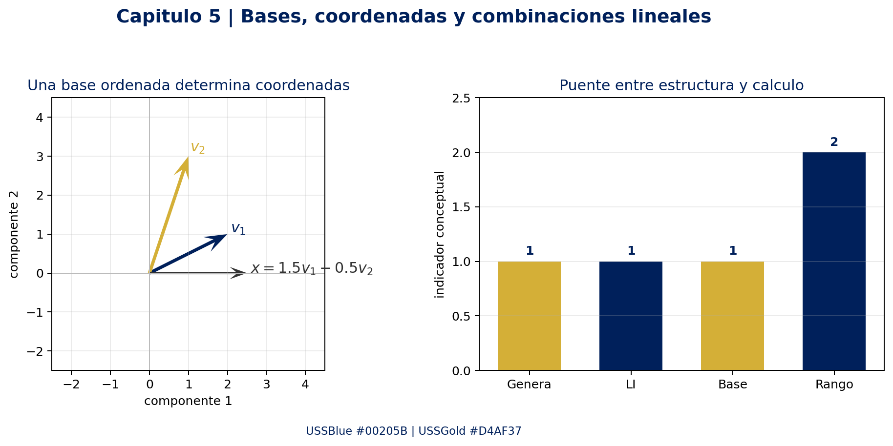

## Auditoría de cobertura de teoremas

| Sección | Resultado cubierto | Idea de uso |
|---|---|---|
| 5.1 | Teorema 5.1.1 | Identidades $a0=0$, $0x=0$, producto nulo y opuesto. |
| 5.2 | Teoremas 5.2.1–5.2.2 | Criterio de subespacio e intersección. |
| 5.3 | Teoremas 5.3.1–5.3.2 | El generado es subespacio y agregar generadores conserva el generado. |
| 5.4 | Teoremas 5.4.1–5.4.7 | Dependencia, sistemas homogéneos, determinantes y generación de $\mathbb{R}^n$. |
| 5.5 | Teoremas 5.5.1–5.5.5 | Coordenadas únicas, invariancia de dimensión, cotas y criterio de base. |
| 5.6 | Teoremas 5.6.1–5.6.3 | Transición, transición inversa e independencia mediante coordenadas. |
| 5.7 | Teoremas 5.7.1–5.7.10 | Nulidad, imagen, rango, pivotes, rango-nulidad, consistencia y teorema de resumen. |
| 5.8 | Teoremas 5.8.1–5.8.2 | Base como LI maximal y existencia mediante Zorn. |

## [Enriquecimiento Web / Referencias Externas]

1. **Georgia Institute of Technology — Dan Margalit y Joseph Rabinoff.** *Interactive Linear Algebra* (2019). Se consultaron las secciones sobre [vectores y combinaciones](https://textbooks.math.gatech.edu/ila/vectors.html), [span](https://textbooks.math.gatech.edu/ila/spans.html), [subespacios](https://textbooks.math.gatech.edu/ila/subspaces.html), [independencia](https://textbooks.math.gatech.edu/ila/linear-independence.html), [base y dimensión](https://textbooks.math.gatech.edu/ila/dimension.html), [coordenadas](https://textbooks.math.gatech.edu/ila/bases-as-coord-systems.html) y [teorema del rango](https://textbooks.math.gatech.edu/ila/rank-thm.html). Aportan una lectura geométrica, el criterio de pivotes, la advertencia sobre columnas originales y la interpretación de variables libres.
2. **Encyclopedia of Mathematics — European Mathematical Society / Springer.** [Vector space](https://encyclopediaofmath.org/wiki/Vector_space). Aporta la formulación sobre campos, combinaciones lineales con soporte finito, subespacios, bases maximales y dimensión cardinal; también conecta los espacios vectoriales con módulos sobre un campo.
3. **SymPy Developers.** [Matrices (linear algebra), SymPy 1.14.0](https://docs.sympy.org/latest/modules/matrices/matrices.html). Referencia oficial para `rref`, `rank`, `columnspace`, `nullspace` y resolución exacta de sistemas.
4. **NumPy Developers.** [`numpy.linalg.matrix_rank`, NumPy 2.5 Manual](https://numpy.org/doc/stable/reference/generated/numpy.linalg.matrix_rank.html). Referencia oficial para el rango numérico mediante valores singulares y tolerancia de redondeo.

Estas fuentes no sustituyen la notación ni el orden de Grossman; complementan la intuición, la precisión terminológica y la reproducibilidad computacional.

---

**Cierre:** la cadena conceptual del capítulo es

$$
\text{axiomas}\to\text{subespacios}\to\text{generadores}\to\text{independencia}\to\text{bases}\to\text{coordenadas}\to\text{rango y nulidad}.
$$


---

# Capítulo 6: Espacios con producto interno


> [!abstract] Leyenda de trazabilidad
> **[Grossman 7ª Ed.]**: definiciones, resultados, demostraciones centrales y ejemplos sintetizados desde el capítulo 6 del PDF de la 7ª edición, pp. 418–477. La redacción y las comprobaciones son propias; no se reproduce literalmente el texto fuente.
>
> **[Enriquecimiento Web / Referencias Externas]**: precisiones sobre implementación numérica, estabilidad computacional y matrices complejas unitarias/normales. Estas aportaciones están separadas de la exposición de Grossman.

## Fuente y alcance

La fuente primaria es el PDF de Álgebra Lineal (7ª edición) de Stanley I. Grossman. Se realizó una extracción directa de las páginas relevantes del PDF y se contrastó con el texto auxiliar local.

El índice real del capítulo es el siguiente:

| Sección | Título en el PDF | Páginas impresas | Idea organizadora |
|---|---|---:|---|
| 6.1 | Bases ortonormales y proyecciones en $\mathbb{R}^n$ | 418–442 | Medir, ortogonalizar, proyectar y descomponer vectores. |
| 6.2 | Aproximaciones por mínimos cuadrados | 443–463 | Convertir una aproximación en una proyección sobre $\operatorname{Col}(A)$. |
| 6.3 | Espacios con producto interno y proyecciones | 464–477 | Extender la teoría desde $\mathbb{R}^n$ a $\mathbb{C}^n$, funciones y polinomios. |

> [!warning] Límite de la numeración del PDF
> El capítulo no tiene una sección autónoma 6.4. Grossman sí define **matrices ortogonales** dentro de 6.1 y menciona matrices unitarias en ejercicios de 6.3, pero **matrices unitarias y matrices normales no constituyen secciones autónomas de este PDF**. Por eso, su tratamiento específico aparece más adelante, marcado como **[Enriquecimiento Web / Referencias Externas]**, y no se atribuye a una sección 6.4 inexistente.

## Mapa conceptual

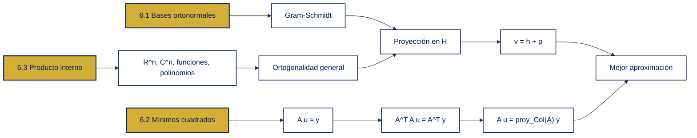

## Idea central

El producto interno permite responder tres preguntas que la combinación lineal por sí sola no resuelve:

1. ¿Qué significa que dos vectores sean perpendiculares?
2. ¿Cómo se separa un vector en una parte dentro de un subespacio y otra perpendicular a él?
3. ¿Cómo se elige, entre infinitas posibilidades, la aproximación más cercana a un dato?

La cadena esencial es

$$
\text{producto interno}
\longrightarrow
\text{norma y ortogonalidad}
\longrightarrow
\text{base ortonormal}
\longrightarrow
\text{proyección}
\longrightarrow
\text{mínimos cuadrados}.
$$

Salvo indicación contraria, las secciones 6.1 y 6.2 trabajan sobre $\mathbb{R}$. En 6.3 se adopta la convención de Grossman para el caso complejo: el producto interno es lineal en el primer argumento y conjugado-lineal en el segundo.

## Notación mínima

| Objeto | Significado |
|---|---|
| $\langle u,v\rangle$ | Producto interno o producto punto. |
| $\lVert v\rVert=\sqrt{\langle v,v\rangle}$ | Norma o longitud de $v$. |
| $u\perp v$ | $\langle u,v\rangle=0$. |
| $\operatorname{span}\{u_1,\ldots,u_k\}$ | Subespacio generado por los vectores. |
| $H^\perp$ | Complemento ortogonal de $H$. |
| $\operatorname{proy}_H(v)$ | Proyección ortogonal de $v$ sobre $H$. |
| $A^\mathsf{T}$ | Transpuesta real de $A$; en el caso complejo se usa $A^*$, la transpuesta conjugada. |

---

## 6.1 Bases ortonormales y proyecciones en $\mathbb{R}^n$

### Producto punto, norma y ortogonalidad

Para $u=(u_1,\ldots,u_n)$ y $v=(v_1,\ldots,v_n)$ en $\mathbb{R}^n$,

$$
\langle u,v\rangle=u^\mathsf{T}v=\sum_{j=1}^{n}u_jv_j.
$$

La norma euclídea es

$$
\lVert v\rVert=\sqrt{\langle v,v\rangle}
 =\sqrt{v_1^2+\cdots+v_n^2}.
$$

Un conjunto $\{u_1,\ldots,u_k\}$ es:

- **ortogonal** si $\langle u_i,u_j\rangle=0$ cuando $i\ne j$;
- **ortonormal** si es ortogonal y, además, $\lVert u_i\rVert=1$ para cada $i$.

La condición ortonormal puede escribirse como

$$
\langle u_i,u_j\rangle=
\begin{cases}
1,&i=j,\\
0,&i\ne j.
\end{cases}
$$

Dos desigualdades que se usarán repetidamente son

$$
|\langle u,v\rangle|\le \lVert u\rVert\,\lVert v\rVert
\qquad\text{(Cauchy–Schwarz)},
$$

$$
\lVert u+v\rVert\le \lVert u\rVert+\lVert v\rVert
\qquad\text{(desigualdad triangular)}.
$$

### Teorema: un conjunto ortogonal no nulo es linealmente independiente

**Enunciado.** Si $\{v_1,\ldots,v_k\}$ es ortogonal y cada $v_i\ne 0$, entonces el conjunto es linealmente independiente.

**Demostración.** Supóngase que

$$
c_1v_1+\cdots+c_kv_k=0.
$$

Fijemos un índice $j$ y tomemos producto interno con $v_j$:

$$
0=\left\langle\sum_{i=1}^{k}c_iv_i,v_j\right\rangle
 =\sum_{i=1}^{k}c_i\langle v_i,v_j\rangle
 =c_j\langle v_j,v_j\rangle
 =c_j\lVert v_j\rVert^2.
$$

Como $v_j\ne0$, se tiene $\lVert v_j\rVert^2>0$ y, por tanto, $c_j=0$. El argumento vale para todo $j$, así que todos los coeficientes son cero.

> [!important] Consecuencia práctica
> La ortogonalidad reemplaza una eliminación simultánea por varias pruebas de un solo coeficiente: basta multiplicar por el vector adecuado.

### Proceso de ortonormalización de Gram–Schmidt

Sea $\{v_1,\ldots,v_m\}$ un conjunto linealmente independiente. Se construyen vectores ortogonales $w_i$ y luego se normalizan:

$$
w_1=v_1,
\qquad
u_1=\frac{w_1}{\lVert w_1\rVert}.
$$

Para $k=2,\ldots,m$,

$$
w_k=v_k-\sum_{j=1}^{k-1}\langle v_k,u_j\rangle u_j,
\qquad
u_k=\frac{w_k}{\lVert w_k\rVert}.
$$

El conjunto $\{u_1,\ldots,u_m\}$ es ortonormal y genera el mismo subespacio que $\{v_1,\ldots,v_m\}$.

#### Demostración de la ortogonalidad construida

Para $i<k$,

$$
\begin{aligned}
\langle w_k,u_i\rangle
&=\left\langle v_k-\sum_{j=1}^{k-1}\langle v_k,u_j\rangle u_j,u_i\right\rangle\\
&=\langle v_k,u_i\rangle-
\sum_{j=1}^{k-1}\langle v_k,u_j\rangle\langle u_j,u_i\rangle\\
&=\langle v_k,u_i\rangle-\langle v_k,u_i\rangle=0.
\end{aligned}
$$

El vector $w_k$ no puede ser cero: si lo fuera, $v_k$ sería combinación lineal de $u_1,\ldots,u_{k-1}$ y, por inducción, de $v_1,\ldots,v_{k-1}$, contradiciendo la independencia lineal original. Por eso la división por $\lVert w_k\rVert$ está permitida.

#### Ejemplo 1: Gram–Schmidt en $\mathbb{R}^3$

Ortonormalicemos

$$
v_1=(1,1,0),\qquad v_2=(0,1,1),\qquad v_3=(1,0,1).
$$

**Paso 1.**

$$
w_1=v_1,
\qquad
\lVert w_1\rVert=\sqrt2,
\qquad
u_1=\frac{1}{\sqrt2}(1,1,0).
$$

**Paso 2.** Como $\langle v_2,u_1\rangle=1/\sqrt2$,

$$
w_2=v_2-\frac{1}{\sqrt2}u_1
 =\left(-\frac12,\frac12,1\right)
 =\frac12(-1,1,2).
$$

Puesto que $\lVert w_2\rVert=\sqrt6/2$,

$$
u_2=\frac{1}{\sqrt6}(-1,1,2).
$$

**Paso 3.** Los coeficientes de las proyecciones de $v_3$ son

$$
\langle v_3,u_1\rangle=\frac{1}{\sqrt2},
\qquad
\langle v_3,u_2\rangle=\frac{1}{\sqrt6}.
$$

Por lo tanto,

$$
\begin{aligned}
w_3
&=v_3-\langle v_3,u_1\rangle u_1-\langle v_3,u_2\rangle u_2\\
&=\left(\frac23,-\frac23,\frac23\right)
 =\frac23(1,-1,1).
\end{aligned}
$$

Al normalizar,

$$
u_3=\frac{1}{\sqrt3}(1,-1,1).
$$

Así, una base ortonormal es

$$
\boxed{
\left\{
\frac{1}{\sqrt2}(1,1,0),
\frac{1}{\sqrt6}(-1,1,2),
\frac{1}{\sqrt3}(1,-1,1)
\right\}.}
$$

La verificación compacta consiste en formar $Q=[u_1\ u_2\ u_3]$ y comprobar que $Q^\mathsf{T}Q=I_3$.

### Matrices ortogonales

**Contenido de Grossman en 6.1.** Una matriz real cuadrada $Q$ es **ortogonal** si

$$
Q^{-1}=Q^\mathsf{T},
$$

equivalentemente,

$$
Q^\mathsf{T}Q=QQ^\mathsf{T}=I.
$$

Si $Q=[q_1\ \cdots\ q_n]$, la entrada $(i,j)$ de $Q^\mathsf{T}Q$ es $q_i^\mathsf{T}q_j$. Por eso,

$$
Q\text{ es ortogonal}
\iff
\{q_1,\ldots,q_n\}\text{ es una base ortonormal de }\mathbb{R}^n.
$$

Además, $Q$ conserva productos internos y normas:

$$
\langle Qu,Qv\rangle
 =u^\mathsf{T}Q^\mathsf{T}Qv
 =u^\mathsf{T}v
 =\langle u,v\rangle,
$$

$$
\lVert Qv\rVert=\lVert v\rVert.
$$

#### Ejemplo 2: una rotación es ortogonal

Para un ángulo $\theta$, sea

$$
Q_\theta=
\begin{bmatrix}
\cos\theta&-\sin\theta\\
\sin\theta&\cos\theta
\end{bmatrix}.
$$

Usando $\cos^2\theta+\sin^2\theta=1$,

$$
Q_\theta^\mathsf{T}Q_\theta=I_2.
$$

Por tanto, una rotación no cambia longitudes ni ángulos. Este es el caso geométrico más visible de una matriz ortogonal.

### Proyección ortogonal sobre un subespacio

Sea $H\subseteq\mathbb{R}^n$ un subespacio con base ortonormal $\{u_1,\ldots,u_k\}$. La proyección ortogonal de $v$ sobre $H$ es

$$
\operatorname{proy}_H(v)
 =\sum_{i=1}^{k}\langle v,u_i\rangle u_i.
$$

Cada coeficiente $\langle v,u_i\rangle$ mide cuánto de $v$ apunta en la dirección $u_i$. Si $B=[u_1\ \cdots\ u_k]$, entonces

$$
\operatorname{proy}_H(v)=BB^\mathsf{T}v,
\qquad
P_H=BB^\mathsf{T}.
$$

La matriz $P_H$ cumple

$$
P_H^2=P_H,
\qquad
P_H^\mathsf{T}=P_H,
\qquad
\operatorname{Im}(P_H)=H.
$$

La primera identidad expresa que proyectar dos veces equivale a proyectar una sola vez; la segunda expresa que la proyección es ortogonal.

#### Ejemplo 3: proyección sobre un plano oblicuo

Consideremos la base ortonormal

$$
u_1=\frac{1}{\sqrt2}(1,1,0),
\qquad
u_2=\frac{1}{\sqrt6}(-1,1,2),
$$

y el vector $v=(2,0,1)$. Entonces

$$
\langle v,u_1\rangle=\sqrt2,
\qquad
\langle v,u_2\rangle=0.
$$

La proyección es

$$
\begin{aligned}
h=\operatorname{proy}_H(v)
&=\sqrt2u_1+0u_2\\
&=(1,1,0).
\end{aligned}
$$

El residuo es

$$
p=v-h=(1,-1,1).
$$

Se verifica que $p\perp u_1$ y $p\perp u_2$; por consiguiente, $p\in H^\perp$ y

$$
v=h+p,
\qquad h\in H,
\qquad p\in H^\perp.
$$

### Complemento ortogonal y teorema de proyección

El complemento ortogonal de $H$ es

$$
H^\perp=\{x\in\mathbb{R}^n:\langle x,h\rangle=0\text{ para todo }h\in H\}.
$$

Si $\dim H=k$, entonces

$$
\dim H^\perp=n-k,
\qquad
H\cap H^\perp=\{0\}.
$$

El **teorema de proyección** afirma que para cada $v\in\mathbb{R}^n$ existe una única descomposición

$$
v=h+p,
\qquad
h\in H,
\qquad
p\in H^\perp,
$$

con

$$
h=\operatorname{proy}_H(v),
\qquad
p=v-\operatorname{proy}_H(v).
$$

#### Demostración de existencia y unicidad

Tomemos $h=\operatorname{proy}_H(v)$ y $p=v-h$. Si $x\in H$, puede escribirse $x=\sum_i a_i u_i$. Entonces

$$
\begin{aligned}
\langle p,x\rangle
&=\left\langle v-\sum_{i=1}^{k}\langle v,u_i\rangle u_i,\sum_{j=1}^{k}a_ju_j\right\rangle\\
&=\sum_{j=1}^{k}a_j\langle v,u_j\rangle-
\sum_{i=1}^{k}\sum_{j=1}^{k}a_j\langle v,u_i\rangle\langle u_i,u_j\rangle\\
&=0,
\end{aligned}
$$

porque $\langle u_i,u_j\rangle=\delta_{ij}$. Por tanto, $p\in H^\perp$ y existe la descomposición.

Para la unicidad, supongamos también $v=h_2+p_2$ con $h_2\in H$ y $p_2\in H^\perp$. Entonces

$$
h-h_2=p_2-p.
$$

El lado izquierdo pertenece a $H$ y el derecho a $H^\perp$, así que ambos pertenecen a $H\cap H^\perp=\{0\}$. De aquí $h=h_2$ y $p=p_2$.

### Teorema de aproximación de la norma

La proyección es la mejor aproximación de $v$ por un elemento de $H$:

$$
\left\|v-\operatorname{proy}_H(v)\right\|
\le \lVert v-h\rVert
\qquad\text{para todo }h\in H.
$$

**Demostración.** Sea $h_0=\operatorname{proy}_H(v)$ y $r=v-h_0\in H^\perp$. Para cualquier $h\in H$,

$$
v-h=(v-h_0)+(h_0-h)=r+(h_0-h).
$$

Los dos sumandos son ortogonales. Por Pitágoras,

$$
\lVert v-h\rVert^2
 =\lVert r\rVert^2+\lVert h_0-h\rVert^2
 \ge \lVert r\rVert^2
 =\left\|v-\operatorname{proy}_H(v)\right\|^2.
$$

La igualdad ocurre únicamente cuando $h=h_0$. La proyección no es sólo una aproximación: es la única aproximación óptima.

### Demostración breve de Cauchy–Schwarz

Para $v\ne0$, la función cuadrática

$$
q(t)=\lVert u-tv\rVert^2
 =\lVert u\rVert^2-2t\langle u,v\rangle+t^2\lVert v\rVert^2
$$

es no negativa para todo $t\in\mathbb{R}$. Su discriminante debe ser menor o igual que cero:

$$
4\langle u,v\rangle^2-4\lVert u\rVert^2\lVert v\rVert^2\le0.
$$

Así,

$$
|\langle u,v\rangle|\le\lVert u\rVert\,\lVert v\rVert.
$$

La igualdad se da cuando $q(t)$ tiene una raíz doble, es decir, cuando $u$ y $v$ son linealmente dependientes.

### Resumen operativo de 6.1

| Tarea | Procedimiento |
|---|---|
| Construir una base ortonormal | Aplicar Gram–Schmidt y normalizar cada residuo. |
| Proyectar sobre $H$ | Usar $\sum_i\langle v,u_i\rangle u_i$ con una base ortonormal. |
| Proyectar con matrices | Formar $B=[u_1\ \cdots\ u_k]$ y calcular $BB^\mathsf{T}v$. |
| Hallar el componente perpendicular | Calcular $v-\operatorname{proy}_H(v)$. |
| Probar optimalidad | Usar la descomposición ortogonal y Pitágoras. |

---

## 6.2 Aproximaciones por mínimos cuadrados

### Del ajuste de datos a una proyección

Dados puntos $(x_i,y_i)$, una recta modelo $y=b+mx$ debe satisfacer aproximadamente

$$
y_i\approx b+mx_i.
$$

Con $u=(b,m)^\mathsf{T}$,

$$
A=
\begin{bmatrix}
1&x_1\\
1&x_2\\
\vdots&\vdots\\
1&x_n
\end{bmatrix},
\qquad
y=
\begin{bmatrix}
y_1\\y_2\\\vdots\\y_n
\end{bmatrix},
$$

el modelo se expresa como $Au\approx y$. La solución de mínimos cuadrados es el vector $\widehat u$ que minimiza

$$
\lVert y-Au\rVert^2
 =\sum_{i=1}^{n}\bigl(y_i-(b+mx_i)\bigr)^2.
$$

La imagen de $A$ es el espacio columna $H=\operatorname{Col}(A)$. Como $Au\in H$, el problema es encontrar el punto de $H$ más cercano a $y$:

$$
A\widehat u=\operatorname{proy}_{\operatorname{Col}(A)}(y).
$$

El vector residual $r=y-A\widehat u$ es perpendicular a cada columna de $A$.

### Ecuaciones normales

La condición de perpendicularidad es

$$
A^\mathsf{T}r=0.
$$

Sustituyendo $r=y-A\widehat u$ se obtiene el sistema de ecuaciones normales:

$$
\boxed{A^\mathsf{T}A\widehat u=A^\mathsf{T}y.}
$$

Si las columnas de $A$ son linealmente independientes, $A^\mathsf{T}A$ es invertible y

$$
\boxed{\widehat u=(A^\mathsf{T}A)^{-1}A^\mathsf{T}y.}
$$

La fórmula es teórica. En cómputo numérico conviene resolver el sistema o usar una factorización QR y evitar calcular explícitamente la inversa.

### Demostración del criterio de mínimos cuadrados

Sea $\widehat u$ un candidato y $r=y-A\widehat u$. Para cualquier dirección $z$ del espacio de parámetros, comparemos $\widehat u+tz$:

$$
y-A(\widehat u+tz)=r-tAz.
$$

Si $r$ no fuera perpendicular a $Az$, podría elegirse un $t$ pequeño con el signo apropiado para disminuir $\lVert r-tAz\rVert^2$. Por tanto, en el mínimo debe cumplirse

$$
\langle r,Az\rangle=0\qquad\text{para todo }z.
$$

Como $\langle r,Az\rangle=z^\mathsf{T}A^\mathsf{T}r$, esto equivale a $A^\mathsf{T}r=0$ y produce las ecuaciones normales.

Recíprocamente, si $A^\mathsf{T}r=0$, para cualquier $u=\widehat u+d$ se tiene

$$
y-Au=r-Ad.
$$

El vector $r$ es ortogonal a $\operatorname{Col}(A)$ y $Ad\in\operatorname{Col}(A)$, luego

$$
\lVert y-Au\rVert^2
 =\lVert r\rVert^2+\lVert Ad\rVert^2
 \ge\lVert r\rVert^2.
$$

Así, las ecuaciones normales son condición necesaria y suficiente para la optimalidad. Si $A$ tiene rango columna completo, $Ad=0$ implica $d=0$, por lo que el minimizador es único.

#### Ejemplo 4: recta de mínimos cuadrados para cuatro datos

Para

$$
(1,4),\qquad(-2,5),\qquad(3,-1),\qquad(4,1),
$$

se tiene

$$
A=\begin{bmatrix}
1&1\\
1&-2\\
1&3\\
1&4
\end{bmatrix},
\qquad
y=\begin{bmatrix}4\\5\\-1\\1\end{bmatrix}.
$$

Los productos necesarios son

$$
A^\mathsf{T}A=
\begin{bmatrix}4&6\\6&30\end{bmatrix},
\qquad
A^\mathsf{T}y=
\begin{bmatrix}9\\-5\end{bmatrix}.
$$

Al resolver,

$$
\widehat u=
\begin{bmatrix}\widehat b\\\widehat m\end{bmatrix}
 =\begin{bmatrix}25/7\\-37/42\end{bmatrix}.
$$

La recta buscada es

$$
\boxed{\widehat y=\frac{25}{7}-\frac{37}{42}x
 \approx3.57-0.88x.}
$$

El residual exacto es

$$
r=y-A\widehat u
 =\begin{bmatrix}
55/42\\-1/3\\-27/14\\20/21
\end{bmatrix}.
$$

Se comprueba que $A^\mathsf{T}r=0$: los errores no desaparecen individualmente, pero se equilibran de modo que el residual es ortogonal al espacio de todas las predicciones lineales posibles.

#### Ejemplo 5: ajuste cuadrático

Para los mismos cuatro puntos, un modelo cuadrático usa

$$
A_2=\begin{bmatrix}
1&x_1&x_1^2\\
1&x_2&x_2^2\\
1&x_3&x_3^2\\
1&x_4&x_4^2
\end{bmatrix}.
$$

La solución exacta de las ecuaciones normales es

$$
\widehat u_2=
\begin{bmatrix}
15/4\\-107/132\\-5/132
\end{bmatrix}
 \approx
\begin{bmatrix}3.75\\-0.81\\-0.04\end{bmatrix}.
$$

Por tanto,

$$
\widehat y_2=\frac{15}{4}-\frac{107}{132}x-\frac{5}{132}x^2.
$$

La matriz de diseño para un polinomio de grado $k$ es

$$
A_k=\begin{bmatrix}
1&x_1&x_1^2&\cdots&x_1^k\\
1&x_2&x_2^2&\cdots&x_2^k\\
\vdots&\vdots&\vdots&&\vdots\\
1&x_n&x_n^2&\cdots&x_n^k
\end{bmatrix}.
$$

El procedimiento no cambia: proyectar $y$ sobre $\operatorname{Col}(A_k)$.

### Interpretación geométrica y aplicada

- El vector $y$ contiene las observaciones.
- $\operatorname{Col}(A)$ contiene todas las predicciones que el modelo puede producir.
- $A\widehat u$ es la predicción más cercana a los datos.
- $r=y-A\widehat u$ es el error que el modelo no puede explicar.

Esta estructura aparece en calibración de sensores, estimación de parámetros, regresión y reconocimiento de patrones. El propio capítulo motiva mínimos cuadrados con reconocimiento facial, huellas dactilares, códigos de barras y física médica.

> [!tip] Regla numérica
> La expresión $(A^\mathsf{T}A)^{-1}A^\mathsf{T}y$ es excelente para demostrar la teoría, pero no es la forma más estable de programar. Para datos reales se prefiere `numpy.linalg.lstsq`, QR o SVD, especialmente cuando las columnas de $A$ son casi dependientes.

### Resumen operativo de 6.2

| Paso | Cálculo |
|---:|---|
| 1 | Construir la matriz de diseño $A$. |
| 2 | Formar el vector de observaciones $y$. |
| 3 | Resolver $A^\mathsf{T}A\widehat u=A^\mathsf{T}y$ o usar QR/SVD. |
| 4 | Calcular la predicción $\widehat y=A\widehat u$. |
| 5 | Verificar $A^\mathsf{T}(y-\widehat y)=0$. |
| 6 | Comparar normas residuales para evaluar modelos. |

---

## 6.3 Espacios con producto interno y proyecciones

### Definición abstracta

Un espacio vectorial complejo $V$ es un **espacio con producto interno** si a cada par $(u,v)$ le asigna un escalar $\langle u,v\rangle$ que satisface:

$$
\langle v,v\rangle\ge0,
\qquad
\langle v,v\rangle=0\iff v=0,
$$

$$
\langle u,v+w\rangle=\langle u,v\rangle+\langle u,w\rangle,
$$

$$
\langle u+v,w\rangle=\langle u,w\rangle+\langle v,w\rangle,
$$

$$
\langle u,v\rangle=\overline{\langle v,u\rangle},
$$

$$
\langle au,v\rangle=a\langle u,v\rangle,
\qquad
\langle u,av\rangle=\overline a\,\langle u,v\rangle.
$$

La barra indica conjugación compleja. En un espacio real, la conjugación no cambia nada y se recupera la teoría euclídea.

### Ejemplos de espacios con producto interno

#### Ejemplo 6: $\mathbb{R}^n$ y $\mathbb{C}^n$

En $\mathbb{R}^n$ se usa

$$
\langle x,y\rangle=x^\mathsf{T}y.
$$

Siguiendo la convención de Grossman, en $\mathbb{C}^n$ se usa

$$
\langle x,y\rangle=\sum_{j=1}^{n}x_j\overline{y_j}=x^\mathsf{T}\overline y.
$$

Por ejemplo, en $\mathbb{C}^2$, si $u=(1,i)$ y $v=(i,1)$,

$$
\langle u,v\rangle=1\cdot\overline i+i\cdot\overline1=-i+i=0.
$$

Luego $u\perp v$, y

$$
\lVert u\rVert=\sqrt{1+|i|^2}=\sqrt2,
\qquad
\lVert v\rVert=\sqrt2.
$$

La conjugación es indispensable: sin ella, $\langle u,u\rangle$ no sería necesariamente un número real no negativo.

#### Ejemplo 7: funciones continuas

En el espacio real $C([a,b])$ de funciones continuas se define

$$
\langle f,g\rangle=\int_a^b f(t)g(t)\,dt.
$$

La norma es

$$
\lVert f\rVert=\left(\int_a^b f(t)^2\,dt\right)^{1/2}.
$$

En $C([0,2\pi])$,

$$
\langle\sin t,\cos t\rangle
 =\int_0^{2\pi}\sin t\cos t\,dt=0.
$$

Además,

$$
\lVert\sin t\rVert=\sqrt\pi,
\qquad
\lVert\cos t\rVert=\sqrt\pi,
$$

por lo que $\sin t/\sqrt\pi$ y $\cos t/\sqrt\pi$ son ortonormales. Este tipo de construcción conduce a las bases trigonométricas usadas en series de Fourier.

#### Ejemplo 8: polinomios en $[0,1]$

En $P_2[0,1]$, con

$$
\langle p,q\rangle=\int_0^1p(x)q(x)\,dx,
$$

el proceso de Gram–Schmidt aplicado a $\{1,x,x^2\}$ produce la base ortonormal

$$
\boxed{
\left\{
1,
\sqrt3(2x-1),
\sqrt5(6x^2-6x+1)
\right\}.}
$$

Por ejemplo,

$$
\int_0^1(2x-1)\,dx=0,
$$

y

$$
\int_0^1(6x^2-6x+1)^2\,dx=\frac15,
$$

de modo que el tercer polinomio tiene norma uno después de multiplicar por $\sqrt5$. La ortogonalidad con los dos primeros se verifica integrando productos y obteniendo cero.

### Gram–Schmidt en un espacio general

Si $V$ tiene producto interno y $\{v_1,\ldots,v_m\}$ es linealmente independiente, se repite exactamente el algoritmo:

$$
w_k=v_k-\sum_{j=1}^{k-1}\langle v_k,u_j\rangle u_j,
\qquad
u_k=\frac{w_k}{\lVert w_k\rVert}.
$$

El teorema de Grossman se generaliza:

> Todo conjunto finito de vectores ortogonales no nulos es linealmente independiente; todo conjunto finito linealmente independiente puede convertirse en un conjunto ortonormal mediante Gram–Schmidt.

La demostración de independencia es la misma de 6.1. En la demostración de ortogonalidad sólo se reemplaza el producto punto por $\langle\cdot,\cdot\rangle$ y se usa $\langle u_i,u_j\rangle=\delta_{ij}$.

### Proyección general y complemento ortogonal

Sea $H$ un subespacio de dimensión finita de $V$ con base ortonormal $\{u_1,\ldots,u_k\}$. Para $v\in V$,

$$
\operatorname{proy}_H(v)
 =\sum_{i=1}^{k}\langle v,u_i\rangle u_i.
$$

El complemento ortogonal es

$$
H^\perp=\{x\in V:\langle x,h\rangle=0\text{ para todo }h\in H\}.
$$

El teorema de proyección afirma que existe una única pareja $(h,p)$ tal que

$$
v=h+p,
\qquad
h\in H,
\qquad
p\in H^\perp,
$$

con $h=\operatorname{proy}_H(v)$. Si $V$ tiene dimensión finita, además $p=\operatorname{proy}_{H^\perp}(v)$. Si $V$ es infinito-dimensional, $H$ sigue teniendo una proyección porque es finito-dimensional, pero $H^\perp$ puede no tener una base finita y no se debe escribir automáticamente $p=\operatorname{proy}_{H^\perp}(v)$.

La misma prueba de 6.1 entrega el teorema de aproximación:

$$
\left\|v-\operatorname{proy}_H(v)\right\|
\le\lVert v-h\rVert
\qquad(h\in H).
$$

### Aproximación cuadrática media de una función

Para $f\in C([a,b])$ y un subespacio de polinomios $P_n[a,b]$, el error cuadrático medio de $p_n$ es

$$
E_2(p_n)=\int_a^b|f(t)-p_n(t)|^2\,dt
 =\lVert f-p_n\rVert^2.
$$

El polinomio que minimiza este error es la proyección:

$$
\boxed{p_n=\operatorname{proy}_{P_n}(f).}
$$

#### Ejemplo 9: aproximar $e^x$ por un polinomio en $P_2[0,1]$

Usando la base ortonormal del ejemplo 8,

$$
\begin{aligned}
p_2(x)
&=\langle e^x,1\rangle\,1
 +\langle e^x,\sqrt3(2x-1)\rangle\sqrt3(2x-1)\\
&\quad+\langle e^x,\sqrt5(6x^2-6x+1)\rangle\sqrt5(6x^2-6x+1).
\end{aligned}
$$

Los productos internos se reducen a

$$
\int_0^1e^x\,dx=e-1,
\qquad
\int_0^1xe^x\,dx=1,
\qquad
\int_0^1x^2e^x\,dx=e-2.
$$

Después de simplificar,

$$
p_2(x)=(e-1)+3(3-e)(2x-1)+5(7e-19)(6x^2-6x+1),
$$

y numéricamente

$$
p_2(x)\approx1.01+0.85x+0.84x^2.
$$

No se minimiza el error máximo ni el área absoluta; se minimiza específicamente la norma inducida por el producto interno integral.

### Tres medidas distintas de error

Para comparar una función $f$ con una aproximación $g$ en $[a,b]$:

$$
E_\infty=\max_{x\in[a,b]}|f(x)-g(x)|,
$$

$$
E_1=\int_a^b|f(x)-g(x)|\,dx,
$$

$$
E_2=\int_a^b|f(x)-g(x)|^2\,dx.
$$

El producto interno resuelve de forma directa la minimización de $E_2$, no necesariamente la de $E_\infty$ o $E_1$.

### Resumen operativo de 6.3

| Estructura | Producto interno típico | Uso |
|---|---|---|
| $\mathbb{R}^n$ | $x^\mathsf{T}y$ | Geometría y mínimos cuadrados. |
| $\mathbb{C}^n$ | $\sum x_j\overline{y_j}$ | Señales y vectores complejos. |
| $C([a,b])$ real | $\int_a^b f(t)g(t)\,dt$ | Aproximación funcional. |
| $P_n[a,b]$ | Producto integral restringido | Polinomios ortogonales y ajuste cuadrático medio. |

---

## Enriquecimiento: matrices unitarias y normales

> [!important] Demarcación de fuente
> Esta subsección **no es una sección autónoma del capítulo 6 del PDF**. Grossman introduce la matriz ortogonal en 6.1 y deja una matriz unitaria como problema de 6.3; la matriz normal no aparece como sección numerada del capítulo. Las definiciones siguientes se incluyen como conexión externa con la teoría de espacios con producto interno.

Para una matriz compleja, la transpuesta conjugada es

$$
A^*=\overline A^\mathsf{T}.
$$

Una matriz $U\in\mathbb{C}^{n\times n}$ es **unitaria** si

$$
U^*U=UU^*=I,
\qquad
U^{-1}=U^*.
$$

Es la versión compleja de una matriz ortogonal. En particular, conserva el producto interno y la norma:

$$
\langle Ux,Uy\rangle=\langle x,y\rangle,
\qquad
\lVert Ux\rVert=\lVert x\rVert.
$$

Una matriz compleja cuadrada $N$ es **normal** si

$$
N^*N=NN^*.
$$

Toda matriz unitaria es normal, pero una matriz normal no tiene que ser unitaria. Por ejemplo,

$$
N=\begin{bmatrix}2&0\\0&i\end{bmatrix}
$$

es normal porque es diagonal, pero no es unitaria porque $N^*N=\operatorname{diag}(4,1)\ne I$.

El teorema espectral complejo, como contexto externo, afirma que una matriz es normal si y sólo si puede diagonalizarse mediante una matriz unitaria:

$$
N=UDU^*,
$$

con $U$ unitaria y $D$ diagonal. Esta afirmación conecta la diagonalización del capítulo 8 con las bases ortonormales de este capítulo, pero no debe confundirse con contenido autónomo de 6.1–6.3.

---

## Verificación computacional con SymPy y NumPy

El siguiente bloque combina aritmética exacta para las identidades algebraicas con aritmética numérica para resolver el ajuste. `GramSchmidt` se usa para reproducir la construcción de 6.1; `numpy.linalg.lstsq` resuelve directamente el problema $\min\lVert y-Au\rVert_2$ sin formar explícitamente la inversa de $A^\mathsf{T}A$.

```python
import numpy as np
import sympy as sp


# 6.1: Gram-Schmidt exacto y proyeccion en R^3.
vectors = [
 sp.Matrix([1, 1, 0]),
 sp.Matrix([0, 1, 1]),
 sp.Matrix([1, 0, 1]),
]
orthonormal = sp.GramSchmidt(vectors, True)
Q = sp.Matrix.hstack(*orthonormal)
assert (Q.T * Q).applyfunc(sp.simplify) == sp.eye(3)

v = sp.Matrix([2, 0, 1])
B = Q[:, :2]
projection = B * B.T * v
residual = v - projection
assert (B.T * residual).applyfunc(sp.simplify) == sp.zeros(2, 1)
assert projection == sp.Matrix([1, 1, 0])


# 6.2: ecuaciones normales exactas para el ajuste lineal.
A_exact = sp.Matrix([[1, 1], [1, -2], [1, 3], [1, 4]])
y_exact = sp.Matrix([4, 5, -1, 1])
u_exact = (A_exact.T * A_exact).inv() * A_exact.T * y_exact
assert u_exact == sp.Matrix([sp.Rational(25, 7), -sp.Rational(37, 42)])
assert A_exact.T * (y_exact - A_exact * u_exact) == sp.zeros(2, 1)


# NumPy: solucion least-squares y comprobacion de ortogonalidad del residual.
x = np.array([1.0, -2.0, 3.0, 4.0])
y = np.array([4.0, 5.0, -1.0, 1.0])
A = np.column_stack((np.ones_like(x), x))
u, residuals, rank, singular_values = np.linalg.lstsq(A, y, rcond=None)
assert np.allclose(u, [25 / 7, -37 / 42])
r = y - A @ u
assert np.allclose(A.T @ r, np.zeros(2))
print("proyeccion exacta:", projection.T)
print("ajuste lineal:", u)
print("norma del residual:", np.linalg.norm(r))
```

## Figura de síntesis

El recurso visual se genera con `03_Transformaciones_Lineales/grossman_capitulo_6_figura.py` usando `matplotlib` con backend `Agg`. La imagen combina la identidad $v=\operatorname{proy}_H(v)+r$ con un ajuste lineal y su residual ortogonal.

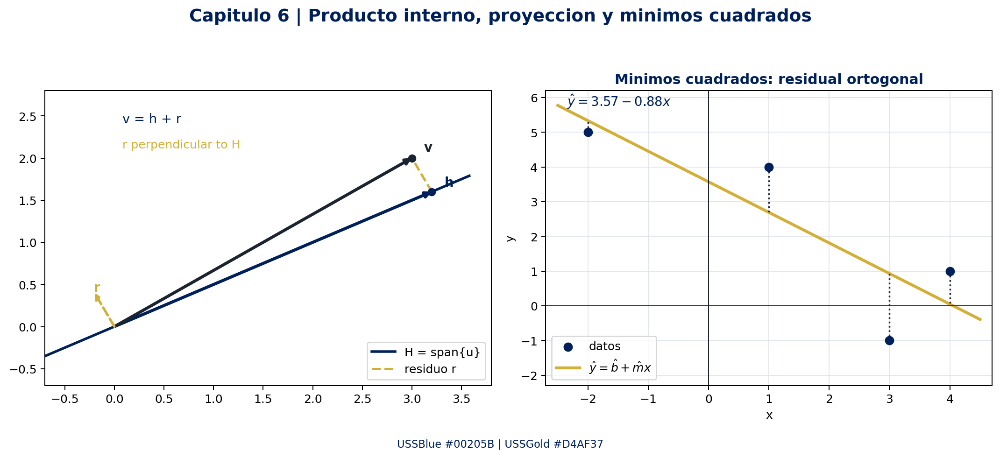

## Referencias y enriquecimiento web

- **[Grossman 7ª Ed.]** Grossman, Stanley I. y Flores Godoy, José Job. *Álgebra Lineal*, 7ª edición, McGraw-Hill/Interamericana, 2012, capítulo 6, pp. 418–477. Fuente local: PDF.
- **[Grossman 7ª Ed.]** usada para cotejar el índice real, las ecuaciones numeradas y los ejemplos del capítulo.
- **[Enriquecimiento Web / Referencias Externas]** NumPy Developers. [`numpy.linalg.lstsq`](https://numpy.org/doc/stable/reference/generated/numpy.linalg.lstsq.html): resolución de $Ax\approx b$, rango y residual mediante mínimos cuadrados. Consulta: 2026-08-20.
- **[Enriquecimiento Web / Referencias Externas]** SymPy Development Team. [Documentación de matrices y `GramSchmidt`](https://docs.sympy.org/latest/modules/matrices/matrices.html): verificación simbólica de ortogonalidad y normalización. Consulta: 2026-08-20.
- **[Enriquecimiento Web / Referencias Externas]** [Matriz unitaria](https://en.wikipedia.org/wiki/Unitary_matrix) y [matriz normal](https://en.wikipedia.org/wiki/Normal_matrix): definiciones $U^*U=I$ y $N^*N=NN^*$, relación con el teorema espectral y contexto de aplicaciones complejas. Consulta: 2026-08-20.

## Lista de comprobación

- [x] Índice real 6.1, 6.2 y 6.3 contrastado con el PDF
- [x] Bases ortonormales, Gram–Schmidt, proyecciones y complemento ortogonal.
- [x] Mínimos cuadrados, ecuaciones normales y ajustes lineal/cuadrático.
- [x] Producto interno en $\mathbb{R}^n$, $\mathbb{C}^n$, funciones y polinomios.
- [x] Al menos tres ejemplos desarrollados y demostraciones centrales.
- [x] Código reproducible con SymPy y NumPy.
- [x] Mermaid, figura PNG, enlaces al índice maestro y dashboard.
- [x] Matrices unitarias/normales separadas como enriquecimiento por no ser secciones autónomas del PDF.

**Conexiones:** ·

---

# Capítulo 7: Transformaciones lineales


> [!info] Leyenda de trazabilidad
> **[Grossman 7ª Ed.]**: definiciones, resultados, ejemplos y organización conceptual sintetizados del capítulo 7 del PDF de Grossman, 7ª edición, pp. 479–539 impresas. No es una transcripción literal.
>
> **[Enriquecimiento Web / Referencias Externas]**: precisiones computacionales, contexto académico y referencias de documentación oficial de NumPy, SymPy y MIT OpenCourseWare. Estas aportaciones se identifican de forma separada.

> [!abstract] Fuente y alcance
> Fuente primaria: PDF relativo de Grossman.. El índice real del capítulo es 7.1–7.5; no se reemplaza por la numeración de otros manuales.

## Índice real del capítulo

| Sección | Título en Grossman | Páginas impresas | Idea guía |
|---|---|---:|---|
| 7.1 | Definición y ejemplos | 480–492 | Una transformación lineal preserva sumas y productos por escalares. |
| 7.2 | Propiedades: imagen y núcleo | 493–500 | El núcleo describe lo que colapsa a cero; la imagen describe lo alcanzable. |
| 7.3 | Representación matricial | 501–525 | En dimensión finita, toda transformación lineal se calcula como una matriz. |
| 7.4 | Isomorfismos | 526–533 | Inyectividad y sobreyectividad simultáneas equivalen a conservar toda la estructura lineal. |
| 7.5 | Isometrías | 534–539 | Una transformación lineal puede preservar longitudes, distancias y productos internos. |

## 0. Marco conceptual

**[Grossman 7ª Ed.]**

Sean $V$ y $W$ espacios vectoriales sobre el mismo cuerpo, principalmente $\mathbb{R}$ en este capítulo. Una función $T:V\to W$ tiene:

- **Dominio** $V$: espacio de entrada.
- **Codominio** $W$: espacio declarado de salida.
- **Imagen** $\operatorname{im}T$: salidas que efectivamente se alcanzan; puede ser un subespacio propio de $W$.
- **Linealidad**: compatibilidad exacta con la estructura de suma y multiplicación escalar.

La pregunta central es:

> ¿Cómo se transforma la información vectorial sin introducir desplazamientos, productos entre coordenadas ni deformaciones incompatibles con la suma?

La respuesta se organiza en una cadena:

$$
\text{linealidad}
\;\Longrightarrow\;
\text{núcleo e imagen}
\;\Longrightarrow\;
\text{rango y nulidad}
\;\Longrightarrow\;
\text{matriz}
\;\Longrightarrow\;
\text{isomorfismo o isometría}.
$$

## 7.1 Definición y ejemplos

**[Grossman 7ª Ed.]**

### Definición

Una transformación lineal es una función $T:V\to W$ tal que, para todos $u,v\in V$ y todo escalar $\alpha$,

$$
T(u+v)=T(u)+T(v),
\qquad
T(\alpha v)=\alpha T(v).
$$

Las dos reglas se pueden condensar en la preservación de toda combinación lineal finita:

$$
T\left(\sum_{i=1}^{k}\alpha_i v_i\right)
=
\sum_{i=1}^{k}\alpha_iT(v_i).
$$

Esto incluye como casos particulares:

$$
T(0_V)=0_W,
\qquad
T(-v)=-T(v),
\qquad
T(u-v)=T(u)-T(v).
$$

La notación $T(v)$ y $Tv$ significa lo mismo. Un operador lineal es una transformación lineal cuyo dominio y codominio suelen coincidir.

### Criterio práctico

Para decidir si una regla es lineal, conviene comprobar en este orden:

1. ¿Está bien definida entre los espacios indicados?
2. ¿Preserva la suma?
3. ¿Preserva la multiplicación por escalares?
4. Como filtro inmediato, ¿cumple $T(0)=0$?

El último punto es necesario, pero por sí solo no reemplaza la comprobación completa.

### Ejemplos de transformaciones lineales

**Reflexión respecto del eje $x$.**

$$
R_x\begin{bmatrix}x\\y\end{bmatrix}
=
\begin{bmatrix}x\\-y\end{bmatrix},
\qquad
R_x=\begin{bmatrix}1&0\\0&-1\end{bmatrix}.
$$

La matriz cambia el signo de la componente perpendicular al eje de reflexión.

**Transformación definida por una matriz.** Si $A\in M_{m\times n}(\mathbb{R})$,

$$
T_A:\mathbb{R}^n\to\mathbb{R}^m,
\qquad
T_A(x)=Ax
$$

es lineal porque la multiplicación matricial distribuye sobre la suma y conmuta con los escalares:

$$
A(u+v)=Au+Av,
\qquad
A(\alpha v)=\alpha Av.
$$

**Transformación de producción.** Con cuatro productos y tres materias primas, la matriz de Grossman puede escribirse como

$$
A=\begin{bmatrix}
2&1&3&4\\
4&2&2&1\\
3&3&1&2
\end{bmatrix},
\qquad
p=\begin{bmatrix}p_1\\p_2\\p_3\\p_4\end{bmatrix},
\qquad
r=Ap.
$$

La función transforma un vector de cantidades producidas en el vector de materias primas requeridas. Por ejemplo, para $p=(10,30,20,50)^T$,

$$
r=A p
=
\begin{bmatrix}310\\190\\240\end{bmatrix}.
$$

**Rotación en el plano.** Para un ángulo $\theta$,

$$
R_\theta=
\begin{bmatrix}
\cos\theta&-\sin\theta\\
\sin\theta&\cos\theta
\end{bmatrix},
\qquad
R_\theta\begin{bmatrix}x\\y\end{bmatrix}
=
\begin{bmatrix}
x\cos\theta-y\sin\theta\\
x\sin\theta+y\cos\theta
\end{bmatrix}.
$$

**Proyección ortogonal.** Si $H$ tiene una base ortonormal $\{u_1,\ldots,u_k\}$,

$$
P_H(v)=\operatorname{proy}_H(v)
=
\sum_{i=1}^{k}\langle v,u_i\rangle u_i.
$$

Cada producto interno es lineal respecto de $v$, por lo que $P_H$ es lineal.

**Operadores sobre espacios de funciones y matrices.** La transposición $A\mapsto A^T$, la derivación $f\mapsto f'$ en un dominio adecuado y la integración definida $f\mapsto\int_a^b f(x)\,dx$ son lineales. El dominio y el codominio deben elegirse para que la salida pertenezca al espacio declarado.

### Ejemplo 1: rotación y prueba directa de linealidad

Sea $T:\mathbb{R}^2\to\mathbb{R}^2$ la rotación de ángulo $\theta=\pi/3$:

$$
T(x,y)=R_{\pi/3}\begin{bmatrix}x\\y\end{bmatrix},
\qquad
R_{\pi/3}=
\begin{bmatrix}
\frac12&-\frac{\sqrt{3}}2\\
\frac{\sqrt{3}}2&\frac12
\end{bmatrix}.
$$

Para $v=(2,1)^T$,

$$
T(v)=
\begin{bmatrix}
1-\frac{\sqrt{3}}2\\
\sqrt{3}+\frac12
\end{bmatrix}
=
\begin{bmatrix}
\frac{2-\sqrt{3}}2\\
\frac{2\sqrt{3}+1}2
\end{bmatrix}.
$$

Como $T(v)=R_{\pi/3}v$ y toda multiplicación por una matriz es lineal, para $u,v$ y $\alpha$ se obtiene directamente $T(u+v)=T(u)+T(v)$ y $T(\alpha v)=\alpha T(v)$.

### Ejemplos que no son lineales

La función afín $f:\mathbb{R}\to\mathbb{R}$ dada por $f(x)=2x+3$ no es una transformación lineal, porque $f(0)=3\neq0$. También fallan las reglas de linealidad:

$$
f(x+y)=2x+2y+3
\neq
(2x+3)+(2y+3)=f(x)+f(y).
$$

La función $T(x,y)=(x^2,y)$ tampoco es lineal: el término $x^2$ no preserva la homogeneidad, pues $T(\alpha x,\alpha y)=(\alpha^2x^2,\alpha y)$ en general no coincide con $\alpha T(x,y)$.

> [!warning] Diferencia terminológica
> En cálculo elemental, a veces se llama “función lineal” a $mx+b$. En álgebra lineal, una transformación lineal entre espacios vectoriales debe enviar el vector cero al vector cero; por eso, en dimensión uno, la forma correcta es $mx$.

## 7.2 Propiedades de las transformaciones lineales: imagen y núcleo

**[Grossman 7ª Ed.]**

### Propiedades básicas

Si $T:V\to W$ es lineal, entonces para $u,v,v_1,\ldots,v_n\in V$ y escalares $\alpha_1,\ldots,\alpha_n$:

$$
T(0_V)=0_W,
\qquad
T(u-v)=T(u)-T(v),
$$

$$
T\left(\alpha_1v_1+\cdots+\alpha_nv_n\right)
=
\alpha_1T(v_1)+\cdots+\alpha_nT(v_n).
$$

**Demostración central.** Por aditividad,

$$
T(0_V)=T(0_V+0_V)=T(0_V)+T(0_V).
$$

Al sumar el inverso aditivo de $T(0_V)$ en $W$, resulta $T(0_V)=0_W$. Después,

$$
T(u-v)=T\bigl(u+(-1)v\bigr)=T(u)+(-1)T(v)=T(u)-T(v).
$$

La fórmula para $n$ términos se demuestra por inducción usando el caso de dos sumandos.

### Determinación por una base

Si $B=\{v_1,\ldots,v_n\}$ es una base de $V$, cada vector $v\in V$ tiene coordenadas únicas $v=\sum_i\alpha_i v_i$. Entonces

$$
T(v)=\sum_{i=1}^{n}\alpha_iT(v_i).
$$

Consecuencias:

- Dos transformaciones lineales que coinciden sobre una base coinciden en todo $V$.
- Dados arbitrariamente $w_1,\ldots,w_n\in W$, existe una única transformación lineal que cumple $T(v_i)=w_i$.
- Los vectores $w_i$ no necesitan ser independientes ni distintos; la independencia se exige a la base del dominio.

### Núcleo e imagen

Para $T:V\to W$ lineal se define

$$
\ker T=\{v\in V:T(v)=0_W\},
$$

$$
\operatorname{im}T=\{w\in W:w=T(v)\text{ para algún }v\in V\}.
$$

El núcleo vive en el dominio y la imagen vive en el codominio. No se debe confundir el codominio $W$ con la imagen efectiva.

**Teorema: núcleo e imagen son subespacios.**

$$
\ker T\leq V,
\qquad
\operatorname{im}T\leq W.
$$

**Demostración.** Si $u,v\in\ker T$ y $\alpha$ es un escalar, entonces

$$
T(u+v)=T(u)+T(v)=0_W,
\qquad
T(\alpha u)=\alpha T(u)=0_W.
$$

Por tanto, el núcleo es un subespacio. Si $w=T(u)$ y $z=T(v)$ pertenecen a la imagen, entonces

$$
w+z=T(u)+T(v)=T(u+v),
\qquad
\alpha w=\alpha T(u)=T(\alpha u),
$$

por lo que la imagen también es un subespacio.

### Rango, nulidad y rango-nulidad

Se define

$$
r(T)=\dim(\operatorname{im}T),
\qquad
n(T)=\dim(\ker T).
$$

Si $\dim V=n<\infty$, se cumple el **teorema rango-nulidad**:

$$
\boxed{r(T)+n(T)=\dim V=n.}
$$

**Demostración.** Sea $\{k_1,\ldots,k_q\}$ una base de $\ker T$. Extiéndala a una base de $V$:

$$
\mathcal{B}=\{k_1,\ldots,k_q,v_{q+1},\ldots,v_n\}.
$$

Los vectores $T(v_{q+1}),\ldots,T(v_n)$ generan $\operatorname{im}T$, porque los términos $T(k_i)$ son cero. Además, son linealmente independientes: si

$$
\sum_{j=q+1}^{n}c_jT(v_j)=0,
$$

entonces $\sum_{j=q+1}^{n}c_jv_j\in\ker T$. Esa combinación pertenece también al subespacio generado por los vectores complementarios $v_{q+1},\ldots,v_n$; como toda la colección es una base, la intersección con $\ker T$ es $\{0\}$. Por tanto, todos los $c_j$ son cero. Así,

$$
r(T)=n-q,
\qquad
n(T)=q,
\qquad
r(T)+n(T)=n.
$$

### Fibras y pérdida de información

Para $v_0\in V$ se tiene

$$
T(v)=T(v_0)
\quad\Longleftrightarrow\quad
v-v_0\in\ker T.
$$

Cuando $T(v_0)=w$, el conjunto de todas las preimágenes de $w$ es la clase afín

$$
T^{-1}(\{w\})=v_0+\ker T.
$$

Por eso, un núcleo no trivial identifica entradas distintas: todos los vectores de una misma fibra producen la misma salida.

### Diagrama estructural

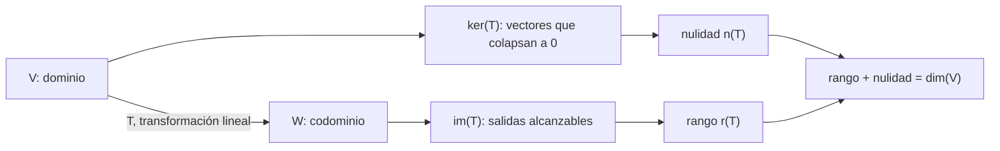

### Ejemplo 2: núcleo, imagen y fibras de una transformación

Sea $T:\mathbb{R}^3\to\mathbb{R}^2$ dada por

$$
T(x,y,z)=
\begin{bmatrix}x-y\\y+z\end{bmatrix},
\qquad
A=\begin{bmatrix}1&-1&0\\0&1&1\end{bmatrix}.
$$

**Núcleo.** Resolver $A(x,y,z)^T=0$ produce

$$
x-y=0,
\qquad y+z=0
\quad\Longrightarrow\quad
(x,y,z)=t(1,1,-1).
$$

Por tanto,

$$
\ker T=\operatorname{span}\{(1,1,-1)\},
\qquad
n(T)=1.
$$

**Imagen.** Las dos primeras columnas $(1,0)^T$ y $(-1,1)^T$ son independientes, de modo que generan $\mathbb{R}^2$:

$$
\operatorname{im}T=\mathbb{R}^2,
\qquad
r(T)=2.
$$

La identidad $r(T)+n(T)=2+1=3=\dim\mathbb{R}^3$ confirma el cálculo.

**Fibra de $b=(3,-1)^T$.** Una solución particular es $v_0=(3,0,-1)^T$. Todas las soluciones son

$$
T^{-1}(\{b\})
=
\left\{
\begin{bmatrix}3\\0\\-1\end{bmatrix}
+t\begin{bmatrix}1\\1\\-1\end{bmatrix}:t\in\mathbb{R}
\right\}.
$$

La salida $b$ no identifica una entrada única porque el núcleo contiene direcciones no nulas.

### Ejemplo 3: proyección sobre un plano

Para $P:\mathbb{R}^3\to\mathbb{R}^3$,

$$
P(x,y,z)=(x,y,0),
\qquad
P=\begin{bmatrix}1&0&0\\0&1&0\\0&0&0\end{bmatrix}.
$$

Entonces

$$
\ker P=\operatorname{span}\{(0,0,1)\},
\qquad
\operatorname{im}P=\{(x,y,0):x,y\in\mathbb{R}\},
$$

$$
n(P)=1,
\qquad
r(P)=2,
\qquad
r(P)+n(P)=3.
$$

Geométricamente, la dirección $z$ se elimina y el plano $xy$ permanece fijo. Además, $P^2=P$: aplicar dos veces la proyección no cambia el resultado de la primera aplicación.

> [!important] Lectura geométrica
> El rango mide cuántas direcciones independientes sobreviven en la salida. La nulidad mide cuántas direcciones independientes se pierden. El teorema rango-nulidad afirma que ambas cantidades contabilizan exactamente las direcciones del dominio.

## 7.3 Representación matricial de una transformación lineal

**[Grossman 7ª Ed.]**

### Bases canónicas

Sea $T:\mathbb{R}^n\to\mathbb{R}^m$ lineal y sea $\{e_1,\ldots,e_n\}$ la base canónica de $\mathbb{R}^n$. La matriz de transformación es

$$
[T]=A_T=\begin{bmatrix}T(e_1)&T(e_2)&\cdots&T(e_n)\end{bmatrix}\in M_{m\times n}(\mathbb{R}).
$$

Para $x=\sum_{j=1}^{n}x_je_j$,

$$
T(x)=\sum_{j=1}^{n}x_jT(e_j)=A_Tx.
$$

**Unicidad.** Si $A_T$ y $B_T$ producen la misma salida para todo $x$, entonces sus columnas coinciden al evaluar en cada $e_j$; por tanto, $A_T=B_T$.

La representación traduce directamente los espacios asociados:

$$
\operatorname{im}T=\operatorname{Col}(A_T),
\qquad
\ker T=\operatorname{Null}(A_T),
$$

$$
r(T)=\operatorname{rank}(A_T),
\qquad
n(T)=\operatorname{nullity}(A_T).
$$

### Bases arbitrarias y coordenadas

Sean $B=(v_1,\ldots,v_n)$ una base de $V$ y $C=(w_1,\ldots,w_m)$ una base de $W$. La representación matricial relativa a esas bases se define mediante

$$
[T(v)]_C=[T]_{C\leftarrow B}[v]_B.
$$

Sus columnas son las coordenadas de las imágenes de los vectores de la base del dominio:

$$
[T]_{C\leftarrow B}
=
\begin{bmatrix}
[T(v_1)]_C&\cdots&[T(v_n)]_C
\end{bmatrix}.
$$

Si $P_B$ y $P_C$ tienen como columnas los vectores de $B$ y $C$ expresados en bases canónicas, y $A$ es la matriz canónica de $T$, entonces

$$
[T]_{C\leftarrow B}=P_C^{-1}AP_B.
$$

Cambiar de base cambia las coordenadas y la matriz, pero no cambia la transformación abstracta ni sus invariantes rango y nulidad.

### Composición

Si $T:U\to V$ y $S:V\to W$ tienen matrices compatibles $A_T$ y $A_S$,

$$
[S\circ T]=A_SA_T.
$$

El orden importa: primero actúa $T$ y después $S$, por eso la matriz de $T$ aparece a la derecha.

### Geometría elemental en $\mathbb{R}^2$

| Transformación | Regla | Matriz |
|---|---|---|
| Expansión/compresión en $x$ | $(x,y)\mapsto(cx,y)$ | $\begin{bmatrix}c&0\\0&1\end{bmatrix}$ |
| Expansión/compresión en $y$ | $(x,y)\mapsto(x,cy)$ | $\begin{bmatrix}1&0\\0&c\end{bmatrix}$ |
| Reflexión en eje $x$ | $(x,y)\mapsto(x,-y)$ | $\begin{bmatrix}1&0\\0&-1\end{bmatrix}$ |
| Reflexión en eje $y$ | $(x,y)\mapsto(-x,y)$ | $\begin{bmatrix}-1&0\\0&1\end{bmatrix}$ |
| Reflexión en $y=x$ | $(x,y)\mapsto(y,x)$ | $\begin{bmatrix}0&1\\1&0\end{bmatrix}$ |
| Corte horizontal | $(x,y)\mapsto(x+cy,y)$ | $\begin{bmatrix}1&c\\0&1\end{bmatrix}$ |
| Rotación | $(x,y)\mapsto R_\theta(x,y)$ | $R_\theta$ |

Una matriz invertible de $2\times2$ puede descomponerse, mediante eliminación, en un producto de matrices elementales asociadas a expansiones, compresiones, cortes y reflexiones. Al aplicar el producto a un vector, las operaciones geométricas se ejecutan de derecha a izquierda.

### Ejemplo 4: representación matricial en espacios de polinomios

Sea $T:P_2\to P_3$ definida por $T(p)=xp$, con bases canónicas

$$
B=(1,x,x^2),
\qquad
C=(1,x,x^2,x^3).
$$

Se calculan las imágenes de los vectores de $B$:

$$
T(1)=x,
\qquad
T(x)=x^2,
\qquad
T(x^2)=x^3.
$$

Sus coordenadas en $C$ son, respectivamente, $(0,1,0,0)^T$, $(0,0,1,0)^T$ y $(0,0,0,1)^T$. Por tanto,

$$
[T]_{C\leftarrow B}=
\begin{bmatrix}
0&0&0\\
1&0&0\\
0&1&0\\
0&0&1
\end{bmatrix}.
$$

Para $p=a_0+a_1x+a_2x^2$,

$$
[T(p)]_C
=
\begin{bmatrix}0\\a_0\\a_1\\a_2\end{bmatrix},
\qquad
T(p)=a_0x+a_1x^2+a_2x^3.
$$

La matriz tiene tres columnas independientes. Así,

$$
\ker T=\{0\},
\qquad
\operatorname{im}T=\operatorname{span}\{x,x^2,x^3\},
\qquad
r(T)=3,
\qquad
n(T)=0.
$$

### Ejemplo 5: una base que diagonaliza la representación

Considérese la transformación con matriz canónica

$$
C=\begin{bmatrix}12&10\\-15&-13\end{bmatrix}
$$

y la base

$$
B=\{b_1,b_2\},
\qquad
b_1=\begin{bmatrix}1\\-1\end{bmatrix},
\qquad
b_2=\begin{bmatrix}2\\-3\end{bmatrix},
\qquad
P_B=\begin{bmatrix}1&2\\-1&-3\end{bmatrix}.
$$

Se verifica

$$
C b_1=2b_1,
\qquad
C b_2=-3b_2,
\qquad
CP_B=P_B\begin{bmatrix}2&0\\0&-3\end{bmatrix}.
$$

Como $\det P_B=-1\neq0$,

$$
[T]_B=P_B^{-1}CP_B
=
\begin{bmatrix}2&0\\0&-3\end{bmatrix}.
$$

La misma transformación tiene una matriz densa en la base canónica y una matriz diagonal en $B$. La diagonalización no cambia $T$; cambia el sistema de coordenadas desde el cual se la describe.

## 7.4 Isomorfismos

**[Grossman 7ª Ed.]**

### Inyectividad y sobreyectividad

Una transformación $T:V\to W$ es **uno a uno** o **inyectiva** si

$$
T(v_1)=T(v_2)\Longrightarrow v_1=v_2.
$$

Es **sobre** o **suprayectiva** sobre $W$ si

$$
\operatorname{im}T=W,
$$

es decir, cada $w\in W$ tiene al menos una preimagen.

### Teorema núcleo-inyectividad

Para una transformación lineal $T:V\to W$,

$$
\boxed{T\text{ es inyectiva}\iff\ker T=\{0\}.}
$$

**Demostración.** Si $\ker T=\{0\}$ y $T(v_1)=T(v_2)$, entonces

$$
T(v_1-v_2)=T(v_1)-T(v_2)=0,
$$

por lo que $v_1-v_2\in\ker T$ y $v_1=v_2$. Recíprocamente, si $T$ es inyectiva y $v\in\ker T$, entonces $T(v)=0=T(0)$; la inyectividad implica $v=0$.

### Teoremas dimensionales

Si $V$ y $W$ son finito-dimensionales con $\dim V=n$ y $\dim W=m$:

$$
n>m\Longrightarrow T\text{ no puede ser inyectiva},
$$

$$
m>n\Longrightarrow T\text{ no puede ser sobreyectiva}.
$$

La razón es rango-nulidad:

$$
r(T)\leq\min\{n,m\},
\qquad
n(T)=n-r(T).
$$

Si $n=m$, entonces

$$
T\text{ inyectiva}
\iff
T\text{ sobreyectiva}
\iff
T\text{ isomorfismo}.
$$

### Isomorfismo

Un **isomorfismo** es una transformación lineal que es simultáneamente inyectiva y sobreyectiva. En ese caso existe una función inversa $T^{-1}:W\to V$ y también es lineal:

$$
T^{-1}(w_1+w_2)=T^{-1}(w_1)+T^{-1}(w_2),
\qquad
T^{-1}(\alpha w)=\alpha T^{-1}(w).
$$

La linealidad de la inversa se prueba aplicando $T$ a ambos lados y usando la unicidad de la preimagen.

Un isomorfismo preserva la estructura lineal:

$$
\{v_i\}\text{ genera }V\Longrightarrow\{T(v_i)\}\text{ genera }W,
$$

$$
\{v_i\}\text{ es independiente}
\Longrightarrow
\{T(v_i)\}\text{ es independiente}.
$$

Por tanto, lleva bases a bases y, en dimensión finita, preserva la dimensión.

### Teorema de clasificación por dimensión

Si $V$ y $W$ son espacios vectoriales reales de dimensión finita, entonces

$$
\dim V=\dim W
\Longrightarrow
V\cong W.
$$

Para demostrarlo, se eligen bases $B=(v_1,\ldots,v_n)$ y $C=(w_1,\ldots,w_n)$ y se define la única transformación lineal con $T(v_i)=w_i$. La independencia de $C$ fuerza $\ker T=\{0\}$; como las dimensiones son iguales, $T$ también es sobreyectiva.

### Ejemplo 6: isomorfismo entre $\mathbb{R}^3$ y $P_2$

Defina

$$
T:\mathbb{R}^3\to P_2,
\qquad
T\begin{bmatrix}a\\b\\c\end{bmatrix}=a+bx+cx^2.
$$

La linealidad se obtiene comparando coeficientes. Si $T(a,b,c)=0$, entonces

$$
a+bx+cx^2=0\text{ para todo }x
\Longrightarrow a=b=c=0.
$$

Así, $\ker T=\{0\}$ y $T$ es inyectiva. Para todo $p(x)=a_0+a_1x+a_2x^2\in P_2$,

$$
T\begin{bmatrix}a_0\\a_1\\a_2\end{bmatrix}=p(x),
$$

por lo que $T$ es sobreyectiva. La inversa es

$$
T^{-1}(a_0+a_1x+a_2x^2)=\begin{bmatrix}a_0\\a_1\\a_2\end{bmatrix}.
$$

En consecuencia,

$$
\mathbb{R}^3\cong P_2.
$$

### Matriz e isomorfismo

Si $T:\mathbb{R}^n\to\mathbb{R}^n$ tiene matriz $A$, las siguientes condiciones son equivalentes:

- $A$ es invertible.
- $Ax=0$ solo tiene la solución trivial.
- $A$ tiene rango $n$ y nulidad $0$.
- $\det A\neq0$.
- $T(x)=Ax$ es un isomorfismo.

Este es el punto de vista de transformaciones lineales del teorema de resumen de matrices.

## 7.5 Isometrías

**[Grossman 7ª Ed.]**

### Producto interno, norma e identidad de la transpuesta

En $\mathbb{R}^n$,

$$
\langle x,y\rangle=x^Ty,
\qquad
\|x\|=\sqrt{\langle x,x\rangle}.
$$

Para $A\in M_{m\times n}(\mathbb{R})$, $x\in\mathbb{R}^n$ y $y\in\mathbb{R}^m$,

$$
\langle Ax,y\rangle=(Ax)^Ty=x^TA^Ty=\langle x,A^Ty\rangle.
$$

La transpuesta es el operador que permite trasladar una matriz desde el primer argumento del producto interno al segundo.

### Definición de isometría

Una transformación lineal $T:\mathbb{R}^n\to\mathbb{R}^n$ es una **isometría** si preserva la norma:

$$
\boxed{\|T(x)\|=\|x\|\quad\text{para todo }x\in\mathbb{R}^n.}
$$

Por linealidad también preserva distancias:

$$
\|T(x)-T(y)\|=\|T(x-y)\|=\|x-y\|.
$$

### Isometría y producto interno

**Teorema.** Si $T$ es una isometría, entonces

$$
\langle T(x),T(y)\rangle=\langle x,y\rangle.
$$

**Demostración.** Igualar las normas de $T(x-y)$ y $x-y$ da

$$
\|T(x)-T(y)\|^2
=
\|T(x)\|^2-2\langle T(x),T(y)\rangle+\|T(y)\|^2,
$$

$$
\|x-y\|^2
=
\|x\|^2-2\langle x,y\rangle+\|y\|^2.
$$

Como además $\|T(x)\|=\|x\|$ y $\|T(y)\|=\|y\|$, al comparar ambas expresiones resulta

$$
\langle T(x),T(y)\rangle=\langle x,y\rangle.
$$

### Caracterización matricial

Si $T(x)=Ax$, entonces

$$
\|Ax\|^2=(Ax)^T(Ax)=x^TA^TAx.
$$

Por tanto,

$$
\boxed{T\text{ es isometría}\iff A^TA=I_n.}
$$

Una matriz cuadrada que satisface $A^TA=I_n$ es **ortogonal**. En ese caso,

$$
A^{-1}=A^T,
\qquad
\det A\in\{-1,1\},
$$

y sus columnas forman una base ortonormal de $\mathbb{R}^n$. La equivalencia se verifica en ambos sentidos: si $A^TA=I$, preserva normas; si preserva normas, la forma cuadrática $x^T(A^TA-I)x$ es cero para todo $x$, lo que fuerza $A^TA-I=0$.

Toda isometría lineal es inyectiva porque

$$
T(x)=T(y)\Longrightarrow0=\|T(x)-T(y)\|=\|x-y\|\Longrightarrow x=y.
$$

Como es una transformación de $\mathbb{R}^n$ en sí mismo, también es sobreyectiva y, por tanto, un isomorfismo.

### Isometrías de $\mathbb{R}^2$

Toda matriz ortogonal de $2\times2$ tiene una de estas dos formas:

$$
R_\theta=
\begin{bmatrix}
\cos\theta&-\sin\theta\\
\sin\theta&\cos\theta
\end{bmatrix}
$$

o

$$
R_\theta F_x
=
\begin{bmatrix}
\cos\theta&\sin\theta\\
\sin\theta&-\cos\theta
\end{bmatrix},
\qquad
F_x=\begin{bmatrix}1&0\\0&-1\end{bmatrix}.
$$

La primera es una rotación. La segunda es una reflexión respecto del eje $x$ seguida de una rotación. La diferencia se detecta por el determinante: $\det R_\theta=1$ y $\det(R_\theta F_x)=-1$.

### Ejemplo 7: verificar una isometría

Para $Q=R_{\pi/3}$,

$$
Q=\begin{bmatrix}
\frac12&-\frac{\sqrt3}{2}\\
\frac{\sqrt3}{2}&\frac12
\end{bmatrix}.
$$

Su transpuesta es

$$
Q^T=\begin{bmatrix}
\frac12&\frac{\sqrt3}{2}\\
-\frac{\sqrt3}{2}&\frac12
\end{bmatrix}.
$$

Al multiplicar,

$$
Q^TQ=
\begin{bmatrix}
\frac14+\frac34&-\frac{\sqrt3}{4}+\frac{\sqrt3}{4}\\
-\frac{\sqrt3}{4}+\frac{\sqrt3}{4}&\frac34+\frac14
\end{bmatrix}
=I_2.
$$

Por consiguiente, para todo $x\in\mathbb{R}^2$,

$$
\|Qx\|^2=x^TQ^TQx=x^Tx=\|x\|^2.
$$

La rotación conserva longitudes, ángulos y distancias, pero no fija cada vector salvo casos particulares.

### Isometrías entre espacios con producto interno

Sean $V$ y $W$ espacios reales o complejos con productos internos. Una transformación lineal $T:V\to W$ es una isometría si

$$
\|T(v)\|_W=\|v\|_V\quad\text{para todo }v\in V.
$$

Si además es un isomorfismo, $V$ y $W$ son isométricamente isomorfos. En dimensión finita, dos espacios reales de igual dimensión con producto interno son isométricamente isomorfos: basta elegir bases ortonormales $\{u_i\}$ y $\{w_i\}$ y definir $T(u_i)=w_i$. Para $x=\sum_i c_i u_i$ y $y=\sum_i d_i u_i$,

$$
\langle x,y\rangle=\sum_i c_id_i
=\langle T(x),T(y)\rangle,
$$

porque ambas bases son ortonormales.

## Verificación computacional reproducible

**[Grossman 7ª Ed.]**: los objetos verificados son el núcleo, la imagen, la matriz relativa a una base y la ortogonalidad desarrollados en las secciones 7.2–7.5.

**[Enriquecimiento Web / Referencias Externas]**: SymPy permite calcular rango, `nullspace()` y productos matriciales exactamente; NumPy permite contrastar la preservación de norma con aritmética de punto flotante. La implementación completa que además genera la figura está en `04_Valores_y_Vectores_Propios/grossman_capitulo_7_figura.py`.

```python
import numpy as np
import sympy as sp

# Núcleo, rango y rango-nulidad del ejemplo 2.
A = sp.Matrix([[1, -1, 0], [0, 1, 1]])
assert A.rank() == 2
assert len(A.nullspace()) == 1
assert A.rank() + len(A.nullspace()) == A.cols

# Cambio de base del ejemplo 5.
C = sp.Matrix([[12, 10], [-15, -13]])
P_B = sp.Matrix([[1, 2], [-1, -3]])
assert P_B.det() != 0
assert P_B.inv() * C * P_B == sp.diag(2, -3)

# Isometría exacta y numérica.
Q = sp.Matrix([
 [sp.Rational(1, 2), -sp.sqrt(3) / 2],
 [sp.sqrt(3) / 2, sp.Rational(1, 2)],
])
assert (Q.T * Q).applyfunc(sp.simplify) == sp.eye(2)
Q_float = np.array(Q.evalf(), dtype=float)
x = np.array([2.0, 1.0])
assert np.allclose(np.linalg.norm(Q_float @ x), np.linalg.norm(x))

print("[PASS] rango-nulidad, cambio de base e isometría")
```

El script de recursos usa `matplotlib.use("Agg")`, por lo que no requiere una sesión gráfica, y escribe la figura en la misma carpeta:

```text
figuras/grossman_capitulo_7_transformacion.png
```

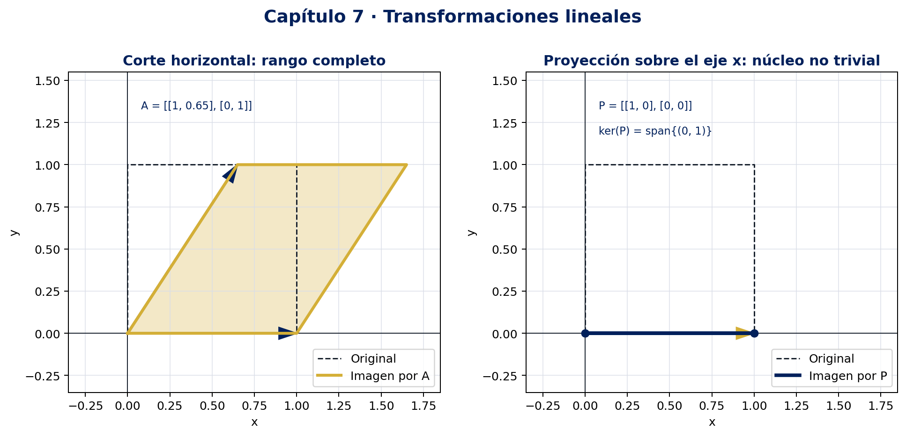

## Enriquecimiento y referencias externas

**[Enriquecimiento Web / Referencias Externas]**

- **NumPy, `numpy.linalg.matrix_rank`**: calcula el rango mediante valores singulares y usa una tolerancia para distinguir valores singulares numéricamente pequeños de cero. Esto es relevante al diferenciar el rango exacto de SymPy del rango efectivo de datos con redondeo.
- **NumPy, `numpy.linalg.norm`**: permite evaluar normas vectoriales y matriciales; `np.linalg.norm(Q @ x)` sirve para una comprobación numérica de isometría, siempre interpretando el resultado con tolerancia.
- **SymPy, matrices**: proporciona operaciones exactas para `rank()`, `nullspace()`, `det()`, `inv()` y productos matriciales, adecuadas para verificar los ejemplos racionales y algebraicos del capítulo sin redondeo prematuro.
- **MIT OpenCourseWare, 18.06SC**: sitúa las transformaciones lineales y sus matrices dentro de una unidad sobre matrices definidas por su acción sobre vectores, seguida por cambio de base y compresión de imágenes. Este contexto conecta la sección 7.3 con aplicaciones de representación y codificación.

## Resumen operativo

**[Grossman 7ª Ed.]**

1. Verifica primero que $T(0)=0$ y las dos leyes de linealidad.
2. Para hallar $\ker T$, resuelve $T(v)=0$.
3. Para hallar $\operatorname{im}T$, genera las imágenes de una base del dominio.
4. Calcula $r(T)$ y $n(T)$ y comprueba $r(T)+n(T)=\dim V$ cuando $V$ es finito-dimensional.
5. En bases canónicas, forma $[T]$ poniendo $T(e_i)$ como columnas.
6. Para cambiar de bases, usa $[T]_{C\leftarrow B}=P_C^{-1}AP_B$.
7. Decide si es isomorfismo con $\ker T=\{0\}$ y $\operatorname{im}T=W$.
8. Decide si una transformación cuadrada es isometría con $A^TA=I$.

> [!success] Idea final
> El capítulo 7 convierte una regla abstracta entre espacios vectoriales en una descripción verificable: el núcleo mide la pérdida, la imagen mide el alcance, la matriz codifica la acción, el isomorfismo garantiza equivalencia estructural y la isometría añade conservación geométrica.

## Referencias

- **[Grossman 7ª Ed.]** Stanley I. Grossman, José Job Flores Godoy, *Álgebra lineal*, 7ª edición, McGraw-Hill/Interamericana, 2012, capítulo 7, pp. 479–539. Fuente local: .
- **[Enriquecimiento Web / Referencias Externas]** NumPy Developers, [`numpy.linalg.matrix_rank`](https://numpy.org/doc/stable/reference/generated/numpy.linalg.matrix_rank.html), documentación oficial, consultada el 2026-08-20.
- **[Enriquecimiento Web / Referencias Externas]** NumPy Developers, [`numpy.linalg.norm`](https://numpy.org/doc/stable/reference/generated/numpy.linalg.norm.html), documentación oficial, consultada el 2026-08-20.
- **[Enriquecimiento Web / Referencias Externas]** SymPy Development Team, [Matrices (linear algebra)](https://docs.sympy.org/latest/modules/matrices/matrices.html), documentación oficial, consultada el 2026-08-20.
- **[Enriquecimiento Web / Referencias Externas]** MIT OpenCourseWare, [Linear Transformations and their Matrices](https://ocw.mit.edu/courses/18-06sc-linear-algebra-fall-2011/pages/positive-definite-matrices-and-applications/linear-transformations-and-their-matrices/) y [Change of Basis; Image Compression](https://ocw.mit.edu/courses/18-06sc-linear-algebra-fall-2011/pages/positive-definite-matrices-and-applications/change-of-basis-image-compression/), curso 18.06SC, consultado el 2026-08-20.

---

# Capítulo 8: Valores y vectores propios

> [!abstract] Alcance y trazabilidad
> - `[Grossman 7ª Ed.]`: síntesis de las secciones 8.1 a 8.8 del capítulo 8, páginas impresas 546-643. La fuente primaria es el PDF de Grossman 7ª edición.
> - `[Enriquecimiento Web / Referencias Externas]`: documentación oficial de SymPy y SciPy, más material académico de MIT OpenCourseWare. Estas fuentes se mantienen separadas de la exposición del libro.
> - Convención: Grossman usa $p_A(\lambda)=\det(A-\lambda I)$; algunas bibliotecas usan $\det(\lambda I-A)$. Para una matriz $n\times n$ sólo cambia el factor $(-1)^n$, por lo que las raíces son las mismas.

> [!important] Idea unificadora
> Un vector propio es una dirección que una transformación lineal no desvía: sólo lo escala por $\lambda$. La base propia, cuando existe, convierte una matriz complicada en una diagonal; cuando no existe, la forma de Jordan conserva la información que falta mediante cadenas de vectores propios generalizados.

## Mapa conceptual del capítulo

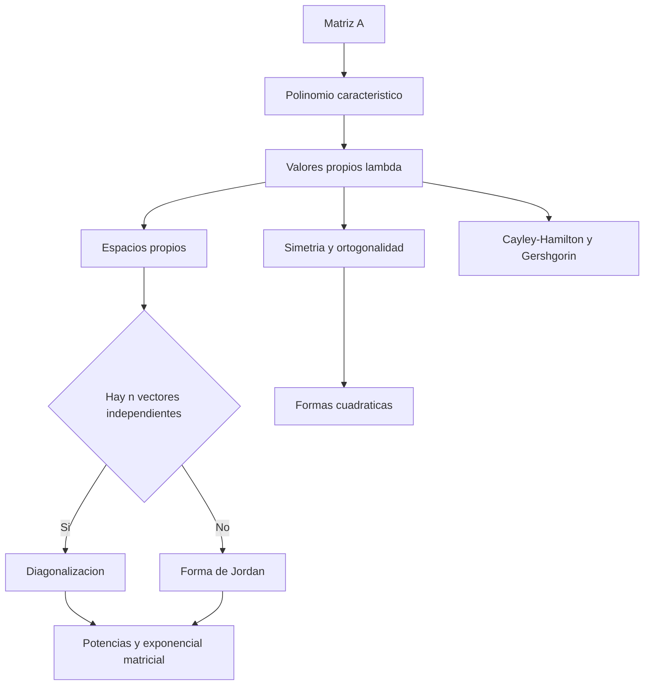

## 8.1 Valores característicos y vectores característicos

> [!note] [Grossman 7ª Ed.]
> En la terminología del texto, valores/vectores **característicos** y valores/vectores **propios** son sinónimos de eigenvalues/eigenvectors.

### Definiciones fundamentales

Sea $A\in\mathbb{F}^{n\times n}$, con $\mathbb{F}=\mathbb{R}$ o $\mathbb{C}$. Un escalar $\lambda$ es un valor propio de $A$ si existe $v\neq 0$ tal que

$$
Av=\lambda v.
$$

El vector $v$ es un vector propio asociado. La ecuación equivale a

$$
(A-\lambda I)v=0.
$$

Por tanto, el espacio propio asociado es

$$
E_\lambda=\{v\in\mathbb{C}^n:Av=\lambda v\}=\ker(A-\lambda I).
$$

Es un subespacio. El vector cero pertenece a $E_\lambda$, pero por definición no es un vector propio.

### Polinomio característico

El sistema homogéneo $(A-\lambda I)v=0$ tiene una solución no trivial si y sólo si $A-\lambda I$ es singular. Así se obtiene el criterio central:

$$
\lambda\text{ es valor propio de }A
\iff \det(A-\lambda I)=0.
$$

Se define

$$
p_A(\lambda)=\det(A-\lambda I),
$$

y $p_A(\lambda)=0$ es la ecuación característica. Es un polinomio de grado $n$; contando multiplicidades, tiene $n$ raíces complejas.

Para una matriz $2\times2$,

$$
A=\begin{bmatrix}a&b\\c&d\end{bmatrix}
\quad\Longrightarrow\quad
p_A(\lambda)=(a-\lambda)(d-\lambda)-bc
=\lambda^2-(a+d)\lambda+(ad-bc).
$$

Los valores propios de una matriz triangular son exactamente sus entradas diagonales, porque $A-\lambda I$ sigue siendo triangular y

$$
\det(A-\lambda I)=\prod_{i=1}^{n}(a_{ii}-\lambda).
$$

### Multiplicidades

Si $\lambda$ es raíz de $p_A$ de orden $r$, entonces $r$ es su **multiplicidad algebraica** $m_a(\lambda)$. Su **multiplicidad geométrica** es

$$
m_g(\lambda)=\dim E_\lambda=\operatorname{nul}(A-\lambda I).
$$

Siempre se cumple

$$
1\leq m_g(\lambda)\leq m_a(\lambda).
$$

La igualdad $m_g(\lambda)=m_a(\lambda)$ para cada valor propio es precisamente la condición que permite reunir $n$ vectores propios linealmente independientes. En particular, valores propios distintos producen vectores propios linealmente independientes.

> [!warning] Matriz real, valores complejos
> Una matriz real puede tener valores propios no reales. Si $A$ es real y $\lambda=a+bi$ es propio, entonces $\overline{\lambda}=a-bi$ también lo es, con un vector propio conjugado. Esto es esencial en la sección 8.7.

### Demostraciones analíticas centrales

**Criterio determinantal.** Si $Av=\lambda v$ con $v\neq0$, entonces $(A-\lambda I)v=0$ tiene solución no trivial; por ello $A-\lambda I$ no puede ser invertible y su determinante es cero. Recíprocamente, si el determinante es cero, el núcleo contiene un vector no nulo y ese vector satisface $Av=\lambda v$.

**Independencia de valores propios distintos.** Sean $Av_i=\lambda_i v_i$ y $\lambda_i\neq\lambda_j$ si $i\neq j$. Supóngase, por inducción, que

$$
c_1v_1+\cdots+c_mv_m=0.
$$

Aplicar $A-\lambda_m I$ elimina el último término:

$$
\sum_{i=1}^{m-1}c_i(\lambda_i-\lambda_m)v_i=0.
$$

Por la hipótesis inductiva, $c_i(\lambda_i-\lambda_m)=0$ para $i<m$. Como los valores son distintos, $c_i=0$ para $i<m$; al volver a la relación original, $c_m=0$. Luego todos los coeficientes son cero.

### Procedimiento de cálculo

1. Formar $p_A(\lambda)=\det(A-\lambda I)$.
2. Factorizar $p_A$ y obtener sus raíces.
3. Para cada raíz $\lambda_i$, resolver $(A-\lambda_i I)v=0$.
4. Dar una base de $E_{\lambda_i}$ y calcular $m_g(\lambda_i)$.
5. Comparar multiplicidades para decidir diagonalizabilidad.

### Ejemplo 1: valores propios y diagonalización de una matriz $2\times2$

Sea

$$
A=\begin{bmatrix}4&2\\3&3\end{bmatrix}.
$$

**Paso 1: polinomio característico.**

$$
\begin{aligned}
p_A(\lambda)
&=\det\begin{bmatrix}4-\lambda&2\\3&3-\lambda\end{bmatrix}\\
&=(4-\lambda)(3-\lambda)-6\\
&=\lambda^2-7\lambda+6=(\lambda-1)(\lambda-6).
\end{aligned}
$$

Los valores propios son $\lambda_1=1$ y $\lambda_2=6$.

**Paso 2: espacio propio para $\lambda_1=1$.**

$$
(A-I)v=\begin{bmatrix}3&2\\3&2\end{bmatrix}
\begin{bmatrix}x\\y\end{bmatrix}=0
\quad\Longrightarrow\quad 3x+2y=0.
$$

Tomando $x=2$, se obtiene $v_1=(2,-3)^T$ y $E_1=\operatorname{span}\{v_1\}$.

**Paso 3: espacio propio para $\lambda_2=6$.**

$$
(A-6I)v=\begin{bmatrix}-2&2\\3&-3\end{bmatrix}
\begin{bmatrix}x\\y\end{bmatrix}=0
\quad\Longrightarrow\quad y=x.
$$

Tomando $x=1$, $v_2=(1,1)^T$ y $E_6=\operatorname{span}\{v_2\}$.

Como los valores son distintos, $v_1,v_2$ son independientes. Con

$$
C=\begin{bmatrix}2&1\\-3&1\end{bmatrix},
\qquad D=\begin{bmatrix}1&0\\0&6\end{bmatrix},
$$

se verifica $AC=CD$ y, por tanto,

$$
C^{-1}AC=D,
\qquad A=CDC^{-1}.
$$

## 8.2 Un modelo de crecimiento de población

> [!note] [Grossman 7ª Ed.]
> La sección es opcional en Grossman, pero muestra de forma concreta cómo el valor propio dominante controla una dinámica discreta.

### Modelo escalar y modelo por edades

Si $p_n$ es una población después de $n$ periodos y $r$ es una tasa constante,

$$
p_n=rp_{n-1}\quad\Longrightarrow\quad p_n=r^np_0.
$$

Así, $r>1$ produce crecimiento sin cota en el modelo idealizado, $0<r<1$ produce decaimiento y $r=1$ mantiene la población.

Para distinguir juveniles y adultos, sea

$$
p_n=\begin{bmatrix}p_{j,n}\\p_{a,n}\end{bmatrix},
\qquad
A=\begin{bmatrix}0&k\\a&b\end{bmatrix},
$$

donde $k$ es el número medio de hembras jóvenes producidas por hembra adulta, $a$ es la supervivencia juvenil hasta la adultez y $b$ la supervivencia adulta. El modelo de Leslie de Grossman queda

$$
p_n=Ap_{n-1},
\qquad p_n=A^np_0.
$$

El polinomio característico es

$$
p_A(\lambda)=\lambda^2-b\lambda-ak,
$$

por lo que

$$
\lambda_{1,2}=\frac{b\pm\sqrt{b^2+4ak}}{2}.
$$

Si $a,b,k>0$, entonces $\lambda_1>0$, $\lambda_2<0$ y $|\lambda_2|<\lambda_1$. Si $A$ tiene dos valores propios distintos y $p_0=\alpha_1v_1+\alpha_2v_2$, entonces

$$
p_n=\alpha_1\lambda_1^n v_1+\alpha_2\lambda_2^n v_2
=\lambda_1^n\left(\alpha_1v_1+\alpha_2\left(\frac{\lambda_2}{\lambda_1}\right)^nv_2\right).
$$

Como $|\lambda_2/\lambda_1|<1$, la distribución de edades se aproxima a la dirección de $v_1$. El signo negativo de $\lambda_2$ explica las oscilaciones iniciales entre generaciones.

La población crece a largo plazo si $\lambda_1>1$. Para los parámetros positivos anteriores,

$$
\lambda_1>1
\iff k>\frac{1-b}{a}.
$$

### Ejemplo 2: crecimiento de hembras durante generaciones

Considérese

$$
A=\begin{bmatrix}0&2\\0.3&0.5\end{bmatrix},
\qquad p_0=\begin{bmatrix}0\\10\end{bmatrix}.
$$

**Paso 1: iteración inicial.**

$$
p_1=Ap_0=\begin{bmatrix}20\\5\end{bmatrix},
\qquad
p_2=Ap_1=\begin{bmatrix}10\\8.5\end{bmatrix}.
$$

**Paso 2: valores propios.**

$$
\lambda^2-0.5\lambda-0.6=0
\quad\Longrightarrow\quad
\lambda_1\approx1.06394103,
\qquad
\lambda_2\approx-0.56394103.
$$

Para este modelo, la primera fila de $Av=\lambda v$ da $2y=\lambda x$. Se puede tomar

$$
v_1=\begin{bmatrix}1\\\lambda_1/2\end{bmatrix}
\approx\begin{bmatrix}1\\0.53197052\end{bmatrix},
\qquad
v_2=\begin{bmatrix}1\\\lambda_2/2\end{bmatrix}
\approx\begin{bmatrix}1\\-0.28197052\end{bmatrix}.
$$

**Paso 3: interpretación.** Como $\lambda_1$ domina,

$$
\frac{p_{j,n}}{p_{a,n}}\longrightarrow\frac{1}{0.53197052}\approx1.8798,
\qquad
\frac{T_n}{T_{n-1}}\longrightarrow\lambda_1\approx1.06394,
$$

donde $T_n=p_{j,n}+p_{a,n}$. La población total crece aproximadamente un $6.4\%$ por periodo y la razón juvenil/adulta se estabiliza.

> [!warning] Alcance del modelo
> Las tasas constantes no consideran clima, variación de natalidad con la edad, recursos limitados ni sobrepoblación. El valor propio dominante describe la tendencia del modelo lineal, no una predicción ecológica ilimitada.

## 8.3 Matrices semejantes y diagonalización

> [!note] [Grossman 7ª Ed.]

### Semejanza

Dos matrices $A,B\in\mathbb{F}^{n\times n}$ son semejantes si existe $C$ invertible tal que

$$
B=C^{-1}AC.
$$

La forma equivalente, útil para verificar sin calcular $C^{-1}$, es

$$
CB=AC.
$$

La semejanza representa el mismo operador lineal en bases distintas. No significa que $A$ y $B$ tengan las mismas entradas, sino que describen la misma transformación después de cambiar coordenadas.

Si $B=C^{-1}AC$, entonces

$$
B-\lambda I=C^{-1}(A-\lambda I)C,
$$

y por multiplicatividad del determinante,

$$
\det(B-\lambda I)=\det(C^{-1})\det(A-\lambda I)\det(C)=\det(A-\lambda I).
$$

Por ello las matrices semejantes tienen el mismo polinomio característico, valores propios, multiplicidades algebraicas, determinante y traza.

### Criterio de diagonalización

Una matriz $A$ es diagonalizable si es semejante a una matriz diagonal. El criterio exacto es

$$
A\text{ es diagonalizable}
\iff A\text{ tiene }n\text{ vectores propios linealmente independientes}.
$$

Si $v_1,\ldots,v_n$ son esos vectores y $Av_i=\lambda_i v_i$, se forma

$$
C=[v_1\ v_2\ \cdots\ v_n],
\qquad
D=\operatorname{diag}(\lambda_1,\ldots,\lambda_n).
$$

La independencia hace invertible a $C$ y, columna por columna,

$$
AC=[Av_1\ \cdots\ Av_n]=[\lambda_1v_1\ \cdots\ \lambda_nv_n]=CD.
$$

Luego

$$
C^{-1}AC=D,
\qquad A=CDC^{-1}.
$$

La recíproca se obtiene invirtiendo $AC=CD$: si $C^{-1}AC=D$, cada columna de $C$ es un vector propio y las columnas son independientes porque $C$ es invertible.

Un corolario práctico es

$$
\text{si }A\text{ tiene }n\text{ valores propios distintos, entonces }A\text{ es diagonalizable}.
$$

La diagonalización simplifica potencias:

$$
A^m=CD^mC^{-1},
\qquad
D^m=\operatorname{diag}(\lambda_1^m,\ldots,\lambda_n^m).
$$

Una raíz repetida no impide necesariamente diagonalizar: importa comparar multiplicidades geométrica y algebraica. Por ejemplo, $A=\lambda I$ sí es diagonalizable; en cambio, un bloque $\begin{bmatrix}\lambda&1\\0&\lambda\end{bmatrix}$ no lo es.

## 8.4 Matrices simétricas y diagonalización ortogonal

> [!note] [Grossman 7ª Ed.]

Una matriz real es simétrica si $A^T=A$. El teorema espectral de esta sección afirma:

$$
A=A^T
\quad\Longleftrightarrow\quad
A\text{ es diagonalizable ortogonalmente}.
$$

Es decir, existe una matriz ortogonal $Q$ tal que

$$
Q^TAQ=D,
\qquad Q^TQ=QQ^T=I,
\qquad A=QDQ^T.
$$

### Resultados y demostraciones

**Valores propios reales.** Sea $Av=\lambda v$ con $v\neq0$ y permita inicialmente $v\in\mathbb{C}^n$. Como $A=A^T$ es real, también es hermitiana: $A^*=A$. Por tanto, $v^*Av$ es real. Pero

$$
v^*Av=v^*(\lambda v)=\lambda v^*v=\lambda\lVert v\rVert^2.
$$

Como $\lVert v\rVert^2>0$, $\lambda$ debe ser real.

**Ortogonalidad para valores distintos.** Si $Av_i=\lambda_i v_i$ y $Av_j=\lambda_jv_j$, entonces

$$
\lambda_i v_i^Tv_j=(Av_i)^Tv_j=v_i^TA v_j=\lambda_jv_i^Tv_j.
$$

Así,

$$
(\lambda_i-\lambda_j)v_i^Tv_j=0.
$$

Si $\lambda_i\neq\lambda_j$, resulta $v_i^Tv_j=0$.

Para un valor propio repetido, se aplica Gram-Schmidt **dentro de su espacio propio**. El resultado es una base ortonormal de cada espacio propio; la ortogonalidad entre espacios distintos permite unirlas en una base ortonormal de $\mathbb{R}^n$. Las columnas de $Q$ son esa base y satisfacen $Q^TAQ=D$.

### Procedimiento ortogonal

1. Calcular cada espacio propio $E_\lambda$.
2. Ortonormalizar una base de cada $E_\lambda$ mediante Gram-Schmidt.
3. Ordenar las columnas de $Q$ de acuerdo con la diagonal de $D$.
4. Verificar $Q^TQ=I$ y $Q^TAQ=D$.

### Ejemplo 3: diagonalización ortogonal

Sea

$$
A=\begin{bmatrix}2&1\\1&2\end{bmatrix}.
$$

**Paso 1: espectro.**

$$
p_A(\lambda)=(2-\lambda)^2-1=(\lambda-3)(\lambda-1).
$$

Para $\lambda_1=3$ se obtiene $v_1=(1,1)^T$; para $\lambda_2=1$, $v_2=(1,-1)^T$.

**Paso 2: normalización.**

$$
u_1=\frac{1}{\sqrt2}\begin{bmatrix}1\\1\end{bmatrix},
\qquad
u_2=\frac{1}{\sqrt2}\begin{bmatrix}1\\-1\end{bmatrix}.
$$

Entonces

$$
Q=\frac{1}{\sqrt2}\begin{bmatrix}1&1\\1&-1\end{bmatrix},
\qquad
D=\begin{bmatrix}3&0\\0&1\end{bmatrix},
\qquad
Q^TAQ=D.
$$

La transformación escala por $3$ la dirección $u_1$ y por $1$ la dirección $u_2$. La ortogonalidad no es un detalle numérico: permite interpretar la acción de $A$ como expansiones/compresiones en ejes perpendiculares.

> [!info] Extensión compleja
> Para matrices complejas, "simétrica" se reemplaza por **hermitiana** ($A^*=A$), "ortogonal" por **unitaria** ($U^*=U^{-1}$) y el resultado análogo conserva valores propios reales y una base ortonormal compleja.

## 8.5 Formas cuadráticas y secciones cónicas

> [!note] [Grossman 7ª Ed.]

### Representación matricial

Una forma cuadrática centrada en dos variables es

$$
F(x,y)=ax^2+bxy+cy^2.
$$

Si $v=(x,y)^T$, su única representación mediante una matriz simétrica es

$$
F(x,y)=v^TAv,
\qquad
A=\begin{bmatrix}a&b/2\\b/2&c\end{bmatrix}.
$$

El factor $1/2$ es obligatorio: los dos términos fuera de la diagonal producen

$$
\begin{bmatrix}x&y\end{bmatrix}
\begin{bmatrix}a&b/2\\b/2&c\end{bmatrix}
\begin{bmatrix}x\\y\end{bmatrix}
=ax^2+bxy+cy^2.
$$

Una ecuación cuadrática sin términos lineales se escribe como

$$
ax^2+bxy+cy^2=d
\quad\Longleftrightarrow\quad
v^TAv=d.
$$

### Ejes principales

Como $A$ es simétrica, existe $Q$ ortogonal con $Q^TAQ=D=\operatorname{diag}(\lambda_1,\lambda_2)$. Introduciendo coordenadas principales

$$
v'=\begin{bmatrix}x'\\y'\end{bmatrix}=Q^Tv,
\qquad v=Qv',
$$

se obtiene

$$
v^TAv=(Qv')^TA(Qv')=(v')^TQ^TAQv'
=\lambda_1(x')^2+\lambda_2(y')^2.
$$

El término cruzado desaparece. Las columnas de $Q$ son los ejes principales. Si se elige $\det Q=1$, $Q$ representa una rotación; si $\det Q=-1$, se puede cambiar el signo de una columna sin perder ortonormalidad y obtener una rotación equivalente.

Para $d\neq0$, $\det A=\lambda_1\lambda_2$ clasifica el tipo principal:

| Condición | Tipo en los ejes principales |
|---|---|
| $\det A<0$ | Hipérbola: los coeficientes tienen signos opuestos. |
| $\det A>0$ | Elipse, círculo o caso degenerado, según el signo de $d$ frente a los valores propios. |
| $\det A=0$ | Caso degenerado: una dirección queda sin término cuadrático; puede producir dos rectas paralelas o ningún punto real. |

Para $d=0$, el origen siempre pertenece a la ecuación. Si los valores propios son de signos opuestos, la ecuación factoriza como dos rectas; si la matriz tiene rango uno, aparece una recta doble; si la forma es definida, el único punto real puede ser el origen. Esta precisión distingue la clasificación algebraica de la existencia de puntos reales.

Además,

$$
\det A=ac-\frac{b^2}{4}.
$$

La forma es positiva definida si y sólo si ambos valores propios son positivos; es positiva semidefinida si todos son no negativos. Los criterios negativos se obtienen cambiando los signos y, si hay signos mixtos, la forma es indefinida.

### Ejemplo 4: una elipse rotada

Considérese

$$
5x^2-2xy+5y^2=4.
$$

**Paso 1: matriz simétrica.**

$$
A=\begin{bmatrix}5&-1\\-1&5\end{bmatrix}.
$$

**Paso 2: valores y vectores propios.**

$$
\lambda_1=4,
\quad v_1=\begin{bmatrix}1\\1\end{bmatrix};
\qquad
\lambda_2=6,
\quad v_2=\begin{bmatrix}1\\-1\end{bmatrix}.
$$

Una elección con determinante positivo es

$$
Q=\frac{1}{\sqrt2}\begin{bmatrix}1&-1\\1&1\end{bmatrix},
\qquad
Q^TAQ=\begin{bmatrix}4&0\\0&6\end{bmatrix}.
$$

**Paso 3: coordenadas principales.** Si $(x',y')^T=Q^T(x,y)^T$,

$$
4(x')^2+6(y')^2=4
\quad\Longleftrightarrow\quad
\frac{(x')^2}{1}+\frac{(y')^2}{2/3}=1.
$$

Es una elipse cuyos ejes están rotados $45^\circ$ respecto de los ejes originales. El valor propio $4$ controla el semieje $1$ y el valor propio $6$ controla el semieje $\sqrt{2/3}$.

Como contraste, la ecuación de Grossman $x^2+4xy+3y^2=6$ tiene $A=\begin{bmatrix}1&2\\2&3\end{bmatrix}$ y $\det A=-1<0$, de modo que sus ejes principales revelan una hipérbola.

En $\mathbb{R}^n$, la misma idea produce

$$
F(x_1,\ldots,x_n)=v^TAv,
\qquad A=A^T,
$$

y una rotación ortogonal elimina simultáneamente todos los productos cruzados.

## 8.6 Forma canónica de Jordan

> [!note] [Grossman 7ª Ed.]

### Bloques de Jordan

Sea $N_k$ la matriz nilpotente con unos sobre la diagonal principal superior:

$$
N_k=\begin{bmatrix}
0&1&0&\cdots&0\\
0&0&1&\cdots&0\\
\vdots&&\ddots&\ddots&\vdots\\
0&\cdots&0&0&1\\
0&\cdots&\cdots&0&0
\end{bmatrix},
\qquad N_k^k=0.
$$

El bloque de Jordan de tamaño $k$ para $\lambda$ es

$$
J_k(\lambda)=\lambda I_k+N_k
=\begin{bmatrix}
\lambda&1&0&\cdots&0\\
0&\lambda&1&\cdots&0\\
\vdots&&\ddots&\ddots&\vdots\\
0&\cdots&0&\lambda&1\\
0&\cdots&\cdots&0&\lambda
\end{bmatrix}.
$$

Una matriz de Jordan $J$ es diagonal por bloques, con bloques $J_{k_i}(\lambda_i)$. El teorema de Jordan dice que toda matriz compleja $A$ es semejante a una matriz de Jordan:

$$
C^{-1}AC=J.
$$

La forma $J$ es única salvo el orden de sus bloques; la matriz de cambio $C$ no tiene por qué ser única. Una matriz es diagonalizable exactamente cuando todos sus bloques tienen tamaño $1$.

Para un valor propio $\lambda_i$, si $r_i$ es la multiplicidad algebraica y $s_i$ la geométrica, el número total de unos sobre la diagonal de la forma de Jordan es

$$
\sum_i(r_i-s_i)=n-\sum_i s_i.
$$

### Cadenas generalizadas

Una cadena de longitud $k$ es un conjunto $v_1,\ldots,v_k$ que satisface

$$
(A-\lambda I)v_1=0,
\qquad
(A-\lambda I)v_j=v_{j-1}\quad(2\leq j\leq k).
$$

Entonces

$$
Av_1=\lambda v_1,
\qquad
Av_j=v_{j-1}+\lambda v_j.
$$

Si $C=[v_1\ \cdots\ v_k]$, estas relaciones se condensan en $AC=CJ_k(\lambda)$.

### Ejemplo 5: forma de Jordan $2\times2$

Sea

$$
A=\begin{bmatrix}3&-2\\8&-5\end{bmatrix}.
$$

**Paso 1: valor propio repetido.**

$$
p_A(\lambda)=\det(A-\lambda I)=(\lambda+1)^2.
$$

El único valor propio es $\lambda=-1$ con multiplicidad algebraica $2$.

**Paso 2: vector propio.**

$$
(A+I)v=\begin{bmatrix}4&-2\\8&-4\end{bmatrix}v=0
\quad\Longrightarrow\quad y=2x.
$$

Tomamos $v_1=(1,2)^T$. El espacio propio tiene dimensión $1$, así que $A$ no es diagonalizable.

**Paso 3: vector propio generalizado.** Resolver

$$
(A+I)v_2=v_1
$$

permite elegir $v_2=(1/4,0)^T$, pues

$$
\begin{bmatrix}4&-2\\8&-4\end{bmatrix}
\begin{bmatrix}1/4\\0\end{bmatrix}
=\begin{bmatrix}1\\2\end{bmatrix}=v_1.
$$

Con

$$
C=\begin{bmatrix}1&1/4\\2&0\end{bmatrix},
\qquad
J=\begin{bmatrix}-1&1\\0&-1\end{bmatrix},
$$

se tiene $AC=CJ$ y, por consiguiente, $C^{-1}AC=J$. El uno sobre la diagonal superior registra exactamente la falta del segundo vector propio independiente.

## 8.7 Una aplicación importante: forma matricial de ecuaciones diferenciales

> [!note] [Grossman 7ª Ed.]
> Grossman marca esta sección como dependiente de cálculo. La parte algebraica es la reducción a Jordan; la derivada aparece al verificar la solución.

### Del modelo escalar al sistema

La ecuación escalar de crecimiento relativo constante

$$
x'(t)=\alpha x(t)
$$

tiene solución

$$
x(t)=x_0e^{\alpha t}.
$$

Para $n$ funciones, el sistema lineal autónomo es

$$
\mathbf{x}'(t)=A\mathbf{x}(t),
\qquad
\mathbf{x}(0)=\mathbf{x}_0.
$$

Se define la exponencial matricial mediante la serie convergente

$$
e^{At}=I+At+\frac{(At)^2}{2!}+\frac{(At)^3}{3!}+\cdots
=\sum_{m=0}^{\infty}\frac{(At)^m}{m!}.
$$

### Demostración de la solución

Derivando término a término,

$$
\begin{aligned}
\frac{d}{dt}e^{At}
&=A+A^2t+\frac{A^3t^2}{2!}+\cdots\\
&=A\left(I+At+\frac{A^2t^2}{2!}+\cdots\right)\\
&=Ae^{At}.
\end{aligned}
$$

Por tanto, para un vector constante $\mathbf{c}$,

$$
\mathbf{x}(t)=e^{At}\mathbf{c}
$$

resuelve $\mathbf{x}'=A\mathbf{x}$. Como $e^{A0}=I$, la condición inicial fija $\mathbf{c}=\mathbf{x}_0$ y

$$
\boxed{\mathbf{x}(t)=e^{At}\mathbf{x}_0}.
$$

### Cálculo mediante diagonalización y Jordan

Si $A=CDC^{-1}$, entonces

$$
e^{At}=Ce^{Dt}C^{-1},
\qquad
e^{Dt}=\operatorname{diag}(e^{\lambda_1t},\ldots,e^{\lambda_nt}).
$$

Si $J_k(\lambda)=\lambda I+N_k$ es un bloque de Jordan,

$$
e^{J_k(\lambda)t}=e^{\lambda t}e^{N_kt}
=e^{\lambda t}\sum_{r=0}^{k-1}\frac{t^rN_k^r}{r!},
$$

porque $N_k^k=0$. En particular,

$$
e^{\begin{bmatrix}\lambda&1\\0&\lambda\end{bmatrix}t}
=e^{\lambda t}\begin{bmatrix}1&t\\0&1\end{bmatrix}.
$$

En general, si $J=C^{-1}AC$, entonces $A=CJC^{-1}$ y

$$
e^{At}=Ce^{Jt}C^{-1}.
$$

Un par de valores propios $\alpha\pm\beta i$ produce componentes reales del tipo $e^{\alpha t}\cos(\beta t)$ y $e^{\alpha t}\sin(\beta t)$.

### Ejemplo 6: interacción oscilatoria de dos especies

Considérese

$$
\mathbf{x}'(t)=A\mathbf{x}(t),
\qquad
A=\begin{bmatrix}1&1\\-1&1\end{bmatrix},
\qquad
\mathbf{x}(0)=\begin{bmatrix}1000\\1000\end{bmatrix}.
$$

**Paso 1: separar identidad y rotación.**

$$
A=I+K,
\qquad
K=\begin{bmatrix}0&1\\-1&0\end{bmatrix},
\qquad K^2=-I.
$$

Como $I$ y $K$ conmutan,

$$
e^{At}=e^te^{Kt}=e^t(\cos t\,I+\sin t\,K)
=e^t\begin{bmatrix}\cos t&\sin t\\-\sin t&\cos t\end{bmatrix}.
$$

**Paso 2: aplicar la condición inicial.**

$$
\mathbf{x}(t)=1000e^t
\begin{bmatrix}
\cos t+\sin t\\
\cos t-\sin t
\end{bmatrix}.
$$

Los valores propios son $1\pm i$: la parte real $1$ controla el crecimiento global $e^t$ y la parte imaginaria produce la oscilación. En este modelo idealizado, la segunda componente se anula por primera vez en $t=\pi/4$.

## 8.8 Una perspectiva diferente: los teoremas de Cayley-Hamilton y Gershgorin

> [!note] [Grossman 7ª Ed.]

### Polinomios de matrices y Cayley-Hamilton

Si

$$
p(\lambda)=\lambda^n+a_{n-1}\lambda^{n-1}+\cdots+a_1\lambda+a_0,
$$

se define

$$
p(A)=A^n+a_{n-1}A^{n-1}+\cdots+a_1A+a_0I.
$$

El teorema de Cayley-Hamilton afirma que toda matriz cuadrada satisface su propio polinomio característico:

$$
p_A(A)=0.
$$

**Idea de demostración.** La identidad de la adjunta da

$$
\operatorname{adj}(A-\lambda I)(A-\lambda I)
=\det(A-\lambda I)I=p_A(\lambda)I.
$$

La adjunta tiene entradas polinómicas en $\lambda$; se interpreta como un polinomio matricial $Q(\lambda)$. Al escribir $P(\lambda)=p_A(\lambda)I$, queda

$$
P(\lambda)=Q(\lambda)(A-\lambda I).
$$

El lema de Grossman sobre polinomios con coeficientes matriciales permite evaluar correctamente en $\lambda=A$ y concluye $P(A)=0$. No se debe justificar el paso como $Q(A)(A-A)$ sin más, porque matrices de distintos coeficientes pueden no conmutar.

Si $A$ es invertible y

$$
p_A(\lambda)=\lambda^n+a_{n-1}\lambda^{n-1}+\cdots+a_1\lambda+a_0,
$$

entonces $a_0\neq0$ y Cayley-Hamilton permite calcular

$$
A^{-1}=-\frac{1}{a_0}\left(A^{n-1}+a_{n-1}A^{n-2}+\cdots+a_2A+a_1I\right).
$$

### Ejemplo 7: Cayley-Hamilton e inversa

Sea

$$
A=\begin{bmatrix}4&1\\2&3\end{bmatrix}.
$$

Su polinomio característico es

$$
p_A(\lambda)=\lambda^2-7\lambda+10.
$$

Por Cayley-Hamilton,

$$
A^2-7A+10I=0.
$$

Multiplicando por $A^{-1}$,

$$
A-7I+10A^{-1}=0
\quad\Longrightarrow\quad
A^{-1}=\frac{7I-A}{10}
=\frac{1}{10}\begin{bmatrix}3&-1\\-2&4\end{bmatrix}.
$$

### Discos de Gershgorin

Para $A=(a_{ij})\in\mathbb{C}^{n\times n}$, el radio de la fila $i$ es

$$
r_i=\sum_{j\neq i}|a_{ij}|,
$$

y el disco de Gershgorin correspondiente es

$$
D_i=\{z\in\mathbb{C}:|z-a_{ii}|\leq r_i\}.
$$

El teorema establece

$$
\sigma(A)\subseteq\bigcup_{i=1}^{n}D_i,
$$

donde $\sigma(A)$ es el conjunto de valores propios.

**Demostración.** Sea $Av=\lambda v$ con $v\neq0$. Elija un índice $i$ tal que $|v_i|=\max_j|v_j|$. La componente $i$ de la ecuación propia es

$$
(\lambda-a_{ii})v_i=\sum_{j\neq i}a_{ij}v_j.
$$

Tomando valores absolutos y usando $|v_j|\leq|v_i|$,

$$
|\lambda-a_{ii}|\,|v_i|
\leq\sum_{j\neq i}|a_{ij}|\,|v_j|
\leq r_i|v_i|.
$$

Como $v_i\neq0$, se divide por $|v_i|$ y se obtiene $\lambda\in D_i$.

### Ejemplo 8: localización con Gershgorin

Para la matriz del ejemplo anterior,

$$
A=\begin{bmatrix}4&1\\2&3\end{bmatrix},
\qquad
D_1=\{z:|z-4|\leq1\},
\qquad
D_2=\{z:|z-3|\leq2\}.
$$

El polinomio da $\lambda=5$ y $\lambda=2$. Ambos están en la unión de los discos: $5$ pertenece a ambos bordes y $2$ pertenece a $D_2$. Sin resolver el polinomio, Gershgorin ya habría dado la cota

$$
|\lambda|\leq\max_i(|a_{ii}|+r_i)=\max\{5,5\}=5.
$$

## Código de verificación SymPy y NumPy

> [!tip] Verificación reproducible
> SymPy conserva fracciones y radicales cuando se trabaja con entradas exactas; NumPy calcula espectros numéricos mediante rutinas de álgebra lineal. Las comprobaciones residuales deben interpretarse con tolerancia en el caso flotante.

```python
import sympy as sp
import numpy as np

# Valores propios, espacios propios y diagonalizacion exacta.
lam = sp.symbols("lambda")
A = sp.Matrix([[4, 2], [3, 3]])
p = A.charpoly(lam).as_expr()
print("Polinomio de SymPy:", sp.factor(p))
print("Valores y espacios propios:", A.eigenvects())

P, D = A.diagonalize()
assert P.inv() * A * P == D
assert A * P == P * D
print("D =")
sp.pprint(D)

# Forma de Jordan exacta para una matriz defectiva.
B = sp.Matrix([[3, -2], [8, -5]])
Pj, J = B.jordan_form()
assert Pj.inv() * B * Pj == J
print("Jordan =")
sp.pprint(J)

# Autovalores y autovectores numericos: las columnas de V son vectores propios.
A_np = np.array(A.tolist(), dtype=float)
values, V = np.linalg.eig(A_np)
assert np.allclose(A_np @ V, V @ np.diag(values))
print("NumPy:", values)

# Para matrices simetricas, eigh entrega valores reales y una base ortonormal.
S = np.array([[5.0, -1.0], [-1.0, 5.0]])
values_s, Q = np.linalg.eigh(S)
assert np.allclose(Q.T @ S @ Q, np.diag(values_s))
assert np.allclose(Q.T @ Q, np.eye(2))
```

## Figura conceptual generada

El recurso se genera con [`grossman_capitulo_8_figura.py`](/grossman_capitulo_8_figura.py) usando backend `matplotlib` `Agg`, fondo blanco y la paleta institucional USS: `USSBlue = #00205B`

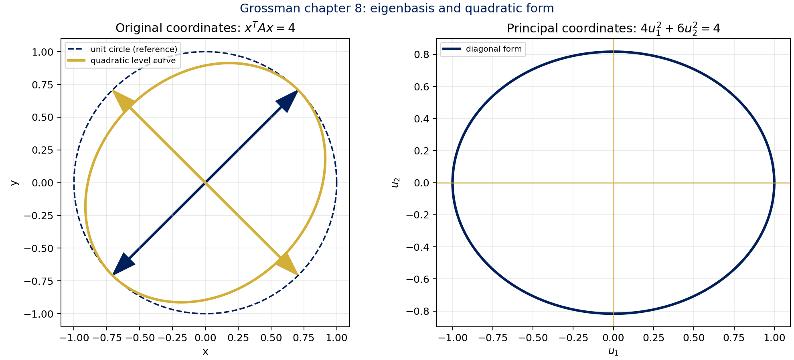

La figura compara una forma cuadrática en coordenadas originales con sus ejes propios; visualmente, la diagonalización ortogonal elimina el término cruzado y alinea la elipse con los autovectores.

## [Enriquecimiento Web / Referencias Externas]

Estas referencias complementan la exposición de Grossman sin sustituirla:

- **SymPy — documentación oficial de matrices:** [Matrices (linear algebra)](https://docs.sympy.org/latest/modules/matrices/matrices.html). La API documenta matrices exactas, `eigenvals()`, `eigenvects()`, `diagonalize()`, `jordan_form()` y `GramSchmidt()`, herramientas coherentes con las verificaciones simbólicas de esta nota.
- **SciPy — documentación oficial:** [`scipy.linalg.eig`](https://docs.scipy.org/doc/scipy/reference/generated/scipy.linalg.eig.html). `eig` resuelve problemas propios ordinarios y generalizados; sus autovectores derechos aparecen como columnas normalizadas. Para matrices simétricas/hermitianas, la documentación remite a `scipy.linalg.eigh`, elección numéricamente especializada.
- **Fuente académica — MIT OpenCourseWare, 18.06 Linear Algebra:** [Lecture 21: Eigenvalues and eigenvectors](https://ocw.mit.edu/courses/18-06-linear-algebra-spring-2010/resources/lecture-21-eigenvalues-and-eigenvectors/), [Lecture 22: Diagonalization and powers of A](https://ocw.mit.edu/courses/18-06-linear-algebra-spring-2010/resources/lecture-22-diagonalization-and-powers-of-a/) y [Lecture 28: Similar matrices and Jordan form](https://ocw.mit.edu/courses/18-06-linear-algebra-spring-2010/resources/lecture-28-similar-matrices-and-jordan-form/). El material universitario de Gilbert Strang refuerza la lectura geométrica de $Ax=\lambda x$, el uso de una base propia para potencias y la forma de Jordan como representante canónico de una clase de semejanza.

> [!warning] Lectura crítica de software
> Un resultado numérico cercano a una raíz múltiple puede ocultar la multiplicidad geométrica real. Para decidir diagonalizabilidad conviene usar entradas exactas y espacios nulos con SymPy; para matrices grandes, contrastar residuales, condicionamiento y elección de `eig`/`eigh` en SciPy.

## Resumen operativo

| Pregunta | Herramienta principal | Resultado |
|---|---|---|
| ¿Qué direcciones conserva $A$? | $\det(A-\lambda I)=0$ y $\ker(A-\lambda I)$ | Valores, vectores y espacios propios |
| ¿Puedo simplificar potencias? | $A=CDC^{-1}$ | $A^m=CD^mC^{-1}$ |
| ¿Puedo usar una base ortonormal? | $A=A^T$ | $A=QDQ^T$ |
| ¿Qué hago si faltan vectores propios? | Cadenas generalizadas | $A=CJC^{-1}$ |
| ¿Cómo resuelvo $x'=Ax$? | Exponencial matricial | $x(t)=e^{At}x_0$ |
| ¿Cómo reduzco potencias o calculo una inversa? | Cayley-Hamilton | $p_A(A)=0$ |
| ¿Dónde están los valores propios? | Discos de Gershgorin | $\sigma(A)\subseteq\bigcup_iD_i$ |

## Conexiones


---

**Cierre:** el capítulo conecta una ecuación determinantal con geometría, dinámica discreta, ecuaciones diferenciales, formas cuadráticas y cotas espectrales. La decisión estructural es siempre la misma: identificar el espectro y medir cuántas direcciones propias independientes aporta cada valor propio.

---

## Teorema de Resumen Global (Sistemas, Inversas y Rangos)

> [!theorem] Teorema de Resumen Unificado (Grossman 7ª Ed.)
> Sea $A \in \mathcal{M}_n(\mathbb{K})$ una matriz cuadrada de orden $n$. Las siguientes afirmaciones son equivalentes:
> 1. $A$ es **invertible** ($A^{-1}$ existe).
> 2. El sistema homogéneo $A\mathbf{x} = \mathbf{0}$ tiene **únicamente la solución trivial** $\mathbf{x} = \mathbf{0}$.
> 3. El sistema $A\mathbf{x} = \mathbf{b}$ tiene **solución única** $\mathbf{x} = A^{-1}\mathbf{b}$ para todo $\mathbf{b} \in \mathbb{K}^n$.
> 4. $A$ es **equivalente por filas a la matriz identidad** $I_n$ ($A \rightsquigarrow I_n$ mediante OEF).
> 5. $A$ se puede expresar como un **producto finito de matrices elementales**.
> 6. El determinante de $A$ es no nulo: **$\det(A) \neq 0$**.
> 7. Las columnas (y filas) de $A$ son **linealmente independientes** en $\mathbb{K}^n$.
> 8. Las columnas (y filas) de $A$ **generan a $\mathbb{K}^n$** y constituyen una **base de $\mathbb{K}^n$**.
> 9. El **rango** de $A$ es máximo: $\operatorname{rg}(A) = n$.
> 10. La **nulidad** de $A$ es cero: $\operatorname{null}(A) = 0$.
> 11. El número $0$ **no es valor propio** de $A$ (todos los autovalores son no nulos).
> 12. La transformación lineal $T_A(\mathbf{x}) = A\mathbf{x}$ es un **isomorfismo**.

---

## Enlaces Relacionados
- [Nota Maestra — Sheldon Axler](../Axler/Axler_Linear_Algebra_Done_Right.md)
- [Nota Maestra — Matrices y Sistemas](../../Unidad_1_Matrices_y_Sistemas/Matrices.md)

---
