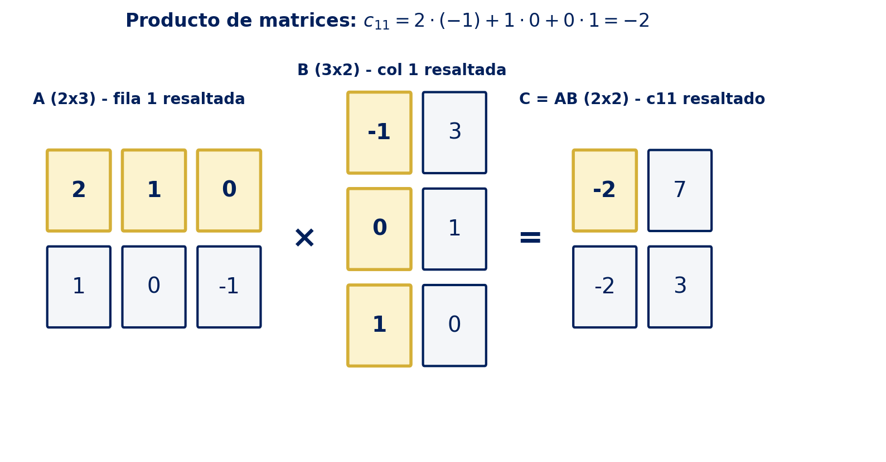
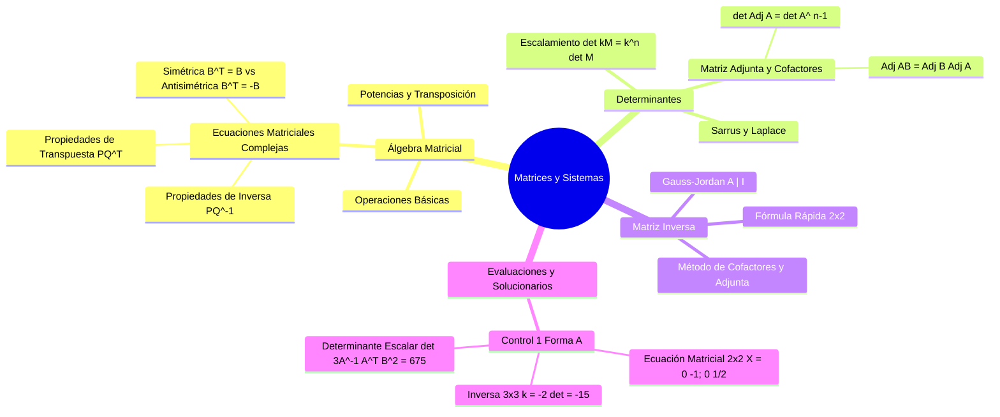

# Matrices

> [!NOTE]
> Una **matriz de orden $m \times n$** es un arreglo rectangular de números en $m$ filas y $n$ columnas, y constituye la herramienta central para representar y resolver sistemas de ecuaciones lineales, despejar ecuaciones matriciales avanzadas y modelar transformaciones lineales.

> [!abstract] Leyenda de Trazabilidad de Fuentes
> Con el fin de garantizar la máxima claridad académica y procedencia de los contenidos, cada sección y teorema incluye etiquetas explícitas:
> - 🎓 `[Cátedra USS / Diapositivas Docente]`: Contenido visto directamente en clases y pautas de la docente Carol Asencio González (USS, Sede Patagonia).
> - 📖 `[Texto Guía — Axler / Chang / Aranda]`: Profundizaciones teóricas, demostraciones o formalismos extraídos de la bibliografía oficial del curso.
> - 🌐 `[Enriquecimiento Web / Referencias Externas]`: Contexto complementario, aplicaciones del mundo real y verificación simbólica avanzada.

---

## ⚡ Ficha de Consulta Rápida — Propiedades de Matrices y Determinantes

> [!tip] Resumen de Consulta Rápida 🎓 [Cátedra USS — Carol Asencio G.]
> Esta tabla condensa todas las identidades y teoremas de examen para consulta inmediata durante talleres y evaluaciones.

| Categoría | Propiedades y Fórmulas Clave |
|:---|:---|
| **I. Suma y Escalar** | • $A + B = B + A$ (conmutativa)<br>• $A + (B + C) = (A + B) + C$ (asociativa)<br>• $\alpha(A + B) = \alpha A + \alpha B$ y $(\alpha + \beta)A = \alpha A + \beta A$<br>• $\alpha(\beta A) = (\alpha\beta)A$<br>• $A + \mathbf{0} = A$ y $A + (-A) = \mathbf{0}$ |
| **II. Multiplicación** | • $A(B + C) = AB + AC$ y $(A + B)C = AC + BC$<br>• $A(BC) = (AB)C$<br>• $\alpha(AB) = (\alpha A)B = A(\alpha B)$<br>• $A\mathbf{0} = \mathbf{0}A = \mathbf{0}$ y $BI = IB = B$<br>• ⚠️ **$AB \neq BA$ en general** (no conmutativa)<br>• ⚠️ **$AB = \mathbf{0} \not\implies A = \mathbf{0} \lor B = \mathbf{0}$** (existen divisores de cero)<br>• ⚠️ **$AB = AC \not\implies B = C$** (no cancelable salvo si $A$ es invertible) |
| **III. Transpuesta** | • $(A^T)^T = A$<br>• $(A + B)^T = A^T + B^T$<br>• $(AB)^T = B^T A^T$ (**invierte el orden**) |
| **IV. Matriz Inversa** | • $A^{-1}$ es **única**<br>• $(A^{-1})^{-1} = A$<br>• $(AB)^{-1} = B^{-1} A^{-1}$ (**invierte el orden**)<br>• $(\alpha A)^{-1} = \dfrac{1}{\alpha} A^{-1} \quad (\alpha \neq 0)$<br>• $(A^T)^{-1} = (A^{-1})^T$<br>• $A^{-1} = \dfrac{1}{\det(A)} \mathrm{Adj}(A) \quad (\det A \neq 0)$ |
| **V. Determinantes** | • $\det(A) = \det(A^T)$<br>• $\det(\alpha A) = \alpha^n \det(A)$ con $n = \text{orden de } A$<br>• $\det(AB) = \det(A)\det(B)$<br>• $\det(I) = 1$ y $\det(A^k) = [\det(A)]^k$<br>• $\det(A^{-1}) = \dfrac{1}{\det(A)}$<br>• $\det(\mathrm{Adj} A) = (\det A)^{n-1}$<br>• Fila/columna nula, igual o proporcional $\implies \det(A) = 0$<br>• Intercambiar 2 filas/columnas $\implies$ cambia de signo ($-\det$)<br>• Sumar múltiplo de una fila a otra $\implies$ **no varía** el $\det$<br>• Triangular / Diagonal $\implies \det(A) = \prod_{i=1}^n a_{ii}$<br>• $A$ es singular $\iff \det(A) = 0$; $A$ no singular (invertible) $\iff \det(A) \neq 0$ |
| **VI. Matriz Ortogonal** | • $A^T = A^{-1} \iff A A^T = A^T A = I$<br>• Consecuencia: $\det(A) = \pm 1$ |
| **VII. Simétricas y Antisimétricas** | • **Simétrica:** $A^T = A \iff a_{ij} = a_{ji}$<br>• **Antisimétrica:** $A^T = -A \iff a_{ij} = -a_{ji}$ (diagonal principal $a_{ii} = 0$) |
| **VIII. Idempotentes y Nilpotentes** | • **Idempotente:** $A^2 = A$ (autovalores $\lambda \in \{0, 1\}$)<br>• **Nilpotente:** $\exists\, k \in \mathbb{Z}^+$ tal que $A^k = \mathbf{0}$<br>• **Índice de Nilpotencia:** el menor entero positivo $k$ tal que $A^k = \mathbf{0}$ |
| **IX. Rango de una Matriz** | • $0 \le \mathrm{rg}(A) \le \min(m, n)$<br>• $\mathrm{rg}(A^T) = \mathrm{rg}(A)$<br>• $A_{n\times n} \text{ invertible} \iff \mathrm{rg}(A) = n$ (rango completo)<br>• $\mathrm{rg}(AB) \le \min(\mathrm{rg}(A), \mathrm{rg}(B))$<br>• $\mathrm{rg}(PAQ) = \mathrm{rg}(A)$ si $P, Q$ son invertibles<br>• $\mathrm{rg}(A) + \mathrm{nulidad}(A) = n$ (Teorema Rango-Nulidad) |

---

## 1. Definición y Tipos de Matrices

### 1.1 Definición y Notación

Una **matriz de orden $m \times n$** con coeficientes en un cuerpo $\mathbb{K}$ (usualmente $\mathbb{K} = \mathbb{R}$ o $\mathbb{K} = \mathbb{C}$) es un arreglo rectangular de $m$ filas y $n$ columnas:

$$
A = (a_{ij}) = \begin{pmatrix}
a_{11} & a_{12} & \dots & a_{1n} \\
a_{21} & a_{22} & \dots & a_{2n} \\
\vdots & \vdots & \ddots & \vdots \\
a_{m1} & a_{m2} & \dots & a_{mn}
\end{pmatrix} \in \mathcal{M}_{m\times n}(\mathbb{K})
$$

donde $a_{ij}$ es el elemento ubicado en la **fila $i$** y la **columna $j$**, con $1 \le i \le m$ y $1 \le j \le n$.

- **Orden:** $m \times n$ (filas × columnas). Si $m = n$ se dice **cuadrada de orden $n$**.
- **Conjunto:** $A \in \mathcal{M}_{m\times n}(\mathbb{K})$ (y $\mathcal{M}_n(\mathbb{K})$ para matrices cuadradas).
- **Igualdad de matrices:** dos matrices $A$ y $B$ son iguales ($A = B$) **si y solo si** tienen el mismo orden y $a_{ij} = b_{ij}$ para todos los pares $(i,j)$, es decir, coinciden coeficiente a coeficiente en todas las posiciones.

> [!example]
> $A = \begin{pmatrix} 4 & -2 & 1 & 0 \\ 1 & 3 & -5 & 9 \end{pmatrix}$ es de orden $2\times4$. Aquí $a_{11}=4$, $a_{23}=-5$; $a_{32}$ **no existe** (solo hay 2 filas). La matriz $B = \begin{pmatrix} 4 & -2 \\ 1 & 3 \end{pmatrix}$ **no es igual** a $A$: tiene distinto orden.

### 1.2 Tipos de Matrices

| Tipo | Orden | Característica | Ejemplo |
|:---|:---:|:---|:---|
| **Nula** $\mathbf{0}$ | cualquiera | todos sus elementos son 0 | $\begin{pmatrix} 0 & 0 \\\\ 0 & 0 \end{pmatrix}$ |
| **Cuadrada** | $n\times n$ | $m = n$ | $\begin{pmatrix} 1 & 2 \\\\ 3 & 4 \end{pmatrix}$ |
| **Diagonal** | $n\times n$ | $a_{ij} = 0$ si $i \neq j$ | $\begin{pmatrix} 1 & 0 & 0 \\\\ 0 & 3 & 0 \\\\ 0 & 0 & -1 \end{pmatrix}$ |
| **Identidad** $I_n$ | $n\times n$ | diagonal con $a_{ii} = 1$ | $\begin{pmatrix} 1 & 0 \\\\ 0 & 1 \end{pmatrix}$ |
| **Triangular superior** | $n\times n$ | $a_{ij} = 0$ si $i > j$ | $\begin{pmatrix} 4 & 2 & 1 \\\\ 0 & 0 & 3 \\\\ 0 & 0 & 1 \end{pmatrix}$ |
| **Triangular inferior** | $n\times n$ | $a_{ij} = 0$ si $i < j$ | $\begin{pmatrix} 4 & 0 & 0 \\\\ 2 & 1 & 0 \\\\ 1 & 2 & 3 \end{pmatrix}$ |
| **Simétrica** | $n\times n$ | $A = A^T$ | $\begin{pmatrix} -1 & 2 \\\\ 2 & 0 \end{pmatrix}$ |
| **Antisimétrica** | $n\times n$ | $A = -A^T$ (diagonal nula $a_{ii} = 0$) | $\begin{pmatrix} 0 & 1 \\\\ -1 & 0 \end{pmatrix}$ |
| **Ortogonal** | $n\times n$ | $A^T = A^{-1}$ (o $AA^T = A^TA = I_n$) | $\begin{pmatrix} \cos\theta & -\sin\theta \\\\ \sin\theta & \cos\theta \end{pmatrix}$ |
| **Idempotente** | $n\times n$ | $A^2 = A$ | $\begin{pmatrix} 1 & 0 \\\\ 0 & 0 \end{pmatrix}$ |
| **Nilpotente** (de índice $k$) | $n\times n$ | $\exists\, k \in \mathbb{Z}^+$: $A^k = \mathbf{0}$ | $\begin{pmatrix} 0 & 1 \\\\ 0 & 0 \end{pmatrix}$ (índice 2) |

**Diagonal principal:** los elementos $a_{ii}$ con $i = j$.

**Traza:** suma de los elementos de la diagonal principal:

$$
\mathrm{tr}(A) = \sum_{i=1}^{n} a_{ii}
$$

Propiedades: $\mathrm{tr}(A+B) = \mathrm{tr}(A) + \mathrm{tr}(B)$, $\mathrm{tr}(\alpha A) = \alpha\,\mathrm{tr}(A)$, $\mathrm{tr}(A^T) = \mathrm{tr}(A)$, $\mathrm{tr}(AB) = \mathrm{tr}(BA)$.

> [!abstract] Matriz Ortogonal 🎓 [Cátedra USS / Diapositivas Docente]
> Una **matriz ortogonal** es una matriz cuadrada real $A \in \mathcal{M}_n(\mathbb{R})$ que cumple:
>
> $$
> A^T = A^{-1} \quad \Longleftrightarrow \quad A A^T = A^T A = I_n
> $$
>
> **Interpretación geométrica:** sus columnas (y filas) forman una **base ortonormal** de $\mathbb{R}^n$; multiplicar por $A$ preserva normas y productos internos (una rotación o reflexión).
>
> **Demostración de que $\det(A) = \pm 1$:** tomando determinantes en $A A^T = I_n$,
>
> $$
> \det(A A^T) = \det(I_n) \implies \det(A)\,\det(A^T) = 1 \implies [\det(A)]^2 = 1 \implies \det(A) = \pm 1
> $$
>
> donde se usó $\det(A^T) = \det(A)$. **Cuidado:** el recíproco es falso ($\det(A) = \pm 1$ no basta para que $A$ sea ortogonal).

> [!abstract] Matriz Idempotente 🎓 [Cátedra USS / Diapositivas Docente]
> Una **matriz idempotente** es una matriz cuadrada $A \in \mathcal{M}_n(\mathbb{K})$ que cumple $A^2 = A$.
>
> **Propiedades:**
> - Si $A$ es idempotente e **invertible**, entonces $A = I_n$: de $A^2 = A$ se premultiplica por $A^{-1}$ obteniendo $A = I_n$.
> - Los únicos autovalores posibles de $A$ son $\lambda \in \{0, 1\}$.
> - $\mathrm{tr}(A)$ coincide con la dimensión de la imagen (el rango de la proyección).

> [!abstract] Matriz Nilpotente e Índice de Nilpotencia 🎓 [Cátedra USS / Diapositivas Docente]
> Una **matriz nilpotente** es una matriz cuadrada $A \in \mathcal{M}_n(\mathbb{K})$ para la cual existe $k \in \mathbb{Z}^+$ tal que $A^k = \mathbf{0}$. El **índice de nilpotencia** es el menor entero positivo $k$ con esa propiedad.

### 1.3 Matrices Triangulares y Diagonales (Detalle)

> [!abstract] Definición Formal
> Sea $A = (a_{ij}) \in \mathcal{M}_n(\mathbb{K})$ una matriz cuadrada de orden $n$. Se dice que:
> - $A$ es **triangular superior** si $a_{ij} = 0 \ \forall\, i > j$.
> - $A$ es **triangular inferior** si $a_{ij} = 0 \ \forall\, i < j$.
> - $A$ es **diagonal** si $a_{ij} = 0 \ \forall\, i \neq j$.

**Propiedades algebraicas:**
1. **Cerradura:** si $A$ y $B$ son triangulares superiores (resp. inferiores), $A + B$ y $AB$ también lo son.
2. **Determinante:** el determinante de una matriz triangular o diagonal es el producto de los elementos de su diagonal principal: $\det(A) = \prod_{i=1}^n a_{ii}$.
3. **Invertibilidad:** una matriz triangular es invertible **si y solo si** todos los elementos de su diagonal son no nulos ($a_{ii} \neq 0 \ \forall i$).

---

## 2. Álgebra de Matrices (Operaciones)

### 2.1 Suma y Resta

Dos matrices del mismo orden se suman o restan componente a componente: $(A \pm B)_{ij} = a_{ij} \pm b_{ij}$.

### 2.2 Ponderación por Escalar

Multiplicar una matriz por $\alpha \in \mathbb{K}$ afecta a cada entrada: $(\alpha A)_{ij} = \alpha\, a_{ij}$.

### 2.3 Multiplicación de Matrices

El producto $A_{m\times n} \cdot B_{n\times p} = C_{m\times p}$ está definido si y solo si las columnas de $A$ coinciden con las filas de $B$:

$$
c_{ij} = \sum_{k=1}^{n} a_{ik}\, b_{kj} = a_{i1}b_{1j} + a_{i2}b_{2j} + \cdots + a_{in}b_{nj}
$$



> [!warning]
> **El producto de matrices NO es conmutativo.** En general $AB \neq BA$. Además, existen **divisores de cero** ($AB = \mathbf{0}$ con $A \neq \mathbf{0}$ y $B \neq \mathbf{0}$) y falta de ley de cancelación ($AB = AC \not\implies B = C$ salvo si $A$ es invertible).

### 2.4 Potencias de una Matriz

Para matrices cuadradas se define $A^0 = I_n$ y $A^{k+1} = A^k \cdot A$.

### 2.5 Propiedades del Álgebra Matricial y Transposición

| Propiedad | Fórmula |
|:---|:---|
| Asociatividad | $(AB)C = A(BC)$ |
| Distributividad | $A(B+C) = AB + AC$ y $(B+C)A = BA + CA$ |
| Doble transpuesta | $(A^T)^T = A$ |
| Suma transpuesta | $(A+B)^T = A^T + B^T$ |
| Producto transpuesta | $(AB)^T = B^T A^T$ (**invierte el orden**) |

---

## 3. Determinantes

### 3.1 Definición y Cálculo

El determinante $\det: \mathcal{M}_n(\mathbb{K}) \to \mathbb{K}$ asigna a cada matriz cuadrada un escalar:
- **Orden 2:** $\det\begin{pmatrix} a & b \\ c & d \end{pmatrix} = ad - bc$
- **Orden 3 (Sarrus):** $\det\begin{pmatrix} a & b & c \\ d & e & f \\ g & h & i \end{pmatrix} = aei + bfg + cdh - ceg - afh - bdi$

> [!tip] Conexión con Geometría en $\mathbb{R}^3$ (Unidad 2)
> El determinante de orden 3 constituye la base algebraica del producto cruz y del triple producto escalar (cálculo de áreas, volúmenes de paralelepípedos y coplanaridad). Véase: `Unidad 2: Vectores en R² y R³ — Producto Cruz y Triple Producto Escalar`.

### 3.2 Menor y Cofactor

- **Menor $M_{ij}$:** determinante de la submatriz $(n-1)\times(n-1)$ eliminando la fila $i$ y la columna $j$.
- **Cofactor $C_{ij}$:** $C_{ij} = (-1)^{i+j}\, M_{ij}$.

### 3.3 Desarrollo de Laplace

Expandiendo por la fila $i$ o la columna $j$:

$$
\det(A) = \sum_{j=1}^{n} a_{ij}\, C_{ij} = \sum_{i=1}^{n} a_{ij}\, C_{ij}
$$

### 3.4 Propiedades de los Determinantes

| Propiedad | Fórmula |
|:---|:---|
| Identidad | $\det(I_n) = 1$ |
| Producto | $\det(AB) = \det(A)\,\det(B)$ |
| Escalar | $\det(\alpha A) = \alpha^n \det(A)$ (para $A \in \mathcal{M}_n$) |
| Potencia | $\det(A^k) = [\det(A)]^k$ |
| Transpuesta | $\det(A^T) = \det(A)$ |
| Inversa | $\det(A^{-1}) = \dfrac{1}{\det(A)}$ |
| Criterio global | $A$ invertible $\iff \det(A) \neq 0$ |

### 3.5 Tabla Resumen de Propiedades Avanzadas 🎓 [Cátedra USS] 🌐 [Referencias]

> [!important] Identidades Avanzadas de Determinantes y Adjuntas
> La siguiente tabla agrupa identidades teoremas fundamentales requeridas en demostraciones y certámenes de nivel universitario:

| Propiedad / Objeto | Fórmula Algebraica | Condiciones y Demostración Breve |
|:---|:---|:---|
| **Escalar en Determinante** | $\det(k \cdot M) = k^n \det(M)$ | Para $M \in \mathcal{M}_n(\mathbb{K})$. Cada una de las $n$ filas se escala por $k$. |
| **Adjunta de un Producto** | $\mathrm{Adj}(AB) = \mathrm{Adj}(B) \mathrm{Adj}(A)$ | Es homomorfa a la regla de la transpuesta e inversa (invierte el orden). |
| **Determinante de la Adjunta** | $\det(\mathrm{Adj} A) = (\det A)^{n-1}$ | **Demostración:** De $A \cdot \mathrm{Adj}(A) = \det(A) I_n$, tomando $\det$:<br>$\det(A)\det(\mathrm{Adj} A) = \det(\det(A)I_n) = (\det A)^n$. Si $\det A \neq 0$, se despeja $(\det A)^{n-1}$. |
| **Transpuesta de la Adjunta** | $\mathrm{Adj}(A^T) = [\mathrm{Adj}(A)]^T$ | La adjunta conmuta con la operación de transposición. |
| **Inversa de la Adjunta** | $\mathrm{Adj}(A^{-1}) = [\mathrm{Adj}(A)]^{-1} = \dfrac{1}{\det A} A$ | Válido para toda matriz no singular $A \in \mathcal{M}_n(\mathbb{K})$. |
| **Adjunta de la Adjunta** | $\mathrm{Adj}(\mathrm{Adj} A) = (\det A)^{n-2} A$ | Para $n \ge 2$. Permite simplificar expresiones iteradas de adjuntas. |

---

## 4. Matriz Inversa y Operaciones Elementales

### 4.1 Definición

Una matriz cuadrada $A \in \mathcal{M}_n(\mathbb{K})$ es **invertible** si existe $A^{-1} \in \mathcal{M}_n(\mathbb{K})$ tal que $A A^{-1} = A^{-1} A = I_n$.

### 4.2 Fórmula Rápida para Matrices $2 \times 2$

$$
A = \begin{pmatrix} a & b \\ c & d \end{pmatrix} \implies A^{-1} = \frac{1}{ad-bc} \begin{pmatrix} d & -b \\ -c & a \end{pmatrix} \quad (\text{si } ad-bc \neq 0)
$$

### 4.3 Método de la Matriz Adjunta (Cofactores) 🎓 [Cátedra USS / Diapositivas Docente]

Dada $A \in \mathcal{M}_n(\mathbb{K})$, se define la **matriz de cofactores** $\mathrm{Cof}(A) = (C_{ij})$ y la **matriz adjunta** $\mathrm{Adj}(A) = [\mathrm{Cof}(A)]^T$. Si $\det(A) \neq 0$:

$$
\boxed{\,A^{-1} = \frac{1}{\det(A)} \mathrm{Adj}(A) = \frac{1}{\det(A)} [\mathrm{Cof}(A)]^T\,}
$$

### 4.4 Operaciones Elementales por Filas (OEF)

1. Intercambio: $F_i \leftrightarrow F_j$
2. Escalamiento: $F_i \to c F_i$ ($c \neq 0$)
3. Combinación lineal: $F_i \to F_i + k F_j$

### 4.5 Algoritmo de Eliminación Gaussiana y Estrategia de Mínimos Pasos

#### 4.5.1 Definición Rigurosa: REF vs RREF

- **REF (Forma Escalonada por Filas):** pivotes escalonados y ceros debajo del pivote.
- **RREF (Forma Escalonada Reducida por Filas):** pivotes iguales a $1$ y ceros tanto abajo como **arriba** de cada pivote. Es **única y canónica**.

#### 4.5.2 Heurísticas de Optimización

1. **Priorizar pivotes $\pm 1$:** aplicar intercambios $F_i \leftrightarrow F_j$ o restas de filas para generar un $1$ sin fracciones.
2. **Combinación entera cruzada:** $F_i \to a_{kk} F_i - a_{ik} F_k$ evita denominadores prematuros.
3. **Anulación en bloque:** ejecutar todas las OEF de una columna en una única matriz intermedia.

### 4.6 Cálculo de Inversa mediante Gauss-Jordan $[A \mid I_n]$

$$
(A \mid I_n) \xrightarrow{\text{Gauss-Jordan}} (I_n \mid A^{-1})
$$

---

### 4.7 Ecuaciones Matriciales Complejas e Inversión 🎓 [Cátedra USS / Guía Docente]

> [!abstract] Fundamentos del Despeje Matricial
> En el álgebra matricial no existe la operación de división. Para despejar una matriz incógnita $X$:
> 1. **Atención al orden de multiplicación:** $A X = B \implies X = A^{-1} B$, mientras que $X A = B \implies X = B A^{-1}$.
> 2. **Propiedad de la Inversa del Producto:** $(P Q)^{-1} = Q^{-1} P^{-1}$ (**invierte el orden**).
> 3. **Propiedad de la Transpuesta del Producto:** $(P Q)^T = Q^T P^T$ (**invierte el orden**).
> 4. **Matriz Simétrica vs Antisimétrica:** $B^T = B$ (simétrica) y $B^T = -B$ (antisimétrica).

#### 📘 Problema Resuelto 1: Ecuación con Matriz Antisimétrica 🎓 [Guía Ecuaciones Matriciales — Ejercicio 1]

> [!example] Enunciado
> Sean $A, B, C \in \mathcal{M}_3(\mathbb{R})$, donde $B$ es antisimétrica ($B^T = -B$), $C$ es regular (invertible), y la matriz $A$ está dada por:
>
> $$
> A = \begin{pmatrix} -5 & -1 & -1 \\ 0 & -1 & 0 \\ 2 & 0 & 1 \end{pmatrix}
> $$
>
> Obtener, si es posible, la matriz $X \in \mathcal{M}_3(\mathbb{R})$ a partir de la ecuación:
>
> $$
> (B^T C^T)^T + (X^{-1} C^{-1})^{-1} = (A C^{-1})^{-1} - C B^T
> $$

**Despeje Algebraico Riguroso Paso a Paso:**

1. **Transposición del primer término:** Aplicando $(P Q)^T = Q^T P^T$ y la involución de la transpuesta:
   $$
   (B^T C^T)^T = (C^T)^T (B^T)^T = C B
   $$
2. **Inversión del segundo término:** Aplicando $(P Q)^{-1} = Q^{-1} P^{-1}$ y la involución de la inversa:
   $$
   (X^{-1} C^{-1})^{-1} = (C^{-1})^{-1} (X^{-1})^{-1} = C X
   $$
3. **Inversión del miembro derecho:**
   $$
   (A C^{-1})^{-1} = (C^{-1})^{-1} A^{-1} = C A^{-1}
   $$
4. **Sustitución de la propiedad de antisimetría ($B^T = -B$):**
   $$
   -C B^T = -C(-B) = C B
   $$
5. **Reemplazo global en la ecuación:**
   $$
   C B + C X = C A^{-1} + C B
   $$
6. **Cancelación por resta:** Restando la matriz $C B$ en ambos miembros:
   $$
   C X = C A^{-1}
   $$
7. **Premultiplicación por $C^{-1}$ (existente pues $C$ es regular):**
   $$
   C^{-1} (C X) = C^{-1} (C A^{-1}) \implies (C^{-1} C) X = (C^{-1} C) A^{-1} \implies I_3 X = I_3 A^{-1} \implies \mathbf{X = A^{-1}}
   $$

**Cálculo Numérico de $X = A^{-1}$ mediante la Matriz Adjunta:**

Dada $A = \begin{pmatrix} -5 & -1 & -1 \\ 0 & -1 & 0 \\ 2 & 0 & 1 \end{pmatrix}$, calculamos su determinante expandiendo por la **segunda fila** (que posee dos ceros):

$$
\det(A) = a_{22} C_{22} = (-1) \cdot (-1)^{2+2} \begin{vmatrix} -5 & -1 \\ 2 & 1 \end{vmatrix} = (-1) \cdot [(-5)(1) - (-1)(2)] = (-1) \cdot (-3) = \mathbf{3} \neq 0
$$

Calculamos los 9 cofactores $C_{ij} = (-1)^{i+j} M_{ij}$:

- $C_{11} = + \begin{vmatrix} -1 & 0 \\ 0 & 1 \end{vmatrix} = -1$
- $C_{12} = - \begin{vmatrix} 0 & 0 \\ 2 & 1 \end{vmatrix} = 0$
- $C_{13} = + \begin{vmatrix} 0 & -1 \\ 2 & 0 \end{vmatrix} = 2$
- $C_{21} = - \begin{vmatrix} -1 & -1 \\ 0 & 1 \end{vmatrix} = 1$
- $C_{22} = + \begin{vmatrix} -5 & -1 \\ 2 & 1 \end{vmatrix} = -3$
- $C_{23} = - \begin{vmatrix} -5 & -1 \\ 2 & 0 \end{vmatrix} = -2$
- $C_{31} = + \begin{vmatrix} -1 & -1 \\ -1 & 0 \end{vmatrix} = -1$
- $C_{32} = - \begin{vmatrix} -5 & -1 \\ 0 & 0 \end{vmatrix} = 0$
- $C_{33} = + \begin{vmatrix} -5 & -1 \\ 0 & -1 \end{vmatrix} = 5$

Formamos la matriz de cofactores $\mathrm{Cof}(A)$ y su transpuesta $\mathrm{Adj}(A)$:

$$
\mathrm{Cof}(A) = \begin{pmatrix} -1 & 0 & 2 \\ 1 & -3 & -2 \\ -1 & 0 & 5 \end{pmatrix} \implies \mathrm{Adj}(A) = \begin{pmatrix} -1 & 1 & -1 \\ 0 & -3 & 0 \\ 2 & -2 & 5 \end{pmatrix}
$$

Por lo tanto, la matriz solución $X = A^{-1}$ es:

$$
\mathbf{X = \frac{1}{3} \begin{pmatrix} -1 & 1 & -1 \\ 0 & -3 & 0 \\ 2 & -2 & 5 \end{pmatrix} = \begin{pmatrix} -\frac{1}{3} & \frac{1}{3} & -\frac{1}{3} \\[4pt] 0 & -1 & 0 \\[4pt] \frac{2}{3} & -\frac{2}{3} & \frac{5}{3} \end{pmatrix}}
$$

---

#### 📘 Problema Resuelto 2: Ecuación con Matriz Simétrica 🎓 [Guía Ecuaciones Matriciales — Ejercicio 3]

> [!example] Enunciado
> Sean $A, B, C \in \mathcal{M}_2(\mathbb{R})$, tal que $B$ es simétrica ($B^T = B$) y $A$ es regular, donde:
>
> $$
> B = \begin{pmatrix} 2 & 1 \\ 1 & 3 \end{pmatrix}, \qquad C = \begin{pmatrix} 0 & 1 \\ -2 & 4 \end{pmatrix}
> $$
>
> Obtener la matriz $X \in \mathcal{M}_2(\mathbb{R})$ a partir de la ecuación:
>
> $$
> (B^T A^T)^T + (X^{-1} A^{-1})^{-1} = (C A^{-1})^{-1} - 2 A B^T
> $$

**Despeje Algebraico Riguroso Paso a Paso:**

1. **Transposición del producto inicial:** $(B^T A^T)^T = (A^T)^T (B^T)^T = A B$.
2. **Sustitución de simetría ($B^T = B$):** $2 A B^T = 2 A B$.
3. **Inversión de productos:**
   - $(X^{-1} A^{-1})^{-1} = (A^{-1})^{-1} (X^{-1})^{-1} = A X$
   - $(C A^{-1})^{-1} = (A^{-1})^{-1} C^{-1} = A C^{-1}$
4. **Sustitución en la ecuación original:**
   $$
   A B + A X = A C^{-1} - 2 A B
   $$
5. **Agrupación de términos:** Sumando $2 A B$ en ambos lados:
   $$
   3 A B + A X = A C^{-1} \implies A (3 B + X) = A C^{-1}
   $$
6. **Premultiplicación por $A^{-1}$:**
   $$
   A^{-1} A (3 B + X) = A^{-1} A C^{-1} \implies 3 B + X = C^{-1} \implies \mathbf{X = C^{-1} - 3 B}
   $$

**Cálculo Numérico de $X$:**

Calculamos $C^{-1}$ para $C = \begin{pmatrix} 0 & 1 \\ -2 & 4 \end{pmatrix}$:

$$
\det(C) = (0)(4) - (1)(-2) = 2 \implies C^{-1} = \frac{1}{2} \begin{pmatrix} 4 & -1 \\ 2 & 0 \end{pmatrix} = \begin{pmatrix} 2 & -\frac{1}{2} \\ 1 & 0 \end{pmatrix}
$$

Calculamos $3 B$:

$$
3 B = 3 \begin{pmatrix} 2 & 1 \\ 1 & 3 \end{pmatrix} = \begin{pmatrix} 6 & 3 \\ 3 & 9 \end{pmatrix}
$$

Restamos $C^{-1} - 3 B$:

$$
\mathbf{X = \begin{pmatrix} 2 & -\frac{1}{2} \\ 1 & 0 \end{pmatrix} - \begin{pmatrix} 6 & 3 \\ 3 & 9 \end{pmatrix} = \begin{pmatrix} -4 & -\frac{7}{2} \\[4pt] -2 & -9 \end{pmatrix}}
$$


### 4.8 Rango de una Matriz 🎓 [Cátedra USS / Diapositivas Docente] 📖 [Texto Guía — Axler / Grossman]

> [!abstract] Definición Formal del Rango
> Sea $A = (a_{ij}) \in \mathcal{M}_{m\times n}(\mathbb{K})$ una matriz de orden $m \times n$.
> - El **rango filas** de $A$ es el número máximo de vectores fila de $A$ que son **linealmente independientes** en $\mathbb{K}^n$.
> - El **rango columnas** de $A$ es el número máximo de vectores columna de $A$ que son **linealmente independientes** en $\mathbb{K}^m$.
>
> > [!theorem] Teorema Fundamental del Rango
> > Para cualquier matriz $A \in \mathcal{M}_{m\times n}(\mathbb{K})$, el rango filas coincide exactamente con el rango columnas:
> >
> > $$
> > \mathrm{rango}_{\text{filas}}(A) = \mathrm{rango}_{\text{columnas}}(A) = \mathrm{rg}(A)
> > $$
> >
> > Por tanto, el **rango de $A$**, denotado $\mathrm{rg}(A)$, $\mathrm{rango}(A)$ o $\mathrm{rank}(A)$, es un número entero bien definido que cumple:
> >
> > $$
> > 0 \le \mathrm{rg}(A) \le \min(m, n)
> > $$

#### 4.8.1 Métodos de Cálculo del Rango

##### 1. Método por Reducción Gaussiana (OEF a Forma Escalonada)
El rango de una matriz $A$ es igual al **número de pivotes no nulos** (o número de filas no nulas) de cualquier matriz en **Forma Escalonada por Filas (REF)** obtenida mediante operaciones elementales por filas.

> [!important] Invariancia del Rango bajo OEF
> Las operaciones elementales por filas preservan el espacio generado por las filas de la matriz. Por lo tanto:
>
> $$
> A \xrightarrow{\text{OEF}} B \implies \mathrm{rg}(A) = \mathrm{rg}(B)
> $$
>
> En particular, para cualquier matriz elemental $E$ invertible, $\mathrm{rg}(E A) = \mathrm{rg}(A)$.

##### 2. Método por Menores No Nulos (Determinantes)
Un **menor de orden $r$** de $A$ es el determinante de una submatriz cuadrada $r \times r$ obtenida al seleccionar $r$ filas y $r$ columnas de $A$.

> [!theorem] Caracterización del Rango por Menores
> El rango de $A$ es $r$ ($\mathrm{rg}(A) = r$) **si y solo si**:
> 1. Existe al menos un menor de orden $r$ con determinante **distinto de cero** ($\det \neq 0$).
> 2. Todos los menores de orden $r+1$ (si existen) tienen determinante **igual a cero** ($\det = 0$).

#### 4.8.2 Propiedades Fundamentales del Rango

| Propiedad / Teorema | Expresión Matemática | Significado y Demostración Breve |
|:---|:---|:---|
| **Transpuesta** | $\mathrm{rg}(A^T) = \mathrm{rg}(A)$ | El rango de la matriz traspuesta es igual al rango de la matriz original (pues transponer intercambia filas por columnas). |
| **Invertibilidad** | $A_{n \times n} \text{ invertible} \iff \mathrm{rg}(A) = n$ | Una matriz cuadrada de orden $n$ es regular (no singular) $\iff$ tiene **rango completo** ($\mathrm{rg} = n \iff \det A \neq 0$). |
| **Producto General** | $\mathrm{rg}(AB) \le \min(\mathrm{rg}(A), \mathrm{rg}(B))$ | Multiplicar matrices nunca incrementa el rango. |
| **Producto por Matriz Regular** | $\mathrm{rg}(P A Q) = \mathrm{rg}(A)$ | Si $P_{m \times m}$ y $Q_{n \times n}$ son invertibles, la multiplicación por izquierda/derecha **conserva exactamente el rango**. |
| **Desigualdad Subaditiva** | $\mathrm{rg}(A + B) \le \mathrm{rg}(A) + \mathrm{rg}(B)$ | El rango de la suma de dos matrices está acotado por la suma de sus rangos. |
| **Teorema Rango-Nulidad** | $\mathrm{rg}(A) + \mathrm{nulidad}(A) = n$ | Para $A \in \mathcal{M}_{m \times n}(\mathbb{K})$, $\mathrm{nulidad}(A) = \dim(\mathrm{Nul} A)$ es el número de variables libres del sistema homogéneo $A\mathbf{x} = \mathbf{0}$. |

> [!example] Ejemplo Ilustrativo de Cálculo de Rango 🎓 [Cátedra USS]
> Dada la matriz $3 \times 4$:
>
> $$
> A = \begin{pmatrix} 1 & -2 & 3 & 1 \\ -1 & 4 & 5 & 2 \\ -3 & 6 & -9 & -3 \end{pmatrix}
> $$
>
> **Método 1 (Eliminación Gaussiana):**
> $$
> \begin{pmatrix} 1 & -2 & 3 & 1 \\ -1 & 4 & 5 & 2 \\ -3 & 6 & -9 & -3 \end{pmatrix}
> \xrightarrow{\substack{F_2 \to F_2 + F_1 \\ F_3 \to F_3 + 3F_1}}
> \begin{pmatrix} \mathbf{1} & -2 & 3 & 1 \\ 0 & \mathbf{2} & 8 & 3 \\ \mathbf{0} & \mathbf{0} & \mathbf{0} & \mathbf{0} \end{pmatrix}
> $$
> Como la matriz escalonada tiene **2 filas no nulas** (2 pivotes no nulos en las columnas 1 y 2), concluimos inmediatamente que:
>
> $$
> \mathrm{rg}(A) = 2
> $$
>
> **Método 2 (Menores no nulos):**
> - Menor $2 \times 2$ no nulo: $\begin{vmatrix} 1 & -2 \\ -1 & 4 \end{vmatrix} = 4 - 2 = 2 \neq 0 \implies \mathrm{rg}(A) \ge 2$.
> - Todos los menores $3 \times 3$ contienen a $F_3 = -3F_1$, por lo que todos se anulan ($\det = 0$). Por lo tanto, $\mathrm{rg}(A) = 2$.

#### 4.8.3 Verificación Computacional en Python (SymPy y NumPy)

```python
import sympy as sp
import numpy as np

# Matriz A de ejemplo
A_sym = sp.Matrix([
    [1, -2, 3, 1],
    [-1, 4, 5, 2],
    [-3, 6, -9, -3]
])

# Rango simbólico exacto y pivotes por RREF
rank_val = A_sym.rank()
rref_mat, pivots = A_sym.rref()

print("Rango simbólico (SymPy):", rank_val)
print("Índices de columnas pivote:", pivots)
print("Forma Escalonada Reducida RREF:\n", rref_mat)

# Rango numérico con NumPy (SVD)
A_num = np.array([
    [1, -2, 3, 1],
    [-1, 4, 5, 2],
    [-3, 6, -9, -3]
], dtype=float)
rank_np = np.linalg.matrix_rank(A_num)
print("Rango numérico (NumPy):", rank_np)
```


---

## 5. Sistemas de Ecuaciones Lineales

### 5.1 Representación Matricial

Un sistema de $m$ ecuaciones con $n$ incógnitas se escribe como $A \mathbf{x} = \mathbf{b}$, con matriz ampliada $(A \mid \mathbf{b})$.

### 5.2 Principio de Superposición en Sistemas Homogéneos

Si $\mathbf{u}$ y $\mathbf{v}$ cumplen $A\mathbf{u} = \mathbf{0}$ y $A\mathbf{v} = \mathbf{0}$, entonces $A(\alpha\mathbf{u} + \beta\mathbf{v}) = \mathbf{0}$ para todo $\alpha, \beta \in \mathbb{K}$. El conjunto solución es el **subespacio nulo** $\mathrm{Nul}(A)$.

### 5.3 Clasificación de Sistemas (Teorema de Rouché-Frobenius)

| Caso | Condición de Rangos | Soluciones |
|:---|:---|:---|
| **Compatible Determinado (SCD)** | $\mathrm{rg}(A) = \mathrm{rg}(A \mid \mathbf{b}) = n$ | Solución **única** |
| **Compatible Indeterminado (SCI)** | $\mathrm{rg}(A) = \mathrm{rg}(A \mid \mathbf{b}) < n$ | **Infinitas** soluciones ($n - \mathrm{rg}$ variables libres) |
| **Incompatible (SI)** | $\mathrm{rg}(A) < \mathrm{rg}(A \mid \mathbf{b})$ | **Sin** solución |

### 5.4 Análisis del "Triángulo de Ceros" tras Eliminación Gaussiana

- Triángulo simétrico completo $\implies$ SCD.
- Filas nulas en $A$ mantenidas en $\mathbf{b} \implies$ SCI.
- Fila $(0 \ \dots \ 0 \mid b_m)$ con $b_m \neq 0 \implies$ SI (inconsistencia $0 = b_m$).

### 5.5 Geometría en $\mathbb{R}^3$ (Planos en el espacio)

- **Intersección en un punto:** SCD ($\mathrm{rg} = 3$).
- **Intersección en una recta:** SCI con 1 parámetro ($\mathrm{rg} = 2$).
- **Planos coincidentes:** SCI con 2 parámetros ($\mathrm{rg} = 1$).
- **Paralelos / Prisma hueco:** SI ($\mathrm{rg}(A) < \mathrm{rg}(A\mid\mathbf{b})$).

> [!info] Desarrollo Completo en Unidad 2
> Para la deducción analítica de planos, vectores normales y las 5 configuraciones espaciales clasificadas por rangos, véase: `Unidad 2: Planos en el Espacio R³ y Clasificación Geométrica con Rouché-Frobenius`.

---

## 6. Regla de Cramer 🎓 [Cátedra USS / Diapositivas Docente] 📖 [Texto Guía — Axler / Grossman]

> [!abstract] Definición y Ámbito de Aplicación
> La **Regla de Cramer** es un método explícito para resolver un sistema de ecuaciones lineales cuadrado mediante el uso directo de **determinantes**.
>
> > [!warning] Condiciones Obligatorias para Aplicar la Regla de Cramer
> > Para que el método sea válido y arroje solución única, se deben cumplir **dos condiciones estrictas**:
> > 1. **Sistema Cuadrado:** El número de ecuaciones $m$ debe ser igual al número de incógnitas $n$ ($m = n$, es decir, la matriz de coeficientes $A \in \mathcal{M}_n(\mathbb{K})$ es cuadrada).
> > 2. **Matriz No Singular (Invertible):** El determinante de la matriz de coeficientes debe ser distinto de cero ($\det(A) \neq 0 \implies \mathrm{rg}(A) = n$).

---

### 6.1 Teorema Formal de la Regla de Cramer

> [!theorem] Teorema de Cramer
> Sea $A \mathbf{x} = \mathbf{b}$ un sistema de $n$ ecuaciones lineales con $n$ incógnitas, donde $A \in \mathcal{M}_n(\mathbb{K})$, $\mathbf{x} = (x_1, x_2, \dots, x_n)^T$ y $\mathbf{b} = (b_1, b_2, \dots, b_n)^T$.
>
> Si $\det(A) \neq 0$, entonces el sistema es **Compatible Determinado (SCD)** y posee una **única solución** dada por:
>
> $$
> \boxed{\,x_i = \frac{\det(A_i)}{\det(A)}, \qquad \text{para } i = 1, 2, \dots, n\,}
> $$
>
> donde $A_i \in \mathcal{M}_n(\mathbb{K})$ es la matriz que resulta de **reemplazar la columna $i$** de la matriz $A$ por el vector de términos independientes $\mathbf{b}$:
>
> $$
> A_i = \begin{pmatrix}
> a_{11} & \dots & b_1 & \dots & a_{1n} \\
> a_{21} & \dots & b_2 & \dots & a_{2n} \\
> \vdots & \ddots & \vdots & \ddots & \vdots \\
> a_{n1} & \dots & b_n & \dots & a_{nn}
> \end{pmatrix} \quad \leftarrow \text{Columna } i \text{ sustituida por } \mathbf{b}
> $$

---

### 6.2 Demostración Rigurosa (vía Matriz Inversa y Cofactores)

> [!tip] Demostración Formal 📖 [Texto Guía — Grossman]
> Como $\det(A) \neq 0$, la matriz $A$ es invertible y su inversa está dada por $A^{-1} = \dfrac{1}{\det(A)} \mathrm{Adj}(A)$, donde $\mathrm{Adj}(A) = [\mathrm{Cof}(A)]^T$.
>
> 1. Multiplicando la ecuación $A \mathbf{x} = \mathbf{b}$ por $A^{-1}$ a la izquierda:
>    $$
>    \mathbf{x} = A^{-1} \mathbf{b} = \frac{1}{\det(A)} \mathrm{Adj}(A) \mathbf{b}
>    $$
> 2. La componente $i$-ésima del vector columna $\mathbf{x}$ viene dada por el producto de la fila $i$ de $\mathrm{Adj}(A)$ con $\mathbf{b}$:
>    $$
>    x_i = \frac{1}{\det(A)} \sum_{j=1}^{n} [\mathrm{Adj}(A)]_{ij} b_j = \frac{1}{\det(A)} \sum_{j=1}^{n} C_{ji} b_j
>    $$
> 3. Por el **Desarrollo de Laplace**, la suma $\sum_{j=1}^{n} b_j C_{ji}$ corresponde exactamente al desarrollo del determinante de la matriz $A_i$ por su columna $i$ (que contiene los elementos $b_j$). Por lo tanto:
>    $$
>    \sum_{j=1}^{n} b_j C_{ji} = \det(A_i) \implies x_i = \frac{\det(A_i)}{\det(A)} \quad \blacksquare
>    $$

---

### 6.3 Ventajas, Limitaciones y Comparación Algorítmica

| Aspecto | Regla de Cramer | Eliminación Gaussiana |
|:---|:---|:---|
| **Cálculo Parcial** | 💡 **Excelente:** permite hallar **una sola incógnita** $x_k$ sin calcular las demás. | Requiere completar la matriz escalonada para todas las variables. |
| **Sistemas Paramétricos** | 💡 **Ideal para $2 \times 2$ y $3 \times 3$:** facilita analizar una variable en función de un parámetro $\alpha$ o $k$. | Requiere pivoteo y control de divisiones por cero en cada OEF. |
| **Complejidad Computacional** | ⚠️ **Ineficiente para $n \ge 4$:** requiere calcular $n+1$ determinantes de orden $n$ (Complejidad $O((n+1)!)$ si se usa Laplace). | 💡 **Eficiente:** $O(n^3)$ operaciones elementales. |
| **Aplicabilidad** | ⚠️ Solo para sistemas cuadrados $n \times n$ con $\det A \neq 0$. | Aplica a cualquier sistema $m \times n$ (compatibles e incompatibles). |

---

### 6.4 Ejemplos Resueltos Paso a Paso

#### 📘 Ejemplo 1: Sistema $2 \times 2$ (Paso a Paso Didáctico)

> [!example] Enunciado
> Resolver mediante la Regla de Cramer el sistema $2 \times 2$:
>
> $$
> \begin{cases}
> 2x + 3y = 7 \\
> 5x - y = 9
> \end{cases}
> $$

**Solución:**

1. **Formulación Matricial $A \mathbf{x} = \mathbf{b}$:**
   $$
   A = \begin{pmatrix} 2 & 3 \\ 5 & -1 \end{pmatrix}, \qquad \mathbf{x} = \begin{pmatrix} x \\ y \end{pmatrix}, \qquad \mathbf{b} = \begin{pmatrix} 7 \\ 9 \end{pmatrix}
   $$

2. **Cálculo del Determinante Principal $\det(A)$:**
   $$
   \det(A) = \begin{vmatrix} 2 & 3 \\ 5 & -1 \end{vmatrix} = (2)(-1) - (3)(5) = -2 - 15 = \mathbf{-17} \neq 0
   $$
   Como $\det(A) = -17 \neq 0$, el sistema es **Compatible Determinado (SCD)** y se aplica Cramer.

3. **Construcción y Determinante de $A_x$ (sustituyendo la columna 1 por $\mathbf{b}$):**
   $$
   A_x = \begin{pmatrix} \mathbf{7} & 3 \\ \mathbf{9} & -1 \end{pmatrix} \implies \det(A_x) = \begin{vmatrix} 7 & 3 \\ 9 & -1 \end{vmatrix} = (7)(-1) - (3)(9) = -7 - 27 = \mathbf{-34}
   $$

4. **Construcción y Determinante de $A_y$ (sustituyendo la columna 2 por $\mathbf{b}$):**
   $$
   A_y = \begin{pmatrix} 2 & \mathbf{7} \\ 5 & \mathbf{9} \end{pmatrix} \implies \det(A_y) = \begin{vmatrix} 2 & 7 \\ 5 & 9 \end{vmatrix} = (2)(9) - (7)(5) = 18 - 35 = \mathbf{-17}
   $$

5. **Cálculo de las Incógnitas:**
   $$
   x = \frac{\det(A_x)}{\det(A)} = \frac{-34}{-17} = \mathbf{2}, \qquad y = \frac{\det(A_y)}{\det(A)} = \frac{-17}{-17} = \mathbf{1}
   $$

6. **Verificación en el Sistema Original:**
   - Ecuación 1: $2(2) + 3(1) = 4 + 3 = 7$ ✓
   - Ecuación 2: $5(2) - (1) = 10 - 1 = 9$ ✓

   **Solución Única:** $(x, y) = (2, 1)$.

---

#### 📘 Ejemplo 2: Sistema $3 \times 3$ (Aplicación en Redes Electromecánicas)

> [!example] Enunciado
> Determinar las corrientes $I_1, I_2, I_3$ (en Amperes) que satisfacen el siguiente sistema de leyes de Kirchoff:
>
> $$
> \begin{cases}
> I_1 + I_2 + I_3 = 6 \\
> 2I_1 - I_2 + I_3 = 3 \\
> I_1 + 2I_2 - I_3 = 3
> \end{cases}
> $$

**Solución:**

1. **Determinante Principal $\det(A)$ (usando Sarrus o Laplace por Fila 1):**
   $$
   A = \begin{pmatrix} 1 & 1 & 1 \\ 2 & -1 & 1 \\ 1 & 2 & -1 \end{pmatrix}
   $$
   $$
   \det(A) = 1 \begin{vmatrix} -1 & 1 \\ 2 & -1 \end{vmatrix} - 1 \begin{vmatrix} 2 & 1 \\ 1 & -1 \end{vmatrix} + 1 \begin{vmatrix} 2 & -1 \\ 1 & 2 \end{vmatrix}
   $$
   $$
   \det(A) = 1(1 - 2) - 1(-2 - 1) + 1(4 - (-1)) = 1(-1) - 1(-3) + 1(5) = -1 + 3 + 5 = \mathbf{7} \neq 0
   $$

2. **Cálculo de $I_1$ con $A_1$ (columna 1 sustituida por $\mathbf{b} = (6, 3, 3)^T$):**
   $$
   \det(A_1) = \begin{vmatrix} \mathbf{6} & 1 & 1 \\ \mathbf{3} & -1 & 1 \\ \mathbf{3} & 2 & -1 \end{vmatrix} = 6(1-2) - 1(-3-3) + 1(6-(-3)) = 6(-1) - 1(-6) + 1(9) = -6 + 6 + 9 = \mathbf{9}
   $$
   $$
   I_1 = \frac{\det(A_1)}{\det(A)} = \mathbf{\frac{9}{7}\text{ A}}
   $$

3. **Cálculo de $I_2$ con $A_2$ (columna 2 sustituida por $\mathbf{b}$):**
   $$
   \det(A_2) = \begin{vmatrix} 1 & \mathbf{6} & 1 \\ 2 & \mathbf{3} & 1 \\ 1 & \mathbf{3} & -1 \end{vmatrix} = 1(-3-3) - 6(-2-1) + 1(6-3) = 1(-6) - 6(-3) + 1(3) = -6 + 18 + 3 = \mathbf{15}
   $$
   $$
   I_2 = \frac{\det(A_2)}{\det(A)} = \mathbf{\frac{15}{7}\text{ A}}
   $$

4. **Cálculo de $I_3$ con $A_3$ (columna 3 sustituida por $\mathbf{b}$):**
   $$
   \det(A_3) = \begin{vmatrix} 1 & 1 & \mathbf{6} \\ 2 & -1 & \mathbf{3} \\ 1 & 2 & \mathbf{3} \end{vmatrix} = 1(-3-6) - 1(6-3) + 6(4-(-1)) = 1(-9) - 1(3) + 6(5) = -9 - 3 + 30 = \mathbf{18}
   $$
   $$
   I_3 = \frac{\det(A_3)}{\det(A)} = \mathbf{\frac{18}{7}\text{ A}}
   $$

5. **Verificación en Ecuación 1:**
   $$
   I_1 + I_2 + I_3 = \frac{9}{7} + \frac{15}{7} + \frac{18}{7} = \frac{42}{7} = 6 \quad \checkmark
   $$

   **Solución Única:** $(I_1, I_2, I_3) = \left(\frac{9}{7}, \frac{15}{7}, \frac{18}{7}\right)$.

---

#### 📘 Ejemplo 3: Sistema Paramétrico en Función de $\alpha \in \mathbb{R}$ 🎓 [Estilo Solemne USS]

> [!example] Enunciado
> Dado el sistema paramétrico:
>
> $$
> \begin{cases}
> x + y + \alpha z = 1 \\
> 2x - y + z = 2 \\
> x + 2y - z = 3
> \end{cases}
> $$
>
> Utilizar la Regla de Cramer para hallar el valor de $z$ en función de $\alpha$, y determinar para qué valor de $\alpha$ el sistema no admite resolución por Cramer.

**Solución:**

1. **Matriz de Coeficientes $A(\alpha)$:**
   $$
   A(\alpha) = \begin{pmatrix} 1 & 1 & \alpha \\ 2 & -1 & 1 \\ 1 & 2 & -1 \end{pmatrix}
   $$

2. **Cálculo de $\det(A(\alpha))$ por Laplace en la primera fila:**
   $$
   \det(A(\alpha)) = 1 \begin{vmatrix} -1 & 1 \\ 2 & -1 \end{vmatrix} - 1 \begin{vmatrix} 2 & 1 \\ 1 & -1 \end{vmatrix} + \alpha \begin{vmatrix} 2 & -1 \\ 1 & 2 \end{vmatrix}
   $$
   $$
   \det(A(\alpha)) = 1(1 - 2) - 1(-2 - 1) + \alpha(4 - (-1)) = -1 + 3 + 5\alpha = \mathbf{5\alpha + 2}
   $$

3. **Condición de Aplicabilidad de Cramer:**
   La Regla de Cramer aplica si y solo si $\det(A(\alpha)) \neq 0$:
   $$
   5\alpha + 2 \neq 0 \implies \mathbf{\alpha \neq -\frac{2}{5}}
   $$
   Si $\alpha = -2/5$, la Regla de Cramer no es aplicable (el sistema es Incompatible o Compatible Indeterminado).

4. **Cálculo de la Incógnita $z$ mediante $\det(A_z)$:**
   Sustituyendo la tercera columna de $A$ por $\mathbf{b} = (1, 2, 3)^T$:
   $$
   A_z = \begin{pmatrix} 1 & 1 & \mathbf{1} \\ 2 & -1 & \mathbf{2} \\ 1 & 2 & \mathbf{3} \end{pmatrix}
   $$
   $$
   \det(A_z) = 1(-3 - 4) - 1(6 - 2) + 1(4 - (-1)) = 1(-7) - 1(4) + 1(5) = -7 - 4 + 5 = \mathbf{-6}
   $$
   Por lo tanto, para toda $\alpha \neq -2/5$:
   $$
   \mathbf{z(\alpha) = \frac{\det(A_z)}{\det(A(\alpha))} = \frac{-6}{5\alpha + 2} = -\frac{6}{5\alpha + 2}}
   $$

---

### 6.5 Verificación Computacional en Python (SymPy)

```python
import sympy as sp

# Definición de variables simbólicas y parámetros
x, y, z, alpha = sp.symbols('x y z alpha')

# 1. Ejemplo 1: Sistema 2x2
A1 = sp.Matrix([[2, 3], [5, -1]])
b1 = sp.Matrix([7, 9])
sol1_cramer = A1.cramer(b1)
print("Solución Ejemplo 1 (Cramer SymPy):", sol1_cramer)

# 2. Ejemplo 2: Sistema 3x3 de Corrientes
A2 = sp.Matrix([[1, 1, 1], [2, -1, 1], [1, 2, -1]])
b2 = sp.Matrix([6, 3, 3])
sol2_cramer = A2.cramer(b2)
print("Solución Ejemplo 2 (Corrientes SymPy):", sol2_cramer)

# 3. Ejemplo 3: Sistema Paramétrico (z en función de alpha)
A3 = sp.Matrix([[1, 1, alpha], [2, -1, 1], [1, 2, -1]])
b3 = sp.Matrix([1, 2, 3])
det_A3 = A3.det()
det_Az = A3.copy()
det_Az[:, 2] = b3  # Reemplazo de columna 3
z_sol = sp.simplify(det_Az.det() / det_A3)

print("Determinante principal A(alpha):", det_A3)
print("Solución analítica z(alpha):", z_sol)
```


---

## 7. Solucionario Explicativo e Integración de Evaluaciones (Control 1 — Forma A) 🎓 [Cátedra USS — Carol Asencio G.]

> [!important] Contexto Institucional de la Evaluación
> **Asignatura:** Álgebra Lineal (Ingeniería Civil Informática — USS Sede Patagonia)
> **Docente:** Carol Asencio González | **Puntaje Total:** 60 puntos | **Aprobación:** 36 puntos

### 7.1 Ejercicio 1 (30 puntos): Ecuación Matricial y Evaluación Numérica

#### (a) Despeje Teórico de la Matriz $X$ (15 puntos)

> [!example] Enunciado 1(a)
> Dada la ecuación matricial:
>
> $$
> (X^{-1} B^{-1})^{-1} + C = A^T + X
> $$
>
> donde $X, A, B, C \in \mathcal{M}_n(\mathbb{R})$, despejar rigurosamente la matriz $X$.

**Solución Oficial Paso a Paso:**

1. **Inversa de un producto:** Aplicamos $(P Q)^{-1} = Q^{-1} P^{-1}$ con $P = X^{-1}$ y $Q = B^{-1}$:
   $$
   (X^{-1} B^{-1})^{-1} = (B^{-1})^{-1} (X^{-1})^{-1} = B X
   $$
2. **Reemplazo en la ecuación original:**
   $$
   B X + C = A^T + X
   $$
3. **Agrupación de términos con $X$ a la izquierda:**
   $$
   B X - X = A^T - C
   $$
4. **Factorización por la derecha introduciendo la identidad $I_n$:**
   $$
   (B - I) X = A^T - C
   $$
5. **Despeje final premultiplicando por $(B - I)^{-1}$:**
   $$
   \mathbf{X = (B - I)^{-1} (A^T - C)}
   $$

---

#### (b) Evaluación Numérica $2 \times 2$ de la Matriz $X$ (15 puntos)

> [!example] Enunciado 1(b)
> Determinar la matriz $X$, dadas:
>
> $$
> A = \begin{pmatrix} 2 & 0 \\ 3 & 4 \end{pmatrix}, \qquad B = \begin{pmatrix} 4 & 2 \\ 1 & 3 \end{pmatrix}, \qquad C = \begin{pmatrix} 2 & 5 \\ 0 & 4 \end{pmatrix}
> $$

**Solución Oficial Paso a Paso:**

1. **Cálculo de $A^T$ y de la resta $(A^T - C)$:**
   $$
   A^T = \begin{pmatrix} 2 & 3 \\ 0 & 4 \end{pmatrix} \implies A^T - C = \begin{pmatrix} 2 - 2 & 3 - 5 \\ 0 - 0 & 4 - 4 \end{pmatrix} = \begin{pmatrix} 0 & -2 \\ 0 & 0 \end{pmatrix}
   $$
2. **Cálculo de $(B - I)$:**
   $$
   B - I = \begin{pmatrix} 4 - 1 & 2 \\ 1 & 3 - 1 \end{pmatrix} = \begin{pmatrix} 3 & 2 \\ 1 & 2 \end{pmatrix}
   $$
3. **Determinante e Inversa de $(B - I)$:**
   $$
   \det(B - I) = (3)(2) - (2)(1) = 6 - 2 = 4 \neq 0
   $$
   $$
   (B - I)^{-1} = \frac{1}{4} \begin{pmatrix} 2 & -2 \\ -1 & 3 \end{pmatrix}
   $$
4. **Producto matricial $(B - I)^{-1} \cdot (A^T - C)$:**
   $$
   \begin{pmatrix} 2 & -2 \\ -1 & 3 \end{pmatrix} \begin{pmatrix} 0 & -2 \\ 0 & 0 \end{pmatrix} = \begin{pmatrix} 0 + 0 & -4 + 0 \\ 0 + 0 & 2 + 0 \end{pmatrix} = \begin{pmatrix} 0 & -4 \\ 0 & 2 \end{pmatrix}
   $$
5. **Multiplicación por el escalar $\frac{1}{4}$:**
   $$
   \mathbf{X = \frac{1}{4} \begin{pmatrix} 0 & -4 \\ 0 & 2 \end{pmatrix} = \begin{pmatrix} 0 & -1 \\[4pt] 0 & \frac{1}{2} \end{pmatrix}}
   $$

---

### 7.2 Ejercicio 2 (20 puntos): Matriz Inversa por Cofactores con Parámetro $k = -2$

> [!example] Enunciado 2
> Considere la matriz $A \in \mathcal{M}_3(\mathbb{R})$ definida por:
>
> $$
> A = \begin{pmatrix} 1 & 0 & -1 \\ 0 & k & 3 \\ 4 & 1 & -k \end{pmatrix}
> $$
>
> Para $k = -2$, construya la inversa de la matriz $A$ mediante el **método de los cofactores**.

**Solución Oficial Paso a Paso:**

1. **Sustitución de $k = -2$:**
   $$
   A = \begin{pmatrix} 1 & 0 & -1 \\ 0 & -2 & 3 \\ 4 & 1 & 2 \end{pmatrix}
   $$
2. **Cálculo de $\det(A)$ por expansión en la primera fila:**
   $$
   \det(A) = 1 \begin{vmatrix} -2 & 3 \\ 1 & 2 \end{vmatrix} - 0 \begin{vmatrix} 0 & 3 \\ 4 & 2 \end{vmatrix} + (-1) \begin{vmatrix} 0 & -2 \\ 4 & 1 \end{vmatrix}
   $$
   $$
   \det(A) = 1(-4 - 3) - 0 + (-1)(0 - (-8)) = -7 - 8 = \mathbf{-15} \neq 0
   $$
   Como $\det(A) = -15 \neq 0$, la matriz $A$ es **invertible**.

3. **Cálculo explícito de la Matriz de Cofactores $C_{ij} = (-1)^{i+j} M_{ij}$:**
   - $C_{11} = + \begin{vmatrix} -2 & 3 \\ 1 & 2 \end{vmatrix} = -4 - 3 = -7$
   - $C_{12} = - \begin{vmatrix} 0 & 3 \\ 4 & 2 \end{vmatrix} = -(0 - 12) = 12$
   - $C_{13} = + \begin{vmatrix} 0 & -2 \\ 4 & 1 \end{vmatrix} = 0 + 8 = 8$
   - $C_{21} = - \begin{vmatrix} 0 & -1 \\ 1 & 2 \end{vmatrix} = -(0 + 1) = -1$
   - $C_{22} = + \begin{vmatrix} 1 & -1 \\ 4 & 2 \end{vmatrix} = 2 + 4 = 6$
   - $C_{23} = - \begin{vmatrix} 1 & 0 \\ 4 & 1 \end{vmatrix} = -(1 - 0) = -1$
   - $C_{31} = + \begin{vmatrix} 0 & -1 \\ -2 & 3 \end{vmatrix} = 0 - 2 = -2$
   - $C_{32} = - \begin{vmatrix} 1 & -1 \\ 0 & 3 \end{vmatrix} = -(3 - 0) = -3$
   - $C_{33} = + \begin{vmatrix} 1 & 0 \\ 0 & -2 \end{vmatrix} = -2 - 0 = -2$

4. **Matriz de Cofactores y Matriz Adjunta:**
   $$
   \mathrm{Cof}(A) = \begin{pmatrix} -7 & 12 & 8 \\ -1 & 6 & -1 \\ -2 & -3 & -2 \end{pmatrix} \implies \mathrm{Adj}(A) = [\mathrm{Cof}(A)]^T = \begin{pmatrix} -7 & -1 & -2 \\ 12 & 6 & -3 \\ 8 & -1 & -2 \end{pmatrix}
   $$
5. **Cálculo de $A^{-1} = \frac{1}{\det(A)} \mathrm{Adj}(A)$:**
   $$
   A^{-1} = \frac{1}{-15} \begin{pmatrix} -7 & -1 & -2 \\ 12 & 6 & -3 \\ 8 & -1 & -2 \end{pmatrix}
   $$

$$
\mathbf{A^{-1} = \begin{pmatrix} \frac{7}{15} & \frac{1}{15} & \frac{2}{15} \\[4pt] -\frac{4}{5} & -\frac{2}{5} & \frac{1}{5} \\[4pt] -\frac{8}{15} & \frac{1}{15} & \frac{2}{15} \end{pmatrix}}
$$

---

### 7.3 Ejercicio 3 (10 puntos): Cálculo Escalar Avanzado de Determinantes

> [!example] Enunciado 3
> Sean $A, B \in \mathcal{M}_3(\mathbb{R})$, si $\det(A) = 3$ y $\det(B^{-1}) = -\frac{1}{5}$. Determine el valor del escalar:
>
> $$
> \det\left(3 A^{-1} A^T B^2\right)
> $$

**Solución Oficial Paso a Paso:**

1. **Obtención de $\det(B)$ a partir de $\det(B^{-1})$:**
   $$
   \det(B^{-1}) = \frac{1}{\det(B)} = -\frac{1}{5} \implies \mathbf{\det(B) = -5}
   $$
2. **Cálculo de determinantes de factores individuales:**
   - $\det(A^{-1}) = \dfrac{1}{\det(A)} = \dfrac{1}{3}$
   - $\det(A^T) = \det(A) = 3$
   - $\det(B^2) = [\det(B)]^2 = (-5)^2 = 25$
3. **Determinante del producto interno de matrices:**
   $$
   \det(A^{-1} A^T B^2) = \det(A^{-1}) \cdot \det(A^T) \cdot \det(B^2) = \frac{1}{3} \cdot 3 \cdot 25 = 25
   $$
4. **Propiedad del escalar $\det(k \cdot M) = k^n \det(M)$ para orden $n = 3$:**
   $$
   \det\left(3 A^{-1} A^T B^2\right) = 3^3 \cdot \det(A^{-1} A^T B^2) = 27 \cdot 25
   $$
5. **Resultado Final:**
   $$
   \det\left(3 A^{-1} A^T B^2\right) = 675
   $$

---

## 8. Cálculo y Álgebra Lineal con Python (NumPy & SymPy)

### 8.1 Definición de Matrices y Operaciones Básicas

```python
import numpy as np
import sympy as sp

# Definición simbólica de las matrices del Control 1
A_sym = sp.Matrix([[1, 0, -1], [0, -2, 3], [4, 1, 2]])
det_A = A_sym.det()                # -15
A_inv = A_sym.inv()                # Inversa exacta por cofactores / LU

print(f"Determinante exacto: {det_A}")
print("Matriz Inversa exactas:\n", A_inv)
```

---

## 9. Diagrama Conceptual



---

## 10. Resumen Ejecutivo de Resultados Clave

| Concepto | Resultado Clave |
|:---|:---|
| **Ecuaciones Matriciales** | Se despeja factorizando por izquierda/derecha. En $C X = C A^{-1} \implies X = A^{-1}$. |
| **Inversa por Cofactores** | $A^{-1} = \frac{1}{\det A} \mathrm{Adj}(A)$. Para $k=-2$ en Control 1, $\det A = -15$. |
| **Escalar en Determinante** | $\det(k \cdot M) = k^n \det(M)$. Para $n=3$, $\det(3 M) = 27 \det(M)$. |
| **Determinante Adjunta** | $\det(\mathrm{Adj} A) = (\det A)^{n-1}$. |

---

## 11. Preguntas de Autoevaluación

1. ¿Por qué en la ecuación $(B-I)X = A^T - C$ no se puede escribir $X = (A^T - C)(B-I)^{-1}$?
2. Demuestra que si $B$ es una matriz antisimétrica de orden impar $n$, entonces $\det(B) = 0$.
3. Calcula el valor de $\det(2 \mathrm{Adj}(A))$ para una matriz $A \in \mathcal{M}_3(\mathbb{R})$ con $\det(A) = 5$.
4. Resuelve el Control 1 Forma A paso a paso sin mirar la pauta.

---

## 🔗 Enlaces Relacionados

- [Dashboard Álgebra Lineal](../../README.md)
- [Unidad 2: Vectores en R² y R³ — Geometría Vectorial, Rectas y Planos](../Unidad_2_Espacios_Vectoriales/Vectores_R2_R3.md)
- [Resolución Taller 1 — Álgebra Lineal](../../Listados_y_Solucionarios_Propios/2026-2_USS/Resolucion_TALLER_1_ALGEBRA_LINEAL.md)
- [Resolución Taller 2 — Álgebra Lineal](../../Listados_y_Solucionarios_Propios/2026-2_USS/Resolucion_TALLER_2_ALGEBRA_LINEAL.md)
- [Panel Principal](../../README.md)

---
🔗 [Panel Principal](../../README.md)

---
## 🔗 Conexiones
- [README Principal](../../README.md)
- [Unidad 2: Espacios Vectoriales](../Unidad_2_Espacios_Vectoriales/Vectores_R2_R3.md)
