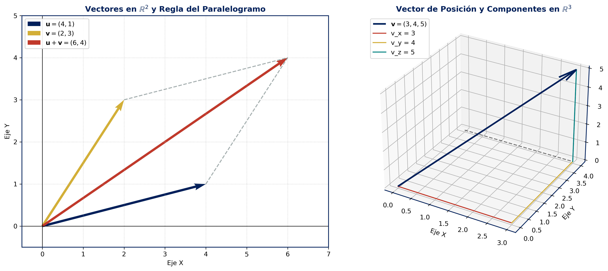
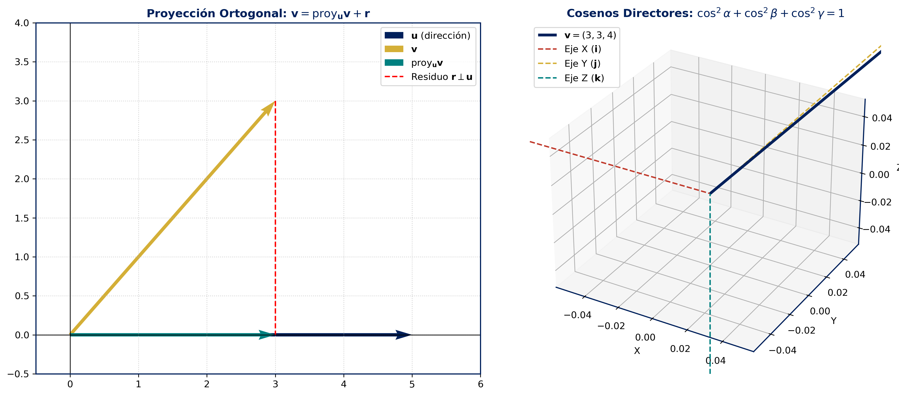
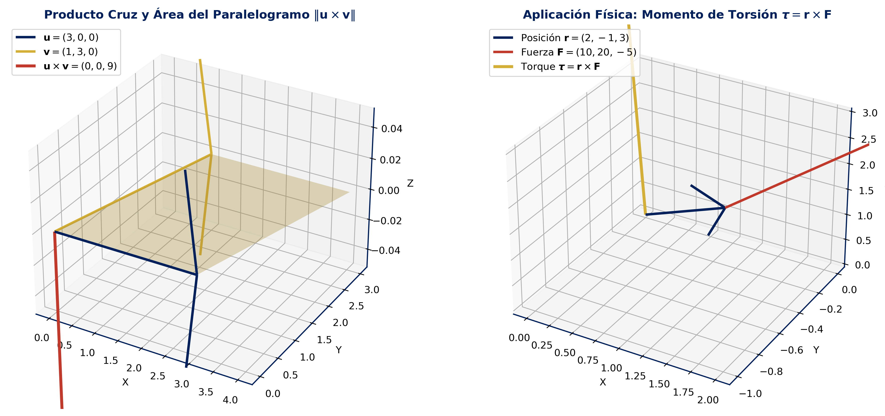
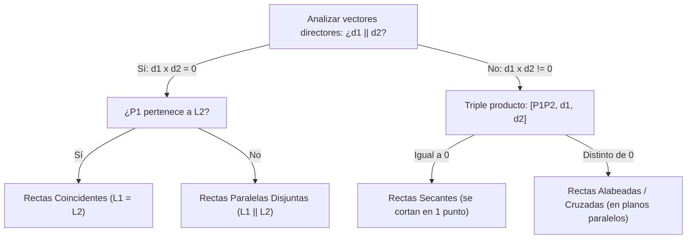
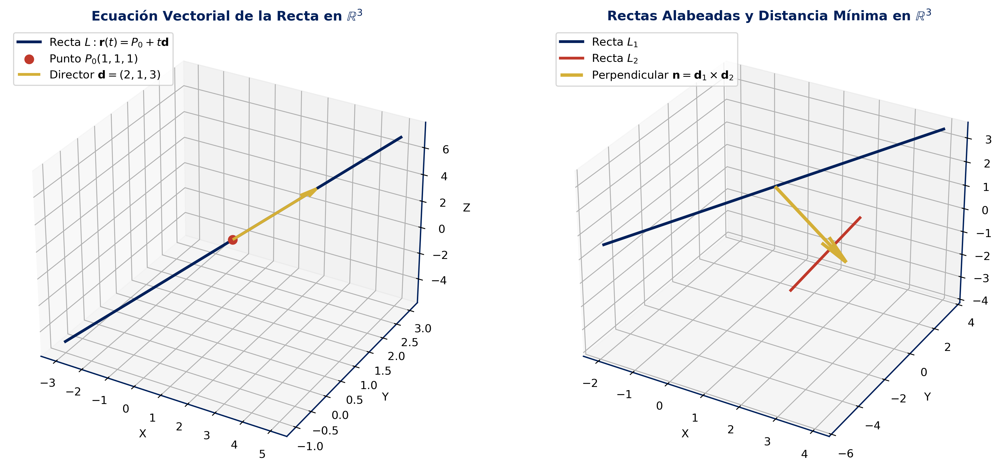
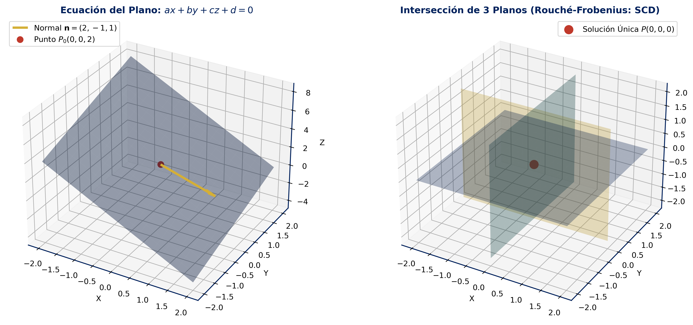
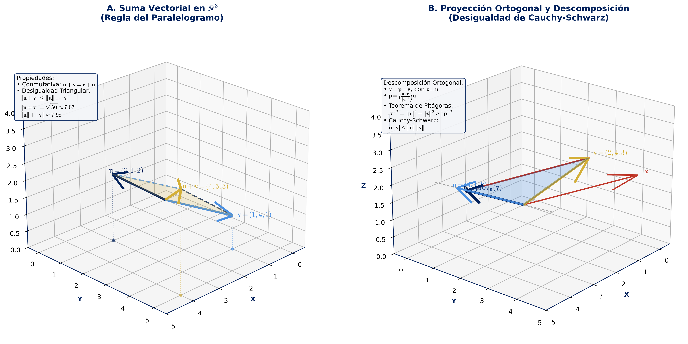
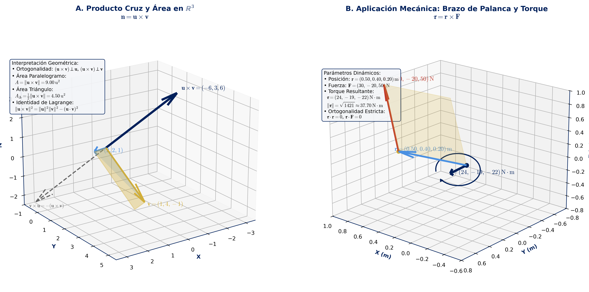
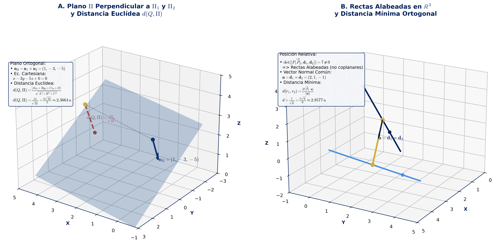

# Unidad 2: Espacios $\mathbb{R}^2$ y $\mathbb{R}^3$ — Geometría Vectorial, Rectas y Planos

> [!info] Leyenda de Trazabilidad de Fuentes
> Con el fin de garantizar la máxima rigurosidad académica, trazabilidad y procedencia conceptual en la carrera de Ingeniería Civil Informática de la Universidad San Sebastián (USS), cada sección, definición y teorema incluye distintivos explícitos:
> - 🎓 `[Cátedra USS / Programa Oficial]`: Contenido curricular directo, syllabus y pautas de la asignatura Álgebra Lineal (DCEX0007), Cátedra de Carol Asencio González.
> - 📖 `[Texto Guía — Grossman / Axler / Aranda]`: Fundamentación teórica formal, demostraciones matemáticas rigurosas y propiedades algebraicas avanzadas (*Grossman 7ª Ed.*, *Axler 4ª Ed.* y *Aranda - Álgebra Lineal con Python*).
> - 🌐 `[UdeC / Mecánica Vectorial / Python]`: Enriquecimiento aplicado de ingeniería, casos de torque, estática tridimensional, ejercicios tipo certamen universitario y scripts de verificación computacional.

---

## 📌 1. Introducción y Fundamentos de $\mathbb{R}^2$ y $\mathbb{R}^3$

### 1.1 Definición Formal de Vector en $\mathbb{R}^n$ ($n=2,3$) 🎓 `[Cátedra USS / Programa Oficial]`
Desde la perspectiva algebraica, el espacio euclídeo $n$-dimensional $\mathbb{R}^n$ se define como el conjunto de todas las $n$-tuplas ordenadas de números reales:

$$
\mathbb{R}^n = \left\{ \mathbf{v} = (v_1, v_2, \dots, v_n) : v_i \in \mathbb{R},\ i=1,\dots,n \right\}
$$

En particular, para el plano cartesiano ($n=2$) y el espacio tridimensional ($n=3$):
- En $\mathbb{R}^2$: $\mathbf{v} = (v_1, v_2) = v_1 \mathbf{i} + v_2 \mathbf{j}$, donde $\mathbf{i} = (1,0)$ y $\mathbf{j} = (0,1)$.
- En $\mathbb{R}^3$: $\mathbf{v} = (v_1, v_2, v_3) = v_1 \mathbf{i} + v_2 \mathbf{j} + v_3 \mathbf{k}$, donde $\mathbf{i} = (1,0,0)$, $\mathbf{j} = (0,1,0)$ y $\mathbf{k} = (0,0,1)$ constituyen la **base canónica ortonormal**.

Geométricamente, un vector es una clase de equivalencia de **segmentos de recta dirigidos** (vectores libres) caracterizados por tres atributos invariantes:
1. **Magnitud (o módulo):** la longitud del segmento.
2. **Dirección:** la recta de soporte o inclinación espacial.
3. **Sentido:** la orientación señalada por la punta de la flecha.

Si fijamos el punto inicial en el origen de coordenadas $O(0,0,0)$ y el punto final en $P(v_1, v_2, v_3)$, decimos que $\mathbf{v} = \overrightarrow{OP}$ es el **vector de posición** del punto $P$. Dados dos puntos arbitrarios en el espacio, $P(x_P, y_P, z_P)$ y $Q(x_Q, y_Q, z_Q)$, el vector geométrico dirigido desde $P$ hacia $Q$ viene dado por la diferencia:

$$
\overrightarrow{PQ} = Q - P = (x_Q - x_P,\ y_Q - y_P,\ z_Q - z_P)
$$

### 1.2 Operaciones Algebraicas y Propiedades de Espacio Vectorial 📖 `[Texto Guía — Grossman / Axler]`
Sean $\mathbf{u} = (u_1, u_2, u_3), \mathbf{v} = (v_1, v_2, v_3) \in \mathbb{R}^3$ y $\lambda \in \mathbb{R}$ un escalar. Se definen las dos operaciones fundamentales:

1. **Suma Vectorial:**
   $$
   \mathbf{u} + \mathbf{v} = (u_1 + v_1,\ u_2 + v_2,\ u_3 + v_3)
   $$
   *Interpretación geométrica:* Regla del paralelogramo o ley del triángulo (concatenación cabeza-cola).

2. **Multiplicación por Escalar:**
   $$
   \lambda \mathbf{v} = (\lambda v_1,\ \lambda v_2,\ \lambda v_3)
   $$
   *Interpretación geométrica:* Dilatación ($\lambda > 1$), contracción ($0 < \lambda < 1$), inversión de sentido ($\lambda < 0$) o colapso al vector nulo $\mathbf{0} = (0,0,0)$ si $\lambda = 0$.

> [!important] Estructura de Espacio Vectorial 📖 [Axler §1A]
> El conjunto $(\mathbb{R}^3, +, \cdot)$ dotado de estas operaciones satisface los 8 axiomas de espacio vectorial sobre el cuerpo $\mathbb{R}$:
> - Conmutatividad: $\mathbf{u} + \mathbf{v} = \mathbf{v} + \mathbf{u}$.
> - Asociatividad: $(\mathbf{u} + \mathbf{v}) + \mathbf{w} = \mathbf{u} + (\mathbf{v} + \mathbf{w})$.
> - Elemento neutro aditivo: $\exists\,\mathbf{0} = (0,0,0)$ tal que $\mathbf{v} + \mathbf{0} = \mathbf{v}$.
> - Elemento opuesto aditivo: $\exists\,(-\mathbf{v}) = (-v_1, -v_2, -v_3)$ tal que $\mathbf{v} + (-\mathbf{v}) = \mathbf{0}$.
> - Distributividad escalar sobre suma vectorial: $\lambda(\mathbf{u} + \mathbf{v}) = \lambda\mathbf{u} + \lambda\mathbf{v}$.
> - Distributividad de la suma de escalares: $(\lambda + \mu)\mathbf{v} = \lambda\mathbf{v} + \mu\mathbf{v}$.
> - Compatibilidad de escalares: $\lambda(\mu\mathbf{v}) = (\lambda\mu)\mathbf{v}$.
> - Identidad multiplicativa: $1\mathbf{v} = \mathbf{v}$.

### 1.3 Norma Euclídea, Distancia y Vector Unitario 📖 `[Grossman Cap. 4]`

> [!theorem] Definición de Norma Euclídea
> La **norma euclídea** (o longitud) de un vector $\mathbf{v} = (v_1, v_2, v_3) \in \mathbb{R}^3$ se define como:
> 
> $$
> \|\mathbf{v}\| = \sqrt{v_1^2 + v_2^2 + v_3^2}
> $$
> 
> Satisface rigurosamente las propiedades axiomáticas de toda norma:
> 1. No negatividad: $\|\mathbf{v}\| \ge 0$, y $\|\mathbf{v}\| = 0 \iff \mathbf{v} = \mathbf{0}$.
> 2. Homogeneidad absoluta: $\|\lambda \mathbf{v}\| = |\lambda| \|\mathbf{v}\|$ para todo $\lambda \in \mathbb{R}$.
> 3. Desigualdad triangular: $\|\mathbf{u} + \mathbf{v}\| \le \|\mathbf{u}\| + \|\mathbf{v}\|$.

**Deducción de la Distancia Euclídea por Teorema de Pitágoras:**
Sean $P(x_1, y_1, z_1)$ y $Q(x_2, y_2, z_2)$. Consideremos el punto intermedio en el plano horizontal $R(x_2, y_2, z_1)$:
1. El segmento $PR$ yace en un plano paralelo a $xy$. Por el Teorema de Pitágoras bidimensional:
   $$
   PR^2 = (x_2 - x_1)^2 + (y_2 - y_1)^2
   $$
2. El segmento $RQ$ es estrictamente vertical (paralelo al eje $z$) con longitud $|z_2 - z_1|$, y es ortogonal al segmento $PR$. Aplicando nuevamente el Teorema de Pitágoras en el triángulo rectángulo $\triangle PRQ$:
   $$
   PQ^2 = PR^2 + RQ^2 = (x_2 - x_1)^2 + (y_2 - y_1)^2 + (z_2 - z_1)^2
   $$
3. Extrayendo la raíz cuadrada positiva se obtiene la distancia métrica:
   $$
   d(P, Q) = \|\overrightarrow{PQ}\| = \sqrt{(x_2 - x_1)^2 + (y_2 - y_1)^2 + (z_2 - z_1)^2}
   $$

**Normalización de Vectores:**
Para cualquier vector no nulo $\mathbf{v} \neq \mathbf{0}$, el **vector unitario** (o versor) con idéntica dirección y sentido es:

$$
\hat{\mathbf{v}} = \frac{\mathbf{v}}{\|\mathbf{v}\|}, \qquad \text{verificando que } \|\hat{\mathbf{v}}\| = \left\|\frac{\mathbf{v}}{\|\mathbf{v}\|}\right\| = \frac{1}{\|\mathbf{v}\|}\|\mathbf{v}\| = 1
$$

### 1.4 Conexión Bidireccional con Matrices 🔗 `[Álgebra Matricial]`
En el formalismo del Álgebra Lineal, todo vector $\mathbf{v} \in \mathbb{R}^3$ es canónicamente isomorfo al espacio de matrices columna $\mathcal{M}_{3 \times 1}(\mathbb{R})$:

$$
\mathbf{v} = (v_1, v_2, v_3) \iff \mathbf{v} = \begin{pmatrix} v_1 \\ v_2 \\ v_3 \end{pmatrix} \in \mathcal{M}_{3 \times 1}(\mathbb{R})
$$

Bajo esta correspondencia:
- La adición de vectores equivale exactamente a la suma matricial en $\mathcal{M}_{3 \times 1}(\mathbb{R})$.
- El producto por un escalar equivale a la ponderación matricial $\lambda A$.
- Toda combinación lineal de vectores $\{ \mathbf{v}_1, \mathbf{v}_2, \mathbf{v}_3 \}$ con ponderadores $c_1, c_2, c_3$ se expresa matricialmente mediante el producto matriz-vector:
  $$
  c_1 \mathbf{v}_1 + c_2 \mathbf{v}_2 + c_3 \mathbf{v}_3 = \begin{pmatrix} \mathbf{v}_1 & \mathbf{v}_2 & \mathbf{v}_3 \end{pmatrix} \begin{pmatrix} c_1 \\ c_2 \\ c_3 \end{pmatrix} = A \mathbf{c}
  $$
  donde $A \in \mathcal{M}_{3 \times 3}(\mathbb{R})$ tiene a los vectores como sus columnas (ver estudio sistemático en [Unidad 1: Matrices](../Unidad_1_Matrices_y_Sistemas/Matrices.md)).

#### Diagrama Representativo de la Sección 1: Fundamentos de Vectores en $\mathbb{R}^2$ y $\mathbb{R}^3$
Representación gráfica bidimensional (regla del paralelogramo para la suma vectorial) y tridimensional (vector de posición y sus 3 componentes cartesianas):



---

## 📐 2. Producto Escalar (Punto) y Ortogonalidad

### 2.1 Definiciones Algebraica y Geométrica 📖 `[Grossman §4.2]`

> [!theorem] Definición Algebraica del Producto Escalar
> Dados $\mathbf{u} = (u_1, u_2, u_3)$ y $\mathbf{v} = (v_1, v_2, v_3)$ en $\mathbb{R}^3$, su **producto escalar** (o producto punto) es la función $\cdot : \mathbb{R}^3 \times \mathbb{R}^3 \to \mathbb{R}$ dada por:
> 
> $$
> \mathbf{u} \cdot \mathbf{v} = \sum_{i=1}^{3} u_i v_i = u_1 v_1 + u_2 v_2 + u_3 v_3 = \mathbf{u}^T \mathbf{v}
> $$

> [!theorem] Definición Geométrica del Producto Escalar
> Si $\theta \in [0, \pi]$ es el ángulo convexo entre los vectores no nulos $\mathbf{u}$ y $\mathbf{v}$, entonces:
> 
> $$
> \mathbf{u} \cdot \mathbf{v} = \|\mathbf{u}\| \|\mathbf{v}\| \cos\theta
> $$

**Deducción de la Equivalencia mediante la Ley del Coseno:**
Consideremos el triángulo formado por los vectores $\mathbf{u}$, $\mathbf{v}$ y el vector de cierre $\mathbf{w} = \mathbf{u} - \mathbf{v}$.
Por la Ley del Coseno sobre las longitudes de los lados:

$$
\|\mathbf{u} - \mathbf{v}\|^2 = \|\mathbf{u}\|^2 + \|\mathbf{v}\|^2 - 2\|\mathbf{u}\| \|\mathbf{v}\| \cos\theta
$$

Desarrollando el lado izquierdo mediante la definición algebraica y sus propiedades bilineales:

$$
\begin{aligned}
\|\mathbf{u} - \mathbf{v}\|^2 &= (\mathbf{u} - \mathbf{v}) \cdot (\mathbf{u} - \mathbf{v}) \\
&= \mathbf{u} \cdot \mathbf{u} - 2(\mathbf{u} \cdot \mathbf{v}) + \mathbf{v} \cdot \mathbf{v} \\
&= \|\mathbf{u}\|^2 - 2(\mathbf{u} \cdot \mathbf{v}) + \|\mathbf{v}\|^2
\end{aligned}
$$

Igualando ambas expresiones:

$$
\|\mathbf{u}\|^2 - 2(\mathbf{u} \cdot \mathbf{v}) + \|\mathbf{v}\|^2 = \|\mathbf{u}\|^2 + \|\mathbf{v}\|^2 - 2\|\mathbf{u}\| \|\mathbf{v}\| \cos\theta
$$

Cancelando $\|\mathbf{u}\|^2 + \|\mathbf{v}\|^2$ y dividiendo por $-2$:

$$
\mathbf{u} \cdot \mathbf{v} = \|\mathbf{u}\| \|\mathbf{v}\| \cos\theta \quad \blacksquare
$$

Como consecuencia directa, el coseno del ángulo entre dos vectores se despeja como:

$$
\cos\theta = \frac{\mathbf{u} \cdot \mathbf{v}}{\|\mathbf{u}\| \|\mathbf{v}\|} = \frac{u_1 v_1 + u_2 v_2 + u_3 v_3}{\sqrt{u_1^2 + u_2^2 + u_3^2}\sqrt{v_1^2 + v_2^2 + v_3^2}}
$$

### 2.2 Criterios de Ortogonalidad y Paralelismo 🎓 `[Cátedra USS]`
1. **Ortogonalidad (Perpendicularidad):** Dos vectores $\mathbf{u}$ y $\mathbf{v}$ son ortogonales ($\mathbf{u} \perp \mathbf{v}$) si y solo si:
   $$
   \mathbf{u} \cdot \mathbf{v} = 0
   $$
   *(Para vectores no nulos, esto equivale a $\cos\theta = 0 \iff \theta = \frac{\pi}{2}$).*
2. **Paralelismo (Colinealidad):** $\mathbf{u}$ y $\mathbf{v}$ son paralelos ($\mathbf{u} \parallel \mathbf{v}$) si y solo si:
   $$
   |\mathbf{u} \cdot \mathbf{v}| = \|\mathbf{u}\| \|\mathbf{v}\| \iff \cos\theta = \pm 1 \iff \mathbf{u} = c\mathbf{v} \quad (c \in \mathbb{R})
   $$
3. **Signo del Producto Escalar:**
   - $\mathbf{u} \cdot \mathbf{v} > 0 \iff \theta \in \left[0, \frac{\pi}{2}\right)$ (ángulo agudo).
   - $\mathbf{u} \cdot \mathbf{v} = 0 \iff \theta = \frac{\pi}{2}$ (vectores perpendiculares).
   - $\mathbf{u} \cdot \mathbf{v} < 0 \iff \theta \in \left(\frac{\pi}{2}, \pi\right]$ (ángulo obtuso).

### 2.3 Cosenos Directores en $\mathbb{R}^3$ 📖 `[Grossman §4.3]`
Sea $\mathbf{v} = (v_1, v_2, v_3) \in \mathbb{R}^3$ con $\mathbf{v} \neq \mathbf{0}$. Se definen los **ángulos directores** $\alpha, \beta, \gamma \in [0, \pi]$ como los ángulos que forma $\mathbf{v}$ con los semiejes positivos $x$, $y$, $z$, correspondientes a los vectores canónicos $\mathbf{i} = (1,0,0)$, $\mathbf{j} = (0,1,0)$ y $\mathbf{k} = (0,0,1)$.

Aplicando la fórmula geométrica del producto escalar:

$$
\cos\alpha = \frac{\mathbf{v} \cdot \mathbf{i}}{\|\mathbf{v}\| \|\mathbf{i}\|} = \frac{v_1}{\|\mathbf{v}\|}, \qquad
\cos\beta = \frac{\mathbf{v} \cdot \mathbf{j}}{\|\mathbf{v}\| \|\mathbf{j}\|} = \frac{v_2}{\|\mathbf{v}\|}, \qquad
\cos\gamma = \frac{\mathbf{v} \cdot \mathbf{k}}{\|\mathbf{v}\| \|\mathbf{k}\|} = \frac{v_3}{\|\mathbf{v}\|}
$$

> [!theorem] Teorema de la Suma de Cuadrados de Cosenos Directores
> Para todo vector no nulo $\mathbf{v} \in \mathbb{R}^3$, se verifica idénticamente:
> 
> $$
> \cos^2\alpha + \cos^2\beta + \cos^2\gamma = 1
> $$

*Demostración Formal:*
Sustituimos directamente los cocientes en la suma de los cuadrados:

$$
\cos^2\alpha + \cos^2\beta + \cos^2\gamma = \left( \frac{v_1}{\|\mathbf{v}\|} \right)^2 + \left( \frac{v_2}{\|\mathbf{v}\|} \right)^2 + \left( \frac{v_3}{\|\mathbf{v}\|} \right)^2 = \frac{v_1^2 + v_2^2 + v_3^2}{\|\mathbf{v}\|^2}
$$

Puesto que por definición $\|\mathbf{v}\|^2 = v_1^2 + v_2^2 + v_3^2$, se tiene:

$$
\cos^2\alpha + \cos^2\beta + \cos^2\gamma = \frac{\|\mathbf{v}\|^2}{\|\mathbf{v}\|^2} = 1 \quad \blacksquare
$$

*Consecuencia geométrica:* Las componentes del vector unitario $\hat{\mathbf{v}}$ coinciden exactamente con los cosenos directores de $\mathbf{v}$:

$$
\hat{\mathbf{v}} = \frac{\mathbf{v}}{\|\mathbf{v}\|} = (\cos\alpha, \cos\beta, \cos\gamma)
$$

### 2.4 Proyección Ortogonal y Componente Escalar 📖 `[Grossman / Axler]`

Dado un vector $\mathbf{v}$ y una dirección no nula $\mathbf{u} \neq \mathbf{0}$, nos proponemos descomponer $\mathbf{v}$ en la suma de dos vectores mutuamente ortogonales:

$$
\mathbf{v} = \mathbf{p} + \mathbf{r}, \quad \text{donde } \mathbf{p} \parallel \mathbf{u} \text{ y } \mathbf{r} \perp \mathbf{u}
$$

El vector $\mathbf{p}$ se denomina **proyección ortogonal de $\mathbf{v}$ sobre $\mathbf{u}$**, denotado $\mathrm{proy}_{\mathbf{u}}\mathbf{v}$.

**Derivación Rigurosa de las Fórmulas:**
1. Dado que $\mathbf{p} \parallel \mathbf{u}$, debe existir un escalar único $c \in \mathbb{R}$ tal que:
   $$
   \mathbf{p} = c\mathbf{u}
   $$
2. El residuo ortogonal es $\mathbf{r} = \mathbf{v} - \mathbf{p} = \mathbf{v} - c\mathbf{u}$.
3. Imponiendo la condición de perpendicularidad $\mathbf{r} \perp \mathbf{u}$:
   $$
   (\mathbf{v} - c\mathbf{u}) \cdot \mathbf{u} = 0 \implies \mathbf{v} \cdot \mathbf{u} - c(\mathbf{u} \cdot \mathbf{u}) = 0
   $$
4. Como $\mathbf{u} \neq \mathbf{0}$, $\mathbf{u} \cdot \mathbf{u} = \|\mathbf{u}\|^2 > 0$. Despejando $c$:
   $$
   c = \frac{\mathbf{v} \cdot \mathbf{u}}{\|\mathbf{u}\|^2}
   $$

Por lo tanto:

$$
\mathrm{proy}_{\mathbf{u}}\mathbf{v} = \left( \frac{\mathbf{v} \cdot \mathbf{u}}{\|\mathbf{u}\|^2} \right) \mathbf{u} = \left( \mathbf{v} \cdot \hat{\mathbf{u}} \right) \hat{\mathbf{u}}
$$

La magnitud con signo de esta proyección sobre la dirección unitaria $\hat{\mathbf{u}}$ se denomina **componente escalar**:

$$
\mathrm{comp}_{\mathbf{u}}\mathbf{v} = \frac{\mathbf{v} \cdot \mathbf{u}}{\|\mathbf{u}\|} = \|\mathbf{v}\|\cos\theta
$$

Notemos que $\mathrm{proy}_{\mathbf{u}}\mathbf{v} = (\mathrm{comp}_{\mathbf{u}}\mathbf{v}) \hat{\mathbf{u}}$.

#### Diagrama Representativo de la Sección 2: Proyección Ortogonal y Cosenos Directores
Ilustración bidimensional de la proyección ortogonal y residuo perpendicular, junto con la disposición tridimensional de los ángulos y cosenos directores $\alpha, \beta, \gamma$:



### 2.5 Teorema: Desigualdad de Cauchy-Schwarz 📖 `[Axler §6A]`

> [!theorem] Desigualdad de Cauchy-Schwarz
> Para cualesquiera vectores $\mathbf{u}, \mathbf{v} \in \mathbb{R}^n$, se cumple:
> 
> $$
> |\mathbf{u} \cdot \mathbf{v}| \le \|\mathbf{u}\| \|\mathbf{v}\|
> $$
> 
> La igualdad se cumple si y solo si $\mathbf{u}$ y $\mathbf{v}$ son linealmente dependientes (es decir, uno es múltiplo escalar del otro).

**Demostración Geométrica Elegante (Método de Axler):**
- Si $\mathbf{v} = \mathbf{0}$, ambos miembros valen $0$, verificándose trivialmente la igualdad.
- Supongamos $\mathbf{v} \neq \mathbf{0}$. Descomponemos $\mathbf{u}$ en su proyección sobre $\mathbf{v}$ y un residuo ortogonal $\mathbf{w}$:
  $$
  \mathbf{u} = \frac{\mathbf{u} \cdot \mathbf{v}}{\|\mathbf{v}\|^2} \mathbf{v} + \mathbf{w}
  $$
  donde $\mathbf{w} = \mathbf{u} - \frac{\mathbf{u} \cdot \mathbf{v}}{\|\mathbf{v}\|^2}\mathbf{v}$. Verificamos que $\mathbf{w}$ es ortogonal a $\mathbf{v}$:
  $$
  \mathbf{w} \cdot \mathbf{v} = \left( \mathbf{u} - \frac{\mathbf{u} \cdot \mathbf{v}}{\|\mathbf{v}\|^2}\mathbf{v} \right) \cdot \mathbf{v} = \mathbf{u} \cdot \mathbf{v} - \frac{\mathbf{u} \cdot \mathbf{v}}{\|\mathbf{v}\|^2}(\mathbf{v} \cdot \mathbf{v}) = \mathbf{u} \cdot \mathbf{v} - \mathbf{u} \cdot \mathbf{v} = 0
  $$
  Puesto que $\frac{\mathbf{u} \cdot \mathbf{v}}{\|\mathbf{v}\|^2}\mathbf{v}$ y $\mathbf{w}$ son ortogonales, aplicamos el **Teorema de Pitágoras**:
  $$
  \|\mathbf{u}\|^2 = \left\| \frac{\mathbf{u} \cdot \mathbf{v}}{\|\mathbf{v}\|^2}\mathbf{v} \right\|^2 + \|\mathbf{w}\|^2 = \frac{|\mathbf{u} \cdot \mathbf{v}|^2}{\|\mathbf{v}\|^4}\|\mathbf{v}\|^2 + \|\mathbf{w}\|^2 = \frac{|\mathbf{u} \cdot \mathbf{v}|^2}{\|\mathbf{v}\|^2} + \|\mathbf{w}\|^2
  $$
  Dado que la norma siempre es no negativa ($\|\mathbf{w}\|^2 \ge 0$), se deduce la desigualdad:
  $$
  \|\mathbf{u}\|^2 \ge \frac{|\mathbf{u} \cdot \mathbf{v}|^2}{\|\mathbf{v}\|^2}
  $$
  Multiplicando ambos lados por $\|\mathbf{v}\|^2 > 0$:
  $$
  \|\mathbf{u}\|^2 \|\mathbf{v}\|^2 \ge |\mathbf{u} \cdot \mathbf{v}|^2
  $$
  Extrayendo la raíz cuadrada positiva a ambos miembros:
  $$
  |\mathbf{u} \cdot \mathbf{v}| \le \|\mathbf{u}\| \|\mathbf{v}\| \quad \blacksquare
  $$
  *Condición de igualdad:* Se alcanza la igualdad estricta $\iff \|\mathbf{w}\|^2 = 0 \iff \mathbf{w} = \mathbf{0} \iff \mathbf{u} = \left(\frac{\mathbf{u} \cdot \mathbf{v}}{\|\mathbf{v}\|^2}\right)\mathbf{v}$, lo que significa que $\mathbf{u}$ es múltiplo escalar de $\mathbf{v}$ (linealmente dependientes).

---

## ✖️ 3. Producto Cruz (Vectorial) y Triple Producto Escalar

### 3.1 Definición Formal y Regla Mnemotécnica $3 \times 3$ 🎓 `[Cátedra USS]`
El **producto cruz** (o vectorial) es una operación definida exclusivamente en el espacio tridimensional $\mathbb{R}^3$, que asocia a dos vectores $\mathbf{u}$ y $\mathbf{v}$ un tercer vector $\mathbf{u} \times \mathbf{v} \in \mathbb{R}^3$.

> [!theorem] Definición del Producto Cruz
> Sean $\mathbf{u} = (u_1, u_2, u_3)$ y $\mathbf{v} = (v_1, v_2, v_3)$. El producto cruz se define como:
> 
> $$
> \mathbf{u} \times \mathbf{v} = (u_2 v_3 - u_3 v_2,\ u_3 v_1 - u_1 v_3,\ u_1 v_2 - u_2 v_1)
> $$
> 
> Se calcula mnemotécnicamente expandiendo por la primera fila el siguiente arreglo simbólico de orden $3 \times 3$:
> 
> $$
> \mathbf{u} \times \mathbf{v} = \begin{vmatrix} \mathbf{i} & \mathbf{j} & \mathbf{k} \\ u_1 & u_2 & u_3 \\ v_1 & v_2 & v_3 \end{vmatrix} = \begin{vmatrix} u_2 & u_3 \\ v_2 & v_3 \end{vmatrix}\mathbf{i} - \begin{vmatrix} u_1 & u_3 \\ v_1 & v_3 \end{vmatrix}\mathbf{j} + \begin{vmatrix} u_1 & u_2 \\ v_1 & v_2 \end{vmatrix}\mathbf{k}
> $$

### 3.2 Propiedades Fundamentales y Ortogonalidad Cruzada 📖 `[Grossman §4.4]`
1. **Anticonmutatividad:** $\mathbf{u} \times \mathbf{v} = -(\mathbf{v} \times \mathbf{u})$ (al permutar dos filas en un determinante se invierte el signo).
2. **Distributividad sobre la suma:** $\mathbf{u} \times (\mathbf{v} + \mathbf{w}) = (\mathbf{u} \times \mathbf{v}) + (\mathbf{u} \times \mathbf{w})$.
3. **Homogeneidad con escalares:** $(\lambda\mathbf{u}) \times \mathbf{v} = \mathbf{u} \times (\lambda\mathbf{v}) = \lambda(\mathbf{u} \times \mathbf{v})$.
4. **Auto-anulación:** $\mathbf{u} \times \mathbf{u} = \mathbf{0}$ para todo $\mathbf{u} \in \mathbb{R}^3$.
5. **Ortogonalidad Simultánea:** $\mathbf{u} \cdot (\mathbf{u} \times \mathbf{v}) = 0$ y $\mathbf{v} \cdot (\mathbf{u} \times \mathbf{v}) = 0$.

*Demostración Analítica de la Ortogonalidad:*
Evaluamos el producto escalar entre $\mathbf{u}$ y $\mathbf{u} \times \mathbf{v}$:

$$
\begin{aligned}
\mathbf{u} \cdot (\mathbf{u} \times \mathbf{v}) &= u_1(u_2 v_3 - u_3 v_2) + u_2(u_3 v_1 - u_1 v_3) + u_3(u_1 v_2 - u_2 v_1) \\
&= u_1 u_2 v_3 - u_1 u_3 v_2 + u_2 u_3 v_1 - u_2 u_1 v_3 + u_3 u_1 v_2 - u_3 u_2 v_1 \\
&= (u_1 u_2 v_3 - u_2 u_1 v_3) + (-u_1 u_3 v_2 + u_3 u_1 v_2) + (u_2 u_3 v_1 - u_3 u_2 v_1) \\
&= 0 + 0 + 0 = 0 \quad \blacksquare
\end{aligned}
$$

Idéntico desarrollo confirma que $\mathbf{v} \cdot (\mathbf{u} \times \mathbf{v}) = 0$. En consecuencia, $\mathbf{u} \times \mathbf{v}$ es perpendicular tanto a $\mathbf{u}$ como a $\mathbf{v}$ (y por tanto normal al plano generado por ellos), orientándose según la **regla de la mano derecha**.

### 3.3 Teorema: Identidad de Lagrange y Magnitud Geométrica 📖 `[Grossman §4.4]`

> [!theorem] Identidad de Lagrange
> Para cualesquiera vectores $\mathbf{u}, \mathbf{v} \in \mathbb{R}^3$, se verifica algebraicamente:
> 
> $$
> \|\mathbf{u} \times \mathbf{v}\|^2 = \|\mathbf{u}\|^2 \|\mathbf{v}\|^2 - (\mathbf{u} \cdot \mathbf{v})^2
> $$

**Demostración Analítica Término a Término:**
Expandimos el término izquierdo a partir de las componentes de $\mathbf{u} \times \mathbf{v}$:

$$
\begin{aligned}
\|\mathbf{u} \times \mathbf{v}\|^2 &= (u_2 v_3 - u_3 v_2)^2 + (u_3 v_1 - u_1 v_3)^2 + (u_1 v_2 - u_2 v_1)^2 \\
&= (u_2^2 v_3^2 - 2 u_2 u_3 v_2 v_3 + u_3^2 v_2^2) \\
&\quad + (u_3^2 v_1^2 - 2 u_3 u_1 v_3 v_1 + u_1^2 v_3^2) \\
&\quad + (u_1^2 v_2^2 - 2 u_1 u_2 v_1 v_2 + u_2^2 v_1^2) \quad \text{--- (Expresión 1)}
\end{aligned}
$$

Por otra parte, desarrollamos el segundo miembro $\|\mathbf{u}\|^2 \|\mathbf{v}\|^2 - (\mathbf{u} \cdot \mathbf{v})^2$:

$$
\|\mathbf{u}\|^2 \|\mathbf{v}\|^2 = (u_1^2 + u_2^2 + u_3^2)(v_1^2 + v_2^2 + v_3^2) = \sum_{i=1}^3 \sum_{j=1}^3 u_i^2 v_j^2
$$

El cuadrado del producto escalar es:

$$
(\mathbf{u} \cdot \mathbf{v})^2 = (u_1 v_1 + u_2 v_2 + u_3 v_3)^2 = \sum_{i=1}^3 u_i^2 v_i^2 + 2(u_1 u_2 v_1 v_2 + u_1 u_3 v_1 v_3 + u_2 u_3 v_2 v_3)
$$

Restando ambas sumas, los tres términos diagonales idénticos $u_1^2 v_1^2 + u_2^2 v_2^2 + u_3^2 v_3^2$ se anulan exactamente, quedando:

$$
\begin{aligned}
\|\mathbf{u}\|^2 \|\mathbf{v}\|^2 - (\mathbf{u} \cdot \mathbf{v})^2 &= (u_1^2 v_2^2 + u_1^2 v_3^2 + u_2^2 v_1^2 + u_2^2 v_3^2 + u_3^2 v_1^2 + u_3^2 v_2^2) \\
&\quad - 2(u_1 u_2 v_1 v_2 + u_1 u_3 v_1 v_3 + u_2 u_3 v_2 v_3)
\end{aligned}
$$

Agrupando los términos por binomios al cuadrado, vemos que coincide exactamente con la (Expresión 1). Por ende:

$$
\|\mathbf{u} \times \mathbf{v}\|^2 = \|\mathbf{u}\|^2 \|\mathbf{v}\|^2 - (\mathbf{u} \cdot \mathbf{v})^2 \quad \blacksquare
$$

**Consecuencia Geométrica Inmediata:**
Sustituyendo la definición geométrica $\mathbf{u} \cdot \mathbf{v} = \|\mathbf{u}\| \|\mathbf{v}\| \cos\theta$:

$$
\|\mathbf{u} \times \mathbf{v}\|^2 = \|\mathbf{u}\|^2 \|\mathbf{v}\|^2 - \|\mathbf{u}\|^2 \|\mathbf{v}\|^2 \cos^2\theta = \|\mathbf{u}\|^2 \|\mathbf{v}\|^2 (1 - \cos^2\theta) = \|\mathbf{u}\|^2 \|\mathbf{v}\|^2 \sin^2\theta
$$

Dado que $\theta \in [0, \pi]$, se tiene $\sin\theta \ge 0$. Extrayendo raíz cuadrada:

$$
\|\mathbf{u} \times \mathbf{v}\| = \|\mathbf{u}\| \|\mathbf{v}\| \sin\theta
$$

> [!tip] Interpretación Geométrica de Áreas
> 1. **Área del Paralelogramo:** sustentado por los vectores $\mathbf{u}$ y $\mathbf{v}$:
>    $$
>    \text{Área}_{\text{paralelogramo}} = \text{base} \times \text{altura} = \|\mathbf{u}\| (\|\mathbf{v}\|\sin\theta) = \|\mathbf{u} \times \mathbf{v}\|
>    $$
> 2. **Área del Triángulo:** determinado por los vértices del paralelogramo:
>    $$
>    \text{Área}_{\triangle} = \frac{1}{2} \|\mathbf{u} \times \mathbf{v}\|
>    $$
> 3. **Criterio de Paralelismo:** Para vectores no nulos, $\mathbf{u} \parallel \mathbf{v} \iff \theta \in \{0, \pi\} \iff \sin\theta = 0 \iff \mathbf{u} \times \mathbf{v} = \mathbf{0}$.

### 3.4 Triple Producto Escalar (Mixto) y Volumen 📖 `[Grossman §4.4]`

> [!theorem] Definición del Triple Producto Escalar
> Sean $\mathbf{u}, \mathbf{v}, \mathbf{w} \in \mathbb{R}^3$. El **triple producto escalar** (o producto mixto) se define como:
> 
> $$
> [\mathbf{u}, \mathbf{v}, \mathbf{w}] = \mathbf{u} \cdot (\mathbf{v} \times \mathbf{w})
> $$
> 
> Coincide exactamente con el determinante de la matriz cuyas filas son las componentes de los tres vectores:
> 
> $$
> \mathbf{u} \cdot (\mathbf{v} \times \mathbf{w}) = \det\begin{pmatrix} u_1 & u_2 & u_3 \\ v_1 & v_2 & v_3 \\ w_1 & w_2 & w_3 \end{pmatrix}
> $$

**Interpretación Geométrica del Volumen:**
El valor absoluto del triple producto escalar representa el volumen del **paralelepípedo** tridimensional cuyas aristas concurrentes son $\mathbf{u}, \mathbf{v}, \mathbf{w}$:

$$
V_{\text{paralelepípedo}} = | \mathbf{u} \cdot (\mathbf{v} \times \mathbf{w}) | = |\det(\mathbf{u}, \mathbf{v}, \mathbf{w})|
$$

*Justificación:* El área de la base es $A = \|\mathbf{v} \times \mathbf{w}\|$. La altura $h$ es la proyección de $\mathbf{u}$ sobre la dirección normal a la base $\mathbf{n} = \mathbf{v} \times \mathbf{w}$, esto es $h = \|\mathbf{u}\| |\cos\phi|$. Por ende:
$$
V = A \cdot h = \|\mathbf{v} \times \mathbf{w}\| \|\mathbf{u}\| |\cos\phi| = | \mathbf{u} \cdot (\mathbf{v} \times \mathbf{w}) |
$$

Para un **tetraedro** con aristas $\mathbf{u}, \mathbf{v}, \mathbf{w}$:

$$
V_{\text{tetraedro}} = \frac{1}{6} | \mathbf{u} \cdot (\mathbf{v} \times \mathbf{w}) |
$$

> [!important] Criterio de Coplanaridad
> Tres vectores $\mathbf{u}, \mathbf{v}, \mathbf{w} \in \mathbb{R}^3$ son **coplanares** (yacen en un mismo plano o en planos paralelos) si y solo si el paralelepípedo colapsa (volumen nulo):
> 
> $$
> \mathbf{u} \cdot (\mathbf{v} \times \mathbf{w}) = 0 \iff \det\begin{pmatrix} \mathbf{u} \\ \mathbf{v} \\ \mathbf{w} \end{pmatrix} = 0
> $$
> 
> Conexión directa: esto equivale a que las tres filas/vectores sean **linealmente dependientes** en $\mathbb{R}^3$ (ver `Matrices — Determinantes`).

#### Diagrama Representativo de la Sección 3: Producto Cruz, Área y Torque 3D
Representación del paralelogramo sustentado por $\mathbf{u}$ y $\mathbf{v}$ en $\mathbb{R}^3$ con su vector normal de producto cruz, y la aplicación física del vector de torsión $\boldsymbol{\tau} = \mathbf{r} \times \mathbf{F}$:



---

## 📏 4. Rectas en el Espacio $\mathbb{R}^3$

### 4.1 Ecuaciones de la Recta 🎓 `[Cátedra USS / Diapositivas]`
Una recta $L$ en $\mathbb{R}^3$ queda unívocamente determinada cuando se especifica:
- Un punto conocido por donde pasa: $P_0(x_0, y_0, z_0)$ con vector de posición $\mathbf{r}_0 = (x_0, y_0, z_0)$.
- Un vector director no nulo que fija su orientación: $\mathbf{d} = (a, b, c) \neq \mathbf{0}$.

#### 1. Ecuación Vectorial:
Un punto arbitrario $P(x,y,z)$ con vector de posición $\mathbf{r} = (x,y,z)$ pertenece a la recta $L$ si y solo si el vector desplazamiento $\overrightarrow{P_0 P}$ es colineal con $\mathbf{d}$:

$$
\mathbf{r}(t) = \mathbf{r}_0 + t \mathbf{d}, \quad t \in \mathbb{R}
$$

O en coordenadas: $(x, y, z) = (x_0, y_0, z_0) + t(a, b, c)$.

#### 2. Ecuaciones Paramétricas:
Igualando componente a componente:

$$
\begin{cases}
x = x_0 + a t \\
y = y_0 + b t \\
z = z_0 + c t
\end{cases} \quad (t \in \mathbb{R})
$$

#### 3. Ecuaciones Simétricas (o Continuas):
Si todos los números directores son no nulos ($a \neq 0, b \neq 0, c \neq 0$), despejamos el parámetro escalar $t$:

$$
\frac{x - x_0}{a} = \frac{y - y_0}{b} = \frac{z - z_0}{c}
$$

*Caso particular:* Si uno de los directores es nulo, por ejemplo $b = 0$ con $a \neq 0, c \neq 0$, la variable $y$ permanece constante y las ecuaciones simétricas se expresan:
$$
\frac{x - x_0}{a} = \frac{z - z_0}{c}, \qquad y = y_0
$$

### 4.2 Posiciones Relativas de Dos Rectas en $\mathbb{R}^3$ 📖 `[Grossman §4.5]`
Dadas dos rectas $L_1: \mathbf{r}_1(s) = P_1 + s\mathbf{d}_1$ y $L_2: \mathbf{r}_2(t) = P_2 + t\mathbf{d}_2$:



1. **Coincidentes:** $\mathbf{d}_1 \parallel \mathbf{d}_2$ ($\mathbf{d}_1 \times \mathbf{d}_2 = \mathbf{0}$) y el punto $P_1$ satisface las ecuaciones de $L_2$.
2. **Paralelas Disjuntas:** $\mathbf{d}_1 \parallel \mathbf{d}_2$ ($\mathbf{d}_1 \times \mathbf{d}_2 = \mathbf{0}$) pero $P_1 \notin L_2$.
3. **Secantes:** $\mathbf{d}_1 \nparallel \mathbf{d}_2$, son coplanares ($[\overrightarrow{P_1P_2}, \mathbf{d}_1, \mathbf{d}_2] = 0$) y existe un único par $(s_0, t_0)$ tal que $\mathbf{r}_1(s_0) = \mathbf{r}_2(t_0)$.
4. **Alabeadas (o Cruzadas):** No son paralelas ($\mathbf{d}_1 \times \mathbf{d}_2 \neq \mathbf{0}$) y no se intersecan, situándose en planos espaciales distintos ($[\overrightarrow{P_1P_2}, \mathbf{d}_1, \mathbf{d}_2] \neq 0$).

### 4.3 Distancia de un Punto a una Recta 📖 `[Grossman §4.5]`

> [!theorem] Distancia de un Punto a una Recta
> La distancia euclídea mínima desde un punto $Q(x_1, y_1, z_1)$ a una recta $L$ que pasa por $P_0$ con dirección $\mathbf{d}$ viene dada por:
> 
> $$
> d(Q, L) = \frac{\|\mathbf{d} \times \overrightarrow{P_0 Q}\|}{\|\mathbf{d}\|}
> $$

**Demostración Geométrica:**
Consideremos el paralelogramo sustentado por el vector director $\mathbf{d}$ y el vector $\overrightarrow{P_0 Q}$.
- La base del paralelogramo tiene longitud $b = \|\mathbf{d}\|$.
- El área del paralelogramo es $A = \|\mathbf{d} \times \overrightarrow{P_0 Q}\|$.
- La altura $h$ perpendicular a la base corresponde con la distancia mínima desde $Q$ hasta la recta $L$:
  $$
  A = \text{base} \times \text{altura} \implies \|\mathbf{d} \times \overrightarrow{P_0 Q}\| = \|\mathbf{d}\| \cdot d(Q, L)
  $$
- Despejando $d(Q, L)$ se obtiene la fórmula directa $\blacksquare$.

### 4.4 Distancia Mínima entre Dos Rectas Alabeadas 🌐 `[UdeC / Grossman]`

> [!theorem] Distancia entre Rectas Alabeadas
> Sean $L_1(P_1, \mathbf{d}_1)$ y $L_2(P_2, \mathbf{d}_2)$ dos rectas alabeadas en $\mathbb{R}^3$. La distancia mínima entre ambas es:
> 
> $$
> d(L_1, L_2) = \frac{|\overrightarrow{P_1 P_2} \cdot (\mathbf{d}_1 \times \mathbf{d}_2)|}{\|\mathbf{d}_1 \times \mathbf{d}_2\|}
> $$

**Deducción:**
El vector perpendicular común a ambas direcciones es $\mathbf{n} = \mathbf{d}_1 \times \mathbf{d}_2$. La distancia entre las rectas equivale a proyectar ortogonalmente cualquier vector que una ambas rectas (como $\overrightarrow{P_1 P_2}$) sobre este vector normal unitario $\hat{\mathbf{n}}$:

$$
d(L_1, L_2) = |\mathrm{comp}_{\mathbf{n}}\overrightarrow{P_1 P_2}| = \frac{|\overrightarrow{P_1 P_2} \cdot \mathbf{n}|}{\|\mathbf{n}\|} = \frac{|\overrightarrow{P_1 P_2} \cdot (\mathbf{d}_1 \times \mathbf{d}_2)|}{\|\mathbf{d}_1 \times \mathbf{d}_2\|} \quad \blacksquare
$$

#### Diagrama Representativo de la Sección 4: Rectas en el Espacio y Rectas Alabeadas
Visualización tridimensional de la ecuación vectorial de una recta $\mathbf{r}(t) = P_0 + t\mathbf{d}$ y la disposición de dos rectas alabeadas con su vector perpendicular común:



---

## 🔲 5. Planos en el Espacio $\mathbb{R}^3$

### 5.1 Ecuación Vectorial, Normal y Cartesiana 🎓 `[Cátedra USS]`
Un plano $\pi$ en $\mathbb{R}^3$ queda determinado por:
- Un punto contenido en él: $P_0(x_0, y_0, z_0)$.
- Un vector normal ortogonal al plano: $\mathbf{n} = (a, b, c) \neq \mathbf{0}$.

#### 1. Ecuación Vectorial Normal:
Un punto $P(x,y,z)$ pertenece al plano $\pi$ si y solo si el vector desplazamiento $\overrightarrow{P_0 P} = (x - x_0, y - y_0, z - z_0)$ es ortogonal al vector normal $\mathbf{n}$:

$$
\mathbf{n} \cdot (\mathbf{r} - \mathbf{r}_0) = 0
$$

#### 2. Ecuación Cartesiana (General o Implícita):
Desarrollando el producto escalar:

$$
a(x - x_0) + b(y - y_0) + c(z - z_0) = 0 \implies ax + by + cz + d = 0
$$

donde el término independiente es $d = -(a x_0 + b y_0 + c z_0)$.

> [!note] Plano por Tres Puntos No Colineales
> Dados tres puntos no alineados $P, Q, R \in \mathbb{R}^3$, construimos dos vectores coplanares al plano: $\mathbf{u} = \overrightarrow{PQ} = Q - P$ y $\mathbf{v} = \overrightarrow{PR} = R - P$.
> El vector normal del plano se determina mediante el producto cruz:
> 
> $$
> \mathbf{n} = \overrightarrow{PQ} \times \overrightarrow{PR}
> $$

### 5.2 Distancia de un Punto a un Plano 📖 `[Grossman §4.5]`

> [!theorem] Distancia de un Punto a un Plano
> La distancia desde un punto arbitrario $P_1(x_1, y_1, z_1)$ al plano $\pi: ax + by + cz + d = 0$ es:
> 
> $$
> d(P_1, \pi) = \frac{|a x_1 + b y_1 + c z_1 + d|}{\sqrt{a^2 + b^2 + c^2}}
> $$

**Demostración por Proyección Ortogonal:**
Sea $P_0(x_0, y_0, z_0)$ un punto perteneciente al plano, de modo que satisface $a x_0 + b y_0 + c z_0 + d = 0 \implies d = -(a x_0 + b y_0 + c z_0)$.
El segmento perpendicular desde $P_1$ al plano es la proyección del vector $\overrightarrow{P_0 P_1} = (x_1 - x_0, y_1 - y_0, z_1 - z_0)$ sobre la dirección normal $\mathbf{n} = (a, b, c)$:

$$
d(P_1, \pi) = |\mathrm{comp}_{\mathbf{n}}\overrightarrow{P_0 P_1}| = \frac{|\overrightarrow{P_0 P_1} \cdot \mathbf{n}|}{\|\mathbf{n}\|}
$$

Evaluando el producto escalar en el numerador:

$$
\overrightarrow{P_0 P_1} \cdot \mathbf{n} = a(x_1 - x_0) + b(y_1 - y_0) + c(z_1 - z_0) = (a x_1 + b y_1 + c z_1) - (a x_0 + b y_0 + c z_0)
$$

Sustituyendo el valor de $d$:

$$
\overrightarrow{P_0 P_1} \cdot \mathbf{n} = a x_1 + b y_1 + c z_1 + d
$$

Como $\|\mathbf{n}\| = \sqrt{a^2 + b^2 + c^2}$, reemplazando en el cociente se concluye:

$$
d(P_1, \pi) = \frac{|a x_1 + b y_1 + c z_1 + d|}{\sqrt{a^2 + b^2 + c^2}} \quad \blacksquare
$$

### 5.3 Intersección de Tres Planos y Conexión con el Teorema de Rouché-Frobenius 🔗 `[Matrices]`

La intersección simultánea de tres planos en el espacio tridimensional:

$$
\begin{cases}
\pi_1: a_1 x + b_1 y + c_1 z = d_1 \\
\pi_2: a_2 x + b_2 y + c_2 z = d_2 \\
\pi_3: a_3 x + b_3 y + c_3 z = d_3
\end{cases}
$$

se formula matricialmente como el sistema lineal $A \mathbf{x} = \mathbf{b}$:

$$
\begin{pmatrix}
a_1 & b_1 & c_1 \\
a_2 & b_2 & c_2 \\
a_3 & b_3 & c_3
\end{pmatrix}
\begin{pmatrix} x \\ y \\ z \end{pmatrix}
=
\begin{pmatrix} d_1 \\ d_2 \\ d_3 \end{pmatrix},
\qquad
(A|B) = \begin{pmatrix}
a_1 & b_1 & c_1 & d_1 \\
a_2 & b_2 & c_2 & d_2 \\
a_3 & b_3 & c_3 & d_3
\end{pmatrix}
$$

Conforme al **Teorema de Rouché-Frobenius** estudiado en `Matrices — Clasificación de Sistemas`, la configuración geométrica de los 3 planos queda completamente determinada por los rangos $\mathrm{rg}(A)$ y $\mathrm{rg}(A|B)$:

| $\mathrm{rg}(A)$ | $\mathrm{rg}(A|B)$ | Clasificación del Sistema | Configuración Geométrica en $\mathbb{R}^3$ |
| :---: | :---: | :--- | :--- |
| **$3$** | **$3$** | **SCD** (Solución única, $\det A \neq 0$) | Los 3 planos se intersecan en un **único punto** (vértice común). |
| **$2$** | **$2$** | **SCI** ($1$ grado de libertad, $\infty$ sol.) | Los 3 planos se intersecan en una **recta común** (haz de planos) o dos coinciden y cortan al tercero en recta. |
| **$1$** | **$1$** | **SCI** ($2$ grados de libertad, $\infty$ sol.) | Los 3 planos son **completamente coincidentes** (el mismo plano). |
| **$2$** | **$3$** | **SI** (Incompatible, sin solución) | **Prisma triangular** (se cortan dos a dos en 3 rectas paralelas) o dos son paralelos cortados por el tercero. |
| **$1$** | **$2$** | **SI** (Incompatible, sin solución) | Los 3 planos son **estrictamente paralelos disjuntos** (o dos coincidentes y uno paralelo). |

#### Diagrama Representativo de la Sección 5: Planos en el Espacio e Intersección de 3 Planos
Visualización tridimensional de la ecuación general del plano con su vector normal $\mathbf{n}$, y la clasificación geométrica de la intersección de 3 planos según el Teorema de Rouché-Frobenius:



---

## 💡 6. Ejercicios Resueltos Detallados y Casos Prácticos

### 6.1 Caso Práctico 1: Momento de Torsión (Torque 3D) 🌐 `[UdeC Mecánica Vectorial]`
> [!example] Enunciado
> En una estructura robótica articulada, se aplica una fuerza $\mathbf{F} = (10, 20, -5)\,\text{N}$ en el extremo de un brazo posicionado en $\mathbf{r} = (2, -1, 3)\,\text{m}$ con respecto al origen de giro $O$.
> 1. Calcular el vector momento de torsión (torque) $\boldsymbol{\tau} = \mathbf{r} \times \mathbf{F}$.
> 2. Verificar analíticamente que $\boldsymbol{\tau}$ es ortogonal tanto al vector de posición $\mathbf{r}$ como al vector de fuerza $\mathbf{F}$.
> 3. Determinar la magnitud $\|\boldsymbol{\tau}\|$ y el versor unitario del eje de giro.

**Resolución Paso a Paso:**

1. **Cálculo del Producto Cruz:**
   $$
   \boldsymbol{\tau} = \mathbf{r} \times \mathbf{F} = \begin{vmatrix}
   \mathbf{i} & \mathbf{j} & \mathbf{k} \\
   2 & -1 & 3 \\
   10 & 20 & -5
   \end{vmatrix}
   $$
   Desarrollando los menores complementarios de orden 2:
   - Componente $\mathbf{i}$:
     $$
     \tau_x = (-1)(-5) - (3)(20) = 5 - 60 = -55
     $$
   - Componente $\mathbf{j}$:
     $$
     \tau_y = - [ (2)(-5) - (3)(10) ] = - [ -10 - 30 ] = -(-40) = 40
     $$
   - Componente $\mathbf{k}$:
     $$
     \tau_z = (2)(20) - (-1)(10) = 40 + 10 = 50
     $$
   Por lo tanto:
   $$
   \boldsymbol{\tau} = (-55, 40, 50)\,\text{N}\cdot\text{m}
   $$

2. **Verificación de Ortogonalidad:**
   - Con $\mathbf{r}$:
     $$
     \boldsymbol{\tau} \cdot \mathbf{r} = (-55)(2) + (40)(-1) + (50)(3) = -110 - 40 + 150 = 0
     $$
   - Con $\mathbf{F}$:
     $$
     \boldsymbol{\tau} \cdot \mathbf{F} = (-55)(10) + (40)(20) + (50)(-5) = -550 + 800 - 250 = 0
     $$
   Ambos productos escalares son idénticamente nulos, confirmando que $\boldsymbol{\tau} \perp \mathbf{r}$ y $\boldsymbol{\tau} \perp \mathbf{F}$.

3. **Magnitud y Eje de Giro:**
   $$
   \|\boldsymbol{\tau}\| = \sqrt{(-55)^2 + 40^2 + 50^2} = \sqrt{3025 + 1600 + 2500} = \sqrt{7125} = 5\sqrt{285} \approx 84.41\,\text{N}\cdot\text{m}
   $$
   El versor unitario del eje de rotación inducido es:
   $$
   \hat{\mathbf{u}}_\tau = \frac{\boldsymbol{\tau}}{\|\boldsymbol{\tau}\|} = \frac{1}{5\sqrt{285}} (-55, 40, 50) = \left( -\frac{11}{\sqrt{285}},\ \frac{8}{\sqrt{285}},\ \frac{10}{\sqrt{285}} \right)
   $$

---

### 6.2 Caso Práctico 2: Equilibrio Estático Tridimensional de un Nodo 🌐 `[Mecánica de Sólidos]`
> [!example] Enunciado
> Un anillo central de izaje ubicado en el origen $O(0,0,0)$ sostiene una carga vertical hacia abajo de peso $\mathbf{W} = (0, 0, -1140)\,\text{N}$. Para mantener el equilibrio estático ($\sum \mathbf{F} = \mathbf{0}$), se fijan tres cables tensores $A, B, C$ anclados en los puntos $A(1, 2, 2)$, $B(-2, 1, 2)$ y $C(0, -3, 4)$.
> Determinar las tensiones escalares $T_A, T_B, T_C$ que experimentan cada uno de los cables.

**Resolución Paso a Paso:**

1. **Vectores Directores y Normalización:**
   - Cable $A$: $\overrightarrow{OA} = (1, 2, 2)$, $\|\overrightarrow{OA}\| = \sqrt{1^2 + 2^2 + 2^2} = \sqrt{9} = 3$.
     $$
     \hat{\mathbf{u}}_A = \left(\frac{1}{3},\ \frac{2}{3},\ \frac{2}{3}\right)
     $$
   - Cable $B$: $\overrightarrow{OB} = (-2, 1, 2)$, $\|\overrightarrow{OB}\| = \sqrt{(-2)^2 + 1^2 + 2^2} = \sqrt{9} = 3$.
     $$
     \hat{\mathbf{u}}_B = \left(-\frac{2}{3},\ \frac{1}{3},\ \frac{2}{3}\right)
     $$
   - Cable $C$: $\overrightarrow{OC} = (0, -3, 4)$, $\|\overrightarrow{OC}\| = \sqrt{0^2 + (-3)^2 + 4^2} = \sqrt{25} = 5$.
     $$
     \hat{\mathbf{u}}_C = \left(0,\ -\frac{3}{5},\ \frac{4}{5}\right)
     $$

2. **Ecuación de Equilibrio Vectorial:**
   $$
   \mathbf{T}_A + \mathbf{T}_B + \mathbf{T}_C + \mathbf{W} = \mathbf{0} \implies T_A \hat{\mathbf{u}}_A + T_B \hat{\mathbf{u}}_B + T_C \hat{\mathbf{u}}_C = -\mathbf{W} = \begin{pmatrix} 0 \\ 0 \\ 1140 \end{pmatrix}
   $$

3. **Sistema de Ecuaciones Lineales Matricial:**
   $$
   \begin{pmatrix}
   1/3 & -2/3 & 0 \\
   2/3 & 1/3 & -3/5 \\
   2/3 & 2/3 & 4/5
   \end{pmatrix}
   \begin{pmatrix} T_A \\ T_B \\ T_C \end{pmatrix}
   =
   \begin{pmatrix} 0 \\ 0 \\ 1140 \end{pmatrix}
   $$

4. **Resolución Analítica:**
   - De la primera ecuación (eje $x$):
     $$
     \frac{1}{3} T_A - \frac{2}{3} T_B = 0 \implies T_A = 2 T_B
     $$
   - Sustituyendo $T_A = 2 T_B$ en la segunda ecuación (eje $y$):
     $$
     \frac{2}{3}(2 T_B) + \frac{1}{3} T_B - \frac{3}{5} T_C = 0 \implies \frac{5}{3} T_B - \frac{3}{5} T_C = 0 \implies T_C = \frac{25}{9} T_B
     $$
   - Sustituyendo $T_A$ y $T_C$ en la tercera ecuación (eje $z$):
     $$
     \frac{2}{3}(2 T_B) + \frac{2}{3} T_B + \frac{4}{5}\left(\frac{25}{9} T_B\right) = 1140
     $$
     $$
     \frac{4}{3} T_B + \frac{2}{3} T_B + \frac{20}{9} T_B = 1140 \implies 2 T_B + \frac{20}{9} T_B = 1140 \implies \frac{38}{9} T_B = 1140
     $$
     $$
     T_B = \frac{1140 \times 9}{38} = 30 \times 9 = 270\,\text{N}
     $$
   - Despeje de las tensiones restantes:
     $$
     T_A = 2(270) = 540\,\text{N}
     $$
     $$
     T_C = \frac{25}{9}(270) = 25 \times 30 = 750\,\text{N}
     $$

*Conclusión Física:* Los tres cables se encuentran bajo tracción pura positiva: $T_A = 540\,\text{N}$, $T_B = 270\,\text{N}$ y $T_C = 750\,\text{N}$.

---

### 6.3 Caso Práctico 3: Geometría Espacial — Paralelepípedo y Tetraedro 📖 `[Grossman Cap. 4]`
> [!example] Enunciado
> Sean los puntos en el espacio $P(1, 0, 2)$, $Q(3, 2, 1)$, $R(2, 4, 5)$ y $S(1, 3, 6)$.
> 1. Determinar los vectores arista $\mathbf{u} = \overrightarrow{PQ}$, $\mathbf{v} = \overrightarrow{PR}$ y $\mathbf{w} = \overrightarrow{PS}$.
> 2. Calcular el volumen del paralelepípedo y del tetraedro sustentados por dichos vectores.
> 3. Calcular la altura del paralelepípedo con respecto a la base formada por $\mathbf{u}$ y $\mathbf{v}$.

**Resolución Paso a Paso:**

1. **Vectores Arista:**
   $$
   \mathbf{u} = Q - P = (3-1, 2-0, 1-2) = (2, 2, -1)
   $$
   $$
   \mathbf{v} = R - P = (2-1, 4-0, 5-2) = (1, 4, 3)
   $$
   $$
   \mathbf{w} = S - P = (1-1, 3-0, 6-2) = (0, 3, 4)
   $$

2. **Producto Cruz de la Base ($\mathbf{u} \times \mathbf{v}$):**
   $$
   \mathbf{u} \times \mathbf{v} = \begin{vmatrix}
   \mathbf{i} & \mathbf{j} & \mathbf{k} \\
   2 & 2 & -1 \\
   1 & 4 & 3
   \end{vmatrix}
   = \mathbf{i}(6 - (-4)) - \mathbf{j}(6 - (-1)) + \mathbf{k}(8 - 2) = (10, -7, 6)
   $$
   Área de la base paralelográmica:
   $$
   A_{\text{base}} = \|\mathbf{u} \times \mathbf{v}\| = \sqrt{10^2 + (-7)^2 + 6^2} = \sqrt{100 + 49 + 36} = \sqrt{185} \approx 13.60\,\text{u}^2
   $$

3. **Triple Producto Escalar y Volúmenes:**
   $$
   \mathbf{w} \cdot (\mathbf{u} \times \mathbf{v}) = 0(10) + 3(-7) + 4(6) = 0 - 21 + 24 = 3
   $$
   - Volumen del paralelepípedo:
     $$
     V_{\text{paralelepípedo}} = | \mathbf{w} \cdot (\mathbf{u} \times \mathbf{v}) | = |3| = 3\,\text{u}^3
     $$
   - Volumen del tetraedro:
     $$
     V_{\text{tetraedro}} = \frac{1}{6} V_{\text{paralelepípedo}} = \frac{3}{6} = \frac{1}{2} = 0.5\,\text{u}^3
     $$

4. **Altura con respecto a la Base:**
   $$
   h = \frac{V_{\text{paralelepípedo}}}{A_{\text{base}}} = \frac{3}{\sqrt{185}} = \frac{3\sqrt{185}}{185} \approx 0.2206\,\text{u}
   $$

---

### 6.4 Ejercicio Tipo Certamen 1 (UdeC): Posición Relativa y Distancia entre Rectas Alabeadas 🌐 `[Certamen Álgebra Lineal UdeC]`
> [!example] Enunciado
> Dadas las rectas en $\mathbb{R}^3$:
> $$
> L_1: \frac{x - 1}{2} = \frac{y + 1}{3} = z - 2, \qquad L_2: \mathbf{r}_2(t) = (2, 0, -1) + t(1, -1, 2)
> $$
> 1. Demostrar rigurosamente que $L_1$ y $L_2$ son rectas alabeadas (cruzadas).
> 2. Calcular la distancia mínima que las separa en el espacio.
> 3. Determinar la ecuación general del plano $\pi$ que contiene a $L_1$ y es estrictamente paralelo a $L_2$.

**Resolución Paso a Paso:**

1. **Extracción de Elementos Geométricos:**
   - Para $L_1$: Pasa por $P_1(1, -1, 2)$ con vector director $\mathbf{d}_1 = (2, 3, 1)$.
   - Para $L_2$: Pasa por $P_2(2, 0, -1)$ con vector director $\mathbf{d}_2 = (1, -1, 2)$.
   - Vector entre puntos: $\overrightarrow{P_1 P_2} = P_2 - P_1 = (2-1, 0-(-1), -1-2) = (1, 1, -3)$.

2. **Comprobación de Rectas Alabeadas:**
   - *Verificación de paralelismo:*
     $$
     \mathbf{d}_1 \times \mathbf{d}_2 = \begin{vmatrix}
     \mathbf{i} & \mathbf{j} & \mathbf{k} \\
     2 & 3 & 1 \\
     1 & -1 & 2
     \end{vmatrix}
     = \mathbf{i}(6 - (-1)) - \mathbf{j}(4 - 1) + \mathbf{k}(-2 - 3) = (7, -3, -5) \neq \mathbf{0}
     $$
     Al ser $\mathbf{d}_1 \times \mathbf{d}_2 \neq \mathbf{0}$, las rectas **no son paralelas ni coincidentes**.
   - *Verificación de coplanaridad (Triple Producto Escalar):*
     $$
     [\overrightarrow{P_1 P_2}, \mathbf{d}_1, \mathbf{d}_2] = \overrightarrow{P_1 P_2} \cdot (\mathbf{d}_1 \times \mathbf{d}_2) = 1(7) + 1(-3) + (-3)(-5) = 7 - 3 + 15 = 19 \neq 0
     $$
     Puesto que el triple producto escalar no es nulo, los vectores no son coplanares. En consecuencia, las rectas **no se cortan y son estrictamente alabeadas**.

3. **Cálculo de la Distancia Mínima:**
   $$
   \|\mathbf{d}_1 \times \mathbf{d}_2\| = \sqrt{7^2 + (-3)^2 + (-5)^2} = \sqrt{49 + 9 + 25} = \sqrt{83}
   $$
   $$
   d(L_1, L_2) = \frac{|\overrightarrow{P_1 P_2} \cdot (\mathbf{d}_1 \times \mathbf{d}_2)|}{\|\mathbf{d}_1 \times \mathbf{d}_2\|} = \frac{19}{\sqrt{83}} = \frac{19\sqrt{83}}{83} \approx 2.0855\,\text{u}
   $$

4. **Plano $\pi$ que contiene a $L_1$ y es paralelo a $L_2$:**
   - El plano pasa por $P_1(1, -1, 2)$ y tiene por vector normal a $\mathbf{n} = \mathbf{d}_1 \times \mathbf{d}_2 = (7, -3, -5)$.
   - Ecuación del plano:
     $$
     7(x - 1) - 3(y + 1) - 5(z - 2) = 0
     $$
     $$
     7x - 7 - 3y - 3 - 5z + 10 = 0 \implies 7x - 3y - 5z = 0
     $$
   *Verificación adicional:* Calculamos la distancia de $P_2(2, 0, -1) \in L_2$ a este plano $\pi$:
   $$
   d(P_2, \pi) = \frac{|7(2) - 3(0) - 5(-1)|}{\sqrt{7^2 + (-3)^2 + (-5)^2}} = \frac{|14 + 5|}{\sqrt{83}} = \frac{19}{\sqrt{83}}
   $$
   El resultado coincide exactamente con la distancia entre ambas rectas.

---

### 6.5 Ejercicio Tipo Certamen 2 (UdeC): Plano Perpendicular a Dos Planos y Distancia Punto-Plano 🌐 `[Certamen Álgebra Lineal UdeC]`
> [!example] Enunciado
> Determinar la ecuación general del plano $\pi$ que pasa por el punto $M(1, -2, 4)$ y es perpendicular simultáneamente a los planos:
> $$
> \pi_1: 2x - y + 3z = 4, \qquad \pi_2: x + 2y - z = 1
> $$
> Posteriormente, calcular la distancia euclídea exacta desde el punto $K(3, 1, 2)$ al plano obtenido $\pi$.

**Resolución Paso a Paso:**

1. **Vectores Normales de los Planos Dados:**
   - Para $\pi_1$: $\mathbf{n}_1 = (2, -1, 3)$.
   - Para $\pi_2$: $\mathbf{n}_2 = (1, 2, -1)$.

2. **Construcción del Vector Normal de $\pi$:**
   Para que el plano buscado sea perpendicular a $\pi_1$ y a $\pi_2$, su vector normal $\mathbf{n}_\pi$ debe ser simultáneamente ortogonal a $\mathbf{n}_1$ y a $\mathbf{n}_2$. Por lo tanto:
   $$
   \mathbf{n}_\pi = \mathbf{n}_1 \times \mathbf{n}_2 = \begin{vmatrix}
   \mathbf{i} & \mathbf{j} & \mathbf{k} \\
   2 & -1 & 3 \\
   1 & 2 & -1
   \end{vmatrix}
   = \mathbf{i}(1 - 6) - \mathbf{j}(-2 - 3) + \mathbf{k}(4 - (-1)) = (-5, 5, 5)
   $$
   Podemos simplificar el vector normal multiplicando por el escalar $\frac{1}{5}$:
   $$
   \mathbf{n}'_\pi = (-1, 1, 1) \quad \text{o equivalentemente } (1, -1, -1)
   $$

3. **Ecuación Cartesiana del Plano $\pi$:**
   Haciendo uso de $\mathbf{n}'_\pi = (1, -1, -1)$ y el punto $M(1, -2, 4)$:
   $$
   1(x - 1) - 1(y - (-2)) - 1(z - 4) = 0
   $$
   $$
   x - 1 - (y + 2) - (z - 4) = 0 \implies x - y - z + 1 = 0
   $$
   *Comprobación en $M$:* $1 - (-2) - 4 + 1 = 1 + 2 - 4 + 1 = 0$.

4. **Distancia desde $K(3, 1, 2)$ al Plano $\pi$:**
   Aplicando la fórmula de distancia punto-plano para $\pi: x - y - z + 1 = 0$:
   $$
   d(K, \pi) = \frac{|1(3) - 1(1) - 1(2) + 1|}{\sqrt{1^2 + (-1)^2 + (-1)^2}} = \frac{|3 - 1 - 2 + 1|}{\sqrt{1 + 1 + 1}} = \frac{|1|}{\sqrt{3}} = \frac{\sqrt{3}}{3} \approx 0.5774\,\text{u}
   $$

---

## 💻 7. Verificación Computacional y Visualización en Python

Para garantizar la reproducibilidad científica y verificación simbólica de cada identidad, se desarrollaron dos scripts modulares en el repositorio:
1. **Script de Comprobación Simbólica y Numérica:**  
   `Trabajos_y_Talleres/Recursos/Scripts/verificar_vectores_r2_r3.py`  
   Realiza con **SymPy** las comprobaciones algebraicas exactas de los 5 casos de estudio anteriores, validando las ortogonalidades, volúmenes de determinantes y distancias euclídeas.
2. **Script de Renderizado Gráfico 3D:**  
   `Trabajos_y_Talleres/Recursos/Scripts/generar_figuras_vectores_3d.py`  
   Genera las visualizaciones espaciales de alta resolución guardadas en `Trabajos_y_Talleres/Recursos/Imagenes/` utilizando los colores institucionales de la USS (`#00205B` Azul USS y `#D4AF37` Dorado USS).

### 7.1 Visualizaciones Espaciales Embebidas

#### Figura 1: Proyección Ortogonal y Descomposición Vectorial en $\mathbb{R}^3$
Visualiza la proyección ortogonal $\mathbf{p} = \mathrm{proy}_{\mathbf{u}}\mathbf{v}$, el residuo ortogonal $\mathbf{r} \perp \mathbf{u}$ y la verificación geométrica de la Desigualdad de Cauchy-Schwarz mediante triángulos rectángulos de Pitágoras.



#### Figura 2: Producto Cruz, Base Normal y Volumen del Paralelepípedo
Representación del paralelogramo generado por $\mathbf{u}$ y $\mathbf{v}$, su vector normal perpendicular $\mathbf{u} \times \mathbf{v}$, y el paralelepípedo sustentado por $\{\mathbf{u}, \mathbf{v}, \mathbf{w}\}$ cuyo volumen es cuantificado por el determinante $3 \times 3$ del triple producto escalar.



#### Figura 3: Geometría de Rectas Alabeadas y Planos en $\mathbb{R}^3$
Ilustración de la mínima distancia ortogonal entre rectas alabeadas mediante su vector director perpendicular común, y la intersección de planos analizada por el Teorema de Rouché-Frobenius.



---

### 7.2 Código Python de Verificación Interactiva (SymPy & NumPy)

```python
"""
Verificación Computacional de Vectores en R2 y R3
Asignatura: Álgebra Lineal (DCEX0007) - USS
Autor: Moisés Amundarain Romero
"""

import numpy as np
import sympy as sp

# 1. Verificación de Identidad de Lagrange y Ortogonalidad Cruzada
u1, u2, u3 = sp.symbols('u1 u2 u3', real=True)
v1, v2, v3 = sp.symbols('v1 v2 v3', real=True)

u = sp.Matrix([u1, u2, u3])
v = sp.Matrix([v1, v2, v3])

# Producto cruz analítico
cross_uv = u.cross(v)
assert cross_uv.dot(u).simplify() == 0, "Fallo: u x v no es ortogonal a u"
assert cross_uv.dot(v).simplify() == 0, "Fallo: u x v no es ortogonal a v"

# Identidad de Lagrange: ||u x v||^2 == ||u||^2 * ||v||^2 - (u . v)^2
norm_cross_sq = cross_uv.dot(cross_uv).simplify()
lagrange_rhs = (u.dot(u) * v.dot(v) - (u.dot(v))**2).simplify()
assert (norm_cross_sq - lagrange_rhs).simplify() == 0, "Fallo: Identidad de Lagrange"
print("✓ Identidad de Lagrange verificada simbólicamente con éxito.")

# 2. Caso Práctico 1: Torque 3D
r_vec = sp.Matrix([2, -1, 3])
F_vec = sp.Matrix([10, 20, -5])
tau = r_vec.cross(F_vec)
assert tau == sp.Matrix([-55, 40, 50]), "Fallo en cálculo de Torque"
assert tau.dot(r_vec) == 0 and tau.dot(F_vec) == 0, "Fallo ortogonalidad de Torque"
print(f"✓ Torque verificado: tau = {list(tau)}, magnitud = {tau.norm()}")

# 3. Caso Práctico 2: Equilibrio Estático (Tensiones exactas)
A_mat = sp.Matrix([
    [sp.Rational(1, 3), sp.Rational(-2, 3), 0],
    [sp.Rational(2, 3), sp.Rational(1, 3), sp.Rational(-3, 5)],
    [sp.Rational(2, 3), sp.Rational(2, 3), sp.Rational(4, 5)]
])
b_vec = sp.Matrix([0, 0, 1140])
tensions = A_mat.LUsolve(b_vec)
assert tensions == sp.Matrix([540, 270, 750]), "Fallo en resolución de tensiones"
print(f"✓ Tensiones de equilibrio verificadas: TA={tensions[0]}, TB={tensions[1]}, TC={tensions[2]}")

# 4. Caso Práctico 3: Volumen de Paralelepípedo y Tetraedro
u_p = sp.Matrix([2, 2, -1])
v_p = sp.Matrix([1, 4, 3])
w_p = sp.Matrix([0, 3, 4])
det_mixed = u_p.dot(v_p.cross(w_p))
assert det_mixed == 3, "Fallo en triple producto escalar"
vol_tetra = sp.Rational(1, 6) * det_mixed
assert vol_tetra == sp.Rational(1, 2), "Fallo en volumen de tetraedro"
print(f"✓ Volúmenes verificados: V_paral={det_mixed}, V_tetra={vol_tetra}")

# 5. Ejercicio Certamen 1: Rectas Alabeadas y Distancia Mínima
d1 = sp.Matrix([2, 3, 1])
d2 = sp.Matrix([1, -1, 2])
P1P2 = sp.Matrix([1, 1, -3])
n_cross = d1.cross(d2)
dist_skew = sp.Abs(P1P2.dot(n_cross)) / n_cross.norm()
assert dist_skew == sp.Rational(19, 1) / sp.sqrt(83), "Fallo en distancia de rectas alabeadas"
print(f"✓ Distancia rectas alabeadas verificada: {dist_skew} ≈ {float(dist_skew):.4f}")
```

---

## 🔗 8. Enlaces y Conexiones Bidireccionales

- [README Principal](../../README.md) — Índice Central del Repositorio.
- [Dashboard de Álgebra Lineal](../../README.md) — Planificación académica, syllabus y bitácora de cátedra.
- [Unidad 1: Matrices y Sistemas de Ecuaciones Lineales](../Unidad_1_Matrices_y_Sistemas/Matrices.md):
  - Fundamentos de producto matriz-vector en $\mathbb{R}^3$.
  - Determinantes de orden 3 y su equivalencia con el triple producto escalar.
  - Teorema de Rouché-Frobenius y clasificación topológica de la intersección de planos en $\mathbb{R}^3$.
- [Grossman — Apunte Maestro Capítulo 4](../Libros/Grossman/Grossman_Algebra_Lineal.md): Geometría vectorial euclídea.
- [Axler — Apunte Maestro Capítulo 6](../Libros/Axler/Axler_Linear_Algebra_Done_Right.md): Espacios con producto interno, complementos ortogonales y Desigualdad de Cauchy-Schwarz.

---
## 🔗 Conexiones
- [README Principal](../../README.md)
- [Unidad 1: Matrices y Sistemas](../Unidad_1_Matrices_y_Sistemas/Matrices.md)
