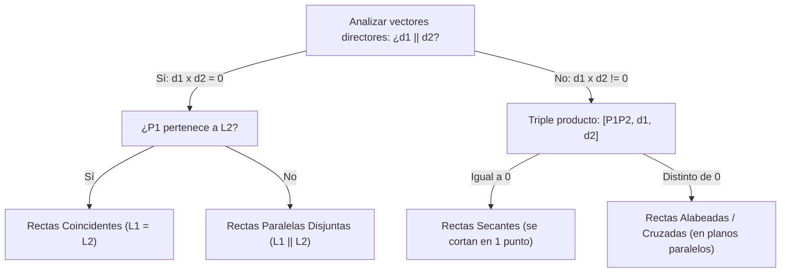

# Unidad 2: Espacios $\mathbb{R}^2$ y $\mathbb{R}^3$ — Geometría Vectorial, Rectas y Planos

> [!info] Leyenda de Trazabilidad de Fuentes
> Con el fin de garantizar la máxima rigurosidad académica, trazabilidad y procedencia conceptual en la carrera de Ingeniería Civil Informática de la Universidad San Sebastián (USS), cada sección, definición y teorema incluye distintivos explícitos:
> - 🎓 `[Cátedra USS / Diapositivas Docente Carol Asencio]`: Contenido curricular directo, deducciones analíticas, definiciones y banco completo de 17 ejercicios de cátedra extraídos de las diapositivas oficiales de Carol Asencio González (Álgebra Lineal DCEX0007, USS Patagonia).
> - 📖 `[Texto Guía — Grossman / Axler / Aranda]`: Fundamentación teórica formal, demostraciones matemáticas rigurosas y propiedades algebraicas avanzadas (*Grossman 7ª Ed.*, *Axler 4ª Ed.* y *Aranda - Álgebra Lineal con Python*).
> - 🌐 `[Enriquecimiento Web / Computación Gráfica / Historia]`: Génesis histórica del análisis vectorial (Hamilton, Gibbs, Heaviside), reducción de ecuaciones de Maxwell, y algoritmos clave en computación gráfica 3D (Möller-Trumbore ray-triangle, backface culling, reflexión para shaders PBR) junto con verificación computacional.

---

## 📌 1. Introducción y Fundamentos de $\mathbb{R}^2$ y $\mathbb{R}^3$

### 1.1 Definición Formal de Vector en $\mathbb{R}^n$ ($n=2,3$) 🎓 `[Cátedra USS / Programa Oficial]`
Desde la perspectiva algebraica, el espacio euclídeo $n$-dimensional $\mathbb{R}^n$ se define como el conjunto de todas las $n$-tuplas ordenadas de números reales:

$$
\mathbb{R}^n = \left\{ \mathbf{v} = (v_1, v_2, \dots, v_n) : v_i \in \mathbb{R},\ i=1,\dots,n \right\}
$$

En particular, para el plano cartesiano ($n=2$) y el espacio tridimensional ($n=3$):
- En $\mathbb{R}^2$: $\mathbf{v} = (v_1, v_2) = v_1 \mathbf{i} + v_2 \mathbf{j}$, donde $\mathbf{i} = (1,0)$ y $\mathbf{j} = (0,1)$.
- En $\mathbb{R}^3$: $\mathbf{v} = (v_1, v_2, v_3) = v_1 \mathbf{i} + v_2 \mathbf{j} + v_3 \mathbf{k}$, donde $\mathbf{i} = (1,0,0)$, $\mathbf{j} = (0,1,0)$ y $\mathbf{k} = (0,0,1)$ constituyen la **base canónica ortonormal**.

Geométricamente, un vector es una clase de equivalencia de **segmentos de recta dirigidos** (vectores libres) caracterizados por tres atributos invariantes:
1. **Magnitud (o módulo):** la longitud del segmento.
2. **Dirección:** la recta de soporte o inclinación espacial.
3. **Sentido:** la orientación señalada por la punta de la flecha.

Si fijamos el punto inicial en el origen de coordenadas $O(0,0,0)$ y el punto final en $P(v_1, v_2, v_3)$, decimos que $\mathbf{v} = \overrightarrow{OP}$ es el **vector de posición** del punto $P$. Dados dos puntos arbitrarios en el espacio, $P(x_P, y_P, z_P)$ y $Q(x_Q, y_Q, z_Q)$, el vector geométrico dirigido desde $P$ hacia $Q$ viene dado por la diferencia:

$$
\overrightarrow{PQ} = Q - P = (x_Q - x_P,\ y_Q - y_P,\ z_Q - z_P)
$$

### 1.2 Operaciones Algebraicas y Propiedades de Espacio Vectorial 📖 `[Texto Guía — Grossman / Axler]`
Sean $\mathbf{u} = (u_1, u_2, u_3), \mathbf{v} = (v_1, v_2, v_3) \in \mathbb{R}^3$ y $\lambda \in \mathbb{R}$ un escalar. Se definen las dos operaciones fundamentales:

1. **Suma Vectorial:**
   $$
   \mathbf{u} + \mathbf{v} = (u_1 + v_1,\ u_2 + v_2,\ u_3 + v_3)
   $$
   *Interpretación geométrica:* Regla del paralelogramo o ley del triángulo (concatenación cabeza-cola).

2. **Multiplicación por Escalar:**
   $$
   \lambda \mathbf{v} = (\lambda v_1,\ \lambda v_2,\ \lambda v_3)
   $$
   *Interpretación geométrica:* Dilatación ($\lambda > 1$), contracción ($0 < \lambda < 1$), inversión de sentido ($\lambda < 0$) o colapso al vector nulo $\mathbf{0} = (0,0,0)$ si $\lambda = 0$.

> [!important] Estructura de Espacio Vectorial 📖 [Axler §1A]
> El conjunto $(\mathbb{R}^3, +, \cdot)$ dotado de estas operaciones satisface los 8 axiomas de espacio vectorial sobre el cuerpo $\mathbb{R}$:
> - Conmutatividad: $\mathbf{u} + \mathbf{v} = \mathbf{v} + \mathbf{u}$.
> - Asociatividad: $(\mathbf{u} + \mathbf{v}) + \mathbf{w} = \mathbf{u} + (\mathbf{v} + \mathbf{w})$.
> - Elemento neutro aditivo: $\exists\,\mathbf{0} = (0,0,0)$ tal que $\mathbf{v} + \mathbf{0} = \mathbf{v}$.
> - Elemento opuesto aditivo: $\exists\,(-\mathbf{v}) = (-v_1, -v_2, -v_3)$ tal que $\mathbf{v} + (-\mathbf{v}) = \mathbf{0}$.
> - Distributividad escalar sobre suma vectorial: $\lambda(\mathbf{u} + \mathbf{v}) = \lambda\mathbf{u} + \lambda\mathbf{v}$.
> - Distributividad de la suma de escalares: $(\lambda + \mu)\mathbf{v} = \lambda\mathbf{v} + \mu\mathbf{v}$.
> - Compatibilidad de escalares: $\lambda(\mu\mathbf{v}) = (\lambda\mu)\mathbf{v}$.
> - Identidad multiplicativa: $1\mathbf{v} = \mathbf{v}$.

### 1.3 Norma Euclídea, Distancia y Vector Unitario 📖 `[Grossman Cap. 4]`

> [!theorem] Definición de Norma Euclídea
> La **norma euclídea** (o longitud) de un vector $\mathbf{v} = (v_1, v_2, v_3) \in \mathbb{R}^3$ se define como:
> 
> $$
> \|\mathbf{v}\| = \sqrt{v_1^2 + v_2^2 + v_3^2}
> $$
> 
> Satisface rigurosamente las propiedades axiomáticas de toda norma:
> 1. No negatividad: $\|\mathbf{v}\| \ge 0$, y $\|\mathbf{v}\| = 0 \iff \mathbf{v} = \mathbf{0}$.
> 2. Homogeneidad absoluta: $\|\lambda \mathbf{v}\| = |\lambda| \|\mathbf{v}\|$ para todo $\lambda \in \mathbb{R}$.
> 3. Desigualdad triangular: $\|\mathbf{u} + \mathbf{v}\| \le \|\mathbf{u}\| + \|\mathbf{v}\|$.

**Deducción de la Distancia Euclídea por Teorema de Pitágoras:**
Sean $P(x_1, y_1, z_1)$ y $Q(x_2, y_2, z_2)$. Consideremos el punto intermedio en el plano horizontal $R(x_2, y_2, z_1)$:
1. El segmento $PR$ yace en un plano paralelo a $xy$. Por el Teorema de Pitágoras bidimensional:
   $$
   PR^2 = (x_2 - x_1)^2 + (y_2 - y_1)^2
   $$
2. El segmento $RQ$ es estrictamente vertical (paralelo al eje $z$) con longitud $|z_2 - z_1|$, y es ortogonal al segmento $PR$. Aplicando nuevamente el Teorema de Pitágoras en el triángulo rectángulo $\triangle PRQ$:
   $$
   PQ^2 = PR^2 + RQ^2 = (x_2 - x_1)^2 + (y_2 - y_1)^2 + (z_2 - z_1)^2
   $$
3. Extrayendo la raíz cuadrada positiva se obtiene la distancia métrica:
   $$
   d(P, Q) = \|\overrightarrow{PQ}\| = \sqrt{(x_2 - x_1)^2 + (y_2 - y_1)^2 + (z_2 - z_1)^2}
   $$

**Normalización de Vectores:**
Para cualquier vector no nulo $\mathbf{v} \neq \mathbf{0}$, el **vector unitario** (o versor) con idéntica dirección y sentido es:

$$
\hat{\mathbf{v}} = \frac{\mathbf{v}}{\|\mathbf{v}\|}, \qquad \text{verificando que } \|\hat{\mathbf{v}}\| = \left\|\frac{\mathbf{v}}{\|\mathbf{v}\|}\right\| = \frac{1}{\|\mathbf{v}\|}\|\mathbf{v}\| = 1
$$

### 1.4 Conexión Bidireccional con Matrices 🔗 `[Álgebra Matricial]`
En el formalismo del Álgebra Lineal, todo vector $\mathbf{v} \in \mathbb{R}^3$ es canónicamente isomorfo al espacio de matrices columna $\mathcal{M}_{3 \times 1}(\mathbb{R})$:

$$
\mathbf{v} = (v_1, v_2, v_3) \iff \mathbf{v} = \begin{pmatrix} v_1 \\ v_2 \\ v_3 \end{pmatrix} \in \mathcal{M}_{3 \times 1}(\mathbb{R})
$$

Bajo esta correspondencia:
- La adición de vectores equivale exactamente a la suma matricial en $\mathcal{M}_{3 \times 1}(\mathbb{R})$.
- El producto por un escalar equivale a la ponderación matricial $\lambda A$.
- Toda combinación lineal de vectores $\{ \mathbf{v}_1, \mathbf{v}_2, \mathbf{v}_3 \}$ con ponderadores $c_1, c_2, c_3$ se expresa matricialmente mediante el producto matriz-vector:
  $$
  c_1 \mathbf{v}_1 + c_2 \mathbf{v}_2 + c_3 \mathbf{v}_3 = \begin{pmatrix} \mathbf{v}_1 & \mathbf{v}_2 & \mathbf{v}_3 \end{pmatrix} \begin{pmatrix} c_1 \\ c_2 \\ c_3 \end{pmatrix} = A \mathbf{c}
  $$
  donde $A \in \mathcal{M}_{3 \times 3}(\mathbb{R})$ tiene a los vectores como sus columnas (ver estudio sistemático en [Unidad 1: Matrices](../Unidad_1_Matrices_y_Sistemas/Matrices.md)).

#### Diagrama Representativo de la Sección 1: Fundamentos de Vectores en $\mathbb{R}^2$ y $\mathbb{R}^3$
Representación gráfica bidimensional (regla del paralelogramo para la suma vectorial) y tridimensional (vector de posición y sus 3 componentes cartesianas):


---

## 📐 2. Producto Escalar (Punto) y Ortogonalidad

### 2.1 Definiciones Algebraica y Geométrica 📖 `[Grossman §4.2]`

> [!theorem] Definición Algebraica del Producto Escalar
> Dados $\mathbf{u} = (u_1, u_2, u_3)$ y $\mathbf{v} = (v_1, v_2, v_3)$ en $\mathbb{R}^3$, su **producto escalar** (o producto punto) es la función $\cdot : \mathbb{R}^3 \times \mathbb{R}^3 \to \mathbb{R}$ dada por:
> 
> $$
> \mathbf{u} \cdot \mathbf{v} = \sum_{i=1}^{3} u_i v_i = u_1 v_1 + u_2 v_2 + u_3 v_3 = \mathbf{u}^T \mathbf{v}
> $$

> [!theorem] Definición Geométrica del Producto Escalar
> Si $\theta \in [0, \pi]$ es el ángulo convexo entre los vectores no nulos $\mathbf{u}$ y $\mathbf{v}$, entonces:
> 
> $$
> \mathbf{u} \cdot \mathbf{v} = \|\mathbf{u}\| \|\mathbf{v}\| \cos\theta
> $$

**Deducción de la Equivalencia mediante la Ley del Coseno:**
Consideremos el triángulo formado por los vectores $\mathbf{u}$, $\mathbf{v}$ y el vector de cierre $\mathbf{w} = \mathbf{u} - \mathbf{v}$.
Por la Ley del Coseno sobre las longitudes de los lados:

$$
\|\mathbf{u} - \mathbf{v}\|^2 = \|\mathbf{u}\|^2 + \|\mathbf{v}\|^2 - 2\|\mathbf{u}\| \|\mathbf{v}\| \cos\theta
$$

Desarrollando el lado izquierdo mediante la definición algebraica y sus propiedades bilineales:

$$
\begin{aligned}
\|\mathbf{u} - \mathbf{v}\|^2 &= (\mathbf{u} - \mathbf{v}) \cdot (\mathbf{u} - \mathbf{v}) \\
&= \mathbf{u} \cdot \mathbf{u} - 2(\mathbf{u} \cdot \mathbf{v}) + \mathbf{v} \cdot \mathbf{v} \\
&= \|\mathbf{u}\|^2 - 2(\mathbf{u} \cdot \mathbf{v}) + \|\mathbf{v}\|^2
\end{aligned}
$$

Igualando ambas expresiones:

$$
\|\mathbf{u}\|^2 - 2(\mathbf{u} \cdot \mathbf{v}) + \|\mathbf{v}\|^2 = \|\mathbf{u}\|^2 + \|\mathbf{v}\|^2 - 2\|\mathbf{u}\| \|\mathbf{v}\| \cos\theta
$$

Cancelando $\|\mathbf{u}\|^2 + \|\mathbf{v}\|^2$ y dividiendo por $-2$:

$$
\mathbf{u} \cdot \mathbf{v} = \|\mathbf{u}\| \|\mathbf{v}\| \cos\theta \quad \blacksquare
$$

Como consecuencia directa, el coseno del ángulo entre dos vectores se despeja como:

$$
\cos\theta = \frac{\mathbf{u} \cdot \mathbf{v}}{\|\mathbf{u}\| \|\mathbf{v}\|} = \frac{u_1 v_1 + u_2 v_2 + u_3 v_3}{\sqrt{u_1^2 + u_2^2 + u_3^2}\sqrt{v_1^2 + v_2^2 + v_3^2}}
$$

### 2.2 Criterios de Ortogonalidad y Paralelismo 🎓 `[Cátedra USS]`
1. **Ortogonalidad (Perpendicularidad):** Dos vectores $\mathbf{u}$ y $\mathbf{v}$ son ortogonales ($\mathbf{u} \perp \mathbf{v}$) si y solo si:
   $$
   \mathbf{u} \cdot \mathbf{v} = 0
   $$
   *(Para vectores no nulos, esto equivale a $\cos\theta = 0 \iff \theta = \frac{\pi}{2}$).*
2. **Paralelismo (Colinealidad):** $\mathbf{u}$ y $\mathbf{v}$ son paralelos ($\mathbf{u} \parallel \mathbf{v}$) si y solo si:
   $$
   |\mathbf{u} \cdot \mathbf{v}| = \|\mathbf{u}\| \|\mathbf{v}\| \iff \cos\theta = \pm 1 \iff \mathbf{u} = c\mathbf{v} \quad (c \in \mathbb{R})
   $$
3. **Signo del Producto Escalar:**
   - $\mathbf{u} \cdot \mathbf{v} > 0 \iff \theta \in \left[0, \frac{\pi}{2}\right)$ (ángulo agudo).
   - $\mathbf{u} \cdot \mathbf{v} = 0 \iff \theta = \frac{\pi}{2}$ (vectores perpendiculares).
   - $\mathbf{u} \cdot \mathbf{v} < 0 \iff \theta \in \left(\frac{\pi}{2}, \pi\right]$ (ángulo obtuso).

### 2.3 Cosenos Directores en $\mathbb{R}^3$ 📖 `[Grossman §4.3]`
Sea $\mathbf{v} = (v_1, v_2, v_3) \in \mathbb{R}^3$ con $\mathbf{v} \neq \mathbf{0}$. Se definen los **ángulos directores** $\alpha, \beta, \gamma \in [0, \pi]$ como los ángulos que forma $\mathbf{v}$ con los semiejes positivos $x$, $y$, $z$, correspondientes a los vectores canónicos $\mathbf{i} = (1,0,0)$, $\mathbf{j} = (0,1,0)$ y $\mathbf{k} = (0,0,1)$.

Aplicando la fórmula geométrica del producto escalar:

$$
\cos\alpha = \frac{\mathbf{v} \cdot \mathbf{i}}{\|\mathbf{v}\| \|\mathbf{i}\|} = \frac{v_1}{\|\mathbf{v}\|}, \qquad
\cos\beta = \frac{\mathbf{v} \cdot \mathbf{j}}{\|\mathbf{v}\| \|\mathbf{j}\|} = \frac{v_2}{\|\mathbf{v}\|}, \qquad
\cos\gamma = \frac{\mathbf{v} \cdot \mathbf{k}}{\|\mathbf{v}\| \|\mathbf{k}\|} = \frac{v_3}{\|\mathbf{v}\|}
$$

> [!theorem] Teorema de la Suma de Cuadrados de Cosenos Directores
> Para todo vector no nulo $\mathbf{v} \in \mathbb{R}^3$, se verifica idénticamente:
> 
> $$
> \cos^2\alpha + \cos^2\beta + \cos^2\gamma = 1
> $$

*Demostración Formal:*
Sustituimos directamente los cocientes en la suma de los cuadrados:

$$
\cos^2\alpha + \cos^2\beta + \cos^2\gamma = \left( \frac{v_1}{\|\mathbf{v}\|} \right)^2 + \left( \frac{v_2}{\|\mathbf{v}\|} \right)^2 + \left( \frac{v_3}{\|\mathbf{v}\|} \right)^2 = \frac{v_1^2 + v_2^2 + v_3^2}{\|\mathbf{v}\|^2}
$$

Puesto que por definición $\|\mathbf{v}\|^2 = v_1^2 + v_2^2 + v_3^2$, se tiene:

$$
\cos^2\alpha + \cos^2\beta + \cos^2\gamma = \frac{\|\mathbf{v}\|^2}{\|\mathbf{v}\|^2} = 1 \quad \blacksquare
$$

*Consecuencia geométrica:* Las componentes del vector unitario $\hat{\mathbf{v}}$ coinciden exactamente con los cosenos directores de $\mathbf{v}$:

$$
\hat{\mathbf{v}} = \frac{\mathbf{v}}{\|\mathbf{v}\|} = (\cos\alpha, \cos\beta, \cos\gamma)
$$

### 2.4 Proyección Ortogonal y Componente Escalar 📖 `[Grossman / Axler]`

Dado un vector $\mathbf{v}$ y una dirección no nula $\mathbf{u} \neq \mathbf{0}$, nos proponemos descomponer $\mathbf{v}$ en la suma de dos vectores mutuamente ortogonales:

$$
\mathbf{v} = \mathbf{p} + \mathbf{r}, \quad \text{donde } \mathbf{p} \parallel \mathbf{u} \text{ y } \mathbf{r} \perp \mathbf{u}
$$

El vector $\mathbf{p}$ se denomina **proyección ortogonal de $\mathbf{v}$ sobre $\mathbf{u}$**, denotado $\mathrm{proy}_{\mathbf{u}}\mathbf{v}$.

**Derivación Rigurosa de las Fórmulas:**
1. Dado que $\mathbf{p} \parallel \mathbf{u}$, debe existir un escalar único $c \in \mathbb{R}$ tal que:
   $$
   \mathbf{p} = c\mathbf{u}
   $$
2. El residuo ortogonal es $\mathbf{r} = \mathbf{v} - \mathbf{p} = \mathbf{v} - c\mathbf{u}$.
3. Imponiendo la condición de perpendicularidad $\mathbf{r} \perp \mathbf{u}$:
   $$
   (\mathbf{v} - c\mathbf{u}) \cdot \mathbf{u} = 0 \implies \mathbf{v} \cdot \mathbf{u} - c(\mathbf{u} \cdot \mathbf{u}) = 0
   $$
4. Como $\mathbf{u} \neq \mathbf{0}$, $\mathbf{u} \cdot \mathbf{u} = \|\mathbf{u}\|^2 > 0$. Despejando $c$:
   $$
   c = \frac{\mathbf{v} \cdot \mathbf{u}}{\|\mathbf{u}\|^2}
   $$

Por lo tanto:

$$
\mathrm{proy}_{\mathbf{u}}\mathbf{v} = \left( \frac{\mathbf{v} \cdot \mathbf{u}}{\|\mathbf{u}\|^2} \right) \mathbf{u} = \left( \mathbf{v} \cdot \hat{\mathbf{u}} \right) \hat{\mathbf{u}}
$$

La magnitud con signo de esta proyección sobre la dirección unitaria $\hat{\mathbf{u}}$ se denomina **componente escalar**:

$$
\mathrm{comp}_{\mathbf{u}}\mathbf{v} = \frac{\mathbf{v} \cdot \mathbf{u}}{\|\mathbf{u}\|} = \|\mathbf{v}\|\cos\theta
$$

Notemos que $\mathrm{proy}_{\mathbf{u}}\mathbf{v} = (\mathrm{comp}_{\mathbf{u}}\mathbf{v}) \hat{\mathbf{u}}$.

#### Diagrama Representativo de la Sección 2: Proyección Ortogonal y Cosenos Directores
Ilustración bidimensional de la proyección ortogonal y residuo perpendicular, junto con la disposición tridimensional de los ángulos y cosenos directores $\alpha, \beta, \gamma$:


### 2.5 Teorema: Desigualdad de Cauchy-Schwarz 📖 `[Axler §6A]`

> [!theorem] Desigualdad de Cauchy-Schwarz
> Para cualesquiera vectores $\mathbf{u}, \mathbf{v} \in \mathbb{R}^n$, se cumple:
> 
> $$
> |\mathbf{u} \cdot \mathbf{v}| \le \|\mathbf{u}\| \|\mathbf{v}\|
> $$
> 
> La igualdad se cumple si y solo si $\mathbf{u}$ y $\mathbf{v}$ son linealmente dependientes (es decir, uno es múltiplo escalar del otro).

**Demostración Geométrica Elegante (Método de Axler):**
- Si $\mathbf{v} = \mathbf{0}$, ambos miembros valen $0$, verificándose trivialmente la igualdad.
- Supongamos $\mathbf{v} \neq \mathbf{0}$. Descomponemos $\mathbf{u}$ en su proyección sobre $\mathbf{v}$ y un residuo ortogonal $\mathbf{w}$:
  $$
  \mathbf{u} = \frac{\mathbf{u} \cdot \mathbf{v}}{\|\mathbf{v}\|^2} \mathbf{v} + \mathbf{w}
  $$
  donde $\mathbf{w} = \mathbf{u} - \frac{\mathbf{u} \cdot \mathbf{v}}{\|\mathbf{v}\|^2}\mathbf{v}$. Verificamos que $\mathbf{w}$ es ortogonal a $\mathbf{v}$:
  $$
  \mathbf{w} \cdot \mathbf{v} = \left( \mathbf{u} - \frac{\mathbf{u} \cdot \mathbf{v}}{\|\mathbf{v}\|^2}\mathbf{v} \right) \cdot \mathbf{v} = \mathbf{u} \cdot \mathbf{v} - \frac{\mathbf{u} \cdot \mathbf{v}}{\|\mathbf{v}\|^2}(\mathbf{v} \cdot \mathbf{v}) = \mathbf{u} \cdot \mathbf{v} - \mathbf{u} \cdot \mathbf{v} = 0
  $$
  Puesto que $\frac{\mathbf{u} \cdot \mathbf{v}}{\|\mathbf{v}\|^2}\mathbf{v}$ y $\mathbf{w}$ son ortogonales, aplicamos el **Teorema de Pitágoras**:
  $$
  \|\mathbf{u}\|^2 = \left\| \frac{\mathbf{u} \cdot \mathbf{v}}{\|\mathbf{v}\|^2}\mathbf{v} \right\|^2 + \|\mathbf{w}\|^2 = \frac{|\mathbf{u} \cdot \mathbf{v}|^2}{\|\mathbf{v}\|^4}\|\mathbf{v}\|^2 + \|\mathbf{w}\|^2 = \frac{|\mathbf{u} \cdot \mathbf{v}|^2}{\|\mathbf{v}\|^2} + \|\mathbf{w}\|^2
  $$
  Dado que la norma siempre es no negativa ($\|\mathbf{w}\|^2 \ge 0$), se deduce la desigualdad:
  $$
  \|\mathbf{u}\|^2 \ge \frac{|\mathbf{u} \cdot \mathbf{v}|^2}{\|\mathbf{v}\|^2}
  $$
  Multiplicando ambos lados por $\|\mathbf{v}\|^2 > 0$:
  $$
  \|\mathbf{u}\|^2 \|\mathbf{v}\|^2 \ge |\mathbf{u} \cdot \mathbf{v}|^2
  $$
  Extrayendo la raíz cuadrada positiva a ambos miembros:
  $$
  |\mathbf{u} \cdot \mathbf{v}| \le \|\mathbf{u}\| \|\mathbf{v}\| \quad \blacksquare
  $$
  *Condición de igualdad:* Se alcanza la igualdad estricta $\iff \|\mathbf{w}\|^2 = 0 \iff \mathbf{w} = \mathbf{0} \iff \mathbf{u} = \left(\frac{\mathbf{u} \cdot \mathbf{v}}{\|\mathbf{v}\|^2}\right)\mathbf{v}$, lo que significa que $\mathbf{u}$ es múltiplo escalar de $\mathbf{v}$ (linealmente dependientes).

---

## ✖️ 3. Producto Cruz (Vectorial) y Triple Producto Escalar

### 3.1 Definición Formal y Regla Mnemotécnica $3 \times 3$ 🎓 `[Cátedra USS]`
El **producto cruz** (o vectorial) es una operación definida exclusivamente en el espacio tridimensional $\mathbb{R}^3$, que asocia a dos vectores $\mathbf{u}$ y $\mathbf{v}$ un tercer vector $\mathbf{u} \times \mathbf{v} \in \mathbb{R}^3$.

> [!theorem] Definición del Producto Cruz
> Sean $\mathbf{u} = (u_1, u_2, u_3)$ y $\mathbf{v} = (v_1, v_2, v_3)$. El producto cruz se define como:
> 
> $$
> \mathbf{u} \times \mathbf{v} = (u_2 v_3 - u_3 v_2,\ u_3 v_1 - u_1 v_3,\ u_1 v_2 - u_2 v_1)
> $$
> 
> Se calcula mnemotécnicamente expandiendo por la primera fila el siguiente arreglo simbólico de orden $3 \times 3$:
> 
> $$
> \mathbf{u} \times \mathbf{v} = \begin{vmatrix} \mathbf{i} & \mathbf{j} & \mathbf{k} \\ u_1 & u_2 & u_3 \\ v_1 & v_2 & v_3 \end{vmatrix} = \begin{vmatrix} u_2 & u_3 \\ v_2 & v_3 \end{vmatrix}\mathbf{i} - \begin{vmatrix} u_1 & u_3 \\ v_1 & v_3 \end{vmatrix}\mathbf{j} + \begin{vmatrix} u_1 & u_2 \\ v_1 & v_2 \end{vmatrix}\mathbf{k}
> $$

### 3.2 Propiedades Fundamentales y Ortogonalidad Cruzada 📖 `[Grossman §4.4]`
1. **Anticonmutatividad:** $\mathbf{u} \times \mathbf{v} = -(\mathbf{v} \times \mathbf{u})$ (al permutar dos filas en un determinante se invierte el signo).
2. **Distributividad sobre la suma:** $\mathbf{u} \times (\mathbf{v} + \mathbf{w}) = (\mathbf{u} \times \mathbf{v}) + (\mathbf{u} \times \mathbf{w})$.
3. **Homogeneidad con escalares:** $(\lambda\mathbf{u}) \times \mathbf{v} = \mathbf{u} \times (\lambda\mathbf{v}) = \lambda(\mathbf{u} \times \mathbf{v})$.
4. **Auto-anulación:** $\mathbf{u} \times \mathbf{u} = \mathbf{0}$ para todo $\mathbf{u} \in \mathbb{R}^3$.
5. **Ortogonalidad Simultánea:** $\mathbf{u} \cdot (\mathbf{u} \times \mathbf{v}) = 0$ y $\mathbf{v} \cdot (\mathbf{u} \times \mathbf{v}) = 0$.

*Demostración Analítica de la Ortogonalidad:*
Evaluamos el producto escalar entre $\mathbf{u}$ y $\mathbf{u} \times \mathbf{v}$:

$$
\begin{aligned}
\mathbf{u} \cdot (\mathbf{u} \times \mathbf{v}) &= u_1(u_2 v_3 - u_3 v_2) + u_2(u_3 v_1 - u_1 v_3) + u_3(u_1 v_2 - u_2 v_1) \\
&= u_1 u_2 v_3 - u_1 u_3 v_2 + u_2 u_3 v_1 - u_2 u_1 v_3 + u_3 u_1 v_2 - u_3 u_2 v_1 \\
&= (u_1 u_2 v_3 - u_2 u_1 v_3) + (-u_1 u_3 v_2 + u_3 u_1 v_2) + (u_2 u_3 v_1 - u_3 u_2 v_1) \\
&= 0 + 0 + 0 = 0 \quad \blacksquare
\end{aligned}
$$

Idéntico desarrollo confirma que $\mathbf{v} \cdot (\mathbf{u} \times \mathbf{v}) = 0$. En consecuencia, $\mathbf{u} \times \mathbf{v}$ es perpendicular tanto a $\mathbf{u}$ como a $\mathbf{v}$ (y por tanto normal al plano generado por ellos), orientándose según la **regla de la mano derecha**.

### 3.3 Teorema: Identidad de Lagrange y Magnitud Geométrica 📖 `[Grossman §4.4]`

> [!theorem] Identidad de Lagrange
> Para cualesquiera vectores $\mathbf{u}, \mathbf{v} \in \mathbb{R}^3$, se verifica algebraicamente:
> 
> $$
> \|\mathbf{u} \times \mathbf{v}\|^2 = \|\mathbf{u}\|^2 \|\mathbf{v}\|^2 - (\mathbf{u} \cdot \mathbf{v})^2
> $$

**Demostración Analítica Término a Término:**
Expandimos el término izquierdo a partir de las componentes de $\mathbf{u} \times \mathbf{v}$:

$$
\begin{aligned}
\|\mathbf{u} \times \mathbf{v}\|^2 &= (u_2 v_3 - u_3 v_2)^2 + (u_3 v_1 - u_1 v_3)^2 + (u_1 v_2 - u_2 v_1)^2 \\
&= (u_2^2 v_3^2 - 2 u_2 u_3 v_2 v_3 + u_3^2 v_2^2) \\
&\quad + (u_3^2 v_1^2 - 2 u_3 u_1 v_3 v_1 + u_1^2 v_3^2) \\
&\quad + (u_1^2 v_2^2 - 2 u_1 u_2 v_1 v_2 + u_2^2 v_1^2) \quad \text{--- (Expresión 1)}
\end{aligned}
$$

Por otra parte, desarrollamos el segundo miembro $\|\mathbf{u}\|^2 \|\mathbf{v}\|^2 - (\mathbf{u} \cdot \mathbf{v})^2$:

$$
\|\mathbf{u}\|^2 \|\mathbf{v}\|^2 = (u_1^2 + u_2^2 + u_3^2)(v_1^2 + v_2^2 + v_3^2) = \sum_{i=1}^3 \sum_{j=1}^3 u_i^2 v_j^2
$$

El cuadrado del producto escalar es:

$$
(\mathbf{u} \cdot \mathbf{v})^2 = (u_1 v_1 + u_2 v_2 + u_3 v_3)^2 = \sum_{i=1}^3 u_i^2 v_i^2 + 2(u_1 u_2 v_1 v_2 + u_1 u_3 v_1 v_3 + u_2 u_3 v_2 v_3)
$$

Restando ambas sumas, los tres términos diagonales idénticos $u_1^2 v_1^2 + u_2^2 v_2^2 + u_3^2 v_3^2$ se anulan exactamente, quedando:

$$
\begin{aligned}
\|\mathbf{u}\|^2 \|\mathbf{v}\|^2 - (\mathbf{u} \cdot \mathbf{v})^2 &= (u_1^2 v_2^2 + u_1^2 v_3^2 + u_2^2 v_1^2 + u_2^2 v_3^2 + u_3^2 v_1^2 + u_3^2 v_2^2) \\
&\quad - 2(u_1 u_2 v_1 v_2 + u_1 u_3 v_1 v_3 + u_2 u_3 v_2 v_3)
\end{aligned}
$$

Agrupando los términos por binomios al cuadrado, vemos que coincide exactamente con la (Expresión 1). Por ende:

$$
\|\mathbf{u} \times \mathbf{v}\|^2 = \|\mathbf{u}\|^2 \|\mathbf{v}\|^2 - (\mathbf{u} \cdot \mathbf{v})^2 \quad \blacksquare
$$

**Consecuencia Geométrica Inmediata:**
Sustituyendo la definición geométrica $\mathbf{u} \cdot \mathbf{v} = \|\mathbf{u}\| \|\mathbf{v}\| \cos\theta$:

$$
\|\mathbf{u} \times \mathbf{v}\|^2 = \|\mathbf{u}\|^2 \|\mathbf{v}\|^2 - \|\mathbf{u}\|^2 \|\mathbf{v}\|^2 \cos^2\theta = \|\mathbf{u}\|^2 \|\mathbf{v}\|^2 (1 - \cos^2\theta) = \|\mathbf{u}\|^2 \|\mathbf{v}\|^2 \sin^2\theta
$$

Dado que $\theta \in [0, \pi]$, se tiene $\sin\theta \ge 0$. Extrayendo raíz cuadrada:

$$
\|\mathbf{u} \times \mathbf{v}\| = \|\mathbf{u}\| \|\mathbf{v}\| \sin\theta
$$

> [!tip] Interpretación Geométrica de Áreas
> 1. **Área del Paralelogramo:** sustentado por los vectores $\mathbf{u}$ y $\mathbf{v}$:
>    $$
>    \text{Área}_{\text{paralelogramo}} = \text{base} \times \text{altura} = \|\mathbf{u}\| (\|\mathbf{v}\|\sin\theta) = \|\mathbf{u} \times \mathbf{v}\|
>    $$
> 2. **Área del Triángulo:** determinado por los vértices del paralelogramo:
>    $$
>    \text{Área}_{\triangle} = \frac{1}{2} \|\mathbf{u} \times \mathbf{v}\|
>    $$
> 3. **Criterio de Paralelismo:** Para vectores no nulos, $\mathbf{u} \parallel \mathbf{v} \iff \theta \in \{0, \pi\} \iff \sin\theta = 0 \iff \mathbf{u} \times \mathbf{v} = \mathbf{0}$.

### 3.4 Triple Producto Escalar (Mixto) y Volumen 📖 `[Grossman §4.4]`

> [!theorem] Definición del Triple Producto Escalar
> Sean $\mathbf{u}, \mathbf{v}, \mathbf{w} \in \mathbb{R}^3$. El **triple producto escalar** (o producto mixto) se define como:
> 
> $$
> [\mathbf{u}, \mathbf{v}, \mathbf{w}] = \mathbf{u} \cdot (\mathbf{v} \times \mathbf{w})
> $$
> 
> Coincide exactamente con el determinante de la matriz cuyas filas son las componentes de los tres vectores:
> 
> $$
> \mathbf{u} \cdot (\mathbf{v} \times \mathbf{w}) = \det\begin{pmatrix} u_1 & u_2 & u_3 \\ v_1 & v_2 & v_3 \\ w_1 & w_2 & w_3 \end{pmatrix}
> $$

**Interpretación Geométrica del Volumen:**
El valor absoluto del triple producto escalar representa el volumen del **paralelepípedo** tridimensional cuyas aristas concurrentes son $\mathbf{u}, \mathbf{v}, \mathbf{w}$:

$$
V_{\text{paralelepípedo}} = | \mathbf{u} \cdot (\mathbf{v} \times \mathbf{w}) | = |\det(\mathbf{u}, \mathbf{v}, \mathbf{w})|
$$

*Justificación:* El área de la base es $A = \|\mathbf{v} \times \mathbf{w}\|$. La altura $h$ es la proyección de $\mathbf{u}$ sobre la dirección normal a la base $\mathbf{n} = \mathbf{v} \times \mathbf{w}$, esto es $h = \|\mathbf{u}\| |\cos\phi|$. Por ende:
$$
V = A \cdot h = \|\mathbf{v} \times \mathbf{w}\| \|\mathbf{u}\| |\cos\phi| = | \mathbf{u} \cdot (\mathbf{v} \times \mathbf{w}) |
$$

Para un **tetraedro** con aristas $\mathbf{u}, \mathbf{v}, \mathbf{w}$:

$$
V_{\text{tetraedro}} = \frac{1}{6} | \mathbf{u} \cdot (\mathbf{v} \times \mathbf{w}) |
$$

> [!important] Criterio de Coplanaridad
> Tres vectores $\mathbf{u}, \mathbf{v}, \mathbf{w} \in \mathbb{R}^3$ son **coplanares** (yacen en un mismo plano o en planos paralelos) si y solo si el paralelepípedo colapsa (volumen nulo):
> 
> $$
> \mathbf{u} \cdot (\mathbf{v} \times \mathbf{w}) = 0 \iff \det\begin{pmatrix} \mathbf{u} \\ \mathbf{v} \\ \mathbf{w} \end{pmatrix} = 0
> $$
> 
> Conexión directa: esto equivale a que las tres filas/vectores sean **linealmente dependientes** en $\mathbb{R}^3$ (ver `Matrices — Determinantes`).

#### Diagrama Representativo de la Sección 3: Producto Cruz, Área y Torque 3D
Representación del paralelogramo sustentado por $\mathbf{u}$ y $\mathbf{v}$ en $\mathbb{R}^3$ con su vector normal de producto cruz, y la aplicación física del vector de torsión $\boldsymbol{\tau} = \mathbf{r} \times \mathbf{F}$:


---

## 📏 4. Rectas en el Espacio $\mathbb{R}^3$

### 4.1 Ecuaciones de la Recta 🎓 `[Cátedra USS / Diapositivas]`
Una recta $L$ en $\mathbb{R}^3$ queda unívocamente determinada cuando se especifica:
- Un punto conocido por donde pasa: $P_0(x_0, y_0, z_0)$ con vector de posición $\mathbf{r}_0 = (x_0, y_0, z_0)$.
- Un vector director no nulo que fija su orientación: $\mathbf{d} = (a, b, c) \neq \mathbf{0}$.

#### 1. Ecuación Vectorial:
Un punto arbitrario $P(x,y,z)$ con vector de posición $\mathbf{r} = (x,y,z)$ pertenece a la recta $L$ si y solo si el vector desplazamiento $\overrightarrow{P_0 P}$ es colineal con $\mathbf{d}$:

$$
\mathbf{r}(t) = \mathbf{r}_0 + t \mathbf{d}, \quad t \in \mathbb{R}
$$

O en coordenadas: $(x, y, z) = (x_0, y_0, z_0) + t(a, b, c)$.

#### 2. Ecuaciones Paramétricas:
Igualando componente a componente:

$$
\begin{cases}
x = x_0 + a t \\
y = y_0 + b t \\
z = z_0 + c t
\end{cases} \quad (t \in \mathbb{R})
$$

#### 3. Ecuaciones Simétricas (o Continuas):
Si todos los números directores son no nulos ($a \neq 0, b \neq 0, c \neq 0$), despejamos el parámetro escalar $t$:

$$
\frac{x - x_0}{a} = \frac{y - y_0}{b} = \frac{z - z_0}{c}
$$

*Caso particular:* Si uno de los directores es nulo, por ejemplo $b = 0$ con $a \neq 0, c \neq 0$, la variable $y$ permanece constante y las ecuaciones simétricas se expresan:
$$
\frac{x - x_0}{a} = \frac{z - z_0}{c}, \qquad y = y_0
$$

### 4.2 Posiciones Relativas de Dos Rectas en $\mathbb{R}^3$ 📖 `[Grossman §4.5]`
Dadas dos rectas $L_1: \mathbf{r}_1(s) = P_1 + s\mathbf{d}_1$ y $L_2: \mathbf{r}_2(t) = P_2 + t\mathbf{d}_2$:



1. **Coincidentes:** $\mathbf{d}_1 \parallel \mathbf{d}_2$ ($\mathbf{d}_1 \times \mathbf{d}_2 = \mathbf{0}$) y el punto $P_1$ satisface las ecuaciones de $L_2$.
2. **Paralelas Disjuntas:** $\mathbf{d}_1 \parallel \mathbf{d}_2$ ($\mathbf{d}_1 \times \mathbf{d}_2 = \mathbf{0}$) pero $P_1 \notin L_2$.
3. **Secantes:** $\mathbf{d}_1 \nparallel \mathbf{d}_2$, son coplanares ($[\overrightarrow{P_1P_2}, \mathbf{d}_1, \mathbf{d}_2] = 0$) y existe un único par $(s_0, t_0)$ tal que $\mathbf{r}_1(s_0) = \mathbf{r}_2(t_0)$.
4. **Alabeadas (o Cruzadas):** No son paralelas ($\mathbf{d}_1 \times \mathbf{d}_2 \neq \mathbf{0}$) y no se intersecan, situándose en planos espaciales distintos ($[\overrightarrow{P_1P_2}, \mathbf{d}_1, \mathbf{d}_2] \neq 0$).

### 4.3 Distancia de un Punto a una Recta 📖 `[Grossman §4.5]`

> [!theorem] Distancia de un Punto a una Recta
> La distancia euclídea mínima desde un punto $Q(x_1, y_1, z_1)$ a una recta $L$ que pasa por $P_0$ con dirección $\mathbf{d}$ viene dada por:
> 
> $$
> d(Q, L) = \frac{\|\mathbf{d} \times \overrightarrow{P_0 Q}\|}{\|\mathbf{d}\|}
> $$

**Demostración Geométrica:**
Consideremos el paralelogramo sustentado por el vector director $\mathbf{d}$ y el vector $\overrightarrow{P_0 Q}$.
- La base del paralelogramo tiene longitud $b = \|\mathbf{d}\|$.
- El área del paralelogramo es $A = \|\mathbf{d} \times \overrightarrow{P_0 Q}\|$.
- La altura $h$ perpendicular a la base corresponde con la distancia mínima desde $Q$ hasta la recta $L$:
  $$
  A = \text{base} \times \text{altura} \implies \|\mathbf{d} \times \overrightarrow{P_0 Q}\| = \|\mathbf{d}\| \cdot d(Q, L)
  $$
- Despejando $d(Q, L)$ se obtiene la fórmula directa $\blacksquare$.

### 4.4 Distancia Mínima entre Dos Rectas Alabeadas 🌐 `[UdeC / Grossman]`

> [!theorem] Distancia entre Rectas Alabeadas
> Sean $L_1(P_1, \mathbf{d}_1)$ y $L_2(P_2, \mathbf{d}_2)$ dos rectas alabeadas en $\mathbb{R}^3$. La distancia mínima entre ambas es:
> 
> $$
> d(L_1, L_2) = \frac{|\overrightarrow{P_1 P_2} \cdot (\mathbf{d}_1 \times \mathbf{d}_2)|}{\|\mathbf{d}_1 \times \mathbf{d}_2\|}
> $$

**Deducción:**
El vector perpendicular común a ambas direcciones es $\mathbf{n} = \mathbf{d}_1 \times \mathbf{d}_2$. La distancia entre las rectas equivale a proyectar ortogonalmente cualquier vector que una ambas rectas (como $\overrightarrow{P_1 P_2}$) sobre este vector normal unitario $\hat{\mathbf{n}}$:

$$
d(L_1, L_2) = |\mathrm{comp}_{\mathbf{n}}\overrightarrow{P_1 P_2}| = \frac{|\overrightarrow{P_1 P_2} \cdot \mathbf{n}|}{\|\mathbf{n}\|} = \frac{|\overrightarrow{P_1 P_2} \cdot (\mathbf{d}_1 \times \mathbf{d}_2)|}{\|\mathbf{d}_1 \times \mathbf{d}_2\|} \quad \blacksquare
$$

#### Diagrama Representativo de la Sección 4: Rectas en el Espacio y Rectas Alabeadas
Visualización tridimensional de la ecuación vectorial de una recta $\mathbf{r}(t) = P_0 + t\mathbf{d}$ y la disposición de dos rectas alabeadas con su vector perpendicular común:


---

## 🔲 5. Planos en el Espacio $\mathbb{R}^3$

### 5.1 Ecuación Vectorial, Normal y Cartesiana 🎓 `[Cátedra USS]`
Un plano $\pi$ en $\mathbb{R}^3$ queda determinado por:
- Un punto contenido en él: $P_0(x_0, y_0, z_0)$.
- Un vector normal ortogonal al plano: $\mathbf{n} = (a, b, c) \neq \mathbf{0}$.

#### 1. Ecuación Vectorial Normal:
Un punto $P(x,y,z)$ pertenece al plano $\pi$ si y solo si el vector desplazamiento $\overrightarrow{P_0 P} = (x - x_0, y - y_0, z - z_0)$ es ortogonal al vector normal $\mathbf{n}$:

$$
\mathbf{n} \cdot (\mathbf{r} - \mathbf{r}_0) = 0
$$

#### 2. Ecuación Cartesiana (General o Implícita):
Desarrollando el producto escalar:

$$
a(x - x_0) + b(y - y_0) + c(z - z_0) = 0 \implies ax + by + cz + d = 0
$$

donde el término independiente es $d = -(a x_0 + b y_0 + c z_0)$.

> [!note] Plano por Tres Puntos No Colineales
> Dados tres puntos no alineados $P, Q, R \in \mathbb{R}^3$, construimos dos vectores coplanares al plano: $\mathbf{u} = \overrightarrow{PQ} = Q - P$ y $\mathbf{v} = \overrightarrow{PR} = R - P$.
> El vector normal del plano se determina mediante el producto cruz:
> 
> $$
> \mathbf{n} = \overrightarrow{PQ} \times \overrightarrow{PR}
> $$

### 5.2 Distancia de un Punto a un Plano 📖 `[Grossman §4.5]`

> [!theorem] Distancia de un Punto a un Plano
> La distancia desde un punto arbitrario $P_1(x_1, y_1, z_1)$ al plano $\pi: ax + by + cz + d = 0$ es:
> 
> $$
> d(P_1, \pi) = \frac{|a x_1 + b y_1 + c z_1 + d|}{\sqrt{a^2 + b^2 + c^2}}
> $$

**Demostración por Proyección Ortogonal:**
Sea $P_0(x_0, y_0, z_0)$ un punto perteneciente al plano, de modo que satisface $a x_0 + b y_0 + c z_0 + d = 0 \implies d = -(a x_0 + b y_0 + c z_0)$.
El segmento perpendicular desde $P_1$ al plano es la proyección del vector $\overrightarrow{P_0 P_1} = (x_1 - x_0, y_1 - y_0, z_1 - z_0)$ sobre la dirección normal $\mathbf{n} = (a, b, c)$:

$$
d(P_1, \pi) = |\mathrm{comp}_{\mathbf{n}}\overrightarrow{P_0 P_1}| = \frac{|\overrightarrow{P_0 P_1} \cdot \mathbf{n}|}{\|\mathbf{n}\|}
$$

Evaluando el producto escalar en el numerador:

$$
\overrightarrow{P_0 P_1} \cdot \mathbf{n} = a(x_1 - x_0) + b(y_1 - y_0) + c(z_1 - z_0) = (a x_1 + b y_1 + c z_1) - (a x_0 + b y_0 + c z_0)
$$

Sustituyendo el valor de $d$:

$$
\overrightarrow{P_0 P_1} \cdot \mathbf{n} = a x_1 + b y_1 + c z_1 + d
$$

Como $\|\mathbf{n}\| = \sqrt{a^2 + b^2 + c^2}$, reemplazando en el cociente se concluye:

$$
d(P_1, \pi) = \frac{|a x_1 + b y_1 + c z_1 + d|}{\sqrt{a^2 + b^2 + c^2}} \quad \blacksquare
$$

### 5.3 Ángulo Diedro y Recta de Intersección entre Planos 🎓 `[Cátedra USS / Diapositivas]`

Sean dos planos $\pi_1$ y $\pi_2$ con vectores normales $\mathbf{n}_1 = (a_1, b_1, c_1)$ y $\mathbf{n}_2 = (a_2, b_2, c_2)$ respectivamente:

1. **Planos Paralelos:**
   $$
   \pi_1 \parallel \pi_2 \iff \mathbf{n}_1 \parallel \mathbf{n}_2 \iff \mathbf{n}_1 = k \mathbf{n}_2 \quad (k \neq 0) \iff \mathbf{n}_1 \times \mathbf{n}_2 = \mathbf{0}
   $$
2. **Planos Perpendiculares:**
   $$
   \pi_1 \perp \pi_2 \iff \mathbf{n}_1 \cdot \mathbf{n}_2 = 0
   $$
3. **Ángulo Diedro Agudo ($\theta \in [0, \pi/2]$):**
   $$
   \cos\theta = \frac{|\mathbf{n}_1 \cdot \mathbf{n}_2|}{\|\mathbf{n}_1\| \|\mathbf{n}_2\|}
   $$
4. **Recta de Intersección entre Planos Secantes:**
   Si $\mathbf{n}_1 \nparallel \mathbf{n}_2$, la intersección $\pi_1 \cap \pi_2$ define una recta $L$ en $\mathbb{R}^3$. El vector director de dicha recta es perpendicular a ambas normales simultáneamente:
   $$
   \mathbf{d}_L = \mathbf{n}_1 \times \mathbf{n}_2
   $$
   Para obtener las ecuaciones paramétricas completas de $L$, se fija una coordenada constante (por ejemplo $z=0$) y se resuelve el sistema $2 \times 2$ resultante para hallar un punto $P_0 \in \pi_1 \cap \pi_2$.

### 5.4 Intersección entre Recta y Plano 🎓 `[Cátedra USS / Diapositivas]`

Dada una recta $L: \mathbf{r}(t) = P_0 + t\mathbf{d}$ con ecuaciones paramétricas $x = x_0 + a t$, $y = y_0 + b t$, $z = z_0 + c t$, y un plano cartesiano $\pi: A x + B y + C z = D$:

- **Método Sistemático por Sustitución:** Se sustituyen directamente las expresiones paramétricas en la ecuación general del plano:
  $$
  A(x_0 + a t) + B(y_0 + b t) + C(z_0 + c t) = D
  $$
  $$
  (A x_0 + B y_0 + C z_0) + t(A a + B b + C c) = D \implies t (\mathbf{n} \cdot \mathbf{d}) = D - \mathbf{n} \cdot P_0
  $$

- **Clasificación Topológica de Soluciones:**
  1. **Solución Única ($\mathbf{n} \cdot \mathbf{d} \neq 0$):** La recta corta al plano en un **único punto** $P = \mathbf{r}(t^*)$.
  2. **Infinitas Soluciones ($\mathbf{n} \cdot \mathbf{d} = 0$ y $D - \mathbf{n} \cdot P_0 = 0$):** La recta está **completamente contenida** en el plano ($L \subset \pi$).
  3. **Sin Solución ($\mathbf{n} \cdot \mathbf{d} = 0$ y $D - \mathbf{n} \cdot P_0 \neq 0$):** La recta es **estrictamente paralela y disjunta** al plano ($L \parallel \pi$, $L \cap \pi = \emptyset$).

### 5.5 Distancias Euclídeas de Cátedra: Recta-Plano, Plano-Plano y Rectas Paralelas 🎓 `[Cátedra USS]`

1. **Distancia entre Recta y Plano Paralelos ($L \parallel \pi$):**
   Si $\mathbf{d} \cdot \mathbf{n} = 0$, todos los puntos de la recta equidistan del plano. Tomando un punto arbitrario $P_0 \in L$:
   $$
   d(L, \pi) = d(P_0, \pi) = \frac{|A x_0 + B y_0 + C z_0 - D|}{\sqrt{A^2 + B^2 + C^2}}
   $$

2. **Distancia entre Dos Planos Paralelos ($\pi_1 \parallel \pi_2$):**
   Sean $\pi_1: A x + B y + C z = D_1$ y $\pi_2: A x + B y + C z = D_2$ con coeficientes normales normalizados o idénticos. La distancia mínima viene dada por:
   $$
   d(\pi_1, \pi_2) = \frac{|D_2 - D_1|}{\sqrt{A^2 + B^2 + C^2}} = \frac{|D_2 - D_1|}{\|\mathbf{n}\|}
   $$

3. **Distancia entre Dos Rectas Paralelas ($L_1 \parallel L_2$):**
   Sean $L_1$ que pasa por $P_1$ con director $\mathbf{d}$, y $L_2$ que pasa por $P_2$ con el mismo director $\mathbf{d}$. La distancia entre ambas rectas es la altura del paralelogramo sustentado por $\mathbf{d}$ y $\overrightarrow{P_1 P_2}$:
   $$
   d(L_1, L_2) = \frac{\|\mathbf{d} \times \overrightarrow{P_1 P_2}\|}{\|\mathbf{d}\|}
   $$

### 5.6 Intersección de Tres Planos y Conexión con el Teorema de Rouché-Frobenius 🔗 `[Matrices]`

La intersección simultánea de tres planos en el espacio tridimensional:

$$
\begin{cases}
\pi_1: a_1 x + b_1 y + c_1 z = d_1 \\
\pi_2: a_2 x + b_2 y + c_2 z = d_2 \\
\pi_3: a_3 x + b_3 y + c_3 z = d_3
\end{cases}
$$

se formula matricialmente como el sistema lineal $A \mathbf{x} = \mathbf{b}$:

$$
\begin{pmatrix}
a_1 & b_1 & c_1 \\
a_2 & b_2 & c_2 \\
a_3 & b_3 & c_3
\end{pmatrix}
\begin{pmatrix} x \\ y \\ z \end{pmatrix}
=
\begin{pmatrix} d_1 \\ d_2 \\ d_3 \end{pmatrix},
\qquad
(A|B) = \begin{pmatrix}
a_1 & b_1 & c_1 & d_1 \\
a_2 & b_2 & c_2 & d_2 \\
a_3 & b_3 & c_3 & d_3
\end{pmatrix}
$$

Conforme al **Teorema de Rouché-Frobenius** estudiado en `Matrices — Clasificación de Sistemas`, la configuración geométrica de los 3 planos queda completamente determinada por los rangos $\mathrm{rg}(A)$ y $\mathrm{rg}(A \mid B)$:

| $\mathrm{rg}(A)$ | $\mathrm{rg}(A \mid B)$ | Clasificación del Sistema | Configuración Geométrica en $\mathbb{R}^3$ |
| :---: | :---: | :--- | :--- |
| **$3$** | **$3$** | **SCD** (Solución única, $\det A \neq 0$) | Los 3 planos se intersecan en un **único punto** (vértice común). |
| **$2$** | **$2$** | **SCI** ($1$ grado de libertad, $\infty$ sol.) | Los 3 planos se intersecan en una **recta común** (haz de planos) o dos coinciden y cortan al tercero en recta. |
| **$1$** | **$1$** | **SCI** ($2$ grados de libertad, $\infty$ sol.) | Los 3 planos son **completamente coincidentes** (el mismo plano). |
| **$2$** | **$3$** | **SI** (Incompatible, sin solución) | **Prisma triangular** (se cortan dos a dos en 3 rectas paralelas) o dos son paralelos cortados por el tercero. |
| **$1$** | **$2$** | **SI** (Incompatible, sin solución) | Los 3 planos son **estrictamente paralelos disjuntos** (o dos coincidentes y uno paralelo). |

#### Diagrama Representativo de la Sección 5: Planos en el Espacio e Intersección de 3 Planos
Visualización tridimensional de la ecuación general del plano con su vector normal $\mathbf{n}$, y la clasificación geométrica de la intersección de 3 planos según el Teorema de Rouché-Frobenius:


---

## 💡 6. Ejercicios Resueltos Detallados y Casos Prácticos

### 6.1 Caso Práctico 1: Momento de Torsión (Torque 3D) 🌐 `[UdeC Mecánica Vectorial]`
> [!example] Enunciado
> En una estructura robótica articulada, se aplica una fuerza $\mathbf{F} = (10, 20, -5)\,\text{N}$ en el extremo de un brazo posicionado en $\mathbf{r} = (2, -1, 3)\,\text{m}$ con respecto al origen de giro $O$.
> 1. Calcular el vector momento de torsión (torque) $\boldsymbol{\tau} = \mathbf{r} \times \mathbf{F}$.
> 2. Verificar analíticamente que $\boldsymbol{\tau}$ es ortogonal tanto al vector de posición $\mathbf{r}$ como al vector de fuerza $\mathbf{F}$.
> 3. Determinar la magnitud $\|\boldsymbol{\tau}\|$ y el versor unitario del eje de giro.

**Resolución Paso a Paso:**

1. **Cálculo del Producto Cruz:**
   $$
   \boldsymbol{\tau} = \mathbf{r} \times \mathbf{F} = \begin{vmatrix}
   \mathbf{i} & \mathbf{j} & \mathbf{k} \\
   2 & -1 & 3 \\
   10 & 20 & -5
   \end{vmatrix}
   $$
   Desarrollando los menores complementarios de orden 2:
   - Componente $\mathbf{i}$:
     $$
     \tau_x = (-1)(-5) - (3)(20) = 5 - 60 = -55
     $$
   - Componente $\mathbf{j}$:
     $$
     \tau_y = - [ (2)(-5) - (3)(10) ] = - [ -10 - 30 ] = -(-40) = 40
     $$
   - Componente $\mathbf{k}$:
     $$
     \tau_z = (2)(20) - (-1)(10) = 40 + 10 = 50
     $$
   Por lo tanto:
   $$
   \boldsymbol{\tau} = (-55, 40, 50)\,\text{N}\cdot\text{m}
   $$

2. **Verificación de Ortogonalidad:**
   - Con $\mathbf{r}$:
     $$
     \boldsymbol{\tau} \cdot \mathbf{r} = (-55)(2) + (40)(-1) + (50)(3) = -110 - 40 + 150 = 0
     $$
   - Con $\mathbf{F}$:
     $$
     \boldsymbol{\tau} \cdot \mathbf{F} = (-55)(10) + (40)(20) + (50)(-5) = -550 + 800 - 250 = 0
     $$
   Ambos productos escalares son idénticamente nulos, confirmando que $\boldsymbol{\tau} \perp \mathbf{r}$ y $\boldsymbol{\tau} \perp \mathbf{F}$.

3. **Magnitud y Eje de Giro:**
   $$
   \|\boldsymbol{\tau}\| = \sqrt{(-55)^2 + 40^2 + 50^2} = \sqrt{3025 + 1600 + 2500} = \sqrt{7125} = 5\sqrt{285} \approx 84.41\,\text{N}\cdot\text{m}
   $$
   El versor unitario del eje de rotación inducido es:
   $$
   \hat{\mathbf{u}}_\tau = \frac{\boldsymbol{\tau}}{\|\boldsymbol{\tau}\|} = \frac{1}{5\sqrt{285}} (-55, 40, 50) = \left( -\frac{11}{\sqrt{285}},\ \frac{8}{\sqrt{285}},\ \frac{10}{\sqrt{285}} \right)
   $$

---

### 6.2 Caso Práctico 2: Equilibrio Estático Tridimensional de un Nodo 🌐 `[Mecánica de Sólidos]`
> [!example] Enunciado
> Un anillo central de izaje ubicado en el origen $O(0,0,0)$ sostiene una carga vertical hacia abajo de peso $\mathbf{W} = (0, 0, -1140)\,\text{N}$. Para mantener el equilibrio estático ($\sum \mathbf{F} = \mathbf{0}$), se fijan tres cables tensores $A, B, C$ anclados en los puntos $A(1, 2, 2)$, $B(-2, 1, 2)$ y $C(0, -3, 4)$.
> Determinar las tensiones escalares $T_A, T_B, T_C$ que experimentan cada uno de los cables.

**Resolución Paso a Paso:**

1. **Vectores Directores y Normalización:**
   - Cable $A$: $\overrightarrow{OA} = (1, 2, 2)$, $\|\overrightarrow{OA}\| = \sqrt{1^2 + 2^2 + 2^2} = \sqrt{9} = 3$.
     $$
     \hat{\mathbf{u}}_A = \left(\frac{1}{3},\ \frac{2}{3},\ \frac{2}{3}\right)
     $$
   - Cable $B$: $\overrightarrow{OB} = (-2, 1, 2)$, $\|\overrightarrow{OB}\| = \sqrt{(-2)^2 + 1^2 + 2^2} = \sqrt{9} = 3$.
     $$
     \hat{\mathbf{u}}_B = \left(-\frac{2}{3},\ \frac{1}{3},\ \frac{2}{3}\right)
     $$
   - Cable $C$: $\overrightarrow{OC} = (0, -3, 4)$, $\|\overrightarrow{OC}\| = \sqrt{0^2 + (-3)^2 + 4^2} = \sqrt{25} = 5$.
     $$
     \hat{\mathbf{u}}_C = \left(0,\ -\frac{3}{5},\ \frac{4}{5}\right)
     $$

2. **Ecuación de Equilibrio Vectorial:**
   $$
   \mathbf{T}_A + \mathbf{T}_B + \mathbf{T}_C + \mathbf{W} = \mathbf{0} \implies T_A \hat{\mathbf{u}}_A + T_B \hat{\mathbf{u}}_B + T_C \hat{\mathbf{u}}_C = -\mathbf{W} = \begin{pmatrix} 0 \\ 0 \\ 1140 \end{pmatrix}
   $$

3. **Sistema de Ecuaciones Lineales Matricial:**
   $$
   \begin{pmatrix}
   1/3 & -2/3 & 0 \\
   2/3 & 1/3 & -3/5 \\
   2/3 & 2/3 & 4/5
   \end{pmatrix}
   \begin{pmatrix} T_A \\ T_B \\ T_C \end{pmatrix}
   =
   \begin{pmatrix} 0 \\ 0 \\ 1140 \end{pmatrix}
   $$

4. **Resolución Analítica:**
   - De la primera ecuación (eje $x$):
     $$
     \frac{1}{3} T_A - \frac{2}{3} T_B = 0 \implies T_A = 2 T_B
     $$
   - Sustituyendo $T_A = 2 T_B$ en la segunda ecuación (eje $y$):
     $$
     \frac{2}{3}(2 T_B) + \frac{1}{3} T_B - \frac{3}{5} T_C = 0 \implies \frac{5}{3} T_B - \frac{3}{5} T_C = 0 \implies T_C = \frac{25}{9} T_B
     $$
   - Sustituyendo $T_A$ y $T_C$ en la tercera ecuación (eje $z$):
     $$
     \frac{2}{3}(2 T_B) + \frac{2}{3} T_B + \frac{4}{5}\left(\frac{25}{9} T_B\right) = 1140
     $$
     $$
     \frac{4}{3} T_B + \frac{2}{3} T_B + \frac{20}{9} T_B = 1140 \implies 2 T_B + \frac{20}{9} T_B = 1140 \implies \frac{38}{9} T_B = 1140
     $$
     $$
     T_B = \frac{1140 \times 9}{38} = 30 \times 9 = 270\,\text{N}
     $$
   - Despeje de las tensiones restantes:
     $$
     T_A = 2(270) = 540\,\text{N}
     $$
     $$
     T_C = \frac{25}{9}(270) = 25 \times 30 = 750\,\text{N}
     $$

*Conclusión Física:* Los tres cables se encuentran bajo tracción pura positiva: $T_A = 540\,\text{N}$, $T_B = 270\,\text{N}$ y $T_C = 750\,\text{N}$.

---

### 6.3 Caso Práctico 3: Geometría Espacial — Paralelepípedo y Tetraedro 📖 `[Grossman Cap. 4]`
> [!example] Enunciado
> Sean los puntos en el espacio $P(1, 0, 2)$, $Q(3, 2, 1)$, $R(2, 4, 5)$ y $S(1, 3, 6)$.
> 1. Determinar los vectores arista $\mathbf{u} = \overrightarrow{PQ}$, $\mathbf{v} = \overrightarrow{PR}$ y $\mathbf{w} = \overrightarrow{PS}$.
> 2. Calcular el volumen del paralelepípedo y del tetraedro sustentados por dichos vectores.
> 3. Calcular la altura del paralelepípedo con respecto a la base formada por $\mathbf{u}$ y $\mathbf{v}$.

**Resolución Paso a Paso:**

1. **Vectores Arista:**
   $$
   \mathbf{u} = Q - P = (3-1, 2-0, 1-2) = (2, 2, -1)
   $$
   $$
   \mathbf{v} = R - P = (2-1, 4-0, 5-2) = (1, 4, 3)
   $$
   $$
   \mathbf{w} = S - P = (1-1, 3-0, 6-2) = (0, 3, 4)
   $$

2. **Producto Cruz de la Base ($\mathbf{u} \times \mathbf{v}$):**
   $$
   \mathbf{u} \times \mathbf{v} = \begin{vmatrix}
   \mathbf{i} & \mathbf{j} & \mathbf{k} \\
   2 & 2 & -1 \\
   1 & 4 & 3
   \end{vmatrix}
   = \mathbf{i}(6 - (-4)) - \mathbf{j}(6 - (-1)) + \mathbf{k}(8 - 2) = (10, -7, 6)
   $$
   Área de la base paralelográmica:
   $$
   A_{\text{base}} = \|\mathbf{u} \times \mathbf{v}\| = \sqrt{10^2 + (-7)^2 + 6^2} = \sqrt{100 + 49 + 36} = \sqrt{185} \approx 13.60\,\text{u}^2
   $$

3. **Triple Producto Escalar y Volúmenes:**
   $$
   \mathbf{w} \cdot (\mathbf{u} \times \mathbf{v}) = 0(10) + 3(-7) + 4(6) = 0 - 21 + 24 = 3
   $$
   - Volumen del paralelepípedo:
     $$
     V_{\text{paralelepípedo}} = | \mathbf{w} \cdot (\mathbf{u} \times \mathbf{v}) | = |3| = 3\,\text{u}^3
     $$
   - Volumen del tetraedro:
     $$
     V_{\text{tetraedro}} = \frac{1}{6} V_{\text{paralelepípedo}} = \frac{3}{6} = \frac{1}{2} = 0.5\,\text{u}^3
     $$

4. **Altura con respecto a la Base:**
   $$
   h = \frac{V_{\text{paralelepípedo}}}{A_{\text{base}}} = \frac{3}{\sqrt{185}} = \frac{3\sqrt{185}}{185} \approx 0.2206\,\text{u}
   $$

---

### 6.4 Ejercicio Tipo Certamen 1 (UdeC): Posición Relativa y Distancia entre Rectas Alabeadas 🌐 `[Certamen Álgebra Lineal UdeC]`
> [!example] Enunciado
> Dadas las rectas en $\mathbb{R}^3$:
> $$
> L_1: \frac{x - 1}{2} = \frac{y + 1}{3} = z - 2, \qquad L_2: \mathbf{r}_2(t) = (2, 0, -1) + t(1, -1, 2)
> $$
> 1. Demostrar rigurosamente que $L_1$ y $L_2$ son rectas alabeadas (cruzadas).
> 2. Calcular la distancia mínima que las separa en el espacio.
> 3. Determinar la ecuación general del plano $\pi$ que contiene a $L_1$ y es estrictamente paralelo a $L_2$.

**Resolución Paso a Paso:**

1. **Extracción de Elementos Geométricos:**
   - Para $L_1$: Pasa por $P_1(1, -1, 2)$ con vector director $\mathbf{d}_1 = (2, 3, 1)$.
   - Para $L_2$: Pasa por $P_2(2, 0, -1)$ con vector director $\mathbf{d}_2 = (1, -1, 2)$.
   - Vector entre puntos: $\overrightarrow{P_1 P_2} = P_2 - P_1 = (2-1, 0-(-1), -1-2) = (1, 1, -3)$.

2. **Comprobación de Rectas Alabeadas:**
   - *Verificación de paralelismo:*
     $$
     \mathbf{d}_1 \times \mathbf{d}_2 = \begin{vmatrix}
     \mathbf{i} & \mathbf{j} & \mathbf{k} \\
     2 & 3 & 1 \\
     1 & -1 & 2
     \end{vmatrix}
     = \mathbf{i}(6 - (-1)) - \mathbf{j}(4 - 1) + \mathbf{k}(-2 - 3) = (7, -3, -5) \neq \mathbf{0}
     $$
     Al ser $\mathbf{d}_1 \times \mathbf{d}_2 \neq \mathbf{0}$, las rectas **no son paralelas ni coincidentes**.
   - *Verificación de coplanaridad (Triple Producto Escalar):*
     $$
     [\overrightarrow{P_1 P_2}, \mathbf{d}_1, \mathbf{d}_2] = \overrightarrow{P_1 P_2} \cdot (\mathbf{d}_1 \times \mathbf{d}_2) = 1(7) + 1(-3) + (-3)(-5) = 7 - 3 + 15 = 19 \neq 0
     $$
     Puesto que el triple producto escalar no es nulo, los vectores no son coplanares. En consecuencia, las rectas **no se cortan y son estrictamente alabeadas**.

3. **Cálculo de la Distancia Mínima:**
   $$
   \|\mathbf{d}_1 \times \mathbf{d}_2\| = \sqrt{7^2 + (-3)^2 + (-5)^2} = \sqrt{49 + 9 + 25} = \sqrt{83}
   $$
   $$
   d(L_1, L_2) = \frac{|\overrightarrow{P_1 P_2} \cdot (\mathbf{d}_1 \times \mathbf{d}_2)|}{\|\mathbf{d}_1 \times \mathbf{d}_2\|} = \frac{19}{\sqrt{83}} = \frac{19\sqrt{83}}{83} \approx 2.0855\,\text{u}
   $$

4. **Plano $\pi$ que contiene a $L_1$ y es paralelo a $L_2$:**
   - El plano pasa por $P_1(1, -1, 2)$ y tiene por vector normal a $\mathbf{n} = \mathbf{d}_1 \times \mathbf{d}_2 = (7, -3, -5)$.
   - Ecuación del plano:
     $$
     7(x - 1) - 3(y + 1) - 5(z - 2) = 0
     $$
     $$
     7x - 7 - 3y - 3 - 5z + 10 = 0 \implies 7x - 3y - 5z = 0
     $$
   *Verificación adicional:* Calculamos la distancia de $P_2(2, 0, -1) \in L_2$ a este plano $\pi$:
   $$
   d(P_2, \pi) = \frac{|7(2) - 3(0) - 5(-1)|}{\sqrt{7^2 + (-3)^2 + (-5)^2}} = \frac{|14 + 5|}{\sqrt{83}} = \frac{19}{\sqrt{83}}
   $$
   El resultado coincide exactamente con la distancia entre ambas rectas.

---

### 6.5 Ejercicio Tipo Certamen 2 (UdeC): Plano Perpendicular a Dos Planos y Distancia Punto-Plano 🌐 `[Certamen Álgebra Lineal UdeC]`
> [!example] Enunciado
> Determinar la ecuación general del plano $\pi$ que pasa por el punto $M(1, -2, 4)$ y es perpendicular simultáneamente a los planos:
> $$
> \pi_1: 2x - y + 3z = 4, \qquad \pi_2: x + 2y - z = 1
> $$
> Posteriormente, calcular la distancia euclídea exacta desde el punto $K(3, 1, 2)$ al plano obtenido $\pi$.

**Resolución Paso a Paso:**

1. **Vectores Normales de los Planos Dados:**
   - Para $\pi_1$: $\mathbf{n}_1 = (2, -1, 3)$.
   - Para $\pi_2$: $\mathbf{n}_2 = (1, 2, -1)$.

2. **Construcción del Vector Normal de $\pi$:**
   Para que el plano buscado sea perpendicular a $\pi_1$ y a $\pi_2$, su vector normal $\mathbf{n}_\pi$ debe ser simultáneamente ortogonal a $\mathbf{n}_1$ y a $\mathbf{n}_2$. Por lo tanto:
   $$
   \mathbf{n}_\pi = \mathbf{n}_1 \times \mathbf{n}_2 = \begin{vmatrix}
   \mathbf{i} & \mathbf{j} & \mathbf{k} \\
   2 & -1 & 3 \\
   1 & 2 & -1
   \end{vmatrix}
   = \mathbf{i}(1 - 6) - \mathbf{j}(-2 - 3) + \mathbf{k}(4 - (-1)) = (-5, 5, 5)
   $$
   Podemos simplificar el vector normal multiplicando por el escalar $\frac{1}{5}$:
   $$
   \mathbf{n}'_\pi = (-1, 1, 1) \quad \text{o equivalentemente } (1, -1, -1)
   $$

3. **Ecuación Cartesiana del Plano $\pi$:**
   Haciendo uso de $\mathbf{n}'_\pi = (1, -1, -1)$ y el punto $M(1, -2, 4)$:
   $$
   1(x - 1) - 1(y - (-2)) - 1(z - 4) = 0
   $$
   $$
   x - 1 - (y + 2) - (z - 4) = 0 \implies x - y - z + 1 = 0
   $$
   *Comprobación en $M$:* $1 - (-2) - 4 + 1 = 1 + 2 - 4 + 1 = 0$.

4. **Distancia desde $K(3, 1, 2)$ al Plano $\pi$:**
   Aplicando la fórmula de distancia punto-plano para $\pi: x - y - z + 1 = 0$:
   $$
   d(K, \pi) = \frac{|1(3) - 1(1) - 1(2) + 1|}{\sqrt{1^2 + (-1)^2 + (-1)^2}} = \frac{|3 - 1 - 2 + 1|}{\sqrt{1 + 1 + 1}} = \frac{|1|}{\sqrt{3}} = \frac{\sqrt{3}}{3} \approx 0.5774\,\text{u}
   $$

---

---

### 6.6 Banco Canónico de 17 Ejercicios y Ejemplos de Cátedra USS (Slides 1 a 44 — Carol Asencio) 🎓 `[Cátedra USS / Diapositivas Docente]`

Este compendio reúne y resuelve paso a paso con máxima rigurosidad analítica los **17 problemas y ejemplos oficiales** presentados en las 44 diapositivas de la asignatura por la docente **Carol Asencio González**, verificados simbólicamente con SymPy.

#### Ejercicio 1 (Slide 8): Combinación Lineal y Operaciones Básicas en $\mathbb{R}^3$
> [!example] Enunciado
> Sean los vectores $\mathbf{v} = (1, -2, 0)$ y $\mathbf{w} = (3, 4, -1)$ en $\mathbb{R}^3$. Determine analíticamente el vector resultante de la combinación lineal:
> 
> $$
> \mathbf{u} = 2\mathbf{v} - 3\mathbf{w}
> $$

**Resolución Paso a Paso:**
1. Aplicamos la multiplicación por escalar componente a componente:
   $$
   2\mathbf{v} = 2(1, -2, 0) = (2(1), 2(-2), 2(0)) = (2, -4, 0)
   $$
   $$
   3\mathbf{w} = 3(3, 4, -1) = (3(3), 3(4), 3(-1)) = (9, 12, -3)
   $$
2. Efectuamos la resta vectorial componente a componente:
   $$
   \mathbf{u} = 2\mathbf{v} - 3\mathbf{w} = (2 - 9,\ -4 - 12,\ 0 - (-3)) = (-7, -16, 3)
   $$
*Resultado Verificado:* $\mathbf{u} = (-7, -16, 3)$.

---

#### Ejercicio 2 (Slide 10): Producto Punto en $\mathbb{R}^3$ y $\mathbb{R}^2$
> [!example] Enunciado
> Calcule el producto escalar euclídeo para cada uno de los siguientes pares de vectores:
> 1. $\mathbf{v} = (2, -1, 3)$ y $\mathbf{w} = (-1, 0, 4)$ en $\mathbb{R}^3$.
> 2. $\mathbf{v} = (1, 4)$ y $\mathbf{w} = (-2, 3)$ en $\mathbb{R}^2$.

**Resolución Paso a Paso:**
1. Para el par tridimensional en $\mathbb{R}^3$:
   $$
   \mathbf{v} \cdot \mathbf{w} = v_1 w_1 + v_2 w_2 + v_3 w_3 = 2(-1) + (-1)(0) + 3(4) = -2 + 0 + 12 = 10
   $$
2. Para el par bidimensional en $\mathbb{R}^2$:
   $$
   \mathbf{v} \cdot \mathbf{w} = v_1 w_1 + v_2 w_2 = 1(-2) + 4(3) = -2 + 12 = 10
   $$
*Conclusión:* Ambos pares arrojan un producto punto estrictamente positivo ($10 > 0$), indicando que en ambos casos los vectores forman un ángulo convexo agudo ($\theta < 90^\circ$).

---

#### Ejercicio 3 (Slide 14): Módulo y Dirección Analítica en los Cuatro Cuadrantes
> [!example] Enunciado
> Calcule la norma $\|\mathbf{v}\|$ y el ángulo director polar $\theta \in [0, 2\pi)$ medido desde el semieje positivo de las abscisas para cada uno de los siguientes vectores de $\mathbb{R}^2$:
> 1. $\mathbf{v}_1 = (2, 2)$
> 2. $\mathbf{v}_2 = (2, 2\sqrt{3})$
> 3. $\mathbf{v}_3 = (-3, -3)$
> 4. $\mathbf{v}_4 = (0, 3)$

**Resolución Paso a Paso:**
1. **Para $\mathbf{v}_1 = (2, 2)$ (Cuadrante I):**
   - Norma: $\|\mathbf{v}_1\| = \sqrt{2^2 + 2^2} = \sqrt{4 + 4} = \sqrt{8} = 2\sqrt{2}$.
   - Dirección: Al estar en el primer cuadrante ($x > 0, y > 0$), $\tan\theta = \frac{2}{2} = 1 \implies \theta = \arctan(1) = \frac{\pi}{4}\ (45^\circ)$.
2. **Para $\mathbf{v}_2 = (2, 2\sqrt{3})$ (Cuadrante I):**
   - Norma: $\|\mathbf{v}_2\| = \sqrt{2^2 + (2\sqrt{3})^2} = \sqrt{4 + 12} = \sqrt{16} = 4$.
   - Dirección: $\tan\theta = \frac{2\sqrt{3}}{2} = \sqrt{3} \implies \theta = \arctan(\sqrt{3}) = \frac{\pi}{3}\ (60^\circ)$.
3. **Para $\mathbf{v}_3 = (-3, -3)$ (Cuadrante III):**
   - Norma: $\|\mathbf{v}_3\| = \sqrt{(-3)^2 + (-3)^2} = \sqrt{9 + 9} = \sqrt{18} = 3\sqrt{2}$.
   - Dirección: Al encontrarse en el tercer cuadrante ($x < 0, y < 0$), el ángulo se ajusta sumando $\pi$:
     $$
     \theta = \pi + \arctan\left(\frac{-3}{-3}\right) = \pi + \frac{\pi}{4} = \frac{5\pi}{4}\ (225^\circ)
     $$
4. **Para $\mathbf{v}_4 = (0, 3)$ (Sobre el semieje positivo $y$):**
   - Norma: $\|\mathbf{v}_4\| = \sqrt{0^2 + 3^2} = \sqrt{9} = 3$.
   - Dirección: Con $x = 0$ e $y > 0$, el vector apunta verticalmente hacia arriba: $\theta = \frac{\pi}{2}\ (90^\circ)$.

---

#### Ejercicio 4 (Slides 16–17): Deducción de $\mathbf{v}\cdot\mathbf{w} = \|\mathbf{v}\|\|\mathbf{w}\|\cos\theta$ y Ángulo entre Vectores
> [!example] Enunciado
> 1. Demuestre analíticamente mediante la Ley de Cosenos que $\mathbf{v} \cdot \mathbf{w} = \|\mathbf{v}\| \|\mathbf{w}\| \cos\theta$.
> 2. Determine el ángulo convexo $\theta$ formado por los vectores $\mathbf{v} = (2, 3)$ y $\mathbf{w} = (-1, 2)$ en $\mathbb{R}^2$.
> 3. Determine el ángulo convexo $\theta$ formado por $\mathbf{v} = (1, 0, -1)$ y $\mathbf{w} = (1, 1, 0)$ en $\mathbb{R}^3$.

**Resolución Paso a Paso:**
1. **Deducción por Ley de Cosenos:**
   En el triángulo formado por los lados $\mathbf{v}$, $\mathbf{w}$ y el lado opuesto $\mathbf{v} - \mathbf{w}$, la Ley de Cosenos establece:
   $$
   \|\mathbf{v} - \mathbf{w}\|^2 = \|\mathbf{v}\|^2 + \|\mathbf{w}\|^2 - 2\|\mathbf{v}\| \|\mathbf{w}\| \cos\theta
   $$
   Desarrollando algebraicamente el cuadrado de la norma por producto interno:
   $$
   \|\mathbf{v} - \mathbf{w}\|^2 = (\mathbf{v} - \mathbf{w}) \cdot (\mathbf{v} - \mathbf{w}) = \|\mathbf{v}\|^2 - 2(\mathbf{v} \cdot \mathbf{w}) + \|\mathbf{w}\|^2
   $$
   Igualando miembro a miembro:
   $$
   \|\mathbf{v}\|^2 - 2(\mathbf{v} \cdot \mathbf{w}) + \|\mathbf{w}\|^2 = \|\mathbf{v}\|^2 + \|\mathbf{w}\|^2 - 2\|\mathbf{v}\| \|\mathbf{w}\| \cos\theta
   $$
   Cancelando $\|\mathbf{v}\|^2 + \|\mathbf{w}\|^2$ y dividiendo por $-2$, se concluye:
   $$
   \mathbf{v} \cdot \mathbf{w} = \|\mathbf{v}\| \|\mathbf{w}\| \cos\theta \implies \cos\theta = \frac{\mathbf{v} \cdot \mathbf{w}}{\|\mathbf{v}\| \|\mathbf{w}\|} \quad \blacksquare
   $$
2. **Cálculo para $\mathbf{v} = (2, 3)$ y $\mathbf{w} = (-1, 2)$:**
   - $\mathbf{v} \cdot \mathbf{w} = 2(-1) + 3(2) = -2 + 6 = 4$.
   - $\|\mathbf{v}\| = \sqrt{2^2 + 3^2} = \sqrt{13}$.
   - $\|\mathbf{w}\| = \sqrt{(-1)^2 + 2^2} = \sqrt{5}$.
   - Coseno: $\cos\theta = \frac{4}{\sqrt{13}\sqrt{5}} = \frac{4}{\sqrt{65}}$.
   - Ángulo: $\theta = \arccos\left(\frac{4}{\sqrt{65}}\right) \approx 60.255^\circ\ (1.05165\,\text{rad})$.
3. **Cálculo para $\mathbf{v} = (1, 0, -1)$ y $\mathbf{w} = (1, 1, 0)$:**
   - $\mathbf{v} \cdot \mathbf{w} = 1(1) + 0(1) + (-1)(0) = 1$.
   - $\|\mathbf{v}\| = \sqrt{1^2 + 0^2 + (-1)^2} = \sqrt{2}$.
   - $\|\mathbf{w}\| = \sqrt{1^2 + 1^2 + 0^2} = \sqrt{2}$.
   - Coseno: $\cos\theta = \frac{1}{\sqrt{2}\sqrt{2}} = \frac{1}{2}$.
   - Ángulo notable exacto: $\theta = \arccos\left(\frac{1}{2}\right) = \frac{\pi}{3} = 60^\circ$.

---

#### Ejercicio 5 (Slide 19): Verificación de Vectores Ortogonales y Búsqueda de Complementos
> [!example] Enunciado
> 1. Verifique si los vectores $\mathbf{v} = (1, -2, 3)$ y $\mathbf{w} = (4, 5, 2)$ son ortogonales entre sí.
> 2. Proponga un vector no nulo en $\mathbb{R}^2$ perpendicular a $\mathbf{a} = (3, -2)$.
> 3. Proponga un vector no nulo en $\mathbb{R}^3$ perpendicular a $\mathbf{b} = (1, 2, -3)$.

**Resolución Paso a Paso:**
1. **Comprobación de Ortogonalidad:**
   Dos vectores son ortogonales si y solo si su producto escalar es nulo:
   $$
   \mathbf{v} \cdot \mathbf{w} = 1(4) + (-2)(5) + 3(2) = 4 - 10 + 6 = 0
   $$
   Dado que $\mathbf{v} \cdot \mathbf{w} = 0$, los vectores son **estrictamente ortogonales** ($\mathbf{v} \perp \mathbf{w}$).
2. **Vector ortogonal a $\mathbf{a} = (3, -2)$:**
   Buscamos $\mathbf{u} = (x, y)$ tal que $3x - 2y = 0 \implies 3x = 2y$.
   Tomando $x = 2$, se tiene $y = 3$. Por ende, $\mathbf{u} = (2, 3)$ satisface:
   $$
   (3, -2) \cdot (2, 3) = 6 - 6 = 0 \implies \mathbf{u} = (2, 3) \perp \mathbf{a}
   $$
3. **Vector ortogonal a $\mathbf{b} = (1, 2, -3)$:**
   Buscamos $(x, y, z)$ tal que $x + 2y - 3z = 0$.
   Fijando $y = 0$ y $z = 1$, obtenemos $x = 3$. Así, el vector $\mathbf{w}_1 = (3, 0, 1)$ cumple:
   $$
   1(3) + 2(0) - 3(1) = 0 \implies \mathbf{w}_1 = (3, 0, 1) \perp \mathbf{b}
   $$
   (Otra solución válida fijando $z = 0$ y $y = 1$ es $\mathbf{w}_2 = (-2, 1, 0)$).

---

#### Ejercicio 6 (Slide 20): Discusión del Parámetro $\alpha$ para Ortogonalidad y Paralelismo
> [!example] Enunciado
> Sean los vectores $\mathbf{u} = 3\mathbf{i} + 4\mathbf{j} = (3, 4)$ y $\mathbf{v} = \mathbf{i} + \alpha\mathbf{j} = (1, \alpha)$ en $\mathbb{R}^2$. Determine el valor real del parámetro $\alpha$ tal que:
> 1. $\mathbf{u} \perp \mathbf{v}$ (vectores ortogonales).
> 2. $\mathbf{u} \parallel \mathbf{v}$ (vectores paralelos).

**Resolución Paso a Paso:**
1. **Condición de Ortogonalidad ($\mathbf{u} \perp \mathbf{v}$):**
   Se requiere que su producto escalar sea idénticamente nulo:
   $$
   \mathbf{u} \cdot \mathbf{v} = 0 \iff 3(1) + 4(\alpha) = 0 \iff 3 + 4\alpha = 0 \iff \alpha = -\frac{3}{4}
   $$
2. **Condición de Paralelismo ($\mathbf{u} \parallel \mathbf{v}$):**
   Dos vectores en $\mathbb{R}^2$ son paralelos si y solo si sus componentes son proporcionales (o su determinante $2 \times 2$ es nulo):
   $$
   \frac{u_x}{v_x} = \frac{u_y}{v_y} \iff \frac{3}{1} = \frac{4}{\alpha} \iff 3\alpha = 4 \iff \alpha = \frac{4}{3}
   $$
   *Comprobación:* Si $\alpha = 4/3$, entonces $\mathbf{u} = (3, 4) = 3(1, 4/3) = 3\mathbf{v}$, confirmando que son colineales con igual sentido ($c = 3 > 0$).

---

#### Ejercicio 7 (Slides 22–23): Cálculo Comparativo de Proyecciones Ortogonales Cruzadas
> [!example] Enunciado
> Sean los vectores en $\mathbb{R}^3$:
> 
> $$
> \mathbf{v} = (2, 3, 1) \qquad \text{y} \qquad \mathbf{w} = (1, 2, -1)
> $$
> 
> 1. Determine el vector proyección ortogonal de $\mathbf{v}$ sobre $\mathbf{w}$ ($\mathrm{proy}_{\mathbf{w}}\mathbf{v}$).
> 2. Determine el vector proyección ortogonal de $\mathbf{w}$ sobre $\mathbf{v}$ ($\mathrm{proy}_{\mathbf{v}}\mathbf{w}$).

**Resolución Paso a Paso:**
1. **Cálculo de $\mathrm{proy}_{\mathbf{w}}\mathbf{v}$:**
   - Producto escalar: $\mathbf{v} \cdot \mathbf{w} = 2(1) + 3(2) + 1(-1) = 2 + 6 - 1 = 7$.
   - Norma al cuadrado de $\mathbf{w}$: $\|\mathbf{w}\|^2 = 1^2 + 2^2 + (-1)^2 = 1 + 4 + 1 = 6$.
   - Proyección:
     $$
     \mathrm{proy}_{\mathbf{w}}\mathbf{v} = \left( \frac{\mathbf{v} \cdot \mathbf{w}}{\|\mathbf{w}\|^2} \right) \mathbf{w} = \frac{7}{6}(1, 2, -1) = \left( \frac{7}{6},\ \frac{7}{3},\ -\frac{7}{6} \right)
     $$
2. **Cálculo de $\mathrm{proy}_{\mathbf{v}}\mathbf{w}$:**
   - El producto escalar es conmutativo: $\mathbf{w} \cdot \mathbf{v} = 7$.
   - Norma al cuadrado de $\mathbf{v}$: $\|\mathbf{v}\|^2 = 2^2 + 3^2 + 1^2 = 4 + 9 + 1 = 14$.
   - Proyección:
     $$
     \mathrm{proy}_{\mathbf{v}}\mathbf{w} = \left( \frac{\mathbf{w} \cdot \mathbf{v}}{\|\mathbf{v}\|^2} \right) \mathbf{v} = \frac{7}{14}(2, 3, 1) = \frac{1}{2}(2, 3, 1) = \left( 1,\ \frac{3}{2},\ \frac{1}{2} \right)
     $$
*Observación Conceptual:* Se comprueba empíricamente que la proyección ortogonal no es conmutativa ni simétrica: $\mathrm{proy}_{\mathbf{w}}\mathbf{v} \neq \mathrm{proy}_{\mathbf{v}}\mathbf{w}$, pues las direcciones de proyección $\mathbf{w}$ y $\mathbf{v}$ son distintas.

---

#### Ejercicio 8 (Slide 25): Producto Cruz Simbólico y Verificación de Ortogonalidad
> [!example] Enunciado
> Sean $\mathbf{v} = (1, 2, -1)$ y $\mathbf{w} = (2, -1, 3)$ en $\mathbb{R}^3$.
> 1. Calcule el producto vectorial $\mathbf{u} = \mathbf{v} \times \mathbf{w}$ mediante el determinante formal.
> 2. Verifique analíticamente que $\mathbf{u} \perp \mathbf{v}$ y $\mathbf{u} \perp \mathbf{w}$.

**Resolución Paso a Paso:**
1. **Desarrollo por Cofactores en la primera fila:**
   $$
   \mathbf{v} \times \mathbf{w} = \begin{vmatrix}
   \mathbf{i} & \mathbf{j} & \mathbf{k} \\
   1 & 2 & -1 \\
   2 & -1 & 3
   \end{vmatrix}
   = \mathbf{i}\begin{vmatrix} 2 & -1 \\ -1 & 3 \end{vmatrix} - \mathbf{j}\begin{vmatrix} 1 & -1 \\ 2 & 3 \end{vmatrix} + \mathbf{k}\begin{vmatrix} 1 & 2 \\ 2 & -1 \end{vmatrix}
   $$
   - Componente $\mathbf{i}$: $2(3) - (-1)(-1) = 6 - 1 = 5$.
   - Componente $\mathbf{j}$: $- [ 1(3) - (-1)(2) ] = - [ 3 + 2 ] = -5$.
   - Componente $\mathbf{k}$: $1(-1) - 2(2) = -1 - 4 = -5$.
   $$
   \mathbf{u} = \mathbf{v} \times \mathbf{w} = (5, -5, -5)
   $$
2. **Verificación de Ortogonalidad Doble:**
   $$
   \mathbf{u} \cdot \mathbf{v} = 5(1) + (-5)(2) + (-5)(-1) = 5 - 10 + 5 = 0 \implies \mathbf{u} \perp \mathbf{v}
   $$
   $$
   \mathbf{u} \cdot \mathbf{w} = 5(2) + (-5)(-1) + (-5)(3) = 10 + 5 - 15 = 0 \implies \mathbf{u} \perp \mathbf{w}
   $$
*Resultado Verificado:* $\mathbf{v} \times \mathbf{w} = (5, -5, -5)$.

---

#### Ejercicio 9 (Slide 28): Área de un Triángulo 3D en el Espacio
> [!example] Enunciado
> Calcule el área del triángulo cuyos vértices en el espacio tridimensional son:
> 
> $$
> P(1, 3, -2), \qquad Q(2, 1, 4), \qquad R(-3, 1, 6)
> $$

**Resolución Paso a Paso:**
1. **Construcción de los vectores arista concurrentes en $P$:**
   $$
   \overrightarrow{PQ} = Q - P = (2 - 1,\ 1 - 3,\ 4 - (-2)) = (1, -2, 6)
   $$
   $$
   \overrightarrow{PR} = R - P = (-3 - 1,\ 1 - 3,\ 6 - (-2)) = (-4, -2, 8)
   $$
2. **Producto Cruz $\overrightarrow{PQ} \times \overrightarrow{PR}$:**
   $$
   \overrightarrow{PQ} \times \overrightarrow{PR} = \begin{vmatrix}
   \mathbf{i} & \mathbf{j} & \mathbf{k} \\
   1 & -2 & 6 \\
   -4 & -2 & 8
   \end{vmatrix}
   $$
   - Componente $\mathbf{i}$: $(-2)(8) - (6)(-2) = -16 + 12 = -4$.
   - Componente $\mathbf{j}$: $- [ 1(8) - (6)(-4) ] = - [ 8 + 24 ] = -32$.
   - Componente $\mathbf{k}$: $1(-2) - (-2)(-4) = -2 - 8 = -10$.
   $$
   \overrightarrow{PQ} \times \overrightarrow{PR} = (-4, -32, -10)
   $$
3. **Norma del Producto Cruz:**
   $$
   \|\overrightarrow{PQ} \times \overrightarrow{PR}\| = \sqrt{(-4)^2 + (-32)^2 + (-10)^2} = \sqrt{16 + 1024 + 100} = \sqrt{1140}
   $$
   Factorizando el radicando: $1140 = 4 \times 285 \implies \sqrt{1140} = 2\sqrt{285}$.
4. **Área del Triángulo:**
   $$
   \text{Área}_{\triangle} = \frac{1}{2} \|\overrightarrow{PQ} \times \overrightarrow{PR}\| = \frac{1}{2} (2\sqrt{285}) = \sqrt{285} \approx 16.8819\,\text{u}^2
   $$

---

#### Ejercicio 10 (Slide 29): Volumen de Paralelepípedo por Triple Producto Escalar
> [!example] Enunciado
> Determine el volumen del paralelepípedo cuyas tres aristas concurrentes vienen dadas por los vectores:
> 
> $$
> \mathbf{u} = (1, 3, -2), \qquad \mathbf{v} = (2, 1, 4), \qquad \mathbf{w} = (-3, 1, 6)
> $$

**Resolución Paso a Paso:**
1. **Formulación del Triple Producto Escalar como Determinante $3 \times 3$:**
   $$
   V = | \mathbf{u} \cdot (\mathbf{v} \times \mathbf{w}) | = \left| \det\begin{pmatrix}
   1 & 3 & -2 \\
   2 & 1 & 4 \\
   -3 & 1 & 6
   \end{pmatrix} \right|
   $$
2. **Evaluación por Expansión de Laplace en la primera fila:**
   $$
   \det = 1 \begin{vmatrix} 1 & 4 \\ 1 & 6 \end{vmatrix} - 3 \begin{vmatrix} 2 & 4 \\ -3 & 6 \end{vmatrix} + (-2) \begin{vmatrix} 2 & 1 \\ -3 & 1 \end{vmatrix}
   $$
   - Primer menor: $1(6) - 4(1) = 6 - 4 = 2$.
   - Segundo menor: $2(6) - 4(-3) = 12 + 12 = 24$.
   - Tercer menor: $2(1) - 1(-3) = 2 + 3 = 5$.
   $$
   \det = 1(2) - 3(24) - 2(5) = 2 - 72 - 10 = -80
   $$
3. **Cálculo del Volumen Físico:**
   $$
   V = |-80| = 80\,\text{u}^3
   $$
*Resultado Verificado:* $V = 80\,\text{u}^3$.

---

#### Ejercicio 11 (Slide 30): Recta por Dos Puntos con Componente Directriz Nula
> [!example] Enunciado
> Encuentre las ecuaciones vectorial, paramétricas y simétricas de la recta $L$ que pasa por los puntos:
> 
> $$
> P(1, 3, -2) \qquad \text{y} \qquad Q(2, 1, -2)
> $$

**Resolución Paso a Paso:**
1. **Vector Director:**
   $$
   \mathbf{d} = Q - P = (2 - 1,\ 1 - 3,\ -2 - (-2)) = (1, -2, 0)
   $$
2. **Ecuación Vectorial:**
   Tomando $P$ como punto base con $t \in \mathbb{R}$:
   $$
   (x, y, z) = (1, 3, -2) + t(1, -2, 0)
   $$
3. **Ecuaciones Paramétricas:**
   $$
   \begin{cases}
   x = 1 + t \\
   y = 3 - 2t \\
   z = -2
   \end{cases} \quad (t \in \mathbb{R})
   $$
4. **Ecuaciones Simétricas:**
   Dado que la tercera componente del vector director es nula ($c = 0$), no es posible dividir por cero. La variable $z$ queda fijada de forma constante:
   $$
   \frac{x - 1}{1} = \frac{y - 3}{-2}, \qquad z = -2
   $$

---

#### Ejercicio 12 (Slide 32): Análisis Topológico de Cuatro Rectas en el Espacio
> [!example] Enunciado
> Dadas las siguientes cuatro rectas en $\mathbb{R}^3$:
> - $L_1: \mathbf{r}_1(t) = (-1, 3, 1) + t(4, 1, 0)$
> - $L_2: \mathbf{r}_2(s) = (-13, -3, -2) + s(12, 6, 3)$
> - $L_3: \mathbf{r}_3(u) = (1, 3, -2) + u(8, 2, 0)$
> - $L_4: \mathbf{r}_4(v) = (0, 2, -1) + v(-1, 4, 3)$
> 
> Analice y clasifique las posiciones relativas:
> 1. Entre $L_1$ y $L_3$.
> 2. Entre $L_1$ y $L_4$.
> 3. Entre $L_1$ y $L_2$.

**Resolución Paso a Paso:**
1. **Posición Relativa entre $L_1$ y $L_3$:**
   - Vectores directores: $\mathbf{d}_1 = (4, 1, 0)$ y $\mathbf{d}_3 = (8, 2, 0)$.
   - Verificamos proporcionalidad: $\mathbf{d}_3 = (8, 2, 0) = 2(4, 1, 0) = 2\mathbf{d}_1$.
   - Como $\mathbf{d}_3 \parallel \mathbf{d}_1$, las rectas son **paralelas**.
   - Comprobamos si son coincidentes: evaluamos si el punto $P_1(-1, 3, 1) \in L_1$ pertenece a $L_3$:
     $$
     z = -2 + u(0) = -2 \neq 1
     $$
     El punto no pertenece. Por lo tanto, $L_1$ y $L_3$ son **rectas estrictamente paralelas disjuntas**.
2. **Posición Relativa entre $L_1$ y $L_4$:**
   - Vectores directores: $\mathbf{d}_1 = (4, 1, 0)$ y $\mathbf{d}_4 = (-1, 4, 3)$.
   - Evaluamos el producto punto:
     $$
     \mathbf{d}_1 \cdot \mathbf{d}_4 = 4(-1) + 1(4) + 0(3) = -4 + 4 + 0 = 0
     $$
   - Por ende, las direcciones de $L_1$ y $L_4$ son **estrictamente ortogonales** ($\mathbf{d}_1 \perp \mathbf{d}_4$).
3. **Posición Relativa entre $L_1$ y $L_2$:**
   - Vectores directores: $\mathbf{d}_1 = (4, 1, 0)$ y $\mathbf{d}_2 = (12, 6, 3)$ (no son paralelos, ya que $3 \neq 0$).
   - Igualamos las ecuaciones paramétricas para determinar si existe intersección:
     $$
     \begin{cases}
     -1 + 4t = -13 + 12s & \text{(1)} \\
     3 + t = -3 + 6s & \text{(2)} \\
     1 = -2 + 3s & \text{(3)}
     \end{cases}
     $$
   - De la ecuación (3):
     $$
     3s = 1 + 2 = 3 \implies s = 1
     $$
   - Sustituyendo $s = 1$ en la ecuación (1):
     $$
     -1 + 4t = -13 + 12(1) = -1 \implies 4t = 0 \implies t = 0
     $$
   - Comprobamos la consistencia en la ecuación (2) con $t = 0$ y $s = 1$:
     $$
     \text{Lado izquierdo: } 3 + 0 = 3
     $$
     $$
     \text{Lado derecho: } -3 + 6(1) = 3
     $$
     ¡El sistema es compatible determinado!
   - Punto de corte evaluando $t = 0$ en $L_1$:
     $$
     \mathbf{r}_1(0) = (-1, 3, 1)
     $$
   - Evaluando $s = 1$ en $L_2$: $\mathbf{r}_2(1) = (-13 + 12,\ -3 + 6,\ -2 + 3) = (-1, 3, 1)$.
   - **Conclusión:** $L_1$ y $L_2$ **son rectas secantes que se cortan en el punto $(-1, 3, 1)$**.

---

#### Ejercicio 13 (Slide 33): Criterio Analítico de Rectas Alabeadas en el Espacio
> [!example] Enunciado
> Dadas las rectas en $\mathbb{R}^3$:
> 
> $$
> L_1: \mathbf{r}_1(t) = (1, -6, 2) + t(1, 2, 1) \qquad \text{y} \qquad L_2: \mathbf{r}_2(s) = (0, 4, 1) + s(2, 1, -1)
> $$
> 
> Demuestre que $L_1$ y $L_2$ son rectas alabeadas (no se intersectan y no son paralelas).

**Resolución Paso a Paso:**
1. **Verificación de no paralelismo:**
   $$
   \mathbf{d}_1 = (1, 2, 1), \qquad \mathbf{d}_2 = (2, 1, -1)
   $$
   $$
   \mathbf{d}_1 \times \mathbf{d}_2 = \begin{vmatrix}
   \mathbf{i} & \mathbf{j} & \mathbf{k} \\
   1 & 2 & 1 \\
   2 & 1 & -1
   \end{vmatrix}
   = \mathbf{i}(-2 - 1) - \mathbf{j}(-1 - 2) + \mathbf{k}(1 - 4) = (-3, 3, -3) \neq \mathbf{0}
   $$
   Al ser el producto cruz no nulo, las rectas **no son paralelas ni coincidentes**.
2. **Vector de unión entre puntos conocidos:**
   Tomando $P_1(1, -6, 2) \in L_1$ y $P_2(0, 4, 1) \in L_2$:
   $$
   \overrightarrow{P_1 P_2} = P_2 - P_1 = (0 - 1,\ 4 - (-6),\ 1 - 2) = (-1, 10, -1)
   $$
3. **Cálculo del Determinante de Alabeo (Triple Producto Escalar):**
   $$
   [\overrightarrow{P_1 P_2}, \mathbf{d}_1, \mathbf{d}_2] = \overrightarrow{P_1 P_2} \cdot (\mathbf{d}_1 \times \mathbf{d}_2) = (-1)(-3) + 10(3) + (-1)(-3) = 3 + 30 + 3 = 36
   $$
   Como $[\overrightarrow{P_1 P_2}, \mathbf{d}_1, \mathbf{d}_2] = 36 \neq 0$, los vectores directores y el vector entre puntos no son coplanares.
4. **Conclusión:** Las rectas $L_1$ y $L_2$ **no yacen en un mismo plano, no se cortan y son estrictamente alabeadas**.

---

#### Ejercicio 14 (Slide 36): Plano Determinado por Tres Puntos No Colineales
> [!example] Enunciado
> Encuentre la ecuación general cartesiana del plano $\pi$ que pasa por los tres puntos:
> 
> $$
> P(1, 1, 1), \qquad Q(2, 1, 2), \qquad R(0, 2, -1)
> $$

**Resolución Paso a Paso:**
1. **Construcción de dos vectores directores del plano:**
   $$
   \mathbf{u} = \overrightarrow{PQ} = Q - P = (2 - 1,\ 1 - 1,\ 2 - 1) = (1, 0, 1)
   $$
   $$
   \mathbf{v} = \overrightarrow{PR} = R - P = (0 - 1,\ 2 - 1,\ -1 - 1) = (-1, 1, -2)
   $$
2. **Determinación del Vector Normal por Producto Cruz:**
   $$
   \mathbf{n} = \mathbf{u} \times \mathbf{v} = \begin{vmatrix}
   \mathbf{i} & \mathbf{j} & \mathbf{k} \\
   1 & 0 & 1 \\
   -1 & 1 & -2
   \end{vmatrix}
   $$
   - Componente $\mathbf{i}$: $0(-2) - 1(1) = -1$.
   - Componente $\mathbf{j}$: $- [ 1(-2) - 1(-1) ] = - [ -2 + 1 ] = 1$.
   - Componente $\mathbf{k}$: $1(1) - 0(-1) = 1$.
   $$
   \mathbf{n} = (-1, 1, 1)
   $$
3. **Ecuación del Plano usando el punto $P(1, 1, 1)$:**
   $$
   -1(x - 1) + 1(y - 1) + 1(z - 1) = 0
   $$
   $$
   -x + 1 + y - 1 + z - 1 = 0 \implies -x + y + z - 1 = 0
   $$
   Multiplicando por $-1$ para la forma canónica:
   $$
   x - y - z + 1 = 0
   $$
*Comprobación Rápida:*
- En $P(1,1,1)$: $1 - 1 - 1 + 1 = 0$ (Cumple).
- En $Q(2,1,2)$: $2 - 1 - 2 + 1 = 0$ (Cumple).
- En $R(0,2,-1)$: $0 - 2 - (-1) + 1 = -2 + 1 + 1 = 0$ (Cumple).

---

#### Ejercicio 15 (Slide 39): Ángulo Diedro y Recta de Intersección entre Dos Planos
> [!example] Enunciado
> Sean los planos en $\mathbb{R}^3$:
> 
> $$
> \pi_1: x - y + 2z = 3 \qquad \text{y} \qquad \pi_2: x + 2y - z = 1
> $$
> 
> 1. Determine el ángulo agudo $\theta$ que forman ambos planos.
> 2. Encuentre la ecuación vectorial paramétrica de la recta de intersección $L = \pi_1 \cap \pi_2$.

**Resolución Paso a Paso:**
1. **Extracción de Vectores Normales:**
   $$
   \mathbf{n}_1 = (1, -1, 2) \implies \|\mathbf{n}_1\| = \sqrt{1^2 + (-1)^2 + 2^2} = \sqrt{1 + 1 + 4} = \sqrt{6}
   $$
   $$
   \mathbf{n}_2 = (1, 2, -1) \implies \|\mathbf{n}_2\| = \sqrt{1^2 + 2^2 + (-1)^2} = \sqrt{1 + 4 + 1} = \sqrt{6}
   $$
2. **Cálculo del Ángulo Diedro:**
   $$
   \mathbf{n}_1 \cdot \mathbf{n}_2 = 1(1) + (-1)(2) + 2(-1) = 1 - 2 - 2 = -3
   $$
   $$
   \cos\theta = \frac{|\mathbf{n}_1 \cdot \mathbf{n}_2|}{\|\mathbf{n}_1\| \|\mathbf{n}_2\|} = \frac{|-3|}{\sqrt{6}\sqrt{6}} = \frac{3}{6} = \frac{1}{2}
   $$
   Por lo tanto, el ángulo exacto es:
   $$
   \theta = \arccos\left(\frac{1}{2}\right) = \frac{\pi}{3} = 60^\circ
   $$
3. **Recta de Intersección $L = \pi_1 \cap \pi_2$:**
   - Vector director de la recta:
     $$
     \mathbf{d} = \mathbf{n}_1 \times \mathbf{n}_2 = \begin{vmatrix}
     \mathbf{i} & \mathbf{j} & \mathbf{k} \\
     1 & -1 & 2 \\
     1 & 2 & -1
     \end{vmatrix}
     = \mathbf{i}(1 - 4) - \mathbf{j}(-1 - 2) + \mathbf{k}(2 - (-1)) = (-3, 3, 3)
     $$
     Podemos tomar como vector director simplificado colineal a $\mathbf{d}' = (1, -1, -1)$.
   - Punto particular $P_0$: fijamos $z = 0$ en el sistema:
     $$
     \begin{cases}
     x - y = 3 \\
     x + 2y = 1
     \end{cases}
     $$
     Restando la primera ecuación de la segunda: $3y = -2 \implies y = -\frac{2}{3}$.
     Sustituyendo en la primera: $x = 3 + y = 3 - \frac{2}{3} = \frac{7}{3}$.
     El punto base es $P_0\left(\frac{7}{3},\ -\frac{2}{3},\ 0\right)$.
   - Ecuación vectorial de la recta de intersección:
     $$
     (x, y, z) = \left(\frac{7}{3},\ -\frac{2}{3},\ 0\right) + t(1, -1, -1), \quad t \in \mathbb{R}
     $$

---

#### Ejercicio 16 (Slide 42): Intersección Recta-Plano por Sustitución Paramétrica
> [!example] Enunciado
> Resuelva analíticamente la intersección de las siguientes rectas con sus respectivos planos:
> 1. Recta $L_1: (x, y, z) = (1, 2, 1) + t(0, 2, 3)$ con el plano $\pi_1: x - y + 2z = 3$.
> 2. Recta $L_2: (x, y, z) = (1, 0, 1) + t(5, 0, 0)$ con el plano $\pi_2: x + 2y + 4z = 10$.

**Resolución Paso a Paso:**
1. **Caso 1 ($L_1$ con $\pi_1$):**
   - Ecuaciones paramétricas de $L_1$: $x = 1$, $y = 2 + 2t$, $z = 1 + 3t$.
   - Sustituyendo en la ecuación cartesiana de $\pi_1$:
     $$
     1 - (2 + 2t) + 2(1 + 3t) = 3
     $$
     $$
     1 - 2 - 2t + 2 + 6t = 3 \implies 1 + 4t = 3 \implies 4t = 2 \implies t = \frac{1}{2}
     $$
   - Punto de corte evaluando $t = 1/2$:
     $$
     x = 1, \qquad y = 2 + 2(1/2) = 3, \qquad z = 1 + 3(1/2) = \frac{5}{2}
     $$
     **Punto de Intersección:** $P_1\left(1,\ 3,\ \frac{5}{2}\right)$.
2. **Caso 2 ($L_2$ con $\pi_2$):**
   - Ecuaciones paramétricas de $L_2$: $x = 1 + 5t$, $y = 0$, $z = 1$.
   - Sustituyendo en $\pi_2$:
     $$
     (1 + 5t) + 2(0) + 4(1) = 10
     $$
     $$
     1 + 5t + 0 + 4 = 10 \implies 5 + 5t = 10 \implies 5t = 5 \implies t = 1
     $$
   - Punto de corte evaluando $t = 1$:
     $$
     x = 1 + 5(1) = 6, \qquad y = 0, \qquad z = 1
     $$
     **Punto de Intersección:** $P_2(6, 0, 1)$.

---

#### Ejercicio 17 (Slide 44): Distancias Euclídeas de Cátedra
> [!example] Enunciado
> 1. Calcule la distancia euclídea mínima entre las rectas paralelas:
>    $$
>    L_1: \mathbf{r}_1(t) = (1, 2, 1) + t(0, 2, 3) \qquad \text{y} \qquad L_2: \mathbf{r}_2(s) = (1, 0, 1) + s(0, 2, 3)
>    $$
> 2. Calcule la distancia euclídea entre los planos paralelos:
>    $$
>    \pi_1: 2x - y + 2z = 4 \qquad \text{y} \qquad \pi_2: 2x - y + 2z = 10
>    $$

**Resolución Paso a Paso:**
1. **Distancia entre las Rectas Paralelas $L_1$ y $L_2$:**
   - Vector director común: $\mathbf{d} = (0, 2, 3)$, con norma $\|\mathbf{d}\| = \sqrt{0^2 + 2^2 + 3^2} = \sqrt{13}$.
   - Puntos conocidos: $P_1(1, 2, 1) \in L_1$ y $P_2(1, 0, 1) \in L_2$.
   - Vector entre puntos: $\overrightarrow{P_1 P_2} = (1 - 1,\ 0 - 2,\ 1 - 1) = (0, -2, 0)$.
   - Producto cruz $\mathbf{d} \times \overrightarrow{P_1 P_2}$:
     $$
     \mathbf{d} \times \overrightarrow{P_1 P_2} = \begin{vmatrix}
     \mathbf{i} & \mathbf{j} & \mathbf{k} \\
     0 & 2 & 3 \\
     0 & -2 & 0
     \end{vmatrix}
     = \mathbf{i}(0 - (-6)) - \mathbf{j}(0 - 0) + \mathbf{k}(0 - 0) = (6, 0, 0)
     $$
   - Norma: $\|\mathbf{d} \times \overrightarrow{P_1 P_2}\| = \sqrt{6^2 + 0^2 + 0^2} = 6$.
   - Distancia mínima:
     $$
     d(L_1, L_2) = \frac{\|\mathbf{d} \times \overrightarrow{P_1 P_2}\|}{\|\mathbf{d}\|} = \frac{6}{\sqrt{13}} = \frac{6\sqrt{13}}{13} \approx 1.6641\,\text{u}
     $$
2. **Distancia entre los Planos Paralelos $\pi_1$ y $\pi_2$:**
   - Ambos planos poseen el mismo vector normal $\mathbf{n} = (2, -1, 2)$.
   - Norma del vector normal:
     $$
     \|\mathbf{n}\| = \sqrt{2^2 + (-1)^2 + 2^2} = \sqrt{4 + 1 + 4} = \sqrt{9} = 3
     $$
   - Términos independientes: $D_1 = 4$ y $D_2 = 10$.
   - Aplicando la fórmula de distancia entre planos paralelos:
     $$
     d(\pi_1, \pi_2) = \frac{|D_2 - D_1|}{\|\mathbf{n}\|} = \frac{|10 - 4|}{3} = \frac{6}{3} = 2\,\text{u}
     $$
   *(Verificación alternativa: un punto de $\pi_1$ es $P_0(2, 0, 0)$ pues $2(2) - 0 + 0 = 4$. Evaluando en $\pi_2$: $d(P_0, \pi_2) = \frac{|2(2) - 0 + 2(0) - 10|}{\sqrt{9}} = \frac{|4 - 10|}{3} = \frac{6}{3} = 2\,\text{u}$).*

## 🌐 7. Enriquecimiento Web: Génesis Histórica y Aplicaciones en Computación Gráfica 3D

> [!info] Trazabilidad y Fundamentación 🌐 `[Enriquecimiento Web / Referencias Externas]`
> Esta sección complementa el análisis clásico con una perspectiva epistemológica e ingenieril profunda, conectando la formulación abstracta de $\mathbb{R}^2$ y $\mathbb{R}^3$ con los orígenes del electromagnetismo moderno y su implementación algorítmica en la renderización gráfica contemporánea.

### 7.1 La Transición Epistemológica: De los Cuaterniones de Hamilton al Análisis Vectorial de Gibbs y Heaviside

La formulación vectorial que hoy se enseña en las facultades de ingeniería no existía a mediados del siglo XIX. El físico-matemático irlandés **Sir William Rowan Hamilton** descubrió en 1843 los **cuaterniones** $\mathbb{H}$, una extensión de cuatro dimensiones de los números complejos:

$$
q = a + b\mathbf{i} + c\mathbf{j} + d\mathbf{k}, \qquad \mathbf{i}^2 = \mathbf{j}^2 = \mathbf{k}^2 = \mathbf{i}\mathbf{j}\mathbf{k} = -1
$$

Hamilton concebía a $a$ como la "parte escalar" y a $b\mathbf{i} + c\mathbf{j} + d\mathbf{k}$ como la "parte vectorial". Al multiplicar dos cuaterniones puros $p = \mathbf{u}$ y $q = \mathbf{v}$ (con parte escalar nula), el producto cuaterniónico arrojaba:

$$
p q = -(\mathbf{u} \cdot \mathbf{v}) + (\mathbf{u} \times \mathbf{v})
$$

Es decir, el producto cuaterniónico combinaba en una sola entidad un escalar (con signo negativo) y un nuevo vector perpendicular. Aunque algebraicamente elegante, los físicos encontraban los cuaterniones engorrosos e innecesariamente abstractos para modelar la mecánica clásica y el electromagnetismo.

Hacia la década de 1880, dos científicos de forma totalmente independiente —**Josiah Willard Gibbs** en la Universidad de Yale (EE.UU.) y el autodidacta **Oliver Heaviside** en Gran Bretaña— tomaron una decisión conceptual revolucionaria: **separar quirúrgicamente el producto cuaterniónico en dos operaciones vectoriales directas e independientes**:
1. El **producto punto (o escalar)**: $\mathbf{u} \cdot \mathbf{v} \in \mathbb{R}$, que cuantifica proyección, trabajo mecánico y energía.
2. El **producto cruz (o vectorial)**: $\mathbf{u} \times \mathbf{v} \in \mathbb{R}^3$, que cuantifica áreas orientadas, momentos de fuerza (torque) y campos magnéticos.

#### La Reducción de las Ecuaciones de Maxwell por Oliver Heaviside
Cuando James Clerk Maxwell publicó su monumental tratado de electromagnetismo en 1873 (*A Treatise on Electricity and Magnetism*), presentó su teoría mediante un sistema de **20 ecuaciones diferenciales escalares** con 20 variables.

Fue **Oliver Heaviside** quien, empleando el nuevo cálculo vectorial de Gibbs basado en el operador nabla $\nabla$, el producto punto (divergencia $\nabla \cdot$) y el producto cruz (rotor $\nabla \times$), redujo las 20 ecuaciones de Maxwell a las **4 ecuaciones vectoriales fundamentales** universales que hoy rigen la electrodinámica clásica:

$$
\begin{aligned}
\nabla \cdot \mathbf{E} &= \frac{\rho}{\varepsilon_0} && \text{(Ley de Gauss para el campo eléctrico)} \\[6pt]
\nabla \cdot \mathbf{B} &= 0 && \text{(Ley de Gauss para el campo magnético / Inexistencia de monopolos)} \\[6pt]
\nabla \times \mathbf{E} &= -\frac{\partial \mathbf{B}}{\partial t} && \text{(Ley de Faraday-Lenz)} \\[6pt]
\nabla \times \mathbf{B} &= \mu_0 \mathbf{J} + \mu_0 \varepsilon_0 \frac{\partial \mathbf{E}}{\partial t} && \text{(Ley de Ampère-Maxwell)}
\end{aligned}
$$

#### El Tratado Canónico de Wilson (1901)
Gibbs inicialmente imprimió sus apuntes en forma de folletos privados para sus alumnos de Yale en 1881 y 1884. Ante la gran demanda internacional, uno de sus más brillantes estudiantes, **Edwin Bidwell Wilson**, recopiló y expandió las conferencias de Gibbs en el libro canónico de referencia mundial:
- *Vector Analysis: A Text-Book for the Use of Students of Mathematics and Physics* (Yale University Press / Charles Scribner's Sons, 1901).

Este libro estandarizó la notación de puntos, cruces, componentes y determinantes que se utiliza hasta el día de hoy en todo el mundo.

---

### 7.2 Aplicaciones Fundamentales en Computación Gráfica 3D y Motores de Videojuegos

En la carrera de Ingeniería Civil Informática, los vectores en $\mathbb{R}^2$ y $\mathbb{R}^3$, las rectas y los planos constituyen los bloques fundamentales de renderizado en tiempo real, trazado de rayos (*Ray Tracing*) y física computacional.

#### 1. Algoritmo de Intersección Ray-Triangle de Möller-Trumbore (1997)
En los motores de *Ray Tracing* (como Unreal Engine Lumen, Blender Cycles o renderizadores basados en GPU con NVIDIA OptiX), una escena se compone de millones de triángulos tridimensionales. Cada rayo de luz lanzado desde la cámara es una recta paramétrica:

$$
\mathbf{r}(t) = \mathbf{O} + t \mathbf{D}, \qquad t \ge 0
$$

Para determinar si el rayo impacta un triángulo definido por los vértices $\mathbf{V}_0, \mathbf{V}_1, \mathbf{V}_2$, el método ingenuo requeriría calcular primero la ecuación del plano que contiene al triángulo y luego verificar si el punto de corte cae dentro de las aristas.

El **Algoritmo de Möller-Trumbore** resuelve la intersección en un solo paso mediante coordenadas baricéntricas $(u, v)$ utilizando únicamente productos cruz y productos punto, sin calcular ni almacenar la ecuación del plano:

Cualquier punto interior del triángulo se expresa baricéntricamente como:
$$
\mathbf{T}(u, v) = (1 - u - v)\mathbf{V}_0 + u \mathbf{V}_1 + v \mathbf{V}_2 = \mathbf{V}_0 + u \mathbf{E}_1 + v \mathbf{E}_2
$$
donde $\mathbf{E}_1 = \mathbf{V}_1 - \mathbf{V}_0$ y $\mathbf{E}_2 = \mathbf{V}_2 - \mathbf{V}_0$.

Igualando el rayo con la superficie del triángulo:
$$
\mathbf{O} + t \mathbf{D} = \mathbf{V}_0 + u \mathbf{E}_1 + v \mathbf{E}_2 \implies \begin{pmatrix} -\mathbf{D} & \mathbf{E}_1 & \mathbf{E}_2 \end{pmatrix} \begin{pmatrix} t \\ u \\ v \end{pmatrix} = \mathbf{O} - \mathbf{V}_0 = \mathbf{T}
$$

Aplicando la **Regla de Cramer** y las propiedades del triple producto escalar:
$$
\begin{pmatrix} t \\ u \\ v \end{pmatrix} = \frac{1}{(\mathbf{D} \times \mathbf{E}_2) \cdot \mathbf{E}_1} \begin{pmatrix} (\mathbf{T} \times \mathbf{E}_1) \cdot \mathbf{E}_2 \\ (\mathbf{D} \times \mathbf{E}_2) \cdot \mathbf{T} \\ (\mathbf{T} \times \mathbf{E}_1) \cdot \mathbf{D} \end{pmatrix} = \frac{1}{\mathbf{P} \cdot \mathbf{E}_1} \begin{pmatrix} \mathbf{Q} \cdot \mathbf{E}_2 \\ \mathbf{P} \cdot \mathbf{T} \\ \mathbf{Q} \cdot \mathbf{D} \end{pmatrix}
$$
donde $\mathbf{P} = \mathbf{D} \times \mathbf{E}_2$ y $\mathbf{Q} = \mathbf{T} \times \mathbf{E}_1$.

*Condiciones de impacto:* Si $\mathbf{P} \cdot \mathbf{E}_1 \approx 0$, el rayo es paralelo al plano del triángulo. Si no, se calcula $u$ y $v$. El impacto ocurre si y solo si:
$$
u \ge 0, \qquad v \ge 0, \qquad u + v \le 1, \qquad t > 0
$$

#### 2. Descarte de Caras Ocultas (Backface Culling) mediante Producto Punto
En motores de rasterización clásica (como OpenGL, Vulkan o DirectX), más del 50% de los polígonos de una malla cerrada están orientados hacia adentro o en dirección contraria a la cámara.

Para evitar procesar y pintar píxeles innecesarios en el pipeline gráfico, se evalúa el producto punto entre el vector normal exterior de la cara $\mathbf{n}$ y el vector de visión dirigido hacia la cámara $\mathbf{v}_{\text{cam}}$:
- Si $\mathbf{n} \cdot \mathbf{v}_{\text{cam}} > 0$: El ángulo entre la normal y la cámara es agudo, la cara **mira hacia el observador** (Front-face, debe renderizarse).
- Si $\mathbf{n} \cdot \mathbf{v}_{\text{cam}} \le 0$: La cara apunta en sentido opuesto a la cámara, por lo que **se descarta instantáneamente** en el shader de vértices o en el rasterizador (Back-face, ahorro computacional masivo de fill-rate).

#### 3. Ley de Reflexión Vectorial en Shaders PBR (Physically Based Rendering)

---

## 💻 8. Verificación Computacional y Visualización en Python

Para garantizar la reproducibilidad científica y verificación simbólica de cada identidad, se desarrollaron dos scripts modulares en el repositorio:
1. **Script de Comprobación Simbólica y Numérica:**  
   `Trabajos_y_Talleres/Recursos/Scripts/verificar_vectores_r2_r3.py`  
   Realiza con **SymPy** las comprobaciones algebraicas exactas de los 5 casos de estudio anteriores, validando las ortogonalidades, volúmenes de determinantes y distancias euclídeas.
2. **Script de Renderizado Gráfico 3D:**  
   `Trabajos_y_Talleres/Recursos/Scripts/generar_figuras_vectores_3d.py`  
   Genera las visualizaciones espaciales de alta resolución guardadas en `Trabajos_y_Talleres/Recursos/Imagenes/` utilizando los colores institucionales de la USS (`#00205B` Azul USS y `#D4AF37` Dorado USS).

### 8.1 Visualizaciones Espaciales Embebidas

#### Figura 1: Proyección Ortogonal y Descomposición Vectorial en $\mathbb{R}^3$
Visualiza la proyección ortogonal $\mathbf{p} = \mathrm{proy}_{\mathbf{u}}\mathbf{v}$, el residuo ortogonal $\mathbf{r} \perp \mathbf{u}$ y la verificación geométrica de la Desigualdad de Cauchy-Schwarz mediante triángulos rectángulos de Pitágoras.


#### Figura 2: Producto Cruz, Base Normal y Volumen del Paralelepípedo
Representación del paralelogramo generado por $\mathbf{u}$ y $\mathbf{v}$, su vector normal perpendicular $\mathbf{u} \times \mathbf{v}$, y el paralelepípedo sustentado por $\{\mathbf{u}, \mathbf{v}, \mathbf{w}\}$ cuyo volumen es cuantificado por el determinante $3 \times 3$ del triple producto escalar.


#### Figura 3: Geometría de Rectas Alabeadas y Planos en $\mathbb{R}^3$
Ilustración de la mínima distancia ortogonal entre rectas alabeadas mediante su vector director perpendicular común, y la intersección de planos analizada por el Teorema de Rouché-Frobenius.


---

### 8.2 Código Python de Verificación Interactiva (SymPy & NumPy)

```python
"""
Verificación Computacional de Vectores en R2 y R3
Asignatura: Álgebra Lineal (DCEX0007) - USS
Autor: Moisés Amundarain Romero
"""

import numpy as np
import sympy as sp

# 1. Verificación de Identidad de Lagrange y Ortogonalidad Cruzada
u1, u2, u3 = sp.symbols('u1 u2 u3', real=True)
v1, v2, v3 = sp.symbols('v1 v2 v3', real=True)

u = sp.Matrix([u1, u2, u3])
v = sp.Matrix([v1, v2, v3])

# Producto cruz analítico
cross_uv = u.cross(v)
assert cross_uv.dot(u).simplify() == 0, "Fallo: u x v no es ortogonal a u"
assert cross_uv.dot(v).simplify() == 0, "Fallo: u x v no es ortogonal a v"

# Identidad de Lagrange: ||u x v||^2 == ||u||^2 * ||v||^2 - (u . v)^2
norm_cross_sq = cross_uv.dot(cross_uv).simplify()
lagrange_rhs = (u.dot(u) * v.dot(v) - (u.dot(v))**2).simplify()
assert (norm_cross_sq - lagrange_rhs).simplify() == 0, "Fallo: Identidad de Lagrange"
print("✓ Identidad de Lagrange verificada simbólicamente con éxito.")

# 2. Caso Práctico 1: Torque 3D
r_vec = sp.Matrix([2, -1, 3])
F_vec = sp.Matrix([10, 20, -5])
tau = r_vec.cross(F_vec)
assert tau == sp.Matrix([-55, 40, 50]), "Fallo en cálculo de Torque"
assert tau.dot(r_vec) == 0 and tau.dot(F_vec) == 0, "Fallo ortogonalidad de Torque"
print(f"✓ Torque verificado: tau = {list(tau)}, magnitud = {tau.norm()}")

# 3. Caso Práctico 2: Equilibrio Estático (Tensiones exactas)
A_mat = sp.Matrix([
    [sp.Rational(1, 3), sp.Rational(-2, 3), 0],
    [sp.Rational(2, 3), sp.Rational(1, 3), sp.Rational(-3, 5)],
    [sp.Rational(2, 3), sp.Rational(2, 3), sp.Rational(4, 5)]
])
b_vec = sp.Matrix([0, 0, 1140])
tensions = A_mat.LUsolve(b_vec)
assert tensions == sp.Matrix([540, 270, 750]), "Fallo en resolución de tensiones"
print(f"✓ Tensiones de equilibrio verificadas: TA={tensions[0]}, TB={tensions[1]}, TC={tensions[2]}")

# 4. Caso Práctico 3: Volumen de Paralelepípedo y Tetraedro
u_p = sp.Matrix([2, 2, -1])
v_p = sp.Matrix([1, 4, 3])
w_p = sp.Matrix([0, 3, 4])
det_mixed = u_p.dot(v_p.cross(w_p))
assert det_mixed == 3, "Fallo en triple producto escalar"
vol_tetra = sp.Rational(1, 6) * det_mixed
assert vol_tetra == sp.Rational(1, 2), "Fallo en volumen de tetraedro"
print(f"✓ Volúmenes verificados: V_paral={det_mixed}, V_tetra={vol_tetra}")

# 5. Ejercicio Certamen 1: Rectas Alabeadas y Distancia Mínima
d1 = sp.Matrix([2, 3, 1])
d2 = sp.Matrix([1, -1, 2])
P1P2 = sp.Matrix([1, 1, -3])
n_cross = d1.cross(d2)
dist_skew = sp.Abs(P1P2.dot(n_cross)) / n_cross.norm()
assert dist_skew == sp.Rational(19, 1) / sp.sqrt(83), "Fallo en distancia de rectas alabeadas"
print(f"✓ Distancia rectas alabeadas verificada: {dist_skew} ≈ {float(dist_skew):.4f}")
```

---

## 🔗 9. Enlaces y Conexiones Bidireccionales

- [README Principal](../../README.md) — Índice Central del Repositorio.
- [Dashboard de Álgebra Lineal](../../README.md) — Planificación académica, syllabus y bitácora de cátedra.
- [Unidad 1: Matrices y Sistemas de Ecuaciones Lineales](../Unidad_1_Matrices_y_Sistemas/Matrices.md):
  - Fundamentos de producto matriz-vector en $\mathbb{R}^3$.
  - Determinantes de orden 3 y su equivalencia con el triple producto escalar.
  - Teorema de Rouché-Frobenius y clasificación topológica de la intersección de planos en $\mathbb{R}^3$.
- [Grossman — Apunte Maestro Capítulo 4](../Libros/Grossman/Grossman_Algebra_Lineal.md): Geometría vectorial euclídea.
- [Axler — Apunte Maestro Capítulo 6](../Libros/Axler/Axler_Linear_Algebra_Done_Right.md): Espacios con producto interno, complementos ortogonales y Desigualdad de Cauchy-Schwarz.

---
## 🔗 Conexiones
- [README Principal](../../README.md)
- [Unidad 1: Matrices y Sistemas](../Unidad_1_Matrices_y_Sistemas/Matrices.md)
